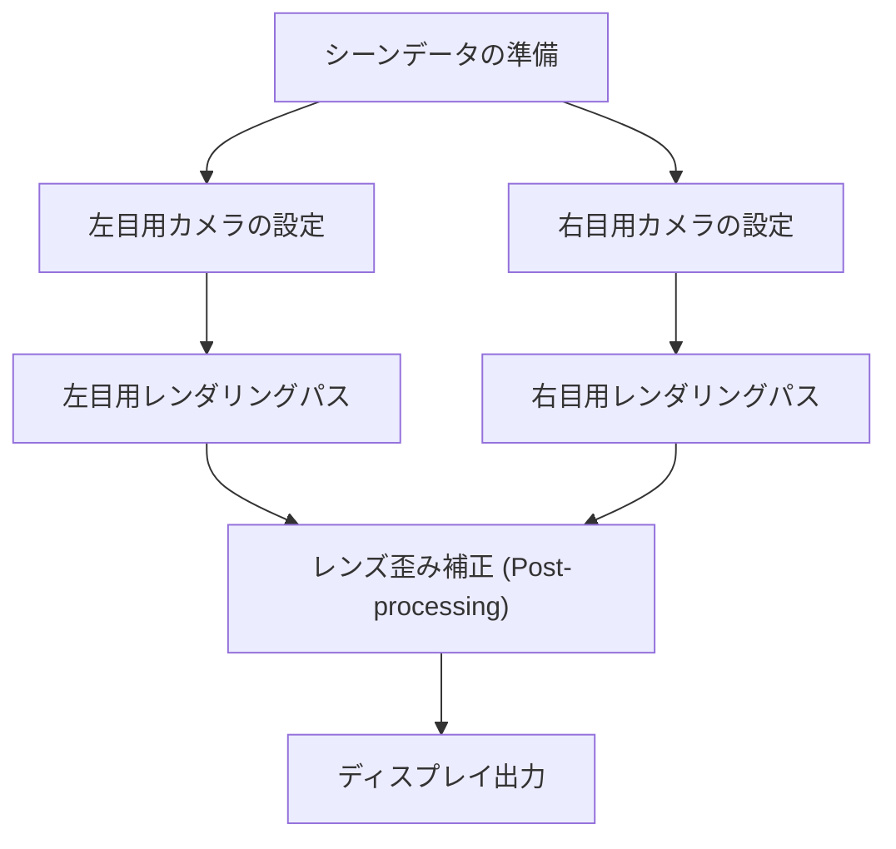
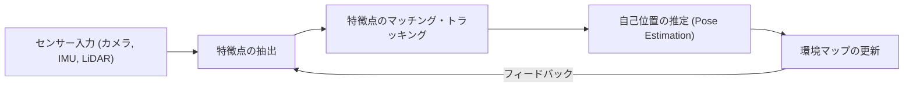

# 没入型体験を支えるレンダリング技術の最前線

AR（拡張現実）とVR（仮想現実）は、もはやSFの世界の技術ではありません。産業、医療、エンターテインメント、そして日常生活に至るまで、私たちの世界を根本から変革しつつあります。しかし、これらの技術が真の「没入感」を提供するためには、人間の脳を完全に騙すほどの精巧な映像生成とトラッキングが必要です。

本記事では、ARおよびVRを支える中核技術であるレンダリングの仕組み、空間認識技術、そして最新の計算量削減手法について、深く掘り下げて解説します。

## VRにおける両眼立体視（ステレオレンダリング）の仕組み

人間が立体を認識する主要な要因の一つが「両眼視差」です。右目と左目は数センチ離れているため、それぞれわずかに異なる角度から世界を見ています。VRヘッドセットは、この両眼視差を人工的に作り出すことで、平面のディスプレイに奥行きを生み出します。

### ステレオレンダリングのパイプライン

ステレオレンダリングでは、基本的に同じシーンを左目用と右目用の2回レンダリングする必要があります。

単純に2回レンダリングすると計算コストが2倍になるため、現代のグラフィックスAPI（Vulkan、DirectX 12など）やゲームエンジンは、Single Pass Stereo（シングルパスステレオ）やMultiviewといった最適化技術を採用しています。これにより、ジオメトリの処理を1回で済ませ、ピクセルシェーダーの段階でのみ左右の差異を計算することで、大幅なパフォーマンス向上が図られています。

## Motion-to-Photonレイテンシの重要性とVR酔い

VRにおいて最もクリティカルな指標の一つが「Motion-to-Photonレイテンシ」です。これは、ユーザーが頭を動かしてから、その動きを反映した映像がディスプレイ（光子＝Photon）として目に届くまでの遅延時間を指します。

### VR酔い（シミュレーターシック）のメカニズム

人間の前庭覚（三半規管などによる平衡感覚）と視覚情報にズレが生じると、脳は混乱をきたし、吐き気やめまいといった「VR酔い」を引き起こします。一般的に、Motion-to-Photonレイテンシが20ミリ秒（ms）を超えると、人間はこのズレを知覚しやすくなると言われています。

レイテンシを削減するためのアプローチとして、以下のような技術が用いられています。

- **Asynchronous Timewarp (ATW)**: フレームレートが低下した場合でも、最新の頭の回転情報を用いて、すでにレンダリングされた画像を歪ませることで、視覚的な遅延を隠蔽する技術。
- **Asynchronous Spacewarp (ASW)**: 回転だけでなく、頭の並進移動（位置の変化）も予測し、中間フレームを生成する技術。

## ARにおけるSLAMと環境マッピング

VRが完全に人工的な仮想世界を描画するのに対し、ARは現実世界の上にデジタル情報を重ね合わせます。そのためには、デバイスが「自分自身が現実世界のどこにいるのか」を正確に把握する必要があります。これを実現する中核技術がSLAM（Simultaneous Localization and Mapping）です。

### SLAMの基本原理

SLAMは、未知の環境を移動しながら、自己位置の推定（Localization）と環境地図の作成（Mapping）を同時に行う技術です。

スマートフォン（ARKit, ARCore）やARグラスは、Visual-Inertial SLAM（VI-SLAM）と呼ばれる手法を主に用います。これは、カメラからの視覚情報と、IMU（慣性計測装置）からの加速度・角速度情報を統合（センサーフュージョン）することで、高速かつ高精度なトラッキングを実現するものです。近年では、LiDARスキャナを搭載したデバイスも普及し、暗所や特徴点のない壁などでも安定したマッピングが可能になっています。

## アイトラッキングとフォービエイテッド・レンダリング

ディスプレイの解像度が4K、8Kと向上するにつれ、GPUへの負荷は指数関数的に増大します。この限界を突破するためのブレイクスルーとして注目されているのが「フォービエイテッド・レンダリング（Foveated Rendering：中心窩レンダリング）」です。

### 人間の視覚特性を利用した最適化

人間の目（網膜）において、最も解像度が高く色を鮮明に認識できるのは「中心窩（Fovea）」と呼ばれるごく狭い領域（視野角にして約1〜2度）だけです。周辺視野は動きには敏感ですが、解像度や色の識別能力は著しく低下します。

フォービエイテッド・レンダリングは、この特性を逆手に取り、ユーザーが見つめている中心部分のみを高解像度でレンダリングし、周辺部分の解像度を意図的に下げる技術です。

1. **アイトラッキング**: ヘッドセットに内蔵された赤外線カメラが、ユーザーの瞳孔の動きをミリ秒単位で追跡します。
2. **可変レートシェーディング (VRS)**: アイトラッキングのデータに基づき、画面を複数の領域に分割し、中心部は1ピクセルごとにシェーダーを計算、周辺部は複数のピクセルをまとめて計算します。

これにより、ユーザーには視覚的な品質低下を感じさせることなく、レンダリングの計算負荷を劇的に削減（場合によっては50%以上）することが可能になります。

## まとめ

AR・VRのレンダリング技術は、ハードウェアの進化とソフトウェアの最適化が密接に絡み合いながら発展しています。ステレオレンダリングの効率化、レイテンシの極限までの削減、SLAMによる高度な空間認識、そしてアイトラッキングを活用した計算量の削減など、これらの技術の集合体が、私たちの脳を騙し、深い没入感を生み出しています。

今後、AI（機械学習）を活用したニューラルレンダリングや、より軽量・低消費電力なディスプレイ技術が登場することで、AR・VRはさらに日常に溶け込んだ当たり前のインフラへと進化していくことでしょう。
