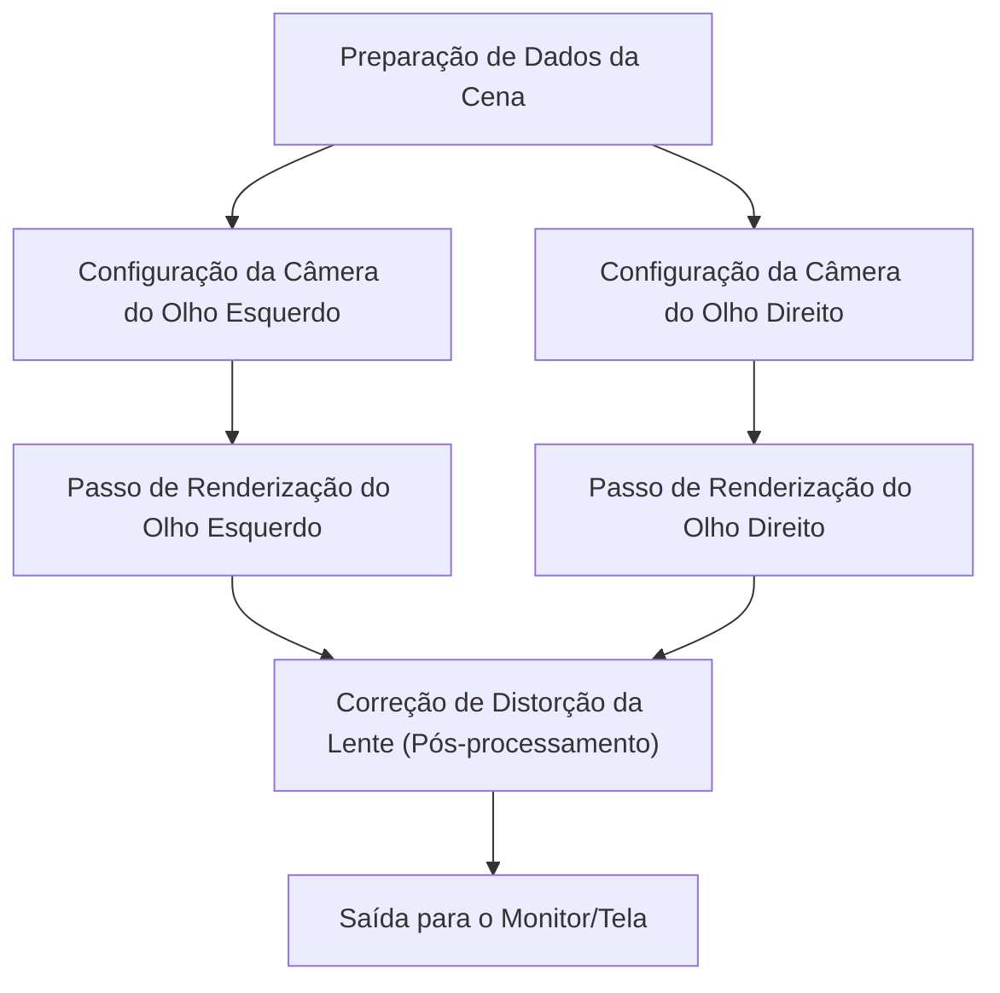
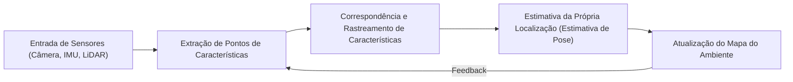

# A Vanguarda da Tecnologia de Renderização que Sustenta Experiências Imersivas

A Realidade Aumentada (AR) e a Realidade Virtual (VR) não são mais tecnologias restritas ao universo da ficção científica. Desde a indústria, medicina e entretenimento até a nossa vida cotidiana, elas estão transformando fundamentalmente o nosso mundo. No entanto, para que essas tecnologias proporcionem uma sensação de "imersão" verdadeiramente autêntica, é necessária uma geração de imagens e um rastreamento tão refinados e precisos que sejam capazes de enganar completamente o cérebro humano.

Neste artigo, exploraremos a fundo e detalharemos o funcionamento da renderização, que é a tecnologia central por trás da AR e da VR, além das tecnologias de reconhecimento espacial e dos métodos mais recentes de redução da complexidade computacional e de custos de processamento.

## O Mecanismo da Visão Estereoscópica Binocular (Renderização Estéreo) na VR

Um dos principais fatores que permitem aos seres humanos reconhecer volumes e objetos tridimensionais é a "disparidade binocular". Como o olho direito e o olho esquerdo estão separados por alguns centímetros, cada um vê o mundo de ângulos ligeiramente diferentes. Os headsets de VR criam artificialmente essa disparidade binocular, gerando a ilusão de profundidade e tridimensionalidade em uma tela que, na realidade, é bidimensional.

### O Pipeline da Renderização Estéreo

Na renderização estéreo (ou renderização estereoscópica), o princípio básico exige que a mesma cena seja renderizada duas vezes: uma vez para a perspectiva do olho esquerdo e outra para a perspectiva do olho direito.

Se a renderização for feita simplesmente duas vezes de forma ingênua, o custo computacional será duplicado. Portanto, as APIs gráficas modernas (como Vulkan, DirectX 12, entre outras) e os motores de jogos (game engines) atuais adotam técnicas avançadas de otimização, como o Single Pass Stereo (Estéreo de Passagem Única) e o Multiview. Com essas tecnologias, o processamento da geometria da cena é realizado apenas uma vez, e as diferenças entre a visão esquerda e direita são calculadas apenas na fase do pixel shader, o que resulta em melhorias drásticas e significativas no desempenho geral do sistema.

## A Importância da Latência Motion-to-Photon e o Enjoo na VR

Na Realidade Virtual, um dos indicadores e métricas mais críticos para o sucesso da imersão é a "Latência Motion-to-Photon" (Latência de Movimento para Fóton). Isso se refere ao tempo de atraso (delay) entre o momento em que o usuário move a sua cabeça e o exato momento em que a imagem refletindo esse movimento chega aos olhos do usuário através da tela (sendo os fótons de luz).

### O Mecanismo do Enjoo na VR (Simulator Sickness)

Quando ocorre uma discrepância entre o sistema vestibular humano (o sentido de equilíbrio gerado pelos canais semicirculares do ouvido interno) e a informação visual recebida, o cérebro entra em um estado de confusão. Isso provoca o chamado "Enjoo na VR", o qual se manifesta através de sintomas desconfortáveis como náuseas e tonturas. Em geral, afirma-se que, se a latência Motion-to-Photon exceder o limite de 20 milissegundos (ms), torna-se muito mais fácil para o ser humano perceber ativamente essa defasagem, agravando os sintomas.

Como abordagens para mitigar e reduzir essa latência, tecnologias como as descritas abaixo são amplamente utilizadas:

- **Asynchronous Timewarp (ATW - Distorção Temporal Assíncrona)**: Uma técnica revolucionária na qual, mesmo quando ocorre uma queda na taxa de quadros (frame rate), as informações mais recentes da rotação da cabeça do usuário são utilizadas para distorcer a imagem que já havia sido renderizada, ocultando efetivamente o atraso visual.
- **Asynchronous Spacewarp (ASW - Distorção Espacial Assíncrona)**: Indo um passo além do ATW, essa tecnologia prevê não apenas a rotação, mas também a translação da cabeça (mudanças e deslocamentos de posição espacial), gerando quadros intermediários sintéticos para manter a fluidez visual sem precisar renderizar a cena complexa desde o início.

## SLAM e Mapeamento Ambiental na Realidade Aumentada (AR)

Enquanto a VR desenha e concebe um mundo virtual inteiramente artificial, a AR, por sua vez, sobrepõe informações e elementos digitais diretamente sobre o mundo real. Para que isso ocorra de forma convincente, o dispositivo precisa compreender com extrema precisão "onde ele próprio está localizado no ambiente físico do mundo real". A tecnologia fundamental e central que viabiliza isso é o SLAM (Simultaneous Localization and Mapping - Localização e Mapeamento Simultâneos).

### O Princípio Básico do SLAM

SLAM é a técnica de realizar simultaneamente a estimativa da própria localização do dispositivo (Localization) e a construção e mapeamento do ambiente ao redor (Mapping), enquanto o usuário se desloca por um ambiente previamente desconhecido.

Smartphones modernos (utilizando frameworks como ARKit ou ARCore) e óculos de AR empregam majoritariamente um método denominado Visual-Inertial SLAM (VI-SLAM). Este processo integra os dados visuais capturados pela câmera com os dados de aceleração e velocidade angular coletados pelo IMU (Unidade de Medida Inercial), realizando uma "fusão de sensores" (sensor fusion) que permite um rastreamento de alta velocidade e precisão extrema. Nos últimos anos, a adoção de dispositivos equipados com scanners LiDAR vem se popularizando muito, possibilitando um mapeamento excepcionalmente estável mesmo em ambientes com baixa luminosidade ou ao analisar paredes lisas que carecem de pontos de referência visuais (features).

## Eye Tracking (Rastreamento Ocular) e Renderização Foveated

À medida que a resolução das telas avança e melhora, saltando rapidamente para 4K, 8K e além, a carga de processamento exigida das GPUs (Unidades de Processamento Gráfico) aumenta de maneira quase que exponencial. Como uma descoberta e solução inovadora para superar esses limites físicos e térmicos de processamento, a "Renderização Foveated" (Foveated Rendering, ou Renderização Foveal) está recebendo grande atenção da indústria.

### Otimização Baseada nas Características da Visão Humana

No olho humano (mais especificamente na retina), a área onde conseguimos perceber imagens com a mais alta resolução e as cores de forma mais nítida e vibrante se concentra em uma região minúscula chamada "Fóvea" (abrangendo um ângulo de visão de cerca de apenas 1 a 2 graus). A nossa visão periférica, embora seja extremamente sensível e reativa a movimentos bruscos, sofre de uma queda vertiginosa em sua capacidade de identificar resoluções altas e distinguir detalhes ou cores com clareza.

A renderização Foveated subverte essa limitação biológica a seu favor: ela renderiza exclusivamente a região central para a qual o usuário está ativamente olhando em altíssima resolução, enquanto reduz intencional e drasticamente a resolução das áreas periféricas da visão.

1. **Rastreamento Ocular (Eye Tracking)**: Câmeras infravermelhas embutidas no interior do headset de VR/AR monitoram e rastreiam o movimento milimétrico das pupilas do usuário de forma contínua e em questão de milissegundos.
2. **Variable Rate Shading (VRS - Sombreamento de Taxa Variável)**: Com base nos dados fornecidos pelo rastreamento ocular, a tela é dinamicamente dividida em múltiplas regiões e zonas distintas. Na região central (foco visual), os cálculos do shader são processados pixel a pixel, entregando máxima fidelidade. Já nas regiões periféricas, o cálculo de sombreamento é aglomerado, processando múltiplos pixels simultaneamente em um único bloco de cálculo.

Através desse método altamente engenhoso, torna-se viável reduzir drasticamente a carga e o estresse computacional da renderização (em muitos cenários, reduzindo-a em 50% ou até mais), sem que o usuário sequer perceba qualquer degradação na qualidade visual ou na fidelidade gráfica da experiência.

## Conclusão

As tecnologias de renderização de AR e VR estão passando por um desenvolvimento acelerado e contínuo, caracterizado pelo entrelaçamento profundo entre as inovações no hardware e as otimizações no software. A soma e o amálgama de todas essas inovações — como as melhorias e eficiência na renderização estereoscópica, a minimização extrema da latência de exibição, a compreensão espacial altamente avançada impulsionada pelo SLAM e a gigantesca economia de poder computacional viabilizada pelo rastreamento ocular — são as ferramentas fundamentais que permitem enganar perfeitamente nossos cérebros, concebendo, por fim, um sentimento imersivo tão intenso e inabalável.

Para o futuro, com o advento iminente da renderização neural através do emprego massivo da Inteligência Artificial (Machine Learning), aliada à emergência de displays muito mais leves e com um consumo de energia notavelmente inferior, a AR e a VR não apenas continuarão evoluindo, mas irão se metamorfosear em infraestruturas fundamentais da sociedade, integrando-se de forma tão onipresente em nosso cotidiano a ponto de tornarem-se imperceptíveis.
