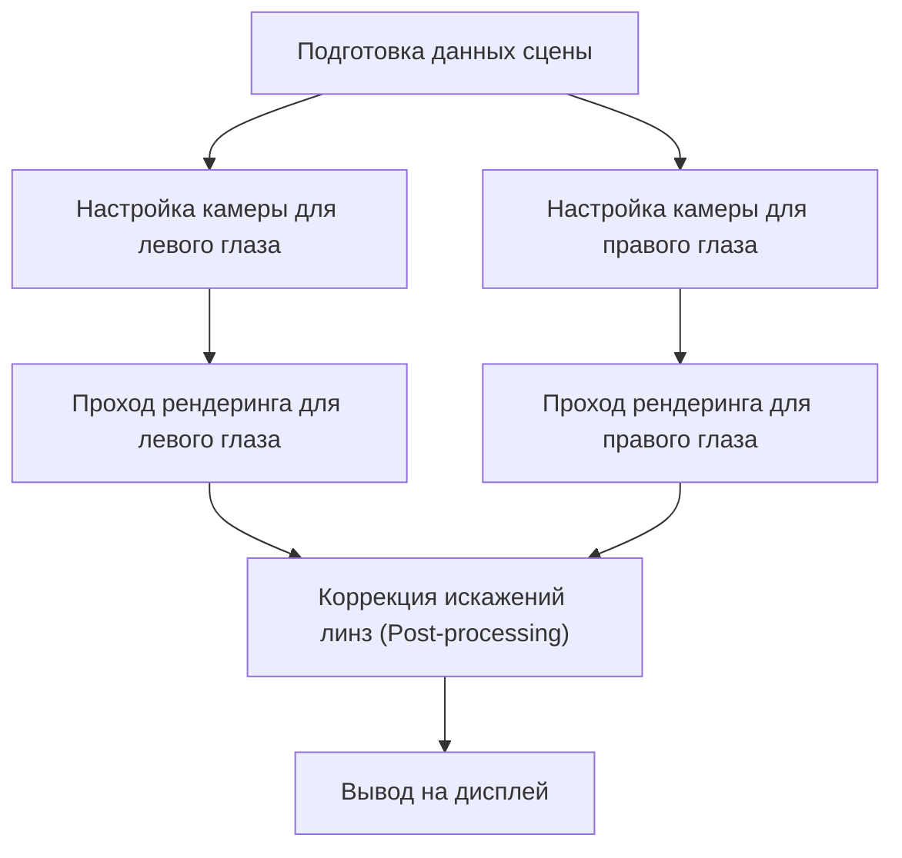
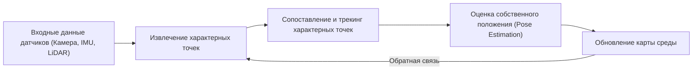

# Передовые технологии рендеринга, лежащие в основе иммерсивных впечатлений

Дополненная реальность (AR) и виртуальная реальность (VR) больше не являются технологиями из области научной фантастики. Они фундаментально трансформируют наш мир, находя применение в промышленности, медицине, индустрии развлечений и даже в нашей повседневной жизни. Однако для того чтобы эти технологии могли обеспечить по-настоящему глубокое чувство "погружения" (иммерсивности), необходимы невероятно сложные системы генерации изображений и пространственного трекинга, способные практически полностью обмануть человеческий мозг.

В этой статье мы подробно и глубоко рассмотрим механизмы рендеринга, являющиеся ключевыми технологиями для AR и VR, методы пространственного распознавания, а также новейшие подходы к снижению вычислительной нагрузки.

## Механизм бинокулярного стереоскопического зрения (стереорендеринг) в VR

Одним из основных факторов, позволяющих человеку воспринимать трехмерность пространства, является "бинокулярный параллакс" (или бинокулярная диспаратность). Поскольку наши правый и левый глаза разнесены на несколько сантиметров друг от друга, каждый из них видит окружающий мир под немного разным углом. VR-гарнитуры создают этот бинокулярный параллакс искусственным путем, тем самым генерируя иллюзию глубины на совершенно плоских дисплеях.

### Пайплайн стереорендеринга

В традиционном конвейере стереорендеринга, по сути, требуется выполнить рендеринг одной и той же сцены дважды: один раз для левого глаза и один раз для правого.

Поскольку простой двойной рендеринг приводит к удвоению вычислительных затрат, современные графические API (такие как Vulkan, DirectX 12) и игровые движки внедряют технологии оптимизации, такие как Single Pass Stereo (однопроходное стерео) и Multiview. Благодаря этим методам обработка геометрии сцены выполняется только один раз, а различия между правым и левым глазом вычисляются исключительно на этапе пиксельных шейдеров, что приводит к значительному повышению общей производительности.

## Важность задержки Motion-to-Photon и проблема укачивания в VR

Одним из самых критических и строго контролируемых показателей в виртуальной реальности является задержка от движения до фотона ("Motion-to-Photon latency"). Это время, которое проходит с момента, когда пользователь поворачивает голову, до того мгновения, когда изображение, отражающее это движение, достигает его глаз в виде света (фотонов) на дисплее.

### Механизм VR-укачивания (симуляторной болезни)

Когда возникает расхождение (рассинхронизация) между информацией от вестибулярного аппарата человека (чувство равновесия, обеспечиваемое полукружными каналами во внутреннем ухе) и визуальной информацией, мозг испытывает дезориентацию, что приводит к так называемому "VR-укачиванию", сопровождающемуся тошнотой и головокружением. Как правило, считается, что если задержка Motion-to-Photon превышает 20 миллисекунд (мс), человек начинает легко воспринимать это расхождение.

Для радикального снижения этой задержки применяются следующие передовые технологии:

- **Asynchronous Timewarp (ATW - Асинхронное искажение времени)**: Технология, которая скрывает визуальные задержки путем деформации уже отрендеренного изображения с использованием самых последних данных о вращении головы пользователя, даже если частота кадров в приложении падает.
- **Asynchronous Spacewarp (ASW - Асинхронное пространственное искажение)**: Более продвинутая технология, которая экстраполирует и предсказывает не только вращение, но и трансляционное движение головы (изменение положения в пространстве), генерируя промежуточные синтетические кадры для поддержания плавности.

## SLAM и картирование среды в дополненной реальности (AR)

В то время как VR отрисовывает полностью искусственный виртуальный мир, AR накладывает цифровую информацию поверх реального физического мира. Для этого устройству необходимо предельно точно понимать, "где именно оно находится в реальном мире". Ключевой технологией, реализующей эту задачу, является SLAM (Simultaneous Localization and Mapping — Одновременная локализация и построение карты).

### Базовые принципы SLAM

SLAM — это комплексная технология, позволяющая устройству перемещаться в неизвестной среде, одновременно оценивая свое собственное положение (Localization) и создавая карту окружающего пространства (Mapping).

Смартфоны (использующие ARKit, ARCore) и AR-очки в основном применяют метод, называемый Visual-Inertial SLAM (VI-SLAM). Этот метод объединяет (выполняет слияние данных датчиков или sensor fusion) визуальную информацию с камер и данные об ускорении и угловой скорости с IMU (инерциального измерительного модуля) для обеспечения высокоскоростного и высокоточного трекинга. В последние годы широкое распространение получили устройства, оснащенные сканерами LiDAR, что делает возможным стабильное построение карт даже в условиях плохой освещенности или при столкновении с гладкими стенами без выраженных текстурных особенностей.

## Отслеживание взгляда (Eye Tracking) и фовеальный рендеринг (Foveated Rendering)

По мере того как разрешение дисплеев неуклонно растет до 4K, 8K и выше, вычислительная нагрузка на графические процессоры (GPU) увеличивается по экспоненте. Технологией прорыва, привлекающей огромное внимание для преодоления этого барьера производительности, является "фовеальный рендеринг" (Foveated Rendering).

### Оптимизация, использующая особенности зрительной системы человека

В человеческом глазу (на сетчатке) только крошечная область, называемая "центральной ямкой" или "фовеа" (Fovea), занимающая около 1-2 градусов поля зрения, обладает способностью воспринимать изображение с максимальным разрешением и четко различать цвета. Периферическое зрение, хотя и очень чувствительно к движению, имеет значительно сниженную способность различать детали и цвета.

Фовеальный рендеринг — это технология, которая обращает эту физиологическую особенность в преимущество. Она рендерит с максимальным разрешением только ту центральную область, куда направлен взгляд пользователя, и намеренно снижает разрешение на периферии.

1. **Отслеживание взгляда (Eye Tracking)**: Инфракрасные камеры, встроенные в гарнитуру, с миллисекундной точностью отслеживают микродвижения зрачков пользователя.
2. **Шейдинг с переменной частотой (Variable Rate Shading, VRS)**: На основе данных трекинга взгляда экран делится на несколько зон. В центральной зоне вычисления шейдеров выполняются для каждого отдельного пикселя, в то время как в периферийных зонах вычисления производятся для групп пикселей (блоками).

Благодаря этому подходу можно радикально снизить вычислительную нагрузку на рендеринг (в некоторых случаях более чем на 50%), причем пользователь не заметит никакого визуального ухудшения качества изображения.

## Заключение

Технологии рендеринга для AR и VR развиваются благодаря тесному переплетению эволюции аппаратного обеспечения и программной оптимизации. Повышение эффективности стереорендеринга, максимальное снижение задержек (latency), продвинутое пространственное распознавание с помощью SLAM и радикальное сокращение вычислительных затрат за счет использования трекинга взгляда — совокупность всех этих технологий позволяет обмануть наш мозг и создать глубокое чувство иммерсивности.

В будущем, с появлением нейронного рендеринга на базе искусственного интеллекта (машинного обучения), а также более легких дисплеев со сверхнизким энергопотреблением, технологии AR и VR будут развиваться еще быстрее, превращаясь в привычную и неотъемлемую инфраструктуру, плавно интегрированную в нашу повседневную жизнь.
