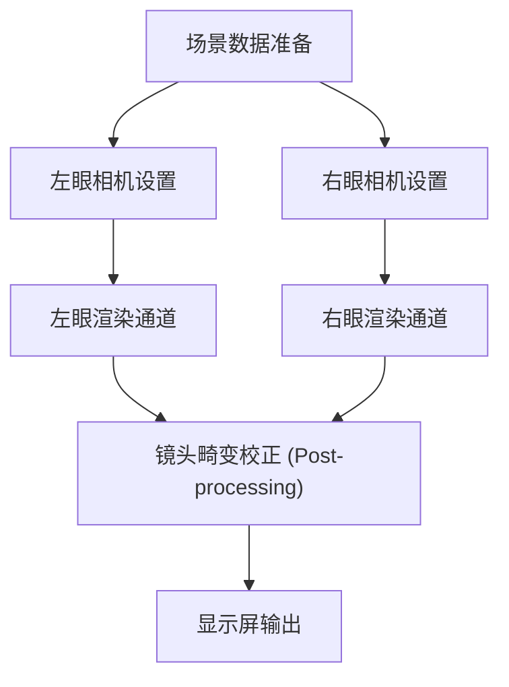
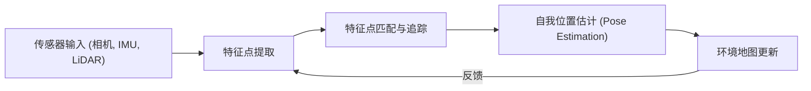

# 支撑沉浸式体验的渲染技术最前沿

AR（增强现实）与VR（虚拟现实）已不再是科幻小说中的技术。从工业、医疗、娱乐到日常生活的方方面面，它们正在从根本上改变我们的世界。然而，为了让这些技术提供真正的“沉浸感”，必须具备能够完全欺骗人类大脑的极其精密的图像生成和追踪技术。

本文将深入探讨支撑AR和VR的核心技术——渲染机制、空间感知技术，以及最新的降低计算量的方法。

## VR中的双眼立体视觉（立体渲染）机制

人类感知立体感的主要因素之一是“双眼视差”。由于左眼和右眼相距几厘米，它们各自从稍微不同的角度观察世界。VR头显通过人工方式制造这种双眼视差，从而在平面的显示屏上产生深度感。

### 立体渲染管线

在立体渲染中，基本上需要将同一个场景分别为左眼和右眼进行两次渲染。

如果仅仅是简单地进行两次渲染，计算成本将会翻倍，因此现代图形API（如Vulkan、DirectX 12等）和游戏引擎采用了Single Pass Stereo（单通道立体渲染）或Multiview等优化技术。通过这些技术，几何图形的处理只需进行一次，仅仅在像素着色器阶段计算左右眼的差异，从而大幅提升了性能。

## 动到光延迟（Motion-to-Photon Latency）的重要性与VR晕动症

在VR中最关键的指标之一是“动到光延迟（Motion-to-Photon Latency）”。它指的是从用户转动头部开始，到反映该动作的图像作为光子（Photon）到达用户眼睛所经历的延迟时间。

### VR晕动症（模拟器眩晕）的机制

当人类的前庭系统（主要依靠半规管维持的平衡感）与视觉信息产生偏差时，大脑会产生混乱，从而引发恶心、眩晕等“VR晕动症”。一般来说，如果动到光延迟超过20毫秒（ms），人类就很容易察觉到这种偏差。

为了减少延迟，业界通常采用以下技术：

- **异步时间扭曲 (Asynchronous Timewarp, ATW)**：即使在帧率下降的情况下，也能利用最新的头部旋转信息，对已经渲染好的图像进行扭曲处理，从而掩盖视觉上的延迟。
- **异步空间扭曲 (Asynchronous Spacewarp, ASW)**：不仅预测头部的旋转，还预测头部的平移（位置的变化），并以此生成中间帧的技术。

## AR中的SLAM与环境映射

VR是渲染出一个完全人工构建的虚拟世界，而AR则是将数字信息叠加在现实世界之上。为此，设备必须准确地掌握“自己位于现实世界中的哪个位置”。实现这一目标的核心技术就是SLAM（Simultaneous Localization and Mapping，同步定位与建图）。

### SLAM的基本原理

SLAM是一种在未知环境中移动时，同时进行自我位置估计（Localization）和环境地图构建（Mapping）的技术。

智能手机（如ARKit、ARCore）或AR眼镜主要使用的是被称为视觉惯性SLAM（Visual-Inertial SLAM, VI-SLAM）的方法。这是一种将来自相机的视觉信息与来自IMU（惯性测量单元）的加速度和角速度信息进行整合（传感器融合），从而实现高速且高精度追踪的技术。近年来，搭载LiDAR扫描仪的设备也越来越普及，即使在暗处或者缺乏特征点的墙壁前，也能实现稳定的地图构建。

## 眼动追踪与注视点渲染

随着显示器分辨率不断提升至4K、8K，GPU的负载呈指数级增长。作为突破这一瓶颈的关键技术，备受瞩目的是“注视点渲染（Foveated Rendering，中心凹渲染）”。

### 利用人类视觉特性的优化

在人类的眼睛（视网膜）中，分辨率最高、能够清晰辨识颜色的区域是被称为“中央凹（Fovea）”的极小区域（视角大约只有1到2度）。虽然周边视觉对运动非常敏感，但其分辨率和颜色辨识能力则显著下降。

注视点渲染正是反过来利用了这一特性，仅仅对用户正在注视的中心区域进行高分辨率渲染，而有意降低周边区域的渲染分辨率。

1. **眼动追踪**：头显内嵌的红外相机以毫秒级精度追踪用户瞳孔的运动。
2. **可变速率着色 (Variable Rate Shading, VRS)**：基于眼动追踪的数据，将屏幕划分为多个区域，中心区域每个像素独立计算着色器，而周边区域则将多个像素合并在一起进行计算。

通过这种方式，在不让用户感受到视觉质量下降的前提下，能够显著降低渲染的计算负载（在某些情况下甚至可以降低50%以上）。

## 总结

AR和VR的渲染技术是在硬件演进与软件优化相互交织中不断发展的。立体渲染的效率提升、极力压缩的延迟、基于SLAM的高级空间感知能力，以及利用眼动追踪降低计算量等，正是这些技术的集大成者，才成功地欺骗了我们的大脑，创造出深度的沉浸感。

未来，随着利用AI（机器学习）的神经渲染技术，以及更轻量、更低功耗的显示技术的出现，AR和VR必将进一步演变成为完全融入我们日常生活的理所当然的基础设施。
