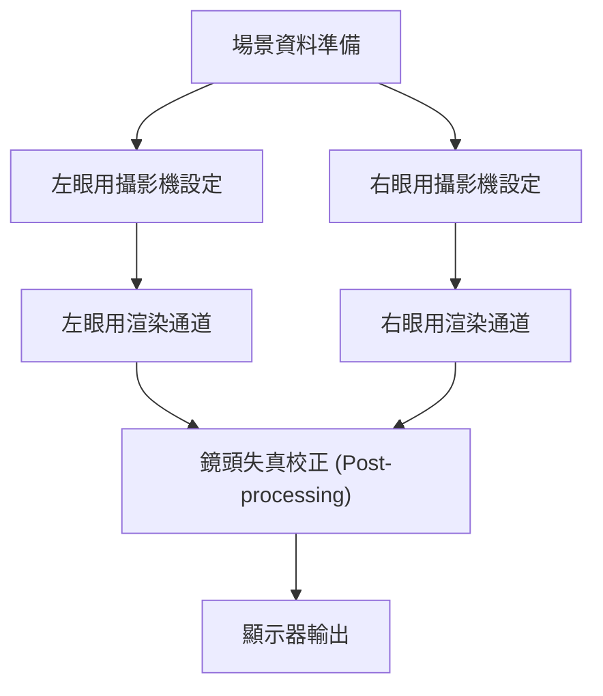
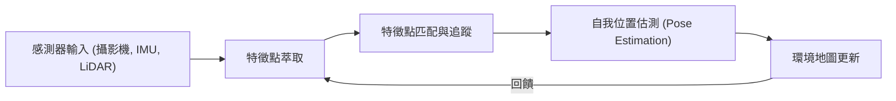

# 支撐沉浸式體驗的渲染技術最前線

AR（擴增實境）與 VR（虛擬實境）早已不再是科幻世界中的技術。從工業、醫療、娛樂到我們的日常生活，它們正在從根本上改變我們的世界。然而，為了讓這些技術提供真正的「沉浸感」，必須要有精巧到足以完全欺騙人類大腦的影像生成與追蹤技術。

本篇文章將針對支撐 AR 與 VR 的核心技術——渲染機制的運作原理、空間感知技術，以及最新的運算量縮減手法，進行深入的探討與解說。

## VR 中的雙眼立體視覺（立體渲染）機制

人類之所以能夠認知立體空間，其中一個主要因素就是「雙眼視差」。由於我們的右眼與左眼相距約數公分，因此雙眼所看見的世界在角度上會有著些微的差異。VR 頭戴式裝置正是透過人工方式重現這種雙眼視差，進而在平面的顯示器上創造出深度的空間感。

### 立體渲染的管線 (Pipeline)

在立體渲染中，基本上必須針對同一個場景分別進行左眼用與右眼用的兩次渲染。

如果單純只是進行兩次渲染，運算成本將會翻倍。因此，現代的圖形 API（如 Vulkan、DirectX 12 等）與遊戲引擎，皆採用了 Single Pass Stereo（單通道立體渲染）或 Multiview 等最佳化技術。透過這些技術，幾何圖形的處理只需執行一次，並且僅在像素著色器 (Pixel Shader) 階段計算左右眼的差異，藉此大幅提升整體的效能表現。

## Motion-to-Photon 延遲的重要性與 VR 暈眩

在 VR 領域中，最關鍵的指標之一就是「Motion-to-Photon 延遲 (Latency)」。這指的是從使用者轉動頭部開始，直到反映該動作的影像作為顯示器上的光子 (Photon) 傳達至眼睛為止的延遲時間。

### VR 暈眩（模擬器暈眩）的機制

當人類的前庭覺（如半規管所掌控的平衡感）與視覺情報產生落差時，大腦便會感到混亂，進而引發噁心或暈眩等所謂的「VR 暈眩」。一般來說，當 Motion-to-Photon 延遲超過 20 毫秒 (ms) 時，人類就容易察覺到這種落差。

為了減少這種延遲，目前業界使用了以下幾種技術方法：

- **Asynchronous Timewarp (ATW)**: 即使幀率 (Frame rate) 下降，也能利用最新的頭部旋轉資訊，將已渲染好的圖像進行扭曲變形，藉此掩蓋視覺上延遲的技術。
- **Asynchronous Spacewarp (ASW)**: 不僅考慮旋轉，還預測頭部的平移運動（位置的改變），進而生成中間幀的技術。

## AR 中的 SLAM 與環境建圖

相較於 VR 描繪出一個完全人工的虛擬世界，AR 則是將數位資訊疊加在現實世界之上。為此，裝置必須精確地掌握「自己處於現實世界中的哪個位置」。實現這一點的核心技術即為 SLAM（Simultaneous Localization and Mapping，同步定位與建圖）。

### SLAM 的基本原理

SLAM 是一種在未知的環境中移動時，同時進行自我位置估測 (Localization) 與建立環境地圖 (Mapping) 的技術。

智慧型手機（如 ARKit, ARCore）或 AR 眼鏡主要採用稱為 Visual-Inertial SLAM (VI-SLAM) 的方法。這種方法透過整合（感測器融合）來自攝影機的視覺資訊，以及來自 IMU（慣性測量單元）的加速度與角速度資訊，實現了高速且高精度的追蹤能力。近年來，搭載 LiDAR 掃描儀的裝置也逐漸普及，使得即使在暗處或缺乏特徵點的牆面上，也能進行穩定的環境建圖。

## 眼動追蹤與注視點渲染 (Foveated Rendering)

隨著顯示器解析度提升至 4K、8K，GPU 的負載也呈指數級增加。為了突破這項瓶頸，目前備受矚目的技術突破便是「注視點渲染（Foveated Rendering，又稱中心窩渲染）」。

### 利用人類視覺特性的最佳化

在人類的眼睛（視網膜）中，解析度最高、對色彩認知最鮮明的區域，僅限於被稱為「中心窩 (Fovea)」的極狹窄區域（視角約僅有 1 到 2 度）。雖然周邊視野對於運動的物體非常敏感，但其解析度與色彩辨識能力卻會顯著下降。

注視點渲染便是反向利用了這項特性，僅針對使用者所注視的中心區域進行高解析度渲染，並刻意降低周邊視野的解析度。

1. **眼動追蹤**: 內建於頭戴式裝置中的紅外線攝影機會以毫秒級的精度追蹤使用者的瞳孔運動。
2. **可變速率著色 (VRS)**: 根據眼動追蹤的數據，將畫面分割為多個區域，中心部分針對每個像素個別計算著色器，而周邊部分則將多個像素合併起來進行計算。

透過這種方式，使用者在視覺上不會感受到任何品質的下降，同時卻能大幅減少渲染時的運算負擔（在某些情況下甚至可減少 50% 以上）。

## 總結

AR 與 VR 的渲染技術，是在硬體進化與軟體最佳化相互交織之下發展起來的。立體渲染的效率化、極限縮減的延遲、透過 SLAM 實現的高階空間感知，以及活用眼動追蹤來減少運算量等，這些技術的集合體成功地欺騙了我們的大腦，創造出極具深度的沉浸感。

展望未來，隨著運用 AI（機器學習）的神經渲染技術，以及更輕量、更低功耗的顯示器技術陸續問世，AR 與 VR 必將進一步進化為融入我們日常生活中、理所當然的基礎設施。
