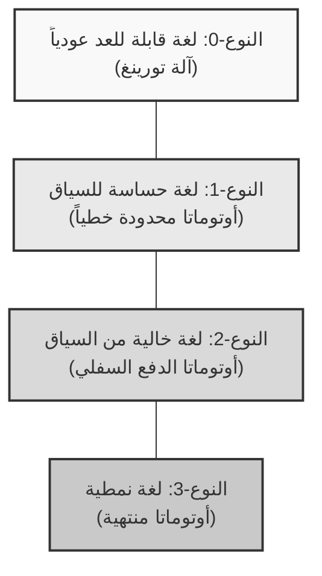
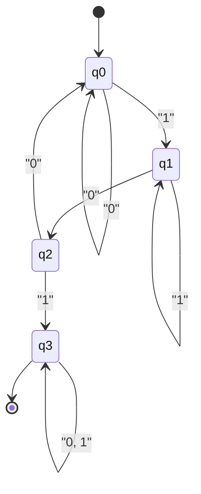
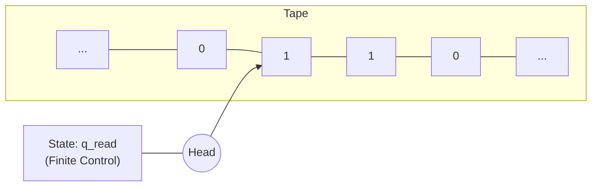

نظرية عظيمة تدعم أسس علوم الحاسوب، ألا وهي **الأوتوماتا** (Automata) و **نظرية اللغات الشكلية** (Formal Language Theory).

بدءًا من التعابير النمطية (Regular Expressions) التي نكتبها يوميًا، مرورًا بالمترجمات (Compilers) التي تقرأ الشيفرة المصدرية للغات البرمجة، وصولاً إلى معالجة اللغات الطبيعية، تعتمد كل هذه المجالات على هذه النظرية كأساس لها. في هذا المقال، سنأخذكم في رحلة إلى العالم العميق الذي يعرّف مفهوم الحوسبة نفسه بشكل رياضي ومجرد، متخذين من تصنيف تسلسل تشومسكي (Chomsky Hierarchy) محورًا لنا.

---

## 1. ما هي اللغة الشكلية؟

في مقابل "اللغات الطبيعية" مثل العربية أو الإنجليزية التي نستخدمها عادةً، تُسمى اللغة المُعرفة بدقة وفقًا لقواعد رياضية بـ **اللغة الشكلية** (Formal Language). تتكون اللغة الشكلية من العناصر الأساسية التالية.

### الأبجدية والسلاسل النصية

**الأبجدية** (Alphabet) في نظرية اللغات الشكلية هي مجموعة منتهية غير فارغة من الرموز. وعادةً ما يُرمز لها بالرمز $ \Sigma $ (سيجما).

$$
\Sigma = \{ 0, 1 \}
$$

ما سبق هو أبجدية النظام الثنائي. تُسمى سلسلة الرموز ذات الطول المنتهي والمُنشأة من هذه الأبجدية بـ **السلسلة النصية** (String) أو **الكلمة** (Word).

يُعبر عن مجموعة جميع السلاسل النصية (بما في ذلك السلسلة الفارغة $ \epsilon $) التي يمكن إنشاؤها من الأبجدية $ \Sigma $ باستخدام نجمة كلين (Kleene Star) بالرمز $ \Sigma^* $.

### تعريف اللغة

تُعرّف اللغة الشكلية $ L $ كمجموعة جزئية من $ \Sigma^* $. أي أن $ L \subseteq \Sigma^* $.

على سبيل المثال، "مجموعة السلاسل النصية المكونة من 0 و 1، والتي تنتهي دائمًا بـ 1" هي إحدى اللغات. يمكن كتابة هذه اللغة $ L $ على النحو التالي:

$$
L = \{ w1 \mid w \in \{ 0, 1 \}^* \}
$$

الهدف الرئيسي لنظرية اللغات الشكلية هو توضيح كيفية تمثيل والتعرف على هذه المجموعات اللانهائية المحتملة من السلاسل النصية (اللغات) بواسطة قواعد منتهية (قواعد نحوية) أو آلات ذات حالات منتهية (أوتوماتا).

---

## 2. تسلسل تشومسكي (Chomsky Hierarchy)

في عام 1956، صنف اللغوي نعوم تشومسكي (Noam Chomsky) اللغات الشكلية إلى أربعة مستويات بناءً على قوة القيود المفروضة على قواعد التوليد الخاصة بها. هذا هو **تسلسل تشومسكي**.

تُصنف المستويات على النحو التالي (من النوع 0 إلى النوع 3). كلما زاد الرقم، أصبحت فئة اللغات التي يمكن تمثيلها أضيق، ولكن في المقابل يسهل على الحواسيب تحليلها.



1. **النوع 3 (لغة نمطية)**: يمكن تمثيلها بالتعابير النمطية، ويمكن التعرف عليها بواسطة أوتوماتا منتهية.
2. **النوع 2 (لغة خالية من السياق)**: تُستخدم في البنية النحوية للغات البرمجة وما إلى ذلك، ويمكن التعرف عليها بواسطة أوتوماتا الدفع السفلي.
3. **النوع 1 (لغة حساسة للسياق)**: يمكن التعرف عليها بواسطة أوتوماتا محدودة خطياً.
4. **النوع 0 (لغة قابلة للعد عودياً)**: يمكن التعرف عليها بواسطة آلة تورينغ. جميع اللغات القابلة للحساب.

بدءًا من الفصل التالي، سنلقي نظرة أعمق على هذا التسلسل من الأسفل إلى الأعلى (بدءًا من النوع 3 ذي القيود القوية).

---

## 3. اللغات النمطية والأوتوماتا المنتهية (النوع 3)

### الأوتوماتا المنتهية (DFA / NFA)

الطبقة الداخلية الأعمق في تسلسل تشومسكي هي **اللغات النمطية** (Regular Languages). النموذج الحسابي الذي يتعرف على هذه اللغات هو **الأوتوماتا المنتهية** (Finite Automata, FA).

هناك نوعان من الأوتوماتا المنتهية: **DFA** (الأوتوماتا المنتهية الحتمية) حيث تكون انتقالات الحالة حتمية، و **NFA** (الأوتوماتا المنتهية غير الحتمية) وهي غير حتمية. المدهش في الأمر أنه قد ثبت أن فئة اللغات التي يمكن لهذين النوعين التعرف عليها متساوية تمامًا (DFA و NFA متكافئان).

رياضيًا، يُعرّف DFA على أنه خماسية $ M = (Q, \Sigma, \delta, q_0, F) $.

* $ Q $: مجموعة منتهية من الحالات
* $ \Sigma $: الأبجدية
* $ \delta $: دالة انتقال الحالة ($ \delta: Q \times \Sigma \rightarrow Q $)
* $ q_0 $: الحالة الابتدائية ($ q_0 \in Q $)
* $ F $: مجموعة حالات القبول (الحالات النهائية) ($ F \subseteq Q $)

#### مثال عملي: DFA يتعرف على السلاسل النصية التي تحتوي على "101"

في الأبجدية $ \Sigma = \{ 0, 1 \} $، لنفكر في DFA يتعرف على السلاسل التي تحتوي على السلسلة الجزئية "101".



لنجرب تنفيذ مخطط انتقال الحالة هذا كبرنامج بايثون (Python).

```python
class DFA:
    def __init__(self):
        self.states = {'q0', 'q1', 'q2', 'q3'}
        self.alphabet = {'0', '1'}
        self.start_state = 'q0'
        self.accept_states = {'q3'}
        
        # دالة انتقال الحالة
        self.transitions = {
            'q0': {'0': 'q0', '1': 'q1'},
            'q1': {'0': 'q2', '1': 'q1'},
            'q2': {'0': 'q0', '1': 'q3'},
            'q3': {'0': 'q3', '1': 'q3'}
        }
        
    def accepts(self, string: str) -> bool:
        current_state = self.start_state
        for char in string:
            if char not in self.alphabet:
                return False
            current_state = self.transitions[current_state][char]
        return current_state in self.accept_states

# اختبار
dfa = DFA()
test_strings = ["001010", "11101", "1001", "010", "101"]

for s in test_strings:
    result = dfa.accepts(s)
    print(f"String '{s}': {'Accepted' if result else 'Rejected'}")
```

### العلاقة مع التعابير النمطية (نظرية كلين)

**التعابير النمطية** (Regular Expression) المستخدمة في البرمجة هي طريقة لتدوين اللغات النمطية. أثبت ستيفن كلين (Stephen Kleene) النظرية القائلة بأن "تمثيل لغة ما بتعبير نمطي يكافئ التعرف عليها بواسطة أوتوماتا منتهية".

تقوم محركات التعابير النمطية في لغات البرمجة الفعلية (مثل وحدة `re` في بايثون) ببناء NFA داخليًا بناءً على نمط التعبير النمطي المعطى، وتقوم بتقييم السلاسل النصية.

### حدود توطئة الضخ (Pumping Lemma)

اللغات النمطية مفيدة جدًا، ولكن لها حدود. على سبيل المثال، "مجموعة السلاسل النصية المكونة من $ n $ من $ a $ متبوعة بـ $ n $ من $ b $" ($ L = \{ a^n b^n \mid n \ge 0 \} $) ليست لغة نمطية. وذلك لأن الأوتوماتا المنتهية لا تمتلك ذاكرة (مثل المكدس) من أجل "العد"، وبالتالي لا يمكنها تذكر عدد المرات التي ظهر فيها $ a $ إلى ما لا نهاية. الطريقة الرياضية لإثبات ذلك هي **توطئة الضخ للغات النمطية**.

---

## 4. اللغات الخالية من السياق وأوتوماتا الدفع السفلي (النوع 2)

لتمثيل مطابقة الأقواس التي لا يمكن تمثيلها باللغات النمطية، أو البنية النحوية للغات البرمجة (مثل تداخل `if-else`)، نحتاج إلى **اللغات الخالية من السياق** (Context-Free Languages, CFL).

### أوتوماتا الدفع السفلي (PDA)

النموذج الحسابي الذي يتعرف على اللغات الخالية من السياق هو **أوتوماتا الدفع السفلي** (Pushdown Automaton, PDA). PDA هو أوتوماتا منتهية مضاف إليها **مكدس** (Stack، ذاكرة الوارد أخيرًا يخرج أولاً). باستخدام المكدس، يصبح من الممكن "تذكر عدد الأقواس المفتوحة، واستهلاكها في كل مرة يأتي فيها قوس إغلاق".

#### مثال عملي: PDA يتعرف على $ a^n b^n $

لنجرب برمجة PDA في الأبجدية $ \Sigma = \{ a, b \} $ للتعرف على السلاسل النصية التي تحتوي على نفس العدد المتتالي من $ a $ و $ b $.

```python
class PDA:
    def __init__(self):
        self.stack = []
        self.state = 'q0'
        
    def accepts(self, string: str) -> bool:
        self.stack = []
        self.state = 'q_a' # حالة قراءة a
        
        for char in string:
            if self.state == 'q_a':
                if char == 'a':
                    self.stack.append('A') # الدفع إلى المكدس
                elif char == 'b':
                    self.state = 'q_b'
                    if not self.stack:
                        return False
                    self.stack.pop() # السحب من المكدس
                else:
                    return False
            elif self.state == 'q_b':
                if char == 'b':
                    if not self.stack:
                        return False
                    self.stack.pop()
                else:
                    return False
                    
        # عندما ننتهي من قراءة السلسلة النصية، إذا كان المكدس فارغاً يتم القبول
        return len(self.stack) == 0

# اختبار
pda = PDA()
print("aaabbb:", pda.accepts("aaabbb")) # True
print("aabbb:", pda.accepts("aabbb"))   # False
print("ab:", pda.accepts("ab"))         # True
print("a:", pda.accepts("a"))           # False
```

### القواعد الخالية من السياق (CFG) و BNF

تُسمى القواعد التي تولد اللغات الخالية من السياق بـ **القواعد الخالية من السياق** (Context-Free Grammar, CFG). تُعرّف CFG بواسطة $ (V, \Sigma, R, S) $.
حيث $ R $ هي مجموعة من قواعد التوليد على الشكل $ A \rightarrow \gamma $. ($ A $ هو رمز غير طرفي، و $ \gamma $ هي سلسلة من الرموز الطرفية وغير الطرفية).

**BNF** (نموذج باكوس نور - Backus-Naur Form)، والذي غالبًا ما نراه في مواصفات لغات البرمجة، هو لغة وصفية لكتابة هذه القواعد الخالية من السياق. فيما يلي مثال على BNF لتعريف تعبير رياضي.

```bnf
<expr>   ::= <expr> "+" <term> | <term>
<term>   ::= <term> "*" <factor> | <factor>
<factor> ::= "(" <expr> ")" | <number>
<number> ::= "0" | "1" | "2" | ... | "9"
```

في مرحلة **التحليل النحوي** (Parsing) للمترجم (Compiler)، يتم التحقق مما إذا كانت سلسلة الرموز المميزة (Tokens) التي تم إنشاؤها بواسطة المحلل اللفظي (Lexer) تتبع هذه القواعد الخالية من السياق، وذلك باستخدام خوارزميات تطبق مبدأ PDA (مثل تحليل LL أو تحليل LR)، لبناء شجرة النحو المجردة (AST).

---

## 5. اللغات الحساسة للسياق والأوتوماتا المحدودة خطياً (النوع 1)

يمكن للغات الخالية من السياق تمثيل معظم البنى النحوية للغات البرمجة، ولكنها لا تستطيع تمثيل القيود التي تعتمد على السياق السابق واللاحق (القيود الدلالية)، مثل "يمكن فقط استخدام المتغيرات التي تم الإعلان عنها". يتم التعامل مع هذا بواسطة **اللغات الحساسة للسياق** (Context-Sensitive Languages, CSL).

### الأوتوماتا المحدودة خطياً (LBA)

الآلة التي تتعرف على اللغات الحساسة للسياق هي **الأوتوماتا المحدودة خطياً** (Linear Bounded Automaton, LBA). LBA هو نوع من آلات تورينغ، ولكن يتميز بأن طول الشريط يقتصر على حجم يتناسب خطياً مع طول السلسلة النصية المدخلة.

المثال النموذجي للغة الحساسة للسياق هو $ L = \{ a^n b^n c^n \mid n \ge 1 \} $. نظرًا لأن PDA يمتلك مكدسًا واحدًا فقط، فيمكنه مطابقة عدد $ a $ مع $ b $، ولكنه لا يستطيع مطابقة عدد $ c $ الذي يليهما (لأنه سيقوم بعدّ $ a $ وسحبها بالكامل من المكدس). أما LBA فيمكنه التحرك ذهابًا وإيابًا على الشريط، لذا يمكنه التعرف على هذه اللغة.

يُعتقد بشكل عام أن اللغات الطبيعية (لغات البشر) أكثر تعقيدًا من اللغات الخالية من السياق، ولديها خصائص أقرب إلى اللغات الحساسة للسياق.

---

## 6. اللغات القابلة للعد عودياً وآلة تورينغ (النوع 0)

الوجهة النهائية التي نصل إليها هي **اللغات القابلة للعد عودياً** (Recursively Enumerable Languages) و **آلة تورينغ** ([Turing Machine](https://kenji.blog/ar/p/turing-machine-computability/)).

### آلة تورينغ: النموذج الحسابي المطلق

تمتلك آلة تورينغ، التي ابتكرها آلان تورينغ (Alan Turing) عام 1936، قدرة حسابية تعادل الحدود النظرية لأي حاسوب حديث (حواسيب بنية فون نيومان).

تتكون آلة تورينغ من "شريط" يمتد إلى ما لا نهاية، و"رأس" يتحرك يمينًا ويسارًا أثناء القراءة والكتابة على الشريط، وعدد منتهٍ من "الحالات".



### مشكلة التوقف ([Halting Problem](https://kenji.blog/ar/p/turing-machine-computability/))

واحدة من أهم الاكتشافات في إطار عمل آلة تورينغ هي وجود **عدم قابلية الحساب** (Undecidability).
تنص **مشكلة التوقف** الشهيرة على أنه "لا يوجد برنامج (خوارزمية) يمكنه تحديد ما إذا كان برنامج عشوائي ومدخلاته سيتوقف يومًا ما أم سيقع في حلقة لانهائية".

وهذا يوضح حدًا رياضيًا بأنه مهما صنعنا من ذكاء اصطناعي أو حواسيب قوية، فإنه "من المستحيل مطلقًا إنشاء أداة تحليل ثابتة مثالية يمكنها اكتشاف جميع الأخطاء (Bugs) والحلقات اللانهائية تلقائيًا ومسبقًا".

---

## 7. نقطة تقاطع تطوير البرمجيات الحديثة ونظرية اللغات الشكلية

النظرية التي رأيناها حتى الآن لا تقتصر أبدًا على الأبراج العاجية الأكاديمية. إنها تنشط في كل مكان في هندسة البرمجيات الحديثة.

1. **التوليد التلقائي للمحللات اللفظية (Lexer)**: تقوم أدوات مثل `Lex` و `Flex` بتحويل التعابير النمطية التي يكتبها المطورون إلى DFA، وتوليد شيفرة C سريعة تلقائيًا.
2. **التوليد التلقائي للمحللات النحوية (Parser)**: تقوم أدوات مثل `Yacc` و `Bison` بتوليد محلل LR (تطبيق لـ PDA) تلقائيًا من BNF (قواعد خالية من السياق) الذي يكتبه المطور.
3. **تحليل JSON و XML**: تعتمد عملية التحقق من صحة وتحليل صيغ البيانات هذه أيضًا على خوارزميات نظرية اللغات الشكلية.
4. **تمييز الصيغة (Syntax Highlighting) في المحررات**: تستطيع بيئات التطوير المتكاملة (IDE) تلوين الشيفرة البرمجية بسرعة لأن هناك أوتوماتا منتهية تعمل في الخلفية.

### فخ محركات التعابير النمطية (Catastrophic Backtracking)

إن محركات التعابير النمطية المدمجة في العديد من لغات البرمجة (مثل Java، Python، Ruby، JavaScript، إلخ) ليست DFA نقيًا من الناحية النظرية، بل يتم تنفيذها بناءً على NFA يرافقه تراجع (Backtracking) (أو محرك تراجع).

لهذا السبب، عند إعطاء سلسلة نصية مخادعة لنمط معين من التعابير النمطية (مثال: `(a+)+$`)، قد تنفجر التعقيدات الحسابية بشكل أسي وتتسبب في تجميد النظام، مما يؤدي إلى ثغرة أمنية تُعرف باسم **ReDoS** (Regular Expression Denial of [Service](https://kenji.blog/ar/p/kubernetes-k8s-architecture-pod-service-ingress/)). إذا كنت تعرف النظرية، فيمكنك التفكير منطقيًا في سبب حدوث التراجع وكيفية إعادة كتابة النمط ليتحول إلى معالجة آمنة مكافئة لـ DFA.

---

## الخلاصة: جماليات التجريد

تعد **الأوتوماتا ونظرية اللغات الشكلية** ذروة التجريد نحو نموذج رياضي نقي يتساءل "ما هي الحوسبة؟" و "ما هي اللغة؟"، مع استبعاد تام للبنية الفيزيائية للحاسوب (مثل وحدة المعالجة المركزية والذاكرة).

* **النوع 3 (DFA)**: آلة بدون ذاكرة (التعابير النمطية)
* **النوع 2 (PDA)**: آلة بذاكرة مكدسة (التحليل النحوي)
* **النوع 1 (LBA)**: آلة بشريط منتهٍ
* **النوع 0 (TM)**: آلة بشريط لانهائي (الحاسوب الشامل)

يتم تفكيك الشيفرة المصدرية التي نكتبها كل يوم بواسطة سرب ضخم من الأوتوماتا يُسمى المترجم (Compiler)، من النوع 2 (بنية نحوية) إلى النوع 3 (مفردات)، وتُترجم في النهاية إلى لغة الآلة.

حتى مع تغير أطر العمل السطحية واتجاهات اللغات، فإن هذا الأساس الرياضي المتين الذي يعود إلى الخمسينيات لن يتغير. من حين لآخر، عند مواجهة لغز معقد في التعابير النمطية أو عند الحصول على فرصة لكتابة محلل نحوي جديد، ما رأيك في التفكير في النظريات العظيمة لتورينغ وتشومسكي التي تقف خلفها؟
