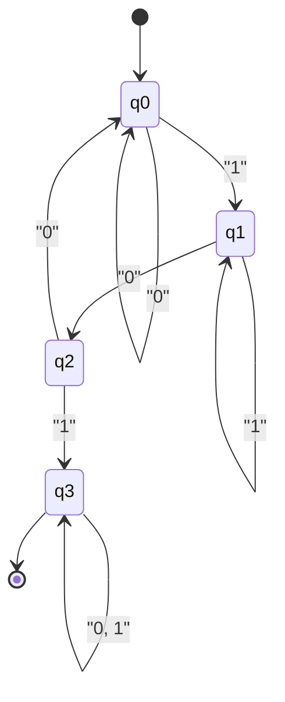

Eine der großen Theorien, die die Grundlage der Informatik bilden, ist die der **Automaten** (Automata) und der **formalen Sprachtheorie** (Formal Language Theory).

Von den regulären Ausdrücken (Regular Expressions), die wir täglich schreiben, über Compiler, die den Quellcode von Programmiersprachen entschlüsseln, bis hin zur Verarbeitung natürlicher Sprache – all dies basiert auf dieser Theorie. In diesem Artikel werden wir uns, mit der Chomsky-Hierarchie (Chomsky Hierarchy) als Leitfaden, in die tiefe Welt begeben, in der das Konzept der Berechnung selbst mathematisch und abstrakt definiert wird.

---

## 1. Was ist eine formale Sprache?

Im Gegensatz zu "natürlichen Sprachen" wie dem Deutschen oder Japanischen, die wir normalerweise verwenden, bezeichnet man eine streng nach mathematischen Regeln definierte Sprache als **formale Sprache** (Formal Language). Eine formale Sprache besteht aus den folgenden grundlegenden Bausteinen.

### Alphabet und Zeichenketten

Ein **Alphabet** (Alphabet) in der formalen Sprachtheorie ist eine nicht leere, endliche Menge von Symbolen. Normalerweise wird es mit dem Symbol $ \Sigma $ (Sigma) bezeichnet.

$$
\Sigma = \{ 0, 1 \}
$$

Das obige ist das Alphabet des Binärsystems. Eine endlich lange Folge von Symbolen, die aus diesem Alphabet erzeugt wird, nennt man eine **Zeichenkette** (String) oder ein **Wort** (Word).

Die Menge aller aus dem Alphabet $ \Sigma $ gebildeten Zeichenketten (einschließlich der leeren Zeichenkette $ \epsilon $) wird mithilfe des Kleene-Sterns (Kleene Star) als $ \Sigma^* $ geschrieben.

### Definition einer Sprache

Eine formale Sprache $ L $ ist als Teilmenge von $ \Sigma^* $ definiert. Das heißt, $ L \subseteq \Sigma^* $.

Zum Beispiel ist "die Menge aller Zeichenketten, die aus 0 und 1 bestehen und immer mit 1 enden" eine Sprache. Diese Sprache $ L $ kann wie folgt geschrieben werden:

$$
L = \{ w1 \mid w \in \{ 0, 1 \}^* \}
$$

Das Hauptziel der formalen Sprachtheorie ist es aufzuzeigen, wie solche potenziell unendlichen Mengen von Zeichenketten (Sprachen) durch endliche Regeln (Grammatiken) oder Maschinen mit endlichen Zuständen (Automaten) dargestellt und erkannt werden können.

---

## 2. Chomsky-Hierarchie (Chomsky Hierarchy)

Der Linguist Noam Chomsky klassifizierte formale Sprachen 1956 nach der Stärke der Einschränkungen ihrer Erzeugungsregeln in vier Hierarchiestufen. Dies ist die **Chomsky-Hierarchie**.

Die Hierarchie ist wie folgt klassifiziert (von Typ-0 bis Typ-3). Je höher die Zahl, desto eingeschränkter ist die Klasse der darstellbaren Sprachen, aber desto einfacher können sie von Computern analysiert werden.

```mermaid
flowchart TD
    Type0["Typ-0: Rekursiv aufzählbare Sprachen\n("Turingmaschine")"]
    Type1["Typ-1: Kontextsensitive Sprachen\n("Linear beschränkter Automat")"]
    Type2["Typ-2: Kontextfreie Sprachen\n("Kellerautomat")"]
    Type3["Typ-3: Reguläre Sprachen\n("Endlicher Automat")"]

    Type0 --- Type1
    Type1 --- Type2
    Type2 --- Type3

    style Type0 fill:#f9f9f9,stroke:#333,stroke-width:2px
    style Type1 fill:#e9e9e9,stroke:#333,stroke-width:2px
    style Type2 fill:#d9d9d9,stroke:#333,stroke-width:2px
    style Type3 fill:#c9c9c9,stroke:#333,stroke-width:2px
```

1.  **Typ-3 (Reguläre Sprachen)** : Können durch reguläre Ausdrücke dargestellt und durch endliche Automaten erkannt werden.
2.  **Typ-2 (Kontextfreie Sprachen)** : Werden unter anderem für die Syntax von Programmiersprachen verwendet und durch Kellerautomaten (Pushdown Automaton) erkannt.
3.  **Typ-1 (Kontextsensitive Sprachen)** : Werden durch linear beschränkte Automaten (Linear Bounded Automaton) erkannt.
4.  **Typ-0 (Rekursiv aufzählbare Sprachen)** : Werden durch Turingmaschinen erkannt. Alle berechenbaren Sprachen.

Im nächsten Kapitel werden wir uns diese Hierarchie von unten (beginnend mit Typ-3, der strengsten Einschränkung) genauer ansehen.

---

## 3. Reguläre Sprachen und endliche Automaten (Typ-3)

### Endlicher Automat (DFA / NFA)

Am weitesten innen in der Chomsky-Hierarchie befinden sich die **regulären Sprachen** (Regular Languages). Das Berechnungsmodell zur Erkennung dieser Sprachen ist der **endliche Automat** (Finite Automata, FA).

Bei den endlichen Automaten unterscheidet man zwischen deterministischen endlichen Automaten **DFA** (Deterministic Finite Automaton) und nichtdeterministischen endlichen Automaten **NFA** (Nondeterministic Finite Automaton). Erstaunlicherweise wurde bewiesen, dass die Klasse der Sprachen, die diese beiden erkennen können, exakt gleich ist (DFA und NFA sind äquivalent).

Mathematisch wird ein DFA als ein 5-Tupel $ M = (Q, \Sigma, \delta, q_0, F) $ definiert:

*   $ Q $ : Endliche Menge von Zuständen
*   $ \Sigma $ : Alphabet
*   $ \delta $ : [Zustand](https://kenji.blog/de/p/state-management-history-redux-context-recoil-zustand/)sübergangsfunktion ( $ \delta: Q \times \Sigma \rightarrow Q $ )
*   $ q_0 $ : Startzustand ( $ q_0 \in Q $ )
*   $ F $ : Menge der akzeptierenden Zustände (Endzustände) ( $ F \subseteq Q $ )

#### Konkretes Beispiel: Ein DFA, der Zeichenketten mit "101" akzeptiert

Betrachten wir einen DFA für das Alphabet $ \Sigma = \{ 0, 1 \} $, der Zeichenketten erkennt, die "101" als Teilzeichenkette enthalten.



Dieses [Zustand](https://kenji.blog/de/p/state-management-history-redux-context-recoil-zustand/)sübergangsdiagramm wollen wir als Python-Programm implementieren.

```python
class DFA:
    def __init__(self):
        self.states = {'q0', 'q1', 'q2', 'q3'}
        self.alphabet = {'0', '1'}
        self.start_state = 'q0'
        self.accept_states = {'q3'}
        
        # Zustandsübergangsfunktion
        self.transitions = {
            'q0': {'0': 'q0', '1': 'q1'},
            'q1': {'0': 'q2', '1': 'q1'},
            'q2': {'0': 'q0', '1': 'q3'},
            'q3': {'0': 'q3', '1': 'q3'}
        }
        
    def accepts(self, string: str) -> bool:
        current_state = self.start_state
        for char in string:
            if char not in self.alphabet:
                return False
            current_state = self.transitions[current_state][char]
        return current_state in self.accept_states

# Test
dfa = DFA()
test_strings = ["001010", "11101", "1001", "010", "101"]

for s in test_strings:
    result = dfa.accepts(s)
    print(f"Zeichenfolge '{s}': {'Akzeptiert' if result else 'Abgelehnt'}")
```

### Zusammenhang mit regulären Ausdrücken (Satz von Kleene)

Die beim Programmieren verwendeten **regulären Ausdrücke** (Regular Expressions) sind eine Notation zur Beschreibung dieser regulären Sprachen. Stephen Kleene bewies den Satz, dass "eine Sprache genau dann durch einen regulären Ausdruck dargestellt werden kann, wenn sie von einem endlichen Automaten akzeptiert wird".

Die Engines für reguläre Ausdrücke in tatsächlichen Programmiersprachen (zum Beispiel das `re`-Modul in Python) konstruieren intern aus dem gegebenen Muster des regulären Ausdrucks einen NFA und werten die Zeichenkette aus.

### Die Grenzen des Pumping-Lemmas (Pumping Lemma)

Reguläre Sprachen sind sehr nützlich, haben jedoch ihre Grenzen. Zum Beispiel ist "die Menge der Zeichenketten, bei denen auf $ n $ mal $ a $ genau $ n $ mal $ b $ folgt" ( $ L = \{ a^n b^n \mid n \ge 0 \} $ ) keine reguläre Sprache. Da ein endlicher Automat keinen Speicher (wie einen [Stack](https://kenji.blog/de/p/c-language-pointers-memory-management-stack-heap/)) zum "Zählen" besitzt, kann er sich nicht unendlich merken, wie viele $ a $ aufgetreten sind. Die mathematische Methode, um dies zu beweisen, ist das **Pumping-Lemma für reguläre Sprachen**.

---

## 4. Kontextfreie Sprachen und Kellerautomaten (Typ-2)

Um Zuordnungen von Klammern, die in regulären Sprachen nicht dargestellt werden können, oder die Syntax von Programmiersprachen (wie Verschachtelungen von `if-else`) auszudrücken, benötigt man **kontextfreie Sprachen** (Context-Free Languages, CFL).

### Kellerautomat (PDA)

Das Berechnungsmodell zur Erkennung kontextfreier Sprachen ist der **Kellerautomat** (Pushdown Automaton, PDA). Ein PDA ist ein endlicher Automat, der um einen **[Stack](https://kenji.blog/de/p/c-language-pointers-memory-management-stack-heap/)** (Kellerspeicher, ein LIFO-Speicher) erweitert wurde. Durch die Verwendung des Stacks wird es möglich, sich Dinge zu merken wie "die Anzahl der geöffneten Klammern speichern und jedes Mal, wenn eine schließende Klammer kommt, eine verbrauchen".

#### Konkretes Beispiel: Ein PDA, der $ a^n b^n $ akzeptiert

Implementieren wir einen PDA für das Alphabet $ \Sigma = \{ a, b \} $, der Zeichenketten mit derselben Anzahl von aufeinanderfolgenden $ a $ und $ b $ akzeptiert.

```python
class PDA:
    def __init__(self):
        self.stack = []
        self.state = 'q0'
        
    def accepts(self, string: str) -> bool:
        self.stack = []
        self.state = 'q_a' # Zustand zum Lesen von a
        
        for char in string:
            if self.state == 'q_a':
                if char == 'a':
                    self.stack.append('A') # Auf den Stack legen
                elif char == 'b':
                    self.state = 'q_b'
                    if not self.stack:
                        return False
                    self.stack.pop() # Vom Stack nehmen
                else:
                    return False
            elif self.state == 'q_b':
                if char == 'b':
                    if not self.stack:
                        return False
                    self.stack.pop()
                else:
                    return False
                    
        # Wenn der Stack leer ist, nachdem die Zeichenkette gelesen wurde, wird sie akzeptiert
        return len(self.stack) == 0

# Test
pda = PDA()
print("aaabbb:", pda.accepts("aaabbb")) # True
print("aabbb:", pda.accepts("aabbb"))   # False
print("ab:", pda.accepts("ab"))         # True
print("a:", pda.accepts("a"))           # False
```

### Kontextfreie Grammatik (CFG) und BNF

Die Regeln zur Erzeugung kontextfreier Sprachen werden als **kontextfreie Grammatik** (Context-Free Grammar, CFG) bezeichnet. Eine CFG wird durch $ (V, \Sigma, R, S) $ definiert.
Hierbei ist $ R $ eine Menge von Produktionsregeln der Form $ A \rightarrow \gamma $. ( $ A $ ist ein Nichtterminalsymbol, $ \gamma $ ist eine Folge von Terminal- und Nichtterminalsymbolen).

Die in Spezifikationen von Programmiersprachen häufig zu findende **BNF** (Backus-Naur-Form) ist eine Metasprache zur Beschreibung dieser kontextfreien Grammatiken. Im Folgenden ein Beispiel für eine BNF, die mathematische Ausdrücke definiert.

```bnf
<expr>   ::= <expr> "+" <term> | <term>
<term>   ::= <term> "*" <factor> | <factor>
<factor> ::= "(" <expr> ")" | <number>
<number> ::= "0" | "1" | "2" | ... | "9"
```

In der **Parsing**-Phase (Syntaxanalyse) eines Compilers überprüft ein Algorithmus, der auf dem Prinzip des PDA basiert (LL-Parsing oder LR-Parsing), ob die vom Lexer (lexikalische Analyse) erzeugte Token-Sequenz dieser kontextfreien Grammatik entspricht, und erstellt einen abstrakten Syntaxbaum (AST).

---

## 5. Kontextsensitive Sprachen und linear beschränkte Automaten (Typ-1)

Kontextfreie Sprachen können den größten Teil der Syntax einer Programmiersprache darstellen, aber sie können keine kontextabhängigen Einschränkungen (semantische Einschränkungen) wie "Es können nur deklarierte Variablen verwendet werden" darstellen. Diese werden von den **kontextsensitiven Sprachen** (Context-Sensitive Languages, CSL) behandelt.

### Linear beschränkter Automat (LBA)

Kontextsensitive Sprachen werden durch **linear beschränkte Automaten** (Linear Bounded Automaton, LBA) erkannt. Ein LBA ist eine Art Turingmaschine, zeichnet sich jedoch dadurch aus, dass die Länge seines Bandes auf eine Größe beschränkt ist, die proportional zur Länge der Eingabezeichenkette ist (linear).

Ein typisches Beispiel für eine kontextsensitive Sprache ist $ L = \{ a^n b^n c^n \mid n \ge 1 \} $. Da ein PDA nur einen [Stack](https://kenji.blog/de/p/c-language-pointers-memory-management-stack-heap/) hat, kann er zwar die Anzahl der $ a $ und $ b $ abgleichen, aber nicht die Anzahl der darauf folgenden $ c $ (da er die Anzahl der $ a $ zählt und vollständig vom Stack "popt"). Ein LBA kann sich auf dem Band hin- und herbewegen und daher diese Sprache erkennen.

Man geht davon aus, dass natürliche Sprachen (menschliche Sprachen) im Allgemeinen komplexer als kontextfreie Sprachen sind und Eigenschaften aufweisen, die näher an kontextsensitiven Sprachen liegen.

---

## 6. Rekursiv aufzählbare Sprachen und Turingmaschinen (Typ-0)

Zuletzt gelangen wir zu den **rekursiv aufzählbaren Sprachen** (Recursively Enumerable Languages) und der **Turingmaschine** ([Turing Machine](https://kenji.blog/de/p/turing-machine-computability/)).

### Turingmaschine: Das ultimative Berechnungsmodell

Die 1936 von Alan Turing entworfene Turingmaschine besitzt eine theoretische Berechnungskapazität, die der Grenze aller modernen Computer (Von-Neumann-Architektur) entspricht.

Eine Turingmaschine besteht aus einem unendlich langen "Band", einem "Lese-/Schreibkopf", der sich beim Lesen und Schreiben auf dem Band nach links und rechts bewegt, sowie einer endlichen Anzahl von "Zuständen".

```mermaid
flowchart LR
    subgraph Tape["Band"]
        direction LR
        T1["..."] --- T2["0"] --- T3["1"] --- T4["1"] --- T5["0"] --- T6["..."]
    end
    Head(("Kopf")) --> T3
    State["Zustand: q_read\n("Endliche Kontrolle")"] --- Head
```

### [Halteproblem](https://kenji.blog/de/p/turing-machine-computability/) ([Halting Problem](https://kenji.blog/de/p/turing-machine-computability/))

Eine der wichtigsten Entdeckungen im Rahmen der Turingmaschinen ist die Existenz der **Unberechenbarkeit** (Undecidability).
Das berühmte **Halteproblem** besagt, dass "es kein Programm (keinen Algorithmus) gibt, das bei einem beliebigen Programm und einer beliebigen Eingabe entscheiden kann, ob das Programm irgendwann anhält oder in eine Endlosschleife gerät".

Dies zeigt eine mathematische Grenze auf: Egal wie leistungsstark eine KI oder ein Computer ist, den wir erschaffen, "es kann niemals ein perfektes statisches Analysewerkzeug entwickelt werden, das alle Fehler und Endlosschleifen automatisch und im Voraus erkennt".

---

## 7. Die Schnittmenge von moderner Softwareentwicklung und formaler Sprachtheorie

Die Theorien, die wir bisher betrachtet haben, bleiben keineswegs in akademischen Elfenbeintürmen. Sie werden überall in der modernen Softwareentwicklung aktiv eingesetzt.

1.  **Automatische Generierung von lexikalischen Analysatoren (Lexern)**: Werkzeuge wie `Lex` oder `Flex` konvertieren vom Entwickler geschriebene reguläre Ausdrücke in DFAs und generieren automatisch schnellen C-Code.
2.  **Automatische Generierung von Parsern (Syntaxanalysatoren)**: Werkzeuge wie `Yacc` oder `Bison` generieren aus der vom Entwickler geschriebenen BNF (kontextfreie Grammatik) automatisch LR-Parser (eine Anwendung des PDA).
3.  **Parsen von JSON und XML**: Auch die Validierung und das Parsen dieser Datenformate basieren auf Algorithmen der formalen Sprachtheorie.
4.  **Syntax-Highlighting in Editoren**: Dass IDEs die farbliche Hervorhebung von Code extrem schnell durchführen können, liegt daran, dass im Hintergrund endliche Automaten arbeiten.

### Die Falle der Regex-Engines (Catastrophic Backtracking)

Die in vielen Programmiersprachen ([Java](https://kenji.blog/de/p/programming-languages-history-paradigm-evolution/), Python, Ruby, JavaScript usw.) integrierten Engines für reguläre Ausdrücke sind keine reinen DFAs im theoretischen Sinne, sondern basieren auf NFAs mit Backtracking (oder Backtracking-Engines).

Wenn man solchen regulären Ausdrücken mit bestimmten Mustern (z.B. `(a+)+$`) raffinierte Zeichenketten übergibt, kann die Berechnungszeit exponentiell ansteigen und das System zum Einfrieren bringen, was zu einer Schwachstelle führt, die als **ReDoS** (Regular Expression Denial of [Service](https://kenji.blog/de/p/kubernetes-k8s-architecture-pod-service-ingress/)) bezeichnet wird. Wenn man die Theorie kennt, kann man logisch nachvollziehen, warum Backtracking auftritt und wie man das Muster umschreiben muss, um es auf eine sichere DFA-äquivalente Verarbeitung zu reduzieren.

---

## Zusammenfassung: Die Ästhetik der Abstraktion

**Automaten und formale Sprachtheorie** sind der Inbegriff der Abstraktion, bei der die physische Struktur eines Computers (CPU und Speicher) vollständig eliminiert wird und die Fragen "Was ist Berechnung?" und "Was ist Sprache?" zu rein mathematischen Modellen abstrahiert werden.

*   **Typ-3 (DFA)**: Maschine ohne Speicher (Reguläre Ausdrücke)
*   **Typ-2 (PDA)**: Maschine mit [Stack](https://kenji.blog/de/p/c-language-pointers-memory-management-stack-heap/)-Speicher (Syntaxanalyse)
*   **Typ-1 (LBA)**: Maschine mit endlichem Band
*   **Typ-0 (TM)**: Maschine mit unendlichem Band (Universeller Computer)

Der Quellcode, den wir jeden Tag schreiben, wird von einem Schwarm riesiger Automaten, genannt Compiler, von Typ-2 (Syntax) nach Typ-3 (Lexik) zerlegt und schließlich in Maschinensprache übersetzt.

Auch wenn sich oberflächliche Frameworks und die Trends bei Programmiersprachen ändern, bleibt diese solide mathematische Grundlage, die seit den 1950er Jahren existiert, unverändert. Wenn Sie das nächste Mal mit einem komplexen Regex-Puzzle konfrontiert sind oder einen neuen Parser schreiben müssen, warum widmen Sie dann nicht den großen Theorien von Turing und Chomsky, die dahinterstehen, einen Gedanken?
