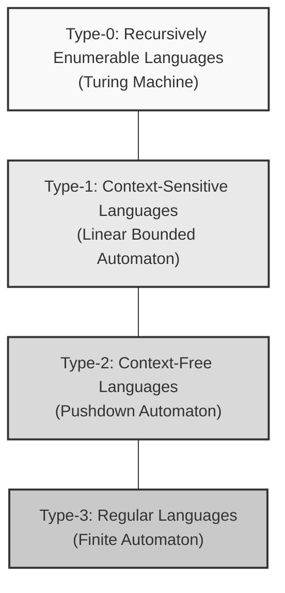
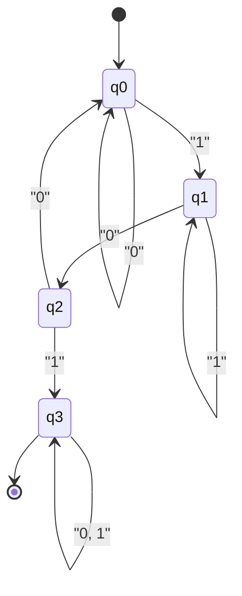
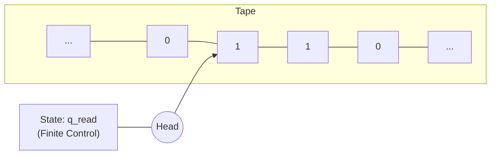

The grand theory underpinning computer science is **Automata** and **Formal Language Theory**.

From the regular expressions we use daily, to the compilers that decipher programming language source code, and all the way to natural language processing, this theory serves as the foundation for all of them. In this article, centered around the classification known as the Chomsky Hierarchy, we will guide you into the profound world where the very concept of computation is mathematically and abstractly defined.

---

## 1. What is a Formal Language?

In contrast to "natural languages" like English or Japanese that we normally use, a language strictly defined by mathematical rules is called a **Formal Language**. A formal language consists of the following basic components.

### Alphabet and Strings

An **Alphabet** in formal language theory is a non-empty, finite set of symbols. It is usually denoted by the symbol $ \Sigma $ (sigma).

$$
\Sigma = \{ 0, 1 \}
$$

The above is a binary alphabet. A finite sequence of symbols generated from this alphabet is called a **String** or a **Word**.

The set of all strings (including the empty string $ \epsilon $) made from the alphabet $ \Sigma $ is denoted as $ \Sigma^* $ using the Kleene Star.

### Definition of a Language

A formal language $ L $ is defined as a subset of $ \Sigma^* $. In other words, $ L \subseteq \Sigma^* $.

For example, "the set of strings consisting of 0s and 1s that always end in 1" is a language. This language $ L $ can be described as follows:

$$
L = \{ w1 \mid w \in \{ 0, 1 \}^* \}
$$

The primary purpose of formal language theory is to clarify how such potentially infinite sets of strings (languages) can be represented and recognized by finite rules (grammars) and machines with finite states (automata).

---

## 2. Chomsky Hierarchy

In 1956, linguist Noam Chomsky classified formal languages into four hierarchies based on the strictness of constraints on their production rules. This is the **Chomsky Hierarchy**.

The hierarchy is classified as follows (from Type-0 to Type-3). The larger the number, the narrower the class of languages it can represent, but the easier it is for a computer to parse.



1.  **Type-3 (Regular Languages)** : Can be represented by regular expressions and recognized by a finite automaton.
2.  **Type-2 (Context-Free Languages)** : Used for programming language syntax, etc., and can be recognized by a pushdown automaton.
3.  **Type-1 (Context-Sensitive Languages)** : Can be recognized by a linear bounded automaton.
4.  **Type-0 (Recursively Enumerable Languages)** : Can be recognized by a Turing machine. All computable languages.

From the next chapter, we will take a deeper look at this hierarchy from the bottom up (starting from the most restricted Type-3).

---

## 3. Regular Languages and Finite Automata ( Type-3 )

### Finite Automata ( DFA / NFA )

At the innermost part of the Chomsky hierarchy are **Regular Languages**. The computational model that recognizes this language is the **Finite Automata** (FA).

There are two types of finite automata: **DFA** (Deterministic Finite Automaton), where state transitions are deterministic, and **NFA** (Nondeterministic Finite Automaton), which are nondeterministic. Surprisingly, it has been proven that the class of languages these two can recognize is completely equal (DFA and NFA are equivalent).

Mathematically, a DFA is defined by the following 5-tuple $ M = (Q, \Sigma, \delta, q_0, F) $.

*   $ Q $ : Finite set of states
*   $ \Sigma $ : Alphabet
*   $ \delta $ : [State](https://kenji.blog/en/p/iac-infrastructure-as-code-terraform/) transition function ( $ \delta: Q \times \Sigma \rightarrow Q $ )
*   $ q_0 $ : Initial state ( $ q_0 \in Q $ )
*   $ F $ : Set of accept (final) states ( $ F \subseteq Q $ )

#### Example: DFA that accepts strings containing "101"

Given the alphabet $ \Sigma = \{ 0, 1 \} $, let's consider a DFA that recognizes strings containing "101" as a substring.



Let's implement this state transition diagram as a Python program.

```python
class DFA:
    def __init__(self):
        self.states = {'q0', 'q1', 'q2', 'q3'}
        self.alphabet = {'0', '1'}
        self.start_state = 'q0'
        self.accept_states = {'q3'}
        
        # State transition function
        self.transitions = {
            'q0': {'0': 'q0', '1': 'q1'},
            'q1': {'0': 'q2', '1': 'q1'},
            'q2': {'0': 'q0', '1': 'q3'},
            'q3': {'0': 'q3', '1': 'q3'}
        }
        
    def accepts(self, string: str) -> bool:
        current_state = self.start_state
        for char in string:
            if char not in self.alphabet:
                return False
            current_state = self.transitions[current_state][char]
        return current_state in self.accept_states

# Test
dfa = DFA()
test_strings = ["001010", "11101", "1001", "010", "101"]

for s in test_strings:
    result = dfa.accepts(s)
    print(f"String '{s}': {'Accepted' if result else 'Rejected'}")
```

### Relationship with Regular Expressions (Kleene's Theorem)

**Regular Expressions** used in programming are a notation for describing these regular languages. Stephen Kleene proved the theorem that "a language being represented by a regular expression is equivalent to it being accepted by a finite automaton."

The regular expression engine of actual programming languages (for example, Python's `re` module) internally constructs an NFA from the given regular expression pattern to evaluate strings.

### The Limits of the Pumping Lemma

Regular languages are very useful, but they have limitations. For example, "the set of strings where $ n $ $ a $'s are followed by $ n $ $ b $'s" ( $ L = \{ a^n b^n \mid n \ge 0 \} $ ) is not a regular language. This is because a finite automaton does not have memory (such as a stack) for "counting," and cannot infinitely remember how many $ a $'s have arrived. The mathematical method to prove this is the **Pumping Lemma for Regular Languages**.

---

## 4. Context-Free Languages and Pushdown Automata ( Type-2 )

To express things that cannot be expressed with regular languages, such as matching parentheses and programming language syntax (like `if-else` nesting), **Context-Free Languages** (CFL) are required.

### Pushdown Automata ( PDA )

The computational model that recognizes context-free languages is the **Pushdown Automaton** (PDA). A PDA is a finite automaton with an added **[Stack](https://kenji.blog/en/p/c-language-pointers-memory-management-stack-heap/)** (LIFO memory). By using a stack, it becomes possible to do things like "remember the number of opening parentheses and consume one each time a closing parenthesis arrives."

#### Example: PDA that accepts $ a^n b^n $

Let's implement a PDA that accepts strings with the same number of $ a $'s and $ b $'s in a row for the alphabet $ \Sigma = \{ a, b \} $.

```python
class PDA:
    def __init__(self):
        self.stack = []
        self.state = 'q0'
        
    def accepts(self, string: str) -> bool:
        self.stack = []
        self.state = 'q_a' # State to read 'a'
        
        for char in string:
            if self.state == 'q_a':
                if char == 'a':
                    self.stack.append('A') # Push to stack
                elif char == 'b':
                    self.state = 'q_b'
                    if not self.stack:
                        return False
                    self.stack.pop() # Pop from stack
                else:
                    return False
            elif self.state == 'q_b':
                if char == 'b':
                    if not self.stack:
                        return False
                    self.stack.pop()
                else:
                    return False
                    
        # When finishing reading the string, if the stack is empty, accept
        return len(self.stack) == 0

# Test
pda = PDA()
print("aaabbb:", pda.accepts("aaabbb")) # True
print("aabbb:", pda.accepts("aabbb"))   # False
print("ab:", pda.accepts("ab"))         # True
print("a:", pda.accepts("a"))           # False
```

### Context-Free Grammar ( CFG ) and BNF

The rules that generate a context-free language are called a **Context-Free Grammar** (CFG). A CFG is defined by $ (V, \Sigma, R, S) $.
Here, $ R $ is a set of production rules of the form $ A \rightarrow \gamma $. ( $ A $ is a non-terminal symbol, and $ \gamma $ is a sequence of terminal and non-terminal symbols).

**BNF** (Backus-Naur Form), which is often seen in programming language specifications, is a metalanguage for describing this context-free grammar. Below is an example of BNF defining mathematical formulas.

```bnf
<expr>   ::= <expr> "+" <term> | <term>
<term>   ::= <term> "*" <factor> | <factor>
<factor> ::= "(" <expr> ")" | <number>
<number> ::= "0" | "1" | "2" | ... | "9"
```

In the **Parsing** phase of a compiler, an algorithm applying the principles of PDA (LL parsing or LR parsing) checks whether the sequence of tokens generated by the lexical analyzer follows this context-free grammar, and constructs an Abstract Syntax [Tree](https://kenji.blog/en/p/tree-graph-data-structures-search-dfs-bfs-dijkstra/) (AST).

---

## 5. Context-Sensitive Languages and Linear Bounded Automata ( Type-1 )

Although context-free languages can represent the majority of programming language syntax, they cannot represent constraints that depend on the surrounding context (semantic constraints), such as "only declared variables can be used." These are handled by **Context-Sensitive Languages** (CSL).

### Linear Bounded Automata ( LBA )

**Linear Bounded Automata** (LBA) are what recognize context-sensitive languages. An LBA is a type of Turing machine, but it features a tape whose length is restricted to a size proportional (linear) to the length of the input string.

A typical example of a context-sensitive language is $ L = \{ a^n b^n c^n \mid n \ge 1 \} $. Since a PDA only has one stack, it can match the number of $ a $'s and $ b $'s, but it cannot match the number of $ c $'s that follow (because it counts the $ a $'s and fully pops them from the stack). An LBA can recognize this language because it can move back and forth on the tape.

Natural languages (human languages) are generally more complex than context-free languages and are considered to have properties closer to context-sensitive languages.

---

## 6. Recursively Enumerable Languages and [Turing Machine](https://kenji.blog/en/p/turing-machine-computability/)s ( Type-0 )

The final destination is **Recursively Enumerable Languages** and **Turing Machines**.

### Turing Machine: The Ultimate Model of Computation

Invented by Alan Turing in 1936, the Turing machine has a computational capability equivalent to the theoretical limits of all modern computers (von Neumann architecture).

A Turing machine consists of an infinitely long "tape," a "head" that moves left and right while reading and writing on the tape, and a finite number of "states."



### [Halting Problem](https://kenji.blog/en/p/turing-machine-computability/)

One of the most important discoveries within the framework of Turing machines is the existence of **Undecidability**.
The famous **Halting Problem** states that "given an arbitrary program and its input, there does not exist a program (algorithm) that can determine whether that program will eventually halt or fall into an infinite loop."

This demonstrates a mathematical limit that no matter how powerful an AI or computer is built, "a perfect static analysis tool that automatically detects all bugs and infinite loops in advance can never be created."

---

## 7. The Intersection of Modern Software Development and Formal Language Theory

The theories we have seen so far do not just remain in academic ivory towers. They play an active role everywhere in modern software engineering.

1.  **Automatic Generation of Lexers**: Tools like `Lex` and `Flex` convert regular expressions written by developers into DFAs and automatically generate fast C language code.
2.  **Automatic Generation of Parsers**: Tools like `Yacc` and `Bison` automatically generate LR parsers (an application of PDA) from BNF (context-free grammar) written by developers.
3.  **JSON and XML Parsing**: Validation and parsing of these data formats are also based on algorithms from formal language theory.
4.  **Editor Syntax Highlighting**: IDEs can quickly color-code source files because finite automata are running behind the scenes.

### The Pitfall of Regex Engines (Catastrophic Backtracking)

The regular expression engines built into many programming languages ([Java](https://kenji.blog/en/p/programming-languages-history-paradigm-evolution/), Python, Ruby, JavaScript, etc.) are not implemented as theoretically pure DFAs, but rather as NFA-based (or backtracking engines) that involve backtracking.

Because of this, if a clever string is given against a specific pattern of regular expression (e.g., `(a+)+$`), the computational complexity can explode exponentially, causing a vulnerability called **ReDoS** (Regular Expression Denial of [Service](https://kenji.blog/en/p/kubernetes-k8s-architecture-pod-service-ingress/)) that freezes the system. By knowing the theory, you can logically think about why backtracking occurs and how to rewrite patterns to reduce them to a safe DFA-equivalent process.

---

## Summary: The Aesthetics of Abstraction

**Automata and Formal Language Theory** is the ultimate abstraction into a purely mathematical model of "what is computation" and "what is language," completely eliminating the physical structure of computers (CPU and memory).

*   **Type-3 (DFA)**: Machines without memory (Regular expressions)
*   **Type-2 (PDA)**: Machines with stack memory (Parsing)
*   **Type-1 (LBA)**: Machines with finite tapes
*   **Type-0 (TM)**: Machines with infinite tapes (Universal computers)

The source code we write every day is broken down from Type-2 (syntax) to Type-3 (lexical) by a massive swarm of automata called compilers, and ultimately translated into machine language.

Even if superficial frameworks and language trends change, this solid mathematical foundation, which has existed since the 1950s, will not change. Sometimes, when you face a complex puzzle of regular expressions or have the opportunity to write a new parser, why not cast your thoughts to the great theories of Turing and Chomsky that lie behind them?
