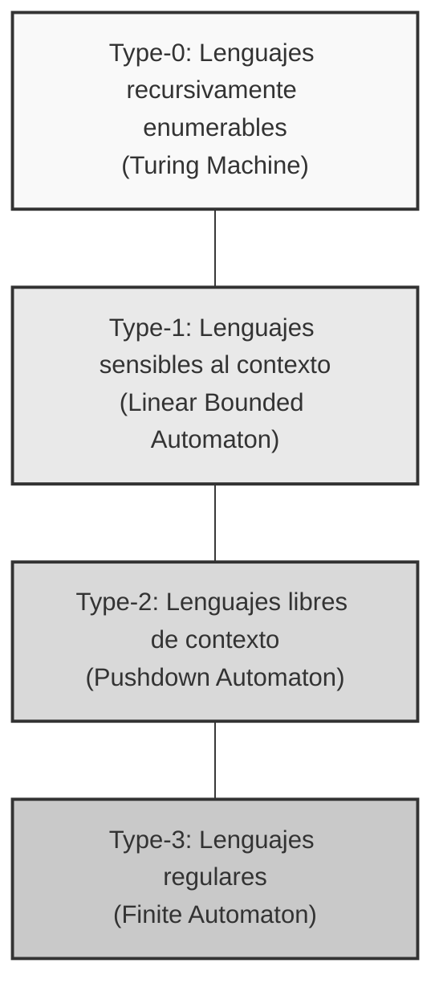
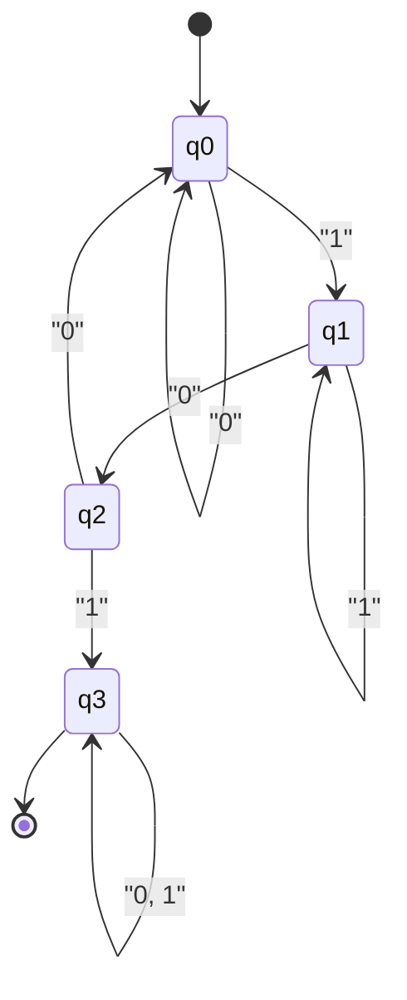
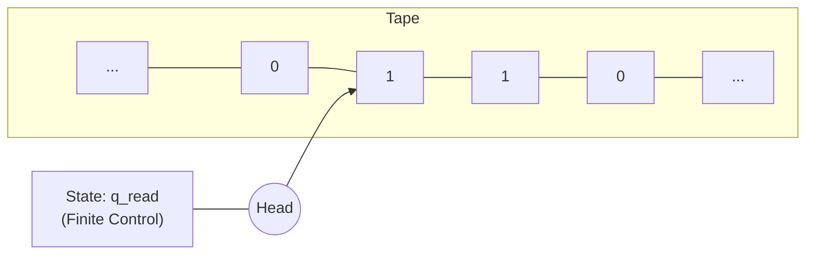

La gran teoría que sustenta los fundamentos de la informática es la de los **autómatas** (Automata) y la **teoría de lenguajes formales** (Formal Language Theory).

Desde las expresiones regulares (Regular Expressions) que escribimos a diario, pasando por los compiladores que interpretan el código fuente de los lenguajes de programación, hasta llegar al procesamiento del lenguaje natural, en la base de todo esto existe esta teoría. En este artículo, tomando como eje la clasificación conocida como la jerarquía de Chomsky (Chomsky Hierarchy), lo guiaremos hacia el profundo mundo que define matemáticamente y de forma abstracta el concepto mismo de computación.

---

## 1. ¿Qué es un lenguaje formal?

A diferencia de los "lenguajes naturales" como el español o el inglés que usamos habitualmente, a un lenguaje estrictamente definido mediante reglas matemáticas se le llama **lenguaje formal** (Formal Language). Un lenguaje formal consta de los siguientes componentes básicos.

### Alfabeto y cadenas

En la teoría de lenguajes formales, un **alfabeto** (Alphabet) es un conjunto finito no vacío de símbolos. Usualmente, se representa con el símbolo $ \Sigma $ (sigma).

$$
\Sigma = \{ 0, 1 \}
$$

El anterior es el alfabeto binario. Una secuencia de símbolos de longitud finita generada a partir de este alfabeto se denomina **cadena** (String) o **palabra** (Word).

El conjunto de todas las cadenas creadas a partir del alfabeto $ \Sigma $ (incluida la cadena vacía $ \epsilon $) se denota como $ \Sigma^* $ utilizando la cerradura de Kleene (Kleene Star).

### Definición de lenguaje

Un lenguaje formal $ L $ se define como un subconjunto de $ \Sigma^* $. Es decir, $ L \subseteq \Sigma^* $.

Por ejemplo, "el conjunto de cadenas compuestas por 0 y 1, que siempre terminan en 1" es un lenguaje. Este lenguaje $ L $ puede describirse de la siguiente manera:

$$
L = \{ w1 \mid w \in \{ 0, 1 \}^* \}
$$

El propósito principal de la teoría de lenguajes formales es aclarar cómo se puede representar y reconocer este tipo de conjuntos de cadenas (lenguajes), que pueden existir de forma infinita, mediante reglas finitas (gramática) o máquinas con un número finito de estados (autómatas).

---

## 2. Jerarquía de Chomsky (Chomsky Hierarchy)

El lingüista Noam Chomsky clasificó en 1956 los lenguajes formales en cuatro niveles según la rigidez de las restricciones de sus reglas de producción. A esto se le conoce como la **jerarquía de Chomsky**.

La jerarquía se clasifica de la siguiente manera (del Tipo 0 al Tipo 3). Cuanto mayor es el número, más restringida es la clase de lenguajes que se pueden representar, pero a su vez son más fáciles de analizar por una computadora.



1.  **Tipo 3 (Lenguajes regulares)**: Pueden representarse con expresiones regulares y ser reconocidos por autómatas finitos.
2.  **Tipo 2 (Lenguajes libres de contexto)**: Utilizados en la sintaxis de los lenguajes de programación, reconocibles por autómatas de pila.
3.  **Tipo 1 (Lenguajes sensibles al contexto)**: Reconocibles por autómatas linealmente acotados.
4.  **Tipo 0 (Lenguajes recursivamente enumerables)**: Reconocibles por la máquina de Turing. Todos los lenguajes computables.

A partir del próximo capítulo, profundizaremos en esta jerarquía de abajo hacia arriba (desde el Tipo 3, que tiene las restricciones más fuertes).

---

## 3. Lenguajes regulares y autómatas finitos (Tipo 3)

### Autómatas finitos (DFA / NFA)

En el nivel más interno de la jerarquía de Chomsky se encuentran los **lenguajes regulares** (Regular Languages). El modelo computacional que reconoce este lenguaje es el **autómata finito** (Finite Automata, FA).

Entre los autómatas finitos, existen el **DFA** (Deterministic Finite Automaton), cuyas transiciones de estado son deterministas, y el **NFA** (Nondeterministic Finite Automaton), que es no determinista. Sorprendentemente, está demostrado que la clase de lenguajes que ambos pueden reconocer es exactamente la misma (DFA y NFA son equivalentes).

Matemáticamente, un DFA se define por la siguiente 5-tupla $ M = (Q, \Sigma, \delta, q_0, F) $.

*   $ Q $: Conjunto finito de estados
*   $ \Sigma $: Alfabeto
*   $ \delta $: Función de transición de estados ($ \delta: Q \times \Sigma \rightarrow Q $)
*   $ q_0 $: Estado inicial ($ q_0 \in Q $)
*   $ F $: Conjunto de estados de aceptación (estados finales) ($ F \subseteq Q $)

#### Ejemplo concreto: DFA que acepta cadenas que contienen "101"

En el alfabeto $ \Sigma = \{ 0, 1 \} $, consideremos un DFA que reconoce aquellas cadenas que contienen "101" como subcadena.



Vamos a implementar este diagrama de transición de estados como un programa en Python.

```python
class DFA:
    def __init__(self):
        self.states = {'q0', 'q1', 'q2', 'q3'}
        self.alphabet = {'0', '1'}
        self.start_state = 'q0'
        self.accept_states = {'q3'}
        
        # Función de transición de estados
        self.transitions = {
            'q0': {'0': 'q0', '1': 'q1'},
            'q1': {'0': 'q2', '1': 'q1'},
            'q2': {'0': 'q0', '1': 'q3'},
            'q3': {'0': 'q3', '1': 'q3'}
        }
        
    def accepts(self, string: str) -> bool:
        current_state = self.start_state
        for char in string:
            if char not in self.alphabet:
                return False
            current_state = self.transitions[current_state][char]
        return current_state in self.accept_states

# Pruebas
dfa = DFA()
test_strings = ["001010", "11101", "1001", "010", "101"]

for s in test_strings:
    result = dfa.accepts(s)
    print(f"String '{s}': {'Accepted' if result else 'Rejected'}")
```

### Relación con las expresiones regulares (Teorema de Kleene)

Las **expresiones regulares** (Regular Expressions) utilizadas en programación son una notación para describir estos lenguajes regulares. Stephen Kleene demostró el teorema de que "que un lenguaje sea expresado mediante una expresión regular es equivalente a que sea aceptado por un autómata finito".

Los motores de expresiones regulares en lenguajes de programación reales (por ejemplo, el módulo `re` de Python) construyen internamente un NFA a partir de un patrón de expresión regular dado para evaluar las cadenas.

### Limitaciones del Lema de Bombeo (Pumping Lemma)

Los lenguajes regulares son extremadamente útiles, pero tienen limitaciones. Por ejemplo, "el conjunto de cadenas donde a $ n $ elementos $ a $ le siguen $ n $ elementos $ b $" ($ L = \{ a^n b^n \mid n \ge 0 \} $) no es un lenguaje regular. Esto se debe a que un autómata finito no tiene memoria (como una pila) para "contar", por lo que no puede recordar indefinidamente cuántos elementos $ a $ han llegado. El método matemático para demostrar esto es el **lema de bombeo para lenguajes regulares**.

---

## 4. Lenguajes libres de contexto y autómatas de pila (Tipo 2)

Para representar la correspondencia de paréntesis, que no puede expresarse con lenguajes regulares, o la sintaxis de lenguajes de programación (como el anidamiento de `if-else`), se necesitan los **lenguajes libres de contexto** (Context-Free Languages, CFL).

### Autómata de pila (PDA)

El modelo computacional que reconoce los lenguajes libres de contexto es el **autómata de pila** (Pushdown Automaton, PDA). Un PDA es simplemente un autómata finito al que se le ha añadido una **pila** (Stack, una memoria de tipo "último en entrar, primero en salir"). Al usar una pila, es posible hacer cosas como "recordar la cantidad de paréntesis abiertos y consumirlos cada vez que llega un paréntesis de cierre".

#### Ejemplo concreto: PDA que acepta $ a^n b^n $

Con el alfabeto $ \Sigma = \{ a, b \} $, vamos a implementar un PDA que acepte cadenas donde sigue la misma cantidad de elementos $ a $ y $ b $.

```python
class PDA:
    def __init__(self):
        self.stack = []
        self.state = 'q0'
        
    def accepts(self, string: str) -> bool:
        self.stack = []
        self.state = 'q_a' # Estado leyendo 'a'
        
        for char in string:
            if self.state == 'q_a':
                if char == 'a':
                    self.stack.append('A') # Apilar
                elif char == 'b':
                    self.state = 'q_b'
                    if not self.stack:
                        return False
                    self.stack.pop() # Desapilar
                else:
                    return False
            elif self.state == 'q_b':
                if char == 'b':
                    if not self.stack:
                        return False
                    self.stack.pop()
                else:
                    return False
                    
        # Aceptar si la pila está vacía al terminar de leer la cadena
        return len(self.stack) == 0

# Pruebas
pda = PDA()
print("aaabbb:", pda.accepts("aaabbb")) # True
print("aabbb:", pda.accepts("aabbb"))   # False
print("ab:", pda.accepts("ab"))         # True
print("a:", pda.accepts("a"))           # False
```

### Gramática libre de contexto (CFG) y BNF

Las reglas que generan lenguajes libres de contexto se denominan **gramática libre de contexto** (Context-Free Grammar, CFG). Una CFG se define como $ (V, \Sigma, R, S) $.
Aquí, $ R $ es un conjunto de reglas de producción de la forma $ A \rightarrow \gamma $ ($ A $ es un símbolo no terminal, $ \gamma $ es una secuencia de símbolos terminales y no terminales).

**BNF** (Backus-Naur Form), que a menudo se ve en las especificaciones de los lenguajes de programación, es un metalenguaje para describir esta gramática libre de contexto. A continuación, se muestra un ejemplo de BNF que define expresiones matemáticas.

```bnf
<expr>   ::= <expr> "+" <term> | <term>
<term>   ::= <term> "*" <factor> | <factor>
<factor> ::= "(" <expr> ")" | <number>
<number> ::= "0" | "1" | "2" | ... | "9"
```

En la fase de **análisis sintáctico** (Parsing) de un compilador, mediante algoritmos que aplican los principios de los PDA (como los analizadores sintácticos LL o LR), se verifica si la secuencia de tokens generada por el analizador léxico cumple con esta gramática libre de contexto, y se construye un árbol de sintaxis abstracta (AST).

---

## 5. Lenguajes sensibles al contexto y autómatas linealmente acotados (Tipo 1)

Los lenguajes libres de contexto pueden expresar la mayor parte de la sintaxis de un lenguaje de programación, pero no pueden expresar restricciones que dependan del contexto anterior o posterior (restricciones semánticas), como "solo se pueden usar variables declaradas". Para manejar esto, se utilizan los **lenguajes sensibles al contexto** (Context-Sensitive Languages, CSL).

### Autómatas linealmente acotados (LBA)

Quien reconoce los lenguajes sensibles al contexto es el **autómata linealmente acotado** (Linear Bounded Automaton, LBA). Un LBA es un tipo de máquina de Turing, pero se caracteriza por estar limitado a que la longitud de su cinta sea proporcional (lineal) a la longitud de la cadena de entrada.

Un ejemplo típico de un lenguaje sensible al contexto es $ L = \{ a^n b^n c^n \mid n \ge 1 \} $. Como un PDA solo tiene una pila, puede igualar el número de elementos $ a $ y $ b $, pero no puede ajustarse al número de elementos $ c $ que siguen (ya que contaría los elementos $ a $ y los desapilaría por completo). Un LBA puede moverse a lo largo de la cinta, por lo que es capaz de reconocer este lenguaje.

Se cree que los lenguajes naturales (lenguajes humanos) son, en general, más complejos que los lenguajes libres de contexto y tienen propiedades más cercanas a los lenguajes sensibles al contexto.

---

## 6. Lenguajes recursivamente enumerables y la máquina de Turing (Tipo 0)

A lo último a lo que se llega es a los **lenguajes recursivamente enumerables** (Recursively Enumerable Languages) y la **máquina de Turing** ([Turing Machine](https://kenji.blog/es/p/turing-machine-computability/)).

### Máquina de Turing: El modelo computacional definitivo

Ideada por Alan Turing en 1936, la máquina de Turing tiene una capacidad computacional teóricamente equivalente al límite de cualquier computadora moderna (arquitectura de von Neumann).

La máquina de Turing se compone de una "cinta" infinita, un "cabezal" que se mueve a izquierda y derecha mientras lee y escribe en la cinta, y un número finito de "estados".



### Problema de la parada ([Halting Problem](https://kenji.blog/es/p/turing-machine-computability/))

Uno de los descubrimientos más importantes en el marco de la máquina de Turing es la existencia de la **incomputabilidad** (Undecidability).
"No existe un programa (algoritmo) que, dado cualquier programa y su entrada, pueda determinar si dicho programa se detendrá alguna vez o caerá en un bucle infinito". Este es el famoso **problema de la parada**.

Esto demuestra el límite matemático de que, sin importar cuán poderosa sea la IA o computadora que creemos, "es imposible construir una herramienta de análisis estático perfecta que detecte automáticamente de antemano todos los errores o bucles infinitos".

---

## 7. La intersección entre el desarrollo de software moderno y la teoría de lenguajes formales

Las teorías que hemos visto hasta ahora no se quedan para nada en una torre de marfil académica. Están activas en todas partes dentro de la ingeniería de software moderna.

1.  **Generación automática de analizadores léxicos (Lexer)**: Herramientas como `Lex` y `Flex` convierten las expresiones regulares escritas por el desarrollador en DFA, y generan automáticamente código en C de alta velocidad.
2.  **Generación automática de analizadores sintácticos (Parser)**: Herramientas como `Yacc` y `Bison` generan automáticamente analizadores LR (una aplicación de los PDA) a partir del BNF (gramática libre de contexto) escrito por el desarrollador.
3.  **Análisis (Parsing) de JSON o XML**: La validación y el análisis de estos formatos de datos también se basan en algoritmos de la teoría de lenguajes formales.
4.  **Resaltado de sintaxis en editores**: Los IDE pueden colorear el código a alta velocidad porque en su interior están operando autómatas finitos.

### El escollo de los motores Regex (Catastrophic Backtracking)

Los motores de expresiones regulares integrados en muchos lenguajes de programación (Java, Python, Ruby, JavaScript, etc.) no están implementados como DFA puros en teoría, sino basándose en NFA que conllevan retroceso (backtracking engine).

Por este motivo, si se proporciona una cadena ingeniosamente construida frente a un patrón de expresión regular específico (ej.: `(a+)+$`), la complejidad computacional estalla de forma exponencial, lo que puede provocar una vulnerabilidad conocida como **ReDoS** (Regular Expression Denial of [Service](https://kenji.blog/es/p/kubernetes-k8s-architecture-pod-service-ingress/)) que llega a congelar el sistema. Si se conoce la teoría, se puede pensar lógicamente por qué ocurre el retroceso y cómo se puede reescribir el patrón para reducirlo a un procesamiento equivalente al de un DFA seguro.

---

## Conclusión: La estética de la abstracción

La **teoría de autómatas y lenguajes formales** elimina por completo la estructura física de la computadora (CPU o memoria) y representa el culmen de la abstracción hacia modelos puramente matemáticos sobre "qué es computar" y "qué es un lenguaje".

*   **Tipo 3 (DFA)**: Máquina sin memoria (expresiones regulares)
*   **Tipo 2 (PDA)**: Máquina con memoria de pila (análisis sintáctico)
*   **Tipo 1 (LBA)**: Máquina con cinta finita
*   **Tipo 0 (TM)**: Máquina con cinta infinita (computadora universal)

El código fuente que escribimos todos los días es descompuesto por una gigantesca bandada de autómatas, el compilador, pasando del Tipo 2 (sintaxis) al Tipo 3 (lexicografía), y finalmente se traduce a código máquina.

Aunque las modas de los frameworks superficiales y lenguajes cambien, esta sólida base matemática, que existe desde la década de 1950, no cambiará. Cuando se enfrente de vez en cuando a un complejo rompecabezas de expresiones regulares o tenga la oportunidad de escribir un nuevo parser, ¿por qué no pensar en la gran teoría de Turing y Chomsky que hay detrás?
