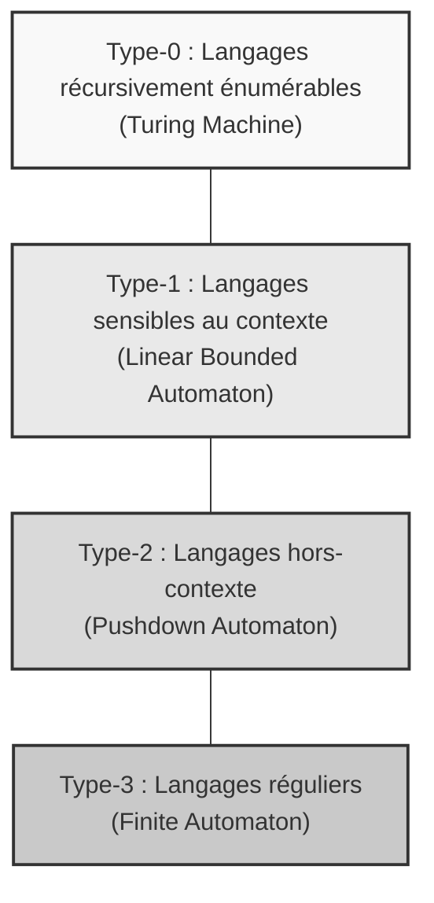
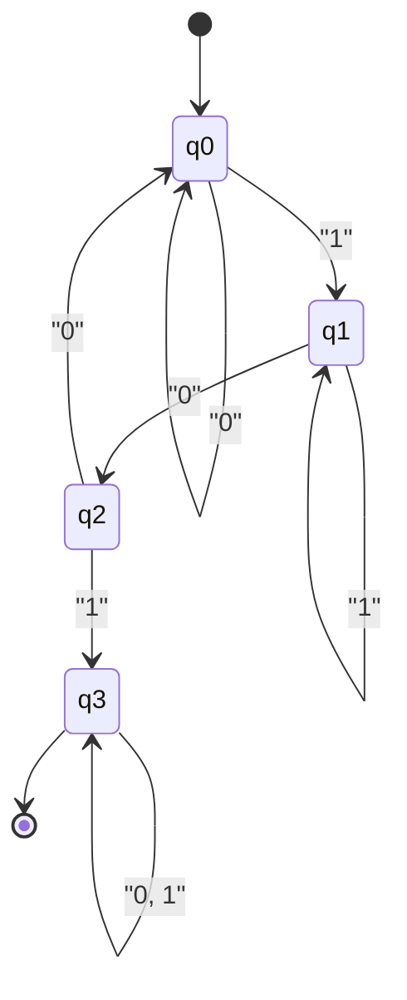
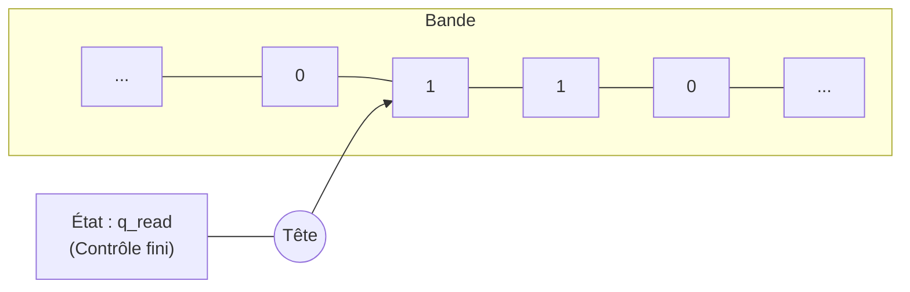

La théorie fondamentale qui soutient l'informatique est la **théorie des automates** ( Automata ) et la **théorie des langages formels** ( Formal Language Theory ).

Des expressions régulières ( Regular Expressions ) que nous écrivons quotidiennement aux compilateurs qui déchiffrent le code source des langages de programmation, en passant par le traitement du langage naturel, cette théorie est à la base de tout. Dans cet article, nous vous guiderons dans le monde profond de la définition mathématique et abstraite du concept même de calcul, en nous appuyant sur la classification de la hiérarchie de Chomsky ( Chomsky Hierarchy ).

---

## 1. Qu'est-ce qu'un langage formel ?

Contrairement aux « langages naturels » comme le français ou l'anglais que nous utilisons couramment, un langage strictement défini par des règles mathématiques est appelé **langage formel** ( Formal Language ). Un langage formel est constitué des éléments de base suivants.

### Alphabet et chaînes de caractères

Dans la théorie des langages formels, un **alphabet** ( Alphabet ) est un ensemble fini non vide de symboles. Il est généralement représenté par le symbole $ \Sigma $ (sigma).

$$
\Sigma = \{ 0, 1 \}
$$

Ci-dessus, l'alphabet binaire. Une séquence finie de symboles générée à partir de cet alphabet est appelée **chaîne de caractères** ( String ) ou **mot** ( Word ).

L'ensemble de toutes les chaînes de caractères (y compris la chaîne vide $ \epsilon $) formées à partir de l'alphabet $ \Sigma $ est noté $ \Sigma^* $ en utilisant la fermeture de Kleene ( Kleene Star ).

### Définition d'un langage

Un langage formel $ L $ est défini comme un sous-ensemble de $ \Sigma^* $. C'est-à-dire, $ L \subseteq \Sigma^* $.

Par exemple, « l'ensemble des chaînes de caractères composées de 0 et de 1, et se terminant toujours par 1 » est un langage. Ce langage $ L $ peut être décrit comme suit :

$$
L = \{ w1 \mid w \in \{ 0, 1 \}^* \}
$$

L'objectif principal de la théorie des langages formels est de clarifier comment de tels ensembles de chaînes potentiellement infinis (langages) peuvent être représentés et reconnus à l'aide de règles finies (grammaires) ou de machines à états finis (automates).

---

## 2. La hiérarchie de Chomsky ( Chomsky Hierarchy )

Le linguiste Noam Chomsky a classifié les langages formels en quatre niveaux en 1956 selon la force des contraintes de leurs règles de production. C'est la **hiérarchie de Chomsky**.

La hiérarchie est classée comme suit (du type 0 au type 3). Plus le nombre est grand, plus la classe de langages pouvant être exprimée est restreinte, mais en contrepartie, ils sont plus faciles à analyser par ordinateur.



1.  **Type 3 (Langages réguliers)** : Peuvent être exprimés par des expressions régulières et reconnus par un automate fini.
2.  **Type 2 (Langages hors-contexte)** : Utilisés pour la syntaxe des langages de programmation, etc., et reconnus par un automate à pile.
3.  **Type 1 (Langages sensibles au contexte)** : Reconnus par un automate linéairement borné.
4.  **Type 0 (Langages récursivement énumérables)** : Reconnus par une machine de Turing. Tous les langages calculables.

Dans les chapitres suivants, nous examinerons de plus près cette hiérarchie de bas en haut (en commençant par le Type-3, le plus restrictif).

---

## 3. Langages réguliers et automates finis ( Type-3 )

### Automates finis ( DFA / NFA )

Au cœur de la hiérarchie de Chomsky se trouvent les **langages réguliers** ( Regular Languages ). Le modèle de calcul qui reconnaît ce langage est l'**automate fini** ( Finite Automata, FA ).

Parmi les automates finis, il existe les **DFA** ( Deterministic Finite Automaton ) dont les transitions d'état sont déterministes, et les **NFA** ( Nondeterministic Finite Automaton ) qui sont non déterministes. Étonnamment, il est prouvé que la classe de langages que ces deux modèles peuvent reconnaître est exactement la même (DFA et NFA sont équivalents).

Mathématiquement, un DFA est défini par le 5-uplet suivant $ M = (Q, \Sigma, \delta, q_0, F) $.

*   $ Q $ : Un ensemble fini d'états
*   $ \Sigma $ : L'alphabet
*   $ \delta $ : La fonction de transition d'état ( $ \delta: Q \times \Sigma \rightarrow Q $ )
*   $ q_0 $ : L'état initial ( $ q_0 \in Q $ )
*   $ F $ : L'ensemble des états d'acceptation (états finaux) ( $ F \subseteq Q $ )

#### Exemple concret : Un DFA acceptant les chaînes de caractères contenant "101"

Considérons un DFA qui reconnaît, dans l'alphabet $ \Sigma = \{ 0, 1 \} $, les chaînes contenant la sous-chaîne "101".



Ce diagramme de transition d'état peut être implémenté comme un programme Python.

```python
class DFA:
    def __init__(self):
        self.states = {'q0', 'q1', 'q2', 'q3'}
        self.alphabet = {'0', '1'}
        self.start_state = 'q0'
        self.accept_states = {'q3'}
        
        # Fonction de transition d'état
        self.transitions = {
            'q0': {'0': 'q0', '1': 'q1'},
            'q1': {'0': 'q2', '1': 'q1'},
            'q2': {'0': 'q0', '1': 'q3'},
            'q3': {'0': 'q3', '1': 'q3'}
        }
        
    def accepts(self, string: str) -> bool:
        current_state = self.start_state
        for char in string:
            if char not in self.alphabet:
                return False
            current_state = self.transitions[current_state][char]
        return current_state in self.accept_states

# Test
dfa = DFA()
test_strings = ["001010", "11101", "1001", "010", "101"]

for s in test_strings:
    result = dfa.accepts(s)
    print(f"Chaîne '{s}' : {'Acceptée' if result else 'Rejetée'}")
```

### Relation avec les expressions régulières (Théorème de Kleene)

Les **expressions régulières** ( Regular Expression ) utilisées en programmation sont une notation pour décrire ces langages réguliers. Stephen Kleene a prouvé le théorème selon lequel « le fait qu'un langage soit exprimable par une expression régulière est équivalent à ce qu'il soit accepté par un automate fini ».

Les moteurs d'expressions régulières réels des langages de programmation (par exemple, le module `re` de Python) construisent en interne un NFA à partir du modèle d'expression régulière donné pour évaluer les chaînes de caractères.

### Limites du lemme de l'étoile ( Pumping Lemma )

Les langages réguliers sont très utiles, mais ont des limites. Par exemple, « l'ensemble des chaînes où $ n $ fois $ a $ sont suivis de $ n $ fois $ b $ » ( $ L = \{ a^n b^n \mid n \ge 0 \} $ ) n'est pas un langage régulier. Les automates finis n'ont pas de mémoire pour « compter » (comme une pile), ils ne peuvent donc pas mémoriser indéfiniment combien de $ a $ sont arrivés. La méthode mathématique pour le prouver est le **lemme de l'étoile pour les langages réguliers**.

---

## 4. Langages hors-contexte et automates à pile ( Type-2 )

Pour exprimer la correspondance des parenthèses, qui ne peut pas être exprimée par des langages réguliers, ou la syntaxe des langages de programmation (comme l'imbrication de `if-else`), nous avons besoin des **langages hors-contexte** ( Context-Free Languages, CFL ).

### Automates à pile ( PDA )

Le modèle de calcul qui reconnaît les langages hors-contexte est l'**automate à pile** ( Pushdown Automaton, PDA ). Un PDA est un automate fini auquel on ajoute une **pile** ( [Stack](https://kenji.blog/fr/p/c-language-pointers-memory-management-stack-heap/), mémoire dernier entré, premier sorti ). L'utilisation d'une pile permet des opérations telles que « mémoriser le nombre de parenthèses ouvrantes et les consommer à chaque parenthèse fermante ».

#### Exemple concret : Un PDA acceptant $ a^n b^n $

Implémentons un PDA qui, dans l'alphabet $ \Sigma = \{ a, b \} $, accepte les chaînes suivies du même nombre de $ a $ et de $ b $.

```python
class PDA:
    def __init__(self):
        self.stack = []
        self.state = 'q0'
        
    def accepts(self, string: str) -> bool:
        self.stack = []
        self.state = 'q_a' # État pour lire a
        
        for char in string:
            if self.state == 'q_a':
                if char == 'a':
                    self.stack.append('A') # Empiler
                elif char == 'b':
                    self.state = 'q_b'
                    if not self.stack:
                        return False
                    self.stack.pop() # Dépiler
                else:
                    return False
            elif self.state == 'q_b':
                if char == 'b':
                    if not self.stack:
                        return False
                    self.stack.pop()
                else:
                    return False
                    
        # Accepter si la pile est vide après avoir lu la chaîne
        return len(self.stack) == 0

# Test
pda = PDA()
print("aaabbb :", pda.accepts("aaabbb")) # True
print("aabbb :", pda.accepts("aabbb"))   # False
print("ab :", pda.accepts("ab"))         # True
print("a :", pda.accepts("a"))           # False
```

### Grammaire hors-contexte ( CFG ) et BNF

Les règles qui génèrent un langage hors-contexte sont appelées **grammaire hors-contexte** ( Context-Free Grammar, CFG ). Une CFG est définie par $ (V, \Sigma, R, S) $.
Ici, $ R $ est un ensemble de règles de production de la forme $ A \rightarrow \gamma $. ( $ A $ est un symbole non terminal, $ \gamma $ est une séquence de symboles terminaux et non terminaux).

La forme **BNF** ( Backus-Naur Form ), souvent rencontrée dans les spécifications des langages de programmation, est un métalangage pour décrire cette grammaire hors-contexte. Voici un exemple de BNF définissant des expressions mathématiques.

```bnf
<expr>   ::= <expr> "+" <term> | <term>
<term>   ::= <term> "*" <factor> | <factor>
<factor> ::= "(" <expr> ")" | <number>
<number> ::= "0" | "1" | "2" | ... | "9"
```

Dans la phase d'**analyse syntaxique** ( Parsing ) d'un compilateur, on vérifie si la séquence de jetons générée par l'analyseur lexical suit cette grammaire hors-contexte en utilisant des algorithmes (analyse LL ou analyse LR) basés sur le principe du PDA, et on construit un arbre syntaxique abstrait ( AST ).

---

## 5. Langages sensibles au contexte et automates linéairement bornés ( Type-1 )

Bien que les langages hors-contexte puissent exprimer la majeure partie de la syntaxe des langages de programmation, ils ne peuvent pas exprimer des contraintes (contraintes sémantiques) qui dépendent du contexte environnant, comme « seules les variables déclarées peuvent être utilisées ». Ce sont les **langages sensibles au contexte** ( Context-Sensitive Languages, CSL ) qui les gèrent.

### Automates linéairement bornés ( LBA )

C'est l'**automate linéairement borné** ( Linear Bounded Automaton, LBA ) qui reconnaît les langages sensibles au contexte. Le LBA est un type de machine de Turing, mais il a la caractéristique que la longueur de sa bande est limitée à une taille proportionnelle (linéaire) à la longueur de la chaîne d'entrée.

Un exemple typique de langage sensible au contexte est $ L = \{ a^n b^n c^n \mid n \ge 1 \} $. Parce que le PDA n'a qu'une seule pile, il peut faire correspondre le nombre de $ a $ et de $ b $, mais pas le nombre de $ c $ qui suivent (parce qu'il compte le nombre de $ a $ et les dépile tous). Le LBA peut reconnaître ce langage car il peut se déplacer d'avant en arrière sur la bande.

Les langages naturels (langages humains) sont généralement plus complexes que les langages hors-contexte et sont considérés comme ayant des propriétés plus proches des langages sensibles au contexte.

---

## 6. Langages récursivement énumérables et machines de Turing ( Type-0 )

Enfin, nous atteignons les **langages récursivement énumérables** ( Recursively Enumerable Languages ) et la **machine de Turing** ( [Turing Machine](https://kenji.blog/fr/p/turing-machine-computability/) ).

### La machine de Turing : Le modèle de calcul ultime

Inventée par Alan Turing en 1936, la machine de Turing a une capacité de calcul équivalente aux limites théoriques de tous les ordinateurs modernes (ordinateurs de type von Neumann).

Une machine de Turing se compose d'une « bande » infinie, d'une « tête » qui se déplace de gauche à droite tout en lisant et écrivant sur la bande, et d'un nombre fini d'« états ».



### Le problème de l'arrêt ( [Halting Problem](https://kenji.blog/fr/p/turing-machine-computability/) )

L'une des découvertes les plus importantes dans le cadre des machines de Turing est l'existence de l'**indécidabilité** ( Undecidability ).
Le fameux **problème de l'arrêt** stipule que « pour un programme et une entrée arbitraires donnés, il n'existe aucun programme (algorithme) permettant de déterminer si ce programme finira par s'arrêter ou s'il tombera dans une boucle infinie ».

Cela montre la limite mathématique selon laquelle, quelle que soit la puissance de l'IA ou de l'ordinateur que nous construisons, « il est impossible de créer un outil d'analyse statique parfait qui détecte automatiquement et à l'avance tous les bugs ou boucles infinies ».

---

## 7. Le carrefour entre le développement logiciel moderne et la théorie des langages formels

Les théories que nous avons vues jusqu'à présent ne se limitent en aucun cas à une tour d'ivoire académique. Elles sont actives partout dans l'ingénierie logicielle moderne.

1.  **Génération automatique d'analyseurs lexicaux ( Lexer )** : Des outils comme `Lex` ou `Flex` convertissent les expressions régulières écrites par les développeurs en DFA et génèrent automatiquement du code C très rapide.
2.  **Génération automatique d'analyseurs syntaxiques ( Parser )** : Des outils comme `Yacc` ou `Bison` génèrent automatiquement des analyseurs LR (une application des PDA) à partir de BNF (grammaire hors-contexte) écrite par les développeurs.
3.  **Analyse de JSON ou XML** : La validation et l'analyse de ces formats de données sont également basées sur les algorithmes de la théorie des langages formels.
4.  **Coloration syntaxique dans les éditeurs** : Si les IDE peuvent colorer le code rapidement, c'est parce que des automates finis tournent en arrière-plan.

### Le piège des moteurs Regex ( Catastrophic Backtracking )

Les moteurs d'expressions régulières intégrés dans de nombreux langages de programmation ( [Java](https://kenji.blog/fr/p/programming-languages-history-paradigm-evolution/), Python, Ruby, JavaScript, etc. ) ne sont pas de purs DFA théoriques, mais sont implémentés sur une base de NFA avec retour sur trace (ou moteur de backtracking).

Pour cette raison, si une chaîne astucieuse est donnée à un modèle spécifique d'expression régulière (par exemple : `(a+)+$`), la complexité de calcul peut exploser exponentiellement et provoquer une vulnérabilité appelée **ReDoS** ( Regular Expression Denial of [Service](https://kenji.blog/fr/p/kubernetes-k8s-architecture-pod-service-ingress/) ) qui gèle le système. Si vous connaissez la théorie, vous pouvez comprendre logiquement pourquoi le retour sur trace se produit et comment réécrire le modèle pour l'adapter à un traitement équivalent à un DFA sûr.

---

## Résumé : L'esthétique de l'abstraction

La **théorie des automates et des langages formels** est l'extrême de l'abstraction en un modèle mathématique pur de ce que sont le « calcul » et le « langage », en éliminant complètement la structure physique de l'ordinateur (CPU ou mémoire).

*   **Type-3 (DFA)** : Machine sans mémoire (expressions régulières)
*   **Type-2 (PDA)** : Machine avec mémoire à pile (analyse syntaxique)
*   **Type-1 (LBA)** : Machine avec une bande limitée
*   **Type-0 (TM)** : Machine avec une bande infinie (ordinateur universel)

Le code source que nous écrivons chaque jour est décomposé du Type-2 (syntaxe) au Type-3 (lexique) par une flotte géante d'automates appelés compilateurs, et finalement traduit en langage machine.

Même si les frameworks de surface et les tendances des langages évoluent, cette base mathématique solide depuis les années 1950 ne changera pas. De temps en temps, lorsque vous êtes confronté à un puzzle complexe d'expressions régulières ou que vous avez l'occasion d'écrire un nouvel analyseur, pourquoi ne pas penser aux grandes théories de Turing et de Chomsky qui se cachent derrière ?
