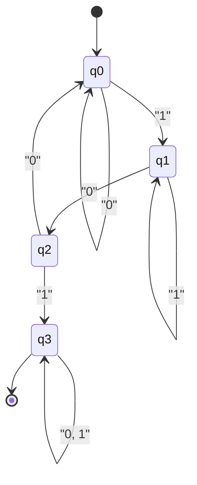

Teori besar yang menopang dasar ilmu komputer adalah **Automata** (Automata) dan **Teori Bahasa Formal** (Formal Language Theory).

Dari ekspresi reguler (Regular Expressions) yang biasa kita tulis sehari-hari, kompilator yang membaca kode sumber bahasa pemrograman, hingga pemrosesan bahasa alami, teori ini ada sebagai fondasi untuk semuanya. Dalam artikel ini, dengan menggunakan klasifikasi Hierarki Chomsky (Chomsky Hierarchy) sebagai sumbu, kami akan memandu Anda ke dunia yang mendalam di mana konsep komputasi itu sendiri didefinisikan secara matematis dan abstrak.

---

## 1. Apa itu Bahasa Formal?

Berkebalikan dengan "bahasa alami" seperti bahasa Indonesia atau bahasa Inggris yang biasa kita gunakan, bahasa yang didefinisikan secara ketat oleh aturan matematika disebut **Bahasa Formal** (Formal Language). Bahasa formal terdiri dari komponen dasar berikut.

### Alfabet dan String

Dalam teori bahasa formal, **Alfabet** (Alphabet) adalah himpunan simbol terbatas yang tidak kosong. Biasanya dilambangkan dengan simbol $ \Sigma $ (sigma).

$$
\Sigma = \{ 0, 1 \}
$$

Di atas adalah alfabet untuk bilangan biner. Urutan simbol dengan panjang terbatas yang dihasilkan dari alfabet ini disebut **String** (String) atau **Kata** (Word).

Himpunan semua string yang dibuat dari alfabet $ \Sigma $ (termasuk string kosong $ \epsilon $) ditulis sebagai $ \Sigma^* $ menggunakan Kleene Star (Kleene Closure).

### Definisi Bahasa

Bahasa formal $ L $ didefinisikan sebagai himpunan bagian dari $ \Sigma^* $. Artinya, $ L \subseteq \Sigma^* $.

Sebagai contoh, "Himpunan string yang terdiri dari 0 dan 1, dan selalu diakhiri dengan 1" adalah sebuah bahasa. Bahasa $ L $ ini dapat ditulis sebagai berikut.

$$
L = \{ w1 \mid w \in \{ 0, 1 \}^* \}
$$

Tujuan utama dari teori bahasa formal adalah untuk menjelaskan bagaimana himpunan string (bahasa) yang jumlahnya tak terhingga ini dapat diekspresikan dan dikenali oleh aturan yang terbatas (tata bahasa) atau mesin dengan keadaan yang terbatas (automata).

---

## 2. Hierarki Chomsky (Chomsky Hierarchy)

Ahli bahasa Noam Chomsky, pada tahun 1956, mengklasifikasikan bahasa formal ke dalam 4 hierarki berdasarkan seberapa kuat batasan aturan produksinya. Inilah **Hierarki Chomsky**.

Hierarki diklasifikasikan sebagai berikut (dari Tipe-0 hingga Tipe-3). Semakin besar angkanya, semakin sempit kelas bahasa yang dapat diekspresikan, tetapi sebaliknya lebih mudah dianalisis oleh komputer.

```mermaid
flowchart TD
    Type0["Tipe-0: Bahasa Rekursif Dapat Dienumerasi\n("Mesin Turing")"]
    Type1["Tipe-1: Bahasa Konteks-Sensitif\n("Automaton Terbatas Linier")"]
    Type2["Tipe-2: Bahasa Bebas Konteks\n("Pushdown Automaton")"]
    Type3["Tipe-3: Bahasa Reguler\n("Automaton Berhingga")"]

    Type0 --- Type1
    Type1 --- Type2
    Type2 --- Type3

    style Type0 fill:#f9f9f9,stroke:#333,stroke-width:2px
    style Type1 fill:#e9e9e9,stroke:#333,stroke-width:2px
    style Type2 fill:#d9d9d9,stroke:#333,stroke-width:2px
    style Type3 fill:#c9c9c9,stroke:#333,stroke-width:2px
```

1.  **Tipe-3 (Bahasa Reguler)**: Dapat diekspresikan dengan ekspresi reguler, dapat dikenali oleh automaton berhingga.
2.  **Tipe-2 (Bahasa Bebas Konteks)**: Digunakan untuk sintaksis bahasa pemrograman dll, dapat dikenali oleh pushdown automaton.
3.  **Tipe-1 (Bahasa Konteks-Sensitif)**: Dapat dikenali oleh automaton terbatas linier.
4.  **Tipe-0 (Bahasa Rekursif Dapat Dienumerasi)**: Dapat dikenali oleh mesin Turing. Semua bahasa yang dapat dikomputasi.

Mulai bab berikutnya, mari kita lihat lebih dalam hierarki ini dari bawah (dari Type-3 yang memiliki batasan paling ketat).

---

## 3. Bahasa Reguler dan Automaton Berhingga (Type-3)

### Automaton Berhingga (DFA / NFA)

Yang berada paling dalam di Hierarki Chomsky adalah **Bahasa Reguler** (Regular Languages). Model komputasi untuk mengenali bahasa ini adalah **Automaton Berhingga** (Finite Automata, FA).

Dalam automaton berhingga, ada **DFA** (Deterministic Finite Automaton) di mana transisi keadaannya deterministik, dan **NFA** (Nondeterministic Finite Automaton) yang non-deterministik. Hebatnya, telah dibuktikan bahwa kelas bahasa yang dapat dikenali oleh keduanya benar-benar sama (DFA dan NFA adalah ekuivalen).

Secara matematis, DFA didefinisikan oleh 5-tuple $ M = (Q, \Sigma, \delta, q_0, F) $ berikut.

*   $ Q $: Himpunan terbatas keadaan (states)
*   $ \Sigma $: Alfabet
*   $ \delta $: Fungsi transisi keadaan ($ \delta: Q \times \Sigma \rightarrow Q $)
*   $ q_0 $: Keadaan awal ($ q_0 \in Q $)
*   $ F $: Himpunan keadaan penerimaan (keadaan akhir) ($ F \subseteq Q $)

#### Contoh: DFA yang Menerima String Mengandung "101"

Misalkan pada alfabet $ \Sigma = \{ 0, 1 \} $, kita pertimbangkan DFA yang mengenali string yang mengandung "101" sebagai substring.



Ini dapat diimplementasikan sebagai program Python sebagai berikut.

```python
class DFA:
    def __init__(self):
        self.states = {'q0', 'q1', 'q2', 'q3'}
        self.alphabet = {'0', '1'}
        self.start_state = 'q0'
        self.accept_states = {'q3'}
        
        # Fungsi transisi keadaan
        self.transitions = {
            'q0': {'0': 'q0', '1': 'q1'},
            'q1': {'0': 'q2', '1': 'q1'},
            'q2': {'0': 'q0', '1': 'q3'},
            'q3': {'0': 'q3', '1': 'q3'}
        }
        
    def accepts(self, string: str) -> bool:
        current_state = self.start_state
        for char in string:
            if char not in self.alphabet:
                return False
            current_state = self.transitions[current_state][char]
        return current_state in self.accept_states

# Uji
dfa = DFA()
test_strings = ["001010", "11101", "1001", "010", "101"]

for s in test_strings:
    result = dfa.accepts(s)
    print(f"String '{s}': {'Diterima' if result else 'Ditolak'}")
```

### Hubungan dengan Ekspresi Reguler (Teorema Kleene)

**Ekspresi Reguler** (Regular Expression) yang digunakan dalam pemrograman adalah notasi untuk mendeskripsikan bahasa reguler ini. Stephen Kleene membuktikan teorema yang menyatakan bahwa "sebuah bahasa yang dapat diekspresikan oleh ekspresi reguler ekuivalen dengan bahasa yang dapat diterima oleh automaton berhingga".

Mesin ekspresi reguler (regular expression engine) pada bahasa pemrograman yang sebenarnya (misalnya modul `re` pada Python), secara internal membangun NFA dari pola ekspresi reguler yang diberikan dan mengevaluasi string.

### Keterbatasan Lema Pemompaan (Pumping Lemma)

Bahasa reguler sangat berguna, tetapi memiliki keterbatasan. Misalnya, "himpunan string dengan $ n $ buah $ a $ diikuti oleh $ n $ buah $ b $" ($ L = \{ a^n b^n \mid n \ge 0 \} $) bukan merupakan bahasa reguler. Ini karena automaton berhingga tidak memiliki memori (seperti stack) untuk "menghitung", sehingga tidak dapat mengingat berapa banyak $ a $ yang telah datang secara tak terbatas. Metode matematika untuk membuktikan hal ini adalah **Lema Pemompaan untuk bahasa reguler** (Pumping Lemma untuk bahasa reguler).

---

## 4. Bahasa Bebas Konteks dan Pushdown Automaton (Type-2)

Untuk mengekspresikan pencocokan tanda kurung yang tidak dapat diekspresikan dalam bahasa reguler, dan sintaksis bahasa pemrograman (seperti sarang `if-else`), yang diperlukan adalah **Bahasa Bebas Konteks** (Context-Free Languages, CFL).

### Pushdown Automaton (PDA)

Model komputasi yang mengenali bahasa bebas konteks adalah **Pushdown Automaton** (Pushdown Automaton, PDA). PDA adalah automaton berhingga yang ditambahkan **[Stack](https://kenji.blog/id/p/c-language-pointers-memory-management-stack-heap/)** (Stack, memori masuk-terakhir-keluar-pertama). Dengan menggunakan stack, dimungkinkan untuk melakukan hal-hal seperti "mengingat jumlah kurung buka, dan mengkonsumsinya setiap kali ada kurung tutup".

#### Contoh: PDA yang menerima $ a^n b^n $

Mari kita implementasikan PDA yang menerima string dengan jumlah $ a $ dan $ b $ yang sama secara berurutan, pada alfabet $ \Sigma = \{ a, b \} $.

```python
class PDA:
    def __init__(self):
        self.stack = []
        self.state = 'q0'
        
    def accepts(self, string: str) -> bool:
        self.stack = []
        self.state = 'q_a' # Keadaan membaca a
        
        for char in string:
            if self.state == 'q_a':
                if char == 'a':
                    self.stack.append('A') # Dorong ke stack
                elif char == 'b':
                    self.state = 'q_b'
                    if not self.stack:
                        return False
                    self.stack.pop() # Keluarkan dari stack
                else:
                    return False
            elif self.state == 'q_b':
                if char == 'b':
                    if not self.stack:
                        return False
                    self.stack.pop()
                else:
                    return False
                    
        # Saat selesai membaca string, diterima jika stack kosong
        return len(self.stack) == 0

# Uji
pda = PDA()
print("aaabbb:", pda.accepts("aaabbb")) # True
print("aabbb:", pda.accepts("aabbb"))   # False
print("ab:", pda.accepts("ab"))         # True
print("a:", pda.accepts("a"))           # False
```

### Tata Bahasa Bebas Konteks (CFG) dan BNF

Aturan yang menghasilkan bahasa bebas konteks disebut **Tata Bahasa Bebas Konteks** (Context-Free Grammar, CFG). CFG didefinisikan oleh $ (V, \Sigma, R, S) $.
Di sini $ R $ adalah himpunan aturan produksi dalam bentuk $ A \rightarrow \gamma $. ($ A $ adalah simbol non-terminal, $ \gamma $ adalah urutan simbol terminal dan non-terminal).

**BNF** (Backus-Naur Form), yang sering terlihat dalam spesifikasi bahasa pemrograman, adalah bahasa meta untuk mendeskripsikan tata bahasa bebas konteks ini. Berikut ini adalah contoh BNF yang mendefinisikan ekspresi matematika.

```bnf
<expr>   ::= <expr> "+" <term> | <term>
<term>   ::= <term> "*" <factor> | <factor>
<factor> ::= "(" <expr> ")" | <number>
<number> ::= "0" | "1" | "2" | ... | "9"
```

Pada fase **Analisis Sintaksis** (Parsing) di kompilator, sebuah algoritma (seperti LL parsing atau LR parsing) yang menerapkan prinsip PDA akan memeriksa apakah urutan token yang dihasilkan oleh penganalisis leksikal (lexer) mematuhi tata bahasa bebas konteks ini, dan membangun Pohon Sintaksis Abstrak (AST).

---

## 5. Bahasa Konteks-Sensitif dan Automaton Terbatas Linier (Type-1)

Bahasa bebas konteks dapat mengekspresikan sebagian besar sintaks bahasa pemrograman, tetapi tidak dapat mengekspresikan batasan yang bergantung pada konteks sebelumnya dan sesudahnya (batasan semantik), seperti "hanya dapat menggunakan variabel yang telah dideklarasikan". Yang menangani hal-hal ini adalah **Bahasa Konteks-Sensitif** (Context-Sensitive Languages, CSL).

### Automaton Terbatas Linier (LBA)

Yang mengenali bahasa konteks-sensitif adalah **Automaton Terbatas Linier** (Linear Bounded Automaton, LBA). LBA adalah sejenis mesin Turing, tetapi memiliki karakteristik bahwa panjang pita dibatasi pada ukuran yang sebanding (linier) dengan panjang string input.

Contoh khas dari bahasa konteks-sensitif adalah $ L = \{ a^n b^n c^n \mid n \ge 1 \} $. Karena PDA hanya memiliki satu stack, ia dapat mencocokkan jumlah $ a $ dan $ b $, tetapi tidak dapat mencocokkan jumlah $ c $ yang mengikutinya (karena jumlah $ a $ telah dihitung dan dikeluarkan dari stack). LBA dapat mengenali bahasa ini karena ia dapat bergerak maju-mundur di atas pita.

Bahasa alami (bahasa manusia) pada umumnya lebih kompleks daripada bahasa bebas konteks, dan dianggap memiliki sifat yang mendekati bahasa konteks-sensitif.

---

## 6. Bahasa Rekursif Dapat Dienumerasi dan Mesin Turing (Type-0)

Yang dicapai pada akhirnya adalah **Bahasa Rekursif Dapat Dienumerasi** (Recursively Enumerable Languages) dan **Mesin Turing** ([Turing Machine](https://kenji.blog/id/p/turing-machine-computability/)).

### Mesin Turing: Model Komputasi Puncak

Mesin Turing, yang diciptakan oleh Alan Turing pada tahun 1936, memiliki kemampuan komputasi yang setara dengan batas teoretis semua komputer modern (komputer arsitektur von Neumann).

Mesin Turing terdiri dari "pita" yang memanjang tak terhingga, "kepala" (head) yang bergerak ke kiri dan ke kanan sambil membaca dan menulis pada pita, dan sejumlah "keadaan" yang terbatas.

```mermaid
flowchart LR
    subgraph Tape ["Tape"]
        direction LR
        T1["..."] --- T2["0"] --- T3["1"] --- T4["1"] --- T5["0"] --- T6["..."]
    end
    Head(("Head")) --> T3
    State["Keadaan: q_read\n("Kontrol Berhingga")"] --- Head
```

### Masalah Penghentian ([Halting Problem](https://kenji.blog/id/p/turing-machine-computability/))

Salah satu penemuan paling penting dalam kerangka kerja mesin Turing adalah keberadaan **Ketidakmampuan Komputasi** (Undecidability).
"Ketika diberikan sebuah program dan input sembarang, tidak ada program (algoritma) yang dapat menentukan apakah program tersebut akan berhenti suatu saat nanti atau jatuh ke dalam loop tak terbatas." Inilah **Masalah Penghentian** (Halting Problem) yang terkenal.

Ini menunjukkan batas matematis bahwa "Tidak peduli seberapa canggih AI atau komputer yang kita buat, alat analisis statis sempurna yang dapat secara otomatis mendeteksi semua bug atau loop tak terbatas sebelumnya tidak akan pernah bisa dibuat."

---

## 7. Persimpangan antara Pengembangan Perangkat Lunak Modern dan Teori Bahasa Formal

Teori yang telah kita lihat sejauh ini sama sekali bukan hanya menara gading akademis. Ia aktif di berbagai bidang dalam rekayasa perangkat lunak modern.

1.  **Pembangkitan Otomatis Penganalisis Leksikal (Lexer)**: Alat-alat seperti `Lex` dan `Flex` mengubah ekspresi reguler yang ditulis oleh pengembang menjadi DFA, dan secara otomatis menghasilkan kode bahasa C yang cepat.
2.  **Pembangkitan Otomatis Penganalisis Sintaksis (Parser)**: Alat-alat seperti `Yacc` dan `Bison` secara otomatis menghasilkan parser LR (aplikasi PDA) dari BNF (tata bahasa bebas konteks) yang ditulis oleh pengembang.
3.  **Parsing JSON atau XML**: Validasi dan parsing format data ini juga didasarkan pada algoritma teori bahasa formal.
4.  **Penyorotan Sintaks (Syntax Highlighting) pada Editor**: IDE dapat mewarnai kode dengan cepat karena ada automaton berhingga yang berjalan di baliknya.

### Jebakan Mesin Regex (Catastrophic Backtracking)

Mesin ekspresi reguler yang terpasang di banyak bahasa pemrograman ([Java](https://kenji.blog/id/p/programming-languages-history-paradigm-evolution/), Python, Ruby, JavaScript, dll.) bukanlah DFA murni secara teoretis, melainkan diimplementasikan berbasis NFA (atau mesin back-tracking) yang disertai dengan backtracking.

Karena itu, jika string licik diberikan pada ekspresi reguler dengan pola tertentu (contoh: `(a+)+$`), kompleksitas komputasi dapat meledak secara eksponensial, dan menyebabkan kerentanan **ReDoS** (Regular Expression Denial of [Service](https://kenji.blog/id/p/kubernetes-k8s-architecture-pod-service-ingress/)) yang membuat sistem membeku (freeze). Jika Anda mengetahui teorinya, Anda dapat berpikir secara logis tentang mengapa backtracking terjadi dan bagaimana menulis ulang pola untuk menurunkannya ke pemrosesan yang setara dengan DFA yang aman.

---

## Kesimpulan: Estetika Abstraksi

**Automata dan Teori Bahasa Formal** adalah puncak abstraksi di mana struktur fisik komputer (CPU dan memori) dihilangkan sama sekali, menjadi model matematis murni tentang "apa itu komputasi" dan "apa itu bahasa".

*   **Tipe-3 (DFA)**: Mesin tanpa memori (Ekspresi Reguler)
*   **Tipe-2 (PDA)**: Mesin dengan memori stack (Analisis Sintaksis)
*   **Tipe-1 (LBA)**: Mesin dengan pita terbatas
*   **Tipe-0 (TM)**: Mesin dengan pita tak terhingga (Komputer Universal)

Kode sumber yang kita tulis setiap hari diurai dari Tipe-2 (sintaksis) ke Tipe-3 (leksikal) oleh sekumpulan automata besar yang disebut kompilator, dan akhirnya diterjemahkan ke dalam bahasa mesin.

Bahkan jika tren kerangka kerja (framework) dan bahasa yang tampak di permukaan berubah-ubah, fondasi matematis yang kuat ini, yang telah ada sejak tahun 1950-an, tidak akan pernah berubah. Sesekali, ketika Anda dihadapkan pada teka-teki ekspresi reguler yang rumit, atau ketika Anda memiliki kesempatan untuk menulis parser baru, mengapa tidak meluangkan waktu sejenak untuk memikirkan teori hebat Turing dan Chomsky yang ada di baliknya.
