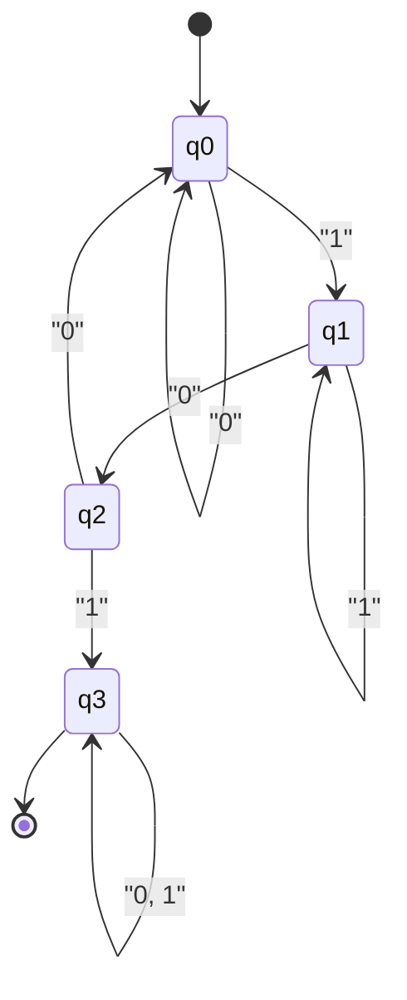

컴퓨터 과학의 근간을 지탱하는 장대한 이론, 그것이 바로 **오토마타** (Automata)와 **형식 언어 이론** (Formal Language Theory)입니다.

우리가 일상적으로 작성하는 정규 표현식(Regular Expressions)이나 프로그래밍 언어의 소스 코드를 해독하는 컴파일러, 그리고 자연어 처리에 이르기까지 이 모든 것의 기반에는 이 이론이 존재합니다. 본 기사에서는 촘스키 계층(Chomsky Hierarchy)이라는 분류를 축으로 계산이라는 개념 자체를 수학적·추상적으로 정의하는 심오한 세계로 안내합니다.

---

## 1. 형식 언어란 무엇인가?

우리가 평소 사용하는 한국어나 영어와 같은 '자연어'에 대비되어 수학적인 규칙에 의해 엄밀하게 정의된 언어를 **형식 언어** (Formal Language)라고 부릅니다. 형식 언어는 다음과 같은 기본적인 구성 요소로 이루어져 있습니다.

### 알파벳과 문자열

형식 언어 이론에서 **알파벳** (Alphabet)이란 기호들의 비어 있지 않은 유한 집합을 뜻합니다. 일반적으로 $ \Sigma $ (시그마)라는 기호로 나타냅니다.

$$
\Sigma = \{ 0, 1 \}
$$

위는 2진수의 알파벳입니다. 이 알파벳에서 생성되는 유한한 길이의 기호 나열을 **문자열** (String) 또는 **단어** (Word)라고 부릅니다.

알파벳 $ \Sigma $ 로부터 만들어지는 모든 문자열의 집합(빈 문자열 $ \epsilon $ 포함)을 클레이니 폐포(Kleene Star)를 사용하여 $ \Sigma^* $ 로 표기합니다.

### 언어의 정의

형식 언어 $ L $ 은 $ \Sigma^* $ 의 부분집합으로 정의됩니다. 즉, $ L \subseteq \Sigma^* $ 입니다.

예를 들어, "0과 1로 이루어져 있고 반드시 1로 끝나는 문자열의 집합"은 하나의 언어입니다. 이 언어 $ L $ 은 다음과 같이 기술할 수 있습니다.

$$
L = \{ w1 \mid w \in \{ 0, 1 \}^* \}
$$

형식 언어 이론의 주요 목적은 이처럼 무한히 존재할 수 있는 문자열의 집합(언어)을 유한한 규칙(문법)이나 유한한 상태를 가진 기계(오토마타)로 어떻게 표현하고 인식할 수 있는지를 밝히는 것입니다.

---

## 2. 촘스키 계층(Chomsky Hierarchy)

언어학자 노암 촘스키(Noam Chomsky)는 1956년에 형식 언어를 그 생성 규칙의 제약 강도에 따라 4개의 계층으로 분류했습니다. 이것이 **촘스키 계층** 입니다.

계층은 다음과 같이 분류됩니다(타입 0에서 타입 3까지). 숫자가 클수록 표현할 수 있는 언어의 클래스는 좁아지지만, 그만큼 컴퓨터에서 해석하기 쉬워집니다.

```mermaid
flowchart TD
    Type0["Type-0: 재귀적으로 열거 가능한 언어\n("Turing Machine")"]
    Type1["Type-1: 문맥 의존 언어\n("Linear Bounded Automaton")"]
    Type2["Type-2: 문맥 자유 언어\n("Pushdown Automaton")"]
    Type3["Type-3: 정규 언어\n("Finite Automaton")"]

    Type0 -->|"선택 안됨"| Type1
    Type0 --- Type1
    Type1 --- Type2
    Type2 --- Type3

    style Type0 fill:#f9f9f9,stroke:#333,stroke-width:2px
    style Type1 fill:#e9e9e9,stroke:#333,stroke-width:2px
    style Type2 fill:#d9d9d9,stroke:#333,stroke-width:2px
    style Type3 fill:#c9c9c9,stroke:#333,stroke-width:2px
```

1.  **타입 3(정규 언어)** : 정규 표현식으로 표현할 수 있으며, 유한 오토마타로 인식 가능.
2.  **타입 2(문맥 자유 언어)** : 프로그래밍 언어의 구문 등에 사용되며, 푸시다운 오토마타로 인식 가능.
3.  **타입 1(문맥 의존 언어)** : 선형 구속 오토마타로 인식 가능.
4.  **타입 0(재귀적으로 열거 가능한 언어)** : 튜링 기계로 인식 가능. 계산 가능한 모든 언어.

다음 장부터는 이 계층을 아래에서부터 순서대로(제약이 강한 Type-3부터) 깊이 살펴보겠습니다.

---

## 3. 정규 언어와 유한 오토마타(Type-3)

### 유한 오토마타(DFA / NFA)

촘스키 계층의 가장 안쪽에 있는 것이 **정규 언어** (Regular Languages)입니다. 이 언어를 인식하는 계산 모델이 **유한 오토마타** (Finite Automata, FA)입니다.

유한 오토마타에는 상태 전이가 결정적인 **DFA** (Deterministic Finite Automaton)와 비결정적인 **NFA** (Nondeterministic Finite Automaton)가 존재합니다. 놀랍게도 이 두 가지가 인식할 수 있는 언어의 클래스는 완전히 동일하다는(DFA와 NFA는 동등하다) 것이 증명되어 있습니다.

수학적으로, DFA는 다음과 같은 5-튜플 $ M = (Q, \Sigma, \delta, q_0, F) $ 로 정의됩니다.

*   $ Q $ : 상태의 유한 집합
*   $ \Sigma $ : 알파벳
*   $ \delta $ : 상태 전이 함수 ( $ \delta: Q \times \Sigma \rightarrow Q $ )
*   $ q_0 $ : 초기 상태 ( $ q_0 \in Q $ )
*   $ F $ : 수용 상태(종단 상태)의 집합 ( $ F \subseteq Q $ )

#### 구체적인 예: "101"을 포함하는 문자열을 수용하는 DFA

알파벳 $ \Sigma = \{ 0, 1 \} $ 에서 부분 문자열로 "101"을 포함하는 것을 인식하는 DFA를 생각해 봅시다.



이 상태 전이도를 Python 프로그램으로 구현해 보겠습니다.

```python
class DFA:
    def __init__(self):
        self.states = {'q0', 'q1', 'q2', 'q3'}
        self.alphabet = {'0', '1'}
        self.start_state = 'q0'
        self.accept_states = {'q3'}
        
        # 상태 전이 함수
        self.transitions = {
            'q0': {'0': 'q0', '1': 'q1'},
            'q1': {'0': 'q2', '1': 'q1'},
            'q2': {'0': 'q0', '1': 'q3'},
            'q3': {'0': 'q3', '1': 'q3'}
        }
        
    def accepts(self, string: str) -> bool:
        current_state = self.start_state
        for char in string:
            if char not in self.alphabet:
                return False
            current_state = self.transitions[current_state][char]
        return current_state in self.accept_states

# 테스트
dfa = DFA()
test_strings = ["001010", "11101", "1001", "010", "101"]

for s in test_strings:
    result = dfa.accepts(s)
    print(f"String '{s}': {'Accepted' if result else 'Rejected'}")
```

### 정규 표현식과의 관계(클레이니의 정리)

프로그래밍에서 사용되는 **정규 표현식** (Regular Expression)은 이 정규 언어를 기술하기 위한 표기법입니다. 스티븐 클레이니(Stephen Kleene)는 "어떤 언어가 정규 표현식으로 표현된다는 것과 유한 오토마타로 수용된다는 것은 동치이다"라는 정리를 증명했습니다.

실제 프로그래밍 언어의 정규 표현식 엔진(예를 들어 Python의 `re` 모듈)은 주어진 정규 표현식 패턴으로부터 내부적으로 NFA를 구축하여 문자열을 평가하고 있습니다.

### 반복 보조정리(Pumping Lemma)의 한계

정규 언어는 매우 편리하지만 한계가 있습니다. 예를 들어, " $ n $ 개의 $ a $ 뒤에 $ n $ 개의 $ b $ 가 이어지는 문자열의 집합" ( $ L = \{ a^n b^n \mid n \ge 0 \} $ )은 정규 언어가 아닙니다. 유한 오토마타는 "세는" 데 필요한 메모리(스택 등)를 가지고 있지 않기 때문에, 몇 개의 $ a $ 가 왔는지를 무한히 기억할 수 없기 때문입니다. 이를 증명하기 위한 수학적 기법이 **정규 언어의 반복 보조정리** 입니다.

---

## 4. 문맥 자유 언어와 푸시다운 오토마타(Type-2)

정규 언어로는 표현할 수 없는 괄호의 짝 맞추기나 프로그래밍 언어의 구문( `if-else` 의 중첩 등)을 표현하기 위해 필요한 것이 **문맥 자유 언어** (Context-Free Languages, CFL)입니다.

### 푸시다운 오토마타(PDA)

문맥 자유 언어를 인식하는 계산 모델이 **푸시다운 오토마타** (Pushdown Automaton, PDA)입니다. PDA는 유한 오토마타에 **스택** ([Stack](https://kenji.blog/ko/p/c-language-pointers-memory-management-stack-heap/), 후입선출 메모리)을 추가한 것입니다. 스택을 사용함으로써 "열린 괄호의 수를 기억해 두고, 닫히는 괄호가 올 때마다 소비한다"는 등의 처리가 가능해집니다.

#### 구체적인 예: $ a^n b^n $ 을 수용하는 PDA

알파벳 $ \Sigma = \{ a, b \} $ 에서 같은 수의 $ a $ 와 $ b $ 가 이어지는 문자열을 수용하는 PDA를 구현해 보겠습니다.

```python
class PDA:
    def __init__(self):
        self.stack = []
        self.state = 'q0'
        
    def accepts(self, string: str) -> bool:
        self.stack = []
        self.state = 'q_a' # a를 읽어들이는 상태
        
        for char in string:
            if self.state == 'q_a':
                if char == 'a':
                    self.stack.append('A') # 스택에 쌓음
                elif char == 'b':
                    self.state = 'q_b'
                    if not self.stack:
                        return False
                    self.stack.pop() # 스택에서 꺼냄
                else:
                    return False
            elif self.state == 'q_b':
                if char == 'b':
                    if not self.stack:
                        return False
                    self.stack.pop()
                else:
                    return False
                    
        # 문자열을 모두 읽었을 때 스택이 비어 있으면 수용
        return len(self.stack) == 0

# 테스트
pda = PDA()
print("aaabbb:", pda.accepts("aaabbb")) # True
print("aabbb:", pda.accepts("aabbb"))   # False
print("ab:", pda.accepts("ab"))         # True
print("a:", pda.accepts("a"))           # False
```

### 문맥 자유 문법(CFG)과 BNF

문맥 자유 언어를 생성하는 규칙을 **문맥 자유 문법** (Context-Free Grammar, CFG)이라고 부릅니다. CFG는 $ (V, \Sigma, R, S) $ 로 정의됩니다.
여기서 $ R $ 은 $ A \rightarrow \gamma $ 형태를 지닌 생성 규칙의 집합입니다. ( $ A $ 는 비종단 기호, $ \gamma $ 는 종단 기호와 비종단 기호의 열).

프로그래밍 언어의 사양서에서 자주 볼 수 있는 **BNF** (Backus-Naur Form)는 이 문맥 자유 문법을 기술하기 위한 메타 언어입니다. 다음은 수식을 정의하는 BNF의 예입니다.

```bnf
<expr>   ::= <expr> "+" <term> | <term>
<term>   ::= <term> "*" <factor> | <factor>
<factor> ::= "(" <expr> ")" | <number>
<number> ::= "0" | "1" | "2" | ... | "9"
```

컴파일러의 **구문 분석** (Parsing) 단계에서는 어휘 분석기가 생성한 토큰의 열이 이 문맥 자유 문법을 따르고 있는지를 PDA의 원리를 응용한 알고리즘(LL 구문 분석이나 LR 구문 분석)으로 검사하여, 추상 구문 트리(AST)를 구축합니다.

---

## 5. 문맥 의존 언어와 선형 구속 오토마타(Type-1)

문맥 자유 언어는 프로그래밍 언어 구문의 대부분을 표현할 수 있지만, "선언된 변수만 사용할 수 있다"와 같은 전후 문맥에 의존하는 제약(의미론적 제약)은 표현할 수 없습니다. 이들을 다루는 것이 **문맥 의존 언어** (Context-Sensitive Languages, CSL)입니다.

### 선형 구속 오토마타(LBA)

문맥 의존 언어를 인식하는 것은 **선형 구속 오토마타** (Linear Bounded Automaton, LBA)입니다. LBA는 튜링 기계의 일종이지만, 테이프의 길이가 입력 문자열의 길이에 비례하는(선형) 크기로 제한된다는 특징이 있습니다.

문맥 의존 언어의 전형적인 예는 $ L = \{ a^n b^n c^n \mid n \ge 1 \} $ 입니다. PDA는 스택을 하나밖에 가지지 않기 때문에, $ a $ 와 $ b $ 의 수는 맞출 수 있어도 그 뒤에 이어지는 $ c $ 의 수까지 맞출 수는 없습니다( $ a $ 의 수를 세어 스택에서 모두 팝(pop)해버리기 때문입니다). LBA는 테이프 위를 오갈 수 있기 때문에 이 언어를 인식할 수 있습니다.

자연어(인간의 언어)는 일반적으로 문맥 자유 언어보다 복잡하여 문맥 의존 언어에 가까운 성질을 가지고 있다고 여겨집니다.

---

## 6. 재귀적으로 열거 가능한 언어와 튜링 기계(Type-0)

마지막으로 도달하는 곳이 **재귀적으로 열거 가능한 언어** (Recursively Enumerable Languages)와 **튜링 기계** ([Turing Machine](https://kenji.blog/ko/p/turing-machine-computability/))입니다.

### 튜링 기계: 계산의 궁극적인 모델

1936년 앨런 튜링(Alan Turing)이 고안한 튜링 기계는 현대의 모든 컴퓨터(폰 노이만 구조 컴퓨터)의 이론적인 한계와 동등한 계산 능력을 가집니다.

튜링 기계는 무한히 이어지는 "테이프"와, 테이프를 읽고 쓰면서 좌우로 움직이는 "헤드", 그리고 유한 개의 "상태"로 구성됩니다.

```mermaid
flowchart LR
    subgraph Tape
        direction LR
        T1["..."] --- T2["0"] --- T3["1"] --- T4["1"] --- T5["0"] --- T6["..."]
    end
    Head(("Head")) --> T3
    State["State: q_read\n("Finite Control")"] --- Head
```

### 정지 문제([Halting Problem](https://kenji.blog/ko/p/turing-machine-computability/))

튜링 기계의 틀 안에서 가장 중요한 발견 중 하나가 **계산 불가능성** (Undecidability)의 존재입니다.
"임의의 프로그램과 입력이 주어졌을 때, 그 프로그램이 언젠가 정지할지 아니면 무한 루프에 빠질지를 판정하는 프로그램(알고리즘)은 존재하지 않는다"라는 것이 유명한 **정지 문제** 입니다.

이것은 아무리 강력한 AI나 컴퓨터를 만들더라도 "모든 버그나 무한 루프를 자동으로 사전에 검출하는 완벽한 정적 분석 도구는 절대 만들 수 없다"라는 수학적인 한계를 보여줍니다.

---

## 7. 현대 소프트웨어 개발과 형식 언어 이론의 교차점

지금까지 살펴본 이론은 결코 학술적인 상아탑에만 머무르는 것이 아닙니다. 현대 소프트웨어 엔지니어링의 곳곳에서 활약하고 있습니다.

1.  **어휘 분석기(Lexer)의 자동 생성**: `Lex` 나 `Flex` 등의 도구는 개발자가 작성한 정규 표현식을 DFA로 변환하여 고속의 C 언어 코드를 자동 생성합니다.
2.  **구문 분석기(Parser)의 자동 생성**: `Yacc` 나 `Bison` 등의 도구는 개발자가 작성한 BNF(문맥 자유 문법)로부터 LR 파서(PDA의 응용)를 자동 생성합니다.
3.  **JSON이나 XML의 파싱**: 이러한 데이터 포맷의 유효성 검사나 파싱도 형식 언어 이론의 알고리즘에 기반하고 있습니다.
4.  **에디터의 구문 강조(Syntax Highlighting)**: IDE가 코드의 색상 구분을 고속으로 수행할 수 있는 것은 이면에 유한 오토마타가 동작하고 있기 때문입니다.

### Regex 엔진의 함정(Catastrophic Backtracking)

많은 프로그래밍 언어([Java](https://kenji.blog/ko/p/programming-languages-history-paradigm-evolution/), Python, Ruby, JavaScript 등)에 내장된 정규 표현식 엔진은 이론상의 순수한 DFA가 아니라 백트래킹을 동반하는 NFA 기반(또는 백트래킹 엔진)으로 구현되어 있습니다.

이 때문에 특정 패턴의 정규 표현식(예: `(a+)+$` 등)에 대해 교묘한 문자열을 주면 계산량이 지수함수적으로 폭발하여 시스템이 멈춰버리는 **ReDoS** (Regular Expression Denial of [Service](https://kenji.blog/ko/p/kubernetes-k8s-architecture-pod-service-ingress/))라는 취약점을 일으킬 수 있습니다. 이론을 알고 있으면 왜 백트래킹이 일어나는지, 어떻게 패턴을 다시 작성해야 안전한 DFA에 상당하는 처리로 귀결시킬 수 있는지 논리적으로 생각할 수 있습니다.

---

## 요약: 추상화의 미학

**오토마타와 형식 언어 이론** 은 컴퓨터의 물리적인 구조(CPU나 메모리)를 일절 배제하고 "계산이란 무엇인가", "언어란 무엇인가"라는 순수한 수학적 모델로 추상화한 극치입니다.

*   **Type-3 (DFA)**: 메모리를 가지지 않는 기계(정규 표현식)
*   **Type-2 (PDA)**: 스택 메모리를 가지는 기계(구문 분석)
*   **Type-1 (LBA)**: 유한한 테이프를 가지는 기계
*   **Type-0 (TM)**: 무한한 테이프를 가지는 기계(만능 컴퓨터)

우리가 매일 작성하는 소스 코드는 컴파일러라는 거대한 오토마타 무리에 의해 Type-2(구문)에서 Type-3(어휘)으로 분해되고, 최종적으로 기계어로 번역되어 갑니다.

표면적인 프레임워크나 언어의 유행이 변하더라도 1950년대부터 이어지는 이 견고한 수학적 기반이 변하는 일은 없습니다. 가끔 정규 표현식의 복잡한 퍼즐에 직면했을 때나 새로운 파서를 작성할 기회가 있을 때는, 그 이면에 있는 튜링이나 촘스키의 위대한 이론에 생각을 떠올려 보는 것은 어떨까요?
