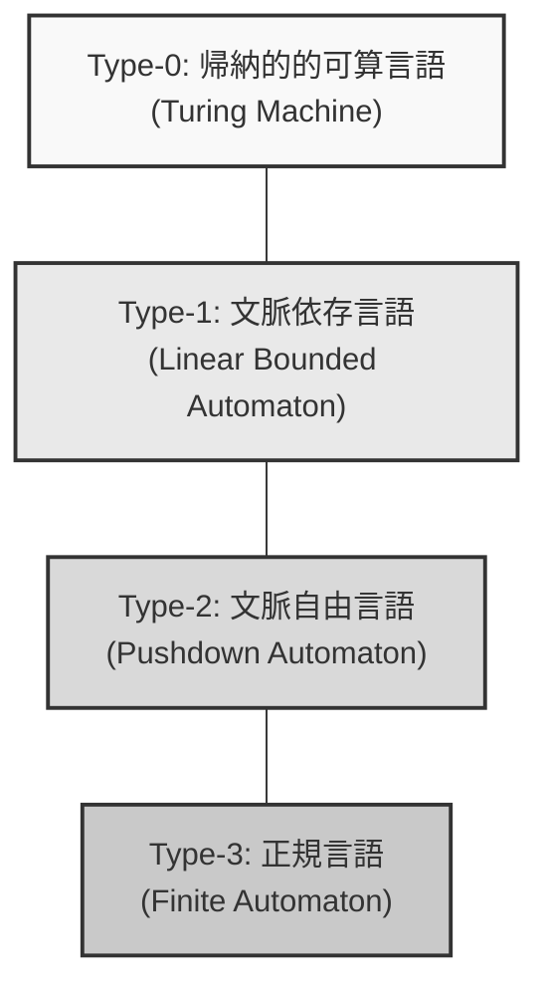
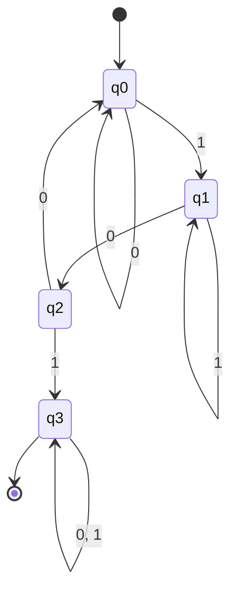
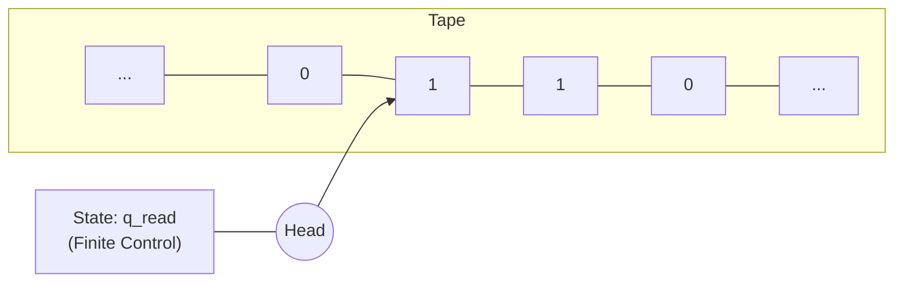

計算機科学の根底を支える壮大な理論、それが **オートマトン** （ Automata ）と **形式言語理論** （ Formal Language Theory ）です。

私たちが日常的に記述している正規表現（ Regular Expressions ）や、[プログラミング言語](https://kenji.blog/p/programming-languages-history-paradigm-evolution/)のソースコードを読み解くコンパイラ、そして自然言語処理に至るまで、これらすべての基盤にはこの理論が存在します。本記事では、チョムスキー階層（ Chomsky Hierarchy ）という分類を軸に、計算という概念そのものを数学的・抽象的に定義する深淵なる世界へご案内します。

---

## 1. 形式言語とは何か？

私たちが普段使っている日本語や英語のような「自然言語」に対し、数学的なルールによって厳密に定義された言語を **形式言語** （ Formal Language ）と呼びます。形式言語は、以下の基本的な構成要素から成り立っています。

### アルファベットと文字列

形式言語理論における **アルファベット** （ Alphabet ）とは、記号の空でない有限集合のことです。通常、 $ \Sigma $ （シグマ）という記号で表されます。

$$
\Sigma = \{ 0, 1 \}
$$

上記は、2進数のアルファベットです。このアルファベットから生成される有限の長さの記号の列を **文字列** （ String ）または **語** （ Word ）と呼びます。

アルファベット $ \Sigma $ から作られるすべての文字列の集合（空文字列 $ \epsilon $ を含む）を、クリーネ閉包（ Kleene Star ）を用いて $ \Sigma^* $ と表記します。

### 言語の定義

形式言語 $ L $ は、 $ \Sigma^* $ の部分集合として定義されます。つまり、 $ L \subseteq \Sigma^* $ です。

たとえば、 「0と1から成り、必ず1で終わる文字列の集合」 はひとつの言語です。この言語 $ L $ は次のように記述できます。

$$
L = \{ w1 \mid w \in \{ 0, 1 \}^* \}
$$

形式言語理論の主な目的は、このような無限に存在し得る文字列の集合（言語）を、有限の規則（文法）や有限の状態を持つ機械（オートマトン）でどのように表現し、認識できるかを明らかにすることです。

---

## 2. チョムスキー階層（ Chomsky Hierarchy ）

言語学者ノーム・チョムスキー（ Noam Chomsky ）は、1956年に形式言語をその生成規則の制約の強さによって4つの階層に分類しました。これが **チョムスキー階層** です。

階層は以下のように分類されます（タイプ0からタイプ3まで）。数字が大きいほど、表現できる言語のクラスは狭くなりますが、その分コンピュータで解析しやすくなります。



1.  **タイプ3（正規言語）** : 正規表現で表現でき、有限オートマトンで認識可能。
2.  **タイプ2（文脈自由言語）** : [プログラミング言語](https://kenji.blog/p/programming-languages-history-paradigm-evolution/)の構文などに使われ、プッシュダウン・オートマトンで認識可能。
3.  **タイプ1（文脈依存言語）** : 線形拘束オートマトンで認識可能。
4.  **タイプ0（帰納的的可算言語）** : [チューリングマシン](https://kenji.blog/p/turing-machine-computability/)で認識可能。計算可能なすべての言語。

次章からは、この階層を下から順（制限の強い Type-3 から）に深く見ていきましょう。

---

## 3. 正規言語と有限オートマトン（ Type-3 ）

### 有限オートマトン（ DFA / NFA ）

チョムスキー階層の最も内側にあるのが **正規言語** （ Regular Languages ）です。この言語を認識する計算モデルが **有限オートマトン** （ Finite Automata, FA ）です。

有限オートマトンには、状態遷移が決定的な **DFA** （ Deterministic Finite Automaton ）と、非決定的な **NFA** （ Nondeterministic Finite Automaton ）が存在します。驚くべきことに、これら二つが認識できる言語のクラスは完全に等しい（DFAとNFAは等価である）ことが証明されています。

数学的に、DFA は以下の5項組 $ M = (Q, \Sigma, \delta, q_0, F) $ で定義されます。

*   $ Q $ : 状態の有限集合
*   $ \Sigma $ : アルファベット
*   $ \delta $ : 状態遷移関数 ( $ \delta: Q \times \Sigma \rightarrow Q $ )
*   $ q_0 $ : 初期状態 ( $ q_0 \in Q $ )
*   $ F $ : 受理状態（終端状態）の集合 ( $ F \subseteq Q $ )

#### 具体例：「101」を含む文字列を受理する DFA

アルファベット $ \Sigma = \{ 0, 1 \} $ において、部分文字列として「101」を含むものを認識する DFA を考えます。



この状態遷移図を Python プログラムとして実装してみましょう。

```python
class DFA:
    def __init__(self):
        self.states = {'q0', 'q1', 'q2', 'q3'}
        self.alphabet = {'0', '1'}
        self.start_state = 'q0'
        self.accept_states = {'q3'}
        
        # 状態遷移関数
        self.transitions = {
            'q0': {'0': 'q0', '1': 'q1'},
            'q1': {'0': 'q2', '1': 'q1'},
            'q2': {'0': 'q0', '1': 'q3'},
            'q3': {'0': 'q3', '1': 'q3'}
        }
        
    def accepts(self, string: str) -> bool:
        current_state = self.start_state
        for char in string:
            if char not in self.alphabet:
                return False
            current_state = self.transitions[current_state][char]
        return current_state in self.accept_states

# テスト
dfa = DFA()
test_strings = ["001010", "11101", "1001", "010", "101"]

for s in test_strings:
    result = dfa.accepts(s)
    print(f"String '{s}': {'Accepted' if result else 'Rejected'}")
```

### 正規表現との関係（クリーネの定理）

プログラミングで用いられる **正規表現** （ Regular Expression ）は、この正規言語を記述するための記法です。スティーブン・クリーネ（ Stephen Kleene ）は、「ある言語が正規表現で表されることと、有限オートマトンで受理されることは同値である」という定理を証明しました。

実際の[プログラミング言語](https://kenji.blog/p/programming-languages-history-paradigm-evolution/)の正規表現エンジン（例えばPythonの `re` モジュール）は、与えられた正規表現パターンから内部的に NFA を構築し、文字列を評価しています。

### 反復補題（ Pumping Lemma ）の限界

正規言語は非常に便利ですが、限界があります。たとえば、 「 $ n $ 個の $ a $ の後に $ n $ 個の $ b $ が続く文字列の集合」 （ $ L = \{ a^n b^n \mid n \ge 0 \} $ ）は正規言語ではありません。有限オートマトンは「数える」ためのメモリ（[スタック](https://kenji.blog/p/c-language-pointers-memory-management-stack-heap/)等）を持たないため、いくつの $ a $ が来たかを無限に記憶することができないからです。これを証明するための数学的手法が **正規言語の反復補題** です。

---

## 4. 文脈自由言語とプッシュダウン・オートマトン（ Type-2 ）

正規言語では表現できない括弧の対応付けや、[プログラミング言語](https://kenji.blog/p/programming-languages-history-paradigm-evolution/)の構文（ `if-else` のネストなど）を表現するために必要なのが **文脈自由言語** （ Context-Free Languages, CFL ）です。

### プッシュダウン・オートマトン（ PDA ）

文脈自由言語を認識する計算モデルが **プッシュダウン・オートマトン** （ Pushdown Automaton, PDA ）です。PDA は、有限オートマトンに **[スタック](https://kenji.blog/p/c-language-pointers-memory-management-stack-heap/)** （ [Stack](https://kenji.blog/p/c-language-pointers-memory-management-stack-heap/), 後入れ先出しのメモリ）を追加したものです。スタックを使うことで、「開いた括弧の数を記憶しておき、閉じる括弧が来るたびに消費する」といったことが可能になります。

#### 具体例： $ a^n b^n $ を受理する PDA

アルファベット $ \Sigma = \{ a, b \} $ で、同じ数の $ a $ と $ b $ が続く文字列を受理する PDA を実装してみましょう。

```python
class PDA:
    def __init__(self):
        self.stack = []
        self.state = 'q0'
        
    def accepts(self, string: str) -> bool:
        self.stack = []
        self.state = 'q_a' # aを読み込む状態
        
        for char in string:
            if self.state == 'q_a':
                if char == 'a':
                    self.stack.append('A') # スタックに積む
                elif char == 'b':
                    self.state = 'q_b'
                    if not self.stack:
                        return False
                    self.stack.pop() # スタックから取り出す
                else:
                    return False
            elif self.state == 'q_b':
                if char == 'b':
                    if not self.stack:
                        return False
                    self.stack.pop()
                else:
                    return False
                    
        # 文字列を読み終えたとき、スタックが空であれば受理
        return len(self.stack) == 0

# テスト
pda = PDA()
print("aaabbb:", pda.accepts("aaabbb")) # True
print("aabbb:", pda.accepts("aabbb"))   # False
print("ab:", pda.accepts("ab"))         # True
print("a:", pda.accepts("a"))           # False
```

### 文脈自由文法（ CFG ）と BNF

文脈自由言語を生成する規則を **文脈自由文法** （ Context-Free Grammar, CFG ）と呼びます。CFG は $ (V, \Sigma, R, S) $ で定義されます。
ここで $ R $ は $ A \rightarrow \gamma $ の形をした生成規則の集合です。（ $ A $ は非終端記号、 $ \gamma $ は終端記号と非終端記号の列）。

[プログラミング言語](https://kenji.blog/p/programming-languages-history-paradigm-evolution/)の仕様書でよく見かける **BNF** （ Backus-Naur Form ）は、この文脈自由文法を記述するためのメタ言語です。以下は数式を定義する BNF の例です。

```bnf
<expr>   ::= <expr> "+" <term> | <term>
<term>   ::= <term> "*" <factor> | <factor>
<factor> ::= "(" <expr> ")" | <number>
<number> ::= "0" | "1" | "2" | ... | "9"
```

コンパイラの **構文解析** （ Parsing ）フェーズでは、字句解析器が生成したトークンの列が、この文脈自由文法に従っているかどうかを PDA の原理を応用したアルゴリズム（ LL 構文解析や LR 構文解析）でチェックし、抽象構文木（ AST ）を構築します。

---

## 5. 文脈依存言語と線形拘束オートマトン（ Type-1 ）

文脈自由言語は[プログラミング言語](https://kenji.blog/p/programming-languages-history-paradigm-evolution/)の構文の大半を表現できますが、 「宣言された変数しか使用できない」 といった、前後の文脈に依存する制約（意味論的制約）は表現できません。これらを扱うのが **文脈依存言語** （ Context-Sensitive Languages, CSL ）です。

### 線形拘束オートマトン（ LBA ）

文脈依存言語を認識するのは **線形拘束オートマトン** （ Linear Bounded Automaton, LBA ）です。LBA は[チューリングマシン](https://kenji.blog/p/turing-machine-computability/)の一種ですが、テープの長さが入力文字列の長さに比例する（線形）サイズに制限されているという特徴があります。

文脈依存言語の典型的な例は $ L = \{ a^n b^n c^n \mid n \ge 1 \} $ です。PDA は[スタック](https://kenji.blog/p/c-language-pointers-memory-management-stack-heap/)を1つしか持たないため、 $ a $ と $ b $ の数を合わせることはできても、その後に続く $ c $ の数まで合わせることはできません（ $ a $ の数を数えてスタックからポップしきってしまうため）。LBA はテープ上を行き来できるため、この言語を認識できます。

自然言語（人間の言語）は、一般に文脈自由言語よりも複雑で、文脈依存言語に近い性質を持っていると考えられています。

---

## 6. 帰納的的可算言語とチューリングマシン（ Type-0 ）

最後に到達するのが、 **帰納的的可算言語** （ Recursively Enumerable Languages ）と **チューリングマシン** （ [Turing Machine](https://kenji.blog/p/turing-machine-computability/) ）です。

### チューリングマシン：計算の究極のモデル

1936年にアラン・チューリング（ Alan Turing ）が考案したチューリングマシンは、現代のあらゆるコンピュータ（ノイマン型コンピュータ）の理論的な限界と等価な計算能力を持ちます。

チューリングマシンは、無限に続く「テープ」と、テープを読み書きしながら左右に動く「ヘッド」、そして有限個の「状態」から構成されます。



### [停止性問題](https://kenji.blog/p/turing-machine-computability/)（ [Halting Problem](https://kenji.blog/p/turing-machine-computability/) ）

[チューリングマシン](https://kenji.blog/p/turing-machine-computability/)の枠組みにおいて最も重要な発見の一つが、 **計算不可能性** （ Undecidability ）の存在です。
「任意のプログラムと入力が与えられたとき、そのプログラムがいつか停止するか、それとも無限ループに陥るかを判定するプログラム（アルゴリズム）は存在しない」 というのが有名な **停止性問題** です。

これは、どんなに強力なAIやコンピュータを作ったとしても、「すべてのバグや無限ループを自動で事前に検出する完璧な静的解析ツールは絶対に作れない」という数学的な限界を示しています。

---

## 7. 現代ソフトウェア開発と形式言語理論の交差点

これまで見てきた理論は、決して学術的な象牙の塔に留まるものではありません。現代のソフトウェア・エンジニアリングの至る所で活躍しています。

1.  **字句解析器（ Lexer ）の自動生成**: `Lex` や `Flex` などのツールは、開発者が書いた正規表現を DFA に変換し、高速な[C言語](https://kenji.blog/p/c-language-pointers-memory-management-stack-heap/)のコードを自動生成します。
2.  **構文解析器（ Parser ）の自動生成**: `Yacc` や `Bison` などのツールは、開発者が書いた BNF（文脈自由文法）から LR パーサ（PDAの応用）を自動生成します。
3.  **JSONやXMLのパース**: これらデータフォーマットのバリデーションやパースも、形式言語理論のアルゴリズムに基づいています。
4.  **エディタのシンタックスハイライト**: IDE がコードの色分けを高速に行えるのは、裏側で有限オートマトンが動いているからです。

### Regexエンジンの落とし穴（ Catastrophic Backtracking ）

多くの[プログラミング言語](https://kenji.blog/p/programming-languages-history-paradigm-evolution/)（ [Java](https://kenji.blog/p/programming-languages-history-paradigm-evolution/), Python, Ruby, JavaScript など）に組み込まれている正規表現エンジンは、理論上の純粋な DFA ではなく、バックトラックを伴う NFA ベース（またはバックトラッキングエンジン）で実装されています。

このため、特定のパターンの正規表現（例： `(a+)+$` など）に対して巧妙な文字列を与えると、計算量が指数関数的に爆発し、システムがフリーズしてしまう **ReDoS** （ Regular Expression Denial of [Service](https://kenji.blog/p/kubernetes-k8s-architecture-pod-service-ingress/) ）という[脆弱性](https://kenji.blog/p/web-application-vulnerability-owasp-top-10/)を引き起こすことがあります。理論を知っていれば、なぜバックトラックが起こるのか、どのようにパターンを書き直せば安全な DFA 相当の処理に落とし込めるのかを論理的に考えることができます。

---

## まとめ：抽象化の美学

**オートマトンと形式言語理論** は、計算機の物理的な構造（CPUやメモリ）を一切排除し、「計算とは何か」「言語とは何か」という純粋な数学的モデルへと抽象化した極致です。

*   **Type-3 (DFA)**: メモリを持たない機械（正規表現）
*   **Type-2 (PDA)**: [スタック](https://kenji.blog/p/c-language-pointers-memory-management-stack-heap/)メモリを持つ機械（構文解析）
*   **Type-1 (LBA)**: 有限のテープを持つ機械
*   **Type-0 (TM)**: 無限のテープを持つ機械（万能コンピュータ）

私たちが毎日書いているソースコードは、コンパイラという巨大なオートマトンの群れによって、Type-2（構文）からType-3（字句）へと分解され、最終的に機械語へと翻訳されていきます。

表面的なフレームワークや言語の流行が移り変わっても、1950年代から続くこの強固な数学的基盤が変わることはありません。時折、正規表現の複雑なパズルに直面したときや、新しいパーサを書く機会があったときは、背後にあるチューリングやチョムスキーの偉大な理論に思いを馳せてみてはいかがでしょうか。
