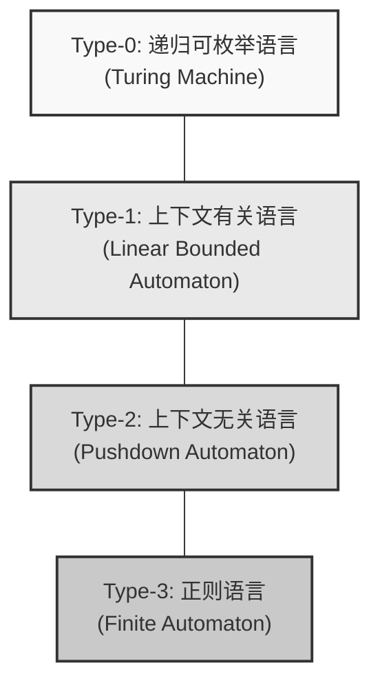
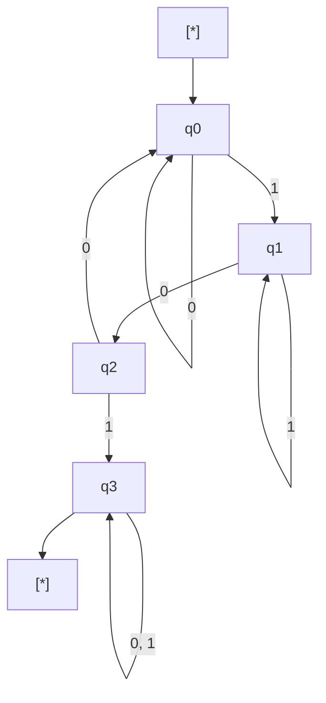
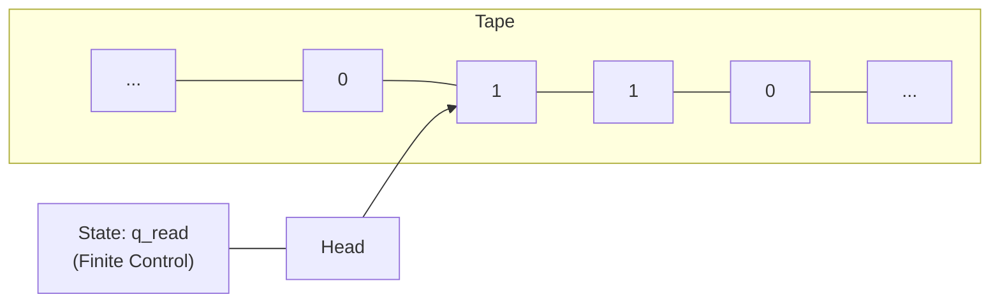

支撑计算机科学根基的宏大理论，那就是 **自动机** （ Automata ）与 **形式语言理论** （ Formal Language Theory ）。

我们日常编写的正则表达式（ Regular Expressions ）、解析编程语言源代码的编译器，甚至自然语言处理，所有这一切的基础中都存在着这一理论。本文将以乔姆斯基谱系（ Chomsky Hierarchy ）分类为主轴，带您进入将计算这一概念本身进行数学与抽象定义的深邃世界。

---

## 1. 什么是形式语言？

相对于我们平时使用的日语或英语等“自然语言”，由数学规则严格定义的语言被称为 **形式语言** （ Formal Language ）。形式语言由以下基本构成要素组成。

### 字母表与字符串

形式语言理论中的 **字母表** （ Alphabet ）是指符号的非空有限集合。通常用记号 $ \Sigma $ （Sigma）来表示。

$$
\Sigma = \{ 0, 1 \}
$$

上述是二进制数的字母表。由该字母表生成的有限长度的符号序列被称为 **字符串** （ String ）或 **字** （ Word ）。

由字母表 $ \Sigma $ 生成的所有字符串的集合（包含空字符串 $ \epsilon $ ），使用克林闭包（ Kleene Star ）记为 $ \Sigma^* $ 。

### 语言的定义

形式语言 $ L $ 被定义为 $ \Sigma^* $ 的子集。也就是说， $ L \subseteq \Sigma^* $ 。

例如，“由0和1组成且必须以1结尾的字符串的集合”就是一种语言。该语言 $ L $ 可以描述如下：

$$
L = \{ w1 \mid w \in \{ 0, 1 \}^* \}
$$

形式语言理论的主要目的是阐明：对于这样可能无限存在的字符串集合（语言），如何使用有限的规则（文法）或拥有有限状态的机器（自动机）来表达与识别。

---

## 2. 乔姆斯基谱系（ Chomsky Hierarchy ）

语言学家诺姆·乔姆斯基（ Noam Chomsky ）在1956年根据生成规则约束的强弱，将形式语言分为了四个层级。这就是 **乔姆斯基谱系** 。

层级分类如下（从0型到3型）。数字越大，能表达的语言类就越窄，但相应地更容易用计算机进行解析。



1.  **3型（正则语言）** : 可以用正则表达式表达，可由有限自动机识别。
2.  **2型（上下文无关语言）** : 用于编程语言的语法等，可由下推自动机识别。
3.  **1型（上下文有关语言）** : 可由线性有界自动机识别。
4.  **0型（递归可枚举语言）** : 可由图灵机识别。所有可计算的语言。

从下一章开始，我们将按从下到上的顺序（从限制最严的 Type-3 开始）深入探讨这个谱系。

---

## 3. 正则语言与有限自动机（ Type-3 ）

### 有限自动机（ DFA / NFA ）

位于乔姆斯基谱系最内层的是 **正则语言** （ Regular Languages ）。识别这种语言的计算模型是 **有限自动机** （ Finite Automata, FA ）。

有限自动机分为状态转移是确定性的 **DFA** （ Deterministic Finite Automaton ）和非确定性的 **NFA** （ Nondeterministic Finite Automaton ）。令人惊讶的是，已证明这两种自动机能够识别的语言类完全相等（DFA与NFA等价）。

在数学上，DFA 被定义为以下的五元组 $ M = (Q, \Sigma, \delta, q_0, F) $ 。

*   $ Q $ : 状态的有限集合
*   $ \Sigma $ : 字母表
*   $ \delta $ : 状态转移函数 ( $ \delta: Q \times \Sigma \rightarrow Q $ )
*   $ q_0 $ : 初始状态 ( $ q_0 \in Q $ )
*   $ F $ : 接受状态（终止状态）的集合 ( $ F \subseteq Q $ )

#### 示例：接受包含子串“101”的字符串的 DFA

在字母表 $ \Sigma = \{ 0, 1 \} $ 中，我们来考虑一个能识别包含“101”作为子串的字符串的 DFA。



我们将这个状态转移图作为 Python 程序来实现一下。

```python
class DFA:
    def __init__(self):
        self.states = {'q0', 'q1', 'q2', 'q3'}
        self.alphabet = {'0', '1'}
        self.start_state = 'q0'
        self.accept_states = {'q3'}
        
        # 状态转移函数
        self.transitions = {
            'q0': {'0': 'q0', '1': 'q1'},
            'q1': {'0': 'q2', '1': 'q1'},
            'q2': {'0': 'q0', '1': 'q3'},
            'q3': {'0': 'q3', '1': 'q3'}
        }
        
    def accepts(self, string: str) -> bool:
        current_state = self.start_state
        for char in string:
            if char not in self.alphabet:
                return False
            current_state = self.transitions[current_state][char]
        return current_state in self.accept_states

# 测试
dfa = DFA()
test_strings = ["001010", "11101", "1001", "010", "101"]

for s in test_strings:
    result = dfa.accepts(s)
    print(f"String '{s}': {'Accepted' if result else 'Rejected'}")
```

### 与正则表达式的关系（克林定理）

编程中使用的 **正则表达式** （ Regular Expression ）就是用来描述这种正则语言的记法。斯蒂芬·克林（ Stephen Kleene ）证明了一个定理：“某种语言能用正则表达式表示，与能被有限自动机接受是等价的”。

实际编程语言中的正则表达式引擎（例如Python的 `re` 模块）会在内部根据给定的正则表达式模式构建 NFA，从而对字符串进行评估。

### 泵引理（ Pumping Lemma ）的局限性

正则语言虽然非常方便，但也有局限性。例如，“ $ n $ 个 $ a $ 后面跟着 $ n $ 个 $ b $ 的字符串集合” （ $ L = \{ a^n b^n \mid n \ge 0 \} $ ）就不是正则语言。因为有限自动机没有用来“计数”的内存（如栈等），无法无限地记住到底来了多少个 $ a $ 。用来证明这一点的数学方法就是 **正则语言的泵引理** 。

---

## 4. 上下文无关语言与下推自动机（ Type-2 ）

为了表达正则语言无法表达的括号匹配，以及编程语言的语法（例如 `if-else` 的嵌套等），我们需要 **上下文无关语言** （ Context-Free Languages, CFL ）。

### 下推自动机（ PDA ）

识别上下文无关语言的计算模型是 **下推自动机** （ Pushdown Automaton, PDA ）。PDA 是在有限自动机的基础上增加了 **栈** （ [Stack](https://kenji.blog/zh-cn/p/c-language-pointers-memory-management-stack-heap/), 后进先出的内存）而构成的。通过使用栈，就可以实现诸如“记住左括号的数量，每当出现右括号就消耗一个”的功能。

#### 示例：接受 $ a^n b^n $ 的 PDA

在字母表 $ \Sigma = \{ a, b \} $ 中，让我们来实现一个接受相同数量 $ a $ 和 $ b $ 连续字符串的 PDA。

```python
class PDA:
    def __init__(self):
        self.stack = []
        self.state = 'q0'
        
    def accepts(self, string: str) -> bool:
        self.stack = []
        self.state = 'q_a' # 读取a的状态
        
        for char in string:
            if self.state == 'q_a':
                if char == 'a':
                    self.stack.append('A') # 压入栈
                elif char == 'b':
                    self.state = 'q_b'
                    if not self.stack:
                        return False
                    self.stack.pop() # 从栈中弹出
                else:
                    return False
            elif self.state == 'q_b':
                if char == 'b':
                    if not self.stack:
                        return False
                    self.stack.pop()
                else:
                    return False
                    
        # 读取完字符串时，如果栈为空则接受
        return len(self.stack) == 0

# 测试
pda = PDA()
print("aaabbb:", pda.accepts("aaabbb")) # True
print("aabbb:", pda.accepts("aabbb"))   # False
print("ab:", pda.accepts("ab"))         # True
print("a:", pda.accepts("a"))           # False
```

### 上下文无关文法（ CFG ）与 BNF

生成上下文无关语言的规则被称为 **上下文无关文法** （ Context-Free Grammar, CFG ）。CFG 由 $ (V, \Sigma, R, S) $ 定义。
这里 $ R $ 是形如 $ A \rightarrow \gamma $ 的生成规则集合。（ $ A $ 是非终结符， $ \gamma $ 是终结符和非终结符的序列）。

我们在编程语言规范中常见的 **BNF** （ Backus-Naur Form ）就是用来描述这种上下文无关文法的元语言。以下是定义数学表达式的 BNF 示例。

```bnf
<expr>   ::= <expr> "+" <term> | <term>
<term>   ::= <term> "*" <factor> | <factor>
<factor> ::= "(" <expr> ")" | <number>
<number> ::= "0" | "1" | "2" | ... | "9"
```

在编译器的 **语法解析** （ Parsing ）阶段，会运用基于 PDA 原理的算法（ LL 解析或 LR 解析），来检查词法分析器生成的 Token 序列是否符合该上下文无关文法，并构建抽象语法树（ AST ）。

---

## 5. 上下文有关语言与线性有界自动机（ Type-1 ）

上下文无关语言能够表达绝大部分的编程语言语法，但它无法表达诸如“只能使用已声明的变量”这样依赖于前后上下文的限制（语义限制）。处理这些问题的是 **上下文有关语言** （ Context-Sensitive Languages, CSL ）。

### 线性有界自动机（ LBA ）

识别上下文有关语言的是 **线性有界自动机** （ Linear Bounded Automaton, LBA ）。LBA 是图灵机的一种，其特点是纸带的长度被限制在与输入字符串长度成正比（线性）的大小内。

上下文有关语言的典型例子是 $ L = \{ a^n b^n c^n \mid n \ge 1 \} $ 。因为 PDA 只有一个栈，所以它虽然能匹配 $ a $ 和 $ b $ 的数量，却无法再匹配随后出现的 $ c $ 的数量（因为在计数 $ a $ 之后出栈就把栈清空了）。而 LBA 可以在纸带上前后移动，因此可以识别这种语言。

人们通常认为，自然语言（人类的语言）比上下文无关语言更复杂，具有更接近上下文有关语言的性质。

---

## 6. 递归可枚举语言与图灵机（ Type-0 ）

最后达到的是 **递归可枚举语言** （ Recursively Enumerable Languages ）与 **图灵机** （ [Turing Machine](https://kenji.blog/zh-cn/p/turing-machine-computability/) ）。

### 图灵机：计算的终极模型

艾伦·图灵（ Alan Turing ）在1936年提出的图灵机，拥有等价于现代所有计算机（冯·诺伊曼型计算机）理论极限的计算能力。

图灵机由无限延伸的“纸带”、能在纸带上读写并左右移动的“读写头”，以及有限个“状态”构成。



### 停机问题（ [Halting Problem](https://kenji.blog/zh-cn/p/turing-machine-computability/) ）

在图灵机的理论框架中，最重要的发现之一就是 **不可计算性** （ Undecidability ）的存在。
“给定任意程序和输入，不存在这样一个程序（算法）能够判定该程序最终是会停止还是陷入无限循环”，这就是著名的 **停机问题** 。

这表明了一个数学上的极限：无论我们制造出多么强大的AI或计算机，都“绝对无法创造出一个能自动预先检测出所有Bug或无限循环的完美的静态分析工具”。

---

## 7. 现代软件开发与形式语言理论的交汇点

我们上面探讨的这些理论，绝不只是停留在学术界的象牙塔中。它们在现代软件工程的各个角落都在发挥着作用。

1.  **词法分析器（ Lexer ）的自动生成**: 像 `Lex` 或 `Flex` 等工具，会将开发者编写的正则表达式转换为 DFA，并自动生成高效的 C 语言代码。
2.  **语法解析器（ Parser ）的自动生成**: 像 `Yacc` 或 `Bison` 等工具，会将开发者编写的 BNF（上下文无关文法）自动转换为 LR 解析器（PDA 的应用）。
3.  **JSON与XML的解析**: 这些数据格式的验证和解析，也是基于形式语言理论的算法。
4.  **编辑器的语法高亮**: IDE 能够快速对代码进行颜色区分，也是因为后台运行着有限自动机。

### 正则表达式引擎的陷阱（ Catastrophic Backtracking ）

许多编程语言（如 [Java](https://kenji.blog/zh-cn/p/programming-languages-history-paradigm-evolution/), Python, Ruby, JavaScript 等）内置的正则表达式引擎，并非理论上纯粹的 DFA，而是基于带有回溯的 NFA（或回溯引擎）来实现的。

因此，当针对某些特定模式的正则表达式（如 `(a+)+$` 等）输入精心构造的字符串时，计算量会呈指数级爆炸，导致系统冻结，从而引发 **ReDoS** （ Regular Expression Denial of [Service](https://kenji.blog/zh-cn/p/kubernetes-k8s-architecture-pod-service-ingress/) ）漏洞。如果了解这些理论，就能进行逻辑思考，弄明白为什么会发生回溯，以及该如何重写模式以退回到相当于安全 DFA 的处理方式。

---

## 总结：抽象化的美学

**自动机与形式语言理论** ，是完全摒弃了计算机的物理结构（CPU和内存），将“什么是计算”“什么是语言”抽象化为纯粹的数学模型的极致。

*   **Type-3 (DFA)**: 没有内存的机器（正则表达式）
*   **Type-2 (PDA)**: 带有栈内存的机器（语法解析）
*   **Type-1 (LBA)**: 带有有限纸带的机器
*   **Type-0 (TM)**: 带有无限纸带的机器（通用计算机）

我们每天编写的源代码，通过庞大的编译器自动机群，从 Type-2（语法）被分解到 Type-3（词法），最终被翻译成机器语言。

即使表面的框架和语言流行趋势不断变迁，但自20世纪50年代以来建立的这一坚实的数学基础从未改变。偶尔，当您面对复杂的正则表达式难题，或者有机会编写新的解析器时，不妨回想一下背后图灵和乔姆斯基的伟大理论。
