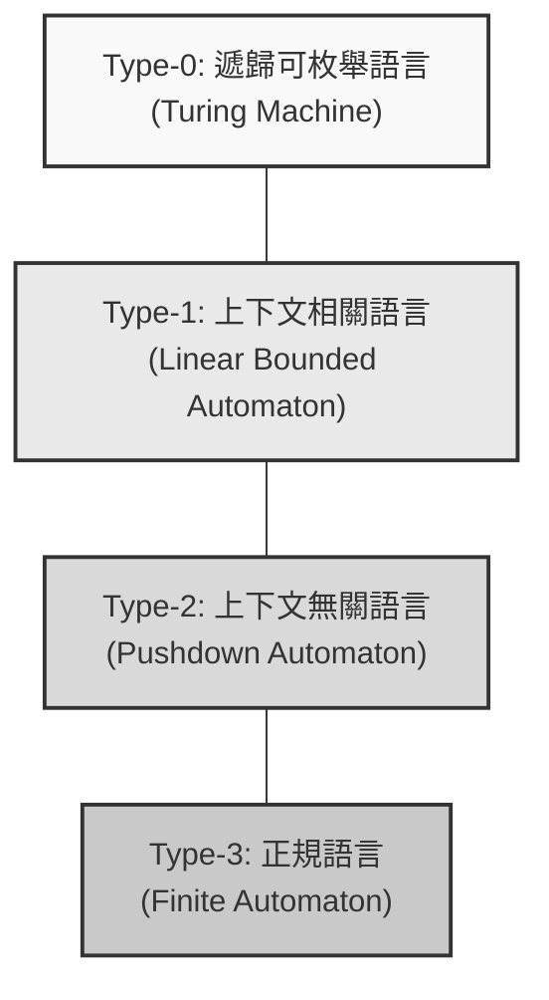
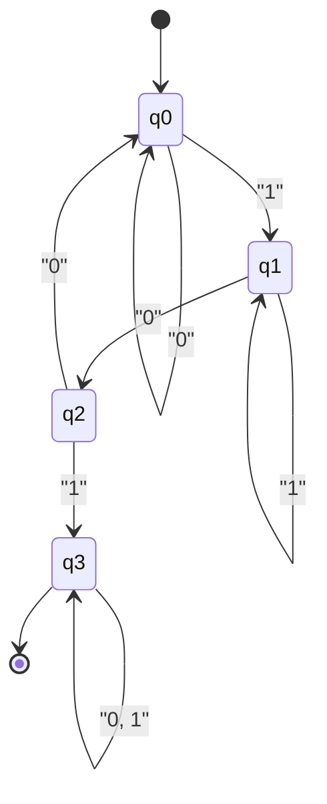
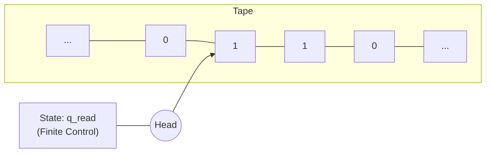

支撐計算機科學根基的宏大理論，這就是 **自動機** （ Automata ）與 **形式語言理論** （ Formal Language Theory ）。

我們日常編寫的正規表示式（ Regular Expressions ）、解析程式語言原始碼的編譯器，甚至是自然語言處理，所有這些的基礎都存在著這個理論。本文將以喬姆斯基層級（ Chomsky Hierarchy ）的分類為主軸，帶您進入將計算這個概念本身進行數學且抽象定義的深淵世界。

---

## 1. 什麼是形式語言？

相對於我們平時使用的日語或英語等「自然語言」，由數學規則嚴格定義的語言稱為 **形式語言** （ Formal Language ）。形式語言由以下基本構成要素組成。

### 字母表與字串

形式語言理論中的 **字母表** （ Alphabet ），是指符號的非空有限集合。通常以 $ \Sigma $ （ Sigma ）這個符號來表示。

$$
\Sigma = \{ 0, 1 \}
$$

上述是二進制的字母表。由這個字母表所產生之有限長度的符號序列，稱為 **字串** （ String ）或 **單字** （ Word ）。

由字母表 $ \Sigma $ 所組成的所有字串集合（包含空字串 $ \epsilon $ ），使用克林閉包（ Kleene Star ）標記為 $ \Sigma^* $ 。

### 語言的定義

形式語言 $ L $ 定義為 $ \Sigma^* $ 的子集。也就是說， $ L \subseteq \Sigma^* $ 。

例如，「由 0 和 1 組成，且必定以 1 結尾的字串集合」就是一個語言。這個語言 $ L $ 可以描述如下：

$$
L = \{ w1 \mid w \in \{ 0, 1 \}^* \}
$$

形式語言理論的主要目的，在於闡明如何用有限的規則（文法）或具有有限狀態的機器（自動機），來表達並識別這種可能無限存在的字串集合（語言）。

---

## 2. 喬姆斯基層級（ Chomsky Hierarchy ）

語言學家諾姆·喬姆斯基（ Noam Chomsky ）在 1956 年，根據生成規則的限制強度，將形式語言分為四個層級。這就是 **喬姆斯基層級** 。

層級分類如下（從第 0 型到第 3 型）。數字越大，能表達的語言類別越窄，但相對地更容易讓電腦進行解析。



1.  **第 3 型（正規語言）** : 可以用正規表示式表達，並可由有限自動機識別。
2.  **第 2 型（上下文無關語言）** : 用於程式語言的語法等，可由下推自動機識別。
3.  **第 1 型（上下文相關語言）** : 可由線性有界自動機識別。
4.  **第 0 型（遞歸可枚舉語言）** : 可由圖靈機識別。所有可計算的語言。

接下來的章節，將從這個層級的底層（限制最強的 Type-3 ）開始依序深入探討。

---

## 3. 正規語言與有限自動機（ Type-3 ）

### 有限自動機（ DFA / NFA ）

位於喬姆斯基層級最內層的是 **正規語言** （ Regular Languages ）。識別這個語言的計算模型是 **有限自動機** （ Finite Automata, FA ）。

有限自動機中，存在著狀態轉換為決定性的 **DFA** （ Deterministic Finite Automaton ）與非決定性的 **NFA** （ Nondeterministic Finite Automaton ）。令人驚訝的是，這兩者能識別的語言類別是完全相等的（已經證明 DFA 與 NFA 是等價的）。

數學上，DFA 由以下的五元組 $ M = (Q, \Sigma, \delta, q_0, F) $ 來定義：

*   $ Q $ : 狀態的有限集合
*   $ \Sigma $ : 字母表
*   $ \delta $ : 狀態轉換函數 ( $ \delta: Q \times \Sigma \rightarrow Q $ )
*   $ q_0 $ : 初始狀態 ( $ q_0 \in Q $ )
*   $ F $ : 接受狀態（終止狀態）的集合 ( $ F \subseteq Q $ )

#### 具體範例：接受包含「101」字串的 DFA

在字母表 $ \Sigma = \{ 0, 1 \} $ 中，考慮一個識別包含子字串「101」的 DFA。



這個狀態轉換圖讓我們用 Python 程式來實作看看。

```python
class DFA:
    def __init__(self):
        self.states = {'q0', 'q1', 'q2', 'q3'}
        self.alphabet = {'0', '1'}
        self.start_state = 'q0'
        self.accept_states = {'q3'}
        
        # 狀態轉換函數
        self.transitions = {
            'q0': {'0': 'q0', '1': 'q1'},
            'q1': {'0': 'q2', '1': 'q1'},
            'q2': {'0': 'q0', '1': 'q3'},
            'q3': {'0': 'q3', '1': 'q3'}
        }
        
    def accepts(self, string: str) -> bool:
        current_state = self.start_state
        for char in string:
            if char not in self.alphabet:
                return False
            current_state = self.transitions[current_state][char]
        return current_state in self.accept_states

# 測試
dfa = DFA()
test_strings = ["001010", "11101", "1001", "010", "101"]

for s in test_strings:
    result = dfa.accepts(s)
    print(f"String '{s}': {'Accepted' if result else 'Rejected'}")
```

### 與正規表示式的關係（克林定理）

程式設計中使用的 **正規表示式** （ Regular Expression ），就是用來描述這個正規語言的語法。史蒂芬·克林（ Stephen Kleene ）證明了一個定理：「一個語言能用正規表示式來表達，與它能被有限自動機接受是等價的」。

實際程式語言的正規表示式引擎（例如 Python 的 `re` 模組），會在內部將給定的正規表示式模式建構為 NFA，藉此來評估字串。

### 泵引理（ Pumping Lemma ）的侷限性

正規語言非常方便，但也有其侷限性。例如，「 $ n $ 個 $ a $ 之後跟著 $ n $ 個 $ b $ 的字串集合」 （ $ L = \{ a^n b^n \mid n \ge 0 \} $ ）就不是正規語言。因為有限自動機沒有用來「計數」的記憶體（如堆疊等），所以無法無限地記住出現了多少個 $ a $ 。用來證明這一點的數學方法就是 **正規語言的泵引理** 。

---

## 4. 上下文無關語言與下推自動機（ Type-2 ）

為了表達正規語言無法表達的括號配對，或是程式語言的語法（如 `if-else` 的巢狀結構等），我們需要 **上下文無關語言** （ Context-Free Languages, CFL ）。

### 下推自動機（ PDA ）

識別上下文無關語言的計算模型是 **下推自動機** （ Pushdown Automaton, PDA ）。PDA 是在有限自動機上增加了 **堆疊** （ [Stack](https://kenji.blog/zh-tw/p/c-language-pointers-memory-management-stack-heap/), 後進先出的記憶體）。透過使用堆疊，就能實現「記住開括號的數量，每當遇到閉括號時就消耗一個」這樣的功能。

#### 具體範例：接受 $ a^n b^n $ 的 PDA

在字母表 $ \Sigma = \{ a, b \} $ 中，我們來實作一個接受相同數量 $ a $ 和 $ b $ 連續字串的 PDA。

```python
class PDA:
    def __init__(self):
        self.stack = []
        self.state = 'q0'
        
    def accepts(self, string: str) -> bool:
        self.stack = []
        self.state = 'q_a' # 讀取 a 的狀態
        
        for char in string:
            if self.state == 'q_a':
                if char == 'a':
                    self.stack.append('A') # 推入堆疊
                elif char == 'b':
                    self.state = 'q_b'
                    if not self.stack:
                        return False
                    self.stack.pop() # 從堆疊取出
                else:
                    return False
            elif self.state == 'q_b':
                if char == 'b':
                    if not self.stack:
                        return False
                    self.stack.pop()
                else:
                    return False
                    
        # 讀完字串時，若堆疊為空則接受
        return len(self.stack) == 0

# 測試
pda = PDA()
print("aaabbb:", pda.accepts("aaabbb")) # True
print("aabbb:", pda.accepts("aabbb"))   # False
print("ab:", pda.accepts("ab"))         # True
print("a:", pda.accepts("a"))           # False
```

### 上下文無關文法（ CFG ）與 BNF

產生上下文無關語言的規則稱為 **上下文無關文法** （ Context-Free Grammar, CFG ）。CFG 由 $ (V, \Sigma, R, S) $ 定義。
這裡 $ R $ 是形如 $ A \rightarrow \gamma $ 的生成規則集合。（ $ A $ 是非終端符號， $ \gamma $ 是終端符號與非終端符號的序列）。

程式語言規格書中常見的 **BNF** （ Backus-Naur Form ），就是用來描述這個上下文無關文法的後設語言。以下是定義數學表達式的 BNF 範例。

```bnf
<expr>   ::= <expr> "+" <term> | <term>
<term>   ::= <term> "*" <factor> | <factor>
<factor> ::= "(" <expr> ")" | <number>
<number> ::= "0" | "1" | "2" | ... | "9"
```

在編譯器的 **語法解析** （ Parsing ）階段，會運用應用了 PDA 原理的演算法（ LL 語法解析或 LR 語法解析），來檢查詞法分析器產生的標記（Token）序列是否符合這個上下文無關文法，並建構出抽象語法樹（ AST ）。

---

## 5. 上下文相關語言與線性有界自動機（ Type-1 ）

雖然上下文無關語言可以表達程式語言中的大部分語法，但無法表達像「只能使用已宣告的變數」這樣依賴前後文脈絡的限制（語義限制）。處理這些問題的是 **上下文相關語言** （ Context-Sensitive Languages, CSL ）。

### 線性有界自動機（ LBA ）

用來識別上下文相關語言的是 **線性有界自動機** （ Linear Bounded Automaton, LBA ）。LBA 是圖靈機的一種，其特徵是紙帶的長度被限制在與輸入字串長度成正比（線性）的大小。

上下文相關語言的典型範例是 $ L = \{ a^n b^n c^n \mid n \ge 1 \} $ 。因為 PDA 只有一個堆疊，所以雖然能讓 $ a $ 和 $ b $ 的數量一致，卻無法讓後面跟著的 $ c $ 數量也一致（因為在計算 $ a $ 的數量時已經將堆疊彈出空了）。而 LBA 可以在紙帶上來回移動，因此能夠識別這個語言。

一般認為，自然語言（人類的語言）比上下文無關語言更複雜，且具有更接近上下文相關語言的特性。

---

## 6. 遞歸可枚舉語言與圖靈機（ Type-0 ）

最後到達的是， **遞歸可枚舉語言** （ Recursively Enumerable Languages ）與 **圖靈機** （ [Turing Machine](https://kenji.blog/zh-tw/p/turing-machine-computability/) ）。

### 圖靈機：計算的終極模型

1936 年由艾倫·圖靈（ Alan Turing ）所提出的圖靈機，擁有與現代所有電腦（馮·紐曼型電腦）理論極限相等的計算能力。

圖靈機由無限延伸的「紙帶」、邊讀寫紙帶邊左右移動的「讀寫頭」，以及有限個「狀態」所組成。



### 停機問題（ [Halting Problem](https://kenji.blog/zh-tw/p/turing-machine-computability/) ）

在圖靈機框架中最重要的一個發現，就是 **不可計算性** （ Undecidability ）的存在。
「當給定任意的程式和輸入時，不存在任何程式（演算法）可以判定該程式最終會停止，還是會陷入無限迴圈」，這就是著名的 **停機問題** 。

這表示了數學上的極限：無論打造出多麼強大的 AI 或電腦，「絕對無法做出能自動事先偵測出所有 Bug 或無限迴圈的完美靜態分析工具」。

---

## 7. 現代軟體開發與形式語言理論的交會點

我們目前看到的這些理論，絕不只是停留在學術象牙塔中。它們活躍在現代軟體工程的各個角落。

1.  **詞法分析器（ Lexer ）的自動產生**: 像 `Lex` 或 `Flex` 這樣的工具，會將開發者編寫的正規表示式轉換為 DFA，並自動產生高速的 C 語言程式碼。
2.  **語法解析器（ Parser ）的自動產生**: 像 `Yacc` 或 `Bison` 這樣的工具，會從開發者編寫的 BNF（上下文無關文法）自動產生 LR 解析器（PDA 的應用）。
3.  **JSON 或 XML 的解析**: 這些資料格式的驗證與解析，也是基於形式語言理論的演算法。
4.  **編輯器的語法標明（Syntax Highlight）**: IDE 能夠快速為程式碼上色，是因為背後有有限自動機在運作。

### 正規表示式引擎的陷阱（ Catastrophic Backtracking ）

許多程式語言（如 [Java](https://kenji.blog/zh-tw/p/programming-languages-history-paradigm-evolution/), Python, Ruby, JavaScript 等）內建的正規表示式引擎，並非理論上純粹的 DFA，而是以伴隨回溯的 NFA 為基礎（或稱回溯引擎）來實作。

因此，如果對特定模式的正規表示式（例如： `(a+)+$` 等）提供經過精心設計的字串，計算量就會呈指數級爆炸，從而引發讓系統凍結的 **ReDoS** （ Regular Expression Denial of [Service](https://kenji.blog/zh-tw/p/kubernetes-k8s-architecture-pod-service-ingress/) ）漏洞。如果了解理論，就能以邏輯思考為什麼會發生回溯，以及該如何重寫模式才能轉換成等同於安全 DFA 的處理方式。

---

## 總結：抽象化的美學

**自動機與形式語言理論** ，是將計算機的物理結構（CPU 或記憶體）完全排除，並將「什麼是計算」、「什麼是語言」抽象化為純粹數學模型的極致。

*   **Type-3 (DFA)**: 沒有記憶體的機器（正規表示式）
*   **Type-2 (PDA)**: 擁有堆疊記憶體的機器（語法解析）
*   **Type-1 (LBA)**: 擁有有限長度紙帶的機器
*   **Type-0 (TM)**: 擁有無限長度紙帶的機器（萬能電腦）

我們每天編寫的原始碼，會被編譯器這個巨大的自動機群，從 Type-2（語法）分解到 Type-3（詞彙），最終翻譯成機器語言。

即使表面的框架或語言的流行不斷變遷，這個從 1950 年代延續至今的堅固數學基礎也不會改變。偶爾在面對複雜的正規表示式難題，或是有機會撰寫新的解析器時，不妨回想一下背後圖靈與喬姆斯基的偉大理論吧。
