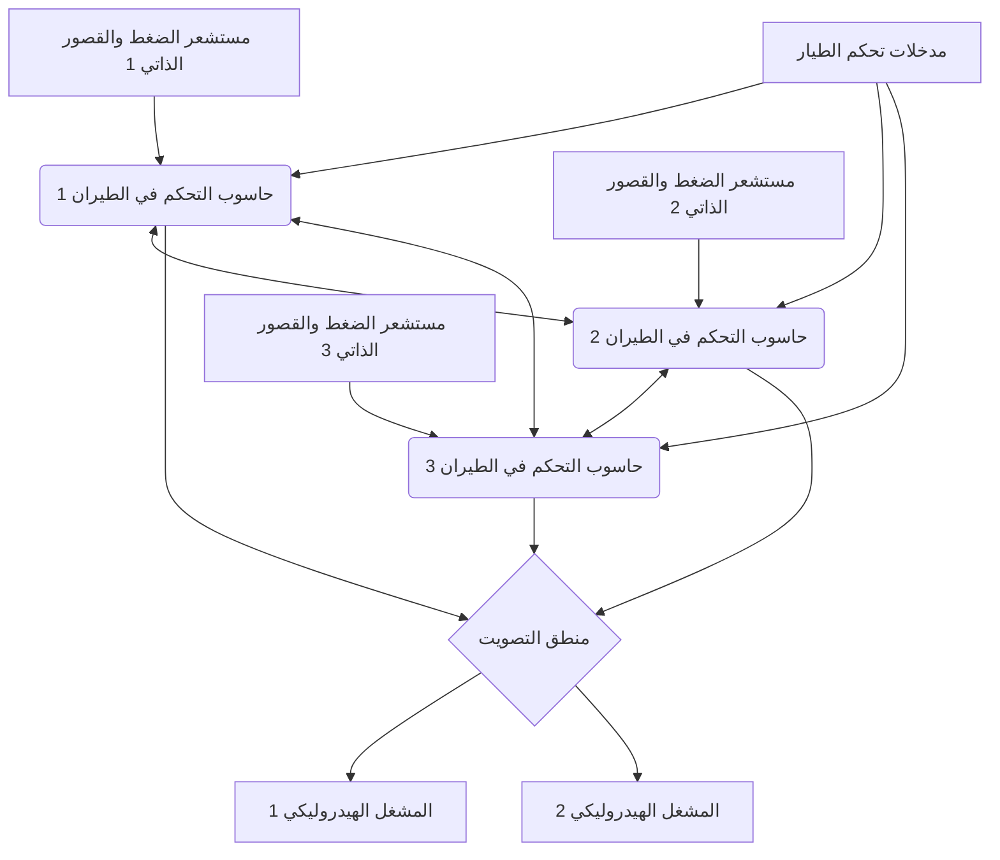

# مقدمة: مركز بيانات عملاق يحلق في السماء

لقد تطورت طائرات الركاب النفاثة الحديثة إلى ما هو أبعد من مجرد مركبات ديناميكية هوائية، لتصبح "شبكات كمبيوتر عملاقة طائرة" تعمل بأنظمة تشغيل في الوقت الفعلي متقدمة. يكمن جوهر هذا التطور في "إلكترونيات الطيران" (Avionics) وتقنية "الطيران بواسطة الأسلاك" (Fly-By-Wire: FBW) التي تتحكم في الطائرة عبر الإشارات الكهربائية. في هذا المقال، ومن منظور هندسة الفضاء وهندسة التحكم، سنتعمق بشكل مفصل وأكاديمي في البنية الأساسية لهذه الأنظمة، وقوانين التحكم (Control Laws)، و"تضارب فلسفة التصميم" الذي يجمع بين شركتي صناعة الطائرات الرائدتين في العالم، بوينج وإيرباص.

---

## الفصل الأول: ديناميكيات التحكم في الطائرات والثورة من الهيدروليكا إلى الكهرباء

### آليات نظام التحكم الكلاسيكي وحدودها

يتكون التحكم الحركي ثلاثي الأبعاد للطائرة للتحليق في السماء من ثلاثة محاور: الانحدار (التحكم الطولي: يتم التحكم فيه بواسطة الرافعات/Elevators)، والالتفاف (الميل الجانبي: يتم التحكم فيه بواسطة الجنيحات/Ailerons)، والانعراج (تأرجح الأنف لليسار واليمين: يتم التحكم فيه بواسطة الدفة/Rudder). من فجر الطيران حتى الستينيات (مثل طائرات بوينج 707 وأوائل 737)، تم ربط عمود التحكم في قمرة القيادة (Control wheel أو Yoke) بأسطح التحكم في الذيل والأجنحة بشكل مباشر بواسطة شبكة معقدة من الكابلات المعدنية المادية، والبكرات، والقضبان.

كانت الميزة الأكبر لهذا "النظام الميكانيكي" هي أنه بسيط للغاية وبديهي. إذا سحب الطيار عمود التحكم، فإن القوة تحرك الرافعات مباشرة عبر الكابلات، ويتم تغذية المقاومة الهوائية (ضغط الرياح) التي تضرب أسطح التحكم كقوة رد فعل (Feel Force) إلى عمود التحكم. هذا سمح للطيارين بالشعور المباشر بـ "مدى الحمل الديناميكي الهوائي الذي تتعرض له الطائرة" من خلال أيديهم.

ومع ذلك، مع زيادة حجم الطائرات ووصول سرعات العبور إلى مناطق العابرة للصوت تتجاوز ماخ 0.8، أصبحت الأحمال الديناميكية الهوائية على أسطح التحكم ضخمة جدًا بحيث لا يمكن تحريكها بواسطة قوة العضلات البشرية. ولمعالجة هذا الأمر، تم إدخال "المشغلات الهيدروليكية" (Hydraulic Actuator). على غرار نظام التوجيه المعزز في السيارات، تفتح مدخلات الطيار المنقولة بواسطة الكابلات صمامات سيرفو هيدروليكية، ويقوم ضغط هيدروليكي فائق الارتفاع يبلغ 3000 رطل لكل بوصة مربعة (حوالي 210 ضغط جوي) بتشغيل الأسطوانات لتحريك أسطح التحكم.

### تحديات التحكم الميكانيكي الهيدروليكي وحتمية الطيران بواسطة الأسلاك

بينما مكّن إدخال الأنظمة الهيدروليكية من التحكم في الطائرات الضخمة، ظلت هناك بعض التحديات الخطيرة.

1. **زيادة الوزن والتعقيد**: كانت هناك حاجة لتشغيل مئات الأمتار من الكابلات الفولاذية والبكرات من طرف إلى طرف في الطائرة، والتي شكلت عدة أطنان من الوزن الساكن (الوزن الميت). كانت تتطلب آليات معقدة مثل منظمات الشد لتعويض تمدد الكابلات وتغيرات التوتر الناتجة عن التغيرات في درجات الحرارة.
2. **حدود التعامل مع الخصائص الديناميكية الهوائية غير الخطية**: تتغير الخصائص الديناميكية الهوائية للطائرة بشكل كبير بين السرعات المنخفضة (الإقلاع والهبوط) والسرعات العالية (الرحلة). في الأنظمة الميكانيكية، كان لابد من التعامل مع هذا التغيير الديناميكي فيزيائيًا بواسطة "نظام الإحساس الاصطناعي" (Artificial Feel System) باستخدام النوابض والمخمدات، وآليات ضبط الانحدار (Pitch Trim)، وكان من المستحيل الحصول على استجابة توجيه مثالية في جميع مناطق الطيران.
3. **عقبة الاستقرار الثابت**: تطلبت الطائرات التقليدية تصميمًا يتم فيه وضع مركز الثقل أمام مركز ضغط الرياح، مع قيام المثبت الأفقي دائمًا بتوليد قوة رفع هبوطية، وذلك للحصول على "الاستقرار الثابت" (Static Stability) حيث تحاول الطائرة العودة إلى وضعها الأصلي حتى إذا ترك الطيار عجلة القيادة. وأدى ذلك إلى زيادة كبيرة في مقاومة التوازن (Trim Drag)، مما كان عاملاً رئيسياً في زيادة استهلاك الوقود.

للتغلب على هذه القيود المادية والديناميكية الهوائية، كان من الضروري "فصل" الإجراءات الجسدية للطيار عن حركة أسطح التحكم. ونتيجة لذلك، ظهر "الطيران بواسطة الأسلاك" (Fly-By-Wire: FBW)، حيث يتم تحويل حركات عمود التحكم إلى إشارات كهربائية (بيانات رقمية)، ويحسب الكمبيوتر الزاوية المثلى، ويرسل أوامر إلى المشغلات الهيدروليكية (أو الكهربائية).

---

## الفصل الثاني: بنية نظام الطيران بواسطة الأسلاك

قلب الطيران بواسطة الأسلاك (FBW) هو شبكة من حواسيب التحكم في الطيران (Flight Control Computers: FCC) التي تتطلب موثوقية قصوى. في طائرات الركاب المزودة بـ FBW، يُطلب مستوى موثوقية لا يصدق يتمثل في "معدل الفشل الكارثي 10 أُس سالب 9 (10^-9) لكل ساعة"، مما يعني "فشل مميت واحد فقط أو أقل لكل مليار ساعة طيران". التصميم المعماري لتحقيق هذا هو الجوهر التقني لـ FBW.

### التكرار المتعدد (Redundancy) وخوارزمية التصويت (Voting)

لمواصلة الطيران حتى في حالة فشل جهاز كمبيوتر أو مستشعر واحد، يعتمد FBW على تكوين مكرر ثلاثي (Triplex) أو رباعي (Quadruplex). في طائرة بوينج 777 على سبيل المثال، توجد ثلاثة أنظمة للكمبيوتر الأساسي للطيران (PFC) (يسار، وسط، يمين)، ويتكون كل PFC من ثلاث قنوات حسابية، وبالتالي فهو يتميز عمليًا ببنية منطقية "3 × 3 = 9 قنوات".

الأمر الأكثر أهمية في هذا النظام المكرر هو خوارزمية "المزامنة والتصويت" (Synchronization and Voting).
تتلقى أجهزة كمبيوتر متعددة نفس بيانات الإدخال (مدخلات تحكم الطيار، السرعة الجوية، زاوية الموقف، وما إلى ذلك) في وقت واحد وتجري الحسابات باستخدام نفس قوانين التحكم. ثم تتم مقارنة قيم أوامر الزاوية الناتجة مع بعضها البعض (رابط بيانات القنوات المتقاطعة).

يستند منطق التصويت إلى "قاعدة الأغلبية" (Majority Rule). إذا حسب جهازا كمبيوتر من أصل ثلاثة أن "ترفع الرافعة بمقدار 5 درجات"، وحسب واحد "الرفع بمقدار 10 درجات"، فإن الدرجات الخمس التي تمثل الأغلبية تُعتبر صحيحة، ويتم فصل الكمبيوتر المنحرف تلقائيًا عن الشبكة (Fail-Silent)، وتستمر العملية مع الجهازين المتبقيين (Fail-Operational).

### القضاء على فشل السبب الشائع بواسطة أجهزة وبرامج غير متجانسة (Dissimilarity)

حتى مع التكرار الثلاثي، إذا تم استخدام نفس وحدة المعالجة المركزية (CPU) ونفس البرنامج، فقد تؤدي مواجهة خطأ غير معروف (خلل برمجي) أو خطأ في تصميم الأجهزة (Errata) إلى أن تنتج أجهزة الكمبيوتر الثلاثة "نفس الإجابة الخاطئة في نفس الوقت". يُعرف هذا باسم "فشل السبب الشائع" (Common Mode/Cause Failure: CCF).

لمنع ذلك، تسعى بوينج وإيرباص إلى "تصميم الأجهزة غير المتجانسة" (Dissimilarity) إلى أقصى حد.
على سبيل المثال، في طائرة إيرباص A320، تستخدم أجهزة الكمبيوتر الرئيسية، ELAC (كمبيوتر الجنيح والرافعة) و SEC (كمبيوتر العاكس والرافعة)، وحدات معالجة مركزية من جهات تصنيع مختلفة تمامًا (مثلًا عائلة Intel في واحد، وعائلة Motorola في الآخر). علاوة على ذلك، يتم فصل فرق تطوير برامج التحكم تمامًا ماديًا وتنظيميًا، وتتم كتابة التعليمات البرمجية بشكل منفصل عن نفس مستند متطلبات المواصفات باستخدام لغات برمجة مختلفة (مثل لغة Ada ولغة C) ومجمّعين (Compilers) مختلفين. وهذا يقلل من احتمالية وجود نفس الخطأ رياضيًا إلى ما يقرب من الصفر حتى لو كان هناك خطأ في أحد البرامج.

### ناقل بيانات إلكترونيات الطيران: ARINC 429 و ARINC 664 (AFDX)

لقد تطورت شبكة الاتصالات (ناقل بيانات إلكترونيات الطيران) التي تربط بين هذه المستشعرات وأجهزة الكمبيوتر والمشغلات بشكل فريد.

المعيار الذي ظل مهيمناً لفترة طويلة منذ الثمانينيات هو "ARINC 429". وهو ناقل تسلسلي أحادي الاتجاه من واحد إلى عدة (نصف مزدوج)، يستخدم كبلًا زوجيًا مجدولًا لنقل كلمات بيانات 32 بت بسرعة 100 كيلوبت في الثانية (أو 12.5 كيلوبت في الثانية). بفضل بنيته البسيطة والموثوقة (Deterministic)، فإنه لا يزال مستخدمًا في العديد من الأنظمة الفرعية اليوم.

ومع ذلك، في أحدث الطائرات مثل A380 و B787 و A350، زاد حجم بيانات الاتصال بشكل متفجر، ووصلت أسلاك النقطة إلى النقطة (Point-to-Point) مثل ARINC 429 إلى حد وزن الكابل. لذا تم إدخال "ARINC 664 Part 7 (المعروف باسم: AFDX - Avionics Full-Duplex Switched Ethernet)".
يعتمد AFDX على تقنية إيثرنت (IEEE 802.3) التي نستخدمها يوميًا، ولكنه يضيف ملف تعريف يفرض "الضمان المطلق لتأخير الاتصال" (Bounded Latency) و "تخصيص النطاق الترددي" للطائرات. باستخدام مفهوم الارتباط الافتراضي (Virtual Link: VL)، تقوم محولات الشبكة (محولات AFDX) بإدارة النطاق الترددي لكل دفق بيانات بدقة، وبناء شبكة إيثرنت حتمية (Deterministic) لا يحدث فيها تصادم أو فقدان للحزم. جعل ذلك من الممكن لمئات الأجهزة الاتصال في الوقت الفعلي عبر شبكات 100 ميجابت / 1 جيجابت عالية السرعة.

---

## الفصل الثالث: قوانين التحكم في الطيران (Flight Control Laws)

أكبر فائدة لنظام FBW هي القدرة على تنفيذ "قوانين التحكم" (Control Laws) التي لا تترجم ببساطة مدخلات الطيار المادية (Stick Input) إلى زاوية أسطح التحكم (Surface Angle)، بل تجعل الكمبيوتر يفسر "النية" (Intent) حول كيفية رغبة الطيار في تحريك الطائرة، وتحسب الزاوية المثلى بناءً على حالة الطيران الحالية (السرعة، الارتفاع، الوزن، وما إلى ذلك).

### قانون C* (سي ستار): ثورة في التحكم في الانحدار

في التحكم الطولي (الانحدار) لأحدث طائرات الركاب (من بوينج 777/787 أو إيرباص A320 فصاعدًا)، يتم استخدام "قانون التحكم C* (سي ستار)" أو نسخته المتقدمة "قانون C*U".

في الطائرات التقليدية (أو في حالة القانون المباشر)، كان مقدار سحب عمود التحكم متناسبًا مع "زاوية الرافعة". لكن عند السرعات المنخفضة والعالية، تختلف استجابة الطائرة (سرعة الانحدار أو الجاذبية G الناتجة) تمامًا لنفس الزاوية.
بالمقابل، في قانون C*، يُفسر قيام الطيار بتحريك عمود التحكم على أنه "إصدار أمر قيمة هدفية مركبة" لكل من "معدل الانحدار (السرعة الزاوية لصعود ونزول الأنف: q)" و "التسارع العمودي (حمل الجاذبية: Nz)".

$$ C^* = K_1 \cdot q + K_2 \cdot N_z $$

(حيث $K_1, K_2$ هي مكاسب تتغير تبعًا للسرعة وما إلى ذلك)

- **عند السرعات المنخفضة (الإقلاع والهبوط وما إلى ذلك)**: من الصعب توليد قوى جاذبية ديناميكية هوائية، لذا يقوم الكمبيوتر في الغالب بإعطاء تغذية مرتدة لـ "معدل الانحدار (q)" للتحكم في سرعة رفع أو خفض الأنف.
- **عند السرعات العالية (العبور)**: يؤدي رفع الأنف قليلاً إلى توليد قوة جاذبية G قوية، لذا يقوم الكمبيوتر في الغالب بإعطاء تغذية مرتدة لـ "التسارع العمودي (Nz)" للتحكم في أسطح التحكم لتوليد قوة جاذبية ثابتة استجابة لمدخلات الطيار.

وبالتالي، بغض النظر عن سرعة الطيران، يحصل الطيار على استجابة توجيهية مستقرة للغاية: "إذا سحبت عمود التحكم بنفس المقدار، فستستجيب الطائرة دائمًا بنفس الإحساس".

### البنية الهرمية الآمنة من الفشل: العادي، والبديل، والمباشر

تحتوي الطائرات على تسلسل هرمي لخفض درجة قانون التحكم (Degradation) استعدادًا لفشل المستشعر أو الكمبيوتر. بأخذ مصطلحات إيرباص كمثال، يتم تقسيمها على النحو التالي:

1. **القانون العادي (Normal Law)**
   حيث جميع الأنظمة (ADIRU، وأجهزة الكمبيوتر، وغيرها) في حالة طبيعية. التصحيح الكامل للإحساس بالتحكم عن طريق قانون C* و "حماية غلاف الطيران" (Flight Envelope Protection) الكاملة (كما هو موضح لاحقًا) فعالة. يمكن أيضًا استخدام الطيار الآلي بشكل طبيعي.
2. **القانون البديل (Alternate Law)**
   حالة تفشل فيها بعض المستشعرات المتعددة، ولا يمكن الحصول على بيانات موثوقة (مثل السرعة الجوية الدقيقة). تعمل التغذية المرتدة للتحكم في الوضع الأساسي (معدل الانحدار ومعدل الالتفاف)، ولكن يتم إلغاء جزء أو كل حماية غلاف الطيران (مثل منع الانهيار).
3. **القانون المباشر (Direct Law)**
   الحالة الاحتياطية النهائية عندما تفشل أجهزة كمبيوتر ومستشعرات متعددة وتصبح الحسابات المعقدة مستحيلة. يصبح نظام FBW مجرد "كابل كهربائي"، وتنتقل حركة عصا التحكم مباشرة بشكل يتناسب مع زاوية سطح التحكم (تحكم تناسبي). لا توجد حماية لغلاف الطيران على الإطلاق، وتكون تجربة التحكم مطابقة تمامًا للطائرات الكلاسيكية (ولكن حساسية السرعة تبرز بشكل كبير).

### حماية غلاف الطيران (Flight Envelope Protection)

هذه هي أعظم تقنية أمان جلبها FBW. للطائرات منطقة حد آمنة (غلاف) يمكن الطيران فيها. وتشمل السرعة (سرعة الانهيار ورقم ماخ الحرج)، زاوية الميل، زاوية الانحدار، وحمل الجاذبية (G-load). يتدخل FBW عندما تقترب الطائرة من هذه الحدود ويمنعها من تجاوزها.

- **حماية موقف الانحدار**: تمنع زاوية رفع الأنف من تجاوز حد معين (مثل +30 درجة) أو زاوية خفض الأنف (مثل -15 درجة).
- **حماية زاوية الميل**: تتحكم في الجنيحات لمنع زاوية الالتفاف من تجاوز قيمة معينة (مثل 67 درجة).
- **حماية الانهيار (Alpha Protection)**: عندما تقترب زاوية الهجوم (Angle of Attack: AoA, Alpha) من حد الانهيار، حتى لو استمر الطيار في سحب عمود التحكم، فإن الكمبيوتر سيرفض أي رفع إضافي للأنف وسيزيد دفع المحرك تلقائيًا إلى الحد الأقصى (TOGA) لتجنب الانهيار.

---

## الفصل الرابع: بوينج ضد إيرباص: تضارب قاطع في فلسفة التصميم

عند إدخال تقنية FBW، كانت لشركتي بوينج وإيرباص، اللتين تقسمان صناعة الطيران المدني، فلسفات تصميم مختلفة تمامًا فيما يتعلق بـ "تصميم قمرة القيادة وتفويض السلطة بين الإنسان والآلة". وهذا هو واحد من أكثر النقاشات إثارة للاهتمام في هندسة الطيران الحديثة.

### فلسفة إيرباص: "الحماية المطلقة والحدود الصلبة من قبل الكمبيوتر"

الطائرة A320 التي دخلت الخدمة في عام 1988 هي أول طائرة ركاب رقمية بالكامل بنظام FBW في العالم. الفلسفة الأساسية لشركة إيرباص هي: "**البشر يرتكبون الأخطاء. لذلك، يجب حماية السلامة المطلقة بحدود صلبة (قيود مطلقة) يتم حسابها بواسطة الكمبيوتر**".

1. **اعتماد العصا الجانبية (Sidestick)**:
   ألغت إيرباص عمود التحكم التقليدي الذي يمسك باليدين (Yoke)، ووضعت عصا جانبية تشبه تلك الموجودة في الطائرات المقاتلة على الجانب الأيسر من مقعد القبطان والجانب الأيمن من مقعد مساعد الطيار. هذا أدى إلى تحسين رؤية لوحة العدادات بشكل كبير.
2. **عدم ارتباط عصا التحكم**:
   ليست عصا الكابتن وعصا مساعد الطيار متصلتين ماديًا. إذا تم تشغيل إحداهما، فلن تتحرك العصا الأخرى (أثناء الإدخال المزدوج، يتم جمع الإدخالات جبريًا، أو يتم التنافس عليها باستخدام زر الأولوية).
3. **الحماية الصلبة (Hard Envelope Protection)**:
   طالما أن القانون العادي سارٍ المفعول، حتى لو سحب الطيار العصا الجانبية إلى أقصى حد، سواء عن قصد أو في حالة ذعر، فلن تتجاوز الطائرة مطلقًا زاوية هجوم الانهيار ولن تتجاوز حد زاوية الميل. بمعنى آخر، الكمبيوتر لديه الصلاحية لـ "تجاوز (Override/رفض) إجراءات الطيار".

### فلسفة بوينج: "القرار النهائي دائمًا في يد الطيار (الحدود المرنة)"

من ناحية أخرى، في أول طائرة بنظام FBW أدخلتها بوينج للخدمة في عام 1995، وهي B777 (ولاحقًا B787)، التزمت بفلسفة مفادها: "**مهما كانت الظروف، يجب أن يحتفظ الطيار البشري الذي يفهم الموقف الميداني بشكل أفضل بسلطة القرار النهائي**".

1. **الحفاظ على عجلة التحكم التقليدية (Yoke)**:
   لم تعتمد بوينج العصا الجانبية واحتفظت بعجلة القيادة التقليدية. حتى في طائرات FBW، تتحرك عجلات التحكم في مقعد الكابتن ومساعد الطيار بالتزامن ماديًا (أو من خلال الماكينات الكهربائية) عن طريق آليات تحت الأرضية. هذا يسمح للطيارين بالتعرف على أفعال بعضهم البعض عن طريق اللمس والبصر.
2. **آلية الإحساس الاصطناعي (Artificial Feel) والقيادة العكسية**:
   حتى عندما يقود الطيار الآلي، تتحرك عجلة التحكم في قمرة القيادة ماديًا بالتزامن مع حركة أسطح التحكم (بينما لا تتحرك العصا الجانبية في إيرباص). كما يوجد مشغل يحاكي وزن (قوة التوجيه) تحريك العجلة استجابة للسرعة، ويوصل بشكل مصطنع "المقاومة الديناميكية الهوائية" للطيار.
3. **الحماية المرنة (Soft Envelope Protection)**:
   تحتوي طائرات بوينج أيضًا على حماية من الانهيار وحدود لزاوية الميل، لكنها ليست "جدرانًا مطلقة". عندما تقترب الطائرة من حدودها، يصبح عمود التحكم ثقيلاً بشكل ملحوظ لتحذير الطيار، ولكن إذا استمر الطيار في السحب بـ "قوة أكبر (مثلاً قوة تزيد عن حوالي 22.5 كجم)"، فمن الممكن "تخطي (Override)" حدود إعدادات النظام للقيام بمناورات تتجاوز الحدود. يستند هذا إلى فكرة أنه "في المواقف المتطرفة التي لا يتوقعها الكمبيوتر، مثل تجنب صاروخ أو تجنب الاصطدام بتضاريس، يجب ترك السلطة للطيار لاتخاذ إجراءات تجنب حتى لو تحطمت الطائرة".

يستمر هذا الاختلاف في الفلسفة حول "هل تثق في الآلة أم تثق في الإنسان؟" في الظهور كاختلاف جوهري في تصميم قمرة القيادة بين الشركتين حتى اليوم.

---

## الفصل الخامس: دمج أجهزة الاستشعار (Sensor Fusion) والهبوط الآلي (Autoland)

كان تطور أنظمة FBW ضروريًا لتحقيق الهبوط الآلي الكامل (Autoland) بالتزامن مع نظام الهبوط الآلي (ILS) ونظام الهبوط المعتمد على GPS (GLS). تقنية إنزال طائرة تزن مئات الأطنان وتحمل مئات الركاب بسلاسة على الخط المركزي للمدرج في حالة ضباب كثيف يكاد ينعدم فيه مدى الرؤية (شروط Cat IIIb/IIIc) تمثل قمة هندسة التحكم.

### مجموعة مستشعرات استيعاب الفضاء (ADIRU)

من أجل تحكم دقيق، من الضروري معرفة موقع الطائرة في الفضاء، والموقف الذي تتخذه، وكيفية حركتها بدرجة عالية جدًا من الدقة. و"وحدة البيانات الهوائية والمرجع بالقصور الذاتي" (ADIRU) هي التي تقوم بذلك.

- **البيانات الهوائية (Air Data)**: تستخدم أنبوب بيتو (لقياس الضغط الديناميكي) ومنافذ الضغط الثابت ومستشعرات الحرارة المثبتة خارج الطائرة لحساب السرعة الجوية (Airspeed)، الارتفاع (Altitude)، رقم ماخ، وزاوية الهجوم (AoA).
- **نظام مرجع القصور الذاتي (IRS)**: تكتشف الجيروسكوبات الليزرية الحلقية (RLG) وجيروسكوبات الألياف البصرية (FOG) بدقة عالية السرعة الزاوية والتسارع للطائرة على ثلاثة محاور، وتقوم بدمجها لحساب وضعية الطائرة (الانحدار، الالتفاف، الانعراج) وإحداثياتها المطلقة على الأرض (خطوط الطول والعرض) بشكل مستقل.

في إلكترونيات الطيران الحديثة، يتم دمج بيانات ADIRU مع إشارات GPS (GNSS) باستخدام مرشح كالمان وما إلى ذلك (دمج أجهزة الاستشعار)، ومن خلال تصحيح أخطاء الانحراف باستمرار، يتم الحصول على حلول ملاحية دقيقة من سنتيمترات إلى أمتار.

### حلقة تحكم الهبوط الآلي والتسوية والتدحرج

في الهبوط الآلي باستخدام ILS، يتم استقبال موجات المُحدد (Localizer) (الخط المركزي للمدرج) وموجات المنحدر المنزلق (Glide Slope) (زاوية نزول حوالي 3 درجات) المنبعثة من الأرض بواسطة الهوائيات الموجودة على متن الطائرة، وتقوم FCC بإجراء تحكم التغذية المرتدة لوضع الطائرة في مركز شعاع الراديو.

1. **مرحلة الاقتراب (Approach Phase)**:
   على ارتفاع حوالي 1500 قدم، يتم تشغيل جميع أنظمة الطيار الآلي الثلاثة، ويتم تنشيط منطق الأغلبية (حالة Fail-Operational). يتم ضبط الانحدار والالتفاف باستمرار لجعل إشارة الخطأ ILS صفرًا.
2. **زاوية السلطعون (Crab Angle) وتصحيح الرياح المتقاطعة**:
   في حالة وجود رياح متقاطعة (رياح جانبية)، تنحدر الطائرة بوضعية مائلة مع توجيه الأنف نحو اتجاه الريح (وضعية السلطعون).
3. **فك السلطعون (Decrab) والتسوية (Flare)**:
   عندما يكتشف مقياس الارتفاع الراديوي (Radio Altimeter) ارتفاعًا يبلغ حوالي 50 قدمًا، ينتقل الطيار الآلي تلقائيًا إلى "وضع التسوية" (Flare). يتم رفع الأنف قليلاً لتقليل معدل النزول (عادةً إلى حوالي 150 قدمًا في الدقيقة) لتخفيف تأثير الهبوط. في الوقت نفسه، إذا كانت هناك رياح متقاطعة، يتم استخدام الدفة لتوجيه الأنف مباشرة لأسفل المدرج (Decrab)، ويتم استخدام الجنيحات لإضافة زاوية التفاف بحيث لا تنجرف الرياح بالطائرة، ويتم الهبوط من مجموعة التروس الرئيسية الموجودة في الجانب المواجه للريح. ينفذ الكمبيوتر هذا التحكم المعقد متعدد المتغيرات في غضون أجزاء من الثانية، وهو أمر مستحيل على البشر.
4. **التدحرج (Rollout)**:
   بعد الهبوط، يواصل الطيار الآلي تتبع إشارة المُحدد، ويتحكم تلقائيًا في الدفة وعجلة الأنف للإبطاء بشكل مستقيم أسفل الخط المركزي للمدرج. في نفس الوقت، يدير الكمبيوتر النشر التلقائي للمفسدات (Spoilers) والكبح بمعدل تباطؤ ثابت بواسطة المكابح التلقائية.

---

## الفصل السادس: مستقبل إلكترونيات الطيران والطيران المستقل

تستمر تقنيات FBW وإلكترونيات الطيران في التطور السريع وتعمل على تغيير المشهد المستقبلي لصناعة الطيران بشكل جذري.

### إلكترونيات الطيران المعيارية المتكاملة (IMA: Integrated Modular Avionics)

في الطائرات التقليدية، تم تجهيز كل وظيفة بجهاز كمبيوتر مخصص ومستقل (LRU: Line Replaceable Unit) مثل الطيار الآلي، نظام إدارة الطيران (FMS)، تحكم العجلات، وتحكم تكييف الهواء. لكن هذا أدى إلى هدر في الوزن واستهلاك الطاقة والتكلفة.
في الطائرات الحديثة مثل B787 و A350، تم اعتماد بنية "إلكترونيات الطيران المعيارية المتكاملة (IMA)". تضع هذه البنية العديد من وحدات الحوسبة المشتركة (CCM) التي تشبه خوادم الشفرات عالية الأداء للأغراض العامة في الطائرة، وتُشغِّل أنظمة تشغيل في الوقت الفعلي (RTOS) تعتمد على معيار ARINC 653 عليها. من خلال تقنية "تقسيم الزمان والمكان" لـ RTOS، أصبح من الممكن الآن تشغيل "برنامج التحكم في الطيران الحيوي" و "برنامج التحكم في الترفيه على متن الطائرة" معزولين تمامًا وفي وقت واحد على نفس وحدة المعالجة المركزية والذاكرة. حقق هذا انخفاضًا كبيرًا في الأجهزة وتخفيفًا في الوزن.

### الطيران عبر الضوء (Fly-By-Light) والكهرباء (More Electric Aircraft)

كتطور لناقل البيانات، تتقدم الأبحاث المتعلقة بـ "الطيران عبر الضوء" (FBL) لاستبدال الأسلاك النحاسية بكابلات الألياف البصرية. بالإضافة إلى كونها ذات نطاق ترددي فائق الاتساع وخفيفة الوزن، تتمتع الألياف البصرية بخصائص مفيدة للغاية للطائرات لكونها محصنة تمامًا ضد ضربات البرق (Lightning Strike) والتداخل الكهرومغناطيسي القوي (EMI / EMP).

بالإضافة إلى ذلك، وبمفهوم "طائرات أكثر كهرباء" (MEA)، بدأ التحول من أنظمة الأنابيب الهيدروليكية الثقيلة التقليدية إلى "المشغلات الميكانيكية الكهربائية (EMA)" التي تحرك أسطح التحكم مباشرة بمحركات، و"المشغلات الهيدروليكية الكهروستاتيكية (EHA)" التي تحتوي على مضخات هيدروليكية مستقلة قائمة بذاتها داخل المشغل (أصبحت عملية بالفعل في الأنظمة الاحتياطية لـ A380 و B787). يقلل هذا من خطر فقدان النظام بالكامل بسبب التسربات الهيدروليكية، ويحسن من كفاءة استهلاك الوقود.

### إدخال الذكاء الاصطناعي، عمليات الطيار الواحد (SPO)، والطيران المستقل الكامل

كمستقبل نهائي، تُناقش إمكانية إدخال الذكاء الاصطناعي (AI) والتعلم الآلي في إلكترونيات الطيران. تعمل أنظمة FBW الحالية بناءً على "منطق حتمي (Deterministic Logic) مبرمج بواسطة البشر"، ولكن تجري الأبحاث حول "التحكم التكيفي" (Adaptive Control)، حيث يتفهم الذكاء الاصطناعي على الفور ويعيد بناء قوانين تحكم جديدة للحفاظ على الطيران في ظل ظروف مناخية معقدة أو تلف غير معروف للطائرة.

علاوة على ذلك، وكاستجابة لنقص الطيارين، هناك خطط لتقليل نظام الطيارين الاثنين الحالي (قبطان ومساعد قبطان) في طائرات الركاب إلى نظام طيار واحد (Single Pilot Operations: SPO) فقط أثناء الرحلة، واستبدال دور مساعد الطيار بإلكترونيات طيران مستقلة متقدمة أو مشغلين عن بعد على الأرض (مثل eMCO). يتم اختبار هذا بشكل جدي، وخاصة من قبل شركة إيرباص وغيرها. قد تكون النتيجة النهائية لتقنية "الطيران بواسطة الأسلاك" هي "طائرة ركاب مستقلة بالكامل" حيث يختفي الطيارون البشريون تمامًا من قمرة القيادة.

---

## خاتمة

"الطيران بواسطة الأسلاك" (Fly-By-Wire) ليس مجرد تقنية استبدلت الكابلات بالأسلاك الكهربائية. إنه تحول نموذجي حرر الطائرات من القيود الديناميكية الهوائية، وحولها إلى "نظام الأنظمة الطائر" الذي يجمع بين أفضل هندسة التحكم وهندسة المعلومات وتكنولوجيا الشبكات.
وكما نرى في الاختلاف بين فلسفات التصميم الخاصة ببوينج وإيرباص، يوجد دائمًا السؤال الأساسي: "ما هو دور الإنسان؟". مع تقدم الذكاء الاصطناعي والاستقلالية في المستقبل، ستستمر تقنية إلكترونيات الطيران في دعم رحلاتنا الجوية وجعلها أكثر أمانًا، وأكثر كفاءة، وأكثر هدوءًا.

## الملحق: النمذجة الرياضية لـ Fly-By-Wire ودوال النقل (Transfer Functions)

لتعميق الفهم الأكاديمي لنظام FBW، سنكمل بدوال النقل الأساسية ونماذج المخططات الصندوقية للتحكم في التغذية المرتدة في الحركة الطولية للطائرة (محور الانحدار).

### نموذج الخصائص الديناميكية للطائرة (وضع الفترة القصيرة)

تنقسم الحركة الطولية للطائرة بشكل رئيسي إلى وضعين: وضع الفترة القصيرة (Short Period Mode) ووضع الفترة الطويلة (Phugoid Mode). قانون C* الخاص بـ FBW والتحكم في معدل الانحدار يخفف ويثبت بشكل مباشر هذا "الوضع قصير المدى".

يتم تقريب دالة النقل $G(s) = \frac{q(s)}{\delta_e(s)}$ من زاوية الرافعة $\delta_e$ إلى معدل الانحدار $q$ من خلال معادلات الحركة الخطية العامة للجسم الصلب كما يلي:

$$
\frac{q(s)}{\delta_e(s)} = \frac{K_q(T_{\theta_2}s + 1)}{s^2 + 2\zeta_{sp}\omega_{sp}s + \omega_{sp}^2}
$$

حيث:
- $K_q$ هو الكسب الثابت للتحكم (يعتمد بشدة على السرعة والضغط الديناميكي)
- $T_{\theta_2}$ هو ثابت وقت التأخير في الطور بين حركة الانحدار وتغيير مسار الطيران (Flight Path)
- $\zeta_{sp}$ هي نسبة التخميد لوضع الفترة القصيرة (Damping Ratio)
- $\omega_{sp}$ هو التردد الزاوي الطبيعي لوضع الفترة القصيرة (Natural Frequency)

في أنظمة التحكم الميكانيكية التقليدية، يتناقص التخميد الديناميكي الهوائي في الارتفاعات العالية والسرعات العالية، وتصبح $\zeta_{sp}$ صغيرة جدًا (تصبح الطائرة أكثر عرضة للتذبذب في اتجاه الانحدار).

### تحسين الخصائص عن طريق التحكم بالتغذية المرتدة

في نظام FBW، يتم تغذية معدل الانحدار $q$ والتسارع العمودي $N_z$ المقاس بواسطة مستشعر الدوران (ADIRU) مرة أخرى إلى الكمبيوتر، ويتم حساب الخطأ $e$ مع قيمة أمر الطيار $q_{cmd}$ (أو $C^*_{cmd}$).

دعونا ننظر في دالة النقل ذات الحلقة المغلقة عند إدخال التحكم الأساسي لتغذية معدل الانحدار المرتدة (التحكم التناسبي-التكاملي: تحكم PI). إذا كانت دالة النقل لوحدة التحكم (Controller) هي $C(s) = K_p + \frac{K_i}{s}$، فإن أمر زاوية التوجيه $\delta_c$ الناتج عن وحدة التحكم هو:

$$ \delta_c(s) = C(s) \left( q_{cmd}(s) - q_{sensor}(s) \right) $$

إذا ضربنا هذا في خصائص تأخير الدرجة الأولى للمشغل الهيدروليكي $G_a(s) = \frac{1}{\tau_a s + 1}$، فسنحصل على الزاوية الفعلية لسطح التحكم $\delta_e$.

من خلال تعيين أقطاب (Poles) معادلة المقام (المعادلة المميزة) لدالة نقل الحلقة المغلقة للنظام بأكمله $G_{closed}(s) = \frac{q(s)}{q_{cmd}(s)}$ بواسطة مكاسب مناسبة $K_p, K_i$ باستخدام جدولة الكسب (Gain Scheduling)، يمكن تحقيق القيمة المثلى لـ $\zeta$ (عادة حوالي 0.7) و $\omega_n$ في أي نطاق سرعة. وهذا يتيح "محاكاة" خصائص التحكم "للطائرة المثالية" على مستوى البرنامج في جميع الأوقات، بغض النظر عن الحجم المادي للذيل أو موضع مركز الثقل. هذا هو الجوهر الرياضي لـ "الاستقرار الاصطناعي" (Artificial Stability) بواسطة FBW.
