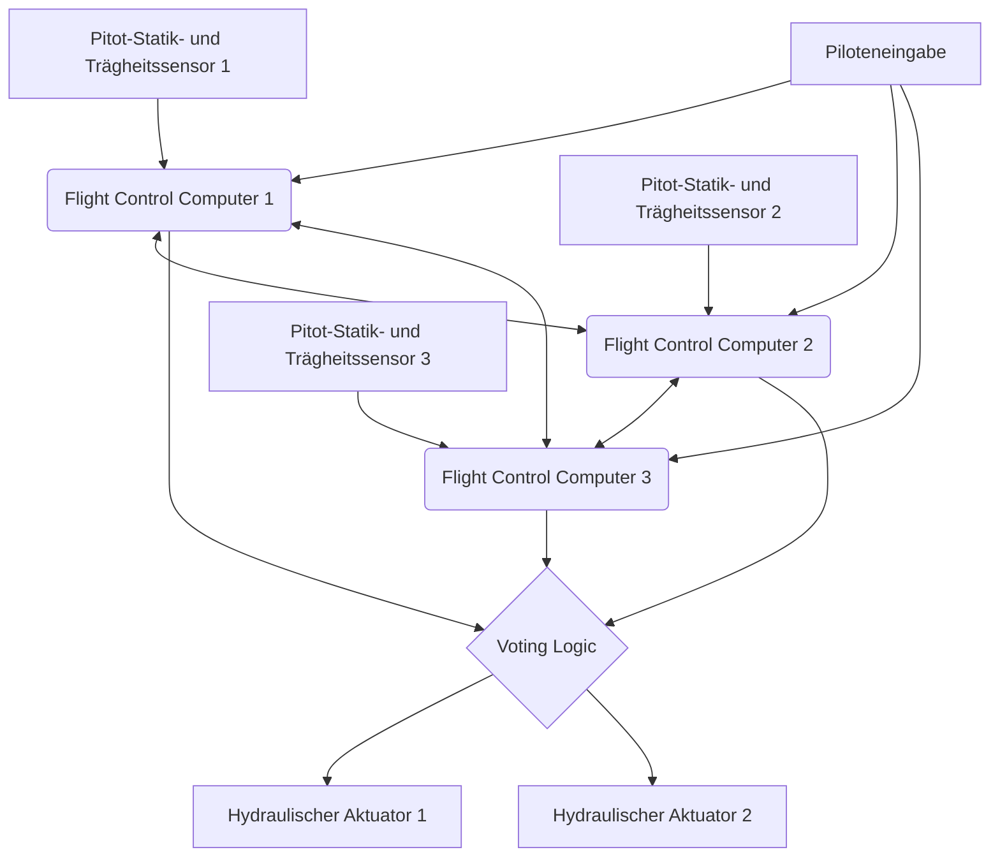

# Einleitung: Fliegende, riesige Rechenzentren

Moderne Jet-Verkehrsflugzeuge sind weit über den Rahmen bloßer aerodynamischer Fortbewegungsmittel hinausgewachsen und haben sich zu "fliegenden, riesigen Computernetzwerken" entwickelt, die mit hochmodernen Echtzeit-Betriebssystemen betrieben werden. Den Kern davon bilden die "Avionik" (Avionics), die die Luftfahrtelektronik bezeichnet, und die "Fly-By-Wire (FBW)"-Technologie, die das Flugzeug durch elektrische Signale steuert. In diesem Artikel werden wir aus der Perspektive der Luft- und Raumfahrttechnik sowie der Regelungstechnik die zugrundeliegende Architektur dieser Systeme, die Steuergesetze (Control Laws) und den "Konflikt der Designphilosophien", der von den beiden größten Flugzeugherstellern der Welt, Boeing und Airbus, gewoben wird, äußerst detailliert und akademisch tiefgreifend untersuchen.

---

## Kapitel 1: Die Mechanik der Flugzeugsteuerung und die Revolution von der Hydraulik zur Elektrik

### Der Mechanismus klassischer Steuerungssysteme und seine Grenzen

Die dreidimensionale Bewegungssteuerung für den Flug eines Flugzeugs besteht aus drei Achsen: Pitch (Längsneigung: gesteuert durch das Höhenruder), Roll (Querneigung: gesteuert durch die Querruder) und Yaw (seitliches Schwenken der Nase: gesteuert durch das Seitenruder). Bei Jet-Verkehrsflugzeugen von der Frühzeit der Luftfahrt bis etwa in die 1960er Jahre (wie z.B. der Boeing 707 oder der frühen 737) waren die Steuerhörner (Control Wheel oder Yoke) im Cockpit und die Steuerflächen (Control Surfaces) an Leitwerk und Tragflächen durch ein komplexes Netzwerk aus physischen Metallkabeln, Umlenkrollen (Pulleys) und Stangen direkt miteinander verbunden.

Der größte Vorteil dieses "mechanischen Steuerungssystems" war, dass es extrem einfach und intuitiv war. Wenn der Pilot an der Steuersäule zog, bewegte diese Kraft über Kabel direkt das Höhenruder, und der auf die Steuerfläche wirkende Luftwiderstand (Winddruck) wurde als Reaktionskraft (Feel Force) auf die Steuersäule zurückgekoppelt. Dadurch konnte der Pilot direkt mit den Händen spüren, "wie viel aerodynamische Last das Flugzeug gerade erfährt".

Als jedoch die Größe der Flugzeuge enorm zunahm und die Reisegeschwindigkeit den transsonischen Bereich von über Mach 0,8 erreichte, wurden die aerodynamischen Lasten auf die Steuerflächen so groß, dass sie durch menschliche Muskelkraft absolut nicht mehr bewegt werden konnten. Um diesem Problem zu begegnen, wurden "hydraulische Aktuatoren" (Hydraulic Actuators) eingeführt. Ähnlich wie bei der Servolenkung eines Autos öffnet und schließt die durch Kabel übertragene Eingabe des Piloten hydraulische Servoventile, und ein extrem hoher hydraulischer Druck von 3000 psi (etwa 210 bar) treibt Zylinder an, um die Steuerflächen zu bewegen.

### Herausforderungen der hydromechanischen Steuerung und die Notwendigkeit von Fly-By-Wire

Durch die Einführung hydraulischer Mechanismen wurde die Steuerung riesiger Flugzeuge zwar möglich, es blieben jedoch immer noch einige schwerwiegende Probleme bestehen.

1. **Zunahme von Gewicht und Komplexität**: Es war notwendig, Hunderte von Metern an Stahlkabeln und Umlenkrollen von einem Ende des Flugzeugs zum anderen zu verlegen, was mehrere Tonnen Totgewicht (Dead Weight) bedeutete. Zudem waren komplexe Mechanismen wie Spannungsregler erforderlich, um die Dehnung der Kabel und Spannungsänderungen aufgrund von Temperaturschwankungen auszugleichen.
2. **Grenzen der Bewältigung nichtlinearer aerodynamischer Eigenschaften**: Die aerodynamischen Eigenschaften eines Flugzeugs ändern sich dramatisch zwischen niedrigen Geschwindigkeiten (bei Start und Landung) und hohen Geschwindigkeiten (im Reiseflug). Bei mechanischen Systemen musste dieser dynamischen Veränderung physisch durch ein "künstliches Gefühlsystem" (Artificial Feel System), das Federn und Dämpfer verwendet, oder durch Pitch-Trim-Mechanismen begegnet werden, und es war unmöglich, im gesamten Flugbereich eine optimale Steuerreaktion zu erzielen.
3. **Fesseln der statischen Stabilität**: Bei herkömmlichen Flugzeugen war es zwingend erforderlich, den Schwerpunkt vor dem aerodynamischen Zentrum (Druckpunkt) zu platzieren und mit dem Höhenleitwerk stets einen abwärts gerichteten Auftrieb zu erzeugen, um eine "statische Stabilität" (Static Stability) zu gewährleisten, durch die das Flugzeug in seine ursprüngliche Fluglage zurückkehren will, selbst wenn der Pilot die Hände von der Steuerung nimmt. Dies erzeugte einen großen Trimmwiderstand (Trim Drag) und war ein Hauptfaktor für den verschlechterten Treibstoffverbrauch.

Um diese physischen und aerodynamischen Grenzen zu überwinden, war es notwendig, die physische Bedienung durch den Piloten und die Bewegung der Steuerflächen voneinander zu "trennen". So entstand "Fly-By-Wire (FBW)", bei dem die Bewegungen der Steuersäule in elektrische Signale (digitale Daten) umgewandelt werden und ein Computer den optimalen Steuerflächenausschlag berechnet, um Befehle an die hydraulischen (oder elektrischen) Aktuatoren der Steuerflächen zu senden.

---

## Kapitel 2: Systemarchitektur von Fly-By-Wire

Das Herzstück von Fly-By-Wire ist das Netzwerk von Flugsteuerungscomputern (Flight Control Computers: FCC), das extreme Zuverlässigkeit erfordert. Beim FBW von Verkehrsflugzeugen wird eine Ausfallwahrscheinlichkeit von "10 hoch minus 9 (10^-9) pro Stunde" (Catastrophic Failure Rate) verlangt, was eine unglaubliche Zuverlässigkeit von "weniger als einem katastrophalen Ausfall pro einer Milliarde Flugstunden" bedeutet. Genau das Architekturdesign zur Erreichung dieses Ziels ist die technologische Essenz von FBW.

### Mehrfache Redundanz (Redundancy) und Abstimmungsalgorithmen (Voting)

Damit der Flug auch bei Ausfall eines einzelnen Computers oder Sensors fortgesetzt werden kann, verfügt das FBW über eine dreifache (Triplex) oder vierfache (Quadruplex) redundante Konfiguration. Bei der Boeing 777 beispielsweise gibt es 3 Systeme von Primary Flight Computers (PFC) (Links, Mitte, Rechts), und jeder PFC besteht intern aus 3 Rechenkanälen, sodass es im Wesentlichen eine logische Architektur von "3x3 = 9-fach" aufweist.

Das Wichtigste in diesem redundanten System ist der Algorithmus für "Synchronisation und Abstimmung" (Synchronization and Voting).
Mehrere Computer empfangen gleichzeitig dieselben Eingabedaten (Steuerungsbetrag des Piloten, Fluggeschwindigkeit, Fluglage etc.) und führen Berechnungen mit denselben Steuergesetzen durch. Anschließend vergleichen sie gegenseitig die ausgegebenen Befehlswerte für den Steuerflächenausschlag (Cross-Channel Data Link).

Die Basis der Abstimmungslogik ist die "Mehrheitsentscheidung" (Majority Rule). Wenn zwei von drei Computern berechnen "Höhenruder um 5 Grad nach oben", und einer berechnet "10 Grad nach oben", wird die Mehrheit von 5 Grad als korrekt angesehen; der eine Computer mit dem abweichenden Berechnungsergebnis wird automatisch vom Netzwerk getrennt (Fail-Silent), und die verbleibenden zwei setzen die Steuerung fort (Fail-Operational).

### Beseitigung von Ausfällen durch gemeinsame Ursachen durch unterschiedliche Hardware und Software (Dissimilarity)

Selbst bei dreifacher Redundanz besteht, wenn genau dieselbe CPU und genau dasselbe Programm verwendet werden, die Gefahr, dass alle drei Computer "gleichzeitig dieselbe falsche Antwort" liefern, wenn sie auf einen bestimmten unbekannten Bug (Softwarefehler) oder einen Hardware-Designfehler (Errata) stoßen. Dies wird als "Ausfall durch gemeinsame Ursache" (Common Mode/Cause Failure: CCF) bezeichnet.

Um dies zu verhindern, streben Boeing und Airbus das "heterogene Design" (Dissimilarity) bis zum Äußersten an.
Zum Beispiel verwendet Airbus beim A320 für die Hauptcomputer ELAC (Elevator Aileron Computer) und SEC (Spoiler Elevator Computer) CPUs von völlig unterschiedlichen Herstellern (z. B. eine Intel-basiert, die andere Motorola-basiert). Darüber hinaus sind die Entwicklungsteams für die Steuerungssoftware physisch und organisatorisch vollständig getrennt und verwenden unterschiedliche Programmiersprachen (z. B. Ada und C) sowie unterschiedliche Compiler, um den Code aus denselben Anforderungsspezifikationen separat zu schreiben. Dadurch wird die Wahrscheinlichkeit, dass beide Softwares denselben Fehler aufweisen, selbst wenn eine davon einen Bug hat, mathematisch auf nahezu null reduziert.

### Avionik-Datenbus: ARINC 429 und ARINC 664 (AFDX)

Auch das Kommunikationsnetzwerk (Avionik-Datenbus), das diese Sensoren, Computer und Aktuatoren verbindet, hat eine eigene Evolution durchlaufen.

Lange Zeit seit den 1980er Jahren war der "ARINC 429"-Standard die Norm. Dabei handelt es sich um einen unidirektionalen (Simplex) seriellen Point-to-Multipoint-Bus, der 32-Bit-Datenworte mit 100 kbps (oder 12,5 kbps) über ein einziges Twisted-Pair-Kabel überträgt. Aufgrund seiner extrem einfachen und deterministischen (Deterministic) Struktur wird er auch heute noch in vielen Subsystemen eingesetzt.

Bei modernsten Flugzeugen wie dem A380, B787 oder A350 hat das Kommunikationsdatenvolumen jedoch explosionsartig zugenommen, und das Kabelgewicht erreichte mit Point-to-Point-Verkabelungen wie ARINC 429 sein Limit. Deshalb wurde "ARINC 664 Part 7" (bekannt als: AFDX - Avionics Full-Duplex Switched Ethernet) eingeführt.
AFDX basiert auf der Ethernet-Technologie (IEEE 802.3), die wir im Alltag verwenden, fügt jedoch Profile hinzu, die "absolute Garantien für Kommunikationsverzögerungen" (Bounded Latency) und "Bandbreitenzuweisungen" für die Luftfahrt erzwingen. Unter Verwendung des Konzepts eines Virtual Link (VL) verwalten die Netzwerk-Switches (AFDX-Switches) die Bandbreite für jeden Datenstrom streng, wodurch ein deterministisches (Deterministic) Ethernet-Netzwerk aufgebaut wird, in dem Paketkollisionen oder -verluste absolut nicht auftreten. Dadurch können hunderte von Geräten in Echtzeit über ein Hochgeschwindigkeits-100Mbps/1Gbps-Netzwerk kommunizieren.

---

## Kapitel 3: Flugsteuergesetze (Flight Control Laws)

Der größte Nutzen von FBW besteht darin, dass die physische Steuereingabe des Piloten (Stick Input) nicht einfach direkt in den Winkel der Steuerflächen (Surface Angle) umgewandelt wird, sondern dass der Computer die Absicht (Intent) des Piloten interpretiert, "wie er das Flugzeug bewegen möchte", und "Steuergesetze" (Control Laws) implementieren kann, die den optimalen Ruderausschlag basierend auf dem aktuellen Flugzustand (Geschwindigkeit, Höhe, Gewicht usw.) berechnen.

### Das C* (C-Star)-Gesetz: Revolution in der Pitch-Steuerung

Für die Längssteuerung (Pitch-Steuerung) der neuesten Verkehrsflugzeuge (Boeing 777/787 und Airbus A320 und später) wird das "C* (C-Star)-Steuergesetz" oder dessen Weiterentwicklung, das "C*U-Gesetz", verwendet.

Bei herkömmlichen Flugzeugen (oder im Direct-Law-Zustand) war der Ziehbetrag der Steuersäule proportional zum "Ausschlagwinkel des Höhenruders". Die Reaktion des Flugzeugs (Pitch-Geschwindigkeit und erzeugte G-Kräfte) ist jedoch bei niedrigen und hohen Geschwindigkeiten trotz desselben Ruderausschlags völlig unterschiedlich.
Im Gegensatz dazu interpretiert das C*-Gesetz die Bewegung der Steuersäule durch den Piloten als "Befehl für einen kombinierten Zielwert" aus "Pitch-Rate (Winkelgeschwindigkeit der Nickbewegung: q)" und "vertikaler Beschleunigung (G-Last: Nz)".

$$ C^* = K_1 \cdot q + K_2 \cdot N_z $$

(Wobei $K_1, K_2$ Gains sind, die sich abhängig von der Geschwindigkeit etc. ändern)

- **Bei niedrigen Geschwindigkeiten (z.B. Start/Landung)**: Da kaum aerodynamische G-Kräfte erzeugt werden, nutzt der Computer hauptsächlich die "Pitch-Rate (q)" zur Rückkopplung, um die Geschwindigkeit des Hebens und Senkens der Nase zu steuern.
- **Bei hohen Geschwindigkeiten (Reiseflug)**: Da bereits ein leichtes Anheben der Nase starke G-Kräfte erzeugt, nutzt der Computer hauptsächlich die "vertikale Beschleunigung (Nz)" zur Rückkopplung und steuert die Steuerflächen so, dass konstante G-Kräfte entsprechend der Eingabe des Piloten erzeugt werden.

Dadurch erhält der Pilot äußerst stabile Flugeigenschaften, bei denen "das Flugzeug unabhängig von der Fluggeschwindigkeit immer mit dem gleichen Gefühl reagiert, wenn man die Steuersäule um denselben Betrag zieht".

### Ausfallsichere (Failsafe) hierarchische Struktur: Normal, Alternate, Direct

Um sich gegen Ausfälle von Sensoren und Computern abzusichern, verfügen Flugzeuge über eine Downgrade-Hierarchie (Degradation) der Steuergesetze. Nimmt man die Terminologie von Airbus als Beispiel, ist es wie folgt gegliedert:

1. **Normal Law**
   Alle Systeme (ADIRU, Computer usw.) befinden sich in einem normalen Zustand. Die vollständige Kompensation des Steuergefühls durch das C*-Gesetz und der vollständige "Flugbereichsschutz" (Flight Envelope Protection), der später beschrieben wird, sind aktiv. Der Autopilot kann ebenfalls normal genutzt werden.
2. **Alternate Law**
   Ein Zustand, in dem ein Teil der gemultiplexten Sensoren ausgefallen ist und keine zuverlässigen Daten (z. B. genaue Fluggeschwindigkeit) mehr gewonnen werden können. Das Feedback für die grundlegende Fluglagekontrolle (Pitch-Rate und Roll-Rate) funktioniert, aber einige oder alle Schutzfunktionen für den Flugbereich (wie die Überziehschutzfunktion) sind deaktiviert.
3. **Direct Law**
   Der ultimative Backup-Zustand, in dem zahlreiche Computer und Sensoren ausgefallen sind und komplexe Berechnungen unmöglich geworden sind. Das FBW wird zu einem einfachen "elektrischen Kabel", und die Bewegung der Steuersäule wird direkt und proportional auf den Ausschlagwinkel der Steuerflächen übertragen (Proportionalsteuerung). Es gibt absolut keinen Flugbereichsschutz, und das Steuergefühl ist exakt das gleiche wie bei einem klassischen Flugzeug (wobei Empfindlichkeitsänderungen aufgrund der Geschwindigkeit ungeschwächt auftreten).

### Flight Envelope Protection (Flugbereichsschutz)

Dies ist die größte Sicherheitstechnologie, die FBW mit sich gebracht hat. Flugzeuge haben einen Grenzbereich (Envelope), in dem sie sicher fliegen können. Dazu gehören Geschwindigkeit (Überziehgeschwindigkeit und maximale Mach-Zahl), Querneigungswinkel (Bank Angle), Längsneigungswinkel (Pitch Angle), G-Last (Lastvielfaches) und so weiter. Wenn das Flugzeug versucht, diese Grenzen zu überschreiten, greift das FBW ein und verhindert dies mithilfe des Computers.

- **Schutz der Längsneigung (Pitch Attitude Protection)**: Begrenzt den Nose-up-Winkel auf ein bestimmtes Maximum (z. B. +30 Grad) und den Nose-down-Winkel auf ein Minimum (z. B. -15 Grad).
- **Schutz des Querneigungswinkels (Bank Angle Protection)**: Steuert das Querruder, damit der Rollwinkel ein bestimmtes Maß (z. B. 67 Grad) nicht überschreitet.
- **Überziehschutz (Alpha Protection)**: Wenn sich der Anstellwinkel (Angle of Attack: AoA, Alpha) dem Überziehgrenzwert nähert, verweigert der Computer eine weitere Erhöhung des Nickwinkels, selbst wenn der Pilot weiterhin die Steuersäule zieht, und setzt den Triebwerksschub automatisch auf das Maximum (TOGA), um einen Strömungsabriss zu vermeiden.

---

## Kapitel 4: Boeing vs. Airbus: Ein entscheidender Konflikt der Designphilosophien

Bei der Einführung der FBW-Technologie vertreten Boeing und Airbus, die die zivile Luftfahrtindustrie in zwei Hälften teilen, völlig unterschiedliche Designphilosophien hinsichtlich des "Cockpit-Designs und der Delegation von Autorität zwischen Mensch und Maschine". Dies ist eine der interessantesten Diskussionen in der modernen Luftfahrttechnik.

### Die Airbus-Philosophie: "Absolute Sicherheit durch Computer und Hard-Limits"

Der 1988 in Dienst gestellte A320 ist das weltweit erste vollständig digitale FBW-Verkehrsflugzeug. Die grundlegende Philosophie von Airbus lautet: "**Menschen machen Fehler. Daher muss die ultimative Sicherheit durch Hard-Limits (absolute Begrenzungen) basierend auf Computerberechnungen gewährleistet werden.**"

1. **Einführung des Sidesticks**:
   Airbus schaffte das traditionelle beidhändige Steuerhorn (Yoke) ab und platzierte wie in Kampfflugzeugen einen Sidestick auf der linken Seite des Kapitänssitzes und auf der rechten Seite des Copilotensitzes. Dies verbesserte die Sichtbarkeit des Instrumentenbretts drastisch.
2. **Keine mechanische Kopplung der Steuerknüppel**:
   Die Sidesticks des Kapitäns und des Copiloten sind physisch nicht verbunden. Wenn einer bedient wird, bewegt sich der andere Stick nicht (bei Dual-Input werden die Eingaben algebraisch addiert, oder man streitet sich mit einem Prioritätsknopf um die Kontrolle).
3. **Hard-Protection (Hard Envelope Protection)**:
   Solange das Normal Law aktiv ist, überschreitet das Flugzeug den Überzieh-Anstellwinkel absolut nicht und auch der Bankwinkel überschreitet den Grenzwert nicht, selbst wenn der Pilot – sei es absichtlich oder in Panik – den Sidestick durchgehend bis zum Anschlag zieht. Das heißt, der Computer hat die Autorität, die Aktionen des Piloten zu "übersteuern (abzulehnen)".

### Die Boeing-Philosophie: "Die letzte Entscheidungsmacht liegt immer beim Piloten (Soft-Limits)"

Andererseits hält Boeing bei der 1995 in Dienst gestellten ersten FBW-Maschine, der B777 (und der späteren B787), an der Philosophie fest, dass "**unter allen Umständen der menschliche Pilot, der die Situation vor Ort am besten versteht, die letzte Entscheidungsgewalt haben sollte**".

1. **Beibehaltung des traditionellen Steuerhorns (Yoke)**:
   Boeing hat keinen Sidestick eingeführt und das traditionelle Yoke beibehalten. Selbst bei FBW-Flugzeugen sind die Yokes des Kapitäns und des Copiloten durch Mechanismen unter dem Boden physisch (oder durch elektrische Servos) miteinander verbunden und bewegen sich gemeinsam. Dadurch können die Piloten die Eingaben des jeweils anderen haptisch und visuell wahrnehmen.
2. **Künstliches Gefühlsystem (Artificial Feel) und Backdrive**:
   Selbst wenn der Autopilot das Flugzeug steuert, bewegt sich das Yoke im Cockpit physisch im Einklang mit den Bewegungen der Steuerflächen (die Sidesticks von Airbus bewegen sich nicht). Zudem ist ein Aktuator eingebaut, der das Gewicht (die Steuerkraft) beim Bewegen des Yokes in Abhängigkeit von der Geschwindigkeit simuliert und dem Piloten künstlich eine "aerodynamische Rückmeldung" gibt.
3. **Soft-Protection (Soft Envelope Protection)**:
   Auch Boeing-Flugzeuge verfügen über Überziehschutz und Bankwinkelbegrenzungen, diese sind jedoch keine "absoluten Mauern". Wenn sich das Flugzeug der Grenze nähert, wird die Steuersäule dramatisch schwerer und warnt den Piloten. Wenn der Pilot jedoch weiterhin mit "noch größerer Kraft (z. B. einer Kraft von etwa 22,5 kg oder mehr)" an der Steuersäule zieht, ist es möglich, die Systemgrenzen zu "durchbrechen (Override)" und Manöver über diese Grenzen hinaus durchzuführen. Dies basiert auf dem Gedanken, dass "in Extremsituationen, die der Computer nicht vorhergesehen hat – wie z. B. dem Ausweichen vor einer Rakete oder zur Vermeidung eines Zusammenstoßes mit dem Gelände – dem Piloten die Autorität belassen werden sollte, Ausweichmanöver durchzuführen, selbst wenn das Flugzeug dabei beschädigt wird".

Dieser philosophische Unterschied, ob man "der Maschine vertraut oder dem Menschen", zeigt sich bis heute in einem grundlegenden Unterschied im Cockpit-Design beider Unternehmen.

---

## Kapitel 5: Sensorfusion und automatische Landung (Autoland)

Die Weiterentwicklung von FBW-Systemen war unerlässlich für die Realisierung einer vollautomatischen Landung (Autoland) in Verbindung mit dem Instrument Landing System (ILS) und dem GPS-basierten GLS (GBAS Landing System). Die Technologie, eine hunderte Tonnen schwere Maschine mit Hunderten von Passagieren bei dichtem Nebel mit nahezu Null Sicht (Cat IIIb/IIIc-Bedingungen) weich auf der Mittellinie der Landebahn landen zu lassen, stellt den Höhepunkt der Regelungstechnik dar.

### Die Sensorgruppe zur Raumerfassung (ADIRU)

Für eine präzise Steuerung ist es notwendig, mit extrem hoher Genauigkeit zu wissen, wo sich das Flugzeug im Raum befindet, in welcher Fluglage es ist und wie es sich bewegt. Dies übernimmt die "Air Data Inertial Reference Unit (ADIRU)".

- **Air Data (Luftdaten)**: Berechnet die Fluggeschwindigkeit (Airspeed), die Höhe (Altitude), die Mach-Zahl und den Anstellwinkel (AoA) mit Hilfe von Staurohren (die den Staudruck messen), Statikports (die den statischen Druck messen) und Temperatursensoren, die außerhalb des Flugzeugs angebracht sind.
- **Trägheitsreferenz (IRS: Inertial Reference System)**: Erfasst die Winkelgeschwindigkeit und Beschleunigung der drei Achsen des Flugzeugs mit hoher Präzision mithilfe von Ringlaserkreiseln (RLG) oder Faserkreiseln (FOG) und berechnet durch deren Integration autonom die Fluglage (Pitch, Roll, Yaw) und die absoluten Koordinaten (Breitengrad/Längengrad) auf der Erde.

In der modernen Avionik werden die Signale von GPS (GNSS) mit diesen ADIRU-Daten mithilfe von Kalman-Filtern usw. fusioniert (Sensorfusion), um Driftfehler kontinuierlich zu korrigieren und präzise Navigationslösungen im Bereich von wenigen Zentimetern bis Metern zu erhalten.

### Regelschleife der automatischen Landung sowie Flare und Rollout

Bei einer automatischen Landung mit dem ILS werden die vom Boden ausgestrahlten Localizer-Funkwellen (Mittellinie der Landebahn) und Glide-Slope-Funkwellen (etwa 3 Grad Sinkwinkel) von Antennen an Bord empfangen, und der FCC führt eine Regelung (Feedback Control) durch, um das Flugzeug im Zentrum dieses Funkstrahls zu halten.

1. **Approach Phase (Anflugphase)**:
   In einer Höhe von etwa 1500 Fuß werden alle 3 Autopilot-Systeme zugeschaltet und die Mehrheitslogik wird aktiviert (Fail-Operational-Zustand). Pitch und Roll werden kontinuierlich feineingestellt, um das Fehlersignal des ILS auf null zu reduzieren.
2. **Crab Angle (Vorhaltewinkel) und Seitenwindkompensation**:
   Bei Seitenwind sinkt das Flugzeug in einer schrägen Fluglage (Crab-Haltung), wobei die Nase in den Wind gerichtet ist.
3. **Decrab (Ausrichtung) und Flare (Abfangen)**:
   Wenn der Radarhöhenmesser (Radio Altimeter) eine Höhe von etwa 50 Fuß erkennt, wechselt der Autopilot automatisch in den "Flare-Modus". Er hebt die Nase leicht an, um die Sinkrate zu verringern (normalerweise auf etwa 150 fpm) und den Stoß beim Aufsetzen abzumildern. Bei Seitenwind betätigt er gleichzeitig das Seitenruder, um die Nase in Richtung der Landebahn auszurichten (Decrab), wendet Querruder an, um einen Rollwinkel zu erzeugen, damit das Flugzeug nicht abdriftet, und lässt das Hauptfahrwerk auf der windzugewandten Seite zuerst aufsetzen. Der Computer führt diese komplexe Multi-Parameter- und Multivariablen-Steuerung mit einer Genauigkeit im Millisekundenbereich aus, was für einen Menschen unmöglich wäre.
4. **Rollout (Ausrollen)**:
   Auch nach dem Aufsetzen folgt der Autopilot weiterhin dem Localizer-Signal und steuert automatisch das Seitenruder und die Bugradlenkung (Nose Wheel Steering), um direkt auf der Mittellinie der Landebahn zu verzögern. Gleichzeitig steuert der Computer das automatische Ausfahren der Störklappen (Spoiler) sowie das Bremsen mit einer konstanten Verzögerungsrate durch das Autobrake-System.

---

## Kapitel 6: Die Zukunft der Avionik und des autonomen Fliegens

FBW und Avionik entwickeln sich auch heute noch rasant weiter und sind dabei, das Gesicht der Luftfahrtindustrie der nächsten Generation grundlegend zu verändern.

### Integrierte Modulare Avionik (IMA: Integrated Modular Avionics)

Bei herkömmlichen Flugzeugen war für jede Funktion, wie z. B. Autopilot, Flight Management System (FMS), Fahrwerkssteuerung oder Klimaanlagensteuerung, ein eigener, unabhängiger Computer (LRU: Line Replaceable Unit) installiert. Dies führte jedoch zu einer Verschwendung von Gewicht, Stromverbrauch und Kosten.
In modernen Flugzeugen wie der B787 oder A350 wird die "Integrierte Modulare Avionik (IMA)"-Architektur verwendet. Hierbei werden mehrere gemeinsame Computing-Module (CCM), ähnlich vielseitigen Hochleistungs-Blade-Servern, im Flugzeug platziert und darauf ein Echtzeitbetriebssystem (RTOS) basierend auf dem ARINC 653-Standard betrieben. Durch die "Time and Space Partitioning"-Technologie (Zeit- und Raum-Partitionierung) des RTOS ist es möglich geworden, auf derselben CPU und demselben Speicher "kritische Flugsteuerungssoftware" und "Software für das In-Flight-Entertainment" vollständig isoliert voneinander gleichzeitig auszuführen. Dies ermöglichte eine erhebliche Reduzierung der Hardware und eine Gewichtsersparnis.

### Fly-By-Light und Elektrifizierung (More Electric Aircraft)

Als Evolution des Datenbusses schreitet die Erforschung von "Fly-By-Light (FBL)" voran, bei dem Kupferdrähte durch Glasfasern ersetzt werden. Glasfasern bieten für Flugzeuge äußerst vorteilhafte Eigenschaften, da sie nicht nur eine ultrabreite Bandbreite besitzen und leicht sind, sondern auch völlig unempfindlich gegenüber Blitzeinschlägen (Lightning Strike) und starken elektromagnetischen Interferenzen (EMI / EMP) sind.

Darüber hinaus hat durch das Konzept des "More Electric Aircraft (MEA)" der Übergang von herkömmlichen, schweren hydraulischen Leitungssystemen zu "Elektromechanischen Aktuatoren (EMA)", die Steuerflächen direkt mit Motoren antreiben, oder "Elektrohydrostatischen Aktuatoren (EHA)", die über in den Aktuator integrierte, unabhängige Hydraulikpumpen verfügen, begonnen (in den Backup-Systemen von A380 und B787 bereits im Einsatz). Dies verringert das Risiko eines kompletten Systemausfalls aufgrund von Hydrauliklecks und verbessert die Treibstoffeffizienz weiter.

### Die Einführung von KI, Single Pilot Operations (SPO) und auf dem Weg zum vollständig autonomen Fliegen

Als ultimative Zukunft wird die Einführung von Künstlicher Intelligenz (KI) und maschinellem Lernen in die Avionik diskutiert. Das derzeitige FBW arbeitet ausschließlich mit "von Menschen programmierter deterministischer Logik (Deterministic Logic)". Es wird jedoch an adaptiver Steuerung (Adaptive Control) geforscht, bei der eine KI in komplexen Wetterbedingungen oder bei unbekannten strukturellen Schäden am Flugzeug sofort neue Steuergesetze erlernen und neu strukturieren kann, um den Flug aufrechtzuerhalten.

Zudem werden, um dem Pilotenmangel entgegenzuwirken, derzeit Konzepte (wie eMCO) ernsthaft getestet – insbesondere von Airbus –, bei denen Verkehrsflugzeuge, die normalerweise von zwei Piloten (Kapitän und Copilot) geflogen werden, zumindest während des Reiseflugs auf einen Piloten reduziert werden (Single Pilot Operations: SPO) und die Rolle des Copiloten von hochautonomen Avioniksystemen oder Fernoperateuren am Boden übernommen wird. Die ultimative Konsequenz von Fly-by-Wire ist vielleicht das "vollautonome Verkehrsflugzeug", bei dem der menschliche Pilot vollständig aus dem Cockpit verschwindet.

---

## Fazit

"Fly-by-Wire" ist nicht einfach nur eine Technologie, die mechanische Kabel durch elektrische Leitungen ersetzt hat. Es ist ein Paradigmenwechsel, der Flugzeuge von aerodynamischen Zwängen befreit und sie zu einem "fliegenden System-of-Systems" gemacht hat, das das Beste aus Regelungstechnik, Informationstechnologie und Netzwerktechnik vereint.
Wie die Unterschiede in den Designphilosophien von Boeing und Airbus zeigen, gibt es dabei immer die fundamentale Frage: "Was ist die Rolle des Menschen?" Mit dem weiteren Fortschritt von KI und Autonomie wird die Avionik-Technologie unsere Flugreisen auch in Zukunft sicherer, effizienter und leiser machen.

## Anhang: Mathematische Modellierung von Fly-By-Wire und Übertragungsfunktionen (Transfer Functions)

Um das akademische Verständnis von FBW-Systemen zu vertiefen, werden hier grundlegende Übertragungsfunktionen und das Blockdiagramm-Modell der Feedback-Regelung für die Längsbewegung (Pitch-Achse) des Flugzeugs ergänzt.

### Modell der dynamischen Eigenschaften eines Flugzeugs (Short Period-Modus)

Die Längsbewegung eines Flugzeugs wird im Wesentlichen in zwei Modi unterteilt: den kurzperiodischen Modus (Short Period Mode) und den langperiodischen Modus (Phugoid Mode). Es ist dieser "Short Period Mode", der durch das C*-Gesetz und die Pitch-Rate-Steuerung des FBW direkt gedämpft und stabilisiert wird.

Die Übertragungsfunktion $G(s) = \frac{q(s)}{\delta_e(s)}$ vom Höhenruderausschlag $\delta_e$ zur Pitch-Rate $q$ wird aus den allgemeinen linearisierten Starrkörper-Bewegungsgleichungen wie folgt angenähert:

$$ \frac{q(s)}{\delta_e(s)} = \frac{K_q(T_{\theta_2}s + 1)}{s^2 + 2\zeta_{sp}\omega_{sp}s + \omega_{sp}^2} $$

Wobei:
- $K_q$ der stationäre Verstärkungsfaktor der Steuerung ist (hängt stark von Geschwindigkeit und Staudruck ab)
- $T_{\theta_2}$ die Zeitkonstante der Phasenverzögerung zwischen Pitch-Bewegung und Änderung des Flugpfads (Flight Path) ist
- $\zeta_{sp}$ das Dämpfungsverhältnis (Damping Ratio) des Short-Period-Modus ist
- $\omega_{sp}$ die Eigenkreisfrequenz (Natural Frequency) des Short-Period-Modus ist

Bei herkömmlichen mechanischen Steuerungssystemen bestand das Problem, dass die aerodynamische Dämpfung in großen Höhen oder bei hohen Geschwindigkeiten abnahm und $\zeta_{sp}$ sehr klein wurde (das Flugzeug tendierte dazu, in der Pitch-Achse zu schwingen).

### Verbesserung der Eigenschaften durch Feedback-Steuerung

In FBW-Systemen werden die von Gyrosensoren (ADIRU) gemessene Pitch-Rate $q_{sensor}$ und die vertikale Beschleunigung $N_{z\_sensor}$ an den Computer zurückgeführt und der Fehler $e(s)$ zum Befehlswert $q_{cmd}$ (oder $C^*_{cmd}$) des Piloten berechnet.

Betrachten wir die Übertragungsfunktion im geschlossenen Regelkreis (Closed-Loop) bei Einführung der grundlegendsten Pitch-Rate-Feedback-Steuerung (Proportional-Integral-Regelung: PI-Regelung). Angenommen, die Übertragungsfunktion des Reglers (Controller) ist $C(s) = K_p + \frac{K_i}{s}$, dann ist der vom Regler ausgegebene Ruderausschlagsbefehl $\delta_c$:

$$ \delta_c(s) = C(s) \left( q_{cmd}(s) - q_{sensor}(s) \right) $$

Multipliziert man dies mit der Verzögerungscharakteristik erster Ordnung $H(s) = \frac{1}{\tau_a s + 1}$ des hydraulischen Aktuators, erhält man den tatsächlichen Ruderausschlag $\delta_e$.

Durch die Einstellung der Pole (Poles) des Nennerpolynoms (charakteristische Gleichung) der Übertragungsfunktion des gesamten geschlossenen Regelkreises $G_{closed}(s) = \frac{q(s)}{q_{cmd}(s)}$ mittels geeigneter Gains $K_p, K_i$ durch Gain Scheduling wird in jedem beliebigen Geschwindigkeitsbereich ein optimales $\zeta$ (normalerweise um 0,7) und $\omega_n$ realisiert. Dadurch können die Steuereigenschaften eines "idealen Flugzeugs" jederzeit in der Software emuliert werden, unabhängig von der physischen Größe des Leitwerks oder der Lage des Schwerpunkts. Das ist das mathematische Wesen der "künstlichen Stabilität" (Artificial Stability) durch FBW.
