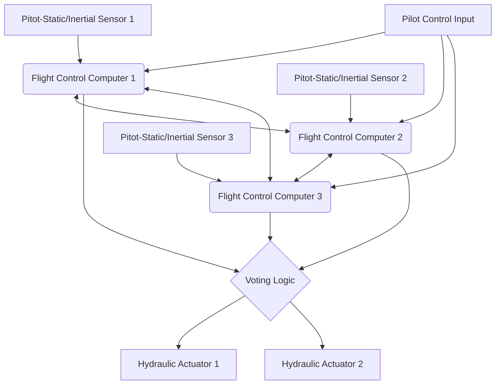

# Introduction: A Giant Flying Data Center

Modern jet airliners have evolved far beyond the framework of mere aerodynamic vehicles into "giant flying computer networks" operating on advanced real-time operating systems. At the core of this evolution are "Avionics" (aviation electronics) and "Fly-By-Wire (FBW)" technology, which controls the aircraft using electrical signals. In this article, from the perspectives of aerospace engineering and control engineering, we will conduct an extremely detailed and academic deep dive into the architectures underlying these systems, their control laws, and the "conflict of design philosophies" woven by the world's two major aircraft manufacturers, Boeing and Airbus.

---

## Chapter 1: The Mechanics of Aircraft Flight Control and the Revolution from Hydraulics to Electricity

### The Mechanism and Limitations of Classical Flight Control Systems

The three-dimensional motion control required for an aircraft to fly consists of 3 axes: pitch (longitudinal tilt: controlled by the elevator), roll (lateral tilt: controlled by the ailerons), and yaw (left-right movement of the nose: controlled by the rudder). In jet airliners from the dawn of aviation up to around the 1960s (such as the Boeing 707 and early 737s), the control column (control wheel or yoke) in the cockpit and the control surfaces on the tail and wings were directly connected by a complex network of physical metal cables, pulleys, and rods.

The greatest advantage of this "mechanical flight control system" was that it was extremely simple and intuitive. When the pilot pulled the control column, that force was directly transmitted via cables to move the elevator, and the aerodynamic resistance (wind pressure) hitting the control surface was fed back to the control column as a reaction force (feel force). This allowed the pilot to directly feel by hand "how much aerodynamic load the aircraft is currently experiencing."

However, as aircraft sizes grew larger and cruising speeds reached the transonic region exceeding Mach 0.8, the aerodynamic loads placed on the control surfaces became so immense that they could not possibly be moved by human muscle strength. To address this, "Hydraulic Actuators" were introduced. Similar to power steering in automobiles, the pilot's input transmitted by cables opened and closed hydraulic servo valves, and ultra-high-pressure hydraulic fluid at 3000 psi (about 210 atm) drove the cylinders to move the control surfaces.

### Challenges of Hydro-Mechanical Control and the Inevitability of Fly-By-Wire

Although the introduction of hydraulic mechanisms made it possible to steer massive aircraft, several serious challenges still remained.

1. **Increase in Weight and Complexity**: Hundreds of meters of steel cables and pulleys had to be strung from one end of the aircraft to the other, constituting several tons of dead weight. In addition, complex mechanisms such as tension regulators were required to compensate for cable stretching and tension changes due to temperature variations.
2. **Limitations in Handling Nonlinear Aerodynamic Characteristics**: The aerodynamic characteristics of an aircraft change dramatically between low speeds (takeoff and landing) and high speeds (cruising). In a mechanical system, these dynamic changes had to be dealt with physically using an "Artificial Feel System" employing springs and dampers, or pitch trim mechanisms, making it impossible to obtain optimal steering response across the entire flight envelope.
3. **The Shackle of Static Stability**: Conventional aircraft required a design where the center of gravity was placed forward of the center of pressure, and the horizontal stabilizer constantly generated downward lift, to provide "Static Stability" so the aircraft would return to its original attitude if the pilot let go of the controls. This generated significant trim drag, a major factor worsening fuel efficiency.

To break through these physical and aerodynamic limitations, it was necessary to "disconnect" the pilot's physical operation from the movement of the control surfaces. Thus emerged "Fly-By-Wire (FBW)," which converts the movement of the control column into electrical signals (digital data), allowing a computer to calculate the optimal deflection angle and send commands to the hydraulic (or electric) actuators of the control surfaces.

---

## Chapter 2: Fly-By-Wire System Architecture

The heart of Fly-By-Wire is a network of Flight Control Computers (FCC) that demand extreme reliability. Passenger airliner FBW systems require an astronomical reliability known as a "Catastrophic Failure Rate of 10^-9 per hour," meaning "no more than one fatal failure in one billion flight hours." The architectural design to achieve this is the technical essence of FBW.

### Multiple Redundancy and Voting Algorithms

To ensure that flight can continue even if a single computer or sensor fails, FBW adopts a Triplex or Quadruplex redundant configuration. For example, in the Boeing 777, there are three Primary Flight Computers (PFCs) (Left, Center, Right), and each PFC itself consists of three internal computing channels, effectively giving it a "3 × 3 = 9-fold" logical architecture.

The most important aspect of this redundant system is the "Synchronization and Voting" algorithm.
Multiple computers simultaneously receive the same input data (pilot's control inputs, airspeed, attitude angle, etc.) and perform calculations using the same control laws. They then compare their output command values for surface deflection with each other (cross-channel data link).

The basis of the voting logic is "Majority Rule." If two of the three computers calculate "pitch elevator up 5 degrees," and one calculates "up 10 degrees," the majority 5 degrees is deemed correct. The one computer producing a deviant calculation result is automatically isolated from the network (Fail-Silent), and control is continued by the remaining two (Fail-Operational).

### Elimination of Common Cause Failures through Hardware and Software Dissimilarity

Even with triple redundancy, if the exact same CPUs and programs are used, there is a risk that encountering a specific unknown bug (software defect) or hardware design flaw (errata) could cause all three computers to "give the same wrong answer simultaneously." This is called a "Common Mode/Cause Failure (CCF)."

To prevent this, Boeing and Airbus pursue "Dissimilarity" to the extreme.
For instance, on the Airbus A320, the main computers, the ELAC (Elevator Aileron Computer) and SEC (Spoiler Elevator Computer), employ CPUs from completely different manufacturers (e.g., one Intel-based, the other Motorola-based). Furthermore, the software development teams are physically and organizationally completely separated, writing code separately from the same requirement specifications using different programming languages (e.g., Ada and C) and different compilers. Consequently, even if there is a bug in one piece of software, the probability of the exact same bug existing in the other software is mathematically suppressed to near zero.

### Avionics Data Buses: ARINC 429 and ARINC 664 (AFDX)

The communication networks (avionics data buses) linking these sensors, computers, and actuators have also undergone their own evolution.

The "ARINC 429" standard was the norm for a long time since the 1980s. This is a one-to-many simplex serial bus that transmits 32-bit data words at 100kbps (or 12.5kbps) over a single twisted pair cable. Because its structure is extremely simple and deterministic, it is still used in many subsystems today.

However, in cutting-edge aircraft like the A380, B787, and A350, the volume of communication data exploded, and point-to-point wiring like ARINC 429 reached its limit in terms of cable weight. This led to the introduction of "ARINC 664 Part 7 (commonly known as AFDX - Avionics Full-Duplex Switched Ethernet)."
AFDX is based on the Ethernet (IEEE 802.3) technology we use daily, but adds profiles for aircraft that enforce "Bounded Latency" and "Bandwidth Allocation." Using a concept called Virtual Links (VL), network switches (AFDX switches) strictly manage the bandwidth for each data stream, constructing a deterministic Ethernet network where packet collisions or loss absolutely never occur. This enables hundreds of devices to communicate in real-time over high-speed 100Mbps/1Gbps networks.

---

## Chapter 3: Flight Control Laws

The greatest benefit of FBW is that rather than simply translating the pilot's physical control input (Stick Input) directly into surface deflection (Surface Angle), a computer can interpret the pilot's intent ("how the pilot wants the aircraft to move") and implement "Control Laws" that calculate the optimal control surface angle according to the current flight state (speed, altitude, weight, etc.).

### The C* (C-Star) Law: Revolutionizing Pitch Control

The "C* (C-Star) Control Law" or its derivative, the "C*U Law," is adopted for longitudinal (pitch) control in the latest airliners (Boeing 777/787 and Airbus A320 onwards).

In conventional aircraft (or in a direct law state), how much the control column is pulled is proportional to the "elevator deflection angle." However, at low speeds versus high speeds, the same deflection angle produces completely different aircraft reactions (pitch rate and generated G-force).
In contrast, under the C* law, moving the control column is interpreted as the pilot commanding a 'synthesized target value' of "Pitch Rate (the angular velocity of the nose moving up/down: q)" and "Vertical Acceleration (G-load: Nz)."

$$ C^* = K_1 \cdot q + K_2 \cdot N_z $$

(Here, $K_1, K_2$ are gains that change depending on speed, etc.)

- **At low speeds (takeoff/landing, etc.)**: Since aerodynamic G is hard to generate, the computer primarily feeds back the "Pitch Rate (q)" to control the speed of pitching the nose up or down.
- **At high speeds (cruising)**: Since even a slight nose-up pitch generates intense G-forces, the computer primarily feeds back the "Vertical Acceleration (Nz)" and controls the surfaces to generate a constant G corresponding to the pilot's input.

As a result, regardless of the airspeed, the pilot gains an extremely stable handling characteristic where "pulling the stick by the same amount always gives the same feeling of aircraft response."

### Fail-Safe Hierarchical Structure: Normal, Alternate, Direct

Aircraft feature a degradation hierarchy for control laws to prepare for sensor or computer failures. Taking Airbus nomenclature as an example, it is tiered as follows:

1. **Normal Law**
   All systems (ADIRUs, computers, etc.) are functioning correctly. Complete handling compensation by the C* law and full "Flight Envelope Protection" (described below) are active. The autopilot is also fully usable.
2. **Alternate Law**
   Some multiplexed sensors have failed, and reliable data (e.g., accurate airspeed) is no longer available. Basic attitude control feedback (pitch rate and roll rate) functions, but some or all flight envelope protections (such as stall protection) are disengaged.
3. **Direct Law**
   The final backup state where numerous computers or sensors have failed, making complex calculations impossible. FBW becomes a mere "electrical cable," and the movement of the control column is transmitted directly and proportionally to the surface deflection angle (proportional control). There is no flight envelope protection whatsoever, and handling is exactly the same as a classical aircraft (meaning sensitivity changes based on speed are fully exposed).

### Flight Envelope Protection

This is the greatest safety technology brought about by FBW. Aircraft have a limit envelope within which they can safely fly. This includes speed (stall speed and limit Mach number), bank angle, pitch angle, and G-load (load factor). When the aircraft is about to exceed these limits, the FBW computer intervenes to prevent it.

- **Pitch Attitude Protection**: Restricts the nose-up angle from exceeding a certain limit (e.g., +30 degrees) or the nose-down angle (e.g., -15 degrees).
- **Bank Angle Protection**: Controls the ailerons so the roll angle does not exceed a certain limit (e.g., 67 degrees).
- **Stall Protection (Alpha Protection)**: When the Angle of Attack (AoA, Alpha) approaches the stall limit, even if the pilot continues pulling the stick, the computer refuses any further nose-up pitch and automatically sets engine thrust to maximum (TOGA) to avoid a stall.

---

## Chapter 4: Boeing vs. Airbus: The Decisive Clash in Design Philosophy

In introducing FBW technology, Boeing and Airbus, who divide the commercial aviation industry, hold completely different design philosophies regarding "cockpit design and the delegation of authority between humans and machines." This is one of the most fascinating debates in modern aerospace engineering.

### Airbus Philosophy: "Absolute Protection and Hard Limits by the Computer"

The A320, which entered service in 1988, was the world's first fully digital FBW airliner. The fundamental Airbus philosophy is that "**Humans make mistakes. Therefore, ultimate safety must be guarded by hard limits (absolute restrictions) calculated by the computer.**"

1. **Adoption of Side-Sticks**:
   Airbus eliminated the traditional two-handed control column (yoke) and placed fighter jet-like side-sticks on the left side of the Captain's seat and the right side of the First Officer's seat. This dramatically improved the visibility of the instrument panel.
2. **Non-Coupled Controls**:
   The side-sticks for the Captain and First Officer are not physically linked. If one is moved, the other stick does not move (during dual input, inputs are algebraically summed or control is wrested via a priority button).
3. **Hard Envelope Protection**:
   As long as Normal Law is active, whether intentionally or in a panic, even if the pilot holds the side-stick fully deflected to the limit, the aircraft will absolutely never exceed the stall angle of attack, nor will the bank angle exceed its limit value. In other words, "the computer has the authority to override (refuse) the pilot's inputs."

### Boeing Philosophy: "Final Authority Always Lies with the Pilot (Soft Limits)"

On the other hand, the B777 (and later the B787), the first FBW aircraft Boeing put into service in 1995, adheres to the philosophy that "**In any situation, the human pilot who best grasps the situation on the ground should have the final decision-making authority.**"

1. **Maintaining the Traditional Control Wheel (Yoke)**:
   Boeing did not adopt side-sticks, retaining the conventional yoke. Even on FBW aircraft, the Captain's and First Officer's yokes are physically (or electromechanically) linked to move together via mechanisms under the floor. This allows the pilots to tactilely and visually recognize each other's inputs.
2. **Artificial Feel and Back-Drive**:
   Even when the autopilot is flying, the cockpit yokes physically move to match the movement of the control surfaces (Airbus side-sticks do not move). Furthermore, actuators are built in to simulate the weight (steering force) required to move the yoke based on speed, synthetically transmitting an "aerodynamic feel" to the pilot.
3. **Soft Envelope Protection**:
   Boeing aircraft also have stall protection and bank angle limits, but they are not "absolute walls." As the aircraft approaches its limits, the control column becomes dramatically heavier to warn the pilot, but if the pilot continues pulling with "even greater force (e.g., about 22.5 kg or more)," they can "override" the system's set limits and perform maneuvers beyond them. This is based on the ideology that "in extreme situations the computer cannot anticipate, such as missile evasion or terrain collision avoidance, the pilot should retain the authority to take evasive action even if it means breaking the aircraft."

This philosophical difference of "trust the machine, or trust the human" continues to manifest today as the fundamental difference in cockpit design between the two companies.

---

## Chapter 5: Sensor Fusion and Autoland

The advancement of FBW systems was essential for realizing complete Automatic Landing (Autoland) in conjunction with Instrument Landing Systems (ILS) or GPS-based GLS (GBAS Landing System). The technology to softly land a multi-hundred-ton aircraft carrying hundreds of passengers directly onto the runway centerline even when visibility is virtually zero in dense fog (Cat IIIb/IIIc conditions) is the zenith of control engineering.

### Sensor Suites for Spatial Awareness (ADIRU)

For precise control, it is necessary to know exactly where the aircraft is in space, its attitude, and how it is moving with extremely high precision. The "Air Data Inertial Reference Unit (ADIRU)" is responsible for this.

- **Air Data**: Pitot tubes (measuring dynamic pressure), static ports (measuring static pressure), and temperature sensors installed outside the aircraft calculate Airspeed, Altitude, Mach number, and Angle of Attack (AoA).
- **Inertial Reference System (IRS)**: Using Ring Laser Gyroscopes (RLG) or Fiber Optic Gyroscopes (FOG), it highly accurately detects the aircraft's angular velocities and accelerations across 3 axes. By integrating these, it autonomously calculates the aircraft's attitude (pitch, roll, yaw) and absolute coordinates on Earth (latitude and longitude).

In modern avionics, these ADIRU data are fused with GPS (GNSS) signals using Kalman filters and the like (sensor fusion) to continuously correct for drift errors, obtaining precision navigation solutions accurate to within centimeters or meters.

### Autoland Control Loops and Flare/Rollout

In an ILS-based autoland, on-board antennas receive localizer radio waves (runway centerline) and glide slope radio waves (about a 3-degree descent angle) emitted from the ground, and the FCC performs feedback control to place the aircraft on the center of those beams.

1. **Approach Phase**:
   At an altitude of about 1500 feet, all three autopilot systems are engaged, and the majority voting logic becomes active (Fail-Operational state). Pitch and roll are continuously fine-tuned to zero out the ILS error signals.
2. **Crab Angle and Crosswind Compensation**:
   If there is a crosswind, the aircraft descends in a diagonal attitude (crabbed attitude) pointing its nose into the wind.
3. **Decrab and Flare**:
   When the Radio Altimeter detects an altitude of about 50 feet, the autopilot automatically transitions to "Flare mode." It slightly raises the nose to reduce the descent rate (typically to about 150 fpm) to soften the impact of touchdown. Simultaneously, if there is a crosswind, it kicks the rudder to align the nose with the runway direction (decrab), applies aileron to bank into the wind to avoid drifting, and touches down starting with the upwind main gear. The computer executes this complex multi-parameter multivariable control with millisecond precision that is impossible for humans.
4. **Rollout**:
   Even after touchdown, the autopilot continues to track the localizer signal, automatically controlling the rudder and nosewheel steering to decelerate straight down the runway centerline. Simultaneously, the computer manages the automatic deployment of spoilers and braking at a constant deceleration rate via the autobrake.

---

## Chapter 6: The Future of Avionics and Autonomous Flight

FBW and avionics continue to undergo rapid evolution today, poised to significantly transform the future landscape of the aviation industry.

### Integrated Modular Avionics (IMA)

In conventional aircraft, dedicated independent computers (LRUs: Line Replaceable Units) were installed for each function, such as the autopilot, flight management system (FMS), landing gear control, and air conditioning control. However, this resulted in wasted weight, power consumption, and cost.
Modern aircraft like the B787 and A350 employ an "Integrated Modular Avionics (IMA)" architecture. This places several Common Computing Modules (CCMs), resembling general-purpose high-performance blade servers, inside the aircraft, running a Real-Time Operating System (RTOS) based on the ARINC 653 standard. Through the RTOS's "Time and Space Partitioning" technology, "critical flight control software" and "in-flight entertainment control software" can be executed simultaneously in complete isolation on the same CPU and memory. This has achieved significant reductions in hardware and overall weight.

### Fly-By-Light and More Electric Aircraft

As an evolution of data buses, research is progressing on "Fly-By-Light (FBL)," which replaces copper wires with fiber optics. Fiber optics are ultra-broadband and lightweight, and possess the extremely advantageous characteristic for aircraft of being completely immune to lightning strikes and strong electromagnetic interference (EMI / EMP).

Additionally, driven by the concept of the "More Electric Aircraft (MEA)," a transition has begun from traditional heavy hydraulic piping systems to "Electro-Mechanical Actuators (EMA)" that directly drive control surfaces with motors, and "Electro-Hydrostatic Actuators (EHA)" that feature a self-contained independent hydraulic pump within the actuator (already in practical use for backup systems on the A380 and B787). This reduces the risk of total system loss due to hydraulic leaks and further improves fuel efficiency.

### AI Integration, Single Pilot Operations (SPO), and Toward Fully Autonomous Flight

As an ultimate future, the introduction of Artificial Intelligence (AI) and machine learning into avionics is being debated. Current FBW operates strictly on "deterministic logic programmed by humans," but research is advancing on Adaptive Control, where AI instantaneously learns and reconstructs new control laws to maintain flight during complex weather conditions or unknown aircraft damage.

Moreover, as a countermeasure to pilot shortages, concepts to reduce the current two-person (Captain and First Officer) crew of airliners to a one-person crew (Single Pilot Operations: SPO) even if just during cruise, substituting the First Officer's role with highly autonomous avionics or remote operators on the ground (such as eMCO), are undergoing full-scale testing led by Airbus and others. The ultimate conclusion of fly-by-wire may be the "fully autonomous airliner," where human pilots completely disappear from the cockpit.

---

## Conclusion

"Fly-By-Wire" is not simply a technology that replaced cables with electrical wires. It is a paradigm shift that freed aircraft from aerodynamic constraints, transforming them into "Systems of Systems" flying through the sky, bringing together the very best of control engineering, information engineering, and network technology.
As seen in the differences in design philosophy between Boeing and Airbus, there is always the fundamental question: "What is the role of the human?" As AI and autonomy advance further in the future, avionics technology will undoubtedly continue to support our air travel, making it safer, more efficient, and quieter.

## Appendix: Mathematical Modeling and Transfer Functions of Fly-By-Wire

To deepen the academic understanding of FBW systems, we supplement this with basic transfer functions and feedback control block diagram models for the aircraft's longitudinal motion (pitch axis).

### Aircraft Dynamic Characteristics Model (Short Period Mode)

An aircraft's longitudinal motion is primarily decomposed into two modes: the Short Period Mode and the long-period Phugoid Mode. The FBW's C* law and pitch rate control directly damp and stabilize this "Short Period Mode."

The transfer function from elevator deflection angle $\delta_e$ to pitch rate $q$, $G(s) = \frac{q(s)}{\delta_e(s)}$, is approximated from standard linearized rigid body equations of motion as follows:

$$
\frac{q(s)}{\delta_e(s)} = \frac{K_q(T_{\theta_2}s + 1)}{s^2 + 2\zeta_{sp}\omega_{sp}s + \omega_{sp}^2}
$$

Where:
- $K_q$ is the control steady-state gain (highly dependent on speed and dynamic pressure)
- $T_{\theta_2}$ is the phase lag time constant of the pitching motion and flight path change
- $\zeta_{sp}$ is the damping ratio of the short period mode
- $\omega_{sp}$ is the natural frequency of the short period mode

In conventional mechanical flight control systems, aerodynamic damping decreases at high altitudes and high speeds, leading to the problem where $\zeta_{sp}$ becomes very small (the aircraft becomes prone to oscillating in the pitch axis).

### Characteristic Improvement through Feedback Control

In an FBW system, the pitch rate $q$ and vertical acceleration $N_z$ measured by gyro sensors (ADIRU) are fed back to the computer, and the error $e$ against the pilot's command value $q_{cmd}$ (or $C^*_{cmd}$) is calculated.

Consider the closed-loop transfer function when introducing the most basic pitch rate feedback control (Proportional-Integral control: PI control). Letting the transfer function of the controller be $C(s) = K_p + \frac{K_i}{s}$, the surface deflection command $\delta_c$ output by the controller is:

$$ \delta_c(s) = C(s) \left( q_{cmd}(s) - q_{sensor}(s) \right) $$

Multiplying this by the first-order lag characteristic of the hydraulic actuator $A(s) = \frac{1}{\tau_a s + 1}$ gives the actual surface deflection angle $\delta_e$.

By setting the poles of the denominator polynomial (characteristic equation) of the entire system's closed-loop transfer function $G_{closed}(s) = \frac{q(s)}{q_{cmd}(s)}$ through gain scheduling of appropriate gains $K_p, K_i$, an optimal $\zeta$ (usually around 0.7) and $\omega_n$ can be achieved in any speed regime. This allows the software to constantly emulate the handling characteristics of an "ideal airplane," regardless of the physical size of the tail or the center of gravity position. This is the mathematical essence of "Artificial Stability" provided by FBW.
