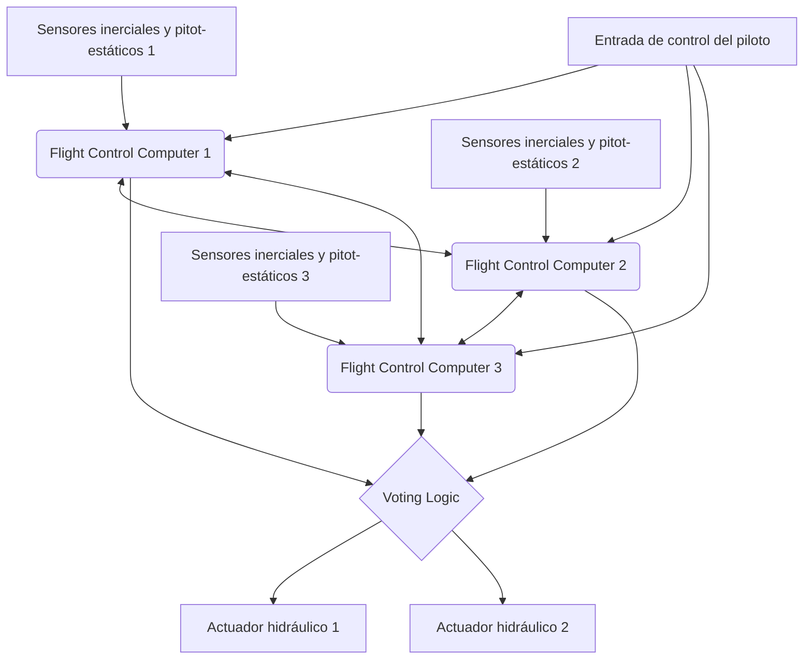

# Introducción: Centros de datos gigantes en el cielo

Los aviones de pasajeros modernos han trascendido en gran medida el marco de ser meros vehículos aerodinámicos, evolucionando hacia "redes de computadoras voladoras gigantes" que operan con sistemas operativos en tiempo real altamente avanzados. En el corazón de esta evolución se encuentra la "Aviónica" (Avionics), que significa electrónica de la aviación, y la tecnología "Fly-By-Wire" (FBW), que controla la aeronave mediante señales eléctricas. En este artículo, desde la perspectiva de la ingeniería aeroespacial y la ingeniería de control, realizaremos una profundización extremadamente detallada y académica sobre la arquitectura y las leyes de control subyacentes a estos sistemas, así como el "conflicto de filosofías de diseño" entrelazado por los dos principales fabricantes de aviones del mundo, Boeing y Airbus.

---

## Capítulo 1: La dinámica del control de vuelo y la revolución de lo hidráulico a lo eléctrico

### El mecanismo de los sistemas de control clásicos y sus limitaciones

El control de movimiento tridimensional para que un avión vuele consta de 3 ejes: cabeceo (inclinación longitudinal: controlado por el elevador), alabeo (inclinación lateral: controlado por los alerones) y guiñada (giro de la nariz hacia la izquierda o derecha: controlado por el timón de dirección). En los aviones de pasajeros desde los albores de la aviación hasta la década de 1960 (por ejemplo, el Boeing 707 y el primer 737), la palanca de mando (volante de control o yugo) en la cabina y las superficies de control en el estabilizador y las alas estaban conectadas directamente por una compleja red de cables físicos de metal, poleas y varillas.

La mayor ventaja de este "sistema de control mecánico" era que resultaba extremadamente simple e intuitivo. Cuando el piloto tiraba de la palanca de mando, esa fuerza movía directamente el elevador a través de los cables, y la resistencia del aire (presión del viento) que golpeaba la superficie de control se retroalimentaba a la palanca como una fuerza de reacción (feel force). Esto permitía a los pilotos sentir directamente con sus manos "cuánta carga aerodinámica está recibiendo la aeronave en este momento".

Sin embargo, a medida que el tamaño de los aviones aumentó y las velocidades de crucero alcanzaron el régimen transónico superior a Mach 0.8, la carga aerodinámica sobre las superficies de control se volvió demasiado enorme para ser movida por la fuerza muscular humana. Para hacer frente a esto, se introdujo el "actuador hidráulico" (Hydraulic Actuator). Al igual que la dirección asistida de un automóvil, la entrada del piloto transmitida por cable abre y cierra una servoválvula hidráulica, y la presión hidráulica de altísima presión de 3000 psi (aproximadamente 210 atmósferas) impulsa el cilindro para mover la superficie de control.

### Los desafíos del control mecánico-hidráulico y la necesidad del Fly-By-Wire

Si bien la introducción de mecanismos hidráulicos hizo posible el control de aeronaves gigantes, aún quedaban varios problemas graves.

1. **Aumento del peso y la complejidad**: Era necesario tender cientos de metros de cables de acero y poleas de un extremo a otro de la aeronave, lo que resultaba en varias toneladas de peso muerto (dead weight). Además, se requerían mecanismos complejos como reguladores de tensión para compensar el estiramiento de los cables y los cambios de tensión debidos a variaciones de temperatura.
2. **Limitaciones para hacer frente a características aerodinámicas no lineales**: Las características aerodinámicas de una aeronave cambian drásticamente a bajas velocidades (durante el despegue y aterrizaje) y a altas velocidades (durante el crucero). En los sistemas mecánicos, estos cambios dinámicos debían abordarse físicamente mediante "sistemas de sensación artificial" (Artificial Feel Systems) con resortes y amortiguadores, o mecanismos de compensación de cabeceo (pitch trim), por lo que era imposible obtener una respuesta de dirección óptima en todas las fases del vuelo.
3. **Obstáculo para la estabilidad estática**: Los aviones convencionales requerían un diseño en el que el centro de gravedad se colocara por delante del centro de presión aerodinámica, y el estabilizador horizontal generara constantemente sustentación hacia abajo, con el fin de tener "estabilidad estática" (Static Stability), de modo que la aeronave intentara volver a su actitud original si el piloto soltaba los controles. Esto generaba una gran resistencia de compensación (Trim Drag) y era un factor importante en el deterioro del consumo de combustible.

Para romper estas limitaciones físicas y aerodinámicas, era necesario "separar" la operación física del piloto del movimiento de las superficies de control. Así es como apareció el "Fly-By-Wire" (FBW), en el que el movimiento de la palanca de control se convierte en señales eléctricas (datos digitales), y una computadora calcula el ángulo de deflexión óptimo de la superficie y envía comandos a los actuadores hidráulicos (o eléctricos) de las superficies móviles.

---

## Capítulo 2: La arquitectura del sistema Fly-By-Wire

El corazón del Fly-By-Wire es una red de computadoras de control de vuelo (Flight Control Computers: FCC) de las que se exige una fiabilidad extrema. El FBW de un avión comercial requiere una fiabilidad asombrosa de "una probabilidad de falla de 10 a la menos 9 (10^-9) por hora" (Catastrophic Failure Rate), es decir, "menos de una falla fatal por cada mil millones de horas de vuelo". El diseño de la arquitectura para lograr esto es la verdadera esencia técnica del FBW.

### Redundancia múltiple (Redundancy) y algoritmos de votación (Voting)

Para poder continuar volando incluso si falla una sola computadora o sensor, el FBW adopta una configuración redundante triple (Triplex) o cuádruple (Quadruplex). Por ejemplo, en el caso del Boeing 777, existen tres Computadoras de Vuelo Primarias (Primary Flight Computers: PFC) (Izquierda, Centro, Derecha), y dado que cada PFC consta a su vez de tres canales de cálculo internos, tiene efectivamente una arquitectura lógica de "3 × 3 = 9 pliegues".

Lo más importante en este sistema redundante es el algoritmo de "Sincronización y Votación" (Synchronization and Voting).
Múltiples computadoras reciben simultáneamente los mismos datos de entrada (cantidad de operación del piloto, velocidad aerodinámica, ángulo de actitud, etc.) y realizan cálculos utilizando las mismas leyes de control. Luego, comparan mutuamente los valores de comando del ángulo de superficie de salida (enlace de datos de canal cruzado).

La base de la lógica de votación es la "Regla de la Mayoría" (Majority Rule). Si de tres computadoras, dos calculan "subir el elevador 5 grados" y una calcula "subir 10 grados", la mayoría de 5 grados se considera correcta, y la computadora cuyo resultado se desvía se desconecta automáticamente de la red (Fail-Silent), permitiendo que las dos restantes continúen con el control (Fail-Operational).

### Eliminación de fallas de causa común mediante disimilitud de hardware y software (Dissimilarity)

Incluso con triple redundancia, si se usa exactamente la misma CPU y exactamente el mismo programa, existe el riesgo de que al encontrarse con un error desconocido (defecto de software) o un error de diseño de hardware (errata), las tres computadoras arrojen "la misma respuesta incorrecta al mismo tiempo". Esto se llama "Falla de modo/causa común" (Common Mode/Cause Failure: CCF).

Para prevenir esto, Boeing y Airbus persiguen la "Disimilitud" (Dissimilarity) hasta el límite.
Por ejemplo, en el Airbus A320, las computadoras principales ELAC (Elevator Aileron Computer) y SEC (Spoiler Elevator Computer) emplean CPU de fabricantes completamente diferentes (por ejemplo, una de la familia Intel y la otra de Motorola). Además, los equipos de desarrollo de software de control están separados física y organizativamente por completo, y utilizan diferentes lenguajes de programación (como Ada y C) y diferentes compiladores para escribir el código por separado a partir del mismo documento de especificaciones de requisitos. Así, se suprime matemáticamente a casi cero la probabilidad de que, si un software tiene un error, el mismo error exista en el otro.

### Bus de datos de aviónica: ARINC 429 y ARINC 664 (AFDX)

La red de comunicación (bus de datos de aviónica) que conecta estos sensores, computadoras y actuadores también ha experimentado su propia evolución.

El estándar durante mucho tiempo desde la década de 1980 ha sido el estándar "ARINC 429". Se trata de un bus en serie unidireccional (símplex) de uno a muchos que utiliza un único cable de par trenzado para transmitir palabras de datos de 32 bits a 100 kbps (o 12,5 kbps). Dado que su estructura es extremadamente simple y determinista (Deterministic), todavía se utiliza en muchos subsistemas en la actualidad.

Sin embargo, en aviones de última generación como el A380, B787 y A350, el volumen de datos de comunicación ha aumentado explosivamente, y el cableado punto a punto como el de ARINC 429 llevó el peso de los cables a su límite. Por lo tanto, se introdujo "ARINC 664 Parte 7 (conocido como AFDX - Avionics Full-Duplex Switched Ethernet)".
AFDX se basa en la tecnología Ethernet (IEEE 802.3) que usamos a diario, pero agrega perfiles para aviones que obligan a una "garantía absoluta de latencia de comunicación" (Bounded Latency) y una "asignación de ancho de banda". Al emplear el concepto de Enlace Virtual (Virtual Link: VL), donde los conmutadores de red (conmutadores AFDX) gestionan estrictamente el ancho de banda para cada flujo de datos, se construye una red Ethernet determinista en la que las colisiones o pérdidas de paquetes no ocurren bajo ninguna circunstancia. Esto ha permitido que cientos de dispositivos se comuniquen en tiempo real a través de redes de alta velocidad de 100 Mbps/1 Gbps.

---

## Capítulo 3: Leyes de control de vuelo (Flight Control Laws)

El mayor beneficio del FBW reside en que, en lugar de convertir directamente la entrada física del piloto (Stick Input) en el ángulo de la superficie (Surface Angle), la computadora interpreta la "intención del piloto sobre cómo quiere mover la aeronave" (Intent) e implementa "Leyes de control" (Control Laws) para calcular el ángulo de superficie óptimo según el estado actual de vuelo (velocidad, altitud, peso, etc.).

### Ley C* (C-star): La revolución en el control de cabeceo

La "Ley C*" (C-star) o su evolución "Ley C*U" se adopta para el control longitudinal (cabeceo) de los aviones de pasajeros más recientes (Boeing 777/787 y Airbus A320 y posteriores).

En los aviones convencionales (o en estado de control directo), la cantidad de tracción sobre la palanca de mando era proporcional al "ángulo del elevador". Sin embargo, a bajas velocidades y a altas velocidades, la respuesta de la aeronave (velocidad de cabeceo o las fuerzas G generadas) es completamente diferente con el mismo ángulo de deflexión.
En contraste, en la ley C*, cuando el piloto mueve la palanca de mando, se interpreta que está ordenando un "valor objetivo compuesto" de la "velocidad de cabeceo" (velocidad angular a la que sube y baja la nariz: q) y la "aceleración vertical" (carga G: Nz).

$$ C^* = K_1 \cdot q + K_2 \cdot N_z $$

(Donde $K_1, K_2$ son ganancias que varían según la velocidad, etc.)

- **A baja velocidad (durante el despegue y el aterrizaje)**: Puesto que es difícil generar fuerza G aerodinámica, la computadora controla la velocidad de la nariz arriba/abajo principalmente retroalimentando la "velocidad de cabeceo (q)".
- **A alta velocidad (durante el crucero)**: Dado que una ligera elevación de la nariz genera una fuerte fuerza G, la computadora controla la superficie móvil retroalimentando principalmente la "aceleración vertical (Nz)" para generar una G constante de acuerdo con la entrada del piloto.

Esto permite a los pilotos obtener unas características de manejo extremadamente estables en las que "si se tira de la palanca de mando en la misma cantidad, la aeronave siempre reaccionará con la misma sensación", independientemente de la velocidad de vuelo.

### Estructura jerárquica a prueba de fallas: Normal, Alterna, Directa

Las aeronaves tienen una jerarquía de degradación (Degradation) de las leyes de control en preparación para la falla de sensores o computadoras. Tomando como ejemplo la nomenclatura de Airbus, la jerarquía es la siguiente:

1. **Ley Normal (Normal Law)**
   El estado en el que todos los sistemas (ADIRU, computadoras, etc.) son normales. Este es el estado en el que son válidas la compensación completa de la sensación de manejo por la ley C* y la "Protección del dominio de vuelo" (Flight Envelope Protection) completa descrita más adelante. El piloto automático también se puede utilizar normalmente.
2. **Ley Alterna (Alternate Law)**
   El estado en el que algunos de los sensores redundantes han fallado y no se pueden obtener datos precisos (por ejemplo, velocidad aerodinámica precisa). La retroalimentación básica de control de actitud (velocidad de cabeceo y alabeo) funciona, pero parte o la totalidad de la protección del dominio de vuelo (como la función de prevención de entrada en pérdida) se desactiva.
3. **Ley Directa (Direct Law)**
   El estado de respaldo final en el que múltiples computadoras y sensores han fallado y no son posibles los cálculos complejos. El FBW se convierte en un simple "cable eléctrico" y el movimiento de la palanca de mando se transmite directamente de manera proporcional al ángulo de la superficie de control (control proporcional). No hay protección de la envolvente de vuelo en absoluto, y la sensación de manejo es exactamente la misma que en un avión clásico (sin embargo, los cambios en la sensibilidad debido a la velocidad son muy pronunciados).

### Protección del dominio de vuelo (Flight Envelope Protection)

Esta es la mayor tecnología de seguridad aportada por el FBW. Las aeronaves tienen un dominio límite dentro del cual pueden volar de forma segura (envolvente). Estos incluyen la velocidad (velocidad de pérdida y número Mach límite), ángulo de alabeo, ángulo de cabeceo, carga G (múltiplo de carga), etc. Cuando la aeronave intenta exceder estos límites, el FBW permite que la computadora intervenga y lo evite.

- **Protección de actitud de cabeceo**: Limita el ángulo de morro arriba para que no exceda de una cierta cantidad (ej. +30 grados) o de morro abajo (ej. -15 grados).
- **Protección del ángulo de alabeo**: Controla los alerones para que el ángulo de alabeo no supere una cierta cantidad (ej. 67 grados).
- **Protección contra pérdida (Alpha Protection)**: Cuando el ángulo de ataque (Angle of Attack: AoA, Alpha) se acerca al límite de pérdida, incluso si el piloto sigue tirando de la palanca de mando, la computadora rechaza una mayor elevación del morro y automáticamente maximiza el empuje del motor (TOGA) para evitar la pérdida.

---

## Capítulo 4: Boeing vs Airbus: Un conflicto decisivo de filosofía de diseño

Al introducir la tecnología FBW, Boeing y Airbus, que dividen la industria de la aviación civil en dos, tienen filosofías de diseño completamente diferentes con respecto al "diseño de la cabina de vuelo y la delegación de autoridad entre el ser humano y la máquina". Este es uno de los debates más fascinantes en la ingeniería aeronáutica moderna.

### Filosofía de Airbus: "Protección absoluta mediante computadora y límites duros"

El A320, que entró en servicio en 1988, es el primer avión de pasajeros FBW totalmente digital del mundo. La filosofía básica de Airbus es que "**Los seres humanos cometen errores. Por lo tanto, la seguridad final debe estar protegida por límites estrictos (hard limits) absolutos calculados por computadora**".

1. **Adopción de palancas laterales (Sidesticks)**:
   Airbus abolió la palanca de control de doble agarre tradicional (yugo) y colocó palancas laterales, como las de un avión de combate, a la izquierda del asiento del capitán y a la derecha del asiento del copiloto. Esto mejoró drásticamente la visibilidad del panel de instrumentos.
2. **Independencia de las palancas**:
   Las palancas laterales del capitán y del copiloto no están conectadas físicamente. Aunque una se opere, la otra palanca no se mueve (en caso de entradas simultáneas, las entradas se suman algebraicamente o se disputa el control con un botón de prioridad).
3. **Protección dura (Hard Envelope Protection)**:
   Mientras la Ley Normal esté activa, no importa si el piloto, ya sea intencionadamente o en estado de pánico, tira de la palanca lateral hasta su límite mecánico, el avión nunca excederá el ángulo de ataque de pérdida ni superará los límites de ángulo de alabeo. Es decir, la computadora tiene la autoridad para "anular (override) y rechazar" las acciones del piloto.

### Filosofía de Boeing: "La decisión final la tiene siempre el piloto (Límites suaves)"

Por otro lado, en el B777 (y posteriormente el B787), el primer avión FBW de Boeing que entró en servicio en 1995, la filosofía subyacente es que "**Bajo cualquier circunstancia, el piloto humano que mejor comprende la situación en el lugar debe tener la autoridad de decisión final**".

1. **Mantenimiento del tradicional volante de control (Yugo)**:
   Boeing no adoptó palancas laterales y mantuvo los yugos convencionales. Incluso en aviones FBW, un mecanismo bajo el piso vincula física (o mediante servos eléctricos) los yugos del asiento del capitán y del copiloto para que se muevan juntos. Esto permite a los pilotos percibir táctil y visualmente las maniobras de la otra parte.
2. **Sistema de sensación artificial (Artificial Feel) y accionamiento inverso (Backdrive)**:
   Incluso mientras el piloto automático pilota la aeronave, los yugos de la cabina se mueven físicamente en consonancia con el movimiento de las superficies de control (las palancas laterales de Airbus no lo hacen). Además, incorpora actuadores que simulan el peso (fuerza de dirección) del movimiento del yugo en función de la velocidad, transmitiendo artificialmente la "respuesta aerodinámica" al piloto.
3. **Protección suave (Soft Envelope Protection)**:
   Los aviones de Boeing también tienen protección contra pérdida y límite de ángulo de alabeo, pero no son una "barrera absoluta". A medida que la aeronave se acerca a sus límites, la palanca de control se vuelve drásticamente más pesada para advertir al piloto, pero si el piloto continúa tirando de la palanca con "aún más fuerza (por ejemplo, unos 22,5 kg o más)", es posible "ignorar (Override)" los límites establecidos por el sistema y realizar maniobras más allá de los límites. Esto se basa en la idea de que "en situaciones extremas no anticipadas por la computadora, como la evasión de un misil o una colisión con el terreno, el piloto debe conservar la autoridad para tomar maniobras evasivas incluso si ello conlleva dañar el avión".

Esta diferencia de filosofías sobre si "confiar en la máquina o confiar en los humanos" se sigue manifestando como una diferencia fundamental en el diseño de las cabinas de mando de ambas compañías hasta el día de hoy.

---

## Capítulo 5: Fusión de sensores y aterrizaje automático (Autoland)

La sofisticación de los sistemas FBW fue esencial para realizar el aterrizaje automático completo (Autoland) en conjunción con el Sistema de Aterrizaje por Instrumentos (ILS) o el Sistema de Aterrizaje GLS basado en GPS. La tecnología capaz de lograr un aterrizaje suave en la línea central de la pista de una aeronave de varios cientos de toneladas, transportando a cientos de pasajeros en condiciones de visibilidad casi nula por niebla densa (Categoría IIIb/IIIc), es el cenit de la ingeniería de control.

### Los sensores que captan el espacio (ADIRU)

Para un control preciso, es necesario saber con una exactitud extrema en qué punto del espacio se encuentra el avión, en qué actitud y cómo se mueve. Esto recae en la "Air Data Inertial Reference Unit (ADIRU: Unidad de Referencia Inercial y de Datos del Aire)".

- **Datos de aire (Air Data)**: A través del tubo Pitot (que mide la presión dinámica), el orificio estático (que mide la presión estática) y un sensor de temperatura instalados en el exterior del fuselaje, se calcula la velocidad aerodinámica (Airspeed), la altitud (Altitude), el número de Mach y el ángulo de ataque (AoA).
- **Sistema de Referencia Inercial (IRS: Inertial Reference System)**: Detecta la velocidad angular y la aceleración en los 3 ejes de la aeronave con gran precisión utilizando un giroscopio láser de anillo (RLG) o un giroscopio de fibra óptica (FOG), y al integrarlos calcula de forma autónoma la actitud del avión (cabeceo, alabeo y guiñada) y sus coordenadas absolutas sobre la Tierra (latitud, longitud).

En la aviónica moderna, estos datos de ADIRU se integran (fusión de sensores) con las señales del GPS (GNSS) utilizando filtros como el de Kalman, para corregir continuamente el error de deriva y obtener soluciones de navegación precisas que van de los centímetros a metros.

### El bucle de control del aterrizaje automático, Flare y Rollout

Durante el aterrizaje automático mediante ILS, las antenas de la aeronave reciben las ondas del localizador (línea central de la pista) y del glideslope o senda de planeo (ángulo de descenso de unos 3 grados) emitidas desde tierra, y el FCC aplica un control de retroalimentación para mantener a la aeronave centrada en los haces de las ondas de radio.

1. **Fase de aproximación (Approach Phase)**:
   A una altitud de aproximadamente 1500 pies, se activan los tres sistemas de piloto automático y se pone en marcha la lógica de mayoría (estado Fail-Operational). El cabeceo y el alabeo se reajustan continuamente para hacer que la señal de error del ILS sea nula.
2. **Ángulo de deriva o cangrejo (Crab Angle) y corrección del viento cruzado**:
   Si hay viento lateral, la aeronave desciende en una actitud oblicua con el morro apuntando hacia barlovento (actitud de cangrejo).
3. **Decrab (Alineación) y Flare (Recogida)**:
   Cuando el radioaltímetro (Radio Altimeter) detecta una altitud de aproximadamente 50 pies, el piloto automático pasa automáticamente al "Modo Flare". El morro se levanta ligeramente para reducir la tasa de descenso (normalmente a unos 150 pies por minuto) y atenuar el impacto del aterrizaje. Simultáneamente, si hay viento lateral, se acciona el timón de dirección para alinear el morro hacia la pista (Decrab) y se aplican los alerones para inclinar las alas hacia el lado del viento e iniciar el contacto en tierra desde el tren principal de barlovento. Este complejo control multivariable es ejecutado por la computadora con una precisión de milisegundos imposible para un ser humano.
4. **Carrera de aterrizaje (Rollout)**:
   Incluso después de tocar tierra, el piloto automático sigue persiguiendo la señal del localizador, controlando automáticamente el timón de dirección y la dirección de la rueda de morro para desacelerar el avión manteniéndolo recto sobre la línea central de la pista. Simultáneamente, la computadora también administra el despliegue automático de los spoilers y el frenado con el autobrake a una tasa de deceleración constante.

---

## Capítulo 6: El futuro de la aviónica y el vuelo autónomo

El FBW y la aviónica continúan evolucionando a un ritmo rápido y están a punto de cambiar drásticamente el panorama de la próxima generación de la industria de la aviación.

### Aviónica Modular Integrada (IMA: Integrated Modular Avionics)

En las aeronaves tradicionales, se instalaba una computadora especializada e independiente (LRU: Line Replaceable Unit) para cada función, como el piloto automático, el sistema de gestión de vuelo (FMS), el control del tren de aterrizaje, el control del aire acondicionado, etc. Sin embargo, esto generaba ineficiencias en peso, consumo de energía y costo.
Los aviones modernos, como el B787 y el A350, utilizan una arquitectura de "Aviónica Modular Integrada (IMA)". Esta consiste en la colocación de varios Módulos de Computación Común (CCM), similares a los servidores blade de alto rendimiento y uso general en el interior de la aeronave, sobre los cuales se ejecuta un sistema operativo de tiempo real (RTOS) basado en el estándar ARINC 653. Gracias a la tecnología de "Particionamiento Espacial y Temporal (Time and Space Partitioning)" del RTOS, se hizo posible el aislamiento completo y la ejecución simultánea del "software crítico de control de vuelo" y del "software de control de entretenimiento a bordo" en las mismas CPU y memoria. Esto ha dado como resultado reducciones drásticas del hardware y aligeramiento.

### Fly-By-Light y Electrificación (More Electric Aircraft)

Como evolución del bus de datos, se está investigando el "Fly-By-Light (FBL)", que reemplaza los cables de cobre por fibra óptica. Además de ser extremadamente ligera y de ancho de banda ultragrande, la fibra óptica es completamente inmune a los impactos de rayos (Lightning Strike) y a las fuertes interferencias electromagnéticas (EMI / EMP), lo que la convierte en una propiedad muy ventajosa para las aeronaves.

Por otro lado, a través del concepto "More Electric Aircraft (Aeronaves más eléctricas: MEA)", se ha iniciado la transición desde los pesados sistemas convencionales de tuberías hidráulicas hacia los "Actuadores Electromecánicos (EMA)" que mueven las superficies de control directamente mediante motores, y hacia los "Actuadores Electrohidrostáticos (EHA)" que contienen una bomba hidráulica independiente dentro del propio actuador (ya en uso en los sistemas de reserva del A380 y B787). Esto disminuye el riesgo de pérdida total del sistema debido a fugas hidráulicas, y mejora aún más la eficiencia de combustible.

### Introducción de la IA, la operación con un solo piloto (SPO) y el vuelo completamente autónomo

Como futuro definitivo, se está debatiendo la introducción de Inteligencia Artificial (IA) y aprendizaje automático en la aviónica. Los sistemas FBW actuales funcionan estrictamente basados en "Lógica determinista programada por humanos (Deterministic Logic)", pero se está investigando el Control Adaptativo (Adaptive Control), a través del cual la IA aprende y reconstruye instantáneamente nuevas leyes de control para mantener el vuelo ante condiciones meteorológicas complejas o daños estructurales imprevistos.

Además, como medida ante la escasez de pilotos, conceptos para reducir la operación comercial de pasajeros, que actualmente requiere de dos personas (capitán y copiloto), a un sistema de una sola persona (Single Pilot Operations: SPO) al menos durante la fase de crucero, delegando el papel del copiloto a sistemas de aviónica autónoma de vanguardia u operadores remotos en tierra, se están probando de manera seria (como el eMCO) impulsados por empresas como Airbus. Es posible que el resultado final del Fly-By-Wire sea el "avión comercial completamente autónomo", donde el piloto humano desaparezca por completo de la cabina.

---

## Conclusión

El "Fly-By-Wire" no es simplemente la tecnología de reemplazar cables por hilos eléctricos. Es un cambio de paradigma que liberó a los aviones de las restricciones aerodinámicas y los transformó en un "Sistema de sistemas volador" que reúne lo mejor de la ingeniería de control, la tecnología de la información y la tecnología de redes.
Como lo demuestran las diferencias en las filosofías de diseño de Boeing y Airbus, siempre hay una pregunta fundamental latente: "¿Cuál es el papel del ser humano?". A medida que la IA y la autonomía continúan progresando, la tecnología de aviónica seguirá sosteniendo nuestros viajes por el cielo, haciéndolos más seguros, más eficientes y más silenciosos.

## Apéndice: Modelado matemático y Funciones de Transferencia del Fly-By-Wire

Para profundizar en la comprensión académica del sistema FBW, agregaremos una explicación sobre el modelo de diagrama de bloques del control de retroalimentación y la función de transferencia básica en el movimiento longitudinal (eje de cabeceo) de la aeronave.

### Modelo de las características dinámicas de la aeronave (Modo de Período Corto)

El movimiento longitudinal de la aeronave se descompone principalmente en dos modos: el modo de período corto (Short Period Mode) y el modo de período largo (Modo Fugóide o Phugoid Mode). Lo que la ley C* y el control de régimen de cabeceo del FBW amortiguan y estabilizan de manera directa es este "modo de período corto".

La función de transferencia desde el ángulo del elevador $\delta_e$ hasta la velocidad de cabeceo $ への伝達関数 (s) = \frac{q(s)}{\delta_e(s)}$ se aproxima de la siguiente manera a partir de las ecuaciones generales de movimiento de cuerpo rígido linealizadas.

\frac{q(s)}{\delta_e(s)} = \frac{K_q(T_{\theta_2}s + 1)}{s^2 + 2\zeta_{sp}\omega_{sp}s + \omega_{sp}^2}

Donde:
- $ es la ganancia de estado estacionario de control (depende en gran medida de la velocidad y la presión dinámica)
- {\theta_2}$ es la constante de tiempo de retardo de fase del movimiento de cabeceo y el cambio de la trayectoria de vuelo (Flight Path)
- $\zeta_{sp}$ es la relación de amortiguamiento (Damping Ratio) del modo de período corto
- $\omega_{sp}$ es la frecuencia angular natural (Natural Frequency) del modo de período corto

En los sistemas de control mecánico convencionales, a gran altitud o a alta velocidad, la amortiguación aerodinámica disminuía y existía el problema de que $\zeta_{sp}$ se volvía muy pequeña (la aeronave era propensa a oscilar en el eje de cabeceo).

### Mejora de las características mediante control de retroalimentación

En el sistema FBW, la velocidad de cabeceo $ y la aceleración vertical $ medidas por los sensores giroscópicos (ADIRU) se retroalimentan a la computadora, y se calcula el error $ con respecto al valor de comando del piloto {cmd}$ (o ^*_{cmd}$).

Al considerar la función de transferencia de lazo cerrado cuando se introduce el control de retroalimentación de la velocidad de cabeceo más básico (Control Proporcional-Integral: Control PI). Si la función de transferencia del controlador (Controller) es (s) = K_p + \frac{K_i}{s}$, el comando de ángulo de timón $\delta_c$ enviado por el controlador es:

 \delta_c(s) = C(s) \left( q_{cmd}(s) - q_{sensor}(s) \right) 

Al multiplicar esto por la característica de retardo de primer orden del actuador hidráulico (s) = \frac{1}{\tau_a s + 1}$, se obtiene el ángulo de timón real $\delta_e$.

Al establecer mediante programación de ganancias (Gain Scheduling) las ganancias adecuadas , K_i$ para los polos (Poles) de la ecuación característica (polinomio denominador de la función de transferencia de lazo cerrado del sistema completo {closed}(s) = \frac{q(s)}{q_{cmd}(s)}$), se logra la $\zeta$ (generalmente alrededor de 0,7) y $\omega_n$ óptimos en cualquier rango de velocidad. Por esto, sin importar el tamaño físico de la cola o la posición del centro de gravedad, siempre es posible emular en el software las características de pilotaje de un "avión ideal". Esta es la esencia matemática de la "Estabilidad artificial (Artificial Stability)" proporcionada por el FBW.
