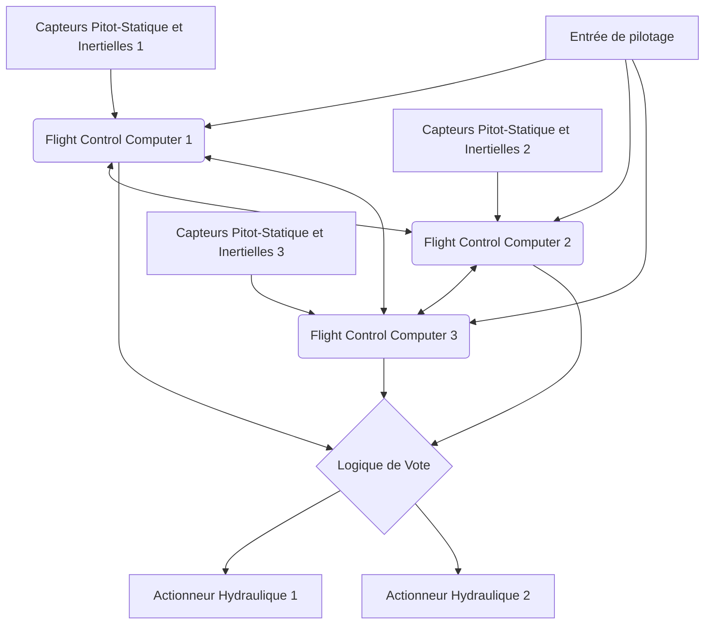

# Introduction : Le centre de données géant volant

Les avions de ligne modernes d'aujourd'hui ont largement dépassé le cadre de simples véhicules aérodynamiques, évoluant vers un « réseau géant d'ordinateurs volants » fonctionnant sur des systèmes d'exploitation temps réel sophistiqués. Au cœur de cela se trouvent l'« Avionique » (Avionics, électronique aéronautique) et la technologie « Fly-By-Wire (FBW) » (Commandes de vol électriques), qui contrôle l'avion par des signaux électriques. Cet article explore de manière extrêmement détaillée et académique les architectures sous-jacentes, les lois de commande (Control Laws), ainsi que le « conflit de philosophies de conception » entre les deux plus grands constructeurs aéronautiques mondiaux, Boeing et Airbus, du point de vue de l'ingénierie aérospatiale et de l'ingénierie de contrôle.

---

## Chapitre 1 : La dynamique de pilotage des avions et la révolution de l'hydraulique vers l'électrique

### Les mécanismes des systèmes de commandes de vol classiques et leurs limites

Le contrôle de mouvement tridimensionnel d'un avion pour voler est composé de trois axes : le tangage (pitch, inclinaison longitudinale : contrôlé par la gouverne de profondeur/elevator), le roulis (roll, inclinaison latérale : contrôlé par les ailerons) et le lacet (yaw, pivotement de gauche à droite du nez : contrôlé par la gouverne de direction/rudder). Des débuts de l'aviation jusqu'aux années 1960 environ, sur les avions de ligne à réaction (comme le Boeing 707 et les premiers 737), le manche à balai du cockpit (control wheel ou yoke) et les gouvernes (control surfaces) de l'empennage et des ailes principales étaient directement reliés par un réseau physique complexe de câbles métalliques, de poulies et de bielles (rods).

Le plus grand avantage de ce « système de commande mécanique » était sa simplicité extrême et son aspect intuitif. Lorsque le pilote tirait sur le manche, cette force actionnait directement la gouverne de profondeur via des câbles, et la résistance de l'air (pression dynamique) sur les gouvernes était renvoyée (feedback) au manche sous forme de force de réaction (feel force). Ainsi, le pilote pouvait ressentir directement dans ses mains « la charge aérodynamique subie par l'avion ».

Cependant, au fur et à mesure que la taille des avions devenait gigantesque et que leur vitesse de croisière atteignait la zone transsonique, dépassant Mach 0,8, les charges aérodynamiques appliquées aux gouvernes devinrent si importantes qu'elles ne pouvaient plus être déplacées par la seule force musculaire humaine. Pour résoudre ce problème, les « Actionneurs hydrauliques (Hydraulic Actuators) » ont été introduits. De la même manière que la direction assistée d'une voiture, l'entrée du pilote, transmise par des câbles, ouvre ou ferme une servovalve hydraulique, et la très haute pression hydraulique de 3000 psi (environ 210 bars) actionne un cylindre pour déplacer les gouvernes.

### Les défis du contrôle hydro-mécanique et l'inévitabilité du Fly-By-Wire

Bien que l'introduction de mécanismes hydrauliques ait rendu possible le pilotage d'avions géants, plusieurs défis majeurs persistaient.

1. **Augmentation du poids et de la complexité** : Il était nécessaire d'étirer des centaines de mètres de câbles d'acier et de poulies d'un bout à l'autre de l'avion, ce qui représentait des tonnes de poids mort. De plus, des mécanismes complexes tels que des régulateurs de tension pour compenser l'élongation des câbles et les variations de tension dues aux changements de température étaient requis.
2. **Limites de la gestion des caractéristiques aérodynamiques non linéaires** : Les caractéristiques aérodynamiques de l'avion changent radicalement entre basse vitesse (décollage/atterrissage) et haute vitesse (croisière). Avec un système mécanique, il fallait compenser physiquement ces variations dynamiques à l'aide de ressorts et d'amortisseurs via un « Système de sensation artificielle (Artificial Feel System) » ou des mécanismes de compensation (trim) de tangage, ce qui rendait impossible l'obtention d'une réponse de direction optimale dans tous les régimes de vol.
3. **Entrave à la stabilité statique** : Les avions conventionnels devaient avoir leur centre de gravité placé devant le centre de poussée aérodynamique, de sorte que le stabilisateur horizontal génère toujours une portance vers le bas, pour avoir une « Stabilité statique (Static Stability) » permettant à l'avion de reprendre sa position d'origine même si le pilote lâche les commandes. Cela créait une traînée de compensation (Trim Drag) importante, qui était un facteur majeur de dégradation de l'efficacité énergétique.

Pour surmonter ces limites physiques et aérodynamiques, il est devenu nécessaire de « déconnecter » les mouvements physiques du pilote des mouvements des gouvernes. C'est ainsi qu'est apparu le « Fly-By-Wire (FBW) », qui convertit le mouvement du manche en signaux électriques (données numériques), laisse les ordinateurs calculer l'angle de braquage optimal des gouvernes, et envoie ensuite les commandes aux actionneurs hydrauliques (ou électriques).

---

## Chapitre 2 : L'architecture des systèmes Fly-By-Wire

Le cœur du Fly-By-Wire est le réseau des ordinateurs de commandes de vol (Flight Control Computers : FCC), dont une fiabilité extrême est exigée. Dans le FBW d'un avion de ligne, on exige une fiabilité incroyable de « probabilité de défaillance catastrophique de 10 à la puissance moins 9 (10^-9) par heure », c'est-à-dire « moins d'une panne fatale par milliard d'heures de vol ». La conception architecturale permettant d'atteindre cet objectif est l'essence technologique du FBW.

### Redondance multiple (Redundancy) et Algorithme de vote (Voting)

Afin que l'avion puisse continuer à voler même en cas de panne d'un ordinateur ou d'un capteur, le FBW adopte une architecture redondante triple (Triplex) ou quadruple (Quadruplex). Par exemple, sur le Boeing 777, il y a 3 systèmes de calculateurs de vol primaires (Primary Flight Computer, PFC) (Gauche, Centre, Droit), et chaque PFC est lui-même composé de 3 canaux de calcul, ce qui crée de facto une architecture logique à « 3 × 3 = 9 redondances ».

L'algorithme de « Synchronisation et Vote (Synchronization and Voting) » est le plus important dans ce système redondant.
Plusieurs ordinateurs reçoivent les mêmes données d'entrée simultanément (la quantité de manipulation du pilote, la vitesse anémométrique, l'angle d'attitude, etc.) et effectuent les mêmes calculs à l'aide des mêmes lois de commande. Ensuite, ils comparent mutuellement les valeurs de commande d'angle des gouvernes en sortie (liaison de données inter-canaux).

La base de la logique de vote est la « Règle de la majorité (Majority Rule) ». Si, parmi trois ordinateurs, deux calculent qu'il faut « lever la gouverne de profondeur de 5 degrés » et qu'un seul calcule « la lever de 10 degrés », la majorité de 5 degrés est considérée comme correcte, et l'ordinateur qui s'écarte du résultat est automatiquement déconnecté du réseau (Fail-Silent), permettant aux deux autres de continuer à contrôler l'appareil (Fail-Operational).

### L'élimination des défaillances de cause commune par des matériels et logiciels dissimilaires (Dissimilarity)

Même avec une redondance triple, si on utilise exactement le même processeur (CPU) et exactement le même programme, il y a un risque que les 3 ordinateurs produisent « simultanément la même mauvaise réponse » s'ils rencontrent un bug spécifique inconnu (défaut logiciel) ou une erreur de conception matérielle (errata). C'est ce qu'on appelle la « Défaillance de mode/cause commun (Common Mode/Cause Failure : CCF) ».

Pour éviter cela, Boeing et Airbus ont poussé la « Conception dissimilaire (Dissimilarity) » à l'extrême.
Par exemple, sur l'Airbus A320, les ordinateurs principaux ELAC (Elevator Aileron Computer) et SEC (Spoiler Elevator Computer) utilisent des processeurs de fabricants totalement différents (par exemple, l'un d'origine Intel, l'autre d'origine Motorola). De plus, les équipes de développement des logiciels de commande sont complètement séparées physiquement et organisationnellement, utilisant des langages de programmation différents (comme Ada et C) et des compilateurs différents pour écrire le code séparément à partir du même cahier des charges. Ainsi, la probabilité que le même bug se trouve dans l'autre logiciel si l'un d'eux contient un bug est mathématiquement maintenue à presque zéro.

### Le bus de données avionique : ARINC 429 et ARINC 664 (AFDX)

Le réseau de communication qui relie ces capteurs, ordinateurs et actionneurs (le bus de données avionique) a également connu une évolution unique.

La norme « ARINC 429 » est restée la norme standard pendant longtemps à partir des années 1980. Il s'agit d'un bus série unidirectionnel (simplex) point-à-multipoint qui transmet des mots de données de 32 bits à 100 kbps (ou 12,5 kbps) sur un seul câble à paire torsadée. Étant donné que sa structure est extrêmement simple et déterministe (Deterministic), il est encore utilisé aujourd'hui dans de nombreux sous-systèmes.

Cependant, dans les avions de dernière génération comme l'A380, le B787 et l'A350, le volume de données de communication a explosé, et le poids des câbles du câblage point à point (Point-to-Point) de l'ARINC 429 a atteint ses limites. C'est pourquoi la norme « ARINC 664 Partie 7 (connue sous le nom de AFDX - Avionics Full-Duplex Switched Ethernet) » a été introduite.
L'AFDX est basé sur la technologie Ethernet (IEEE 802.3) que nous utilisons quotidiennement, mais il ajoute des profils spécifiques pour les aéronefs qui imposent une « garantie de latence absolue (Bounded Latency) » et une « allocation de bande passante ». En utilisant le concept de Liens Virtuels (Virtual Link : VL), les commutateurs réseau (commutateurs AFDX) gèrent strictement la bande passante pour chaque flux de données, ce qui permet de construire un réseau Ethernet déterministe où aucune collision ou perte de paquets ne peut jamais se produire. En conséquence, des centaines d'équipements peuvent communiquer en temps réel sur des réseaux rapides de 100 Mbps/1 Gbps.

---

## Chapitre 3 : Les lois de commandes de vol (Flight Control Laws)

Le plus grand avantage du FBW est qu'il ne convertit pas directement l'entrée de pilotage physique (Stick Input) du pilote en un angle de gouverne (Surface Angle), mais qu'il permet d'implémenter des « Lois de commande (Control Laws) » dans lesquelles l'ordinateur interprète l'« intention (Intent) de la façon dont le pilote veut déplacer l'avion » et calcule l'angle de braquage optimal en fonction des conditions de vol actuelles (vitesse, altitude, poids, etc.).

### La loi C* (C-star) : La révolution du contrôle en tangage

Les avions de ligne modernes (depuis les Boeing 777/787 et Airbus A320) adoptent la « loi de commande C* (C-star) » ou son évolution « C*U » pour le contrôle longitudinal (tangage).

Dans les avions conventionnels (ou en état de loi directe), l'amplitude avec laquelle le pilote tirait le manche était proportionnelle à « l'angle de la gouverne de profondeur ». Cependant, avec le même angle de gouverne, la réaction de l'avion (vitesse de tangage et force G générée) est complètement différente à basse et à haute vitesse.
En revanche, avec la loi C*, lorsque le pilote déplace le manche, l'ordinateur interprète qu'il « commande une valeur cible combinée » de « taux de tangage (vitesse angulaire du nez qui monte ou descend : q) » et d'« accélération verticale (Charge G : Nz) ».

$$ C^* = K_1 \cdot q + K_2 \cdot N_z $$

(Ici, $K_1, K_2$ sont des gains qui varient en fonction de la vitesse et d'autres paramètres)

- **À basse vitesse (décollage, atterrissage, etc.)** : Les forces aérodynamiques G étant difficiles à générer, l'ordinateur rétroagit (feedback) principalement sur le « taux de tangage (q) » pour contrôler la vitesse à laquelle le nez monte ou descend.
- **À haute vitesse (croisière)** : Relever légèrement le nez génère de forts G, l'ordinateur rétroagit donc principalement sur « l'accélération verticale (Nz) » pour contrôler les gouvernes de sorte à générer une accélération G constante correspondant à l'entrée du pilote.

Ainsi, quelle que soit la vitesse de vol, le pilote peut obtenir des caractéristiques de maniabilité extrêmement stables : « En tirant le manche de la même quantité, l'avion réagit toujours avec la même sensation ».

### Structure hiérarchique Fail-safe : Normal, Alternate, Direct

Les avions disposent d'une hiérarchie de dégradation (Degradation) des lois de commande en cas de panne de capteurs ou d'ordinateurs. En prenant la terminologie d'Airbus comme exemple, la hiérarchie est la suivante :

1. **Loi Normale (Normal Law)**
   Tous les systèmes (ADIRU, ordinateurs, etc.) sont dans un état normal. La correction complète de la sensation de pilotage par la loi C* et la « Protection de l'enveloppe de vol (Flight Envelope Protection) » complète décrite ci-dessous sont actives. Le pilote automatique peut également être utilisé normalement.
2. **Loi Alternative (Alternate Law)**
   Certains capteurs redondants sont en panne, et il n'est plus possible d'obtenir des données certaines (par exemple, une vitesse anémométrique précise). Les rétroactions de base pour le contrôle d'attitude (taux de tangage et taux de roulis) fonctionnent, mais certaines ou toutes les protections de l'enveloppe de vol (telles que la protection contre le décrochage) sont désactivées.
3. **Loi Directe (Direct Law)**
   L'état de secours final où de nombreux ordinateurs et capteurs ont échoué, rendant les calculs complexes impossibles. Le FBW devient un simple « câble électrique », et le mouvement du manche est transmis directement de façon proportionnelle à l'angle de la gouverne (contrôle proportionnel). Il n'y a aucune protection de l'enveloppe de vol et la sensation de pilotage est exactement la même que celle d'un avion classique (bien que les changements de sensibilité dus à la vitesse soient pleinement ressentis).

### La protection de l'enveloppe de vol (Flight Envelope Protection)

C'est la plus grande technologie de sécurité apportée par le FBW. Un avion possède des limites (une enveloppe) dans lesquelles il peut voler en toute sécurité. Cela inclut la vitesse (vitesse de décrochage et nombre de Mach limite), l'angle d'inclinaison latérale (bank angle), l'angle de tangage, et la charge G (facteur de charge). Le FBW empêche l'avion de dépasser ces limites : lorsque l'appareil tente d'aller au-delà, l'ordinateur intervient pour l'en empêcher.

- **Protection d'assiette en tangage** : Limite l'angle de cabré (ex. : +30 degrés) ou de piqué (ex. : -15 degrés) pour ne pas dépasser un certain seuil.
- **Protection d'angle d'inclinaison** : Contrôle les ailerons pour que l'angle de roulis ne dépasse pas un certain niveau (ex. : 67 degrés).
- **Protection contre le décrochage (Alpha Protection)** : Lorsque l'angle d'attaque (Angle of Attack : AoA, Alpha) s'approche de la limite de décrochage, même si le pilote continue à tirer sur le manche, l'ordinateur refuse d'augmenter davantage le cabré, et la poussée des moteurs est automatiquement augmentée au maximum (TOGA) pour éviter le décrochage.

---

## Chapitre 4 : Boeing vs Airbus : Un conflit décisif sur la philosophie de conception

Dans l'introduction de la technologie FBW, Boeing et Airbus, qui divisent l'industrie de l'aviation commerciale, ont des philosophies de conception complètement différentes concernant « la conception du cockpit et la délégation d'autorité entre l'homme et la machine ». C'est l'un des débats les plus intéressants de l'ingénierie aéronautique moderne.

### La philosophie d'Airbus : « Protection absolue et limites matérielles par l'ordinateur »

L'A320, mis en service en 1988, fut le premier avion de ligne FBW entièrement numérique au monde. La philosophie fondamentale d'Airbus est que « **Les humains font des erreurs. Par conséquent, la sécurité ultime doit être protégée par des limites strictes (Hard limits, restrictions absolues) calculées par l'ordinateur** ».

1. **Adoption du minimanche latéral (Side stick)** :
   Airbus a aboli le traditionnel manche à balai à deux mains (Yoke) et a placé un joystick de type avion de chasse (side stick) du côté gauche du siège du commandant de bord et du côté droit du siège du copilote. Cela a considérablement amélioré la visibilité du tableau de bord.
2. **Indépendance des manches** :
   Les minimanches du commandant de bord et du copilote ne sont pas liés physiquement. Si l'un des pilotes manipule son manche, l'autre manche ne bouge pas (en cas de double entrée, les signaux sont additionnés algébriquement, ou l'un d'eux prend la priorité via un bouton dédié).
3. **Protection matérielle (Hard Envelope Protection)** :
   Tant que la loi Normale est active, que ce soit intentionnellement ou dans un état de panique, même si le pilote tire le minimanche jusqu'à sa limite de butée, l'avion ne dépassera absolument jamais l'angle d'attaque de décrochage et ne dépassera pas la limite de l'angle d'inclinaison. En d'autres termes, « l'ordinateur a l'autorité d'outrepasser (rejeter, override) les actions du pilote ».

### La philosophie de Boeing : « L'autorité de décision finale appartient toujours au pilote (Soft Limits) »

D'autre part, le B777 (et plus tard le B787), le premier avion FBW mis en service par Boeing en 1995, maintient la philosophie selon laquelle « **Quelle que soit la situation, le pilote humain, qui appréhende le mieux la situation sur le terrain, doit avoir l'autorité finale de décision** ».

1. **Maintien du manche de contrôle traditionnel (Yoke)** :
   Boeing n'a pas adopté le minimanche latéral et a conservé le volant (Yoke) traditionnel. Même sur un avion FBW, le manche du siège du commandant de bord et celui du copilote sont physiquement (ou par des servos électriques) liés pour se déplacer de manière synchrone grâce à un mécanisme sous le plancher. Ainsi, les pilotes peuvent reconnaître tactilement et visuellement les actions de l'autre.
2. **Mécanisme de sensation artificielle (Artificial Feel) et rétro-entraînement (Backdrive)** :
   Même lorsque le pilote automatique pilote l'avion, les manches dans le cockpit bougent physiquement de concert avec les gouvernes (les minimanches d'Airbus, eux, restent fixes). De plus, un actionneur simulant la lourdeur (force de direction) nécessaire pour bouger le manche en fonction de la vitesse est intégré, transmettant de manière artificielle au pilote un « retour aérodynamique ».
3. **Protection logicielle (Soft Envelope Protection)** :
   Les avions de Boeing disposent également d'une protection contre le décrochage et d'une limite d'angle de roulis, mais ce ne sont pas des « murs absolus ». Lorsque l'avion s'approche des limites, le manche devient drastiquement plus lourd pour avertir le pilote, mais si ce dernier continue de tirer sur le manche avec « une force plus grande (par exemple, une force de plus de 22,5 kg environ) », il peut « outrepasser (Override) » les limites de réglage du système et effectuer des manœuvres au-delà des limites. Ceci est fondé sur l'idée que « Dans des situations extrêmes non prévues par l'ordinateur, comme l'évitement de missiles ou de collisions avec le relief, le pilote doit conserver le droit de prendre des mesures d'évitement, même si cela risque d'endommager la structure de l'aéronef ».

Cette différence de philosophie, « Faire confiance à la machine ou faire confiance à l'humain », continue de se manifester comme une différence fondamentale dans la conception du cockpit des deux compagnies jusqu'à ce jour.

---

## Chapitre 5 : Fusion de capteurs et Atterrissage automatique (Autoland)

L'évolution sophistiquée des systèmes FBW a été essentielle pour la réalisation d'un atterrissage entièrement automatique (Autoland) connecté au système d'atterrissage aux instruments (ILS) ou au GLS (GBAS Landing System) basé sur le GPS. Faire atterrir en douceur un avion de plusieurs centaines de tonnes, transportant des centaines de passagers, sur la ligne médiane d'une piste dans des conditions de visibilité quasi nulle à cause du brouillard (conditions Cat IIIb/IIIc) représente le summum de l'ingénierie du contrôle.

### Les capteurs appréhendant l'espace (ADIRU)

Pour un contrôle précis, il est nécessaire de connaître avec une extrême précision où l'avion se trouve dans l'espace, son attitude et comment il se déplace. L'équipement chargé de cela est l'« ADIRU (Air Data Inertial Reference Unit : Centrale de données aérodynamiques et inertielles) ».

- **Données aérodynamiques (Air Data)** : La vitesse anémométrique (Airspeed), l'altitude (Altitude), le nombre de Mach et l'angle d'attaque (AoA) sont calculés grâce à des tubes de Pitot (mesurant la pression dynamique), des prises statiques (mesurant la pression statique) et des capteurs de température, tous installés à l'extérieur de l'appareil.
- **Référence inertielle (IRS : Inertial Reference System)** : Des gyrolasers (RLG) et des gyromètres à fibre optique (FOG) détectent avec une grande précision la vitesse angulaire et l'accélération sur les 3 axes de l'avion, et en les intégrant, calculent de manière autonome l'attitude de l'avion (tangage, roulis, lacet) ainsi que ses coordonnées absolues (latitude/longitude) sur la Terre.

Dans l'avionique moderne, les données de ces ADIRU sont fusionnées avec les signaux GPS (GNSS) en utilisant des filtres de Kalman et d'autres algorithmes (Sensor Fusion) pour corriger en permanence les erreurs de dérive, obtenant ainsi une solution de navigation d'une précision allant de quelques centimètres à quelques mètres.

### La boucle de contrôle de l'atterrissage automatique, l'Arrondi (Flare) et le Déroulement (Rollout)

Lors d'un atterrissage automatique utilisant l'ILS, les antennes de bord reçoivent l'onde du localizer (axe de la piste) et du glide slope (angle de descente d'environ 3 degrés) émises depuis le sol, et le FCC effectue un contrôle par rétroaction (feedback) pour placer l'avion au centre du faisceau de l'onde.

1. **Phase d'approche (Approach Phase)** :
   À une altitude d'environ 1500 pieds, les 3 systèmes de pilotes automatiques sont tous engagés, et la logique de vote majoritaire devient active (état Fail-Operational). Le tangage et le roulis sont ajustés de manière continue pour annuler les erreurs des signaux ILS.
2. **Angle de crabe (Crab Angle) et compensation du vent de travers** :
   S'il y a du vent de travers, l'avion descend dans une posture asymétrique, le nez orienté au vent (posture en crabe).
3. **Décrabage (Decrab) et Arrondi (Flare)** :
   Lorsque le radioaltimètre (Radio Altimeter) détecte une altitude d'environ 50 pieds, le pilote automatique passe automatiquement en « mode Flare (arrondi) ». Il relève légèrement le nez et réduit le taux de descente (généralement autour de 150 fpm) pour adoucir le choc au moment du toucher des roues. Simultanément, s'il y a du vent de travers, il agit sur la gouverne de direction pour aligner le nez avec l'axe de la piste (décrabage), et applique les ailerons pour imposer un angle de roulis empêchant l'avion d'être poussé par le vent, forçant le contact initial sur le train principal du côté vent. L'ordinateur exécute ce contrôle multivariable complexe impliquant de nombreux paramètres avec une précision de l'ordre de la milliseconde, ce qui est impossible pour un humain.
4. **Déroulement (Rollout)** :
   Même après le toucher des roues, le pilote automatique continue de suivre le signal du localizer, contrôlant automatiquement la gouverne de direction et l'orientation de la roulette de nez (Nosewheel Steering) pour décélérer droit sur la ligne médiane de la piste. Parallèlement, le déploiement automatique des spoilers et le freinage par le système d'autobrake à un taux de décélération constant sont également gérés par l'ordinateur.

---

## Chapitre 6 : L'avenir de l'avionique et le vol autonome

Le FBW et l'avionique continuent d'évoluer rapidement, s'apprêtant à transformer en profondeur le visage de l'industrie aéronautique de la prochaine génération.

### L'Avionique Modulaire Intégrée (IMA : Integrated Modular Avionics)

Dans les aéronefs traditionnels, chaque fonction comme le pilote automatique, le système de gestion de vol (FMS), le contrôle du train d'atterrissage, ou la climatisation était dotée de son propre ordinateur indépendant dédié (LRU : Line Replaceable Unit). Cela créait un gaspillage de poids, d'énergie et de coûts.
Les avions contemporains comme le B787 et l'A350 ont adopté l'architecture de « l'Avionique Modulaire Intégrée (IMA) ». Celle-ci dispose à bord de plusieurs Modules de Calcul Commun (CCM), s'apparentant à des serveurs lames polyvalents à haute performance, sur lesquels tourne un système d'exploitation temps réel (RTOS) basé sur la norme ARINC 653. Grâce à la technologie de « Partitionnement temporel et spatial (Time and Space Partitioning) » du RTOS, il est devenu possible d'exécuter simultanément et de manière totalement isolée des « logiciels de commandes de vol critiques » et des « logiciels de contrôle du divertissement en vol » sur le même processeur/mémoire. Cela a permis une réduction considérable du matériel et un allègement significatif.

### Commandes de vol par lumière (Fly-By-Light) et l'Électrification (More Electric Aircraft)

En ce qui concerne l'évolution des bus de données, les recherches progressent sur le « Fly-By-Light (FBL) » qui remplace les fils de cuivre par des fibres optiques. Outre leur capacité de très large bande et leur légèreté, les fibres optiques possèdent une caractéristique extrêmement avantageuse pour les avions : elles sont totalement invulnérables aux foudroiements (Lightning Strike) et aux fortes interférences électromagnétiques (EMI / EMP).

De plus, grâce au concept de « l'Avion plus électrique (MEA : More Electric Aircraft) », on observe une transition : abandonnant les systèmes de tuyauterie hydraulique lourds au profit d'« Actionneurs électromécaniques (EMA) » qui entraînent directement les gouvernes avec un moteur électrique, ou d'« Actionneurs électrohydrostatiques (EHA) » qui comportent une pompe hydraulique indépendante intégrée à l'intérieur de l'actionneur (déjà mis en pratique dans les systèmes de secours de l'A380 et du B787). Cela diminue le risque de perte totale de système due à des fuites hydrauliques et améliore encore le rendement énergétique.

### L'intégration de l'IA, les Opérations à Pilote Unique (SPO), vers le vol totalement autonome

Comme avenir ultime, l'introduction de l'Intelligence Artificielle (IA) et de l'apprentissage automatique dans l'avionique est en cours de discussion. Le FBW actuel ne fonctionne qu'avec une « logique déterministe programmée par des humains (Deterministic Logic) » ; cependant, des recherches sont menées sur le Contrôle Adaptatif (Adaptive Control) où l'IA apprend et reconstruit instantanément de nouvelles lois de commande pour maintenir le vol face à des conditions météorologiques complexes ou à des dommages inconnus subis par l'appareil.

Par ailleurs, en réponse à la pénurie de pilotes, des concepts visant à réduire l'équipage des avions de ligne (actuellement deux personnes : commandant et copilote) à un seul pilote (Single Pilot Operations : SPO), ne serait-ce que pendant la croisière, le rôle du copilote étant remplacé par une avionique autonome avancée ou des opérateurs à distance au sol (comme le projet eMCO), sont activement testés, notamment sous l'égide d'Airbus. L'aboutissement ultime du Fly-By-Wire sera peut-être « l'avion de ligne totalement autonome » où les pilotes humains auront complètement disparu du cockpit.

---

## Conclusion

Le « Fly-By-Wire » n'est pas simplement une technologie qui a remplacé des câbles mécaniques par des fils électriques. Il s'agit d'un changement de paradigme qui a libéré les aéronefs des contraintes aérodynamiques pour les transformer en un « Système de systèmes volant » rassemblant la quintessence de l'ingénierie de contrôle, de l'informatique et des technologies de réseau.
Comme on peut le constater dans les différences de philosophie de conception entre Boeing et Airbus, la question fondamentale de « quel est le rôle de l'humain » a toujours été présente. À mesure que l'IA et l'automatisation progresseront à l'avenir, la technologie avionique continuera de soutenir nos voyages dans les airs, de manière plus sûre, plus efficace et plus silencieuse.

## Annexe : Modélisation mathématique du Fly-By-Wire et Fonctions de Transfert (Transfer Functions)

Afin d'approfondir la compréhension académique des systèmes FBW, nous ajoutons quelques informations sur les fonctions de transfert de base et les modèles de schémas-blocs de contrôle par rétroaction (feedback) concernant le mouvement longitudinal (axe de tangage) de l'avion.

### Modèle de caractéristiques dynamiques de l'avion (Mode de période courte / Short Period Mode)

Le mouvement longitudinal d'un avion se décompose principalement en deux modes : le mode de courte période (Short Period Mode) et le mode de longue période (mode phugoïde : Phugoid Mode). Ce que les lois de commande C* et le contrôle du taux de tangage du FBW amortissent et stabilisent directement, c'est ce « mode de courte période ».

La fonction de transfert de l'angle de la gouverne de profondeur $\delta_e$ vers le taux de tangage $q$, $G(s) = \frac{q(s)}{\delta_e(s)}$, est approximée comme suit à partir des équations de mouvement linéaire général d'un corps rigide :

$$
\frac{q(s)}{\delta_e(s)} = \frac{K_q(T_{\theta_2}s + 1)}{s^2 + 2\zeta_{sp}\omega_{sp}s + \omega_{sp}^2}
$$

Où :
- $K_q$ est le gain en régime permanent de la commande (dépend fortement de la vitesse et de la pression dynamique)
- $T_{\theta_2}$ est la constante de temps de retard de phase entre le mouvement de tangage et la variation de la trajectoire de vol (Flight Path)
- $\zeta_{sp}$ est le taux d'amortissement (Damping Ratio) du mode de courte période
- $\omega_{sp}$ est la pulsation propre (Natural Frequency) du mode de courte période

Dans les systèmes de commandes mécaniques traditionnels, à haute altitude et à grande vitesse, l'amortissement aérodynamique diminuait, ce qui rendait $\zeta_{sp}$ très faible (l'avion devenait propice aux oscillations en tangage).

### Amélioration des caractéristiques par le contrôle à rétroaction (Feedback Control)

Dans les systèmes FBW, le taux de tangage $q$ et l'accélération verticale $N_z$ mesurés par des capteurs gyroscopiques (ADIRU) sont renvoyés à l'ordinateur, qui calcule l'erreur $e$ par rapport à la valeur de consigne du pilote $q_{cmd}$ (ou $C^*_{cmd}$).

Considérons la fonction de transfert en boucle fermée lorsque l'on introduit le contrôle par rétroaction du taux de tangage le plus fondamental (Contrôle proportionnel-intégral : Contrôle PI). Si la fonction de transfert du régulateur (Controller) est $C(s) = K_p + \frac{K_i}{s}$, la consigne d'angle de braquage $\delta_c$ issue du contrôleur est :

$$ \delta_c(s) = C(s) \left( q_{cmd}(s) - q_{sensor}(s) \right) $$

En multipliant cela par la caractéristique de retard du premier ordre de l'actionneur hydraulique $A(s) = \frac{1}{\tau_a s + 1}$, on obtient l'angle de braquage réel $\delta_e$.

En fixant les pôles (Poles) du polynôme du dénominateur (équation caractéristique) de la fonction de transfert en boucle fermée de l'ensemble du système $G_{closed}(s) = \frac{q(s)}{q_{cmd}(s)}$ grâce à des gains $K_p, K_i$ appropriés via une planification des gains (Gain Scheduling), on peut obtenir des $\zeta$ optimaux (généralement autour de 0,7) et $\omega_n$ dans toutes les plages de vitesse. Ainsi, indépendamment de la taille physique de l'empennage ou de la position du centre de gravité, il est toujours possible d'émuler logiciellement les caractéristiques de maniabilité d'un « avion idéal ». C'est là l'essence mathématique de la « stabilité artificielle (Artificial Stability) » apportée par le FBW.
