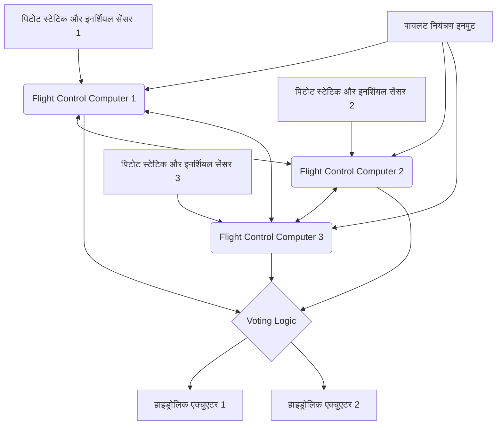

# परिचय: आसमान में उड़ता विशाल डेटा सेंटर

आधुनिक जेट एयरलाइनर सिर्फ एयरोडायनामिक वाहनों की सीमा से बहुत आगे निकल चुके हैं और एक उच्च स्तरीय रीयल-टाइम ओएस पर चलने वाले "उड़ते हुए विशाल कंप्यूटर नेटवर्क" में विकसित हो गए हैं। इसके मूल में "एवियोनिक्स (Avionics)" है, जिसका अर्थ है एविएशन इलेक्ट्रॉनिक्स (विमानन इलेक्ट्रॉनिक्स), और "फ्लाई-बाय-वायर (Fly-By-Wire: FBW)" तकनीक है, जो विमान को विद्युत संकेतों द्वारा नियंत्रित करती है। इस लेख में, एयरोस्पेस इंजीनियरिंग और नियंत्रण इंजीनियरिंग के दृष्टिकोण से, हम इन प्रणालियों के अंतर्निहित आर्किटेक्चर, नियंत्रण कानूनों (Control Laws), और दुनिया के दो प्रमुख विमान निर्माताओं, बोइंग और एयरबस द्वारा बुने गए "डिजाइन दर्शन के टकराव" का अत्यंत विस्तृत और अकादमिक गहराई से विश्लेषण करेंगे।

---

## अध्याय 1: विमान संचालन की गतिशीलता और हाइड्रोलिक्स से इलेक्ट्रिकल तक की क्रांति

### शास्त्रीय नियंत्रण प्रणाली का तंत्र और इसकी सीमाएं

हवा में उड़ने के लिए विमान का त्रि-आयामी गति नियंत्रण 3 अक्षों से बना है: पिच (अनुदैर्ध्य झुकाव: एलिवेटर द्वारा नियंत्रित), रोल (पार्श्व झुकाव: एइलरोन द्वारा नियंत्रित), और यॉ (नाक को बाएं-दाएं मोड़ना: रडर द्वारा नियंत्रित)। विमानन के शुरुआती दिनों से 1960 के दशक के आसपास तक जेट एयरलाइनर्स (जैसे बोइंग 707 और शुरुआती 737) में, कॉकपिट में नियंत्रण स्टिक (कंट्रोल व्हील या योक) और टेल/मेन विंग पर नियंत्रण सतहों (कंट्रोल सरफेस) को सीधे धातु के केबलों, पुली और छड़ों के एक जटिल नेटवर्क द्वारा जोड़ा गया था।

इस "मैकेनिकल कंट्रोल सिस्टम" का सबसे बड़ा फायदा यह था कि यह बेहद सरल और सहज था। जब पायलट कंट्रोल स्टिक खींचता है, तो वह बल केबल के माध्यम से सीधे एलिवेटर को ले जाता है, और नियंत्रण सतह पर लगने वाला वायु प्रतिरोध (हवा का दबाव) प्रतिक्रिया बल (फील फोर्स) के रूप में कंट्रोल स्टिक को वापस फीड किया जाता है। इससे पायलट सीधे अपने हाथों से महसूस कर सकता था कि "विमान इस समय कितने एयरोडायनामिक भार का सामना कर रहा है।"

हालाँकि, जैसे-जैसे विमान का आकार विशाल होता गया और परिभ्रमण गति मच 0.8 से अधिक ट्रांसोनिक क्षेत्र (transonic region) में पहुँच गई, नियंत्रण सतहों पर एयरोडायनामिक भार इतना विशाल हो गया कि यह मानव मांसपेशियों की शक्ति से आगे निकल गया। इससे निपटने के लिए, "हाइड्रोलिक एक्चुएटर्स (Hydraulic Actuator)" पेश किए गए थे। ऑटोमोबाइल के पावर स्टीयरिंग के समान, केबल के माध्यम से प्रेषित पायलट का इनपुट हाइड्रोलिक सर्वो वाल्व को खोलता और बंद करता है, और 3000 पीएसआई (लगभग 210 वायुमंडल) का अति-उच्च दबाव नियंत्रण सतह को स्थानांतरित करने के लिए सिलेंडर को चलाता है।

### हाइड्रोलिक मैकेनिकल कंट्रोल की चुनौतियां और फ्लाई-बाय-वायर की आवश्यकता

हालांकि हाइड्रोलिक तंत्र की शुरुआत ने विशाल विमानों के संचालन को संभव बना दिया, फिर भी कुछ गंभीर चुनौतियां बनी रहीं।

1. **वजन और जटिलता में वृद्धि**: सैकड़ों मीटर लंबी स्टील केबल्स और पुली को विमान के एक छोर से दूसरे छोर तक फैलाना आवश्यक था, जिसके परिणामस्वरूप कई टन डेडवेट (अतिरिक्त भार) हो गया। केबल खिंचाव और तापमान परिवर्तन के कारण तनाव परिवर्तन की भरपाई के लिए टेंशन रेगुलेटर जैसे जटिल तंत्र की भी आवश्यकता थी।
2. **गैर-रैखिक एयरोडायनामिक विशेषताओं के प्रति प्रतिक्रिया की सीमाएं**: विमान की एयरोडायनामिक विशेषताएं कम गति (टेकऑफ़ और लैंडिंग के दौरान) और उच्च गति (परिभ्रमण के दौरान) के बीच नाटकीय रूप से बदल जाती हैं। मैकेनिकल सिस्टम में, स्प्रिंग्स और डैम्पर्स का उपयोग करके एक "आर्टिफिशियल फील सिस्टम (Artificial Feel System)" या पिच-ट्रिम तंत्र के साथ इस गतिशील परिवर्तन को भौतिक रूप से प्रबंधित करना पड़ा, जिससे सभी उड़ान व्यवस्थाओं में इष्टतम स्टीयरिंग प्रतिक्रिया प्राप्त करना असंभव हो गया।
3. **स्थैतिक स्थिरता (Static Stability) की बाधाएं**: पारंपरिक विमानों को इस तरह डिज़ाइन किया जाना चाहिए था कि उनका गुरुत्वाकर्षण का केंद्र (center of gravity) हवा के दबाव के केंद्र से आगे हो और क्षैतिज स्टेबलाइजर (horizontal stabilizer) हमेशा नीचे की ओर लिफ्ट उत्पन्न करे, ताकि विमान में "स्थैतिक स्थिरता" हो, जिससे अगर पायलट नियंत्रण छोड़ दे तो विमान अपने मूल दृष्टिकोण पर वापस आ जाए। इसके परिणामस्वरूप बहुत अधिक ट्रिम ड्रैग (Trim Drag) उत्पन्न होता है, जो ईंधन दक्षता में गिरावट का एक प्रमुख कारक था।

इन भौतिक और एयरोडायनामिक सीमाओं को पार करने के लिए, पायलट के भौतिक इनपुट को नियंत्रण सतहों की गति से "अलग" करना आवश्यक था। यहीं से "फ्लाई-बाय-वायर (Fly-By-Wire: FBW)" की शुरुआत हुई, जहां कंट्रोल स्टिक की गति को विद्युत संकेतों (डिजिटल डेटा) में परिवर्तित किया जाता है, और एक कंप्यूटर इष्टतम रडर कोण की गणना करता है और नियंत्रण सतह के हाइड्रोलिक (या इलेक्ट्रिक) एक्चुएटर को कमांड भेजता है।

---

## अध्याय 2: फ्लाई-बाय-वायर का सिस्टम आर्किटेक्चर

फ्लाई-बाय-वायर का हृदय उड़ान नियंत्रण कंप्यूटरों (Flight Control Computers: FCC) का नेटवर्क है जिसे अत्यधिक विश्वसनीयता की आवश्यकता होती है। यात्री विमानों के FBW में "10 की घात -9 (10^-9) प्रति घंटे की विफलता संभावना (Catastrophic Failure Rate)" की आवश्यकता होती है, अर्थात "1 अरब उड़ान घंटों में 1 बार से कम घातक विफलता," जो कि एक अकल्पनीय स्तर की विश्वसनीयता है। इसे प्राप्त करने के लिए आर्किटेक्चर का डिज़ाइन ही FBW का तकनीकी सार है।

### मल्टीपल रिडंडेंसी (Redundancy) और वोटिंग एल्गोरिदम (Voting)

यह सुनिश्चित करने के लिए कि एक भी कंप्यूटर या सेंसर विफल होने पर उड़ान जारी रह सके, FBW में एक ट्रिप्लेक्स (Triplex) या क्वाड्रुप्लेक्स (Quadruplex) रिडंडेंट कॉन्फ़िगरेशन होता है। उदाहरण के लिए, बोइंग 777 के मामले में, 3 प्राइमरी फ्लाइट कंप्यूटर (PFC) सिस्टम (लेफ्ट, सेंटर, राइट) होते हैं, और प्रत्येक PFC में 3 कंप्यूटिंग चैनल होते हैं, जिससे यह अनिवार्य रूप से "3x3 = 9-गुना" लॉजिकल आर्किटेक्चर बनाता है।

इस रिडंडेंट सिस्टम में सबसे महत्वपूर्ण चीज़ "सिंक्रनाइज़ेशन और वोटिंग (Synchronization and Voting)" एल्गोरिदम है।
कई कंप्यूटर एक ही समय में समान इनपुट डेटा (पायलट का नियंत्रण इनपुट, एयरस्पीड, एटीट्यूड एंगल, आदि) प्राप्त करते हैं और समान नियंत्रण कानूनों का उपयोग करके गणना करते हैं। फिर वे आउटपुट स्टीयरिंग कोण कमांड मानों की एक-दूसरे से तुलना करते हैं (क्रॉस-चैनल डेटा लिंक)।

वोटिंग लॉजिक का आधार "बहुमत नियम (Majority Rule)" है। यदि तीन में से दो कंप्यूटर गणना करते हैं कि "एलिवेटर को 5 डिग्री ऊपर उठाएँ" और एक गणना करता है कि "इसे 10 डिग्री ऊपर उठाएँ", तो बहुमत 5 डिग्री को सही माना जाता है, और जो कंप्यूटर अलग गणना परिणाम देता है वह स्वचालित रूप से नेटवर्क से कट जाता है (Fail-Silent), और शेष दो कंप्यूटर नियंत्रण जारी रखते हैं (Fail-Operational)।

### विषम हार्डवेयर और सॉफ्टवेयर के माध्यम से सामान्य कारण विफलता (Dissimilarity) का उन्मूलन

यहां तक ​​​​कि ट्रिपल रिडंडेंसी के साथ भी, यदि बिल्कुल समान सीपीयू और बिल्कुल समान प्रोग्राम का उपयोग किया जाता है, तो किसी विशिष्ट अज्ञात बग (सॉफ़्टवेयर दोष) या हार्डवेयर डिज़ाइन त्रुटि (errata) का सामना करने पर एक जोखिम होता है कि तीनों कंप्यूटर एक ही समय में "समान गलत उत्तर" देंगे। इसे "सामान्य कारण विफलता (Common Mode/Cause Failure: CCF)" कहा जाता है।

इसे रोकने के लिए, बोइंग और एयरबस "विषम वास्तुकला (Dissimilarity)" की सीमा को बहुत आगे ले जाते हैं।
उदाहरण के लिए, एयरबस A320 में, मुख्य कंप्यूटर, ELAC (Elevator Aileron Computer) और SEC (Spoiler Elevator Computer), पूरी तरह से अलग निर्माताओं के CPU का उपयोग करते हैं (जैसे एक Intel-आधारित और दूसरा Motorola-आधारित)। इसके अलावा, नियंत्रण सॉफ्टवेयर विकास दल भौतिक और संगठनात्मक दोनों रूप से पूरी तरह से अलग-थलग हैं, और उन्हें समान आवश्यकता विनिर्देशों से अलग-अलग कोड लिखने के लिए अलग-अलग प्रोग्रामिंग भाषाओं (जैसे एडा और सी) और अलग-अलग कंपाइलरों का उपयोग करने के लिए कहा जाता है। परिणामस्वरूप, इस संभावना को कि यदि एक सॉफ्टवेयर में बग है, तो दूसरे सॉफ्टवेयर में भी वही बग मौजूद होगा, गणितीय रूप से लगभग शून्य कर दिया जाता है।

### एवियोनिक्स डेटा बस: ARINC 429 और ARINC 664 (AFDX)

इन सेंसरों, कंप्यूटरों और एक्चुएटर्स को जोड़ने वाला संचार नेटवर्क (एवियोनिक्स डेटा बस) भी अपने तरीके से विकसित हुआ है।

"ARINC 429" मानक 1980 के दशक से लंबे समय तक मानक रहा है। यह एक वन-टू-मैनी वन-वे (सिंप्लेक्स) सीरियल बस है जो एकल ट्विस्टेड पेयर केबल का उपयोग करके 100kbps (या 12.5kbps) पर 32-बिट डेटा शब्द भेजता है। क्योंकि संरचना अत्यंत सरल और नियतात्मक (Deterministic) है, इसका उपयोग आज भी कई उपप्रणालियों में किया जाता है।

हालांकि, A380, B787 और A350 जैसे नवीनतम विमानों में, संचार डेटा की मात्रा में विस्फोट हुआ, और ARINC 429 जैसी पॉइंट-टू-पॉइंट वायरिंग का केबल वजन अपनी सीमा तक पहुंच गया। इसलिए "ARINC 664 Part 7 (आमतौर पर AFDX - Avionics Full-Duplex Switched Ethernet के रूप में जाना जाता है)" पेश किया गया था।
AFDX उस ईथरनेट (IEEE 802.3) तकनीक पर आधारित है जिसका उपयोग हम दैनिक आधार पर करते हैं, लेकिन विमान के लिए "पूर्ण संचार विलंबता की गारंटी (Bounded Latency)" और "बैंडविड्थ आवंटन" को लागू करने के लिए एक प्रोफ़ाइल जोड़ता है। वर्चुअल लिंक (Virtual Link: VL) की अवधारणा का उपयोग करते हुए, नेटवर्क स्विच (AFDX स्विच) प्रत्येक डेटा स्ट्रीम के लिए बैंडविड्थ का कड़ाई से प्रबंधन करता है, एक नियतात्मक (Deterministic) ईथरनेट नेटवर्क का निर्माण करता है जहां पैकेट टकराव या हानि कभी नहीं होती है। इससे सैकड़ों उपकरणों को हाई-स्पीड 100Mbps/1Gbps नेटवर्क पर वास्तविक समय में संचार करने की अनुमति मिलती है।

---

## अध्याय 3: उड़ान नियंत्रण कानून (Flight Control Laws)

FBW का सबसे बड़ा लाभ यह है कि, पायलट के भौतिक नियंत्रण इनपुट (Stick Input) को सीधे नियंत्रण सतह के कोण (Surface Angle) में परिवर्तित करने के बजाय, यह "नियंत्रण कानून (Control Laws)" को लागू करने की अनुमति देता है जहां कंप्यूटर पायलट के "विमान को कैसे स्थानांतरित करना चाहता है" के इरादे (Intent) की व्याख्या करता है और वर्तमान उड़ान की स्थिति (गति, ऊंचाई, वजन, आदि) के अनुसार इष्टतम रडर कोण की गणना करता है।

### C* (सी स्टार) कानून: पिच नियंत्रण की क्रांति

नवीनतम यात्री विमानों (बोइंग 777/787 और एयरबस A320 और उसके बाद के) के अनुदैर्ध्य (पिच) नियंत्रण में, "C* (सी स्टार) नियंत्रण कानून" या इसका विकसित रूप "C*U कानून" अपनाया जाता है।

पारंपरिक विमानों (या डायरेक्ट लॉ स्टेट) में, कंट्रोल स्टिक को खींचने की मात्रा "एलिवेटर रडर कोण" के समानुपाती होती थी। हालांकि, कम गति और उच्च गति पर, समान रडर कोण के लिए विमान की प्रतिक्रिया (पिचिंग की गति या उत्पन्न जी) पूरी तरह से अलग होती है।
इसके विपरीत, C* कानून में, जब पायलट कंट्रोल स्टिक को हिलाता है, तो इसे "पिच दर (नाक के ऊपर और नीचे जाने का कोणीय वेग: q)" और "ऊर्ध्वाधर त्वरण (जी लोड: Nz)" के "संयुक्त लक्ष्य मान को कमांड करने" के रूप में व्याख्या की जाती है।

$$ C^* = K_1 \cdot q + K_2 \cdot N_z $$

(जहाँ $K_1, K_2$ गति के अनुसार बदलने वाले लाभ (gains) हैं)

- **कम गति (जैसे टेकऑफ़ और लैंडिंग) पर**: चूंकि एयरोडायनामिक जी उत्पन्न करना मुश्किल है, कंप्यूटर मुख्य रूप से "पिच दर (q)" को फीडबैक करता है और विमान की नाक को ऊपर और नीचे उठाने की गति को नियंत्रित करता है।
- **उच्च गति (परिभ्रमण) पर**: नाक को थोड़ा सा उठाने पर भी एक मजबूत जी उत्पन्न होता है, इसलिए कंप्यूटर मुख्य रूप से "ऊर्ध्वाधर त्वरण (Nz)" को फीडबैक करता है और पायलट के इनपुट के अनुसार एक निरंतर जी उत्पन्न करने के लिए नियंत्रण सतह को नियंत्रित करता है।

नतीजतन, उड़ान की गति की परवाह किए बिना, पायलट अत्यंत स्थिर संचालन विशेषताओं को प्राप्त कर सकता है, जहां "यदि कंट्रोल स्टिक को समान मात्रा में खींचा जाता है, तो विमान हमेशा उसी तरह प्रतिक्रिया करता है।"

### फेल-सेफ पदानुक्रमित संरचना: नॉर्मल, अल्टरनेट, डायरेक्ट

विमान में सेंसर और कंप्यूटर की विफलता की तैयारी के लिए नियंत्रण कानूनों का एक डिग्रेडेशन (Degradation) पदानुक्रम होता है। एयरबस नामकरण का उदाहरण लेते हुए, यह निम्नानुसार पदानुक्रमित है:

1. **नॉर्मल लॉ (Normal Law)**
   सभी सिस्टम (ADIRU, कंप्यूटर, आदि) सामान्य हैं। C* कानून और पूरी "फ्लाइट एनवलप प्रोटेक्शन (Flight Envelope Protection)" (बाद में वर्णित) द्वारा पूर्ण हैंडलिंग मुआवजा सक्रिय है। ऑटोपायलट का उपयोग भी सामान्य रूप से किया जा सकता है।
2. **अल्टरनेट लॉ (Alternate Law)**
   मल्टीप्लेक्स सेंसर का एक हिस्सा विफल हो गया है और विश्वसनीय डेटा (जैसे सटीक एयरस्पीड) प्राप्त नहीं किया जा सकता है। बेसिक एटीट्यूड कंट्रोल (पिच रेट या रोल रेट) फीडबैक काम करता है, लेकिन फ्लाइट एनवलप प्रोटेक्शन (स्टॉल प्रिवेंशन फंक्शन, आदि) का कुछ या सारा हिस्सा अक्षम हो जाता है।
3. **डायरेक्ट लॉ (Direct Law)**
   एक अंतिम बैकअप स्थिति जिसमें कई कंप्यूटर और सेंसर विफल हो गए हैं और जटिल गणनाएं असंभव हो गई हैं। FBW बस एक "इलेक्ट्रिकल केबल" बन जाता है, और कंट्रोल स्टिक की गति सीधे नियंत्रण सतह के रडर कोण (आनुपातिक नियंत्रण) के अनुपात में प्रसारित होती है। कोई फ्लाइट एनवलप प्रोटेक्शन नहीं होता है, और हैंडलिंग की अनुभूति बिल्कुल एक क्लासिक विमान की तरह होती है (लेकिन गति के साथ संवेदनशीलता में परिवर्तन पूरी तरह से महसूस किया जा सकता है)।

### फ्लाइट एनवलप प्रोटेक्शन (उड़ान क्षेत्र संरक्षण)

FBW द्वारा लाई गई सबसे बड़ी सुरक्षा तकनीक यही है। विमानों की एक सीमा (एनवलप) होती है जिसमें वे सुरक्षित रूप से उड़ान भर सकते हैं। इनमें गति (स्टॉल स्पीड और सीमा मच संख्या), बैंक एंगल, पिच एंगल और जी-लोड (लोड मल्टीपल) शामिल हैं। जब विमान इन सीमाओं को पार करने का प्रयास करता है, तो FBW यह सुनिश्चित करने के लिए कंप्यूटर के हस्तक्षेप का उपयोग करता है कि ऐसा न हो।

- **पिच एटीट्यूड प्रोटेक्शन**: नोज़-अप कोण को एक निश्चित सीमा (उदा: +30 डिग्री) और नोज़-डाउन कोण को (उदा: -15 डिग्री) से अधिक होने से प्रतिबंधित करता है।
- **बैंक एंगल प्रोटेक्शन**: एलिरॉन को नियंत्रित करता है ताकि रोल कोण एक निश्चित सीमा (उदा: 67 डिग्री) से अधिक न cap हो।
- **स्टॉल प्रोटेक्शन (Alpha Protection)**: यदि एंगल ऑफ अटैक (Angle of Attack: AoA, Alpha) स्टॉल सीमा के करीब पहुंचता है, तो भले ही पायलट कंट्रोल स्टिक को खींचता रहे, कंप्यूटर आगे नाक उठाने से इंकार कर देगा और स्टॉल से बचने के लिए इंजन थ्रस्ट को स्वचालित रूप से अधिकतम (TOGA) कर देगा।

---

## अध्याय 4: बोइंग बनाम एयरबस: निर्णायक डिजाइन दर्शन का टकराव

FBW तकनीक की शुरुआत के साथ, बोइंग और एयरबस, जो वाणिज्यिक विमानन उद्योग को दो भागों में विभाजित करते हैं, के पास "कॉकपिट डिजाइन और मानव तथा मशीन के बीच अधिकार के प्रत्यायोजन" के संबंध में पूरी तरह से अलग डिजाइन दर्शन हैं। यह आधुनिक एयरोस्पेस इंजीनियरिंग में सबसे दिलचस्प बहसों में से एक है।

### एयरबस का दर्शन: "कंप्यूटर द्वारा पूर्ण सुरक्षा और हार्ड लिमिट्स"

1988 में सेवा में प्रवेश करने वाला A320 दुनिया का पहला फुल डिजिटल FBW एयरलाइनर था। एयरबस का मूल दर्शन यह है: "**मनुष्य गलतियाँ करते हैं। इसलिए, कंप्यूटर की गणनाओं के आधार पर हार्ड लिमिट्स (पूर्ण सीमाओं) द्वारा परम सुरक्षा सुनिश्चित की जानी चाहिए**।"

1. **साइडस्टिक को अपनाना**:
   एयरबस ने पारंपरिक दो-हाथ वाले कंट्रोल योक को समाप्त कर दिया और फाइटर जेट की तरह कैप्टन की सीट के बाईं ओर और फर्स्ट ऑफिसर की सीट के दाईं ओर एक साइडस्टिक लगाई। इससे इंस्ट्रूमेंट पैनल की दृश्यता में काफी सुधार हुआ।
2. **कंट्रोल स्टिक की गैर-इंटरलॉकिंग प्रकृति**:
   कैप्टन और फर्स्ट ऑफिसर के साइडस्टिक भौतिक रूप से जुड़े नहीं हैं। यदि एक को हिलाया जाता है, तो दूसरा स्टिक नहीं हिलता है (दोहरे इनपुट के दौरान, इनपुट को बीजगणितीय रूप से जोड़ा जाता है या प्राथमिकता बटन का उपयोग करके ओवरराइड किया जाता है)।
3. **हार्ड प्रोटेक्शन (Hard Envelope Protection)**:
   जब तक नॉर्मल लॉ सक्रिय है, भले ही पायलट जानबूझकर या घबराहट की स्थिति में साइडस्टिक को उसकी सीमा तक खींच ले, विमान कभी भी स्टॉल एंगल ऑफ अटैक से अधिक नहीं होगा, और बैंक एंगल सीमा मान से अधिक नहीं होगा। दूसरे शब्दों में, कंप्यूटर के पास "पायलट के कार्यों को ओवरराइड (अस्वीकार) करने" का अधिकार है।

### बोइंग का दर्शन: "अंतिम निर्णय हमेशा पायलट के पास होता है (सॉफ्ट लिमिट्स)"

दूसरी ओर, 1995 में बोइंग द्वारा पेश किए गए पहले FBW विमान B777 (और बाद में B787) में, दर्शन यह रहा है कि: "**स्थिति कोई भी हो, एक मानव पायलट, जो ऑन-साइट स्थिति को सबसे अच्छी तरह से समझता है, के पास अंतिम निर्णय का अधिकार होना चाहिए**।"

1. **पारंपरिक कंट्रोल व्हील (योक) का रखरखाव**:
   बोइंग ने साइडस्टिक को नहीं अपनाया और पारंपरिक योक को बरकरार रखा। यहां तक ​​कि FBW विमानों में भी, कैप्टन और फर्स्ट ऑफिसर की सीटों के योक फर्श के नीचे एक तंत्र के माध्यम से भौतिक रूप से (या इलेक्ट्रिक सर्वोस के माध्यम से) जुड़े होते हैं। इससे पायलटों को एक-दूसरे के कार्यों को स्पर्श और दृश्यता के माध्यम से पहचानने की अनुमति मिलती है।
2. **आर्टिफिशियल फील मैकेनिज्म (Artificial Feel) और बैकड्राइव**:
   जब ऑटोपायलट नियंत्रण में होता है, तो कॉकपिट में योक नियंत्रण सतहों के आंदोलनों के साथ भौतिक रूप से चलता है (एयरबस की साइडस्टिक नहीं चलती)। इसके अलावा, गति के आधार पर योक को स्थानांतरित करने के लिए वजन (स्टीयरिंग बल) का अनुकरण करने के लिए एक एक्चुएटर बनाया गया है, जो पायलट को एक कृत्रिम "एयरोडायनामिक फील" प्रदान करता है।
3. **सॉफ्ट प्रोटेक्शन (Soft Envelope Protection)**:
   बोइंग विमानों में भी स्टॉल प्रोटेक्शन और बैंक एंगल लिमिट्स होते हैं, लेकिन वे "पूर्ण दीवारें" नहीं हैं। जैसे ही विमान अपनी सीमा तक पहुंचता है, कंट्रोल स्टिक नाटकीय रूप से भारी हो जाती है, जो पायलट को चेतावनी देती है, लेकिन यदि पायलट "और भी मजबूत बल (उदा: लगभग 22.5 किलोग्राम या अधिक)" के साथ कंट्रोल स्टिक को खींचना जारी रखता है, तो सिस्टम की निर्धारित सीमाओं को "ओवरराइड (Override)" किया जा सकता है और सीमा से परे युद्धाभ्यास किया जा सकता है। यह इस विचार पर आधारित है कि "ऐसी चरम स्थितियों में जिनका कंप्यूटर ने अनुमान नहीं लगाया है, जैसे मिसाइल से बचना या इलाके की टक्कर से बचना, पायलट को विमान को नुकसान पहुंचने पर भी टालमटोल की कार्रवाई करने का अधिकार बरकरार रखना चाहिए।"

"मशीन पर भरोसा करें या इंसान पर" के दर्शन में यह अंतर आज तक दोनों कंपनियों के कॉकपिट डिजाइनों के बीच मूलभूत अंतर के रूप में प्रकट होता है।

---

## अध्याय 5: सेंसर फ्यूजन और स्वचालित लैंडिंग (Autoland)

FBW सिस्टम की प्रगति इंस्ट्रूमेंट लैंडिंग सिस्टम (ILS) या GPS-आधारित GLS (GBAS लैंडिंग सिस्टम) के साथ पूरी तरह से स्वचालित लैंडिंग (Autoland) प्राप्त करने के लिए आवश्यक थी। घने कोहरे (Cat IIIb/IIIc स्थितियों) के कारण शून्य दृश्यता के साथ भी, रनवे की केंद्र रेखा पर सैकड़ों यात्रियों को ले जाने वाले कई सौ टन के विमान को सुरक्षित रूप से उतारने की तकनीक नियंत्रण इंजीनियरिंग का शिखर है।

### अंतरिक्ष को समझने वाले सेंसर का समूह (ADIRU)

सटीक नियंत्रण के लिए, यह अत्यधिक सटीकता के साथ जानना आवश्यक है कि विमान अंतरिक्ष में कहाँ है, उसका एटीट्यूड (रवैया) क्या है, और यह कैसे आगे बढ़ रहा है। "Air Data Inertial Reference Unit (ADIRU: वायु डेटा और जड़त्वीय संदर्भ इकाई)" इसके लिए जिम्मेदार है।

- **एयर डेटा (Air Data)**: विमान के बाहर लगे पिटोट ट्यूब (गतिशील दबाव को मापता है) और स्टैटिक पोर्ट (स्थिर दबाव को मापता है) और तापमान सेंसर से, यह एयरस्पीड (Airspeed), ऊंचाई (Altitude), मच संख्या और एंगल ऑफ अटैक (AoA) की गणना करता है।
- **इनर्शियल रेफरेंस सिस्टम (IRS: Inertial Reference System)**: यह रिंग लेजर गायरो (RLG) या फाइबर ऑप्टिक गायरो (FOG) का उपयोग करके विमान के 3 अक्षों के कोणीय वेग और त्वरण का अत्यधिक सटीकता के साथ पता लगाता है, और उन्हें एकीकृत करके, यह स्वायत्त रूप से विमान के एटीट्यूड (पिच, रोल, यॉ) और पृथ्वी पर पूर्ण निर्देशांक (अक्षांश और देशांतर) की गणना करता है।

आधुनिक एवियोनिक्स में, इन ADIRU डेटा को GPS (GNSS) संकेतों के साथ कलमन फ़िल्टर आदि (सेंसर फ़्यूज़न) का उपयोग करके फ़्यूज़ किया जाता है, और बहाव त्रुटि (drift error) को लगातार ठीक करके, कुछ सेंटीमीटर से लेकर कई मीटर तक के सटीक नेविगेशन समाधान प्राप्त किए जाते हैं।

### स्वचालित लैंडिंग का नियंत्रण लूप और फ्लेयर रोलआउट

ILS का उपयोग करते हुए स्वचालित लैंडिंग में, विमान पर लगे एंटेना जमीन से उत्सर्जित लोकलाइज़र रेडियो तरंगों (रनवे सेंटरलाइन) और ग्लाइड स्लोप रेडियो तरंगों (लगभग 3-डिग्री डिसेंट एंगल) को प्राप्त करते हैं, और FCC विमान को रेडियो बीम के केंद्र में रखने के लिए फीडबैक नियंत्रण करता है।

1. **अप्रोच फेज़ (Approach Phase)**:
   लगभग 1500 फीट की ऊंचाई पर, सभी 3 ऑटोपायलट सिस्टम लगे होते हैं, और बहुमत का तर्क सक्रिय हो जाता है (Fail-Operational स्थिति)। ILS त्रुटि संकेत को शून्य पर रखने के लिए पिच और रोल को लगातार ठीक किया जाता है।
2. **क्रैब एंगल (Crab Angle) और क्रॉसविंड करेक्शन**:
   यदि क्रॉसविंड (तिरछी हवा) है, तो विमान तिरछी मुद्रा (क्रैब मुद्रा) में उतरता है, जिसकी नाक हवा की ओर होती है।
3. **डीक्रैब (Decrab) और फ्लेयर (Flare)**:
   जब रेडियो अल्टीमीटर (Radio Altimeter) लगभग 50 फीट की ऊंचाई का पता लगाता है, तो ऑटोपायलट स्वचालित रूप से "फ्लेयर मोड" में बदल जाता है। यह उतरने की दर को कम करने के लिए नाक को थोड़ा ऊपर उठाता है (आमतौर पर लगभग 150 एफपीएम तक), जिससे लैंडिंग के प्रभाव को कम किया जा सके। उसी समय, यदि क्रॉसविंड है, तो रडर का उपयोग नाक को रनवे की दिशा के साथ संरेखित करने के लिए किया जाता है (डीक्रैब), हवा में बहने से रोकने के लिए एइलरोन को लागू करके एक रोल कोण बनाया जाता है, और मेन गियर को हवा की तरफ वाले पहिये पर पहले उतारा जाता है। कंप्यूटर इस जटिल बहु-पैरामीटर बहु-चर नियंत्रण को मिलीसेकंड सटीकता के साथ निष्पादित करता execution करता है, जो मनुष्यों के लिए असंभव है।
4. **रोलआउट (Rollout)**:
   टचडाउन के बाद भी, ऑटोपायलट लोकलाइज़र सिग्नल को ट्रैक करना जारी रखता है, स्वचालित रूप से रडर और नोज़ व्हील (फ्रंट व्हील) स्टीयरिंग को नियंत्रित करता है ताकि रनवे की सेंटरलाइन के साथ सीधे गति कम हो सके। इसके साथ ही, कंप्यूटर स्वचालित रूप से स्पॉइलर की तैनाती और ऑटो-ब्रेक के साथ निरंतर मंदी की दर पर ब्रेकिंग का प्रबंधन करता है।

---

## अध्याय 6: एवियोनिक्स का भविष्य और स्वायत्त उड़ान

FBW और एवियोनिक्स का तेजी से विकास जारी है, जो अगली पीढ़ी के विमानन उद्योग को नया रूप देने के लिए तैयार है।

### इंटीग्रेटेड मॉड्यूलर एवियोनिक्स (IMA: Integrated Modular Avionics)

पारंपरिक विमानों में, प्रत्येक कार्य के लिए समर्पित, स्वतंत्र कंप्यूटर (LRU: Line Replaceable Unit) होते थे, जैसे ऑटोपायलट, फ्लाइट मैनेजमेंट सिस्टम (FMS), व्हील कंट्रोल और एयर कंडीशनिंग कंट्रोल। लेकिन इससे वजन, बिजली की खपत और लागत में बर्बादी हुई।
आधुनिक विमान जैसे B787 और A350 "इंटीग्रेटेड मॉड्यूलर एवियोनिक्स (IMA)" आर्किटेक्चर का उपयोग करते हैं। इसमें विमान के भीतर सामान्य प्रयोजन, उच्च-प्रदर्शन ब्लेड सर्वर के समान कई सामान्य कंप्यूटिंग मॉड्यूल (CCM) रखे जाते हैं, जो ARINC 653 मानक के आधार पर रीयल-टाइम ओएस (RTOS) चलाते हैं। RTOS की "टाइम और स्पेस पार्टीशनिंग (Time and Space Partitioning)" तकनीक का उपयोग करते हुए, एक ही CPU और मेमोरी पर एक साथ पूरी तरह से अलग-थलग "महत्वपूर्ण उड़ान नियंत्रण सॉफ़्टवेयर" और "इन-फ़्लाइट मनोरंजन नियंत्रण सॉफ़्टवेयर" चलाना संभव हो गया। इसके परिणामस्वरूप हार्डवेयर और वजन में महत्वपूर्ण कमी आई है।

### फ्लाई-बाय-लाइट (Fly-By-Light) और विद्युतीकरण (More Electric Aircraft)

डेटा बसों के विकास के रूप में, तांबे के तारों को फाइबर ऑप्टिक्स से बदलने वाले "फ्लाई-बाय-लाइट (FBL)" पर शोध प्रगति पर है। अल्ट्रा-ब्रॉडबैंड और हल्के होने के अलावा, फाइबर ऑप्टिक्स का विमानों के लिए एक अत्यंत लाभप्रद गुण है कि वे बिजली गिरने (Lightning Strike) और मजबूत विद्युत चुम्बकीय हस्तक्षेप (EMI / EMP) के प्रति पूरी तरह से अभेद्य हैं।

इसके अलावा, "मोर इलेक्ट्रिक एयरक्राफ्ट (MEA: विद्युत विमान)" की अवधारणा के कारण, पारंपरिक भारी हाइड्रोलिक पाइपिंग सिस्टम से उन "इलेक्ट्रो-मैकेनिकल एक्चुएटर्स (EMA)" की ओर बदलाव शुरू हो गया है जो मोटर्स के साथ सीधे नियंत्रण सतहों को चलाते हैं, या "इलेक्ट्रो-हाइड्रोस्टेटिक एक्चुएटर्स (EHA)" जिनमें एक्चुएटर के भीतर पूरी तरह से स्वतंत्र हाइड्रोलिक पंप होते हैं (A380 और B787 बैकअप सिस्टम में पहले से ही व्यावहारिक)। यह हाइड्रोलिक रिसाव के कारण पूर्ण सिस्टम हानि के जोखिम को कम करता है और ईंधन दक्षता में और सुधार करता है।

### एआई का परिचय, सिंगल-पायलट ऑपरेशन (SPO), और पूरी तरह से स्वायत्त उड़ान

परम भविष्य के रूप में, एवियोनिक्स में आर्टिफिशियल इंटेलिजेंस (एआई) और मशीन लर्निंग की शुरुआत पर चर्चा की जा रही है। वर्तमान FBW कड़ाई से "मनुष्यों द्वारा प्रोग्राम किए गए नियतात्मक तर्क (Deterministic Logic)" पर काम करता है, लेकिन अनुकूली नियंत्रण (Adaptive Control) पर शोध चल रहा है जहां AI तुरंत नए नियंत्रण कानूनों को सीखता है और जटिल मौसम की स्थिति या अज्ञात विमान क्षति के मामले में उड़ान बनाए रखने के लिए उन्हें फिर से बनाता है।

पायलटों की कमी को दूर करने के उपाय के रूप में, वाणिज्यिक विमानों, जिनमें वर्तमान में एक कैप्टन और एक फर्स्ट ऑफिसर शामिल हैं, को कम से कम क्रूज़ के दौरान केवल एक व्यक्ति (Single Pilot Operations: SPO) तक कम करने, और फर्स्ट ऑफिसर की भूमिका को अत्यधिक स्वायत्त एवियोनिक्स या जमीन पर रिमोट ऑपरेटरों (जैसे eMCO) द्वारा प्रतिस्थापित करने की अवधारणाओं का गंभीरता से परीक्षण किया जा रहा है, जिसका नेतृत्व एयरबस कर रहा है। फ्लाई-बाय-वायर का अंतिम परिणाम "पूरी तरह से स्वायत्त यात्री विमान" हो सकता है, जहां कॉकपिट से मानव पायलट पूरी तरह से गायब हो जाते हैं।

---

## निष्कर्ष

"फ्लाई-बाय-वायर" केवल केबलों को बिजली के तारों से बदलने की तकनीक नहीं है। यह एक प्रतिमान बदलाव (paradigm shift) है जिसने विमान को एयरोडायनामिक बाधाओं से मुक्त किया है और इसे "उड़ते हुए सिस्टम्स ऑफ सिस्टम्स" में बदल दिया है जो नियंत्रण इंजीनियरिंग, सूचना इंजीनियरिंग और नेटवर्क प्रौद्योगिकी का सर्वश्रेष्ठ संयोजन है।
जैसा कि बोइंग और एयरबस के बीच डिजाइन दर्शन में अंतर से देखा जा सकता है, हमेशा एक मौलिक प्रश्न होता है: "मनुष्य की भूमिका क्या है?" जैसे-जैसे भविष्य में एआई और स्वायत्तता आगे बढ़ती है, एवियोनिक्स तकनीक हवाई यात्रा को सुरक्षित, अधिक कुशल और शांत बनाने में समर्थन करती रहेगी।

## परिशिष्ट: फ्लाई-बाय-वायर की गणितीय मॉडलिंग और ट्रांसफर फंक्शन (Transfer Functions)

FBW सिस्टम की अकादमिक समझ को गहरा करने के लिए, हम विमान की अनुदैर्ध्य गति (पिच अक्ष) में बुनियादी ट्रांसफर कार्यों और फीडबैक नियंत्रण ब्लॉक आरेख मॉडल पर अतिरिक्त जानकारी प्रदान करेंगे।

### विमान का डायनेमिक विशेषता मॉडल (Short Period मोड)

विमान की अनुदैर्ध्य गति को मुख्य रूप से दो मोड में तोड़ा जाता है: शॉर्ट-पीरियड मोड (Short Period Mode) और लॉन्ग-पीरियड मोड (फुगॉइड मोड: Phugoid Mode)। यह "शॉर्ट-पीरियड मोड" है जिसे FBW का C* कानून और पिच-रेट नियंत्रण सीधे क्षीण और स्थिर करता है।

एलिवेटर रडर एंगल $\delta_e$ से पिच रेट $q$ तक ट्रांसफर फंक्शन $G(s) = \frac{q(s)}{\delta_e(s)}$, सामान्य रेखीयकृत कठोर शरीर गति के समीकरणों (linearized rigid body equations of motion) से निम्नानुसार अनुमानित किया जाता है:

$$ \frac{q(s)}{\delta_e(s)} = \frac{K_q(T_{\theta_2}s + 1)}{s^2 + 2\zeta_{sp}\omega_{sp}s + \omega_{sp}^2} $$

जहाँ:
- $K_q$ नियंत्रण का स्थिर-अवस्था लाभ (steady-state gain) है (गति और गतिशील दबाव पर अत्यधिक निर्भर)
- $T_{\theta_2}$ पिचिंग गति और उड़ान पथ (Flight Path) परिवर्तन के बीच चरण विलंब समय स्थिरांक (phase delay time constant) है
- $\zeta_{sp}$ शॉर्ट-पीरियड मोड का डंपिंग अनुपात (Damping Ratio) है
- $\omega_{sp}$ শর্ট-पीरियड मोड की प्राकृतिक कोणीय आवृत्ति (Natural Frequency) है

पारंपरिक मैकेनिकल कंट्रोल सिस्टम में, एक समस्या थी कि उच्च ऊंचाई और उच्च गति पर एयरोडायनामिक डंपिंग कम हो जाती थी, और $\zeta_{sp}$ बहुत छोटा हो जाता था (जिससे विमान पिच दिशा में आसानी से दोलन करने लगता था)।

### फीडबैक नियंत्रण के माध्यम से विशेषताओं में सुधार

FBW सिस्टम में, गायरो सेंसर (ADIRU) द्वारा मापी गई पिच दर $q_{sensor}$ और ऊर्ध्वाधर त्वरण $N_z$ को कंप्यूटर पर वापस फीड किया जाता है, और पायलट के कमांड वैल्यू $q_{cmd}$ (या $C^*_{cmd}$) के साथ त्रुटि $e$ की गणना की जाती है।

आइए सबसे बुनियादी पिच दर फीडबैक नियंत्रण (आनुपातिक-अभिन्न नियंत्रण: पीआई नियंत्रण) पेश किए जाने पर क्लोज्ड-लूप ट्रांसफर फ़ंक्शन पर विचार करें। यदि नियंत्रक (Controller) का ट्रांसफर फंक्शन $C(s) = K_p + \frac{K_i}{s}$ है, तो नियंत्रक द्वारा आउटपुट रडर एंगल कमांड $\delta_c$ है:

$$ \delta_c(s) = C(s) \left( q_{cmd}(s) - q_{sensor}(s) \right) $$

इसको हाइड्रोलिक एक्चुएटर के फर्स्ट-ऑर्डर लैग विशेषता (first-order lag characteristic) $A(s) = \frac{1}{\tau_a s + 1}$ से गुणा करने पर, वास्तविक रडर कोण $\delta_e$ प्राप्त होता है।

समग्र प्रणाली के क्लोज्ड-लूप ट्रांसफर फ़ंक्शन $G_{closed}(s) = \frac{q(s)}{q_{cmd}(s)}$ के हर बहुपद (विशेषता समीकरण) के ध्रुवों (Poles) को उचित लाभ $K_p, K_i$ के साथ गेन शेड्यूलिंग (Gain Scheduling) द्वारा सेट करके, किसी भी गति सीमा में इष्टतम $\zeta$ (आमतौर पर 0.7 के आसपास) और $\omega_n$ प्राप्त किया जाता है। नतीजतन, टेल के भौतिक आकार या गुरुत्वाकर्षण के केंद्र की परवाह किए बिना, एक "आदर्श हवाई जहाज" की हैंडलिंग विशेषताओं को हमेशा सॉफ़्टवेयर में अनुकरण किया जा सकता है। यह FBW द्वारा "कृत्रिम स्थिरता (Artificial Stability)" का गणितीय सार है।
