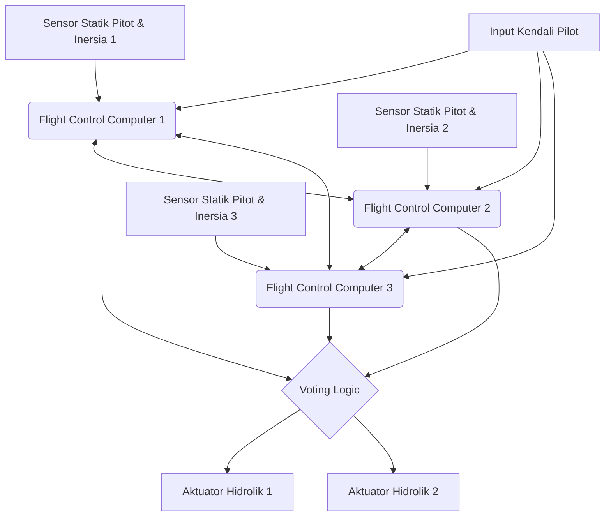

# Pendahuluan: Pusat Data Raksasa yang Terbang di Angkasa

Pesawat jet penumpang modern telah berevolusi melampaui batas kendaraan aerodinamis biasa menjadi "jaringan komputer terbang raksasa" yang beroperasi dengan OS waktu nyata (real-time OS) yang sangat canggih. Inti dari sistem ini adalah "Avionics" (Avionik) yang berarti rekayasa elektronika penerbangan, dan teknologi "Fly-By-Wire" (FBW) yang mengendalikan pesawat melalui sinyal listrik. Dalam artikel ini, dari perspektif teknik kedirgantaraan dan rekayasa kendali, kita akan mendalami secara akademis dan mendetail arsitektur yang mendasari sistem ini, hukum kendali (control laws), serta "konflik filosofi desain" yang terjalin antara dua produsen pesawat terbang terbesar di dunia, Boeing dan Airbus.

---

## Bab 1: Mekanika Pengendalian Pesawat dan Revolusi dari Hidrolik ke Elektrik

### Mekanisme dan Keterbatasan Sistem Kendali Klasik

Kendali gerak tiga dimensi agar pesawat dapat terbang terdiri dari 3 sumbu: pitch (kemiringan vertikal: dikendalikan oleh elevator), roll (kemiringan lateral: dikendalikan oleh aileron), dan yaw (ayunan hidung pesawat ke kiri dan kanan: dikendalikan oleh rudder). Dari masa awal penerbangan hingga sekitar tahun 1960-an pada pesawat jet penumpang (misalnya Boeing 707 dan 737 awal), tuas kendali di kokpit (control wheel atau yoke) dan bidang kendali (control surface) di ekor dan sayap utama terhubung secara langsung oleh jaringan rumit kabel logam fisik, katrol (pulley), dan batang (rod).

Keuntungan terbesar dari "sistem kendali mekanis" ini adalah kesederhanaan dan intuisinya yang luar biasa. Saat pilot menarik tuas kendali, gaya tersebut menggerakkan elevator secara langsung melalui kabel, dan hambatan udara (tekanan angin) yang mengenai bidang kemudi diberikan kembali ke tuas kendali sebagai gaya reaksi (feel force). Hal ini memungkinkan pilot untuk merasakan langsung dengan tangan mereka "seberapa besar beban aerodinamis yang sedang dialami pesawat saat ini".

Namun, ketika ukuran pesawat membesar dan kecepatan jelajah mencapai rentang transonik melebihi Mach 0,8, beban aerodinamis yang bekerja pada bidang kemudi menjadi sangat besar sehingga tidak mungkin digerakkan oleh kekuatan otot manusia. Untuk mengatasi hal ini, "Aktuator Hidrolik" (Hydraulic Actuator) diperkenalkan. Mirip dengan power steering pada mobil, input pilot yang disalurkan melalui kabel akan membuka dan menutup katup servo hidrolik, dan tekanan hidrolik yang sangat tinggi sebesar 3000 psi (sekitar 210 atmosfer) menggerakkan silinder untuk menggerakkan bidang kendali.

### Tantangan Kendali Mekanis Hidrolik dan Kebutuhan akan Fly-By-Wire

Meskipun penerapan mekanisme hidrolik memungkinkan pesawat berukuran raksasa dikendalikan, masih ada beberapa tantangan serius yang tersisa.

1. **Peningkatan Berat dan Kompleksitas**: Diperlukan rentangan kabel baja (steel cables) dan katrol yang membentang ratusan meter dari ujung ke ujung pesawat, dan ini menjadi bobot mati (deadweight) seberat beberapa ton. Selain itu, diperlukan mekanisme rumit seperti tension regulator untuk mengkompensasi peregangan kabel dan perubahan tegangan akibat perubahan suhu.
2. **Keterbatasan dalam Menghadapi Karakteristik Aerodinamis Non-linear**: Karakteristik aerodinamis pesawat berubah drastis pada kecepatan rendah (saat lepas landas dan mendarat) dan kecepatan tinggi (saat menjelajah). Dalam sistem mekanis, perubahan dinamis ini harus diatasi secara fisik menggunakan "Sistem Rasa Buatan" (Artificial Feel System) yang menggunakan pegas dan peredam (damper), serta mekanisme trim pitch, sehingga mustahil untuk mendapatkan respons kemudi yang optimal di semua rentang penerbangan.
3. **Kendala Stabilitas Statis**: Pesawat konvensional harus mendesain pusat gravitasi berada di depan pusat tekanan aerodinamis, dan penstabil horizontal harus selalu menghasilkan gaya angkat ke bawah untuk memberikan "Stabilitas Statis" (Static Stability), yaitu kemampuan pesawat untuk kembali ke posisi semula meskipun pilot melepaskan kendali. Hal ini menghasilkan hambatan trim (Trim Drag) yang besar dan menjadi faktor utama yang memperburuk efisiensi bahan bakar.

Untuk memecahkan batasan fisik dan aerodinamis ini, pergerakan fisik pilot dan pergerakan bidang kendali perlu "dipisahkan". Dari sinilah muncul "Fly-By-Wire" (FBW), yang mengubah pergerakan tuas kendali menjadi sinyal listrik (data digital), kemudian komputer menghitung sudut kemudi yang optimal dan mengirimkan perintah ke aktuator hidrolik (atau elektrik) pada bidang kendali.

---

## Bab 2: Arsitektur Sistem Fly-By-Wire

Jantung dari Fly-By-Wire adalah jaringan Komputer Kendali Penerbangan (Flight Control Computers: FCC) yang menuntut keandalan tingkat ekstrem. FBW pada pesawat penumpang mensyaratkan "probabilitas kegagalan (Catastrophic Failure Rate) 10 pangkat minus 9 (10^-9) per jam", yang berarti "kurang dari satu kegagalan fatal dalam 1 miliar jam terbang". Desain arsitektur untuk mewujudkan hal inilah yang menjadi inti teknis dari FBW.

### Sistem Redundansi Ganda (Redundancy) dan Algoritma Pemungutan Suara (Voting)

Agar penerbangan dapat berlanjut meskipun satu komputer atau sensor mengalami kegagalan, FBW menggunakan konfigurasi redundansi tiga lipat (Triplex) atau empat lipat (Quadruplex). Misalnya, pada Boeing 777, terdapat 3 sistem Primary Flight Computer (PFC) (Left, Center, Right), dan setiap PFC itu sendiri terdiri dari 3 saluran komputasi di dalamnya, sehingga secara praktis memiliki arsitektur logis "3x3 = 9 lipat".

Hal terpenting dalam sistem redundan ini adalah algoritma "Sinkronisasi dan Pemungutan Suara" (Synchronization and Voting).
Beberapa komputer menerima data input yang sama secara bersamaan (jumlah manipulasi pilot, kecepatan udara, sudut postur, dll.), dan melakukan perhitungan menggunakan hukum kendali yang sama. Kemudian, mereka membandingkan nilai perintah sudut kemudi yang dihasilkan satu sama lain (cross-channel data link).

Dasar dari logika pemungutan suara adalah "Aturan Mayoritas" (Majority Rule). Jika dari 3 komputer, 2 komputer menghitung "naikkan elevator 5 derajat", dan 1 komputer menghitung "naikkan 10 derajat", maka 5 derajat yang merupakan mayoritas dianggap benar, dan komputer dengan hasil perhitungan yang menyimpang secara otomatis dipisahkan dari jaringan (Fail-Silent), sementara 2 komputer yang tersisa melanjutkan pengendalian (Fail-Operational).

### Penghapusan Kegagalan Penyebab Umum melalui Perangkat Keras dan Perangkat Lunak Heterogen (Dissimilarity)

Meskipun diredundansi tiga kali lipat, jika menggunakan CPU yang sama persis dan program yang sama persis, saat menemui bug (cacat perangkat lunak) yang tidak diketahui atau kesalahan desain perangkat keras (errata), ada bahaya bahwa 3 komputer akan mengeluarkan "jawaban salah yang sama pada saat bersamaan". Ini disebut "Kegagalan Penyebab Umum" (Common Mode/Cause Failure: CCF).

Untuk mencegah hal ini, Boeing dan Airbus sangat memaksimalkan "Desain Paralel Heterogen" (Dissimilarity).
Sebagai contoh, pada Airbus A320, komputer utama, yaitu ELAC (Elevator Aileron Computer) dan SEC (Spoiler Elevator Computer), menggunakan CPU dari produsen yang sama sekali berbeda (misalnya, satu dari seri Intel dan yang lainnya dari seri Motorola). Selain itu, tim pengembangan perangkat lunak kendali dipisahkan secara fisik dan organisasional, dengan menggunakan bahasa pemrograman yang berbeda (misalnya bahasa Ada dan bahasa C) dan kompilator yang berbeda untuk menulis kode secara terpisah dari dokumen spesifikasi kebutuhan yang sama. Dengan ini, probabilitas bahwa bug yang ada di satu perangkat lunak juga muncul di perangkat lunak lainnya dapat ditekan menjadi hampir nol secara matematis.

### Bus Data Avionik: ARINC 429 dan ARINC 664 (AFDX)

Jaringan komunikasi (bus data avionik) yang menghubungkan sensor, komputer, dan aktuator ini juga mengalami evolusinya sendiri.

Standar yang menjadi patokan sejak tahun 1980-an adalah spesifikasi "ARINC 429". Ini merupakan bus serial satu arah (simplex) satu-ke-banyak yang menggunakan satu pasang kabel terpilin untuk mengirimkan data 32-bit dengan kecepatan 100 kbps (atau 12,5 kbps). Karena strukturnya yang sangat sederhana dan dapat diandalkan (Deterministic), standar ini masih digunakan di banyak subsistem hingga saat ini.

Namun, pada pesawat mutakhir seperti A380, B787, dan A350, volume data komunikasi meningkat secara eksplosif, dan kabel fisik secara Point-to-Point seperti pada ARINC 429 mencapai batas berat. Karenanya, diperkenalkanlah "ARINC 664 Part 7 (dikenal sebagai AFDX - Avionics Full-Duplex Switched Ethernet)".
AFDX berbasis pada teknologi Ethernet (IEEE 802.3) yang kita gunakan sehari-hari, namun ditambahkan dengan profil khusus pesawat yang memaksa "jaminan latensi komunikasi mutlak (Bounded Latency)" dan "alokasi bandwidth". Dengan menggunakan konsep Tautan Virtual (Virtual Link: VL), sakelar jaringan (AFDX switch) secara ketat mengelola bandwidth untuk setiap aliran data, membangun jaringan Ethernet yang deterministik (Deterministic) di mana bentrokan atau kehilangan paket sama sekali tidak akan terjadi. Hal ini memungkinkan ratusan perangkat berkomunikasi secara waktu nyata di jaringan kecepatan tinggi 100 Mbps / 1 Gbps.

---

## Bab 3: Hukum Kendali Penerbangan (Flight Control Laws)

Manfaat terbesar dari FBW bukanlah mengubah input fisik kemudi pilot (Stick Input) langsung menjadi sudut bidang kendali (Surface Angle), melainkan kemampuan komputer untuk menafsirkan niat (Intent) dari "bagaimana pilot ingin menggerakkan pesawat", dan menerapkan "Hukum Kendali (Control Laws)" untuk menghitung sudut kemudi optimal sesuai dengan kondisi penerbangan saat itu (kecepatan, ketinggian, berat, dll.).

### Hukum C* (C-Star): Revolusi Kendali Pitch

"Hukum Kendali C*" (C-star) atau bentuk lanjutannya yaitu "Hukum C*U" diterapkan pada kendali arah longitudinal (pitch) di pesawat jet penumpang modern (Boeing 777/787 dan Airbus A320 ke atas).

Pada pesawat konvensional (atau dalam kondisi Direct Law), besaran tarikan pada tuas kendali sebanding dengan "sudut kemudi elevator". Namun, pada kecepatan rendah dan tinggi, dengan sudut kemudi yang sama, reaksi pesawat (kecepatan pitching dan gaya G yang dihasilkan) sangat berbeda.
Sebaliknya, pada Hukum C*, pergerakan tuas kendali oleh pilot diartikan sebagai perintah "target gabungan" dari "Pitch Rate (kecepatan sudut naik-turunnya hidung pesawat: q)" dan "Percepatan Vertikal (G-Load: Nz)".

$$ C^* = K_1 \cdot q + K_2 \cdot N_z $$

(Di sini $K_1, K_2$ adalah gain yang bervariasi bergantung pada kecepatan, dll.)

- **Saat kecepatan rendah (seperti lepas landas/mendarat)**: Gaya G aerodinamis sulit terjadi, sehingga komputer terutama menggunakan umpan balik "Pitch Rate (q)" untuk mengendalikan kecepatan naiknya atau turunnya hidung pesawat.
- **Saat kecepatan tinggi (seperti jelajah)**: Mengangkat hidung pesawat sedikit saja dapat menghasilkan gaya G yang kuat, sehingga komputer terutama menggunakan umpan balik "Percepatan Vertikal (Nz)" untuk mengendalikan bidang kemudi agar menghasilkan gaya G yang konstan sesuai input pilot.

Dengan ini, pilot dapat memperoleh karakteristik kendali yang sangat stabil, yakni "jika menarik tuas dengan besaran yang sama, pesawat akan selalu bereaksi dengan perasaan yang sama" terlepas dari kecepatan terbangnya.

### Struktur Hierarki Fail-Safe: Normal, Alternate, Direct

Pesawat memiliki hierarki penurunan kemampuan (Degradation) dari hukum kendali sebagai antisipasi terhadap kegagalan sensor atau komputer. Mengambil istilah Airbus sebagai contoh, hierarkinya dilapis sebagai berikut:

1. **Normal Law (Hukum Normal)**
   Semua sistem (ADIRU, komputer, dll.) berada dalam keadaan normal. Koreksi nuansa kendali secara penuh menggunakan hukum C* dan "Perlindungan Selubung Penerbangan (Flight Envelope Protection)" (akan dijelaskan nanti) berfungsi aktif sepenuhnya. Autopilot juga dapat digunakan secara normal.
2. **Alternate Law (Hukum Alternatif)**
   Sebagian sensor yang diredundansi gagal, dan data pasti (misalnya kecepatan udara yang akurat) tidak dapat diperoleh. Umpan balik kendali postur dasar (pitch rate dan roll rate) masih berfungsi, namun sebagian atau seluruh perlindungan selubung penerbangan (seperti fitur pencegahan stall) dinonaktifkan.
3. **Direct Law (Hukum Langsung)**
   Sebagai status cadangan terakhir saat banyak komputer dan sensor rusak sehingga perhitungan kompleks tidak dimungkinkan. FBW hanya menjadi "kabel elektrik", dan pergerakan tuas kendali ditransmisikan secara langsung sebanding dengan sudut bidang kendali (kendali proporsional). Tidak ada sama sekali perlindungan selubung penerbangan, dan nuansa kendalinya sama persis dengan pesawat klasik (namun perubahan sensitivitas akibat kecepatan akan sangat terasa).

### Flight Envelope Protection (Perlindungan Selubung Penerbangan)

Inilah teknologi keselamatan terbesar yang dihasilkan oleh FBW. Pesawat memiliki batas domain di mana ia dapat terbang dengan aman (envelope). Di antaranya kecepatan (kecepatan stall dan batas angka Mach), sudut kemiringan (bank angle), sudut pitch, dan beban G (Load Factor). Saat pesawat mencoba melampaui batas-batas ini, komputer FBW akan mengintervensi untuk mencegahnya.

- **Perlindungan Postur Pitch**: Membatasi agar sudut angkat hidung pesawat tidak melebihi batas (misalnya: +30 derajat) atau sudut turun hidung (misalnya: -15 derajat).
- **Perlindungan Bank Angle**: Mengendalikan aileron agar sudut roll tidak melebihi batas (misalnya: 67 derajat).
- **Perlindungan Stall (Alpha Protection)**: Jika sudut serang (Angle of Attack: AoA, Alpha) mendekati batas stall, bahkan jika pilot terus menarik tuas kendali, komputer akan menolak untuk mengangkat hidung pesawat lebih tinggi lagi dan secara otomatis memaksimalkan daya dorong mesin (TOGA) untuk menghindari stall.

---

## Bab 4: Boeing vs Airbus: Konflik Filosofi Desain yang Krusial

Dalam penerapan teknologi FBW, Boeing dan Airbus, yang membelah industri penerbangan sipil menjadi dua, memiliki filosofi desain yang sama sekali berbeda mengenai "desain kokpit dan pembagian kewenangan (otoritas) antara manusia dan mesin". Ini adalah salah satu perdebatan paling menarik dalam rekayasa kedirgantaraan modern.

### Filosofi Airbus: "Perlindungan Mutlak dan Hard Limit oleh Komputer"

A320 yang mulai beroperasi pada tahun 1988 adalah pesawat penumpang FBW digital penuh pertama di dunia. Filosofi dasar Airbus adalah "**Manusia berbuat kesalahan. Oleh karena itu, keselamatan mutlak harus dijaga oleh batasan keras (hard limit) mutlak dari komputasi komputer**".

1. **Penggunaan Sidestick**:
   Airbus menghapus tuas kendali konvensional (yoke) dan menempatkan sidestick di sebelah kiri kursi kapten dan sebelah kanan kursi kopilot. Hal ini secara dramatis meningkatkan visibilitas panel instrumen.
2. **Tuas Kendali yang Tidak Saling Terhubung**:
   Sidestick kapten dan kopilot tidak terhubung secara fisik. Jika salah satu dioperasikan, stick yang lain tidak akan bergerak (saat dual input, nilainya akan dijumlahkan secara aljabar, atau direbut dengan tombol prioritas).
3. **Perlindungan Keras (Hard Envelope Protection)**:
   Selama Normal Law aktif, tidak peduli pilot dengan sengaja atau panik menarik sidestick secara maksimal, pesawat tidak akan pernah melampaui sudut serang stall dan juga batas sudut bank. Dengan kata lain, komputer memiliki wewenang untuk "menolak (override) manipulasi pilot".

### Filosofi Boeing: "Kewenangan Keputusan Akhir Selalu Ada di Tangan Pilot (Soft Limit)"

Di sisi lain, Boeing yang meluncurkan pesawat FBW pertamanya, B777 pada tahun 1995 (dan kemudian B787), menganut filosofi bahwa "**Dalam situasi apa pun, pilot manusia yang paling memahami keadaan di lapanganlah yang harus memegang kewenangan keputusan akhir**".

1. **Mempertahankan Control Wheel (Yoke) Konvensional**:
   Boeing tidak mengadopsi sidestick, melainkan mempertahankan yoke. Meski merupakan pesawat FBW, mekanisme di bawah lantai membuat yoke kapten dan kopilot bergerak bersamaan secara fisik (atau servo elektrik). Hal ini memungkinkan pilot saling mengetahui tindakan satu sama lain secara sentuhan dan visual.
2. **Sistem Rasa Buatan (Artificial Feel) dan Backdrive**:
   Bahkan saat autopilot sedang menerbangkan pesawat, yoke di kokpit akan bergerak secara fisik sesuai dengan pergerakan bidang kendali (sedangkan sidestick Airbus tidak bergerak). Selain itu, aktuator yang menyimulasikan berat (gaya kendali) yoke sesuai dengan kecepatan diintegrasikan di dalamnya untuk memberikan ilusi "respons aerodinamis" kepada pilot.
3. **Perlindungan Lunak (Soft Envelope Protection)**:
   Pesawat Boeing juga memiliki perlindungan stall dan pembatasan sudut bank, namun itu bukanlah "tembok mutlak". Saat pesawat mendekati batas, tuas kendali akan menjadi sangat berat secara drastis untuk memberi peringatan kepada pilot, namun jika pilot terus menarik tuas kendali dengan "kekuatan lebih kuat (misalnya gaya lebih dari sekitar 22,5 kg)", ia dapat "menerobos (Override)" batasan sistem dan melakukan manuver di luar batas. Hal ini didasarkan pada pemikiran bahwa "dalam kondisi ekstrem yang tidak diasumsikan oleh komputer, misalnya menghindari misil atau menghindari tabrakan dengan medan, wewenang untuk mengambil tindakan menghindar bahkan jika akan merusak pesawat harus tetap ada pada pilot".

Perbedaan filosofi "apakah mempercayai mesin atau mempercayai manusia" ini terus tercermin sebagai perbedaan mendasar dalam desain kokpit kedua perusahaan tersebut hingga saat ini.

---

## Bab 5: Fusi Sensor dan Pendaratan Otomatis (Autoland)

Kemajuan sistem FBW tidak terpisahkan dari pewujudan pendaratan otomatis penuh (Autoland) yang terhubung dengan Instrument Landing System (ILS) atau GLS (GBAS Landing System) berbasis GPS. Teknologi untuk mendaratkan pesawat berbobot ratusan ton di garis tengah landasan pacu meski jarak pandang hampir nol karena kabut tebal (kondisi Cat IIIb/IIIc) adalah puncak ekstrem rekayasa kendali.

### Kumpulan Sensor untuk Memahami Ruang (ADIRU)

Untuk pengendalian yang presisi, sangat diperlukan informasi tingkat akurasi tinggi mengenai posisi, sikap, dan pergerakan pesawat di ruang angkasa. Hal ini ditangani oleh "Air Data Inertial Reference Unit (ADIRU)".

- **Data Udara (Air Data)**: Menggunakan tabung Pitot (mengukur tekanan dinamis) dan lubang statik (mengukur tekanan statis) serta sensor suhu di luar pesawat, sistem menghitung kecepatan udara (Airspeed), ketinggian (Altitude), angka Mach, dan sudut serang (AoA).
- **Rujukan Inersia (IRS: Inertial Reference System)**: Menggunakan Ring Laser Gyroscope (RLG) atau Fiber Optic Gyroscope (FOG) untuk secara presisi mendeteksi kecepatan sudut dan percepatan 3 sumbu badan pesawat, dan dengan mengintegrasikannya, secara mandiri menghitung postur/sikap (pitch, roll, yaw) dan koordinat absolut di bumi (lintang & bujur).

Pada avionik modern, data ADIRU ini dipadukan (fusi sensor) dengan sinyal GPS (GNSS) menggunakan Filter Kalman dsb., untuk secara kontinu mengoreksi galat drift, sehingga memperoleh solusi navigasi presisi tinggi dalam satuan beberapa sentimeter hingga meter.

### Loop Kendali Pendaratan Otomatis dan Flare Rollout

Pada pendaratan otomatis menggunakan ILS, antena pesawat menerima gelombang radio localizer (garis tengah landasan) dan gelombang glide slope (sudut turun sekitar 3 derajat) yang dipancarkan dari darat, dan FCC melakukan kendali umpan balik untuk menempatkan pesawat di tengah pancaran gelombang tersebut.

1. **Fase Pendekatan (Approach Phase)**:
   Pada ketinggian sekitar 1500 kaki, 3 sistem autopilot semuanya terhubung, dan logika mayoritas aktif (status Fail-Operational). Pitch dan roll disesuaikan terus menerus agar sinyal galat ILS menjadi nol.
2. **Sudut Crab (Crab Angle) dan Koreksi Angin Silang**:
   Jika ada angin samping, pesawat akan turun dengan sikap miring yang mengarahkan hidungnya ke arah angin (sikap crab).
3. **Decrab dan Flare**:
   Ketika Radio Altimeter mendeteksi ketinggian sekitar 50 kaki, autopilot otomatis beralih ke "mode Flare". Hidung pesawat sedikit diangkat untuk menurunkan laju penurunan (biasanya menjadi sekitar 150 fpm), meredam kejutan pendaratan. Bersamaan dengan itu, jika ada angin samping, rudder ditendang agar hidung lurus menghadap landasan pacu (decrab), menekan aileron agar tidak tersapu angin untuk memiringkan roll angle dan menyentuhkan roda utama dari sisi datangnya angin ke darat. Komputer mengeksekusi kendali multivariabel multi-parameter kompleks ini pada presisi milidetik yang tak bisa dilakukan manusia.
4. **Rollout**:
   Setelah mendarat, autopilot terus mengikuti sinyal localizer dan secara otomatis mengendalikan rudder serta nosewheel steering untuk mengurangi kecepatan lurus di garis tengah landasan pacu. Sekaligus pengembangan spoiler otomatis dan pengereman kecepatan konstan oleh autobrake juga dikelola oleh komputer.

---

## Bab 6: Masa Depan Avionik dan Penerbangan Otonom

FBW dan avionik terus berkembang pesat dan berpotensi besar mentransformasi wajah industri penerbangan masa depan.

### Avionik Modular Terpadu (IMA: Integrated Modular Avionics)

Pada pesawat konvensional, setiap komputer fungsi dipasang secara independen (LRU: Line Replaceable Unit), seperti autopilot, Flight Management System (FMS), kendali roda, dan AC. Hal ini melahirkan pemborosan berat, listrik, dan biaya.
Pada pesawat modern seperti B787 dan A350, arsitektur "Avionik Modular Terpadu (IMA)" mulai digunakan. IMA menempatkan beberapa modul komputasi umum (CCM) layaknya server blade berkinerja tinggi di pesawat, dan menjalankan OS real-time (RTOS) berdasarkan standar ARINC 653. Melalui "Time and Space Partitioning" RTOS, perangkat lunak kendali kritis dan hiburan penerbangan dipisahkan sepenuhnya walau berjalan di CPU/memori yang sama, memungkinkan reduksi berat dan perangkat keras yang masif.

### Fly-By-Light dan Elektrifikasi (More Electric Aircraft)

Sebagai evolusi bus data, studi "Fly-By-Light (FBL)" yang menggunakan serat optik pengganti kabel tembaga sedang berlangsung. Serat optik punya kemampuan sangat menguntungkan di dunia penerbangan: pita superlebar, ringan, serta benar-benar kebal terhadap petir (Lightning Strike) dan gangguan elektromagnetik (EMI / EMP).

Selain itu, berkat konsep "More Electric Aircraft (MEA)", mulai terjadi pergeseran dari perpipaan hidrolik menjadi "Aktuator Mekanis Elektrik (EMA)" bermotor langsung atau "Aktuator Hidrostatik Elektrik (EHA)" berpompa mandiri tertutup (sudah dipakai di A380/B787 sebagai cadangan). Ini meminimalisasi risiko hilang kendali total akibat kebocoran hidrolik, serta meningkatkan penghematan avtur.

### Integrasi AI dan Operasi Pilot Tunggal (SPO) Menuju Penerbangan Otonom Penuh

Masa depan pamungkas mencakup pembahasan penerapan AI dan Machine Learning pada avionik. Walau FBW kini berjalan di atas "logika deterministik manusia", penelitian sedang dikembangkan menuju Kendali Adaptif (Adaptive Control), di mana AI dapat segera merancang ulang hukum kendali secara waktu nyata jika terjadi cuaca ekstrem atau kerusakan pesawat yang tak terduga.

Terkait krisis jumlah pilot, pesawat penumpang diwacanakan beralih menjadi 1 kapten pilot (Single Pilot Operations: SPO) ketika pesawat pada fase jelajah, menempatkan fungsi kopilot pada sistem avionik otonom atau dikelola stasiun bumi (contohnya eMCO oleh Airbus). Konklusi terakhir dari tren ini tampaknya mengarah pada kemunculan "pesawat penumpang otonom sepenuhnya" yang tak lagi dikemudikan pilot di kokpit.

---

## Kesimpulan

"Fly-By-Wire" bukanlah sekadar penggantian kabel dengan kawat listrik. Ini adalah pergeseran paradigma yang membebaskan pesawat dari pembatasan aerodinamis biasa menjadi "sistem dari sistem (system of systems) yang terbang di angkasa" - memadukan intisari kendali teknik, rekayasa komputer, dan teknologi jaringan.
Perbedaan filosofi Boeing dan Airbus membuktikan bahwa selalu ada pertanyaan fundamental: "apa peran utama dari manusia?". Ke depan, seraya AI dan sistem otonom berlanjut, kehebatan teknik avionik akan senantiasa menopang pengalaman penerbangan agar jauh lebih aman, andal, hemat, dan hening.

## Lampiran: Pemodelan Matematis Fly-By-Wire dan Fungsi Alih (Transfer Functions)

Sebagai suplemen pemahaman akademis terhadap sistem FBW, ini adalah model diagram blok kendali umpan balik dan fungsi alih pada pergerakan longitudinal pesawat (sumbu pitch).

### Model Karakteristik Dinamis Pesawat (Mode Short Period)

Gerak longitudinal pesawat umumnya dikategorikan menjadi Mode Periode Pendek (Short Period Mode) dan Mode Periode Panjang (Phugoid Mode). Hukum C* dan kendali pitch rate dari FBW adalah untuk secara langsung meredam dan menstabilkan "Mode Periode Pendek" ini.

Fungsi alih (transfer function) $(s) = \frac{q(s)}{\delta_e(s)}$ dari sudut elevator $\delta_e$ ke pitch rate $ , dihampiri dari persamaan gerak benda tegar linear secara umum sebagai berikut:

\frac{q(s)}{\delta_e(s)} = \frac{K_q(T_{\theta_2}s + 1)}{s^2 + 2\zeta_{sp}\omega_{sp}s + \omega_{sp}^2}

Di mana:
- $ adalah gain stasioner kendali (sangat bergantung pada kecepatan dan tekanan dinamis)
- {\theta_2}$ adalah konstanta waktu keterlambatan fase antara gerakan pitching dan perubahan jalur penerbangan (Flight Path)
- $\zeta_{sp}$ adalah rasio redaman (Damping Ratio) pada mode periode pendek
- $\omega_{sp}$ adalah frekuensi sudut alami (Natural Frequency) pada mode periode pendek

Pada sistem kemudi mekanis konvensional, di daerah kecepatan tinggi atau ketinggian tinggi, redaman aerodinamis menurun tajam dan $\zeta_{sp}$ menjadi sangat kecil (pesawat jadi rentan bergetar ke arah pitch), yang merupakan sebuah kelemahan fatal.

### Peningkatan Karakteristik melalui Kendali Umpan Balik

Pada sistem FBW, pitch rate $ dan percepatan vertikal $ yang diukur oleh sensor gyro (ADIRU) diumpankan balik ke komputer untuk menghitung galat (error) $ terhadap nilai perintah pilot {cmd}$ (atau ^*_{cmd}$).

Mari kita pertimbangkan fungsi alih loop tertutup ketika mengadopsi kendali umpan balik pitch rate yang paling mendasar (Kendali Proporsional-Integral: PI). Jika fungsi alih pengendali (Controller) adalah (s) = K_p + \frac{K_i}{s}$, maka perintah sudut kemudi $\delta_c$ yang dihasilkan oleh pengontrol adalah:

 \delta_c(s) = C(s) \left( q_{cmd}(s) - q_{sensor}(s) \right) 

Jika ini dikalikan dengan karakteristik keterlambatan orde satu dari aktuator hidrolik (s) = \frac{1}{\tau_a s + 1}$, maka didapatkan sudut kemudi aktual $\delta_e$.

Dengan mengatur kutub (Poles) dari polinomial penyebut (persamaan karakteristik) pada fungsi alih loop tertutup dari keseluruhan sistem {closed}(s) = \frac{q(s)}{q_{cmd}(s)}$ menggunakan penjadwalan gain (Gain Scheduling) untuk gain , K_i$ yang sesuai, kita dapat mewujudkan $\zeta$ (biasanya sekitar 0,7) dan $\omega_n$ yang optimal di rentang kecepatan mana pun. Dengan cara ini, karakteristik kendali dari "pesawat ideal" selalu dapat diemulasi dalam perangkat lunak, terlepas dari ukuran fisik unit ekor atau posisi pusat gravitasi. Inilah esensi matematis dari "Stabilitas Buatan (Artificial Stability)" oleh FBW.
