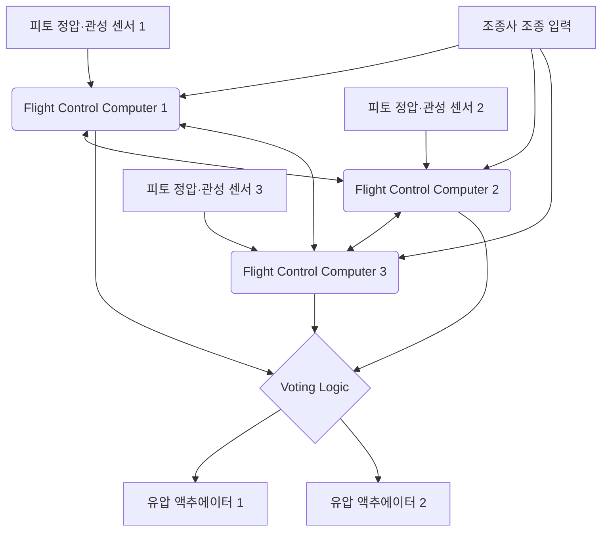

# 서론: 하늘을 나는 거대한 데이터 센터

현대의 제트 여객기는 단순한 공기역학적인 탈것이라는 틀을 크게 넘어, 고도의 실시간 OS로 구동되는 '하늘을 나는 거대 컴퓨터 네트워크'로 진화를 거듭하고 있습니다. 그 핵심을 이루는 것이 항공 전자 공학을 의미하는 '에비오닉스(Avionics)'와, 전기 신호로 기체를 제어하는 '플라이 바이 와이어(Fly-By-Wire: FBW)' 기술입니다. 본고에서는 항공 우주 공학 및 제어 공학의 관점에서, 이들 시스템의 근저에 있는 아키텍처, 제어 법칙(컨트롤 로), 그리고 보잉과 에어버스라는 세계 양대 항공기 제조업체가 엮어내는 '설계 철학의 대립'에 대해 매우 상세하고 학술적으로 깊이 파고들어 보겠습니다.

---

## 제1장: 항공기 조종의 역학과 유압에서 전기로의 혁명

### 고전적 조종계의 메커니즘과 그 한계

항공기가 하늘을 날기 위한 3차원적인 운동 제어는 피치(세로 기울기: 엘리베이터로 제어), 롤(가로 기울기: 에일러론으로 제어), 요(기수의 좌우 흔들림: 러더로 제어)의 3축으로 이루어져 있습니다. 항공의 여명기부터 1960년대 무렵까지의 제트 여객기(예를 들어 보잉 707이나 초기 737 등)에서는 조종석의 조종간(컨트롤 휠이나 요크)과 꼬리날개·주날개의 동익(컨트롤 서페이스)이 물리적인 금속제 케이블, 풀리(도르래), 그리고 로드의 복잡한 네트워크에 의해 직접 연결되어 있었습니다.

이 '기계식 조종계'의 가장 큰 장점은 매우 단순하고 직관적이라는 것이었습니다. 조종사가 조종간을 당기면 그 힘이 케이블을 통해 직접 엘리베이터를 움직이고, 타면에 닿는 공기 저항(풍압)이 반력(필 포스)으로서 조종간에 피드백됩니다. 이를 통해 조종사는 '기체가 지금 어느 정도의 공기역학적인 부하를 받고 있는지'를 직접 손으로 느낄 수 있었습니다.

그러나 항공기의 크기가 거대해지고, 순항 속도가 마하 0.8을 넘는 천음속 영역에 도달하면, 타면에 걸리는 공력 하중은 인간의 근력으로는 도저히 움직일 수 없을 정도로 거대해집니다. 이에 대응하기 위해 도입된 것이 '유압 액추에이터(Hydraulic Actuator)'입니다. 자동차의 파워 스티어링과 마찬가지로 케이블로 전달된 조종사의 입력이 유압 서보 밸브를 개폐하고, 3000psi(약 210기압)라는 초고압 유압이 실린더를 구동하여 동익을 움직입니다.

### 유압 기계식 제어의 과제와 Fly-By-Wire로의 필연성

유압 기구의 도입으로 거대한 기체의 조종은 가능해졌지만, 여전히 몇 가지 심각한 과제가 남아 있었습니다.

1. **무게와 복잡성의 증대**: 기체의 끝에서 끝까지 수백 미터에 달하는 강삭(케이블)이나 풀리를 둘러쳐야 했으며, 이것들은 수 톤에 달하는 사하중(데드 웨이트)이 됩니다. 또한 케이블의 늘어남이나 온도 변화에 따른 장력 변화를 보정하는 텐션 레귤레이터 등의 복잡한 기구가 필요했습니다.
2. **비선형적인 공력 특성 대응의 한계**: 기체의 공력 특성은 저속(이착륙 시)과 고속(순항 시)에서 극적으로 변화합니다. 기계식 시스템에서는 이러한 동적인 변화에 대해 스프링이나 댐퍼를 이용한 '인공 감각 기구(Artificial Feel System)'나 피치 트림 기구를 통해 물리적으로 대처해야 했으며, 최적의 조타 응답을 모든 비행 영역에서 얻는 것은 불가능했습니다.
3. **정적 안정성의 족쇄**: 기존 항공기는 조종사가 손을 놓아도 기체가 원래 자세로 돌아가려는 '정적 안정성(Static Stability)'을 갖게 하기 위해, 무게 중심을 풍압 중심보다 전방에 배치하고 수평 꼬리날개로 항상 아래쪽으로 향하는 양력을 발생시키는 설계가 필수적이었습니다. 이는 큰 트림 항력(Trim Drag)을 발생시켜 연비 악화의 큰 요인이 되었습니다.

이러한 물리적·공기역학적 한계를 타파하기 위해서는 조종사의 물리적인 조작과 동익의 움직임을 '분리'할 필요가 있었습니다. 그래서 등장한 것이 조종간의 움직임을 전기 신호(디지털 데이터)로 변환하고, 컴퓨터가 최적의 타각을 계산하여 동익의 유압(또는 전동) 액추에이터에 지령을 보내는 '플라이 바이 와이어(Fly-By-Wire: FBW)'입니다.

---

## 제2장: 플라이 바이 와이어의 시스템 아키텍처

플라이 바이 와이어의 심장부는 극한의 신뢰성을 요구받는 비행 제어 컴퓨터(Flight Control Computers: FCC) 네트워크입니다. 여객기의 FBW에서는 '10의 마이너스 9승(10^-9) 시간당 고장 확률(Catastrophic Failure Rate)', 즉 '10억 비행시간에 1회 이하의 치명적 고장'이라는 엄청난 신뢰성이 요구됩니다. 이를 실현하기 위한 아키텍처 설계야말로 FBW의 기술적인 진수입니다.

### 다중 중복계(Redundancy)와 투표 알고리즘(Voting)

단일 컴퓨터나 센서가 고장 나도 비행을 계속할 수 있도록 FBW는 삼중(Triplex) 또는 사중(Quadruplex)의 중복 구성을 취합니다. 예를 들어 보잉 777의 경우, Primary Flight Computer(PFC)가 3계통(Left, Center, Right) 존재하고, 나아가 각 PFC 내부가 3개의 계산 채널로 구성되어 있기 때문에 실질적으로 '3×3 = 9중'의 논리 아키텍처를 가지고 있습니다.

이 중복계에서 가장 중요한 것이 '동기화와 투표(Synchronization and Voting)' 알고리즘입니다.
여러 대의 컴퓨터가 동시에 같은 입력 데이터(조종사의 조작량, 대기 속도, 자세각 등)를 받아 같은 제어 법칙을 사용하여 계산을 수행합니다. 그리고 출력할 타각 지령값을 상호 비교(크로스 채널 데이터 링크)합니다.

투표 로직의 기본은 '다수결(Majority Rule)'입니다. 3대의 컴퓨터 중 2대가 '엘리베이터를 5도 올려라'라고 계산하고, 1대가 '10도 올려라'라고 계산했을 경우, 다수파인 5도가 옳다고 간주되며, 계산 결과가 벗어난 1대의 컴퓨터는 자동으로 네트워크에서 분리되고(Fail-Silent), 나머지 2대로 제어를 속행합니다(Fail-Operational).

### 이종 하드웨어와 소프트웨어에 의한 공통 원인 고장 배제(Dissimilarity)

삼중으로 중복화하더라도, 완전히 동일한 CPU와 완전히 동일한 프로그램을 사용했을 경우, 어떤 특정한 미지의 버그(소프트웨어의 결함)나 하드웨어 설계 실수(에라타)를 만나면 3대의 컴퓨터가 '동시에 같은 잘못된 답'을 낼 위험성이 있습니다. 이를 '공통 원인 고장(Common Mode/Cause Failure: CCF)'이라고 부릅니다.

이를 방지하기 위해 보잉과 에어버스는 '이종 병장 설계(Dissimilarity)'를 극한까지 추구하고 있습니다.
예를 들어 에어버스 A320에서는 메인 컴퓨터인 ELAC(Elevator Aileron Computer)와 SEC(Spoiler Elevator Computer)에서 완전히 다른 제조업체의 CPU를 채용하고 있습니다(예를 들어 한쪽은 Intel 계열, 다른 한쪽은 Motorola 계열). 또한 제어 소프트웨어 개발 팀을 물리적으로도 조직적으로도 완전히 분리하여, 다른 프로그래밍 언어(Ada 언어와 C 언어 등)와 다른 컴파일러를 사용하여 같은 요구 사양서에서 코드를 별도로 작성하게 합니다. 이를 통해 한쪽 소프트웨어에 버그가 있더라도 다른 쪽 소프트웨어에 같은 버그가 존재할 확률을 수학적으로 거의 제로에 가깝게 억제하고 있습니다.

### 에비오닉스 데이터 버스: ARINC 429와 ARINC 664 (AFDX)

이러한 센서, 컴퓨터, 액추에이터를 잇는 통신 네트워크(에비오닉스 데이터 버스)도 독자적인 진화를 이루었습니다.

1980년대부터 오랫동안 표준이었던 것이 'ARINC 429' 규격입니다. 이것은 1대 다수의 단방향(단신) 시리얼 버스로, 1가닥의 트위스트 페어 케이블을 사용하여 32비트 데이터 워드를 100kbps(또는 12.5kbps)로 전송합니다. 구조가 매우 단순하고 확실(Deterministic)하기 때문에 현재도 많은 서브 시스템에서 사용되고 있습니다.

그러나 A380이나 B787, A350과 같은 최신예기에서는 통신 데이터량이 폭발적으로 증가하여 ARINC 429와 같은 Point-to-Point 배선으로는 케이블 중량이 한계에 달했습니다. 그래서 도입된 것이 'ARINC 664 Part 7(통칭: AFDX - Avionics Full-Duplex Switched Ethernet)'입니다.
AFDX는 우리가 일상적으로 사용하는 이더넷(IEEE 802.3) 기술을 기반으로 하면서도 항공기용으로 '절대적인 통신 지연 보장(Bounded Latency)'과 '대역폭 할당'을 강제하는 프로필을 추가한 것입니다. 가상 링크(Virtual Link: VL)라는 개념을 사용하여 각 데이터 스트림에 대해 네트워크 스위치(AFDX 스위치)가 대역을 엄격하게 관리함으로써 패킷의 충돌이나 손실이 절대 일어나지 않는 결정론적(Deterministic)인 이더넷 망을 구축하고 있습니다. 이를 통해 수백 대의 기기가 고속 100Mbps/1Gbps 네트워크상에서 실시간으로 통신할 수 있게 되었습니다.

---

## 제3장: 플라이트 컨트롤 법칙(Flight Control Laws)

FBW의 가장 큰 혜택은 조종사의 물리적인 조종 입력(Stick Input)을 그대로 동익의 각도(Surface Angle)로 변환하는 것이 아니라, 컴퓨터가 '조종사가 기체를 어떻게 움직이고 싶어 하는가'라는 의도(Intent)를 해석하여 현재 비행 상태(속도, 고도, 중량 등)에 맞게 최적의 타각을 산출하는 '제어 법칙(Control Laws)'을 구현할 수 있다는 점에 있습니다.

### C*(시스타) 법칙: 피치 제어의 혁명

최신 여객기(보잉 777/787이나 에어버스 A320 이후)의 세로 방향(피치) 제어에 채용되고 있는 것이 'C*(시스타) 제어 법칙' 또는 그 발전형인 'C*U 법칙'입니다.

기존 항공기(또는 다이렉트 로 상태)에서는 조종간을 당기는 양이 '엘리베이터의 타각'에 비례했습니다. 하지만 저속일 때와 고속일 때 같은 타각이라도 기체의 반응(피칭 속도나 발생하는 G)이 전혀 다릅니다.
이에 반해 C* 법칙에서는 조종사가 조종간을 움직이는 것을 '피치 레이트(기수가 상하로 움직이는 각속도: q)'와 '수직 가속도(G 하중: Nz)'의 '합성 목표치를 지령하고 있다'고 해석합니다.

$$ C^* = K_1 \cdot q + K_2 \cdot N_z $$

(여기서 $K_1, K_2$는 속도 등에 의해 변화하는 게인)

- **저속 시(이착륙 시 등)**: 공력적인 G가 발생하기 어렵기 때문에 컴퓨터는 주로 '피치 레이트(q)'를 피드백하여 기수를 올리고 내리는 속도를 제어합니다.
- **고속 시(순항 시)**: 기수를 조금만 올려도 강렬한 G가 발생하기 때문에 컴퓨터는 주로 '수직 가속도(Nz)'를 피드백하여 조종사의 입력에 상응하는 일정한 G를 발생시키도록 동익을 제어합니다.

이를 통해 조종사는 비행 속도와 관계없이 '조종간을 같은 양만큼 당기면 항상 같은 감각으로 기체가 반응한다'는 매우 안정된 조종 특성을 얻을 수 있습니다.

### 페일세이프 계층 구조: 노멀, 얼터네이트, 다이렉트

항공기는 센서나 컴퓨터 고장에 대비하여 제어 법칙의 다운그레이드(Degradation) 계층을 가지고 있습니다. 에어버스의 명칭을 예로 들면 다음과 같이 계층화되어 있습니다.

1. **노멀 로(Normal Law)**
   모든 시스템(ADIRU, 컴퓨터 등)이 정상적인 상태. C* 법칙에 의한 완전한 조종감 보정과 후술할 완전한 '비행 영역 보호(Flight Envelope Protection)'가 유효한 상태입니다. 오토파일럿도 정상적으로 사용할 수 있습니다.
2. **얼터네이트 로(Alternate Law)**
   다중화된 센서 중 일부가 고장 나 확실한 데이터(예를 들어 정확한 대기 속도 등)를 얻을 수 없게 된 상태. 기본적인 자세 제어(피치 레이트나 롤 레이트)의 피드백은 기능하지만 비행 영역 보호(실속 방지 기능 등)의 일부 또는 전부가 해제됩니다.
3. **다이렉트 로(Direct Law)**
   다수의 컴퓨터나 센서가 고장(Fail) 나서 복잡한 계산이 불가능해진 최종 백업 상태. FBW는 단순한 '전기 케이블'이 되며 조종간의 움직임이 직접 동익의 타각에 비례하여 전달됩니다(비례 제어). 비행 영역 보호는 일절 없으며 고전적인 항공기와 완전히 같은 조종감(단, 속도에 따른 감도 변화가 그대로 나타남)이 됩니다.

### 플라이트 엔벨로프 프로텍션(비행 영역 보호)

FBW가 가져온 최대의 안전 기술이 바로 이것입니다. 항공기에는 안전하게 비행할 수 있는 한계 영역(엔벨로프)이 있습니다. 속도(실속 속도와 한계 마하 수), 뱅크각, 피치각, G 로드(하중 배수) 등입니다. FBW는 기체가 이 한계를 넘으려 할 때 컴퓨터가 개입하여 그것을 방지합니다.

- **피치 자세 보호**: 기수 올림 각도가 일정 이상(예: +30도) 또는 기수 내림 각도(예: -15도)를 넘지 않도록 제한.
- **뱅크각 보호**: 롤 각도가 일정 이상(예: 67도)이 되지 않도록 에일러론 제어.
- **실속 보호(Alpha Protection)**: 받음각(Angle of Attack: AoA, Alpha)이 실속 한계에 가까워지면 조종사가 조종간을 계속 당겨도 컴퓨터가 더 이상의 기수 올림을 거부하고 엔진 추력을 자동으로 최대화(TOGA)하여 실속을 피합니다.

---

## 제4장: 보잉 vs 에어버스: 결정적인 설계 철학의 대립

FBW 기술 도입에 있어 민간 항공 업계를 양분하는 보잉과 에어버스는 '조종석 설계와 인간 및 기계의 권한 위임'과 관련하여 전혀 다른 설계 철학을 가지고 있습니다. 이는 현대 항공 공학에서 가장 흥미로운 논쟁 중 하나입니다.

### 에어버스의 철학: "컴퓨터에 의한 절대적 보호와 하드 리미트"

1988년에 취항한 A320은 세계 최초의 완전 디지털 FBW 여객기입니다. 에어버스의 기본 철학은 "**인간은 실수한다. 고로, 궁극적인 안전은 컴퓨터 계산에 의한 하드 리미트(절대적 제한)를 통해 지켜져야 한다**"는 것입니다.

1. **사이드 스틱 도입**:
   에어버스는 전통적인 양손잡이용 조종간(요크)을 폐지하고 전투기와 같은 사이드 스틱을 기장석 왼쪽, 부조종사석 오른쪽에 배치했습니다. 이는 계기판의 시인성을 극적으로 향상시켰습니다.
2. **조종간의 비연동성**:
   기장과 부조종사의 사이드 스틱은 물리적으로 연결되어 있지 않습니다. 한쪽이 조작해도 다른 쪽 스틱은 움직이지 않습니다(동시 입력 시에는 입력이 대수 가산되거나 우선 버튼으로 제어권을 뺏음).
3. **하드 프로텍션(Hard Envelope Protection)**:
   노멀 로가 유효한 한, 조종사가 의도적이든 패닉 상태든 사이드 스틱을 한계까지 계속 당기고 있더라도 기체는 절대 실속 받음각을 넘지 않으며 뱅크각도 제한값을 넘지 않습니다. 즉 "컴퓨터가 조종사의 조작을 오버라이드(거부)할" 권한을 가지고 있습니다.

### 보잉의 철학: "최종적인 결정권은 항상 조종사에게 있다(소프트 리미트)"

반면 보잉이 1995년에 취항시킨 최초의 FBW 기종 B777(그리고 후속 B787)에서는 "**어떤 상황에서든 현장 상황을 가장 잘 파악하고 있는 인간 조종사가 최종 결정권을 가져야 한다**"는 철학을 관철하고 있습니다.

1. **전통적인 컨트롤 휠(요크) 유지**:
   보잉은 사이드 스틱을 도입하지 않고 기존의 요크를 남겼습니다. FBW 기종이라도 바닥 아래 기구로 기장석과 부조종사석의 요크는 물리적(또는 전기적 서보)으로 연동하여 움직입니다. 이를 통해 조종사끼리 상대의 조작을 촉각적·시각적으로 인식할 수 있습니다.
2. **인공 감각 기구(Artificial Feel)와 백 드라이브**:
   오토파일럿이 조종하고 있을 때도 동익의 움직임에 맞춰 조종석의 요크가 물리적으로 움직입니다(에어버스의 사이드 스틱은 움직이지 않음). 또한 속도에 따라 요크를 움직이는 무게(조타력)를 시뮬레이션하는 액추에이터가 내장되어 있어 조종사에게 '공기역학적인 감각'을 유사하게 전달합니다.
3. **소프트 프로텍션(Soft Envelope Protection)**:
   보잉 기종에도 실속 보호나 뱅크각 제한은 있지만 그것은 '절대적인 벽'이 아닙니다. 기체가 한계에 다다르면 조종간이 눈에 띄게 무거워져 조종사에게 경고를 주지만, 조종사가 '더 강한 힘(예를 들어 약 22.5kg 이상의 힘)'으로 조종간을 계속 당기면 시스템의 설정 한계를 '돌파(Override)'하여 한계 이상의 기동을 하는 것이 가능합니다. 이는 "컴퓨터가 상정하지 않은, 예를 들어 미사일 회피나 지형 충돌 회피와 같은 극한 상황에서는 기체가 부서지더라도 회피 행동을 취할 권한을 조종사에게 남겨두어야 한다"는 사상에 기반합니다.

이 '기계를 믿을 것인가, 인간을 믿을 것인가'라는 철학의 차이는 현재에 이르기까지 양사 조종석 설계의 근본적인 차이로 계속 나타나고 있습니다.

---

## 제5장: 센서 퓨전과 자동 착륙(Autoland)

FBW 시스템의 고도화는 계기 착륙 장치(ILS: Instrument Landing System)나 GPS 기반 GLS(GBAS Landing System)와 연동된 완전한 자동 착륙(Autoland) 구현에 필수적이었습니다. 짙은 안개로 시정이 거의 제로(Cat IIIb/IIIc 조건)인 상태에서도 수백 명의 승객을 태운 수백 톤의 기체를 활주로 중앙선에 연착륙시키는 기술은 제어 공학의 극치입니다.

### 공간을 파악하는 센서군(ADIRU)

정확한 제어를 위해서는 기체가 공간의 어디에 있고, 어떤 자세로, 어떻게 움직이고 있는지를 매우 높은 정밀도로 알아야 합니다. 이를 담당하는 것이 'Air Data Inertial Reference Unit(ADIRU: 대기 데이터·관성 기준 장치)'입니다.

- **에어 데이터(대기 데이터)**: 기체 외부에 설치된 피토관(동압 측정)과 정압공(정압 측정), 온도 센서를 통해 대기 속도(Airspeed), 고도(Altitude), 마하 수, 받음각(AoA)을 계산합니다.
- **관성 기준(IRS: Inertial Reference System)**: 링 레이저 자이로(RLG)나 광섬유 자이로(FOG)로 기체의 3축 각속도와 가속도를 고정밀로 검출하고 이를 적분하여 기체의 자세(피치, 롤, 요)와 지구상 절대 좌표(위도·경도)를 자율적으로 산출합니다.

현대 에비오닉스에서는 이 ADIRU 데이터에 GPS(GNSS) 신호를 칼만 필터 등을 이용해 융합(센서 퓨전)하고, 표류 오차를 계속 보정함으로써 수 센티미터에서 수 미터 단위의 정밀한 항법 해를 얻고 있습니다.

### 자동 착륙의 제어 루프와 플레어·롤아웃

ILS를 이용한 자동 착륙에서는 지상에서 발사되는 로컬라이저 전파(활주로 중심선)와 글라이드 슬로프 전파(약 3도 강하각)를 기상 안테나로 수신하고, FCC가 그 전파 빔의 중심에 기체를 올리도록 피드백 제어를 수행합니다.

1. **어프로치 페이즈(Approach Phase)**:
   고도 약 1500피트에서 3계통 오토파일럿이 모두 인게이지되고 다수결 로직이 활성화됩니다(Fail-Operational 상태). ILS 오차 신호를 제로로 만들도록 피치와 롤을 연속적으로 미세 조정합니다.
2. **크랩 앵글(Crab Angle)과 측풍 보정**:
   측풍(옆바람)이 있을 경우 기체는 바람이 불어오는 쪽으로 기수를 향한 비스듬한 자세(크랩 자세)로 강하합니다.
3. **디크랩(Decrab)과 플레어(Flare)**:
   전파 고도계(Radio Altimeter)가 고도 약 50피트를 감지하면 오토파일럿은 자동으로 '플레어 모드'로 이행합니다. 기수를 약간 들어 올려 강하율을 낮추고(보통 150fpm 정도로) 접지 시 충격을 완화합니다. 동시에 측풍이 있을 경우 러더를 차서 기수를 활주로 방향으로 정대시키고(디크랩), 바람에 밀리지 않게 에일러론을 조작하여 롤 각도를 주고 바람맞이 쪽 메인 기어부터 접지시킵니다. 이 복잡한 다중 파라미터 다변수 제어를 컴퓨터는 인간으로서는 불가능한 밀리초 단위 정밀도로 실행합니다.
4. **롤아웃(Rollout)**:
   접지 후에도 오토파일럿은 로컬라이저 신호를 계속 따라가며 러더와 노즈 휠(앞바퀴) 스티어링을 자동 제어하여 활주로 중심선 위를 똑바로 감속합니다. 동시에 스포일러 자동 전개, 오토 브레이크에 의한 일정한 감속률 제동도 컴퓨터가 관리합니다.

---

## 제6장: 에비오닉스의 미래와 자율 비행

FBW와 에비오닉스는 현재도 급속한 진화를 거듭하고 있으며 차세대 항공 업계의 모습을 크게 탈바꿈시키려 하고 있습니다.

### 통합 모듈형 에비오닉스(IMA: Integrated Modular Avionics)

기존 항공기에서는 오토파일럿, 비행 관리 시스템(FMS), 차륜 제어, 공조 제어 등 기능마다 전용의 독립된 컴퓨터(LRU: Line Replaceable Unit)가 탑재되어 있었습니다. 하지만 이는 무게나 소비 전력, 비용 낭비를 낳았습니다.
현대의 B787이나 A350 등에서는 '통합 모듈형 에비오닉스(IMA)' 아키텍처가 채용되고 있습니다. 이는 범용 고성능 블레이드 서버와 같은 공통 컴퓨팅 모듈(CCM)을 기내에 여러 개 배치하고, 그 위에서 ARINC 653 규격에 기반한 실시간 OS(RTOS)를 구동시킵니다. RTOS의 '시간과 공간 파티셔닝(Time and Space Partitioning)' 기술을 통해 같은 CPU·메모리 상에서 '크리티컬한 비행 제어 소프트웨어'와 '기내 엔터테인먼트 제어 소프트웨어'를 완전히 격리하여 동시 실행하는 것이 가능해졌습니다. 이를 통해 하드웨어의 대폭적인 삭감과 경량화를 실현하고 있습니다.

### 플라이 바이 라이트(Fly-By-Light)와 전동화(More Electric Aircraft)

데이터 버스의 진화로서 구리선을 광섬유로 대체하는 '플라이 바이 라이트(FBL)' 연구가 진행되고 있습니다. 광섬유는 초광대역이자 경량임과 동시에 낙뢰(Lightning Strike)나 강력한 전자기 간섭(EMI / EMP)에 대해 완전히 무적이라는 항공기에 매우 유리한 특성을 가지고 있습니다.

또한 '모어 일렉트릭 에어크래프트(MEA: 전기 항공기)' 개념에 의해 기존의 무거운 유압 배관 시스템에서 모터로 직접 동익을 구동하는 '전동 기계식 액추에이터(EMA)'나 액추에이터 내부에 완결된 독립 유압 펌프를 갖는 '전동 정유압 액추에이터(EHA)'로의 이행이 시작되고 있습니다(A380이나 B787 백업 계통에서 실용화 완료). 이로써 유압 누출로 인한 전체 시스템 상실 위험이 줄어들고 연비가 더욱 향상됩니다.

### AI 도입과 1인 조종사 운항(SPO), 그리고 완전 자율 비행으로

궁극의 미래로 에비오닉스에 인공지능(AI)이나 머신러닝 도입이 논의되고 있습니다. 현재의 FBW는 어디까지나 '인간이 프로그램한 확정적인 로직(Deterministic Logic)'으로 작동하지만, 복잡한 기상 조건이나 미지의 기체 손상 시 AI가 순식간에 새로운 제어 법칙을 학습·재구축하여 비행을 유지하는 적응형 제어(Adaptive Control) 연구가 진행되고 있습니다.

또한 조종사 부족 대책으로 현재 기장과 부조종사 2인 체제인 여객기를 순항 중에만이라도 1인 체제(Single Pilot Operations: SPO)로 줄이고 부조종사의 역할을 고도 자율형 에비오닉스나 지상의 원격 오퍼레이터가 대체하는 구상(eMCO 등)이 에어버스 등을 중심으로 본격적으로 테스트되고 있습니다. 플라이 바이 와이어의 궁극적인 귀결은 조종석에서 인간 조종사가 완전히 모습을 감추는 '완전 자율 여객기'일지도 모릅니다.

---

## 결어

'플라이 바이 와이어'는 단순히 케이블을 전선으로 대체한 기술이 아닙니다. 그것은 항공기를 공기역학적 제약에서 해방하고 제어 공학, 정보 공학, 그리고 네트워크 기술의 정수를 모은 '하늘을 나는 시스템 오브 시스템즈'로 탈바꿈시킨 패러다임 시프트입니다.
보잉과 에어버스의 설계 철학 차이에서 볼 수 있듯 그곳에는 '인간의 역할이란 무엇인가'라는 근원적인 질문이 항상 존재합니다. 향후 AI와 자율화가 더욱 진전되는 가운데 에비오닉스 기술은 우리의 하늘 여행을 더욱 안전하게, 더욱 효율적으로, 그리고 더욱 조용하게 계속 지원할 것입니다.

## 부록: Fly-By-Wire의 수학적 모델링과 전달 함수(Transfer Functions)

FBW 시스템의 학술적인 이해를 돕기 위해 항공기 세로 운동(피치 축)에서의 기본적인 전달 함수와 피드백 제어 블록선도 모델에 대해 보충합니다.

### 항공기 동특성 모델(Short Period 모드)

항공기의 세로 운동은 주로 단주기 모드(Short Period Mode)와 장주기 모드(푸고이드 모드: Phugoid Mode) 두 가지로 분해됩니다. FBW의 C* 법칙이나 피치 레이트 제어가 직접적으로 감쇠·안정화시키는 것은 이 '단주기 모드'입니다.

엘리베이터의 타각 $\delta_e$에서 피치 레이트 $q$로의 전달 함수 $G(s) = \frac{q(s)}{\delta_e(s)}$는 일반적인 선형화된 강체 운동 방정식에서 다음과 같이 근사됩니다.

$$ \frac{q(s)}{\delta_e(s)} = \frac{K_q(T_{\theta_2}s + 1)}{s^2 + 2\zeta_{sp}\omega_{sp}s + \omega_{sp}^2} $$

여기서:
- $K_q$는 제어 정상 게인(속도나 동압에 크게 의존)
- $T_{\theta_2}$는 피칭 운동과 궤도 경로(Flight Path) 변화의 위상 지연 시정수
- $\zeta_{sp}$는 단주기 모드의 감쇠비(Damping Ratio)
- $\omega_{sp}$는 단주기 모드의 고유 각주파수(Natural Frequency)

기존 기계식 조종계에서는 고고도나 고속 영역에서 공력 감쇠가 저하되어 $\zeta_{sp}$가 매우 작아지는(기체가 피치 방향으로 진동하기 쉬워지는) 문제가 있었습니다.

### 피드백 제어에 의한 특성 개선

FBW 시스템에서는 자이로 센서(ADIRU)로 측정한 피치 레이트 $q_{sensor}$와 수직 가속도 $N_z$를 컴퓨터에 피드백하고, 조종사의 지령치 $q_{cmd}$(혹은 $C^*_{cmd}$)와의 오차 $e$를 계산합니다.

가장 기본적인 피치 레이트 피드백 제어(비례·적분 제어: PI 제어)를 도입했을 경우의 폐루프 전달 함수를 생각해 봅니다. 제어기(Controller)의 전달 함수를 $C(s) = K_p + \frac{K_i}{s}$라고 하면 컨트롤러에서 출력되는 타각 지령 $\delta_c$는:

$$ \delta_c(s) = C(s) \left( q_{cmd}(s) - q_{sensor}(s) \right) $$

여기에 유압 액추에이터의 1차 지연 특성 $G_a(s) = \frac{1}{\tau_a s + 1}$을 곱하면 실제 타각 $\delta_e$가 됩니다.

시스템 전체 폐루프 전달 함수 $G_{closed}(s) = \frac{q(s)}{q_{cmd}(s)}$의 분모 다항식(특성 방정식) 극(Poles)을 적절한 게인 $K_p, K_i$를 게인 스케줄링(Gain Scheduling)으로 설정하여 임의의 속도 영역에서 최적의 $\zeta$(보통 0.7 근처)와 $\omega_n$을 실현합니다. 이를 통해 물리적인 꼬리날개 크기나 무게 중심 위치와 관계없이 항상 '이상적인 비행기'의 조종 특성을 소프트웨어 상에서 에뮬레이트할 수 있는 것입니다. 이것이 FBW에 의한 '인공적 안정성(Artificial Stability)'의 수학적 본질입니다.
