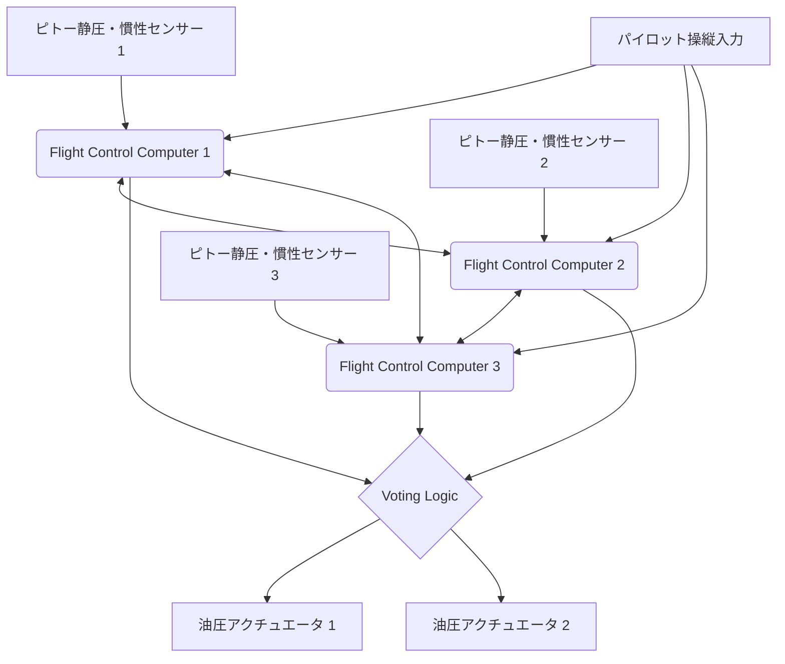

# はじめに：空を飛ぶ巨大なデータセンター

現代のジェット旅客機は、単なる空力学的な乗り物という枠組みを大きく超え、高度なリアルタイムOSで稼働する「空飛ぶ巨大コンピュータネットワーク」へと進化を遂げています。その中核を成すのが、航空電子工学を意味する「アビオニクス（Avionics）」と、電気信号によって機体を制御する「フライ・バイ・ワイヤ（Fly-By-Wire: FBW）」技術です。本稿では、航空宇宙工学および制御工学の観点から、これらシステムの根底にあるアーキテクチャ、制御則（コントロール・ロー）、そしてボーイングとエアバスという世界の二大航空機メーカーが織りなす「設計哲学の対立」について、極めて詳細かつ学術的な深掘りを行っていきます。

---

## 第1章：航空機操縦の力学と油圧から電気への革命

### 古典的操縦系のメカニズムとその限界

航空機が空を飛ぶための三次元的な運動制御は、ピッチ（縦の傾き：エレベーターで制御）、ロール（横の傾き：エルロンで制御）、ヨー（機首の左右の振り：ラダーで制御）の3軸から成り立っています。航空の黎明期から1960年代頃までのジェット旅客機（例えばボーイング707や初期の737など）では、コックピットの操縦桿（コントロールホイールやヨーク）と尾翼・主翼の動翼（コントロールサーフェス）は、物理的な金属製ケーブル、プーリー（滑車）、そしてロッドの複雑なネットワークによって直接結ばれていました。

この「機械式操縦系」の最大の利点は、極めてシンプルかつ直感的であることでした。パイロットが操縦桿を引けば、その力がケーブルを介して直接エレベーターを動かし、舵面に当たる空気抵抗（風圧）が反力（ヒール・フォース）として操縦桿にフィードバックされます。これにより、パイロットは「機体が今どれほどの空気力学的な負荷を受けているか」を直接手で感じ取ることができました。

しかし、航空機のサイズが巨大化し、巡航速度がマッハ0.8を超える遷音速領域に達すると、舵面にかかる空力荷重は人間の筋力では到底動かせないほど巨大になります。これに対応するため導入されたのが「油圧アクチュエータ（Hydraulic Actuator）」です。自動車のパワーステアリングと同様に、ケーブルで伝達されたパイロットの入力が油圧サーボバルブを開閉し、3000psi（約210気圧）という超高圧の油圧がシリンダーを駆動して動翼を動かします。

### 油圧機械式制御の課題とFly-By-Wireへの必然性

油圧機構の導入によって巨大な機体の操縦は可能になりましたが、依然としていくつかの深刻な課題が残されていました。

1. **重量と複雑さの増大**：機体の端から端まで、何百メートルにも及ぶ鋼索（ケーブル）やプーリーを張り巡らせる必要があり、これらは数トンものデッドウェイト（死重）となります。また、ケーブルの伸びや温度変化による張力変化を補正するテンション・レギュレータなどの複雑な機構が必要でした。
2. **非線形な空力特性への対応の限界**：機体の空力特性は、低速（離着陸時）と高速（巡航時）で劇的に変化します。機械式システムでは、この動的な変化に対してバネやダンパーを用いた「人工感覚機構（Artificial Feel System）」や、ピッチ・トリム機構によって物理的に対処しなければならず、最適な操舵応答を全飛行領域で得ることは不可能でした。
3. **静的安定性の足かせ**：従来の航空機は、パイロットが手を放しても機体が元の姿勢に戻ろうとする「静的安定性（Static Stability）」を持たせるために、重心を風圧中心より前方に配置し、水平尾翼で常に下向きの揚力を発生させる設計が必須でした。これは大きなトリム抗力（Trim Drag）を生み出し、燃費悪化の大きな要因となっていました。

これらの物理的・空気力学的限界を打破するためには、パイロットの物理的な操作と動翼の動きを「切り離す」必要がありました。そこで登場したのが、操縦桿の動きを電気信号（デジタルデータ）に変換し、コンピュータが最適な舵角を計算して動翼の油圧（または電動）アクチュエータに指令を送る「フライ・バイ・ワイヤ（Fly-By-Wire: FBW）」です。

---

## 第2章：フライ・バイ・ワイヤのシステムアーキテクチャ

フライ・バイ・ワイヤの心臓部は、極限の信頼性を要求される飛行制御コンピュータ（Flight Control Computers: FCC）のネットワークです。旅客機のFBWでは「10のマイナス9乗（10^-9）時間あたりの故障確率（Catastrophic Failure Rate）」、つまり「10億飛行時間に1回以下の致命的故障」という、途方もない信頼性が要求されます。これを実現するためのアーキテクチャ設計こそが、FBWの技術的な真髄です。

### 多重冗長系（Redundancy）と投票アルゴリズム（Voting）

単一のコンピュータやセンサーが故障しても飛行を継続できるよう、FBWは三重（Triplex）または四重（Quadruplex）の冗長構成をとります。例えばボーイング777の場合、Primary Flight Computer（PFC）が3系統（Left, Center, Right）存在し、さらにそれぞれのPFC内部が3つの計算チャンネルで構成されているため、実質的に「3×3 = 9重」の論理アーキテクチャを持っています。

この冗長系において最も重要なのが「同期と投票（Synchronization and Voting）」のアルゴリズムです。
複数のコンピュータが同時に同じ入力データ（パイロットの操作量、対気速度、姿勢角など）を受け取り、同じ制御則を用いて計算を行います。そして、出力する舵角指令値を相互に比較（クロスチャネル・データリンク）します。

投票ロジックの基本は「多数決（Majority Rule）」です。3つのコンピュータのうち2つが「エレベーターを5度上げろ」と計算し、1つが「10度上げろ」と計算した場合、多数派である5度が正しいと見なされ、計算結果が逸脱している1つのコンピュータは自動的にネットワークから切り離され（Fail-Silent）、残りの2つで制御を続行します（Fail-Operational）。

### 異種ハードウェアとソフトウェアによる共通原因故障の排除（Dissimilarity）

三重に冗長化しても、全く同じCPUと全く同じプログラムを使っていた場合、ある特定の未知のバグ（ソフトウェアの欠陥）やハードウェアの設計ミス（エラッタ）に遭遇すると、3台のコンピュータが「同時に同じ間違った答え」を出してしまう危険性があります。これを「共通原因故障（Common Mode/Cause Failure: CCF）」と呼びます。

これを防ぐため、ボーイングやエアバスは「異種並長設計（Dissimilarity）」を極限まで追求しています。
例えばエアバスA320では、メインコンピュータであるELAC（Elevator Aileron Computer）とSEC（Spoiler Elevator Computer）において、全く異なるメーカーのCPUを採用しています（例えば一方はIntel系、もう一方はMotorola系）。さらに、制御ソフトウェアの開発チームを物理的にも組織的にも完全に分離し、異なるプログラミング言語（Ada言語とC言語など）と異なるコンパイラを使用して、同じ要求仕様書から別々にコードを記述させます。これにより、一方のソフトウェアにバグがあっても、他方のソフトウェアには同じバグが存在する確率を数学的にほぼゼロに抑え込んでいます。

### アビオニクスデータバス：ARINC 429 と ARINC 664 (AFDX)

これらのセンサー、コンピュータ、アクチュエータを結ぶ通信ネットワーク（アビオニクスデータバス）も独自の進化を遂げています。

1980年代から長らく標準であったのが「ARINC 429」規格です。これは1対多の一方向（単信）シリアルバスで、1本のツイストペアケーブルを使用して32ビットのデータワードを100kbps（または12.5kbps）で送信します。構造が極めてシンプルで確実（Deterministic）であるため、現在でも多くのサブシステムで使用されています。

しかし、A380やB787、A350といった最新鋭機では、通信データ量が爆発的に増加し、ARINC 429のようなPoint-to-Pointの配線ではケーブル重量が限界に達しました。そこで導入されたのが「ARINC 664 Part 7（通称：AFDX - Avionics Full-Duplex Switched Ethernet）」です。
AFDXは、私たちが日常的に使用しているイーサネット（IEEE 802.3）技術をベースにしながら、航空機向けに「絶対的な通信遅延の保証（Bounded Latency）」と「帯域幅の割り当て」を強制するプロファイルを追加したものです。仮想リンク（Virtual Link: VL）という概念を用い、各データストリームに対してネットワークスイッチ（AFDXスイッチ）が帯域を厳密に管理することで、パケットの衝突や喪失が絶対に起きない決定論的（Deterministic）なイーサネット網を構築しています。これにより、数百の機器が高速な100Mbps/1Gbpsネットワーク上でリアルタイムに通信可能となりました。

---

## 第3章：フライトコントロール則（Flight Control Laws）

FBWの最大の恩恵は、パイロットの物理的な操縦入力（Stick Input）をそのまま動翼の角度（Surface Angle）に変換するのではなく、コンピュータが「パイロットが機体をどう動かしたいのか」という意図（Intent）を解釈し、現在の飛行状態（速度、高度、重量など）に応じて最適な舵角を算出する「制御則（Control Laws）」を実装できる点にあります。

### C*（シースター）則：ピッチ制御の革命

最新の旅客機（ボーイング777/787やエアバスA320以降）の縦方向（ピッチ）制御において採用されているのが「C*（シースター）制御則」またはその発展形である「C*U則」です。

従来の航空機（またはダイレクト・ロー状態）では、操縦桿の引き量は「エレベーターの舵角」に比例していました。しかし低速時と高速時では同じ舵角でも機体の反応（ピッチングの速度や発生するG）が全く異なります。
これに対し、C*則では、パイロットが操縦桿を動かすことは「ピッチレート（機首の上下する角速度：q）」と「垂直加速度（G荷重：Nz）」の『合成目標値を指令している』と解釈します。

$$ C^* = K_1 \cdot q + K_2 \cdot N_z $$

（ここで $K_1, K_2$ は速度等によって変化するゲイン）

- **低速時（離着陸時など）**：空力的なGが発生しにくいため、コンピュータは主に「ピッチレート（q）」をフィードバックして機首の上げ下げの速度を制御します。
- **高速時（巡航時）**：少し機首を上げるだけで強烈なGが発生するため、コンピュータは主に「垂直加速度（Nz）」をフィードバックして、パイロットの入力に応じた一定のGを発生させるように動翼を制御します。

これにより、パイロットは飛行速度に関わらず「操縦桿を同じだけ引けば、常に同じ感覚で機体が反応する」という、極めて安定した操縦特性を得ることができます。

### フェイルセーフ階層構造：ノーマル、オルタネート、ダイレクト

航空機はセンサーやコンピュータの故障に備え、制御則のダウングレード（Degradation）階層を持っています。エアバスの呼称を例に取ると、以下のように階層化されています。

1. **ノーマル・ロー（Normal Law）**
   全てのシステム（ADIRU、コンピュータなど）が正常な状態。C*則による完全な操縦感の補正と、後述する完全な「飛行領域保護（Flight Envelope Protection）」が有効な状態です。オートパイロットも正常に使用可能です。
2. **オルタネート・ロー（Alternate Law）**
   多重化されたセンサーの一部が故障し、確実なデータ（例えば正確な対気速度など）が得られなくなった状態。基本的な姿勢制御（ピッチレートやロールレート）のフィードバックは機能しますが、飛行領域保護（失速防止機能など）の一部または全部が解除されます。
3. **ダイレクト・ロー（Direct Law）**
   多数のコンピュータやセンサーがフェイルし、複雑な計算が不可能になった最終バックアップ状態。FBWは単なる「電気的なケーブル」となり、操縦桿の動きが直接、動翼の舵角に比例して伝達されます（比例制御）。飛行領域保護は一切なく、古典的な航空機と全く同じ操縦感（ただし速度による感度変化がモロに出る）となります。

### フライト・エンベロープ・プロテクション（飛行領域保護）

FBWがもたらした最大の安全技術がこれです。航空機には安全に飛行できる限界領域（エンベロープ）があります。速度（失速速度と限界マッハ数）、バンク角、ピッチ角、Gロード（荷重倍数）などです。FBWは、機体がこの限界を超えようとした際、コンピュータが介入してそれを防ぎます。

- **ピッチ姿勢保護**：機首上げ角が一定以上（例：+30度）または機首下げ角（例：-15度）を超えないよう制限。
- **バンク角保護**：ロール角が一定以上（例：67度）にならないようにエルロンを制御。
- **失速保護（Alpha Protection）**：迎え角（Angle of Attack: AoA、Alpha）が失速限界に近づくと、パイロットが操縦桿を引き続けてもコンピュータがそれ以上の機首上げを拒否し、エンジン推力を自動的に最大（TOGA）にして失速を回避します。

---

## 第4章：ボーイング vs エアバス：決定的な設計哲学の対立

FBW技術の導入において、民間航空業界を二分するボーイングとエアバスは、全く異なる「コックピット設計と人間と機械の権限委譲」に関する設計哲学を持っています。これは現代航空工学における最も興味深い議論の一つです。

### エアバスの哲学：「コンピュータによる絶対的な保護とハードリミット」

1988年に就航したA320は、世界初の完全デジタルFBW旅客機です。エアバスの基本哲学は「**人間はミスをする。ゆえに、究極的な安全はコンピュータの計算によるハードリミット（絶対的制限）によって守られなければならない**」というものです。

1. **サイドスティックの採用**：
   エアバスは伝統的な両手持ちの操縦桿（ヨーク）を廃止し、戦闘機のようなサイドスティックを機長席の左側・副操縦士席の右側に配置しました。これは計器盤の視認性を劇的に向上させました。
2. **操縦桿の非連動性**：
   機長と副操縦士のサイドスティックは物理的に繋がっていません。片方が操作しても、もう片方のスティックは動きません（デュアルインプット時は入力が代数加算されるか、優先ボタンで奪い合う）。
3. **ハード・プロテクション（Hard Envelope Protection）**：
   ノーマル・ローが有効な限り、パイロットが意図的であれパニック状態であれ、サイドスティックを限界まで引きっぱなしにしても、機体は絶対に失速迎え角を超えず、バンク角も制限値を超えません。つまり「コンピュータがパイロットの操作をオーバーライド（拒否）する」権限を持っています。

### ボーイングの哲学：「最終的な決定権は常にパイロットにある（ソフトリミット）」

一方、ボーイングが1995年に就航させた初のFBW機、B777（および後のB787）では、「**どんな状況であれ、現場の状況を最もよく把握している人間のパイロットが最終的な決定権を持つべきである**」という哲学を貫いています。

1. **伝統的なコントロールホイール（ヨーク）の維持**：
   ボーイングはサイドスティックを採用せず、従来のヨークを残しました。FBW機であっても、床下の機構で機長席と副操縦士席のヨークは物理的（または電気的サーボ）に連動して動きます。これにより、パイロット同士が相手の操作を触覚的・視覚的に認識できます。
2. **人工感覚機構（Artificial Feel）とバックドライブ**：
   オートパイロットが操縦している際も、動翼の動きに合わせてコックピットのヨークが物理的に動きます（エアバスのサイドスティックは動かない）。また、速度に応じてヨークを動かす重さ（操舵力）をシミュレートするアクチュエータが組み込まれており、パイロットに「空気力学的な手応え」を擬似的に伝えます。
3. **ソフト・プロテクション（Soft Envelope Protection）**：
   ボーイング機にも失速保護やバンク角制限はありますが、それは「絶対的な壁」ではありません。機体が限界に近づくと操縦桿が劇的に重くなりパイロットに警告を与えますが、パイロットが「さらに強い力（例えば約22.5kg以上の力）」で操縦桿を引き続ければ、システムの設定限界を「突破（Override）」して限界以上の機動を行うことが可能です。これは「コンピュータが想定していない、例えばミサイル回避や地形衝突回避といった極限状況では、機体が壊れてでも回避行動を取る権限をパイロットに残すべきだ」という思想に基づいています。

この「機械を信じるか、人間を信じるか」という哲学の違いは、現在に至るまで両社のコックピット設計の根本的な違いとして表れ続けています。

---

## 第5章：センサーフュージョンと自動着陸（Autoland）

FBWシステムの高度化は、計器着陸装置（ILS: Instrument Landing System）やGPSベースのGLS（GBAS Landing System）と連動した、完全なる自動着陸（Autoland）の実現に不可欠でした。濃霧で視程がほぼゼロ（Cat IIIb/IIIc条件）の状態でも、何百人もの乗客を乗せた数百トンの機体を滑走路のセンターラインに軟着陸させる技術は、制御工学の極致です。

### 空間を把握するセンサー群（ADIRU）

正確な制御のためには、機体が空間のどこにいて、どの姿勢で、どう動いているかを極めて高い精度で知る必要があります。これを担うのが「Air Data Inertial Reference Unit（ADIRU：大気データ・慣性基準装置）」です。

- **エアデータ（大気データ）**：機体外部に設置されたピトー管（動圧を計測）と静圧孔（静圧を計測）、温度センサーにより、対気速度（Airspeed）、高度（Altitude）、マッハ数、迎え角（AoA）を計算します。
- **慣性基準（IRS: Inertial Reference System）**：リングレーザージャイロ（RLG）や光ファイバージャイロ（FOG）によって機体の3軸の角速度と加速度を高精度に検出し、それを積分することで機体の姿勢（ピッチ、ロール、ヨー）と地球上での絶対座標（緯度・経度）を自律的に算出します。

現代のアビオニクスでは、これらADIRUのデータにGPS（GNSS）の信号をカルマンフィルタ等を用いて融合（センサーフュージョン）し、ドリフト誤差を補正し続けることで、数センチから数メートル単位の精密な航法解を得ています。

### 自動着陸の制御ループとフレア・ロールアウト

ILSを用いた自動着陸では、地上から発射されるローカライザー電波（滑走路の中心線）とグライドスロープ電波（約3度の降下角）を機上のアンテナで受信し、FCCがその電波のビーム中心に機体を乗せるようにフィードバック制御を行います。

1. **アプローチ・フェーズ（Approach Phase）**：
   高度約1500フィートで3系統のオートパイロットが全てエンゲージされ、多数決ロジックがアクティブになります（Fail-Operational状態）。ILSの誤差信号をゼロにするよう、ピッチとロールを連続的に微調整します。
2. **クラブ・アングル（Crab Angle）と横風補正**：
   横風がある場合、機体は風上へ機首を向けた斜めの姿勢（クラブ姿勢）で降下します。
3. **デクラブ（Decrab）とフレア（Flare）**：
   電波高度計（Radio Altimeter）が高度約50フィートを検知すると、オートパイロットは自動的に「フレア・モード」に移行します。機首をわずかに上げて降下率を下げ（通常150fpm程度へ）、接地時の衝撃を和らげます。同時に、横風がある場合はラダーを蹴って機首を滑走路の方向に正対させ（デクラブ）、風に流されないようエルロンを当ててロール角をつけ、風上側のメインギアから接地させます。この複雑なマルチパラメーター多変数制御を、コンピュータは人間には不可能なミリ秒単位の精度で実行します。
4. **ロールアウト（Rollout）**：
   接地後もオートパイロットはローカライザー信号を追い続け、ラダーとノーズホイール（前輪）ステアリングを自動制御して滑走路の中心線上を真っ直ぐに減速します。同時にスポイラーの自動展開、オートブレーキによる一定の減速率での制動もコンピュータが管理します。

---

## 第6章：アビオニクスの未来と自律飛行

FBWとアビオニクスは現在も急速な進化を遂げており、次世代の航空業界の姿を大きく変容させようとしています。

### 統合モジュラーアビオニクス（IMA：Integrated Modular Avionics）

従来の航空機では、オートパイロット、フライトマネジメントシステム（FMS）、車輪制御、空調制御など、機能ごとに専用の独立したコンピュータ（LRU: Line Replaceable Unit）が搭載されていました。しかしこれは重量や消費電力、コストの無駄を生んでいました。
現代のB787やA350などでは「統合モジュラーアビオニクス（IMA）」アーキテクチャが採用されています。これは、汎用的な高性能ブレードサーバーのような共通コンピューティングモジュール（CCM）を機内にいくつか配置し、その上でARINC 653規格に基づくリアルタイムOS（RTOS）を稼働させます。RTOSの「時間と空間のパーティショニング（Time and Space Partitioning）」技術により、同じCPU・メモリ上で「クリティカルな飛行制御ソフトウェア」と「機内エンターテインメントの制御ソフトウェア」を完全に隔離して同時実行することが可能になりました。これにより、ハードウェアの大幅な削減と軽量化が実現しています。

### フライ・バイ・ライト（Fly-By-Light）と電動化（More Electric Aircraft）

データバスの進化として、銅線を光ファイバーに置き換える「フライ・バイ・ライト（FBL）」の研究が進んでいます。光ファイバーは超広帯域かつ軽量であることに加え、雷撃（Lightning Strike）や強力な電磁干渉（EMI / EMP）に対して完全に無敵であるという航空機にとって極めて有利な特性を持っています。

また、「モア・エレクトリック・エアクラフト（MEA：電気の航空機）」の概念により、従来の重い油圧配管システムから、モーターで直接動翼を駆動する「電動メカニカルアクチュエータ（EMA）」や、アクチュエータ内部に完結した独立油圧ポンプを持つ「電動静油圧アクチュエータ（EHA）」への移行が始まっています（A380やB787のバックアップ系統で実用化済）。これにより、油圧漏れによる全システム喪失のリスクが減少し、燃費がさらに向上します。

### AIの導入とシングルパイロット運航（SPO）、そして完全自律飛行へ

究極の未来として、アビオニクスへの人工知能（AI）や機械学習の導入が議論されています。現在のFBWはあくまで「人間がプログラムした確定的なロジック（Deterministic Logic）」で動いていますが、複雑な気象条件や未知の機体損傷時に、AIが瞬時に新たな制御則を学習・再構築して飛行を維持する適応型制御（Adaptive Control）の研究が進められています。

また、パイロット不足への対策として、現在は機長と副操縦士の2名体制である旅客機を、巡航中だけでも1名体制（Single Pilot Operations: SPO）に減らし、副操縦士の役割を高度な自律型アビオニクスや地上の遠隔オペレーターに代替させる構想（eMCOなど）が、エアバス等を中心に本格的にテストされています。フライ・バイ・ワイヤの究極の帰結は、コックピットから人間のパイロットが完全に姿を消す「完全自律旅客機」なのかもしれません。

---

## 結語

「フライ・バイ・ワイヤ」は、単にケーブルを電線に置き換えた技術ではありません。それは航空機を空力学的制約から解放し、制御工学、情報工学、そしてネットワーク技術の粋を集めた「空を飛ぶシステム・オブ・システムズ」へと変貌させたパラダイムシフトです。
ボーイングとエアバスの設計哲学の違いに見られるように、そこには「人間の役割とは何か」という根源的な問いが常に存在しています。今後、AIと自律化がさらに進展する中で、アビオニクス技術は私たちの空の旅を、より安全に、より効率的に、そしてより静かに支え続けていくことでしょう。

## 付録：Fly-By-Wireの数学的モデリングと伝達関数（Transfer Functions）

FBWシステムの学術的な理解を深めるため、航空機の縦の運動（ピッチ軸）における基本的な伝達関数とフィードバック制御のブロック線図モデルについて補足します。

### 航空機の動特性モデル（Short Period モード）

航空機の縦の運動は、主に短周期モード（Short Period Mode）と長周期モード（フゴイドモード: Phugoid Mode）の2つに分解されます。FBWのC*則やピッチ・レート制御が直接的に減衰・安定化させるのは、この「短周期モード」です。

エレベーターの舵角 $\delta_e$ からピッチレート $ への伝達関数 (s) = \frac{q(s)}{\delta_e(s)}$ は、一般的な線形化された剛体運動方程式から次のように近似されます。

\frac{q(s)}{\delta_e(s)} = \frac{K_q(T_{\theta_2}s + 1)}{s^2 + 2\zeta_{sp}\omega_{sp}s + \omega_{sp}^2}

ここで：
- $ は制御の定常ゲイン（速度や動圧に大きく依存）
- {\theta_2}$ はピッチング運動と軌道経路（Flight Path）変化の位相遅れ時定数
- $\zeta_{sp}$ は短周期モードの減衰比（Damping Ratio）
- $\omega_{sp}$ は短周期モードの固有角周波数（Natural Frequency）

従来の機械式操縦系では、高高度や高速域において空力減衰が低下し、$\zeta_{sp}$ が非常に小さくなる（機体がピッチ方向に振動しやすくなる）という問題がありました。

### フィードバック制御による特性の改善

FBWシステムでは、ジャイロセンサー（ADIRU）で測定したピッチレート $ と垂直加速度 $ をコンピュータにフィードバックし、パイロットの指令値 {cmd}$（あるいは ^*_{cmd}$）との誤差 $ を計算します。

最も基本的なピッチレート・フィードバック制御（比例・積分制御：PI制御）を導入した場合の閉ループ伝達関数を考えます。制御器（Controller）の伝達関数を (s) = K_p + \frac{K_i}{s}$ とすると、コントローラから出力される舵角指令 $\delta_c$ は：

 \delta_c(s) = C(s) \left( q_{cmd}(s) - q_{sensor}(s) \right) 

これに油圧アクチュエータの1次遅れ特性 (s) = \frac{1}{\tau_a s + 1}$ を掛けると、実際の舵角 $\delta_e$ となります。

システム全体の閉ループ伝達関数 {closed}(s) = \frac{q(s)}{q_{cmd}(s)}$ の分母多項式（特性方程式）の極（Poles）を、適切なゲイン , K_i$ をゲイン・スケジューリング（Gain Scheduling）によって設定することで、任意の速度域において最適な $\zeta$（通常0.7近辺）と $\omega_n$ を実現します。これにより、物理的な尾翼の大きさや重心位置に関わらず、常に「理想的な飛行機」の操縦特性をソフトウェア上でエミュレートできるのです。これがFBWによる「人工的安定性（Artificial Stability）」の数学的な本質です。

