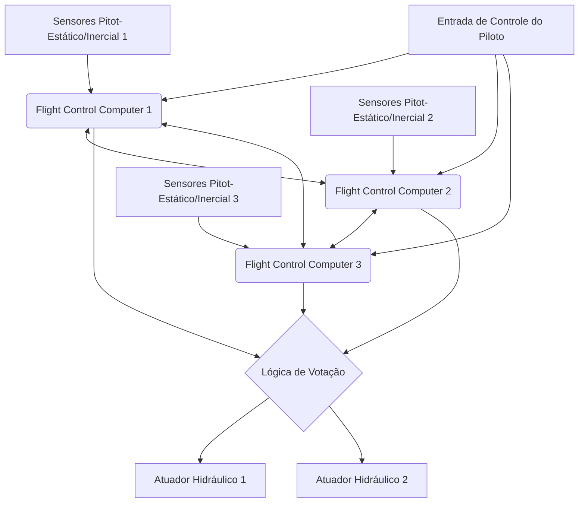

# Introdução: Gigantescos Centros de Dados Voadores

Os jatos comerciais modernos transcenderam a estrutura de meros veículos aerodinâmicos, evoluindo para "gigantescas redes de computadores voadores" operando em sistemas operacionais de tempo real avançados. No centro disso estão a "Aviônica" (Avionics), que significa eletrônica de aviação, e a tecnologia "Fly-By-Wire" (FBW), que controla a aeronave por meio de sinais elétricos. Neste artigo, sob a perspectiva da engenharia aeroespacial e de controle, mergulharemos de forma extremamente detalhada e acadêmica na arquitetura subjacente desses sistemas, nas leis de controle (control laws) e no "conflito de filosofias de design" tecido pelos dois maiores fabricantes de aeronaves do mundo, a Boeing e a Airbus.

---

## Capítulo 1: A Mecânica do Controle de Aeronaves e a Revolução Hidráulica para Elétrica

### O Mecanismo do Sistema de Controle Clássico e suas Limitações

O controle de movimento tridimensional para uma aeronave voar consiste em três eixos: arfagem ou pitch (inclinação longitudinal: controlada pelo profundor), rolamento ou roll (inclinação lateral: controlada pelo aileron) e guinada ou yaw (balanço lateral do nariz: controlado pelo leme). Nos jatos comerciais desde os primórdios da aviação até por volta da década de 1960 (como o Boeing 707 e os primeiros 737), o manche de controle na cabine de comando e as superfícies de controle (control surfaces) nas asas e na cauda eram diretamente conectados por uma complexa rede de cabos de metal físicos, polias e hastes.

A maior vantagem desse "sistema de controle mecânico" era ser extremamente simples e intuitivo. Quando o piloto puxava o manche, essa força movia diretamente o profundor através de cabos, e a resistência do ar (pressão do vento) atingindo a superfície de controle era devolvida (feedback) como uma força de reação (feel force) no manche. Isso permitia que o piloto sentisse fisicamente com as mãos "quanta carga aerodinâmica a aeronave estava sofrendo no momento".

No entanto, à medida que as aeronaves se tornavam maiores e a velocidade de cruzeiro atingia o regime transônico, ultrapassando Mach 0,8, a carga aerodinâmica nas superfícies de controle tornava-se tão imensa que a força muscular humana não conseguia movê-las de forma alguma. Para lidar com isso, foram introduzidos os "Atuadores Hidráulicos" (Hydraulic Actuators). Semelhante à direção hidráulica de um carro, a entrada do piloto, transmitida pelos cabos, abre e fecha servoválvulas hidráulicas, e a pressão hidráulica ultra-alta de 3000 psi (cerca de 210 atmosferas) aciona os cilindros para mover as superfícies de controle.

### Os Desafios do Controle Mecânico Hidráulico e a Necessidade do Fly-By-Wire

Embora a introdução de mecanismos hidráulicos tenha tornado possível controlar grandes aeronaves, vários desafios sérios ainda permaneciam.

1. **Aumento de Peso e Complexidade**: Foi necessário instalar centenas de metros de cabos de aço e polias de uma ponta à outra da aeronave, resultando em várias toneladas de peso morto (dead weight). Além disso, mecanismos complexos como reguladores de tensão eram necessários para compensar o alongamento dos cabos e as mudanças de tensão devido a variações de temperatura.
2. **Limites no Tratamento de Características Aerodinâmicas Não Lineares**: As características aerodinâmicas de uma aeronave mudam drasticamente entre baixas velocidades (decolagem e pouso) e altas velocidades (cruzeiro). Em sistemas mecânicos, essas mudanças dinâmicas tinham que ser tratadas fisicamente usando mecanismos como o "Sistema de Sensação Artificial" (Artificial Feel System), que utiliza molas e amortecedores, e mecanismos de compensação de pitch (trim), tornando impossível obter a resposta de direção ideal em todo o envelope de voo.
3. **Obstáculo para a Estabilidade Estática**: Nas aeronaves convencionais, para ter "Estabilidade Estática" (Static Stability) — onde a aeronave tenta retornar à sua atitude original quando o piloto solta os controles —, era essencial projetar o centro de gravidade à frente do centro de pressão aerodinâmico, exigindo que o estabilizador horizontal gerasse constantemente uma sustentação descendente. Isso criava um grande arrasto de compensação (Trim Drag), sendo um fator importante no aumento do consumo de combustível.

Para superar essas limitações físicas e aerodinâmicas, era necessário "desacoplar" a operação física do piloto do movimento das superfícies de controle. Daí o surgimento do "Fly-By-Wire (FBW)", que converte o movimento do manche em sinais elétricos (dados digitais) e um computador calcula o ângulo ideal da superfície para enviar comandos aos atuadores hidráulicos (ou elétricos).

---

## Capítulo 2: Arquitetura do Sistema Fly-By-Wire

O coração do Fly-By-Wire é uma rede de Computadores de Controle de Voo (Flight Control Computers: FCC), que requer confiabilidade extrema. Para o FBW de aviões comerciais, exige-se uma confiabilidade espantosa de "taxa de falha catastrófica de 10 à potência de menos 9 (10^-9) por hora", ou seja, "menos de uma falha fatal por bilhão de horas de voo". O projeto da arquitetura para atingir isso é a verdadeira essência técnica do FBW.

### Redundância Múltipla (Redundancy) e Algoritmo de Votação (Voting)

Para que o voo possa continuar mesmo que um único computador ou sensor falhe, o FBW usa configurações redundantes triplas (Triplex) ou quádruplas (Quadruplex). Por exemplo, no Boeing 777, existem três sistemas de Computador de Voo Primário (Primary Flight Computer - PFC) (Esquerdo, Central, Direito), e internamente cada PFC é composto por três canais de computação, dando-lhe efetivamente uma arquitetura lógica "3 x 3 = 9 vezes" redundante.

O aspecto mais importante desta configuração redundante é o algoritmo de "Sincronização e Votação" (Synchronization and Voting).
Múltiplos computadores recebem simultaneamente os mesmos dados de entrada (entradas de controle do piloto, velocidade do ar, ângulo de atitude, etc.) e realizam cálculos utilizando a mesma lei de controle. Em seguida, comparam o valor do comando de ângulo de superfície de saída entre si (link de dados entre canais).

O básico da lógica de votação é a "Regra da Maioria" (Majority Rule). Se dois dos três computadores calcularem "elevar o profundor em 5 graus" e um calcular "elevar em 10 graus", os 5 graus da maioria são considerados corretos, e o computador com o resultado desviante é automaticamente desconectado da rede (Fail-Silent), enquanto o controle continua com os dois restantes (Fail-Operational).

### Eliminação de Falha de Causa Comum Através de Hardware e Software Dissimilares (Dissimilarity)

Mesmo com tripla redundância, se exatamente a mesma CPU e o mesmo programa forem usados, existe o perigo de que, ao encontrar um bug desconhecido (defeito de software) específico ou erro de projeto de hardware (errata), os três computadores produzam "a mesma resposta errada simultaneamente". Isso é chamado de "Falha de Modo/Causa Comum" (Common Mode/Cause Failure: CCF).

Para evitar isso, a Boeing e a Airbus buscam a extrema "Dissimilaridade" (Dissimilarity).
Por exemplo, no Airbus A320, os computadores principais, ELAC (Elevator Aileron Computer) e SEC (Spoiler Elevator Computer), usam CPUs de fabricantes completamente diferentes (por exemplo, um é baseado em Intel e o outro em Motorola). Além disso, as equipes de desenvolvimento do software de controle são fisicamente e organizacionalmente separadas por completo e usam diferentes linguagens de programação (como Ada e C) e diferentes compiladores para escrever códigos separadamente a partir das mesmas especificações de requisitos. Através disso, mesmo que haja um bug no software de um lado, a probabilidade matemática do mesmo bug existir no outro software é reduzida a quase zero.

### Barramento de Dados Aviônico: ARINC 429 e ARINC 664 (AFDX)

A rede de comunicação (barramento de dados aviônico) que conecta esses sensores, computadores e atuadores também evoluiu de forma independente.

O padrão que tem sido usado por muito tempo desde a década de 1980 é o padrão "ARINC 429". É um barramento serial unidirecional de um para muitos (simplex) que transmite palavras de dados de 32 bits a 100 kbps (ou 12,5 kbps) usando um único cabo de par trançado. Devido à sua estrutura extremamente simples e determinística (Deterministic), ainda é usado em muitos subsistemas hoje.

No entanto, em aeronaves de ponta como o A380, B787 e A350, o volume de dados de comunicação explodiu, e a fiação ponto a ponto como a do ARINC 429 atingiu o limite de peso do cabo. É aí que entrou o "ARINC 664 Parte 7 (comumente conhecido como AFDX - Avionics Full-Duplex Switched Ethernet)".
O AFDX é baseado na tecnologia Ethernet (IEEE 802.3) que usamos diariamente, mas adiciona um perfil que força a "Latência Limitada Garantida" (Bounded Latency) e a "alocação de largura de banda" para aeronaves. Usando o conceito de um Link Virtual (Virtual Link: VL), os switches de rede (switches AFDX) gerenciam rigorosamente a largura de banda para cada fluxo de dados, construindo uma rede Ethernet determinística onde colisões ou perdas de pacotes nunca podem ocorrer. Isso possibilitou que centenas de dispositivos se comunicassem em tempo real através de uma rede de alta velocidade de 100 Mbps/1 Gbps.

---

## Capítulo 3: Leis de Controle de Voo (Flight Control Laws)

O maior benefício do FBW não é simplesmente converter a entrada de controle físico do piloto (Stick Input) no ângulo da superfície de controle (Surface Angle), mas implementar "Leis de Controle" (Control Laws) onde o computador interpreta a intenção (Intent) do "que o piloto quer que a aeronave faça" e calcula o ângulo ideal da superfície com base nas condições atuais de voo (velocidade, altitude, peso, etc.).

### Lei C* (C-Star): A Revolução do Controle de Arfagem

A "lei de controle C* (C-Star)", ou sua evolução "lei C*U", é adotada no controle longitudinal (arfagem) das aeronaves comerciais mais recentes (Boeing 777/787 e Airbus A320 em diante).

Em aeronaves convencionais (ou em estado de Direct Law), a quantidade de tração no manche era proporcional ao "ângulo do profundor". No entanto, mesmo com o mesmo ângulo, a reação da aeronave (taxa de arfagem ou Força G gerada) é completamente diferente em baixas e altas velocidades.
Em contraste, na lei C*, o movimento do manche pelo piloto é interpretado como comandar "um valor alvo composto de 'taxa de arfagem' (velocidade angular do nariz movendo-se para cima e para baixo: q) e 'aceleração vertical' (carga G: Nz)".

$$ C^* = K_1 \cdot q + K_2 \cdot N_z $$

(onde $K_1, K_2$ são ganhos que mudam com a velocidade, etc.)

- **Em baixas velocidades (decolagem e pouso, etc.)**: Como é difícil gerar G aerodinâmico, o computador usa principalmente o feedback da "taxa de arfagem (q)" para controlar a velocidade do nariz levantando e abaixando.
- **Em altas velocidades (cruzeiro)**: Como uma Força G intensa é gerada apenas levantando ligeiramente o nariz, o computador usa principalmente o feedback da "aceleração vertical (Nz)" para controlar as superfícies de forma a gerar uma Força G constante em resposta à entrada do piloto.

Através disso, os pilotos podem obter características de manuseio extremamente estáveis onde, independentemente da velocidade de voo, "puxar o manche a mesma quantia resultará sempre na aeronave respondendo com a mesma sensação".

### Estrutura Hierárquica Fail-Safe: Normal, Alternate e Direct

As aeronaves possuem uma hierarquia de degradação (Degradation) das leis de controle em preparação para falhas em sensores ou computadores. Tomando como exemplo a nomenclatura da Airbus, ela é hierarquizada da seguinte forma:

1. **Normal Law (Lei Normal)**
   O estado onde todos os sistemas (ADIRU, computadores, etc.) estão normais. A correção completa da sensação de controle via lei C* e a completa "Proteção do Envelope de Voo" (Flight Envelope Protection) descritas abaixo estão ativas. O piloto automático também está totalmente disponível.
2. **Alternate Law (Lei Alternativa)**
   O estado onde parte dos sensores multiplexados falharam, e dados confiáveis (por exemplo, velocidade do ar precisa) não podem mais ser obtidos. O feedback de controle de atitude básico (taxa de arfagem e taxa de rolagem) funciona, mas parte ou toda a proteção do envelope de voo (como a prevenção de estol) é desativada.
3. **Direct Law (Lei Direta)**
   O estado de backup final onde muitos computadores e sensores falharam, tornando impossíveis os cálculos complexos. O FBW torna-se um mero "cabo elétrico" e o movimento do manche é transmitido diretamente em proporção ao ângulo das superfícies de controle (controle proporcional). Não há proteção de envelope de voo, e a sensação de controle é exatamente a mesma de uma aeronave clássica (no entanto, a sensibilidade muda drasticamente de acordo com a velocidade).

### Flight Envelope Protection (Proteção do Envelope de Voo)

Esta é a maior tecnologia de segurança trazida pelo FBW. Uma aeronave tem um limite (envelope) dentro do qual pode voar com segurança. Isso inclui velocidade (velocidade de estol e número Mach limite), ângulo de inclinação, ângulo de arfagem e carga G (fator de carga). O FBW garante que quando a aeronave tenta exceder esses limites, o computador intervém para impedi-lo.

- **Proteção de Atitude de Arfagem**: Limita o ângulo de nariz para cima (ex: +30 graus) ou o ângulo de nariz para baixo (ex: -15 graus) para que não exceda um determinado limite.
- **Proteção do Ângulo de Inclinação (Bank Angle)**: Controla os ailerons para garantir que o ângulo de rolagem não exceda um certo limite (ex: 67 graus).
- **Proteção de Estol (Alpha Protection)**: Quando o ângulo de ataque (Angle of Attack: AoA, Alpha) se aproxima do limite de estol, mesmo que o piloto continue puxando o manche, o computador recusa qualquer elevação adicional do nariz e maximiza automaticamente o empuxo do motor (TOGA) para evitar o estol.

---

## Capítulo 4: Boeing vs Airbus: O Conflito Decisivo de Filosofia de Projeto

Ao introduzir a tecnologia FBW, a Boeing e a Airbus, que dividem a indústria da aviação comercial, têm filosofias de design completamente diferentes em relação a "design do cockpit e a delegação de autoridade entre humano e máquina". Este é um dos debates mais fascinantes da engenharia aeronáutica moderna.

### A Filosofia da Airbus: "Proteção Absoluta e Limites Rígidos por Computador"

O A320, que entrou em serviço em 1988, foi o primeiro avião comercial FBW totalmente digital do mundo. A filosofia básica da Airbus é que "**Humanos cometem erros. Portanto, a segurança máxima deve ser protegida pelos limites rígidos (restrições absolutas) calculados por computadores**".

1. **Adoção do Sidestick**:
   A Airbus aboliu a tradicional coluna de controle com as duas mãos (manche ou yoke) e colocou sidesticks estilo caça à esquerda do assento do comandante e à direita do assento do copiloto. Isso melhorou drasticamente a visibilidade do painel de instrumentos.
2. **Desvinculação dos Controles**:
   Os sidesticks do comandante e do copiloto não estão fisicamente conectados. Se um mover o seu, o outro stick não se move (se ambos fizerem input, as entradas são adicionadas algebricamente, ou eles competem pelo controle através de um botão de prioridade).
3. **Proteção Rígida (Hard Envelope Protection)**:
   Desde que o Normal Law esteja ativo, não importa se o piloto pretende ou está em pânico, puxar o sidestick até o limite nunca permitirá que a aeronave exceda o ângulo de ataque de estol ou os limites de inclinação. Em outras palavras, "o computador tem autoridade para anular (rejeitar) as ações do piloto".

### A Filosofia da Boeing: "A Autoridade de Decisão Final é Sempre do Piloto (Limites Suaves)"

Por outro lado, no B777 (e mais tarde no B787), a primeira aeronave FBW da Boeing introduzida em 1995, eles mantiveram a filosofia de que "**Qualquer que seja a situação, o piloto humano, que melhor entende a situação local, deve ter a autoridade final de decisão**".

1. **Manutenção da Roda de Controle (Yoke) Tradicional**:
   A Boeing não adotou sidesticks e manteve o manche tradicional (yoke). Mesmo em aeronaves FBW, os yokes do comandante e do copiloto estão fisicamente (ou através de servos elétricos) interligados sob o piso e se movem juntos. Isso permite que os pilotos reconheçam tátil e visualmente os inputs de controle de cada um.
2. **Sistema de Sensação Artificial (Artificial Feel) e Backdrive**:
   Mesmo quando o piloto automático está voando, os yokes do cockpit movem-se fisicamente de acordo com o movimento da superfície de controle (os sidesticks da Airbus não). Atuadores também são embutidos para simular a força (peso) necessária para mover o yoke de acordo com a velocidade, transmitindo artificialmente "feedback aerodinâmico" aos pilotos.
3. **Proteção Suave (Soft Envelope Protection)**:
   As aeronaves da Boeing também têm proteção contra estol e limite de inclinação, mas não são "barreiras absolutas". Conforme a aeronave se aproxima do limite, o manche se torna drasticamente mais pesado, avisando o piloto. No entanto, se o piloto continuar a puxar o manche com "uma força mais forte (por exemplo, mais de 22,5 kg)", é possível "anular (Override)" os limites do sistema e realizar manobras além dos limites normais. Isso é baseado na filosofia de que "em situações extremas imprevistas pelo computador, como evitar mísseis ou colisões com o solo, a autoridade para tomar ações evasivas, mesmo que quebre a aeronave, deve ser deixada para o piloto".

A diferença na filosofia "confiar na máquina ou confiar no humano" continua a se manifestar como uma diferença fundamental nos designs dos cockpits de ambas as empresas até hoje.

---

## Capítulo 5: Fusão de Sensores e Pouso Automático (Autoland)

O avanço dos sistemas FBW foi essencial para a realização de um pouso automático completo (Autoland) em conjunto com o Sistema de Pouso por Instrumentos (ILS) ou o Sistema de Pouso GLS baseado em GPS. Sobreviver a condições de visibilidade quase zero em nevoeiro denso (Cat IIIb/IIIc) e pousar com suavidade uma aeronave de centenas de toneladas com centenas de passageiros na linha central da pista é o auge da engenharia de controle.

### O Grupo de Sensores para Perceber o Espaço (ADIRU)

Para controle preciso, é necessário saber com altíssima precisão onde a aeronave está no espaço, qual é a sua atitude e como ela está se movendo. Isso é gerenciado pela "Unidade de Referência Inercial e de Dados do Ar (ADIRU: Air Data Inertial Reference Unit)".

- **Air Data (Dados do Ar)**: Através do tubo Pitot (que mede a pressão dinâmica), porta estática (que mede a pressão estática) e sensores de temperatura instalados fora da aeronave, ele calcula a Velocidade do Ar (Airspeed), Altitude (Altitude), Número Mach e Ângulo de Ataque (AoA).
- **Referência Inercial (IRS: Inertial Reference System)**: Usando giroscópios de anel de laser (RLG) ou giroscópios de fibra óptica (FOG), detecta a velocidade angular de 3 eixos e a aceleração da aeronave com alta precisão e as integra para calcular de forma autônoma a atitude da aeronave (arfagem, rolamento, guinada) e coordenadas absolutas (latitude/longitude) na Terra.

Na aviônica moderna, esses dados ADIRU e sinais GPS (GNSS) são mesclados (fusão de sensores) usando filtros de Kalman e outros, e corrigindo continuamente os erros de deriva, obtendo-se soluções de navegação precisas na faixa de centímetros a metros.

### Loop de Controle de Pouso Automático e Flare/Rollout

Em um pouso automático usando ILS, antenas a bordo recebem as ondas de rádio do localizador emitidas do solo (linha central da pista) e do glideslope (ângulo de descida de cerca de 3 graus). O FCC então usa o controle de feedback para colocar a aeronave no centro desse feixe de rádio.

1. **Fase de Aproximação (Approach Phase)**:
   A aproximadamente 1500 pés, todos os três sistemas de piloto automático são acionados, e a lógica da maioria se torna ativa (estado Fail-Operational). Ele ajusta continuamente o arfagem e rolamento (pitch e roll) para anular o sinal de erro do ILS.
2. **Ângulo de Caranguejo (Crab Angle) e Correção de Vento Cruzado**:
   No caso de vento cruzado, a aeronave desce em uma atitude diagonal (atitude crab) apontando seu nariz contra o vento.
3. **Decrab e Arredondamento (Flare)**:
   Quando o Rádio Altímetro (Radio Altimeter) detecta uma altitude de cerca de 50 pés, o piloto automático passa automaticamente para o modo "flare". O nariz é ligeiramente levantado para reduzir a taxa de descida (geralmente em torno de 150 fpm) para suavizar o impacto do toque. Ao mesmo tempo, se houver vento cruzado, o leme é chutado para alinhar o nariz com a pista (decrab), e ailerons são aplicados para estabelecer um ângulo de rolagem para que a aeronave não seja levada pelo vento, tocando o solo primeiro com o trem principal do lado do vento. Esse controle multivariável complexo com vários parâmetros é executado pelo computador com precisão de milissegundos, o que é impossível para humanos.
4. **Desaceleração na Pista (Rollout)**:
   Após o toque no solo, o piloto automático continua a rastrear o sinal do localizador e controla automaticamente o leme e o volante do trem de pouso do nariz (steering) para desacelerar em linha reta ao longo do centro da pista. Ao mesmo tempo, o computador também gerencia o acionamento automático de spoilers e a frenagem automática a uma taxa de desaceleração constante pelos freios automáticos (autobrake).

---

## Capítulo 6: O Futuro da Aviônica e do Voo Autônomo

O FBW e a aviônica ainda estão evoluindo rapidamente e estão mudando muito o formato da próxima geração da aviação.

### Aviônica Modular Integrada (IMA: Integrated Modular Avionics)

Nas aeronaves tradicionais, computadores independentes dedicados (LRU: Line Replaceable Unit) eram instalados para cada função, como piloto automático, sistema de gerenciamento de voo (FMS), controle de trem de pouso e controle de ar condicionado. No entanto, isso resultava em desperdício de peso, consumo de energia e custos.
Em aviões modernos como o B787 e o A350, a arquitetura "Aviônica Modular Integrada (IMA)" é adotada. Ela coloca vários Módulos de Computação Comum (CCM) em toda a aeronave, semelhantes a servidores blade de uso geral e alto desempenho, executando um Sistema Operacional de Tempo Real (RTOS) baseado no padrão ARINC 653. Devido à tecnologia de "Particionamento de Espaço e Tempo" (Time and Space Partitioning) do RTOS, é possível isolar completamente e executar "software de controle de voo crítico" e "software de controle de entretenimento de bordo" na mesma CPU e memória simultaneamente. Isso resultou em reduções maciças de hardware e economia de peso.

### Fly-By-Light e Eletrificação (More Electric Aircraft)

Como uma evolução dos barramentos de dados, a pesquisa sobre "Fly-By-Light (FBL)" para substituir os fios de cobre por fibra óptica está avançando. Fibras ópticas, além de serem ultrabandas e ultraleves, têm propriedades extremamente vantajosas para aeronaves por serem totalmente invulneráveis a Raios (Lightning Strike) e severa Interferência Eletromagnética (EMI / EMP).

Também, devido ao conceito da "More Electric Aircraft (MEA: Aeronave Mais Elétrica)", está em andamento uma transição dos convencionais e pesados sistemas de tubulação hidráulica para "Atuadores Eletromecânicos (EMA)" acionando diretamente as superfícies através de motores, e "Atuadores Hidrostáticos Eletricamente Acionados (EHA)" tendo bombas hidráulicas independentes contidas dentro dos atuadores (já colocados em uso prático nos sistemas de backup do A380 e B787). Isso reduz os riscos de perda de sistema inteiro devido a vazamento hidráulico e melhora ainda mais a eficiência de combustível.

### Introdução da IA, Operação por Piloto Único (SPO) e Voo Totalmente Autônomo

Como o futuro final, a introdução de inteligência artificial (IA) e aprendizado de máquina na aviônica está sendo discutida. Os sistemas FBW atuais operam estritamente por "Lógica Determinística programada por humanos", mas está em andamento pesquisa sobre Controle Adaptativo (Adaptive Control), em que sob condições climáticas severas ou danos imprevistos, a IA pode aprender instantaneamente e reconstruir novas leis de controle para manter o voo.

Além disso, como contra-medida contra a escassez de pilotos, um conceito (como eMCO) para reduzir as atuais tripulações de voo comerciais de comandante e copiloto para um único piloto (Single Pilot Operations: SPO) pelo menos durante as fases de cruzeiro, onde a função do copiloto é substituída por aviônica autônoma avançada e operadores remotos em terra, está sendo vigorosamente testado por empresas como a Airbus. O destino final do fly-by-wire talvez seja um "avião de passageiros completamente autônomo" onde os pilotos humanos desaparecerão inteiramente do cockpit.

---

## Conclusão

"Fly-By-Wire" não é simplesmente a tecnologia de substituição de cabos físicos por fios elétricos. É uma mudança de paradigma que libertou as aeronaves das restrições aerodinâmicas e as transformou em um "Sistema de Sistemas Voador" que reúne a essência da engenharia de controle, engenharia da informação e tecnologia de redes.
Como visto nas diferenças na filosofia de design da Boeing e da Airbus, sempre há a questão fundamental de "Qual é o papel do ser humano?". Avançando, à medida que a inteligência artificial e a autonomia progridem ainda mais, a tecnologia de aviônica certamente continuará a apoiar as nossas viagens aéreas, de modo mais seguro, mais eficiente e silencioso.

## Apêndice: Modelagem Matemática do Fly-By-Wire e Funções de Transferência (Transfer Functions)

A fim de aprofundar o entendimento acadêmico dos sistemas FBW, vamos complementar o diagrama de blocos de controle de feedback básico e as funções de transferência relativas à dinâmica de controle longitudinal da aeronave (eixo de arfagem).

### Modelo de Dinâmica de Aeronave (Modo de Período Curto / Short Period)

O movimento longitudinal das aeronaves é dividido principalmente em dois: modo de período curto (Short Period Mode) e modo de período longo (Modo Phugoid). As leis C* do FBW e o controle da taxa de arfagem (pitch rate) estão lá especificamente para amortecer e estabilizar diretamente esse "modo de período curto".

A função de transferência $G(s) = \frac{q(s)}{\delta_e(s)}$ do ângulo do profundor $\delta_e$ para a taxa de arfagem $q$ é aproximada a partir de uma equação geral de movimento de corpo rígido linearizada da seguinte forma:

$$
\frac{q(s)}{\delta_e(s)} = \frac{K_q(T_{\theta_2}s + 1)}{s^2 + 2\zeta_{sp}\omega_{sp}s + \omega_{sp}^2}
$$

Onde:
- $K_q$ é o ganho em regime permanente (depende fortemente da velocidade e da pressão dinâmica)
- $T_{\theta_2}$ é a constante de tempo do retardo de fase da mudança na trajetória de voo (Flight Path) em relação ao movimento de arfagem
- $\zeta_{sp}$ é a razão de amortecimento do modo de curto período (Damping Ratio)
- $\omega_{sp}$ é a frequência angular natural do modo de curto período (Natural Frequency)

Com controles mecânicos tradicionais, há um problema em altitudes e velocidades extremamente altas, pois o amortecimento aerodinâmico cai, e $\zeta_{sp}$ torna-se muito pequeno (a aeronave tenderá a oscilar facilmente no eixo de arfagem).

### Melhorando Características Via Controle de Feedback

Nos sistemas FBW, a taxa de arfagem $q$ e a aceleração vertical $N_z$ medidas por giroscópios (ADIRU) são alimentadas de volta ao computador para calcular o erro $e$ em relação ao valor de comando do piloto $q_{cmd}$ (ou $C^*_{cmd}$).

Considere a função de transferência de malha fechada ao introduzir o controle de feedback da taxa de arfagem mais básico (controle Proporcional-Integral: PI). Se a função de transferência do controlador (Controller) for $C(s) = K_p + \frac{K_i}{s}$, então o comando do ângulo da superfície de controle $\delta_c$ gerado pelo controlador será:

$$ \delta_c(s) = C(s) \left( q_{cmd}(s) - q_{sensor}(s) \right) $$

Ao multiplicar isso com as características de atraso de primeira ordem $A(s) = \frac{1}{\tau_a s + 1}$ dos atuadores hidráulicos, obtém-se o ângulo real do profundor $\delta_e$.

Ao definir adequadamente os pólos (Poles) do polinômio do denominador (equação característica) da função de transferência de malha fechada geral do sistema $H_{closed}(s) = \frac{q(s)}{q_{cmd}(s)}$ através do agendamento de ganhos $K_p, K_i$ (Gain Scheduling), o $\zeta$ ideal (geralmente em torno de 0.7) e $\omega_n$ ideais são obtidos para qualquer faixa de velocidade. Isso permite simular (emulate) sempre as características de voo de um "avião ideal" através de software, não importando os tamanhos físicos dos estabilizadores de cauda ou os locais do centro de gravidade. Esta é a essência matemática da "Estabilidade Artificial" (Artificial Stability) obtida via FBW.
