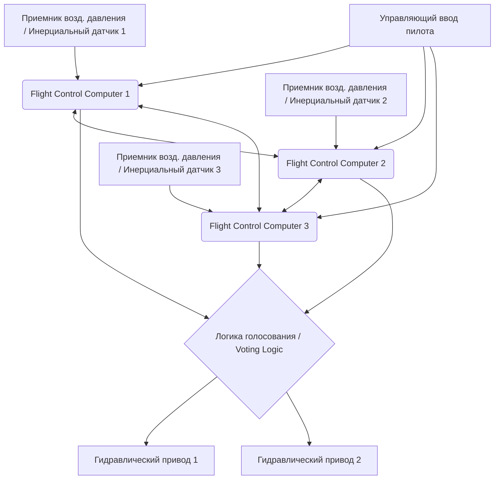

# Введение: Гигантский дата-центр, летящий в небе

Современные реактивные пассажирские самолеты уже давно вышли за рамки просто аэродинамических транспортных средств, эволюционировав в «гигантские летающие компьютерные сети», работающие под управлением высокотехнологичных операционных систем реального времени (RTOS). Ядром этой системы является «авионика» (Avionics) — авиационная электроника, а также технология «Fly-By-Wire» (FBW) — электродистанционная система управления (ЭДСУ), позволяющая управлять самолетом с помощью электрических сигналов. В данной статье мы проведем чрезвычайно подробный и академический анализ архитектуры, законов управления (Control Laws), лежащих в основе этих систем, а также «конфликта философий проектирования» двух крупнейших в мире производителей авиатехники — Boeing и Airbus — с точки зрения аэрокосмической инженерии и теории автоматического управления.

---

## Глава 1: Механика пилотирования самолета и революция перехода от гидравлики к электричеству

### Механизмы классических систем управления и их ограничения

Пространственное управление движением самолета для полета в трехмерном пространстве осуществляется по трем осям: тангаж (Pitch — продольный наклон: управляется рулем высоты), крен (Roll — поперечный наклон: управляется элеронами) и рыскание (Yaw — поворот носа вправо/влево: управляется рулем направления). В реактивных пассажирских лайнерах от зари авиации до 1960-х годов (например, Boeing 707 и ранние 737) штурвал (Control Wheel или Yoke) в кабине пилота и управляющие поверхности (Control Surfaces) хвостового и главного оперения были физически связаны напрямую сложной сетью металлических тросов, шкивов (роликов) и тяг.

Главным преимуществом этой «механической системы управления» была её исключительная простота и интуитивность. Когда пилот тянул штурвал на себя, это усилие через трос напрямую двигало руль высоты, а аэродинамическое сопротивление (давление ветра), воздействующее на управляющую поверхность, возвращалось на штурвал в виде реактивной силы (Feel Force). Благодаря этому пилот мог буквально собственными руками ощущать, «насколько велика аэродинамическая нагрузка на самолет в данный момент».

Однако, когда самолеты увеличились в размерах, а крейсерская скорость достигла околозвуковой (свыше 0,8 Маха), аэродинамические нагрузки на управляющие поверхности стали настолько огромными, что сдвинуть их одной лишь мышечной силой человека стало совершенно невозможно. Для решения этой проблемы были внедрены «гидравлические приводы» (Hydraulic Actuators). Подобно гидроусилителю руля в автомобиле, усилие пилота, передаваемое через тросы, открывало и закрывало гидравлические сервоклапаны, и сверхвысокое гидравлическое давление в 3000 psi (около 210 атмосфер) приводило в движение цилиндры, которые и отклоняли управляющие поверхности.

### Проблемы гидромеханического управления и неизбежность появления Fly-By-Wire

Хотя внедрение гидравлических механизмов сделало возможным управление огромными самолетами, по-прежнему оставалось несколько серьезных проблем.

1. **Увеличение веса и сложности**: Возникла необходимость прокладывать от носа до хвоста самолета сотни метров стальных тросов и шкивов, что приводило к появлению нескольких тонн «мертвого веса» (Dead Weight). Также требовались сложные механизмы, такие как регуляторы натяжения, компенсирующие растяжение тросов и изменения натяжения из-за колебаний температуры.
2. **Ограничения в борьбе с нелинейными аэродинамическими характеристиками**: Аэродинамические характеристики самолета кардинально меняются на низких скоростях (при взлете и посадке) и на высоких (на крейсерской скорости). В механических системах с этими динамическими изменениями приходилось справляться физически с помощью «загрузочных механизмов» (Artificial Feel System), использующих пружины и демпферы, а также механизмов балансировки (триммирования) по тангажу. Получить оптимальный отклик на управление во всем диапазоне режимов полета было невозможно.
3. **Обуза статической устойчивости**: Традиционные самолеты должны были обладать «статической устойчивостью» (Static Stability) — способностью возвращаться к исходному положению, если пилот отпускал управление. Для этого требовалось размещать центр тяжести впереди центра давления, а горизонтальное оперение должно было постоянно создавать направленную вниз подъемную силу. Это порождало значительное балансировочное сопротивление (Trim Drag), что было серьезным фактором ухудшения топливной эффективности.

Чтобы преодолеть эти физические и аэродинамические барьеры, необходимо было «разделить» физические манипуляции пилота и движение управляющих поверхностей. Так появилась электродистанционная система управления «Fly-By-Wire» (FBW), которая преобразует движения штурвала в электрические сигналы (цифровые данные), а бортовые компьютеры рассчитывают оптимальный угол отклонения рулей и отправляют команду на гидравлические (или электрические) приводы.

---

## Глава 2: Системная архитектура Fly-By-Wire

Сердцем системы Fly-By-Wire является сеть вычислителей системы управления полетом (Flight Control Computers: FCC), к которым предъявляются требования предельной надежности. В системах FBW пассажирских самолетов требуется колоссальная надежность — «вероятность катастрофического отказа на уровне 10 в минус 9-й степени ($10^{-9}$) часов», то есть «не более одного критического отказа на 1 миллиард часов налета». Именно разработка архитектуры, способной это обеспечить, и является технической сутью FBW.

### Многократное резервирование (Redundancy) и алгоритмы голосования (Voting)

Для обеспечения продолжения полета даже в случае отказа отдельного компьютера или датчика, в FBW применяется тройное (Triplex) или четверное (Quadruplex) резервирование. Например, на Boeing 777 существует 3 независимых основных компьютера (Primary Flight Computer — PFC: Left, Center, Right), и более того, каждый PFC внутри состоит из 3 вычислительных каналов, что дает фактически логическую архитектуру «$3 \times 3 = 9$-кратного резервирования».

Важнейшим элементом в этой резервированной системе является алгоритм «синхронизации и голосования» (Synchronization and Voting).
Несколько компьютеров одновременно получают одни и те же входные данные (величина отклонения органов управления пилотом, воздушная скорость, углы тангажа и крена и т. д.) и выполняют вычисления, используя одни и те же законы управления. Затем они сравнивают вычисленные команды отклонения рулей между собой (через кросс-канальные каналы связи).

Основа логики голосования — «правило большинства» (Majority Rule). Если 2 из 3 компьютеров решат «отклонить руль высоты на 5 градусов вверх», а 1 компьютер — «на 10 градусов вверх», правильным будет считаться мнение большинства в 5 градусов, а компьютер, результат которого отклоняется, автоматически отключается от сети (Fail-Silent), и управление продолжается на оставшихся двух (Fail-Operational).

### Исключение отказов по общей причине с помощью аппаратного и программного разнообразия (Dissimilarity)

Даже при тройном резервировании, если использовать абсолютно одинаковые процессоры и одинаковое программное обеспечение, существует риск, что при столкновении с определенным неизвестным багом (дефектом ПО) или ошибкой проектирования аппаратуры (эрратой) все 3 компьютера выдадут «одновременно один и тот же неправильный ответ». Это называется «отказом по общей причине» (Common Mode/Cause Failure: CCF).

Для предотвращения этого компании Boeing и Airbus доводят концепцию «разнородного дублирования» (Dissimilarity) до предела.
Например, в Airbus A320 в главных компьютерах ELAC (Elevator Aileron Computer) и SEC (Spoiler Elevator Computer) используются процессоры от совершенно разных производителей (например, один от Intel, другой от Motorola). Более того, команды разработчиков управляющего ПО полностью разделены как физически, так и организационно; они пишут код отдельно на основе одних и тех же спецификаций, используя разные языки программирования (например, Ada и C) и разные компиляторы. Благодаря этому вероятность того, что если в одном ПО есть баг, то точно такой же баг окажется и в другом, математически сводится практически к нулю.

### Шины данных авионики: ARINC 429 и ARINC 664 (AFDX)

Сети связи (шины данных авионики), соединяющие эти датчики, компьютеры и исполнительные механизмы, также прошли свой уникальный путь эволюции.

Долгое время, начиная с 1980-х годов, стандартом был «ARINC 429». Это симплексная (односторонняя) последовательная шина топологии «один ко многим», которая передает 32-битные слова данных со скоростью 100 кбит/с (или 12,5 кбит/с) по одной витой паре проводов. Поскольку ее структура предельно проста и детерминирована (Deterministic), она до сих пор используется во многих подсистемах.

Однако в новейших самолетах, таких как A380, B787 и A350, объем передаваемых данных вырос взрывообразно, и вес кабелей при двухточечной (Point-to-Point) проводке, подобной ARINC 429, достиг предела. В связи с этим был внедрен стандарт «ARINC 664 Part 7 (также известный как AFDX — Avionics Full-Duplex Switched Ethernet)».
AFDX основан на технологии Ethernet (IEEE 802.3), которую мы используем в повседневной жизни, но в него добавлены профили для авиации, которые принудительно обеспечивают «гарантированную задержку связи» (Bounded Latency) и «распределение пропускной способности». Используя концепцию виртуальных каналов (Virtual Link: VL), сетевые коммутаторы (AFDX-свитчи) строго контролируют полосу пропускания для каждого потока данных, создавая детерминированную сеть Ethernet, в которой абсолютно исключены коллизии и потери пакетов. Это позволило сотням устройств взаимодействовать в реальном времени по высокоскоростной сети 100 Мбит/с или 1 Гбит/с.

---

## Глава 3: Законы управления полетом (Flight Control Laws)

Главное преимущество FBW заключается в том, что физическое воздействие пилота на органы управления (Stick Input) не переводится напрямую в угол отклонения рулей (Surface Angle), а компьютер интерпретирует «намерение» (Intent) — то, как пилот хочет переместить самолет, — и реализует «законы управления» (Control Laws), которые рассчитывают оптимальный угол отклонения рулей в зависимости от текущих условий полета (скорости, высоты, веса и т. д.).

### Закон C* (C-Star): Революция в управлении тангажом

В управлении продольным каналом (тангажом) в современных пассажирских самолетах (Boeing 777/787 и Airbus начиная с A320) применяется «закон управления C* (C-Star)» или его развитие «закон C*U».

В традиционных самолетах (или в режиме Direct Law) величина отклонения штурвала на себя/от себя была пропорциональна «углу отклонения руля высоты». Однако реакция самолета (скорость изменения тангажа или создаваемая перегрузка G) на один и тот же угол отклонения рулей совершенно различна на низких и высоких скоростях.
В отличие от этого, в законе C* перемещение пилотом штурвала интерпретируется как команда на «комплексное заданное значение», состоящее из «угловой скорости тангажа (скорости поднятия/опускания носа: $q$)» и «нормального ускорения (перегрузки G: $N_z$)».

$$ C^* = K_1 \cdot q + K_2 \cdot N_z $$

(где $K_1$ и $K_2$ — коэффициенты усиления (гейны), изменяющиеся в зависимости от скорости и др.)

- **На низкой скорости (взлет и посадка)**: Поскольку аэродинамическая перегрузка G создается с трудом, компьютер использует главным образом обратную связь по «угловой скорости тангажа ($q$)» для контроля скорости поднятия и опускания носа самолета.
- **На высокой скорости (крейсерский полет)**: Поскольку даже небольшое поднятие носа вызывает сильную перегрузку G, компьютер использует в основном обратную связь по «нормальному ускорению ($N_z$)», управляя рулями так, чтобы создать постоянную перегрузку G, пропорциональную вводу пилота.

Благодаря этому, независимо от скорости полета, пилот получает исключительно стабильные характеристики управляемости: «если отклонить штурвал на ту же величину, самолет всегда будет реагировать одинаково предсказуемо».

### Иерархия отказоустойчивости: Normal, Alternate, Direct

На случай отказов датчиков или компьютеров в самолетах предусмотрена иерархия деградации (Degradation) законов управления. Если взять за пример терминологию Airbus, она подразделяется следующим образом:

1. **Нормальный закон (Normal Law)**
   Все системы (ADIRU, компьютеры и т.д.) функционируют штатно. Полностью работает коррекция ощущений управления по закону C* и полная «защита огибающей режимов полета» (Flight Envelope Protection), о которой пойдет речь ниже. Автопилот также доступен в полном объеме.
2. **Альтернативный закон (Alternate Law)**
   Состояние, когда часть дублированных датчиков выходит из строя, и надежные данные (например, точная воздушная скорость) становятся недоступными. Базовая обратная связь для управления положением (угловой скорости тангажа или крена) функционирует, но часть или все функции защиты огибающей полета (например, предотвращение сваливания) отключаются.
3. **Прямой закон (Direct Law)**
   Финальный резервный режим, когда большинство компьютеров или датчиков отказывают, и сложные вычисления становятся невозможными. FBW превращается в простой «электрический кабель», и движения штурвала напрямую, пропорционально передаются в углы отклонения рулей (пропорциональное управление). Защиты режимов полета полностью отсутствуют, и ощущения от управления становятся в точности такими же, как на классических самолетах (с полным проявлением изменения чувствительности от скорости).

### Защита огибающей режимов полета (Flight Envelope Protection)

Это величайшая технология безопасности, которую принесла FBW. У самолета есть предельная область (огибающая), в рамках которой он может безопасно лететь. К ней относятся: скорость (скорость сваливания и предельное число Маха), угол крена, угол тангажа, перегрузка G (коэффициент перегрузки). Когда самолет пытается выйти за эти пределы, компьютер FBW вмешивается и предотвращает это.

- **Защита по углу тангажа**: Ограничивает угол задирания носа (например, не более +30 градусов) или опускания носа (например, не более -15 градусов).
- **Защита по углу крена**: Управляет элеронами так, чтобы угол крена не превышал определенного значения (например, 67 градусов).
- **Защита от сваливания (Alpha Protection)**: При приближении угла атаки (Angle of Attack: AoA, Alpha) к границе сваливания, даже если пилот продолжает тянуть штурвал на себя, компьютер отклоняет дальнейшее задирание носа и автоматически устанавливает максимальную тягу двигателей (TOGA) во избежание сваливания.

---

## Глава 4: Boeing против Airbus: Решающий конфликт философий проектирования

Внедрение технологии FBW разделило индустрию гражданской авиации на два лагеря — Boeing и Airbus, имеющих совершенно разные философские подходы к «проектированию кабины экипажа и распределению полномочий между человеком и машиной». Это одна из самых интересных дискуссий в современной аэрокосмической инженерии.

### Философия Airbus: «Абсолютная защита и жесткие ограничения со стороны компьютера»

Введенный в эксплуатацию в 1988 году, A320 стал первым в мире пассажирским самолетом с полностью цифровой FBW. Базовая философия Airbus звучит так: «**Люди совершают ошибки. Следовательно, абсолютная безопасность должна обеспечиваться жесткими ограничениями (Hard Limits), рассчитываемыми компьютером**».

1. **Использование боковых ручек управления (Sidestick)**:
   Airbus отказался от традиционных штурвалов (Yoke), которые держат двумя руками, и разместил боковые ручки управления, подобные тем, что используются в истребителях (слева у кресла командира и справа у кресла второго пилота). Это кардинально улучшило обзорность приборной панели.
2. **Независимость ручек управления**:
   Сайдстики командира и второго пилота физически не связаны. Если один двигает свою ручку, ручка другого остается неподвижной (при одновременном воздействии на обе ручки сигналы алгебраически суммируются, или приоритет захватывается нажатием специальной кнопки).
3. **Жесткая защита (Hard Envelope Protection)**:
   Пока действует Normal Law, независимо от того, действует ли пилот намеренно или в состоянии паники, даже если он потянет сайдстик на себя до упора, самолет никогда не превысит критический угол атаки сваливания, а также не превысит пределы по углу крена. Иными словами, у компьютера есть полномочия «игнорировать (отвергать) управляющие воздействия пилота» (Override).

### Философия Boeing: «Окончательное право принятия решений всегда остается за пилотом (мягкие ограничения)»

С другой стороны, на B777 (а затем и B787) — первом самолете Boeing с FBW, введенном в эксплуатацию в 1995 году, компания придерживается философии: «**В любой ситуации именно пилот-человек, который лучше всего осведомлен об обстановке на месте, должен обладать окончательным правом принятия решений**».

1. **Сохранение традиционного штурвала (Yoke)**:
   Boeing не стал использовать сайдстики и оставил классические штурвалы. Даже на самолетах с FBW штурвалы командира и второго пилота физически (или электросервомоторно) связаны механизмами под полом и двигаются синхронно. Это позволяет пилотам тактильно и визуально ощущать действия друг друга.
2. **Система искусственных ощущений (Artificial Feel) и обратная связь (Backdrive)**:
   Даже когда управляет автопилот, штурвалы в кабине физически перемещаются синхронно с движением управляющих поверхностей (сайдстики Airbus остаются неподвижными). Кроме того, в систему встроены приводы, которые имитируют тяжесть (усилия на штурвале) в зависимости от скорости, передавая пилоту псевдо-«аэродинамическое сопротивление».
3. **Мягкая защита (Soft Envelope Protection)**:
   На самолетах Boeing также есть защита от сваливания и ограничения крена, но они не являются «абсолютной стеной». Когда самолет приближается к предельным режимам, штурвал становится драматически тяжелым, предупреждая пилота. Однако, если пилот продолжит тянуть штурвал с «еще большим усилием (например, с силой около 22,5 кг или более)», он сможет «преодолеть» (Override) установленные системой лимиты и выполнить маневр за пределами ограничений. Это основано на идее, что «в экстремальных ситуациях, не предусмотренных компьютером (например, уклонение от ракеты или столкновения с рельефом местности), пилоту должно быть оставлено право предпринять маневр уклонения, даже ценой повреждения конструкции планера».

Это различие в философии — «верить машине или верить человеку» — до сих пор продолжает проявляться как фундаментальное различие в проектировании кабин этих двух компаний.

---

## Глава 5: Слияние данных датчиков и автоматическая посадка (Autoland)

Усложнение систем FBW было критически важно для реализации полностью автоматической посадки (Autoland) в связке с курсо-глиссадной системой (ILS: Instrument Landing System) и системой посадки на базе GPS (GLS: GBAS Landing System). Технология, позволяющая мягко посадить на центральную линию взлетно-посадочной полосы (ВПП) многотонную машину с сотнями пассажиров на борту даже в условиях густого тумана при видимости, близкой к нулю (категории IIIb/IIIc), является вершиной инженерии систем управления.

### Датчики, распознающие пространство (ADIRU)

Для точного управления необходимо с высочайшей точностью знать, где находится самолет в пространстве, каково его пространственное положение и как он движется. За это отвечает блок воздушных и инерциальных данных (Air Data Inertial Reference Unit: ADIRU).

- **Воздушные данные (Air Data)**: С помощью установленных снаружи приемников полного давления (трубок Пито), портов статического давления и датчиков температуры вычисляются воздушная скорость (Airspeed), высота (Altitude), число Маха и угол атаки (AoA).
- **Инерциальная система (IRS: Inertial Reference System)**: Используя кольцевые лазерные гироскопы (RLG) или волоконно-оптические гироскопы (FOG), система с высокой точностью определяет угловые скорости и ускорения самолета по трем осям. Интегрируя эти данные, она автономно рассчитывает пространственное положение самолета (тангаж, крен, рыскание) и абсолютные координаты на Земле (широту и долготу).

В современной авионике данные этих систем ADIRU объединяются (сенсорное слияние) с сигналами GPS (GNSS) с помощью фильтров Калмана. Благодаря постоянной коррекции ошибок дрейфа достигается точное навигационное решение с погрешностью от нескольких сантиметров до нескольких метров.

### Контур управления автоматической посадкой и выравнивание с пробегом

При автоматической посадке по системе ILS бортовые антенны принимают сигналы курсового маяка (локализатора — центральная линия ВПП) и глиссадного маяка (угол снижения около 3 градусов), излучаемые с земли, а FCC осуществляет управление с обратной связью, чтобы удерживать самолет в центре луча этих сигналов.

1. **Фаза захода на посадку (Approach Phase)**:
   На высоте около 1500 футов все три канала автопилота активируются, и включается логика голосования (состояние Fail-Operational). Система непрерывно микрокорректирует тангаж и крен, сводя к нулю сигналы ошибки ILS.
2. **Угол упреждения (Crab Angle) и компенсация бокового ветра**:
   При наличии бокового ветра самолет снижается в скольжении, повернув нос навстречу ветру (движение боком, или «крабом»).
3. **Устранение угла упреждения (Decrab) и выравнивание (Flare)**:
   Когда радиовысотомер (Radio Altimeter) фиксирует высоту около 50 футов, автопилот автоматически переходит в режим «выравнивания» (Flare Mode). Он немного задирает нос, снижая вертикальную скорость (обычно примерно до 150 футов в минуту), чтобы смягчить удар при касании. Одновременно, если есть боковой ветер, система дает импульс рулем направления, чтобы выровнять нос по оси ВПП (Decrab), отклоняет элероны, создавая крен навстречу ветру, чтобы избежать сноса, и осуществляет касание сначала стойкой шасси со стороны наветренной стороны. Это сложнейшее многопараметрическое управление осуществляется компьютером с недоступной человеку миллисекундной точностью.
4. **Пробег (Rollout)**:
   Даже после касания ВПП автопилот продолжает следовать сигналу локализатора, автоматически управляя рулем направления и механизмом поворота передней стойки шасси, чтобы самолет замедлялся строго по осевой линии ВПП. Одновременно компьютер управляет автоматическим выпуском спойлеров и торможением с заданным уровнем замедления (Autobrake).

---

## Глава 6: Будущее авионики и автономные полеты

Технологии FBW и авионики продолжают стремительно развиваться, обещая кардинально изменить облик авиационной индустрии следующих поколений.

### Интегрированная модульная авионика (IMA: Integrated Modular Avionics)

В традиционных самолетах для каждой функции — автопилота, системы управления полетом (FMS), управления шасси, кондиционирования и т.д. — устанавливался отдельный независимый компьютер (LRU: Line Replaceable Unit). Это приводило к избыточному весу, высокому энергопотреблению и лишним затратам.
В современных самолетах, таких как B787 и A350, применяется архитектура «интегрированной модульной авионики (IMA)». Она предполагает размещение на борту нескольких общих вычислительных модулей (CCM), напоминающих универсальные высокопроизводительные блейд-серверы, на которых работает операционная система реального времени (RTOS), соответствующая стандарту ARINC 653. Технология «временного и пространственного разделения» (Time and Space Partitioning) RTOS позволяет полностью изолированно и одновременно выполнять на одних и тех же процессорах и памяти как «критически важное ПО управления полетом», так и «ПО бортовой системы развлечений». Это позволило существенно сократить количество аппаратных средств и снизить вес.

### Fly-By-Light и электрификация (More Electric Aircraft)

Следующим этапом эволюции шин данных является исследование концепции «Fly-By-Light» (FBL), заменяющей медные провода оптоволокном. Помимо сверхширокой полосы пропускания и малого веса, оптоволокно обладает крайне выгодным для самолетов свойством — абсолютной неуязвимостью к ударам молний (Lightning Strike) и мощным электромагнитным помехам/импульсам (EMI / EMP).

Кроме того, в рамках концепции «более электрического самолета» (MEA: More Electric Aircraft) начался переход от тяжелых традиционных гидравлических трубопроводов к «электромеханическим приводам» (EMA), где управляющие поверхности напрямую приводятся в движение электромоторами, и «электрогидростатическим приводам» (EHA), имеющим встроенный независимый гидравлический насос внутри самого привода (уже применяются в резервных системах A380 и B787). Это снижает риск полной потери управления из-за утечки гидравлической жидкости и дополнительно улучшает топливную экономичность.

### Внедрение ИИ, полеты с одним пилотом (SPO) и путь к полной автономии

В качестве ультимативного будущего обсуждается внедрение искусственного интеллекта (ИИ) и машинного обучения в авионику. Нынешние системы FBW работают исключительно на «детерминированной логике (Deterministic Logic), запрограммированной человеком». Однако ведутся исследования по созданию систем адаптивного управления (Adaptive Control), где ИИ сможет мгновенно изучать и перестраивать законы управления в условиях сложных метеорологических явлений или при неизвестных повреждениях планера для сохранения управляемости.

Также, в качестве меры борьбы с нехваткой пилотов, активно тестируются концепции (например, eMCO, продвигаемая Airbus), при которых нынешний экипаж из двух человек (командир и второй пилот) на крейсерском этапе полета может быть сокращен до одного человека (Single Pilot Operations: SPO), а роль второго пилота возьмут на себя высокоавтоматизированная авионика или наземные удаленные операторы. Возможно, окончательным итогом развития технологии Fly-By-Wire станет «полностью автономный пассажирский самолет», в кабине которого вообще не будет пилотов-людей.

---

## Заключение

«Fly-By-Wire» — это не просто технология замены металлических тросов на электрические провода. Это смена парадигмы, которая освободила самолеты от аэродинамических ограничений и превратила их в «летающие системы систем», объединившие в себе передовые достижения инженерии управления, информационных технологий и сетевых решений.
Как показывает разница в философских подходах Boeing и Airbus, в основе этих технологий всегда лежит фундаментальный вопрос: «Какова роль человека?». В будущем, с дальнейшим развитием ИИ и автономности, технологии авионики продолжат делать наши воздушные путешествия безопаснее, эффективнее и тише.

## Приложение: Математическое моделирование систем Fly-By-Wire и передаточные функции (Transfer Functions)

Для более глубокого академического понимания систем FBW ниже приводится краткое описание базовых передаточных функций и моделей структурных схем с обратной связью для продольного движения (ось тангажа) самолета.

### Модель динамических характеристик самолета (Короткопериодическое движение / Short Period Mode)

Продольное движение самолета в основном раскладывается на два режима: короткопериодическое (Short Period Mode) и длиннопериодическое (фугоидное, Phugoid Mode). Законы FBW, такие как C* или управление угловой скоростью тангажа, непосредственно демпфируют и стабилизируют именно этот «короткопериодический режим».

Передаточная функция $G(s) = \frac{q(s)}{\delta_e(s)}$ от угла отклонения руля высоты $\delta_e$ к угловой скорости тангажа $q$ аппроксимируется из стандартных линеаризованных уравнений движения твердого тела следующим образом:

$$ \frac{q(s)}{\delta_e(s)} = \frac{K_q(T_{\theta_2}s + 1)}{s^2 + 2\zeta_{sp}\omega_{sp}s + \omega_{sp}^2} $$

Где:
- $K_q$ — статический коэффициент усиления управления (сильно зависит от скорости и скоростного напора).
- $T_{\theta_2}$ — постоянная времени фазового запаздывания между движением тангажа и изменением траектории полета (Flight Path).
- $\zeta_{sp}$ — коэффициент демпфирования (Damping Ratio) короткопериодического движения.
- $\omega_{sp}$ — собственная круговая частота (Natural Frequency) короткопериодического движения.

В традиционных механических системах управления на больших высотах и высоких скоростях аэродинамическое демпфирование снижалось, из-за чего $\zeta_{sp}$ становилось очень малым (самолет становился склонным к продольным колебаниям).

### Улучшение характеристик с помощью управления с обратной связью

В системах FBW угловая скорость тангажа $q_{sensor}$ и нормальное ускорение $N_{z, sensor}$, измеряемые гироскопическими датчиками (ADIRU), подаются обратно в компьютер, где рассчитывается ошибка (расхождение) $e(s)$ относительно заданного пилотом значения $q_{cmd}$ (или $C^*_{cmd}$).

Рассмотрим передаточную функцию замкнутой системы при внедрении самого базового управления угловой скоростью тангажа с обратной связью (пропорционально-интегрального управления: ПИ-регулятор). Если передаточная функция регулятора (Controller) равна $C(s) = K_p + \frac{K_i}{s}$, то команда угла отклонения $\delta_c$, выдаваемая контроллером, будет:

$$ \delta_c(s) = C(s) \left( q_{cmd}(s) - q_{sensor}(s) \right) $$

Если умножить это на характеристику гидравлического привода с апериодическим звеном первого порядка $A(s) = \frac{1}{\tau_a s + 1}$, мы получим фактический угол отклонения рулей $\delta_e$.

Путем настройки полюсов (Poles) знаменателя (характеристического уравнения) передаточной функции замкнутого контура всей системы $H_{closed}(s) = \frac{q(s)}{q_{cmd}(s)}$, выбирая соответствующие коэффициенты $K_p, K_i$ через планирование коэффициентов усиления (Gain Scheduling), можно достичь оптимальных значений $\zeta$ (обычно около 0,7) и $\omega_n$ в любом диапазоне скоростей. Благодаря этому, независимо от физических размеров хвостового оперения или положения центра тяжести, на программном уровне всегда можно эмулировать характеристики управления «идеального самолета». Именно в этом и заключается математическая суть «искусственной устойчивости» (Artificial Stability), обеспечиваемой FBW.
