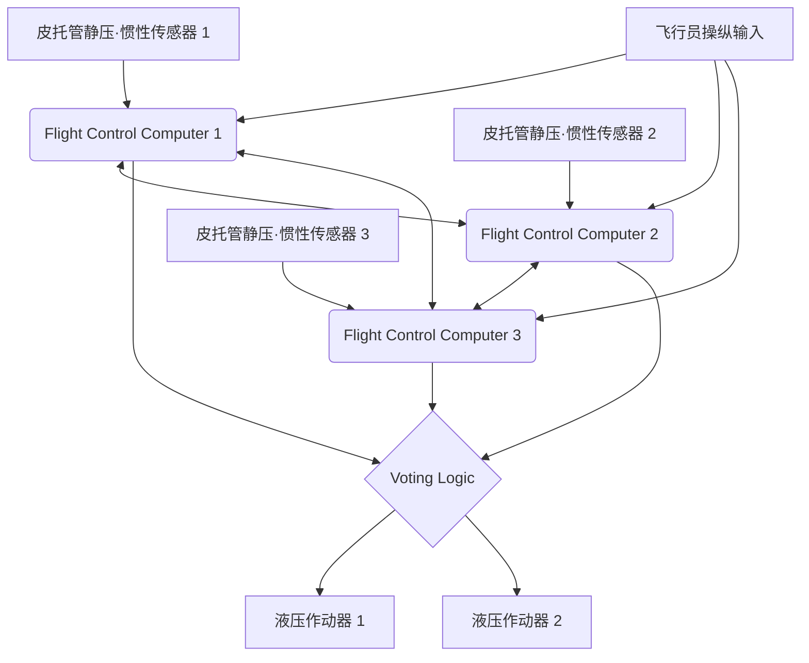

# 引言：飞行的巨型数据中心

现代喷气式客机已经远远超越了单纯的空气动力学交通工具的范畴，演变成了运行在高级实时操作系统上的“飞行巨型计算机网络”。构成其核心的，是意为航空电子学的“航空电子设备（Avionics）”，以及通过电信号控制飞机的“电传操纵（Fly-By-Wire: FBW）”技术。本文将从航空航天工程和控制工程的角度，对这些系统底层的架构、控制律（Control Laws），以及波音（Boeing）和空客（Airbus）这两大世界飞机制造商之间交织的“设计哲学冲突”，进行极其详细且学术性的深入探讨。

---

## 第1章：飞机操纵的力学与从液压到电气的革命

### 传统操纵系统的机制及其局限性

飞机在空中飞行所需的三维运动控制，由俯仰（Pitch，纵向倾斜：由升降舵控制）、滚转（Roll，横向倾斜：由副翼控制）和偏航（Yaw，机头左右摆动：由方向舵控制）三轴组成。从航空黎明期到1960年代左右的喷气式客机（例如波音707和早期的737等），驾驶舱的操纵杆（驾驶盘或操纵轭）与尾翼、机翼的动翼（操纵面）之间，是通过物理的金属缆索、滑轮（Pulley）以及连杆等构成的复杂网络直接连接的。

这种“机械式操纵系统”最大的优点在于极其简单直观。飞行员拉动操纵杆时，其力量会通过缆索直接带动升降舵，舵面所受到的空气阻力（风压）则作为反作用力（Feel Force）反馈到操纵杆上。由此，飞行员能够通过手感直接感知到“飞机当前正承受着多大的空气动力学载荷”。

然而，随着飞机尺寸的巨大化，以及巡航速度达到超过0.8马赫的跨音速区域，舵面所承受的气动载荷变得极其庞大，人类的肌肉力量根本无法拨动。为了应对这一问题，引入了“液压作动器（Hydraulic Actuator）”。正如汽车的动力转向系统一样，通过缆索传递的飞行员输入会控制液压伺服阀的开闭，高达3000psi（约210大气压）的超高压液压驱动气缸，进而推动动翼。

### 液压机械式控制的挑战与电传操纵的必然性

虽然液压机构的引入使得操纵巨大的飞机成为可能，但仍有一些严重的问题亟待解决。

1. **重量与复杂性的增加**：需要从机头到机尾铺设长达数百米的钢索（缆索）和滑轮，这些部件构成了数吨重的死重（Dead Weight）。此外，为了补偿由于缆索拉伸或温度变化引起的张力变化，还需要张力调节器等复杂的机构。
2. **应对非线性气动特性的局限**：飞机的气动特性在低速（起降时）和高速（巡航时）下会发生剧烈变化。在机械式系统中，为了应对这种动态变化，必须物理性地使用弹簧或阻尼器构建“人工感觉机构（Artificial Feel System）”以及俯仰配平机构进行处理，无法在整个飞行包线内获得最优的操纵响应。
3. **静稳定性的羁绊**：传统飞机为了具备“静稳定性（Static Stability）”（即飞行员松开操纵杆后，飞机倾向于恢复到原来的姿态），必须将重心配置在风压中心的前方，并由水平尾翼始终产生向下的升力。这产生了巨大的配平阻力（Trim Drag），成为导致燃油效率恶化的重要因素。

为了打破这些物理和空气动力学的局限，必须将飞行员的物理操作与动翼的运动“分离”。因此，“电传操纵（Fly-By-Wire: FBW）”应运而生。它将操纵杆的运动转换为电信号（数字数据），由计算机计算出最佳舵角，并将指令发送给动翼的液压（或电动）作动器。

---

## 第2章：电传操纵的系统架构

电传操纵的心脏，是要求具备极限可靠性的飞行控制计算机（Flight Control Computers: FCC）网络。客机的FBW要求“10的负9次方（10^-9）每小时的灾难性故障率（Catastrophic Failure Rate）”，即“每10亿飞行小时发生不到1次致命故障”，这是一种惊人的可靠性要求。实现这一目标的架构设计，正是FBW的技术精髓。

### 多重冗余系统（Redundancy）与投票算法（Voting）

为了在单一计算机或传感器发生故障时仍能继续飞行，FBW采用了三重（Triplex）或四重（Quadruplex）冗余配置。以波音777为例，存在3套主飞行计算机（Primary Flight Computer: PFC，分别为左、中、右），而且每个PFC内部由3个计算通道组成，因此实质上拥有“3×3 = 9重”的逻辑架构。

在这个冗余系统中最重要的是“同步与投票（Synchronization and Voting）”算法。
多台计算机同时接收相同的输入数据（飞行员的操作量、空速、姿态角等），并使用相同的控制律进行计算。随后，它们将输出的舵角指令值进行相互比较（跨通道数据链路）。

投票逻辑的基础是“多数决（Majority Rule）”。如果3台计算机中有2台计算出“升降舵上偏5度”，而另1台计算出“上偏10度”，那么作为多数派的5度将被认为是正确的，计算结果发生偏差的那台计算机将被自动从网络中断开（故障静默，Fail-Silent），剩下的2台继续进行控制（故障可操作，Fail-Operational）。

### 通过异构软硬件排除共因故障（Dissimilarity）

即便进行了三重冗余，如果使用完全相同的CPU和完全相同的程序，当遇到某个特定的未知漏洞（软件缺陷）或硬件设计错误（勘误）时，3台计算机就有可能“同时得出相同的错误答案”。这被称为“共因故障（Common Mode/Cause Failure: CCF）”。

为了防止这种情况，波音和空客都将“异构设计（Dissimilarity）”追求到了极致。
例如在空客A320中，作为主计算机的ELAC（升降舵副翼计算机）和SEC（扰流板升降舵计算机）采用了完全不同制造商的CPU（例如一方是Intel系，另一方是Motorola系）。此外，控制软件的开发团队在物理和组织上完全分离，使用不同的编程语言（如Ada语言和C语言）和不同的编译器，根据同一份需求说明书分别编写代码。由此，即使一方的软件存在漏洞，另一方软件存在相同漏洞的概率在数学上也被压低到了几乎为零。

### 航空电子数据总线：ARINC 429 与 ARINC 664 (AFDX)

连接这些传感器、计算机和作动器的通信网络（航空电子数据总线）也经历了独特的演变。

从1980年代起长期作为标准的是“ARINC 429”规范。这是一种一对多的单向（单工）串行总线，使用一根双绞线以100kbps（或12.5kbps）的速度传输32位的数据字。由于其结构极其简单且确定（Deterministic），至今仍在许多子系统中使用。

然而，在A380、B787、A350等最新型飞机上，通信数据量呈爆炸式增长，像ARINC 429这样点对点（Point-to-Point）的布线方式，其线缆重量已达到极限。因此引入了“ARINC 664 Part 7（通称：AFDX - Avionics Full-Duplex Switched Ethernet）”。
AFDX以我们日常使用的以太网（IEEE 802.3）技术为基础，为了航空器应用，添加了“强制保证绝对通信延迟（Bounded Latency）”和“带宽分配”的配置文件。它采用虚拟链路（Virtual Link: VL）的概念，网络交换机（AFDX交换机）对每个数据流的带宽进行严格管理，从而构建了绝对不会发生数据包冲突或丢失的确定性（Deterministic）以太网。这使得数百台设备能够在100Mbps/1Gbps的高速网络上进行实时通信。

---

## 第3章：飞行控制律（Flight Control Laws）

FBW最大的好处在于，它并不直接将飞行员的物理操纵输入（Stick Input）原封不动地转换为动翼的角度（Surface Angle），而是可以通过计算机解析“飞行员想要如何移动飞机”的意图（Intent），并根据当前的飞行状态（速度、高度、重量等）计算出最佳的舵角，这就是“控制律（Control Laws）”的实现。

### C*（C-Star）律：俯仰控制的革命

在最新的客机（波音777/787及空客A320以后）的纵向（俯仰）控制中，采用的是“C*（C-Star）控制律”或其发展型“C*U律”。

在传统飞机（或直接法则状态）中，操纵杆的拉动量与“升降舵的舵角”成正比。但在低速和高速时，即便舵角相同，飞机的反应（俯仰速率或产生的过载G）也截然不同。
相比之下，在C*律中，飞行员移动操纵杆被解释为是在『指令“俯仰速率（机头上下俯仰的角速度：q）”和“垂直加速度（G载荷：Nz）”的合成目标值』。

$$ C^* = K_1 \cdot q + K_2 \cdot N_z $$

（此处 $K_1, K_2$ 是随速度等变化的增益）

- **低速时（如起降时）**：由于难以产生气动G，计算机主要反馈“俯仰速率（q）”来控制机头抬起或放下的速度。
- **高速时（巡航时）**：只需稍微抬起机头就会产生强烈的G，因此计算机主要反馈“垂直加速度（Nz）”，以控制动翼产生与飞行员输入相对应的恒定G。

通过这种方式，飞行员可以获得极其稳定的操纵特性，即无论飞行速度如何，“只要拉动相同幅度的操纵杆，飞机始终以相同的手感做出反应”。

### 故障安全分层结构：正常、备用、直接法则

为了防范传感器或计算机故障，飞机具备控制律的降级（Degradation）层次结构。以空客的名称为例，分为以下几层：

1. **正常法则（Normal Law）**
   所有系统（ADIRU、计算机等）处于正常状态。完全应用基于C*律的操纵感补偿，以及后文所述的完整的“飞行包线保护（Flight Envelope Protection）”。自动驾驶仪也可正常使用。
2. **备用法则（Alternate Law）**
   部分冗余传感器发生故障，无法获得可靠数据（例如准确的空速等）的状态。基本的姿态控制（俯仰速率和滚转速率）反馈仍然有效，但部分或全部的飞行包线保护（如防失速功能等）被解除。
3. **直接法则（Direct Law）**
   多台计算机或传感器失效，无法进行复杂计算的最终备份状态。FBW退化为单纯的“电子缆索”，操纵杆的运动直接按比例转换为动翼的舵角（比例控制）。完全没有飞行包线保护，呈现出与经典飞机完全相同的操纵感（但灵敏度随速度变化的问题会暴露无遗）。

### 飞行包线保护（Flight Envelope Protection）

这是FBW带来的最大的安全技术。飞机有能够安全飞行的极限范围（包线），包括速度（失速速度和极限马赫数）、坡度角、俯仰角、G载荷（载荷倍数）等。当飞机试图超越这些极限时，FBW计算机会介入以防止其发生。

- **俯仰姿态保护**：限制机头上仰角不超过一定值（例：+30度）或机头下俯角（例：-15度）。
- **坡度角保护**：控制副翼，使滚转角不超过一定值（例：67度）。
- **失速保护（Alpha Protection）**：当迎角（Angle of Attack: AoA，Alpha）接近失速极限时，即使飞行员继续拉操纵杆，计算机也会拒绝进一步抬起机头，并自动将发动机推力增至最大（TOGA）以避免失速。

---

## 第4章：波音 vs 空客：决定性的设计哲学冲突

在引入FBW技术的过程中，将民用航空界一分为二的波音和空客，在“驾驶舱设计与人机权限移交”上秉持着截然不同的设计哲学。这是现代航空工程中最有趣的争论之一。

### 空客的哲学：“基于计算机的绝对保护与硬限制”

1988年投入运营的A320是世界上首款全数字FBW客机。空客的基本哲学是“**人是会犯错的。因此，终极的安全必须由计算机计算出的硬限制（绝对限制）来保障**”。

1. **采用侧杆（Side-stick）**：
   空客废除了传统的双手握持操纵杆（驾驶盘），在机长席的左侧和副驾驶席的右侧配置了类似战斗机的侧杆。这极大地提高了仪表盘的能见度。
2. **操纵杆的非联动性**：
   机长和副驾驶的侧杆在物理上是不连接的。一方操作时，另一方的侧杆不会随动（双重输入时，输入将被代数相加，或通过优先按钮争夺控制权）。
3. **硬保护（Hard Envelope Protection）**：
   只要正常法则有效，无论飞行员是蓄意还是处于恐慌状态，即使将侧杆拉到极限并保持住，飞机也绝对不会超过失速迎角，坡度角也不会超过限制值。也就是说，计算机拥有“覆盖（拒绝）飞行员操作”的权限。

### 波音的哲学：“最终决定权始终在飞行员手中（软限制）”

另一方面，波音在1995年投入运营的首款FBW飞机B777（以及随后的B787）中，贯彻了这样的哲学：“**无论在何种情况下，最了解现场状况的人类飞行员应该拥有最终的决定权**”。

1. **维持传统的控制盘（驾驶盘，Yoke）**：
   波音没有采用侧杆，而是保留了传统的驾驶盘。即使在FBW飞机上，通过地板下的机构，机长席和副驾驶席的驾驶盘也会物理性地（或通过电气伺服）联动。这样一来，飞行员之间就能通过触觉和视觉感知到对方的操作。
2. **人工感觉机构（Artificial Feel）与反向驱动（Backdrive）**：
   即使在自动驾驶仪操纵时，驾驶舱的驾驶盘也会随着动翼的运动发生物理移动（空客的侧杆则不会动）。此外，系统中内置了作动器来模拟根据速度调节驾驶盘移动力度（操舵力）的机制，向飞行员传递拟真的“空气动力学手感”。
3. **软保护（Soft Envelope Protection）**：
   波音飞机也有失速保护和坡度角限制，但这并非“绝对的墙壁”。当飞机接近极限时，操纵杆会变得极其沉重以警告飞行员，但如果飞行员施加“更强的力量（例如超过约22.5kg的力）”继续拉杆，就可以“突破（Override）”系统的设定极限，进行超越极限的机动。这是基于“在计算机未预料到的极端情况下（例如躲避导弹或地形防撞），应该保留飞行员哪怕牺牲飞机也要采取回避行动的权限”这一思想。

这种“是相信机器，还是相信人”的哲学差异，至今仍作为两家公司驾驶舱设计的根本性区别而持续存在。

---

## 第5章：传感器融合与自动降落（Autoland）

FBW系统的高度发展，是实现与仪表着陆系统（ILS）或基于GPS的GLS（GBAS着陆系统）联动的全自动降落（Autoland）不可或缺的条件。在浓雾导致能见度几乎为零（Cat IIIb/IIIc条件）的状态下，能够将载有几百名乘客、重达几百吨的飞机在跑道中心线上软着陆的技术，是控制工程的极致。

### 把握空间的传感器群（ADIRU）

为了进行精确的控制，必须以极高的精度知道飞机在空间中的位置、姿态以及如何运动。承担这一任务的是“大气数据与惯性基准装置（Air Data Inertial Reference Unit: ADIRU）”。

- **大气数据（Air Data）**：通过安装在机身外部的皮托管（测量动压）、静压孔（测量静压）和温度传感器，计算出空速（Airspeed）、高度（Altitude）、马赫数和迎角（AoA）。
- **惯性基准（IRS: Inertial Reference System）**：通过环形激光陀螺仪（RLG）或光纤陀螺仪（FOG），高精度检测飞机三轴的角速度和加速度，对其进行积分即可自主计算出飞机的姿态（俯仰、滚转、偏航）和地球上的绝对坐标（经纬度）。

在现代航空电子系统中，使用卡尔曼滤波等算法将这些ADIRU数据与GPS（GNSS）信号进行融合（传感器融合），不断校正漂移误差，从而获得厘米到米级的高精度导航解。

### 自动降落的控制回路与拉平·滑跑

在使用ILS的自动降落中，机载天线接收地面发射的航向道电波（跑道中心线）和下滑道电波（约3度下降角），FCC进行反馈控制，使飞机行驶在电波波束中心。

1. **进近阶段（Approach Phase）**：
   在约1500英尺的高度，3套自动驾驶仪全部接通，多数决逻辑被激活（Fail-Operational状态）。系统连续微调俯仰和滚转，使得ILS的误差信号归零。
2. **偏流角（Crab Angle）与侧风补偿**：
   如果有侧风，飞机会以机头朝向上风向的倾斜姿态（偏流姿态，Crab）下降。
3. **消除偏流（Decrab）与拉平（Flare）**：
   当无线电高度表（Radio Altimeter）探测到高度约50英尺时，自动驾驶仪自动过渡到“拉平模式”。机头微抬，降低下降率（通常降至约150fpm左右），以缓和接地的冲击。同时，如果有侧风，会踩下方向舵使机头正对跑道方向（消除偏流），并打副翼建立坡度角以防止被风吹偏，使迎风侧的主起落架先接地。这种复杂的多参数多变量控制，由计算机以人类无法企及的毫秒级精度执行。
4. **滑跑阶段（Rollout）**：
   接地后，自动驾驶仪继续追踪航向道信号，自动控制方向舵和前轮（Nosewheel）转向，使飞机沿跑道中心线直线减速。同时，扰流板的自动展开以及通过自动刹车实现的恒定减速率制动，也由计算机进行管理。

---

## 第6章：航空电子设备的未来与自主飞行

FBW和航空电子设备目前仍在快速发展，正试图极大地改变下一代航空业的面貌。

### 综合模块化航空电子（IMA：Integrated Modular Avionics）

传统飞机中，针对自动驾驶、飞行管理系统（FMS）、起落架控制、空调控制等不同功能，分别搭载了专用的独立计算机（LRU: Line Replaceable Unit）。但这造成了重量、功耗和成本的浪费。
在现代的B787和A350等机型上，采用了“综合模块化航空电子（IMA）”架构。这类似于在机内配置几个像通用高性能刀片服务器一样的通用计算模块（CCM），在其上运行基于ARINC 653标准的实时操作系统（RTOS）。借助RTOS的“时间与空间分区（Time and Space Partitioning）”技术，可以在同一CPU和内存上，完全隔离并同时运行“关键的飞行控制软件”和“机内娱乐控制软件”。这实现了硬件的大幅减少和轻量化。

### 光传操纵（Fly-By-Light）与电气化（More Electric Aircraft）

随着数据总线的演进，将铜线替换为光纤的“光传操纵（FBL）”研究正在推进。光纤不仅拥有超宽带和重量轻的特点，而且对雷击（Lightning Strike）和强电磁干扰（EMI / EMP）具有完全免疫的特性，这对飞机来说是极具优势的。

此外，基于“多电飞机（MEA：More Electric Aircraft）”的概念，正在开始从传统沉重的液压管路系统向直接由电机驱动动翼的“机电作动器（EMA）”，以及在作动器内部包含独立液压泵的“电静液作动器（EHA）”过渡（已经在A380和B787的备份系统中投入实用）。这降低了因液压泄漏导致全系统失效的风险，并进一步提升了燃油效率。

### AI的引入、单飞行员运行（SPO），以及迈向完全自主飞行

作为终极未来，人们正在探讨向航空电子系统中引入人工智能（AI）和机器学习。目前的FBW始终是按照“人类编程的确定性逻辑（Deterministic Logic）”运行的，但在遇到复杂气象条件或未知的机身损伤时，AI能够瞬间学习并重建新的控制律以维持飞行的自适应控制（Adaptive Control）研究正在进行中。

此外，作为应对飞行员短缺的对策，以空客等为中心，正在进行将目前由机长和副驾驶两名飞行员组成的客机运行体制，在巡航阶段缩减为单人体制（Single Pilot Operations: SPO），并由高度自主的航空电子设备或地面的远程操作员代替副驾驶角色的构想（如eMCO等）的全面测试。电传操纵的终极归宿，或许就是人类飞行员从驾驶舱完全消失的“完全自主客机”。

---

## 结语

“电传操纵”绝非仅仅是将缆索替换为电线的技术。它是一场范式转移，将飞机从空气动力学约束中解放出来，转变为汇聚了控制工程、信息工程和网络技术精粹的“飞行的系统之系统”。
正如波音和空客的设计哲学差异所展现的那样，这其中始终存在着“人类的作用究竟是什么”这一根本性问题。未来，随着AI和自主化的进一步发展，航空电子技术必将继续支撑我们的空中旅行，使其变得更加安全、高效和宁静。

## 附录：电传操纵的数学建模与传递函数（Transfer Functions）

为了加深对FBW系统学术上的理解，补充说明飞机纵向运动（俯仰轴）的基本传递函数和反馈控制的方框图模型。

### 飞机的动态特性模型（短周期模式，Short Period Mode）

飞机的纵向运动主要分解为短周期模式（Short Period Mode）和长周期模式（长周期模态/Phugoid Mode）两种。FBW的C*律和俯仰速率控制直接衰减和稳定的是这种“短周期模式”。

从升降舵舵角 $\delta_e$ 到俯仰速率 $q$ 的传递函数 $G(s) = \frac{q(s)}{\delta_e(s)}$，可由一般的线性化刚体运动方程近似如下：

$$
\frac{q(s)}{\delta_e(s)} = \frac{K_q(T_{\theta_2}s + 1)}{s^2 + 2\zeta_{sp}\omega_{sp}s + \omega_{sp}^2}
$$

其中：
- $K_q$ 是控制的稳态增益（很大程度上取决于速度和动压）
- $T_{\theta_2}$ 是俯仰运动与航迹（Flight Path）变化的相位滞后时间常数
- $\zeta_{sp}$ 是短周期模式的阻尼比（Damping Ratio）
- $\omega_{sp}$ 是短周期模式的固有角频率（Natural Frequency）

在传统的机械式操纵系统中，存在高空或高速区域气动阻尼下降，导致 $\zeta_{sp}$ 变得非常小（飞机在俯仰方向容易发生振荡）的问题。

### 通过反馈控制改善特性

在FBW系统中，将通过陀螺仪传感器（ADIRU）测量到的俯仰速率 $q$ 和垂直加速度 $N_z$ 反馈给计算机，并计算出其与飞行员的指令值 $q_{cmd}$（或 $C^*_{cmd}$）之间的误差 $e$。

考虑引入最基本的俯仰速率反馈控制（比例·积分控制：PI控制）时的闭环传递函数。如果将控制器（Controller）的传递函数设为 $C(s) = K_p + \frac{K_i}{s}$，那么由控制器输出的舵角指令 $\delta_c$ 为：

$$
\delta_c(s) = C(s) \left( q_{cmd}(s) - q_{sensor}(s) \right)
$$

将此乘以液压作动器的一阶滞后特性 $A(s) = \frac{1}{\tau_a s + 1}$，即得到实际的舵角 $\delta_e$。

通过增益调度（Gain Scheduling）适当地设定整个系统闭环传递函数 $H_{closed}(s) = \frac{q(s)}{q_{cmd}(s)}$ 的分母多项式（特征方程）的极点（Poles），即增益 $K_p, K_i$，可以在任何速度范围内实现最佳的 $\zeta$（通常在0.7附近）和 $\omega_n$。通过这种方式，无论物理层面的尾翼大小或重心位置如何，始终能够在软件上模拟出“理想飞机”的操纵特性。这就是FBW带来的“人工稳定性（Artificial Stability）”的数学本质。
