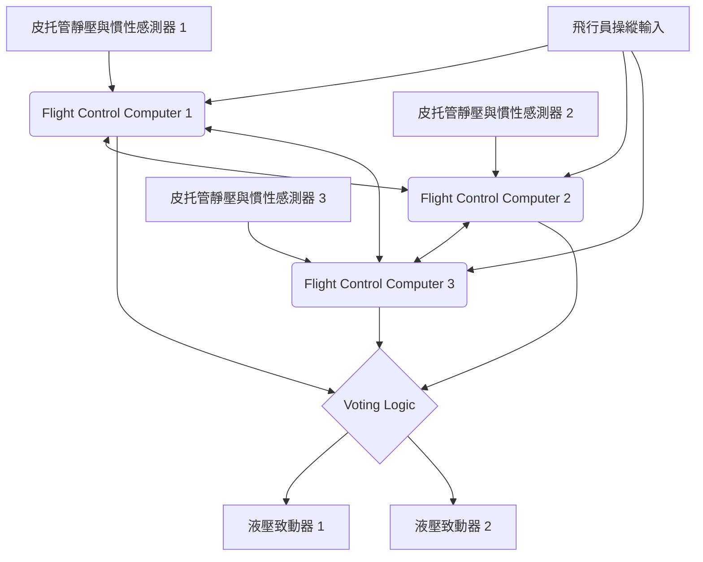

# 簡介：在空中飛行的巨大資料中心

現代的噴射客機已經遠遠超越了單純空氣動力學交通工具的框架，進化成了在高度即時作業系統（RTOS）上運作的「飛行巨大電腦網路」。構成其核心的，正是代表航空電子工程的「航空電子設備（Avionics）」以及透過電子訊號來控制機體的「線傳飛控（Fly-By-Wire: FBW）」技術。本文將從航太工程與控制工程的角度，針對這些系統底層的架構、控制法則（Control Laws），以及波音與空中巴士這兩大世界飛機製造商所交織出的「設計哲學之對立」，進行極其詳細且學術性的深入探討。

---

## 第1章：飛機操控的力學與從液壓到電氣的革命

### 傳統操控系統的機制與其極限

飛機在空中飛行所需的三維運動控制，是由俯仰（Pitch：縱向傾斜，由升降舵控制）、滾轉（Roll：橫向傾斜，由副翼控制）、偏航（Yaw：機頭左右擺動，由方向舵控制）這3個軸所構成的。從航空黎明期到1960年代左右的噴射客機（例如波音707或早期的737等），駕駛艙內的操縱桿（Control Wheel 或 Yoke）與尾翼、主翼上的動翼（Control Surface），是透過實體的金屬纜線、滑輪（Pulley）以及連桿（Rod）所組成的複雜網路直接連結的。

這種「機械式操控系統」最大的優點在於極度簡單且直觀。當飛行員拉動操縱桿時，該力量會透過纜線直接帶動升降舵，而打在舵面上的空氣阻力（風壓）會作為反作用力（Feel Force）回饋到操縱桿上。這讓飛行員能直接用手感受到「機體目前正承受多大的空氣動力學負載」。

然而，隨著飛機尺寸變大，當巡航速度達到超過馬赫0.8的穿音速區域時，施加在舵面上的氣動力負載會變得巨大到無法僅靠人類肌肉力量來推動。為了解決這個問題而引入的便是「液壓致動器（Hydraulic Actuator）」。就像汽車的動力方向盤一樣，透過纜線傳遞來的飛行員輸入會開關液壓伺服閥，並利用高達 3000 psi（約210大氣壓）的超高壓液壓驅動汽缸來移動動翼。

### 液壓機械式控制的課題與導入 Fly-By-Wire 的必然性

雖然引入液壓機構使駕駛巨大飛機成為可能，但依然殘留著幾個嚴重的課題。

1. **重量與複雜度的增加**：必須在機體從頭到尾佈滿長達數百公尺的鋼索（纜線）與滑輪，這些都會成為重達數噸的靜載重（Dead Weight）。此外，還需要纜線張力調節器等複雜機構，來補償纜線伸長或溫度變化所造成的張力改變。
2. **對非線性氣動特性應對的極限**：機體的氣動特性在低速（起降時）與高速（巡航時）會發生劇烈變化。在機械式系統中，必須使用彈簧或阻尼器等「人工感覺機構（Artificial Feel System）」或俯仰配平機構在物理上應對這種動態變化，要在全飛行區域獲得最佳的操舵響應是不可能的。
3. **靜態穩定性的負擔**：傳統飛機為了具備即使飛行員放手也能讓機體恢復原本姿態的「靜態穩定性（Static Stability）」，必須將重心配置在風壓中心之前，並設計水平尾翼隨時產生向下的升力。這會產生巨大的配平阻力（Trim Drag），成為油耗惡化的一大主因。

為了打破這些物理性與空氣動力學上的極限，必須將飛行員的物理性操作與動翼的動作「分離」。於是登場的便是將操縱桿的動作轉換為電子訊號（數位資料），由電腦計算出最佳舵角並向動翼的液壓（或電動）致動器發送指令的「線傳飛控（Fly-By-Wire: FBW）」。

---

## 第2章：線傳飛控的系統架構

線傳飛控的心臟部位，是被要求極限可靠性的飛行控制電腦（Flight Control Computers: FCC）網路。在客機的 FBW 中被要求擁有「每小時 10^-9 次的災難性故障率（Catastrophic Failure Rate）」，也就是「十億飛行小時發生不到一次致命故障」這種令人難以置信的可靠性。實現這個目標的架構設計，正是 FBW 的技術精髓。

### 多重冗餘系統（Redundancy）與投票演算法（Voting）

為了即使單一電腦或感測器故障也能繼續飛行，FBW 採用了三重（Triplex）或四重（Quadruplex）的冗餘架構。舉例來說，波音777擁有3套主要飛行電腦（Primary Flight Computer: PFC，分為左、中、右），而且每個 PFC 內部又由3個計算通道組成，因此實質上擁有「3×3 = 9重」的邏輯架構。

在這個冗餘系統中，最重要的就是「同步與投票（Synchronization and Voting）」演算法。
多台電腦會同時接收相同的輸入資料（飛行員的操作量、空速、姿態角等），並使用相同的控制法則進行計算。接著，將輸出的舵角指令值相互比較（跨通道資料連結）。

投票邏輯的基礎是「多數決（Majority Rule）」。如果3台電腦中有2台計算出「升降舵上仰5度」，而1台計算出「上仰10度」，則多數派的5度會被視為正確，而計算結果偏差的那1台電腦將會自動從網路中被隔離（Fail-Silent），剩下的2台則繼續進行控制（Fail-Operational）。

### 透過異構硬體與軟體排除共因故障（Dissimilarity）

即使做了三重冗餘，如果使用的是完全相同的 CPU 和完全相同的程式，當遇到某個特定的未知 Bug（軟體缺陷）或硬體設計失誤（勘誤）時，3台電腦有「同時得出相同錯誤答案」的危險性。這被稱為「共因故障（Common Mode/Cause Failure: CCF）」。

為了防止這種情況，波音和空中巴士將「異構並列設計（Dissimilarity）」追求到了極致。
例如在空中巴士A320中，主電腦 ELAC（升降舵副翼電腦）與 SEC（擾流板升降舵電腦）採用了完全不同製造商的 CPU（例如一方是 Intel 體系，另一方是 Motorola 體系）。更進一步，控制軟體的開發團隊在物理上與組織上也被完全分離，使用不同的程式語言（如 Ada 語言與 C 語言）與不同的編譯器，根據同一份需求規格書分別撰寫程式碼。這樣一來，即使一方的軟體有 Bug，另一方軟體存在相同 Bug 的機率在數學上幾乎被壓低至零。

### 航空電子資料匯流排：ARINC 429 與 ARINC 664 (AFDX)

連結這些感測器、電腦與致動器的通訊網路（航空電子資料匯流排）也經歷了獨自的進化。

從1980年代起長期作為標準的是「ARINC 429」規格。這是一種一對多的單向（單工）序列匯流排，使用一條雙絞線以 100kbps（或 12.5kbps）傳送32位元的資料字組。由於結構極為簡單且具確定性（Deterministic），至今仍被許多子系統所使用。

然而，在 A380、B787 或 A350 等最新銳機型中，通訊資料量呈現爆炸性成長，像 ARINC 429 這種點對點（Point-to-Point）的佈線在纜線重量上已達極限。因此引入的便是「ARINC 664 Part 7（通稱：AFDX - Avionics Full-Duplex Switched Ethernet）」。
AFDX 是以我們日常使用的乙太網路（IEEE 802.3）技術為基礎，但加入了強制保證「絕對的通訊延遲（Bounded Latency）」與「頻寬分配」的飛機專用設定檔。透過使用虛擬連結（Virtual Link: VL）的概念，針對每個資料串流由網路交換器（AFDX Switch）嚴格管理頻寬，建構出絕對不會發生封包碰撞或遺失的確定性（Deterministic）乙太網。這使得數百個設備能在高速的 100Mbps/1Gbps 網路上進行即時通訊。

---

## 第3章：飛行控制法則（Flight Control Laws）

FBW 最大的恩惠在於，它並非將飛行員的物理性操控輸入（Stick Input）直接轉換為動翼的角度（Surface Angle），而是由電腦解讀「飛行員想如何移動機體」的意圖（Intent），並根據目前的飛行狀態（速度、高度、重量等）實作出計算最佳舵角的「控制法則（Control Laws）」。

### C*（C-Star）法則：俯仰控制的革命

最新的客機（波音777/787及空中巴士A320以後）在縱向（俯仰）控制上所採用的是「C*（C-Star）控制法則」或其延伸的「C*U 法則」。

傳統飛機（或在直接法則狀態下），拉動操縱桿的幅度與「升降舵的舵角」成正比。但在低速與高速時，即使是相同的舵角，機體的反應（俯仰的速度與產生的G力）也完全不同。
相對於此，在 C* 法則中，飛行員移動操縱桿被解讀為『下達了「俯仰角速度（機頭上下擺動的角速度：q）」與「垂直加速度（G力負載：Nz）」的合成目標值指令』。

$$ C^* = K_1 \cdot q + K_2 \cdot N_z $$

（在此 $K_1, K_2$ 是會隨速度等變化的增益值）

- **低速時（如起降時）**：由於難以產生氣動上的G力，電腦主要透過回饋「俯仰角速度（q）」來控制機頭抬升或下降的速度。
- **高速時（巡航時）**：稍微抬高機頭就會產生強烈的G力，因此電腦主要透過回饋「垂直加速度（Nz）」來控制動翼，使其產生符合飛行員輸入的一定G力。

如此一來，飛行員無論飛行速度為何，都能獲得「只要拉動相同幅度的操縱桿，機體永遠會以相同感覺反應」的極度穩定操控特性。

### 故障安全階層結構：正常、備用、直接

為了防範感測器或電腦故障，飛機具備了控制法則的降級（Degradation）階層。以空中巴士的名稱為例，階層化如下：

1. **正常法則（Normal Law）**
   所有系統（ADIRU、電腦等）皆處於正常狀態。C*法則的完全操控感補償與後述的完整「飛行包絡線保護（Flight Envelope Protection）」皆有效。自動駕駛也能正常使用。
2. **備用法則（Alternate Law）**
   部分多重化感測器故障，無法獲得確切資料（例如精確的空速等）的狀態。雖然基本的姿態控制（俯仰角速度或滾轉角速度）回饋仍具作用，但飛行包絡線保護（如防失速功能等）的部分或全部將被解除。
3. **直接法則（Direct Law）**
   多數電腦或感測器失效，無法進行複雜計算的最終備份狀態。FBW 將變成單純的「電子纜線」，操縱桿的動作將直接按比例傳遞給動翼的舵角（比例控制）。完全沒有飛行包絡線保護，操縱感將與傳統飛機完全相同（不過隨速度而變的靈敏度變化會直接顯現）。

### 飛行包絡線保護（Flight Envelope Protection）

這是 FBW 所帶來最大的安全技術。飛機擁有能安全飛行的極限區域（包絡線：Envelope），包括速度（失速速度與極限馬赫數）、坡度角（Bank Angle）、俯仰角、G值負載（負載倍數）等。當機體試圖超越這個極限時，FBW 會讓電腦介入以防止其發生。

- **俯仰姿態保護**：限制機頭上仰角不超過一定值（例：+30度），或機頭下俯角不超過一定值（例：-15度）。
- **坡度角保護**：控制副翼使滾轉角不超過一定值（例：67度）。
- **失速保護（Alpha Protection）**：當攻角（Angle of Attack: AoA, Alpha）接近失速極限時，即使飛行員繼續拉著操縱桿，電腦也會拒絕進一步抬高機頭，並自動將發動機推力加到最大（TOGA）以避免失速。

---

## 第4章：波音 vs 空中巴士：決定性的設計哲學對立

在導入 FBW 技術時，將民航業界一分為二的波音與空中巴士，對於「駕駛艙設計與人機權限委任」有著完全不同的設計哲學。這是現代航空工程中最令人感興趣的討論之一。

### 空中巴士的哲學：「由電腦提供絕對的保護與硬性限制（Hard Limit）」

1988年投入營運的A320，是世界首款全數位 FBW 客機。空中巴士的基本哲學是「**人會犯錯。因此，極致的安全必須由電腦計算出的硬性限制（絕對限制）來守護**」。

1. **採用側桿（Side-stick）**：
   空中巴士廢除了傳統需要雙手握持的操縱桿（Yoke），而在機長席的左側、副駕駛席的右側配置了宛如戰鬥機般的側桿。這戲劇性地提升了儀表板的可視性。
2. **操縱桿的非連動性**：
   機長與副駕駛的側桿在物理上並沒有連接。當一方操作時，另一方的側桿不會跟著移動（同時輸入時，輸入值會被代數相加，或需透過優先按鈕搶奪控制權）。
3. **硬性保護（Hard Envelope Protection）**：
   只要正常法則有效，無論飛行員是故意還是處於恐慌狀態，就算將側桿拉到極限不放，機體也絕對不會超過失速攻角，坡度角也不會超過限制值。也就是說，「電腦擁有覆寫（拒絕）飛行員操作的權限」。

### 波音的哲學：「最終決定權永遠在飛行員手中（軟性限制）」

另一方面，波音於1995年投入營運的首款 FBW 客機 B777（以及後來的 B787），則貫徹了「**無論在什麼情況下，最了解現場狀況的人類飛行員都應當擁有最終決定權**」的哲學。

1. **維持傳統的操縱盤（Yoke）**：
   波音沒有採用側桿，而是保留了傳統的操縱盤。即使是 FBW 飛機，透過地板下的機構，機長席與副駕駛席的操縱盤在物理上（或透過電動伺服）是連動的。這樣一來，飛行員之間能透過觸覺與視覺察覺對方的操作。
2. **人工感覺機構（Artificial Feel）與反向驅動（Backdrive）**：
   當自動駕駛在操控時，駕駛艙的操縱盤也會配合動翼的動作而物理性移動（空中巴士的側桿則不會動）。此外，還內建了會根據速度模擬操縱盤重量（操舵力）的致動器，將「空氣動力學的手感」擬真地傳遞給飛行員。
3. **軟性保護（Soft Envelope Protection）**：
   波音飛機也有失速保護與坡度角限制，但那並不是「絕對的牆壁」。當機體接近極限時，操縱盤會變得非常重以警告飛行員，但如果飛行員用「更強的力量（例如約 22.5kg 以上的力）」繼續拉動操縱盤，就能「突破（Override）」系統的設定極限，進行超越極限的機動。這是基於「在電腦無法預想的極限狀況（例如迴避飛彈或避免地形撞擊）下，即使可能會損壞機體，也應將採取迴避行動的權限保留給飛行員」的思想。

這種「要相信機器，還是相信人類」的哲學差異，至今依然作為兩家公司駕駛艙設計的根本差異而持續存在。

---

## 第5章：感測器融合與自動降落（Autoland）

FBW 系統的高度發展，是實現與儀器降落系統（ILS: Instrument Landing System）或基於 GPS 的 GLS（GBAS Landing System）連動之完全自動降落（Autoland）所不可或缺的。在濃霧導致能見度幾乎為零（Cat IIIb/IIIc 條件）的狀態下，要將載有數百名乘客、重達數百噸的機體軟著陸在跑道的中心線上，這項技術可說是控制工程的極致。

### 掌握空間的感測器群（ADIRU）

為了進行精確的控制，必須以極高的精度了解機體在空間的何處、以何種姿態、如何移動。擔綱此任的便是「大氣資料與慣性基準單元（Air Data Inertial Reference Unit: ADIRU）」。

- **大氣資料（Air Data）**：透過安裝在機體外部的皮托管（測量動壓）、靜壓孔（測量靜壓）以及溫度感測器，計算出空速（Airspeed）、高度（Altitude）、馬赫數與攻角（AoA）。
- **慣性基準（IRS: Inertial Reference System）**：利用環形雷射陀螺儀（RLG）或光纖陀螺儀（FOG）高精度地檢測機體三軸的角速度與加速度，並將其積分以自主計算出機體姿態（俯仰、滾轉、偏航）以及在地球上的絕對座標（經緯度）。

現代的航空電子設備中，會利用卡爾曼濾波器（Kalman Filter）等將這些 ADIRU 的資料與 GPS (GNSS) 訊號進行融合（感測器融合），並持續補償漂移誤差，從而獲得公分至公尺級的精密導航解。

### 自動降落的控制迴圈與著陸平飄・落地滑行

在使用 ILS 的自動降落中，機上的天線會接收從地面發射的定位台電波（Localizer：跑道中心線）與滑降台電波（Glide Slope：約3度的下降角），FCC 會進行回饋控制，使機體對準該電波波束的中心。

1. **進場階段（Approach Phase）**：
   在高度約1500英呎時，3套自動駕駛將會全部接合，多數決邏輯會被啟動（Fail-Operational 狀態）。為了使 ILS 的誤差訊號歸零，會連續不斷地微調俯仰與滾轉。
2. **蟹行角（Crab Angle）與側風補償**：
   當有側風時，機體會以機頭迎向風的傾斜姿態（蟹行姿態）下降。
3. **解除蟹行（Decrab）與平飄（Flare）**：
   當無線電高度計（Radio Altimeter）偵測到高度約50英呎時，自動駕駛會自動轉換為「平飄模式」。將機頭微微抬起以降低下降率（通常至約 150fpm），緩和觸地時的衝擊。同時，如果有側風，會踢方向舵使機頭轉正對齊跑道方向（解除蟹行），並為了不被風吹偏而打副翼產生滾轉角，讓迎風側的主起落架先觸地。這種複雜的多參數多變數控制，電腦能以人類無法企及的毫秒級精度執行。
4. **落地滑行（Rollout）**：
   觸地後，自動駕駛仍會持續追蹤定位台訊號，自動控制方向舵與鼻輪（前輪）轉向，在跑道中心線上筆直減速。同時，擾流板的自動展開、自動煞車以固定減速率進行制動等，也都由電腦來管理。

---

## 第6章：航空電子設備的未來與自主飛行

FBW 與航空電子設備至今仍在急速進化，試圖大幅改變次世代航空業界的樣貌。

### 整合模組化航空電子（IMA：Integrated Modular Avionics）

在傳統的飛機中，自動駕駛、飛行管理系統（FMS）、起落架控制、空調控制等，每一個功能都搭載著專用且獨立的電腦（LRU: Line Replaceable Unit）。但這造成了重量、耗電與成本的浪費。
現代的 B787 或 A350 等機型採用了「整合模組化航空電子（IMA）」架構。這是在機內配置幾個如同通用高效能刀鋒伺服器的通用運算模組（CCM），並在上面運行基於 ARINC 653 規格的即時作業系統（RTOS）。透過 RTOS 的「時間與空間分割（Time and Space Partitioning）」技術，使得在同一個 CPU 與記憶體上，將「關鍵的飛行控制軟體」與「機內娛樂控制軟體」完全隔離並同時執行成為可能。這實現了硬體的大幅減少與輕量化。

### 光傳飛控（Fly-By-Light）與電氣化（More Electric Aircraft）

作為資料匯流排的進化，將銅線替換為光纖的「光傳飛控（FBL）」研究正在推進中。光纖除了擁有超寬頻與輕量的特點外，對於雷擊（Lightning Strike）與強烈電磁干擾（EMI / EMP）具有完全免疫的特性，這對飛機而言是極其有利的。

此外，基於「多電飛機（MEA：More Electric Aircraft）」的概念，已開始從傳統笨重的液壓管線系統，過渡至利用馬達直接驅動動翼的「電動機械致動器（EMA）」，或是致動器內部包含獨立液壓泵浦的「電動靜液壓致動器（EHA）」（這在 A380 或 B787 的備用系統中已經實用化）。這減少了因液壓漏油而導致全系統喪失的風險，並進一步提升了燃油效率。

### AI 的導入與單一飛行員營運（SPO），以及邁向完全自主飛行

作為終極的未來，目前正在討論將人工智慧（AI）與機器學習導入航空電子設備中。現今的 FBW 終究是依照「人類所編程的確定性邏輯（Deterministic Logic）」在運作，但針對複雜的氣象條件或未知的機體損傷，讓 AI 能在瞬間學習並重新建構新的控制法則以維持飛行的適應性控制（Adaptive Control）研究正持續進行。

此外，作為對飛行員短缺的對策，空中巴士等公司正積極測試將目前機長與副駕駛2人體制的客機，在巡航階段減少為1人體制（Single Pilot Operations: SPO），並讓高度自主的航空電子設備或地面的遠端操作員來替代副駕駛角色的構想（如 eMCO 等）。線傳飛控最終極的歸宿，或許就是人類飛行員從駕駛艙中完全消失的「完全自主客機」。

---

## 結語

「線傳飛控」並非單純只是將纜線替換為電線的技術。它是一種典範轉移（Paradigm Shift），將飛機從空氣動力學的制約中解放出來，並轉變為集結了控制工程、資訊工程與網路技術精華的「飛行的系統中系統（System of Systems）」。
正如波音與空中巴士設計哲學的差異所見，那裡始終存在著「人類的角色究竟為何」這個根本性的問題。未來，隨著 AI 與自主化進一步發展，航空電子技術將會持續在背後支撐著我們的空中之旅，使其更加安全、更加高效且更加寧靜。

## 附錄：Fly-By-Wire 的數學建模與轉移函數（Transfer Functions）

為了加深對 FBW 系統的學術理解，針對飛機縱向運動（俯仰軸）的基本轉移函數與回饋控制方塊圖模型進行補充說明。

### 飛機的動態特性模型（短週期模式）

飛機的縱向運動主要分解為短週期模式（Short Period Mode）與長週期模式（起伏模式: Phugoid Mode）兩種。FBW 的 C* 法則與俯仰角速度控制所直接阻尼並穩定化的，正是這個「短週期模式」。

從升降舵舵角 $\delta_e$ 到俯仰角速度 $q$ 的轉移函數 $G_p(s) = \frac{q(s)}{\delta_e(s)}$，可由一般的線性化剛體運動方程式近似如下：

$$
\frac{q(s)}{\delta_e(s)} = \frac{K_q(T_{\theta_2}s + 1)}{s^2 + 2\zeta_{sp}\omega_{sp}s + \omega_{sp}^2}
$$

在此：
- $K_q$ 為控制的穩態增益（大幅依賴速度與動壓）
- $T_{\theta_2}$ 為俯仰運動與飛行軌跡（Flight Path）變化的相位落後時間常數
- $\zeta_{sp}$ 為短週期模式的阻尼比（Damping Ratio）
- $\omega_{sp}$ 為短週期模式的自然角頻率（Natural Frequency）

在傳統的機械式操控系統中，於高空或高速區域會出現氣動阻尼下降，導致 $\zeta_{sp}$ 變得非常小（機體容易在俯仰方向產生震盪）的問題。

### 透過回饋控制改善特性

在 FBW 系統中，會將陀螺儀感測器（ADIRU）測量到的俯仰角速度 $q_{sensor}$ 與垂直加速度 $N_{z\_sensor}$ 回饋給電腦，並與飛行員的指令值 $q_{cmd}$（或者是 $C^*_{cmd}$）計算出誤差 $e$。

若考慮導入最基本的俯仰角速度回饋控制（比例・積分控制：PI 控制）時的閉迴路轉移函數。假設控制器（Controller）的轉移函數為 $C(s) = K_p + \frac{K_i}{s}$，由控制器輸出的舵角指令 $\delta_c$ 為：

$$
\delta_c(s) = C(s) \left( q_{cmd}(s) - q_{sensor}(s) \right)
$$

將其乘上液壓致動器的一階落後特性 $G_a(s) = \frac{1}{\tau_a s + 1}$，即為實際的舵角 $\delta_e$。

透過增益排程（Gain Scheduling）適當地設定增益 $K_p, K_i$，就能將整體系統的閉迴路轉移函數 $G_{closed}(s) = \frac{q(s)}{q_{cmd}(s)}$ 的分母多項式（特徵方程式）的極點（Poles），在任意速度區域配置為最佳的 $\zeta$（通常在0.7附近）與 $\omega_n$。這樣一來，無論實體的尾翼大小或重心位置為何，都能夠在軟體上永遠模擬出「理想飛機」的操縱特性。這就是 FBW 帶來的「人工穩定性（Artificial Stability）」的數學本質。
