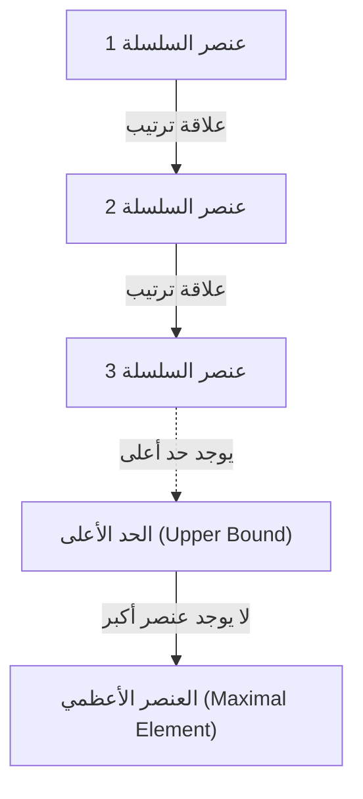

# بديهية الاختيار ومبرهنة زورن: مفهوم «الاختيار» الذي هزّ أسس الرياضيات

في تاريخ الرياضيات، لم تثر أي بديهية من النقاش ما أثارته **بديهية الاختيار** (Axiom of Choice)، ولم تصبح أي بديهية بنفس القدر ضرورة لا غنى عنها في الرياضيات الحديثة. في هذا المقال، نتعمق من الأساسيات في بديهية الاختيار والقضية المكافئة لها وهي **مبرهنة زورن** (Zorn's Lemma). سنقدم شرحاً شاملاً يبدأ من الفهم البديهي، مروراً بالصياغة الرياضية الدقيقة، والخلفية التاريخية، وصولاً إلى التطبيقات في مختلف فروع الرياضيات الحديثة.

## 1. ما هي بديهية الاختيار؟ الحدس والتعريف الدقيق

بديهية الاختيار تقدم ادعاءً بديهياً بسيطاً للغاية. "إذا أُعطيت عائلة (مجموعة) من المجموعات لا تحتوي على المجموعة الفارغة، فمن الممكن اختيار عنصر واحد من كل مجموعة لتشكيل مجموعة جديدة."

بالحس العام، إذا كان لدينا عدة صناديق وكل صندوق يحتوي على كرة واحدة على الأقل، فإن اختيار كرة واحدة من كل صندوق يبدو أمراً بديهياً. ولكن عندما يصبح عدد الصناديق لانهائياً، فإن هذه "العملية البديهية" لم تعد بديهية رياضياً.

### 1.1. الصياغة الرياضية الدقيقة

في نظام بديهيات زيرميلو-فرينكل (ZF)، وهو النظام البديهي المعياري في نظرية المجموعات، تُصاغ بديهية الاختيار (AC) على النحو التالي:

$$
\forall X \left( \emptyset \notin X \implies \exists f: X \to \bigcup X \quad \text{بحيث} \quad \forall A \in X, f(A) \in A \right)
$$

هنا، تُسمى الدالة $f$ **دالة الاختيار** (choice function). أي أنها تدّعي وجود دالة تُعيّن لكل مجموعة غير فارغة $A$ تنتمي إلى عائلة المجموعات $X$ عنصراً $f(A)$ منها.

### 1.2. الفرق بين المنتهي واللامنتهي: مثال جوارب راسل

عند اختيار عناصر من عدد منتهٍ من المجموعات، لا حاجة لبديهية الاختيار. لأنه يمكن اختيار العناصر واحداً تلو الآخر ضمن إطار المنطق المعتاد. ولكن عند اختيار عنصر واحد من كل مجموعة في عدد لانهائي من المجموعات في آنٍ واحد، لا يمكن بناء دالة الاختيار ما لم توجد "قاعدة" تحدد طريقة الاختيار بشكل وحيد.

قدم الفيلسوف والرياضياتي البريطاني بيرتراند راسل مثالاً شهيراً لتوضيح هذه الحالة:

> "لاختيار فردة واحدة من عدد لانهائي من أزواج الأحذية، لا نحتاج إلى بديهية الاختيار، لأن هناك قاعدة واضحة: 'اختر دائماً الحذاء الأيسر'. ولكن لاختيار جورب واحد من عدد لانهائي من أزواج الجوارب، نحتاج إلى بديهية الاختيار، لأن الجوارب لا تتميز بيمين ويسار، فلا يمكن تقديم قاعدة صريحة للاختيار."

يوضح هذا المثال ببراعة لماذا يجب أن نطلب وجود دالة الاختيار كـ"بديهية" عندما يكون "البناء القاعدي" مستحيلاً في الاختيارات اللانهائية.

## 2. مبرهنة زورن: القضية المكافئة القوية لبديهية الاختيار

في الرياضيات المجردة الحديثة، كثيراً ما يكون استخدام **مبرهنة زورن** (Zorn's Lemma)، وهي نظرية مكافئة لبديهية الاختيار، أوضح بكثير في البراهين من تطبيق بديهية الاختيار مباشرة. اقتُرحت هذه المبرهنة من قبل ماكس زورن عام 1935، وأصبحت أداة معيارية في الجبر ونظرية الفضاءات التوبولوجية.

### 2.1. نص مبرهنة زورن

مبرهنة زورن هي ادعاء يتعلق بالمجموعات المرتبة جزئياً:

> **مبرهنة زورن**
> في مجموعة مرتبة جزئياً $(P, \le)$ غير فارغة، إذا كان لكل مجموعة جزئية مرتبة كلياً (سلسلة) حد أعلى، فإن $P$ تحتوي على عنصر أعظمي واحد على الأقل.

$$
\text{إذا كانت كل سلسلة } C \subseteq P \text{ لها حد أعلى، فإن } P \text{ لها عنصر أعظمي.}
$$

### 2.2. ترتيب المصطلحات

لفهم مبرهنة زورن، دعونا نوضح المفاهيم ذات الصلة:

- **المجموعة المرتبة جزئياً** (Partially Ordered Set, Poset): مجموعة مُعرَّف عليها علاقة ترتيب $\le$ بين عناصرها، ولكن ليس بالضرورة أن يكون كل زوج من العناصر قابلاً للمقارنة. على سبيل المثال، علاقة الاحتواء $\subseteq$ بين المجموعات هي ترتيب جزئي.
- **المجموعة المرتبة كلياً / السلسلة** (Total Order / Chain): مجموعة جزئية يكون فيها أي عنصرين قابلين للمقارنة.
- **الحد الأعلى** (Upper Bound): عنصر "أكبر من أو يساوي" جميع عناصر السلسلة. لا يشترط أن يكون الحد الأعلى نفسه منتمياً إلى السلسلة.
- **العنصر الأعظمي** (Maximal Element): عنصر في المجموعة $P$ لا يوجد عنصر "أكبر منه فعلياً". يختلف عن العنصر الأكبر (الأكبر من جميع العناصر)، إذ يمكن أن يوجد أكثر من عنصر أعظمي.

## 3. شبكة التكافؤ: بديهية الاختيار، مبرهنة زورن، ونظرية الترتيب الجيد

تبدو بديهية الاختيار ومبرهنة زورن ادعاءين مختلفين تماماً، ولكن في ظل نظام بديهيات ZF، هما متكافئتان (إذا كانت إحداهما صحيحة فالأخرى صحيحة أيضاً). في شبكة إثبات هذا التكافؤ، تلعب **نظرية الترتيب الجيد** (Well-ordering theorem) التي أثبتها إرنست زيرميلو دوراً مهماً.

### 3.1. ما هي نظرية الترتيب الجيد؟

> **نظرية الترتيب الجيد**
> أي مجموعة يمكن ترتيبها ترتيباً جيداً. أي أنه لأي مجموعة، يمكن تعريف علاقة ترتيب كلي بحيث تحتوي أي مجموعة جزئية غير فارغة منها على عنصر أصغري.

مجموعة الأعداد الحقيقية $\mathbb{R}$ ليست مرتبة ترتيباً جيداً وفق الترتيب المعتاد (مثلاً، الفترة المفتوحة $(0, 1)$ ليس لها عنصر أصغري). ولكن نظرية الترتيب الجيد تدعي أنه يمكن إعطاء مجموعة الأعداد الحقيقية ترتيباً جيداً "ما". وهذه نتيجة غير بديهية للغاية.

### 3.2. حلقة إثبات التكافؤ

في نظام بديهيات ZF، القضايا الثلاث التالية متكافئة تماماً:

1. بديهية الاختيار (Axiom of Choice)
2. نظرية الترتيب الجيد (Well-ordering Theorem)
3. مبرهنة زورن (Zorn's Lemma)

في كتب الرياضيات المعيارية، يُثبت التكافؤ بالترتيب التالي:

إثبات استنتاج بديهية الاختيار من مبرهنة زورن سهل نسبياً. نأخذ مجموعة جميع البناءات الجزئية لدالة الاختيار ونرتبها جزئياً بعلاقة الاحتواء، ثم نطبق مبرهنة زورن لإيجاد العنصر الأعظمي، فنثبت وجود دالة اختيار معرّفة على المجال بأكمله.

## 4. القوة التطبيقية الساحقة لمبرهنة زورن في الرياضيات الحديثة

مبرهنة زورن أداة قوية تضمن وجود "الأعظمي" في الرياضيات المجردة. فيما يلي نستعرض أمثلة تطبيقية بارزة في كل مجال.

### 4.1. الجبر: كل فضاء شعاعي يملك أساساً
في الجبر الخطي، يمكن إثبات وجود أساس للفضاءات الشعاعية ذات البعد المنتهي بطريقة بنائية. ولكن في الفضاءات الشعاعية ذات البعد اللانهائي، مثل فضاء جميع الدوال على حقل الأعداد الحقيقية $\mathbb{R}$، ليس من البديهي أن يوجد أساس هامل (مجموعة جزئية يمكن فيها تمثيل أي عنصر بشكل وحيد كتركيبة خطية لعدد منتهٍ من عناصر الأساس).

ملخص البرهان: نرتب جميع المجموعات الجزئية المستقلة خطياً للفضاء الشعاعي $V$ بعلاقة الاحتواء $\subseteq$. بأخذ أي سلسلة في هذه المجموعة المرتبة جزئياً، نجد أن اتحادها أيضاً مستقل خطياً (لأننا نأخذ فقط تركيبات خطية منتهية). إذن الاتحاد هو حد أعلى. بموجب مبرهنة زورن يوجد عنصر أعظمي، وهذا العنصر الأعظمي هو الأساس المطلوب.

### 4.2. نظرية الحلقات: مبرهنة كرول
> أي حلقة إبدالية ذات عنصر محايد $1 \neq 0$ تحتوي على مثالي أعظمي واحد على الأقل.

هذه المبرهنة (مبرهنة كرول) هي أيضاً تطبيق مباشر لمبرهنة زورن. نرتب جميع المثاليات الحقيقية (التي لا تحتوي 1) بعلاقة الاحتواء. الحد الأعلى لأي سلسلة (اتحادها) هو أيضاً مثالي حقيقي لا يحتوي 1، فيُستنتج وجود العنصر الأعظمي (المثالي الأعظمي).

### 4.3. نظرية الفضاءات التوبولوجية: مبرهنة تيخونوف
> الجداء المباشر لأي عدد من الفضاءات المتراصة يكون متراصاً بالنسبة لتوبولوجيا الجداء.

مبرهنة تيخونوف هي واحدة من أهم المبرهنات في نظرية الفضاءات التوبولوجية، وتشكل أساساً للتحليل الدالي. ومن المثير للاهتمام أنه ثُبت أن مبرهنة تيخونوف مكافئة لبديهية الاختيار في نظام بديهيات ZF.

### 4.4. التحليل الدالي: مبرهنة هان-باناخ
تضمن مبرهنة هان-باناخ إمكانية تمديد أي دالة خطية مقيدة معرّفة على فضاء جزئي إلى الفضاء الكامل دون زيادة النظيم (المقدار). تتطلب عملية التمديد هذه تكرار خطوة التمديد بُعداً واحداً في كل مرة عدداً لانهائياً من المرات، ولضمان التمديد إلى الفضاء بأكمله كنهاية لهذه العملية، تكون مبرهنة زورن ضرورية لا غنى عنها.

## 5. المفارقة التي تجلبها بديهية الاختيار: مبرهنة بناخ-تارسكي

بينما تمنح بديهية الاختيار الرياضيات قوة هائلة، فإنها تؤدي أيضاً إلى نتائج تدمر حدسنا عن الفضاء تماماً. أشهر مثال على ذلك هو **مفارقة بناخ-تارسكي** (Banach-Tarski Paradox).

### 5.1. محتوى المفارقة

> يمكن تقسيم كرة مصمتة في الفضاء الإقليدي ثلاثي الأبعاد إلى عدد منتهٍ من الأجزاء (مثلاً 5 قطع). ثم بإعادة ترتيب هذه الأجزاء بالدوران والانسحاب فقط (حركات جسم صلب) وتجميعها مجدداً، يمكن تكوين **كرتين** بنفس حجم الكرة الأصلية تماماً.

$$
1 \text{ كرة} \xrightarrow{\text{تقسيم إلى } 5 \text{ قطع، تدوير وإزاحة}} 2 \text{ كرتان بنفس الحجم}
$$

### 5.2. لماذا يحدث هذا؟

هذا "السحر" الذي ينتج كرتين من كرة واحدة يعود إلى أن بديهية الاختيار تتيح إنشاء "مجموعات غير قابلة للقياس بمقياس لوبيغ (مجموعات بالغة التعقيد والتشتت لا يمكن تعريف حجم لها)". القطع الناتجة عن التقسيم ليست أجساماً صلبة ذات سطوح قطع ملساء كما نتخيل، بل هي بنى تشبه متاهات لانهائية من النقاط. ولأن الحجم غير معرّف، لا ينطبق "قانون حفظ الحجم"، فيبدو أن الحجم قد تضاعف.

## 6. نظام بديهيات ZFC: المعيار الفعلي للرياضيات الحديثة

بسبب النتائج المناقضة للحدس مثل مبرهنة بناخ-تارسكي، عارض كثير من الرياضيين في بداية القرن العشرين بديهية الاختيار بشدة، ومنهم هنري لوبيغ وإميل بوريل (ما يُعرف بالنهج البنائي).

ومع ذلك، تتبنى الرياضيات المعيارية الحديثة **نظام بديهيات ZFC** (Zermelo-Fraenkel set theory with the axiom of Choice) — أي نظرية زيرميلو-فرينكل مع بديهية الاختيار — كأساس راسخ.

$$
\text{ZFC} = \text{ZF} + \text{بديهية الاختيار}
$$

### لماذا قُبل نظام ZFC؟

السبب بسيط وواضح. لأن رفض بديهية الاختيار (الاقتصار على نظام بديهيات ZF فقط) يعني فقدان إنجازات رياضية هائلة جداً. ستنهار أسس كل الفضاءات الشعاعية، وتراص الجداءات في الفضاءات التوبولوجية، والعديد من الخصائص المفيدة لمقياس لوبيغ. وقد قُبلت بديهية الاختيار على الرغم من "ثمن" مفارقة بناخ-تارسكي، من أجل الحفاظ على نظام الرياضيات المجردة الغني والجميل.

## 7. الخاتمة: جسر فوق هاوية اللانهاية

بديهية الاختيار ومبرهنة زورن توضحان كيف أن عملية "الاختيار"، التي تبدو بديهية لدرجة أنها لا تُلاحظ في المجال المنتهي، تولّد بنى عميقة ومرعبة وجميلة بمجرد الدخول إلى عالم اللانهاية.

مبرهنة زورن، كعصا سحرية قوية تضمن وجود "الأعظمي" في نهاية سلاسل لانهائية، قادت تطور الجبر والتحليل الرياضي. في أعماق المبرهنات الرياضية التي نستخدمها يومياً دون تفكير، تكمن هذه الفلسفة العميقة المسماة "بديهية الاختيار". إن أسس الرياضيات ليست مجرد ألغاز منطقية، بل هي ملحمة عظيمة عن كيفية مواجهة العقل البشري لمفهوم اللانهاية.
