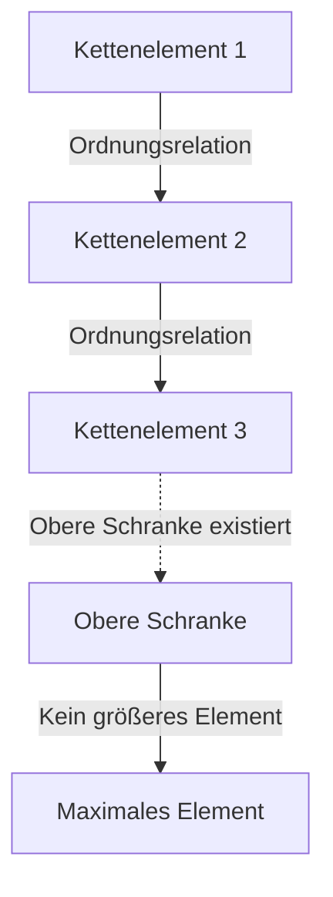
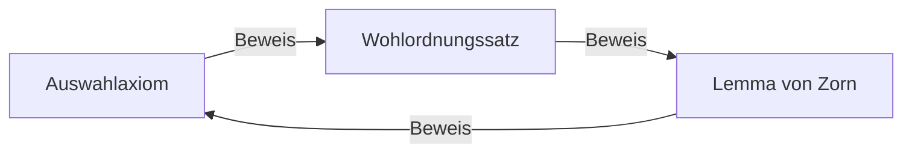

# [Das Auswahlaxiom und das Lemma von Zorn](https://kenji.blog/de/p/axiom-of-choice-and-zorns-lemma/): Das Konzept der „Wahl“, das die Grundlagen der Mathematik erschütterte

In der Geschichte der Mathematik gibt es kein Axiom, das so viel Diskussion hervorgerufen hat und gleichzeitig so unverzichtbar für die moderne Mathematik geworden ist wie das **Auswahlaxiom** (Axiom of Choice). In diesem Artikel gehen wir dem Auswahlaxiom und der dazu äquivalenten Aussage, dem **Lemma von Zorn** (Zorn's Lemma), von Grund auf nach. Wir bieten eine umfassende Erläuterung, die von intuitivem Verständnis über strenge mathematische Formalisierung und historischen Hintergrund bis hin zu Anwendungen in verschiedenen Bereichen der modernen Mathematik reicht.

## 1. Was ist das Auswahlaxiom? Intuition und strenge Definition

Das Auswahlaxiom macht eine intuitiv sehr einfache Behauptung: „Gegeben eine Familie (Sammlung) von Mengen, die die leere Menge nicht enthält, ist es möglich, aus jeder Menge ein Element auszuwählen und eine neue Menge zu bilden."

Im Alltagsverständnis erscheint es, wenn man mehrere Kisten hat, die jeweils mindestens einen Ball enthalten, völlig selbstverständlich, aus jeder Kiste einen Ball auswählen zu können. Wenn jedoch die Anzahl der Kisten unendlich wird, ist diese „offensichtliche Operation" mathematisch nicht mehr selbstverständlich.

### 1.1. Strenge mathematische Formalisierung

Im Standardaxiomensystem der Mengenlehre, der Zermelo-Fraenkel-Mengenlehre (ZF), wird das Auswahlaxiom (AC) wie folgt formalisiert:

$$
\forall X \left( \emptyset \notin X \implies \exists f: X \to \bigcup X \quad \text{s.d.} \quad \forall A \in X, f(A) \in A \right)
$$

Dabei wird die Funktion $f$ als **Auswahlfunktion** (choice function) bezeichnet. Das heißt, es wird die Existenz einer Funktion behauptet, die jeder nichtleeren Menge $A$ aus der Mengenfamilie $X$ eines ihrer Elemente $f(A)$ zuordnet.

### 1.2. Der Unterschied zwischen Endlich und Unendlich: Russells Sockenbeispiel

Wenn man Elemente aus einer endlichen Anzahl von Mengen auswählt, ist das Auswahlaxiom nicht erforderlich. Denn im üblichen Rahmen der Logik können die Elemente der Reihe nach einzeln ausgewählt werden. Wenn man jedoch gleichzeitig aus unendlich vielen Mengen je ein Element auswählen soll, kann keine Auswahlfunktion konstruiert werden, solange keine „Regel" existiert, die die Auswahl eindeutig bestimmt.

Der britische Philosoph und Mathematiker Bertrand Russell präsentierte eine berühmte Analogie, um diese Situation zu veranschaulichen:

> „Um aus unendlich vielen Paar Schuhen jeweils einen auszuwählen, ist das Auswahlaxiom nicht nötig, denn es gibt eine klare Regel: ‚Wähle immer den linken Schuh.' Um jedoch aus unendlich vielen Paar Socken jeweils eine auszuwählen, ist das Auswahlaxiom notwendig, da Socken keinen Links-Rechts-Unterschied haben und somit keine Regel zur Auswahl explizit angegeben werden kann."

Diese Analogie zeigt auf brillante Weise, warum in Fällen, in denen eine „regelbasierte Konstruktion" bei unendlichen Wahlen unmöglich ist, die Existenz einer Auswahlfunktion als „Axiom" gefordert werden muss.

## 2. Das Lemma von Zorn: Eine starke äquivalente Aussage zum Auswahlaxiom

In der modernen abstrakten Mathematik gibt es zahlreiche Fälle, in denen die Verwendung des **Lemmas von Zorn** – eines zum Auswahlaxiom äquivalenten Satzes – Beweise dramatisch übersichtlicher macht als die direkte Anwendung des Auswahlaxioms. Dieses 1935 von Max Zorn vorgeschlagene Lemma ist zu einem Standardwerkzeug in der Algebra und der Topologie geworden.

### 2.1. Die Aussage des Lemmas von Zorn

Das Lemma von Zorn ist die folgende Behauptung über halbgeordnete Mengen:

> **Lemma von Zorn**
> In einer nichtleeren halbgeordneten Menge $(P, \le)$ besitzt $P$ mindestens ein maximales Element, wenn jede total geordnete Teilmenge (Kette) eine obere Schranke hat.

$$
\text{Wenn jede Kette } C \subseteq P \text{ eine obere Schranke hat, dann hat } P \text{ ein maximales Element.}
$$

### 2.2. Begriffsklärung

Klären wir die Begriffe, die für das Verständnis des Lemmas von Zorn relevant sind:

- **Halbgeordnete Menge** (Partially Ordered Set, Poset): Eine Menge, in der eine Ordnungsrelation $\le$ zwischen den Elementen definiert ist, aber nicht alle Paare von Elementen vergleichbar sein müssen. Zum Beispiel ist die Inklusionsrelation $\subseteq$ auf Mengen eine Halbordnung.
- **Total geordnete Menge / Kette** (Total Order / Chain): Eine Teilmenge, in der je zwei Elemente vergleichbar sind.
- **Obere Schranke** (Upper Bound): Ein Element, das „größer oder gleich" jedem Element einer Kette ist. Die obere Schranke selbst muss nicht in der Kette enthalten sein.
- **Maximales Element** (Maximal Element): Ein Element der Menge $P$, für das kein „echt größeres" Element existiert. Im Gegensatz zum größten Element (das größer als alle Elemente ist) können mehrere maximale Elemente existieren.

## 3. Das Netzwerk der Äquivalenzen: Auswahlaxiom, Lemma von Zorn und Wohlordnungssatz

[Das Auswahlaxiom und das Lemma von Zorn](https://kenji.blog/de/p/axiom-of-choice-and-zorns-lemma/) scheinen völlig verschiedene Behauptungen zu sein, sind jedoch unter dem ZF-Axiomensystem äquivalent (wenn eines wahr ist, ist auch das andere wahr). In diesem Netzwerk von Äquivalenzbeweisen spielt der von Ernst Zermelo bewiesene **Wohlordnungssatz** (Well-ordering theorem) eine entscheidende Rolle.

### 3.1. Was ist der Wohlordnungssatz?

> **Wohlordnungssatz**
> Jede Menge kann wohlgeordnet werden. Das heißt, für jede Menge kann eine totale Ordnungsrelation definiert werden, so dass jede nichtleere Teilmenge ein kleinstes Element besitzt.

Die Menge der reellen Zahlen $\mathbb{R}$ ist unter der üblichen Ordnung nicht wohlgeordnet (zum Beispiel hat das offene Intervall $(0, 1)$ kein kleinstes Element). Der Wohlordnungssatz behauptet jedoch, dass auch der Menge der reellen Zahlen „irgendeine" Wohlordnung gegeben werden kann. Dies ist ein höchst kontraintuitives Ergebnis.

### 3.2. Der Kreislauf der Äquivalenzbeweise

Im ZF-Axiomensystem sind die folgenden drei Aussagen vollständig äquivalent:

1. Auswahlaxiom (Axiom of Choice)
2. Wohlordnungssatz (Well-ordering Theorem)
3. Lemma von Zorn (Zorn's Lemma)

In mathematischen Standardlehrbüchern wird die Äquivalenz in folgender Reihenfolge gezeigt:

Der Beweis, der das Auswahlaxiom aus dem Lemma von Zorn ableitet, ist relativ einfach. Man bildet die Menge aller partiellen Konstruktionen einer Auswahlfunktion, ordnet sie durch Inklusion zu einer halbgeordneten Menge und wendet das Lemma von Zorn an, um ein maximales Element zu finden. Dadurch wird die Existenz einer Auswahlfunktion mit dem vollständigen Definitionsbereich gezeigt.

## 4. Die überwältigende Anwendungskraft des Lemmas von Zorn in der modernen Mathematik

Das Lemma von Zorn ist ein mächtiges Werkzeug, das die Existenz „maximaler Objekte" in der abstrakten Mathematik garantiert. Im Folgenden werden repräsentative Anwendungen in verschiedenen Bereichen ausführlich dargestellt.

### 4.1. Algebra: Jeder Vektorraum besitzt eine Basis
In der linearen Algebra kann konstruktiv gezeigt werden, dass endlichdimensionale Vektorräume eine Basis besitzen. Für unendlichdimensionale Vektorräume – wie den Raum aller Funktionen über dem Körper der reellen Zahlen $\mathbb{R}$ – ist es jedoch nicht offensichtlich, ob eine Hamelbasis (eine Teilmenge, so dass jedes Element eindeutig als endliche Linearkombination von Basiselementen dargestellt werden kann) existiert.

Beweisskizze: Man ordnet die Gesamtheit aller linear unabhängigen Teilmengen eines Vektorraums $V$ durch die Inklusionsrelation $\subseteq$. Für jede Kette in dieser halbgeordneten Menge ist auch ihre Vereinigung linear unabhängig (da nur endliche Linearkombinationen betrachtet werden). Die Vereinigung ist somit eine obere Schranke. Nach dem Lemma von Zorn existiert ein maximales Element, und dieses maximale Element ist genau die gesuchte Basis.

### 4.2. Ringtheorie: Der Satz von Krull
> In jedem kommutativen Ring mit Einselement $1 \neq 0$ existiert mindestens ein maximales Ideal.

Dieser Satz (Satz von Krull) ist ebenfalls eine direkte Anwendung des Lemmas von Zorn. Man ordnet die Gesamtheit aller echten Ideale (die 1 nicht enthalten) durch Inklusion. Die obere Schranke jeder Kette (die Vereinigung) ist ebenfalls ein 1 nicht enthaltendes Ideal, woraus die Existenz eines maximalen Elements (eines maximalen Ideals) folgt.

### 4.3. Topologie: Der Satz von Tychonoff
> Das beliebige Produkt kompakter Räume ist bezüglich der Produkttopologie kompakt.

Der Satz von Tychonoff ist einer der wichtigsten Sätze der Topologie und bildet die Grundlage der Funktionalanalysis. Interessanterweise wurde bewiesen, dass der Satz von Tychonoff im ZF-Axiomensystem äquivalent zum Auswahlaxiom ist.

### 4.4. Funktionalanalysis: Der Satz von Hahn-Banach
Der Satz von Hahn-Banach garantiert, dass ein beschränktes lineares Funktional, das auf einem Unterraum definiert ist, auf den gesamten Raum erweitert werden kann, ohne seine Norm (Größe) zu vergrößern. Dieser Erweiterungsprozess erfordert die unendliche Wiederholung des Schritts der Erweiterung um jeweils eine Dimension, und das Lemma von Zorn ist unverzichtbar, um die Erweiterung auf den gesamten Raum als Grenzwert dieses Prozesses zu garantieren.

## 5. Das vom Auswahlaxiom hervorgerufene Paradoxon: Der Satz von Banach-Tarski

Während das Auswahlaxiom der Mathematik enorme Macht verleiht, führt es auch zu Ergebnissen, die unsere räumliche Intuition vollständig zerstören. Das berühmteste Beispiel ist das **Banach-Tarski-Paradoxon** (Banach-Tarski Paradox).

### 5.1. Der Inhalt des Paradoxons

> Eine Vollkugel im dreidimensionalen euklidischen Raum kann in endlich viele Teile (zum Beispiel 5 Stücke) zerlegt werden. Durch Umordnung dieser Teile ausschließlich durch Drehungen und Verschiebungen (starre Bewegungen) und erneutes Zusammensetzen können **zwei** Kugeln von exakt derselben Größe wie die ursprüngliche erzeugt werden.

$$
1 \text{ Kugel} \xrightarrow{\text{Zerlegt in } 5 \text{ Teile, Rotation \& Translation}} 2 \text{ Kugeln gleicher Größe}
$$

### 5.2. Warum geschieht das?

Diese „Magie, aus einer Kugel zwei zu erzeugen" entsteht dadurch, dass das Auswahlaxiom die Erzeugung von „Mengen ohne Lebesgue-Maß (extrem komplexe und verstreute Mengen, für die kein Volumen definierbar ist)" ermöglicht. Die zerlegten Stücke sind keine festen Körper mit glatten Schnittflächen, wie wir sie uns vorstellen, sondern Strukturen, die unendlichen Labyrinthen von Punkten gleichen. Da für sie kein Volumen definiert werden kann, gilt der „Erhaltungssatz des Volumens" nicht, und das Ergebnis erscheint so, als hätte sich das Volumen verdoppelt.

## 6. Das ZFC-Axiomensystem: Der De-facto-Standard der modernen Mathematik

Aufgrund kontraintuitiver Ergebnisse wie dem Satz von Banach-Tarski lehnten viele Mathematiker zu Beginn des 20. Jahrhunderts – darunter Henri Lebesgue und Émile Borel – das Auswahlaxiom entschieden ab (der sogenannte konstruktivistische Ansatz).

Die moderne Standardmathematik hat jedoch das **ZFC-Axiomensystem** (Zermelo-Fraenkel-Mengenlehre mit dem Auswahlaxiom) als ihr festes Fundament übernommen.

$$
\text{ZFC} = \text{ZF} + \text{Auswahlaxiom}
$$

### Warum wurde ZFC akzeptiert?

Der Grund ist einfach. Wenn das Auswahlaxiom abgelehnt wird (und nur das ZF-Axiomensystem verwendet wird), sind die verlorenen mathematischen Errungenschaften viel zu bedeutend. Basen aller Vektorräume, die Kompaktheit von Produkträumen in der Topologie und viele nützliche Eigenschaften des Lebesgue-Maßes würden zusammenbrechen. Selbst um den „Preis" des Banach-Tarski-Paradoxons wurde das Auswahlaxiom akzeptiert, um das reiche und schöne System der modernen abstrakten Mathematik aufrechtzuerhalten.

## 7. Fazit: Eine Brücke über den Abgrund der Unendlichkeit

[Das Auswahlaxiom und das Lemma von Zorn](https://kenji.blog/de/p/axiom-of-choice-and-zorns-lemma/) zeigen, wie die Operation der „Wahl“ – im endlichen Bereich so selbstverständlich, dass sie nicht einmal wahrgenommen wird – in dem Moment, in dem man den Bereich der Unendlichkeit betritt, zutiefst tiefe, furchteinflößende und wunderschöne Strukturen hervorbringt.

Das Lemma von Zorn hat als mächtiger Zauberstab, der die Existenz des „Maximalen" am Ende unendlicher Ketten garantiert, die Entwicklung der Algebra und Analysis vorangetrieben. Den mathematischen Sätzen, die wir alltäglich bedenkenlos verwenden, liegt diese tiefgründige Philosophie namens „Auswahlaxiom" zugrunde. Die Grundlagen der Mathematik sind nicht bloß logische Puzzles, sondern ein großartiges Drama darüber, wie die menschliche Vernunft dem Konzept der Unendlichkeit begegnet.
