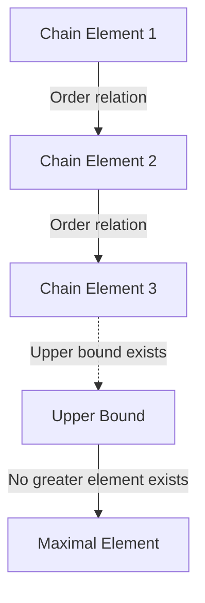
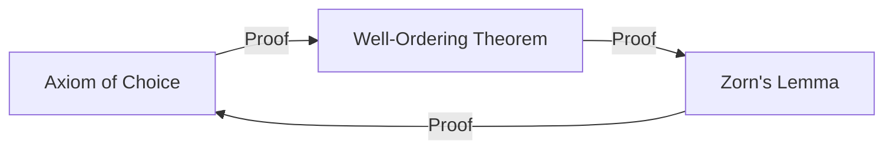

# The Axiom of Choice and Zorn's Lemma: The Concept of "Choice" That Shook the Foundations of Mathematics

In the history of mathematics, no axiom has been as controversial—and yet as indispensable to modern mathematics—as the **Axiom of Choice** (AC). In this article, we take a deep dive into the Axiom of Choice and its equivalent statement, **Zorn's Lemma**, from their foundations. We provide a comprehensive explanation covering intuitive understanding, rigorous mathematical formalization, historical context, and applications across various fields of modern mathematics.

## 1. What Is the Axiom of Choice? Intuition and Rigorous Definition

The Axiom of Choice makes a claim that is intuitively very simple: "Given a family (collection) of sets that does not contain the empty set, it is possible to select one element from each set and form a new set."

In everyday terms, if you have several boxes, each containing at least one ball, it seems perfectly natural that you can pick one ball from each box. However, when the number of boxes becomes infinite, this "obvious operation" is no longer mathematically self-evident.

### 1.1. Rigorous Mathematical Formalization

In the standard axiomatic system of set theory, Zermelo–Fraenkel set theory (ZF), the Axiom of Choice (AC) is formalized as follows:

$$
\forall X \left( \emptyset \notin X \implies \exists f: X \to \bigcup X \quad \text{s.t.} \quad \forall A \in X, f(A) \in A \right)
$$

Here, the function $f$ is called the **choice function**. In other words, it asserts the existence of a function that assigns to each non-empty set $A$ belonging to the family of sets $X$ one of its elements $f(A)$.

### 1.2. The Difference Between Finite and Infinite: Russell's Socks Example

When selecting elements from a finite number of sets, the Axiom of Choice is unnecessary. This is because, within the ordinary framework of logic, elements can be selected one by one in order. However, when simultaneously selecting one element from each of infinitely many sets, a choice function cannot be constructed unless there is a "rule" that uniquely determines the selection method.

The British philosopher and mathematician Bertrand Russell presented a famous analogy to explain this situation:

> "To choose one shoe from each of infinitely many pairs of shoes, the Axiom of Choice is not needed, because there is a clear rule: 'always choose the left shoe.' However, to choose one sock from each of infinitely many pairs of socks, the Axiom of Choice is needed, because socks have no left-right distinction, making it impossible to explicitly provide a rule for choosing."

This analogy brilliantly demonstrates why, in cases where "rule-based construction" is impossible for infinite choices, the existence of a choice function must be postulated as an "axiom."

## 2. Zorn's Lemma: A Powerful Equivalent of the Axiom of Choice

In modern abstract mathematics, there are many cases where using **Zorn's Lemma**, a theorem equivalent to the Axiom of Choice, makes proofs dramatically more transparent than directly applying the Axiom of Choice itself. Proposed by Max Zorn in 1935, this lemma has become a standard tool in algebra and topology.

### 2.1. The Statement of Zorn's Lemma

Zorn's Lemma is the following assertion about partially ordered sets:

> **Zorn's Lemma**
> In a non-empty partially ordered set $(P, \le)$, if every totally ordered subset (chain) has an upper bound, then $P$ has at least one maximal element.

$$
\text{If every chain } C \subseteq P \text{ has an upper bound, then } P \text{ has a maximal element.}
$$

### 2.2. Terminology Review

Let us clarify the concepts related to understanding Zorn's Lemma:

- **Partially Ordered Set (Poset)**: A set in which an order relation $\le$ is defined between elements, but not all pairs of elements need to be comparable. For example, the inclusion relation $\subseteq$ on sets is a partial order.
- **Totally Ordered Set / Chain**: A subset in which any two elements are comparable.
- **Upper Bound**: An element that is "greater than or equal to" every element of a chain. The upper bound itself need not be contained in the chain.
- **Maximal Element**: An element of the set $P$ for which no "strictly greater" element exists. Unlike the greatest element (which is greater than all elements), multiple maximal elements can exist.

## 3. The Network of Equivalences: Axiom of Choice, Zorn's Lemma, and the Well-Ordering Theorem

The Axiom of Choice and Zorn's Lemma appear to be entirely different claims, but under the ZF axiom system they are equivalent (if one is true, the other is also true). In this network of equivalence proofs, the **Well-Ordering Theorem**, proved by Ernst Zermelo, plays a crucial role.

### 3.1. What Is the Well-Ordering Theorem?

> **Well-Ordering Theorem**
> Every set can be well-ordered. That is, for any set, a total order relation can be defined such that every non-empty subset has a least element.

The set of real numbers $\mathbb{R}$ is not well-ordered under the usual ordering (for example, the open interval $(0, 1)$ has no least element). However, the Well-Ordering Theorem asserts that even the set of real numbers can be given "some" well-ordering. This is a highly counterintuitive result.

### 3.2. The Loop of Equivalence Proofs

In the ZF axiom system, the following three propositions are completely equivalent:

1. Axiom of Choice
2. Well-Ordering Theorem
3. Zorn's Lemma

In standard mathematics textbooks, the equivalence is demonstrated in the following order:

The proof deriving the Axiom of Choice from Zorn's Lemma is relatively straightforward. One forms the set of all partial constructions of a choice function, orders it by inclusion to create a partially ordered set, and applies Zorn's Lemma to find a maximal element, thereby demonstrating the existence of a choice function with the full domain.

## 4. The Overwhelming Power of Zorn's Lemma in Modern Mathematics

Zorn's Lemma is a powerful device that guarantees the existence of "maximal objects" in abstract mathematics. Below, we detail representative applications in various fields.

### 4.1. Algebra: Every Vector Space Has a Basis
In linear algebra, it can be shown constructively that finite-dimensional vector spaces have a basis. However, for infinite-dimensional vector spaces—such as the space of all functions over the real field $\mathbb{R}$—it is not obvious whether a Hamel basis (a subset such that every element can be uniquely expressed as a finite linear combination of basis elements) exists.

Proof outline: Order the collection of all linearly independent subsets of a vector space $V$ by the inclusion relation $\subseteq$. For any chain in this partially ordered set, its union is also linearly independent (since only finite linear combinations are considered). Therefore, the union serves as an upper bound. By Zorn's Lemma, a maximal element exists, and this maximal element is precisely the desired basis.

### 4.2. Ring Theory: Krull's Theorem
> In any commutative ring with unity $1 \neq 0$, there exists at least one maximal ideal.

This theorem (Krull's Theorem) is also a direct application of Zorn's Lemma. One orders the collection of all proper ideals (those not containing 1) by inclusion. The upper bound of any chain (the union) is also an ideal not containing 1, so the existence of a maximal element (a maximal ideal) follows.

### 4.3. Topology: Tychonoff's Theorem
> The arbitrary product of compact spaces is compact with respect to the product topology.

Tychonoff's Theorem is one of the most important theorems in topology and underpins the foundations of functional analysis. Interestingly, it has been proven that Tychonoff's Theorem is equivalent to the Axiom of Choice within the ZF axiom system.

### 4.4. Functional Analysis: The Hahn–Banach Theorem
The Hahn–Banach Theorem guarantees that a bounded linear functional defined on a subspace can be extended to the entire space without increasing its norm (magnitude). This extension process requires repeating the step of extending one dimension at a time infinitely many times, and Zorn's Lemma is indispensable for guaranteeing the extension to the entire space as the limit of this process.

## 5. The Paradox Brought About by the Axiom of Choice: The Banach–Tarski Theorem

While the Axiom of Choice grants tremendous power to mathematics, it also leads to results that completely defy our spatial intuition. The most famous example is the **Banach–Tarski Paradox**.

### 5.1. The Content of the Paradox

> A solid ball in three-dimensional Euclidean space can be partitioned into a finite number of pieces (for example, 5 fragments). By rearranging these pieces using only rotations and translations (rigid motions) and reassembling them, one can create **two** balls of exactly the same size as the original.

$$
1 \text{ Sphere} \xrightarrow{\text{Cut into } 5 \text{ pieces, Rotate \& Translate}} 2 \text{ Spheres of same size}
$$

### 5.2. Why Does This Happen?

This "magic of creating two balls from one" arises because the Axiom of Choice allows the creation of "sets without Lebesgue measure (extraordinarily complex and scattered sets for which volume cannot be defined)." The partitioned pieces are not solid shapes with smooth cross-sections as we might imagine, but rather structures resembling infinite labyrinths of points. Since volume cannot be defined for them, the "law of conservation of volume" does not apply, and the result appears as if the volume has doubled.

## 6. The ZFC Axiom System: The De Facto Standard of Modern Mathematics

Because of counterintuitive results like the Banach–Tarski Theorem, many mathematicians in the early 20th century—including Henri Lebesgue and Émile Borel—strongly opposed the Axiom of Choice (the so-called constructivist approach).

However, modern standard mathematics has adopted the **ZFC axiom system** (Zermelo–Fraenkel set theory with the axiom of Choice), which adds the Axiom of Choice to Zermelo–Fraenkel set theory, as its firm foundation.

$$
\text{ZFC} = \text{ZF} + \text{Axiom of Choice}
$$

### Why Was ZFC Accepted?

The reason is straightforward. If the Axiom of Choice is rejected (adopting only the ZF axiom system), the mathematical results lost are far too significant. The bases of all vector spaces, compactness of product spaces in topology, and many useful properties of Lebesgue measure would all collapse. Even at the "cost" of the Banach–Tarski Paradox, the Axiom of Choice was accepted in order to maintain the rich and beautiful system of modern abstract mathematics.

## 7. Conclusion: A Bridge Over the Abyss of Infinity

The Axiom of Choice and Zorn's Lemma demonstrate how the operation of "choice"—so obvious in finite domains that it goes unnoticed—gives rise to profoundly deep, terrifying, and beautiful structures the moment one steps into the realm of infinity.

Zorn's Lemma, as a powerful magic wand guaranteeing the existence of "maximal objects" at the end of infinite chains, has driven the development of algebra and analysis. At the foundation of the mathematical theorems we casually use every day lies this profound philosophy called the "Axiom of Choice." The foundations of mathematics are not merely logical puzzles, but a grand drama of how human reason confronts the concept of infinity.
