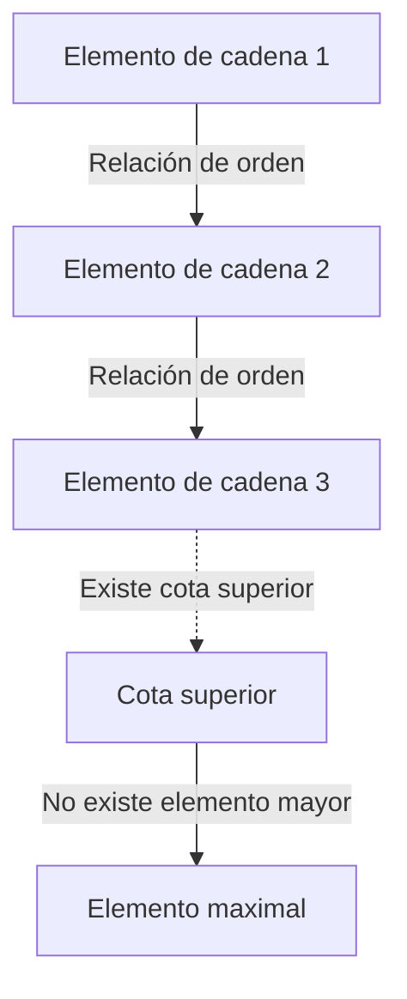
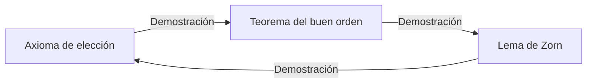

# El axioma de elección y el lema de Zorn: El concepto de «elección» que sacudió los fundamentos de las matemáticas

En la historia de las matemáticas, ningún axioma ha generado tanta controversia y, al mismo tiempo, se ha vuelto tan indispensable para las matemáticas modernas como el **axioma de elección** (Axiom of Choice). En este artículo, profundizamos en el axioma de elección y en su proposición equivalente, el **lema de Zorn** (Zorn's Lemma), desde sus bases. Ofrecemos una explicación integral que abarca la comprensión intuitiva, la formalización matemática rigurosa, el contexto histórico y las aplicaciones en diversos campos de las matemáticas modernas.

## 1. ¿Qué es el axioma de elección? Intuición y definición rigurosa

El axioma de elección formula una afirmación intuitivamente muy simple: «Dada una familia (colección) de conjuntos que no contiene el conjunto vacío, es posible seleccionar un elemento de cada conjunto y formar un nuevo conjunto.»

En el sentido cotidiano, si se tienen varias cajas, cada una con al menos una pelota, parece perfectamente natural poder elegir una pelota de cada caja. Sin embargo, cuando el número de cajas se vuelve infinito, esta «operación obvia» deja de ser matemáticamente evidente.

### 1.1. Formalización matemática rigurosa

En el sistema axiomático estándar de la teoría de conjuntos, la teoría de conjuntos de Zermelo-Fraenkel (ZF), el axioma de elección (AC) se formaliza de la siguiente manera:

$$
\forall X \left( \emptyset \notin X \implies \exists f: X \to \bigcup X \quad \text{tal que} \quad \forall A \in X, f(A) \in A \right)
$$

Aquí, la función $f$ se denomina **función de elección** (choice function). Es decir, se afirma la existencia de una función que asigna a cada conjunto no vacío $A$ perteneciente a la familia de conjuntos $X$ uno de sus elementos $f(A)$.

### 1.2. La diferencia entre finito e infinito: el ejemplo de los calcetines de Russell

Al seleccionar elementos de un número finito de conjuntos, el axioma de elección no es necesario. Esto se debe a que, dentro del marco ordinario de la lógica, los elementos pueden seleccionarse uno por uno en orden. Sin embargo, al seleccionar simultáneamente un elemento de cada uno de infinitos conjuntos, no se puede construir una función de elección a menos que exista una «regla» que determine de manera única el método de selección.

El filósofo y matemático británico Bertrand Russell presentó una famosa analogía para explicar esta situación:

> «Para elegir un zapato de cada uno de infinitos pares de zapatos, el axioma de elección no es necesario, porque existe una regla clara: "elegir siempre el zapato izquierdo." Sin embargo, para elegir un calcetín de cada uno de infinitos pares de calcetines, el axioma de elección es necesario, porque los calcetines no tienen distinción entre izquierdo y derecho, lo que hace imposible proporcionar explícitamente una regla para elegir.»

Esta analogía demuestra de manera brillante por qué, en los casos en que la «construcción basada en reglas» resulta imposible para las elecciones infinitas, la existencia de una función de elección debe postularse como un «axioma».

## 2. El lema de Zorn: un poderoso equivalente del axioma de elección

En las matemáticas abstractas modernas, existen numerosos casos en los que el uso del **lema de Zorn** – un teorema equivalente al axioma de elección – hace que las demostraciones resulten drásticamente más claras que la aplicación directa del axioma de elección. Propuesto por Max Zorn en 1935, este lema se ha convertido en una herramienta estándar en álgebra y topología.

### 2.1. El enunciado del lema de Zorn

El lema de Zorn es la siguiente afirmación sobre conjuntos parcialmente ordenados:

> **Lema de Zorn**
> En un conjunto parcialmente ordenado no vacío $(P, \le)$, si todo subconjunto totalmente ordenado (cadena) tiene una cota superior, entonces $P$ posee al menos un elemento maximal.

$$
\text{Si toda cadena } C \subseteq P \text{ tiene una cota superior, entonces } P \text{ tiene un elemento maximal.}
$$

### 2.2. Aclaración de terminología

Clarifiquemos los conceptos relacionados con la comprensión del lema de Zorn:

- **Conjunto parcialmente ordenado** (Partially Ordered Set, Poset): Un conjunto en el que se define una relación de orden $\le$ entre los elementos, pero no todos los pares de elementos necesitan ser comparables. Por ejemplo, la relación de inclusión $\subseteq$ en conjuntos es un orden parcial.
- **Conjunto totalmente ordenado / Cadena** (Total Order / Chain): Un subconjunto en el que dos elementos cualesquiera son comparables.
- **Cota superior** (Upper Bound): Un elemento que es «mayor o igual» que cada elemento de una cadena. La cota superior en sí no necesita pertenecer a la cadena.
- **Elemento maximal** (Maximal Element): Un elemento del conjunto $P$ para el cual no existe ningún elemento «estrictamente mayor». A diferencia del elemento máximo (que es mayor que todos los elementos), pueden existir múltiples elementos maximales.

## 3. La red de equivalencias: axioma de elección, lema de Zorn y teorema del buen orden

El axioma de elección y el lema de Zorn parecen ser afirmaciones completamente diferentes, pero bajo el sistema axiomático ZF son equivalentes (si uno es verdadero, el otro también lo es). En esta red de pruebas de equivalencia, el **teorema del buen orden** (Well-ordering theorem), demostrado por Ernst Zermelo, desempeña un papel crucial.

### 3.1. ¿Qué es el teorema del buen orden?

> **Teorema del buen orden**
> Todo conjunto puede ser bien ordenado. Es decir, para cualquier conjunto, se puede definir una relación de orden total tal que todo subconjunto no vacío tenga un elemento mínimo.

El conjunto de los números reales $\mathbb{R}$ no está bien ordenado con el orden usual (por ejemplo, el intervalo abierto $(0, 1)$ no tiene elemento mínimo). Sin embargo, el teorema del buen orden afirma que incluso al conjunto de los números reales se le puede otorgar «algún» buen orden. Este es un resultado enormemente contraintuitivo.

### 3.2. El bucle de las pruebas de equivalencia

En el sistema axiomático ZF, las tres proposiciones siguientes son completamente equivalentes:

1. Axioma de elección (Axiom of Choice)
2. Teorema del buen orden (Well-ordering Theorem)
3. Lema de Zorn (Zorn's Lemma)

En los libros de texto estándar de matemáticas, la equivalencia se demuestra en el siguiente orden:

La demostración que deriva el axioma de elección a partir del lema de Zorn es relativamente sencilla. Se forma el conjunto de todas las construcciones parciales de una función de elección, se ordena por inclusión para crear un conjunto parcialmente ordenado y se aplica el lema de Zorn para encontrar un elemento maximal, demostrando así la existencia de una función de elección con dominio completo.

## 4. El poder abrumador del lema de Zorn en las matemáticas modernas

El lema de Zorn es un dispositivo poderoso que garantiza la existencia de «objetos maximales» en las matemáticas abstractas. A continuación, se detallan aplicaciones representativas en diversos campos.

### 4.1. Álgebra: todo espacio vectorial posee una base
En álgebra lineal, se puede demostrar de manera constructiva que los espacios vectoriales de dimensión finita poseen una base. Sin embargo, para espacios vectoriales de dimensión infinita – como el espacio de todas las funciones sobre el cuerpo de los reales $\mathbb{R}$ – no resulta evidente si existe una base de Hamel (un subconjunto tal que todo elemento se exprese de manera única como combinación lineal finita de elementos de la base).

Esbozo de la demostración: Se ordena el conjunto de todos los subconjuntos linealmente independientes de un espacio vectorial $V$ mediante la relación de inclusión $\subseteq$. Para cualquier cadena en este conjunto parcialmente ordenado, su unión es también linealmente independiente (ya que solo se consideran combinaciones lineales finitas). Por lo tanto, la unión sirve como cota superior. Por el lema de Zorn, existe un elemento maximal, y este elemento maximal es precisamente la base buscada.

### 4.2. Teoría de anillos: el teorema de Krull
> En cualquier anillo conmutativo con elemento unidad $1 \neq 0$, existe al menos un ideal maximal.

Este teorema (teorema de Krull) es también una aplicación directa del lema de Zorn. Se ordena el conjunto de todos los ideales propios (que no contienen a 1) por inclusión. La cota superior de cualquier cadena (la unión) es también un ideal que no contiene a 1, de donde se deduce la existencia de un elemento maximal (un ideal maximal).

### 4.3. Topología: el teorema de Tychonoff
> El producto arbitrario de espacios compactos es compacto respecto a la topología producto.

El teorema de Tychonoff es uno de los teoremas más importantes en topología y sustenta los fundamentos del análisis funcional. Curiosamente, se ha demostrado que el teorema de Tychonoff es equivalente al axioma de elección dentro del sistema axiomático ZF.

### 4.4. Análisis funcional: el teorema de Hahn-Banach
El teorema de Hahn-Banach garantiza que un funcional lineal acotado definido en un subespacio puede extenderse a todo el espacio sin aumentar su norma (magnitud). Este proceso de extensión requiere repetir infinitamente el paso de extender una dimensión a la vez, y el lema de Zorn es indispensable para garantizar la extensión a todo el espacio como límite de este proceso.

## 5. La paradoja generada por el axioma de elección: el teorema de Banach-Tarski

Si bien el axioma de elección otorga un poder formidable a las matemáticas, también conduce a resultados que desafían completamente nuestra intuición espacial. El ejemplo más famoso es la **paradoja de Banach-Tarski** (Banach-Tarski Paradox).

### 5.1. El contenido de la paradoja

> Una bola sólida en el espacio euclidiano tridimensional puede dividirse en un número finito de piezas (por ejemplo, 5 fragmentos). Reordenando estas piezas únicamente mediante rotaciones y traslaciones (movimientos rígidos) y ensamblándolas de nuevo, se pueden crear **dos** bolas de exactamente el mismo tamaño que la original.

$$
1 \text{ Esfera} \xrightarrow{\text{Cortado en } 5 \text{ partes, Rotación \& Traslación}} 2 \text{ Esferas del mismo tamaño}
$$

### 5.2. ¿Por qué ocurre esto?

Esta «magia de crear dos bolas a partir de una» surge porque el axioma de elección permite la creación de «conjuntos sin medida de Lebesgue (conjuntos extraordinariamente complejos y dispersos para los cuales no se puede definir volumen)». Las piezas divididas no son sólidos con cortes suaves como podríamos imaginar, sino estructuras que se asemejan a laberintos infinitos de puntos. Dado que no se les puede asignar volumen, la «ley de conservación del volumen» no se aplica, y el resultado da la impresión de que el volumen se ha duplicado.

## 6. El sistema axiomático ZFC: el estándar de facto de las matemáticas modernas

Debido a resultados contraintuitivos como el teorema de Banach-Tarski, muchos matemáticos de principios del siglo XX – entre ellos Henri Lebesgue y Émile Borel – se opusieron firmemente al axioma de elección (el llamado enfoque constructivista).

Sin embargo, las matemáticas modernas estándar han adoptado el **sistema axiomático ZFC** (teoría de conjuntos de Zermelo-Fraenkel con el axioma de elección) como su fundamento sólido.

$$
\text{ZFC} = \text{ZF} + \text{Axioma de Elección}
$$

### ¿Por qué fue aceptado ZFC?

La razón es sencilla. Si se rechaza el axioma de elección (adoptando solo el sistema axiomático ZF), los resultados matemáticos que se pierden son demasiado significativos. Las bases de todos los espacios vectoriales, la compacidad de los espacios producto en topología y muchas propiedades útiles de la medida de Lebesgue se derrumbarían. Incluso al «precio» de la paradoja de Banach-Tarski, el axioma de elección fue aceptado para mantener el sistema rico y hermoso de las matemáticas abstractas modernas.

## 7. Conclusión: un puente sobre el abismo del infinito

El axioma de elección y el lema de Zorn demuestran cómo la operación de «elección» – tan obvia en dominios finitos que ni siquiera se percibe – da lugar a estructuras profundamente profundas, aterradoras y hermosas en el momento en que se adentra en el reino del infinito.

El lema de Zorn, como una poderosa varita mágica que garantiza la existencia de lo «maximal» al final de las cadenas infinitas, ha impulsado el desarrollo del álgebra y el análisis. En la base de los teoremas matemáticos que utilizamos casualmente cada día yace esta profunda filosofía llamada «axioma de elección». Los fundamentos de las matemáticas no son meros rompecabezas lógicos, sino un gran drama sobre cómo la razón humana se enfrenta al concepto del infinito.
