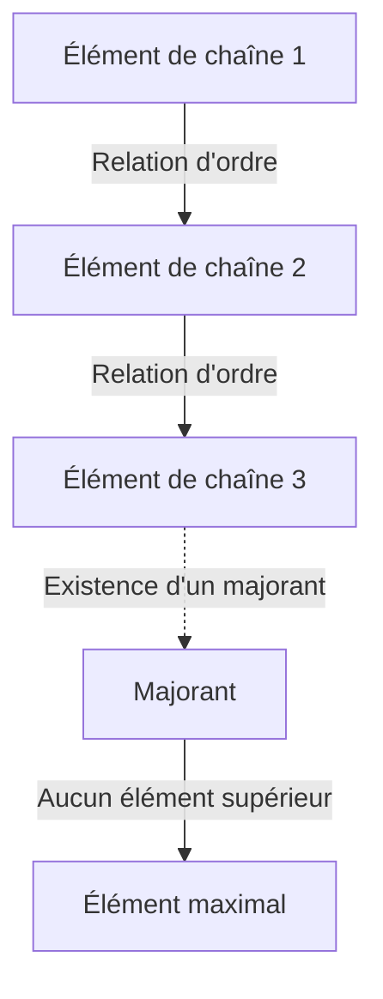
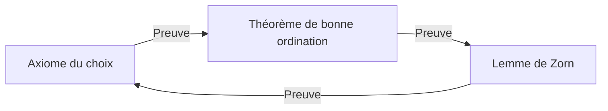

# L'axiome du choix et le lemme de Zorn : Le concept de « choix » qui a ébranlé les fondements des mathématiques

Dans l'histoire des mathématiques, aucun axiome n'a suscité autant de débats et n'est devenu aussi indispensable aux mathématiques modernes que l' **axiome du choix** (Axiom of Choice). Dans cet article, nous explorons en profondeur l'axiome du choix et sa proposition équivalente, le **lemme de Zorn** (Zorn's Lemma), depuis les bases. Nous proposons une explication complète couvrant la compréhension intuitive, la formalisation mathématique rigoureuse, le contexte historique et les applications dans divers domaines des mathématiques modernes.

## 1. Qu'est-ce que l'axiome du choix ? Intuition et définition rigoureuse

L'axiome du choix formule une affirmation intuitivement très simple : « Étant donnée une famille (collection) d'ensembles ne contenant pas l'ensemble vide, il est possible de sélectionner un élément de chaque ensemble et de former un nouvel ensemble. »

Dans le sens commun, si l'on dispose de plusieurs boîtes contenant chacune au moins une balle, il semble parfaitement naturel de pouvoir choisir une balle dans chaque boîte. Cependant, lorsque le nombre de boîtes devient infini, cette « opération évidente » n'est plus mathématiquement triviale.

### 1.1. Formalisation mathématique rigoureuse

Dans le système axiomatique standard de la théorie des ensembles, la théorie des ensembles de Zermelo-Fraenkel (ZF), l'axiome du choix (AC) est formalisé comme suit :

$$
\forall X \left( \emptyset \notin X \implies \exists f: X \to \bigcup X \quad \text{s.t.} \quad \forall A \in X, f(A) \in A \right)
$$

Ici, la fonction $f$ est appelée **fonction de choix** (choice function). Autrement dit, elle affirme l'existence d'une fonction qui attribue à chaque ensemble non vide $A$ appartenant à la famille d'ensembles $X$ l'un de ses éléments $f(A)$.

### 1.2. La différence entre fini et infini : l'exemple des chaussettes de Russell

Lorsque l'on sélectionne des éléments d'un nombre fini d'ensembles, l'axiome du choix n'est pas nécessaire. En effet, dans le cadre ordinaire de la logique, les éléments peuvent être sélectionnés un par un, dans l'ordre. Cependant, lorsqu'il s'agit de sélectionner simultanément un élément de chacun d'une infinité d'ensembles, une fonction de choix ne peut être construite qu'à condition de disposer d'une « règle » déterminant de manière unique la méthode de sélection.

Le philosophe et mathématicien britannique Bertrand Russell a présenté une analogie célèbre pour expliquer cette situation :

> « Pour choisir une chaussure dans chacune d'une infinité de paires de chaussures, l'axiome du choix n'est pas nécessaire, car il existe une règle claire : "choisir toujours la chaussure gauche." Cependant, pour choisir une chaussette dans chacune d'une infinité de paires de chaussettes, l'axiome du choix est nécessaire, car les chaussettes ne présentent pas de distinction gauche-droite, rendant impossible la formulation explicite d'une règle de choix. »

Cette analogie démontre de manière brillante pourquoi, dans les cas où une « construction réglée » est impossible pour des choix infinis, l'existence d'une fonction de choix doit être postulée comme un « axiome ».

## 2. Le lemme de Zorn : un puissant équivalent de l'axiome du choix

Dans les mathématiques abstraites modernes, il existe de nombreux cas où l'utilisation du **lemme de Zorn** – un théorème équivalent à l'axiome du choix – rend les démonstrations considérablement plus lisibles qu'une application directe de l'axiome du choix. Proposé par Max Zorn en 1935, ce lemme est devenu un outil standard en algèbre et en topologie.

### 2.1. L'énoncé du lemme de Zorn

Le lemme de Zorn est l'assertion suivante concernant les ensembles partiellement ordonnés :

> **Lemme de Zorn**
> Dans un ensemble partiellement ordonné non vide $(P, \le)$, si tout sous-ensemble totalement ordonné (chaîne) admet un majorant, alors $P$ possède au moins un élément maximal.

$$
\text{If every chain } C \subseteq P \text{ has an upper bound, then } P \text{ has a maximal element.}
$$

### 2.2. Clarification de la terminologie

Clarifions les concepts liés à la compréhension du lemme de Zorn :

- **Ensemble partiellement ordonné** (Partially Ordered Set, Poset) : Un ensemble dans lequel une relation d'ordre $\le$ est définie entre les éléments, mais sans que tous les couples d'éléments soient nécessairement comparables. Par exemple, la relation d'inclusion $\subseteq$ sur les ensembles est un ordre partiel.
- **Ensemble totalement ordonné / Chaîne** (Total Order / Chain) : Un sous-ensemble dans lequel deux éléments quelconques sont comparables.
- **Majorant** (Upper Bound) : Un élément « supérieur ou égal » à chaque élément d'une chaîne. Le majorant lui-même n'a pas besoin d'appartenir à la chaîne.
- **Élément maximal** (Maximal Element) : Un élément de l'ensemble $P$ pour lequel aucun élément « strictement supérieur » n'existe. Contrairement au plus grand élément (supérieur à tous les éléments), il peut exister plusieurs éléments maximaux.

## 3. Le réseau des équivalences : axiome du choix, lemme de Zorn et théorème de bonne ordination

L'axiome du choix et le lemme de Zorn semblent être des affirmations totalement différentes, mais sous le système axiomatique ZF, ils sont équivalents (si l'un est vrai, l'autre l'est aussi). Dans ce réseau de preuves d'équivalence, le **théorème de bonne ordination** (Well-ordering theorem), démontré par Ernst Zermelo, joue un rôle crucial.

### 3.1. Qu'est-ce que le théorème de bonne ordination ?

> **Théorème de bonne ordination**
> Tout ensemble peut être bien ordonné. C'est-à-dire que pour tout ensemble, il est possible de définir une relation d'ordre total telle que tout sous-ensemble non vide possède un plus petit élément.

L'ensemble des nombres réels $\mathbb{R}$ n'est pas bien ordonné selon l'ordre habituel (par exemple, l'intervalle ouvert $(0, 1)$ n'a pas de plus petit élément). Cependant, le théorème de bonne ordination affirme que même l'ensemble des réels peut recevoir « un certain » bon ordre. C'est un résultat extrêmement contre-intuitif.

### 3.2. La boucle des preuves d'équivalence

Dans le système axiomatique ZF, les trois propositions suivantes sont entièrement équivalentes :

1. Axiome du choix (Axiom of Choice)
2. Théorème de bonne ordination (Well-ordering Theorem)
3. Lemme de Zorn (Zorn's Lemma)

Dans les manuels de mathématiques standards, l'équivalence est démontrée dans l'ordre suivant :

La preuve dérivant l'axiome du choix à partir du lemme de Zorn est relativement simple. On forme l'ensemble de toutes les constructions partielles d'une fonction de choix, on l'ordonne par inclusion pour créer un ensemble partiellement ordonné, et on applique le lemme de Zorn pour trouver un élément maximal, démontrant ainsi l'existence d'une fonction de choix définie sur tout le domaine.

## 4. La puissance écrasante du lemme de Zorn dans les mathématiques modernes

Le lemme de Zorn est un dispositif puissant qui garantit l'existence d'« objets maximaux » en mathématiques abstraites. Voici les applications représentatives dans différents domaines.

### 4.1. Algèbre : tout espace vectoriel possède une base
En algèbre linéaire, on peut démontrer de manière constructive que les espaces vectoriels de dimension finie possèdent une base. Cependant, pour les espaces vectoriels de dimension infinie – comme l'espace de toutes les fonctions sur le corps des réels $\mathbb{R}$ – il n'est pas évident qu'une base de Hamel (un sous-ensemble tel que tout élément s'écrit de manière unique comme combinaison linéaire finie d'éléments de la base) existe.

Esquisse de la preuve : On ordonne l'ensemble de tous les sous-ensembles linéairement indépendants d'un espace vectoriel $V$ par la relation d'inclusion $\subseteq$. Pour toute chaîne de cet ensemble partiellement ordonné, leur réunion est également linéairement indépendante (car seules des combinaisons linéaires finies sont considérées). La réunion constitue donc un majorant. Par le lemme de Zorn, un élément maximal existe, et cet élément maximal est précisément la base recherchée.

### 4.2. Théorie des anneaux : le théorème de Krull
> Dans tout anneau commutatif avec élément unité $1 \neq 0$, il existe au moins un idéal maximal.

Ce théorème (théorème de Krull) est également une application directe du lemme de Zorn. On ordonne l'ensemble de tous les idéaux propres (ne contenant pas 1) par inclusion. Le majorant de toute chaîne (la réunion) est aussi un idéal ne contenant pas 1, d'où l'existence d'un élément maximal (un idéal maximal).

### 4.3. Topologie : le théorème de Tychonoff
> Le produit arbitraire d'espaces compacts est compact pour la topologie produit.

Le théorème de Tychonoff est l'un des théorèmes les plus importants en topologie et soutient les fondements de l'analyse fonctionnelle. Fait intéressant, il a été démontré que le théorème de Tychonoff est équivalent à l'axiome du choix dans le système axiomatique ZF.

### 4.4. Analyse fonctionnelle : le théorème de Hahn-Banach
Le théorème de Hahn-Banach garantit qu'une fonctionnelle linéaire bornée définie sur un sous-espace peut être étendue à l'espace entier sans augmenter sa norme (taille). Ce processus d'extension nécessite de répéter indéfiniment l'étape d'extension d'une dimension à la fois, et le lemme de Zorn est indispensable pour garantir l'extension à l'espace entier comme limite de ce processus.

## 5. Le paradoxe engendré par l'axiome du choix : le théorème de Banach-Tarski

Si l'axiome du choix confère aux mathématiques une puissance considérable, il engendre également des résultats qui défient totalement notre intuition spatiale. L'exemple le plus célèbre est le **paradoxe de Banach-Tarski** (Banach-Tarski Paradox).

### 5.1. Le contenu du paradoxe

> Une boule pleine dans l'espace euclidien tridimensionnel peut être décomposée en un nombre fini de morceaux (par exemple, 5 fragments). En réarrangeant ces morceaux uniquement par des rotations et des translations (mouvements rigides) et en les réassemblant, on peut créer **deux** boules de taille exactement identique à l'originale.

$$
1 \text{ Sphere} \xrightarrow{\text{Cut into } 5 \text{ pieces, Rotate \& Translate}} 2 \text{ Spheres of same size}
$$

### 5.2. Pourquoi cela se produit-il ?

Cette « magie de créer deux boules à partir d'une seule » provient du fait que l'axiome du choix permet de créer des « ensembles sans mesure de Lebesgue (ensembles extrêmement complexes et dispersés pour lesquels le volume ne peut être défini) ». Les morceaux découpés ne sont pas des solides aux coupes lisses comme nous pourrions l'imaginer, mais des structures ressemblant à des labyrinthes infinis de points. Puisque le volume ne peut leur être attribué, la « loi de conservation du volume » ne s'applique pas, et le résultat donne l'impression que le volume a doublé.

## 6. Le système axiomatique ZFC : le standard de facto des mathématiques modernes

En raison de résultats contre-intuitifs comme le théorème de Banach-Tarski, de nombreux mathématiciens du début du XXe siècle – dont Henri Lebesgue et Émile Borel – se sont fermement opposés à l'axiome du choix (l'approche dite constructiviste).

Cependant, les mathématiques modernes standards ont adopté le **système axiomatique ZFC** (théorie des ensembles de Zermelo-Fraenkel avec l'axiome du choix) comme fondement solide.

$$
\text{ZFC} = \text{ZF} + \text{Axiom of Choice}
$$

### Pourquoi ZFC a-t-il été accepté ?

La raison est simple. Si l'axiome du choix est rejeté (en n'adoptant que le système axiomatique ZF), les résultats mathématiques perdus sont bien trop importants. Les bases de tous les espaces vectoriels, la compacité des espaces produits en topologie et de nombreuses propriétés utiles de la mesure de Lebesgue s'effondreraient. Même au « prix » du paradoxe de Banach-Tarski, l'axiome du choix a été accepté afin de maintenir le système riche et beau des mathématiques abstraites modernes.

## 7. Conclusion : un pont au-dessus de l'abîme de l'infini

L'axiome du choix et le lemme de Zorn démontrent comment l'opération de « choix » – si évidente dans le domaine fini qu'elle passe inaperçue – engendre des structures profondément profondes, terrifiantes et belles dès que l'on pénètre dans le domaine de l'infini.

Le lemme de Zorn, telle une baguette magique puissante garantissant l'existence du « maximal » à l'extrémité des chaînes infinies, a propulsé le développement de l'algèbre et de l'analyse. Au fondement des théorèmes mathématiques que nous utilisons quotidiennement sans y penser repose cette philosophie profonde qu'est l'« axiome du choix ». Les fondements des mathématiques ne sont pas de simples casse-têtes logiques, mais un grand drame illustrant comment la raison humaine affronte le concept d'infini.
