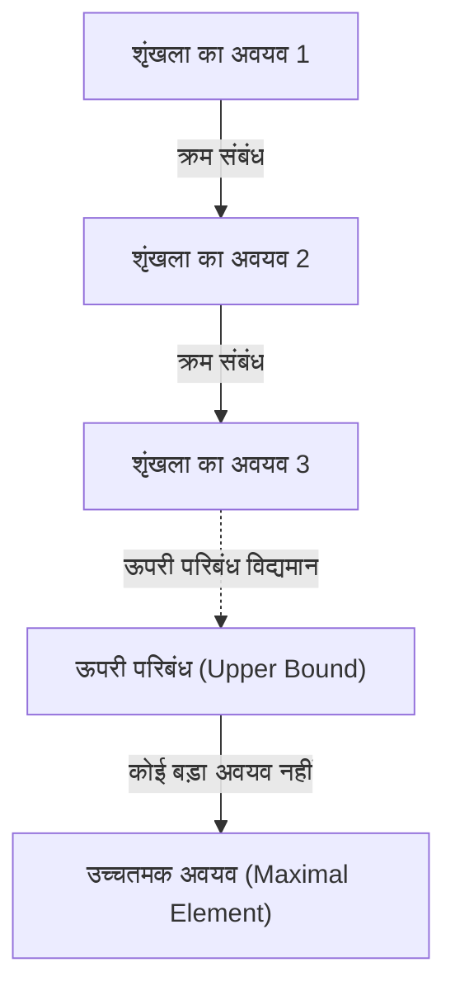
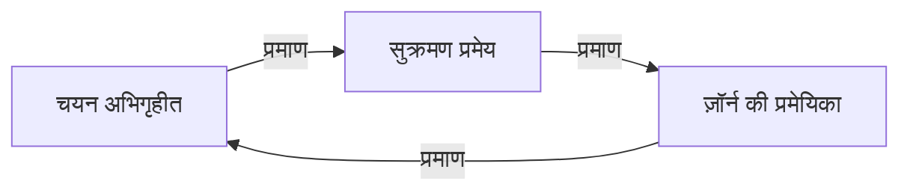

# [चयन अभिगृहीत और ज़ॉर्न की प्रमेयिका](https://kenji.blog/hi/p/axiom-of-choice-and-zorns-lemma/): गणित की नींव हिला देने वाली 'चयन' की अवधारणा

गणित के इतिहास में, **चयन अभिगृहीत** (Axiom of Choice) जितनी विवादास्पद और आधुनिक गणित के लिए अनिवार्य कोई अन्य अभिगृहीत नहीं रही। इस लेख में, हम चयन अभिगृहीत और इसके समतुल्य प्रमेय **ज़ॉर्न की प्रमेयिका** (Zorn's Lemma) को मूल से गहराई से समझेंगे। सहज समझ से लेकर कठोर गणितीय सूत्रीकरण, ऐतिहासिक पृष्ठभूमि, और आधुनिक गणित की विभिन्न शाखाओं में अनुप्रयोगों तक — हम एक व्यापक विवरण प्रस्तुत करेंगे।

## 1. चयन अभिगृहीत क्या है? अंतर्ज्ञान और सटीक परिभाषा

चयन अभिगृहीत सहज रूप से एक बहुत सरल दावा करता है। "यदि समुच्चयों का एक ऐसा कुटुंब (संग्रह) दिया जाए जिसमें रिक्त समुच्चय न हो, तो प्रत्येक समुच्चय से एक-एक अवयव चुनकर एक नया समुच्चय बनाया जा सकता है।"

दैनिक जीवन की दृष्टि से, यदि कई बक्से हों और प्रत्येक बक्से में कम से कम एक गेंद हो, तो हर बक्से से एक गेंद चुनना स्वाभाविक रूप से संभव लगता है। लेकिन जब बक्सों की संख्या अनंत हो जाती है, तो यह "स्वाभाविक क्रिया" गणितीय रूप से स्वतःसिद्ध नहीं रहती।

### 1.1. सटीक गणितीय सूत्रीकरण

समुच्चय सिद्धांत की मानक अभिगृहीत प्रणाली ज़रमेलो-फ्रेंकल समुच्चय सिद्धांत (ZF) में, चयन अभिगृहीत (AC) को इस प्रकार सूत्रबद्ध किया जाता है:

$$
\forall X \left( \emptyset \notin X \implies \exists f: X \to \bigcup X \quad \text{ताकि} \quad \forall A \in X, f(A) \in A \right)
$$

यहाँ, फलन $f$ को **चयन फलन** (choice function) कहा जाता है। अर्थात, यह दावा करता है कि समुच्चयों के कुटुंब $X$ में किसी भी अरिक्त समुच्चय $A$ के लिए, उसका एक अवयव $f(A)$ निर्दिष्ट करने वाला फलन अस्तित्व में है।

### 1.2. परिमित और अपरिमित का अंतर: रसेल के मोजों का उदाहरण

परिमित संख्या में समुच्चयों से अवयव चुनने के लिए चयन अभिगृहीत की आवश्यकता नहीं होती। क्योंकि सामान्य तर्कशास्त्र के ढाँचे में एक-एक करके अवयव चुने जा सकते हैं। लेकिन अनंत समुच्चयों से एक साथ एक-एक अवयव चुनने पर, जब तक चयन की विधि को एकमात्र रूप से निर्धारित करने वाला कोई "नियम" न हो, चयन फलन का निर्माण नहीं किया जा सकता।

ब्रिटिश दार्शनिक और गणितज्ञ बर्ट्रेंड रसेल ने इस स्थिति को समझाने के लिए एक प्रसिद्ध उदाहरण प्रस्तुत किया:

> "अनंत जोड़ी जूतों में से एक-एक जूता चुनने के लिए चयन अभिगृहीत की आवश्यकता नहीं है, क्योंकि 'हमेशा बाएँ पैर का जूता चुनो' जैसा स्पष्ट नियम मौजूद है। लेकिन अनंत जोड़ी मोजों में से एक-एक मोजा चुनने के लिए चयन अभिगृहीत आवश्यक है, क्योंकि मोजों में बाएँ-दाएँ का भेद नहीं होता, इसलिए चुनने का कोई स्पष्ट नियम नहीं दिया जा सकता।"

यह उदाहरण सुंदर ढंग से दर्शाता है कि अनंत चयन में जब "नियम-आधारित निर्माण" असंभव हो, तो चयन फलन के अस्तित्व को "अभिगृहीत" के रूप में क्यों स्वीकार करना पड़ता है।

## 2. ज़ॉर्न की प्रमेयिका: चयन अभिगृहीत का शक्तिशाली समतुल्य प्रमेय

आधुनिक अमूर्त गणित में, चयन अभिगृहीत को सीधे लागू करने की तुलना में, इसके समतुल्य प्रमेय **ज़ॉर्न की प्रमेयिका** (Zorn's Lemma) का उपयोग करने से प्रमाणों की स्पष्टता नाटकीय रूप से बढ़ जाती है। 1935 में मैक्स ज़ॉर्न द्वारा प्रस्तावित यह प्रमेयिका बीजगणित और स्थानिक समष्टि सिद्धांत में एक मानक उपकरण बन गई है।

### 2.1. ज़ॉर्न की प्रमेयिका का कथन

ज़ॉर्न की प्रमेयिका आंशिक क्रमित समुच्चयों के बारे में निम्नलिखित दावा है:

> **ज़ॉर्न की प्रमेयिका**
> एक अरिक्त आंशिक क्रमित समुच्चय $(P, \le)$ में, यदि उसके प्रत्येक पूर्ण क्रमित उपसमुच्चय (शृंखला) का एक ऊपरी परिबंध है, तो $P$ में कम से कम एक उच्चतमक अवयव होता है।

$$
\text{यदि प्रत्येक शृंखला } C \subseteq P \text{ का एक ऊपरी परिबंध है, तो } P \text{ का एक उच्चतमक अवयव है।}
$$

### 2.2. पारिभाषिक शब्दों की व्यवस्था

ज़ॉर्न की प्रमेयिका को समझने के लिए, संबंधित अवधारणाओं को स्पष्ट करते हैं:

- **आंशिक क्रमित समुच्चय** (Partially Ordered Set, Poset): एक ऐसा समुच्चय जिसके अवयवों के बीच क्रम संबंध $\le$ परिभाषित है, लेकिन सभी अवयवों के युग्मों का तुलनीय होना आवश्यक नहीं है। उदाहरण के लिए, समुच्चयों का समावेश संबंध $\subseteq$ एक आंशिक क्रम है।
- **पूर्ण क्रमित समुच्चय / शृंखला** (Total Order / Chain): एक उपसमुच्चय जिसमें कोई भी दो अवयव तुलनीय हों।
- **ऊपरी परिबंध** (Upper Bound): शृंखला के सभी अवयवों से "बड़ा या बराबर" अवयव। इस ऊपरी परिबंध का स्वयं शृंखला में होना आवश्यक नहीं है।
- **उच्चतमक अवयव** (Maximal Element): समुच्चय $P$ का वह अवयव जिससे "वास्तव में बड़ा" कोई अवयव नहीं है। यह अधिकतम अवयव (सभी अवयवों से बड़ा) से भिन्न है — उच्चतमक अवयव एक से अधिक हो सकते हैं।

## 3. समतुल्यता का नेटवर्क: चयन अभिगृहीत, ज़ॉर्न की प्रमेयिका, और सुक्रमण प्रमेय

[चयन अभिगृहीत और ज़ॉर्न की प्रमेयिका](https://kenji.blog/hi/p/axiom-of-choice-and-zorns-lemma/) बिल्कुल भिन्न दावे प्रतीत होते हैं, लेकिन ZF अभिगृहीत प्रणाली को पूर्वधारणा मानने पर ये परस्पर समतुल्य (एक सत्य होने पर दूसरा भी सत्य) हो जाते हैं। इस समतुल्यता के प्रमाण नेटवर्क में, एर्न्स्ट ज़रमेलो द्वारा सिद्ध **सुक्रमण प्रमेय** (Well-ordering theorem) महत्वपूर्ण भूमिका निभाता है।

### 3.1. सुक्रमण प्रमेय क्या है?

> **सुक्रमण प्रमेय**
> किसी भी समुच्चय को सुक्रमित किया जा सकता है। अर्थात, किसी भी समुच्चय के लिए एक ऐसा पूर्ण क्रम संबंध परिभाषित किया जा सकता है जिसमें उसके प्रत्येक अरिक्त उपसमुच्चय का एक न्यूनतम अवयव हो।

वास्तविक संख्याओं का समुच्चय $\mathbb{R}$ सामान्य बड़ा-छोटा संबंध में सुक्रमित नहीं है (उदाहरण के लिए, खुले अंतराल $(0, 1)$ का कोई न्यूनतम अवयव नहीं है)। लेकिन सुक्रमण प्रमेय दावा करता है कि वास्तविक संख्याओं के समुच्चय को भी "किसी" सुक्रम से सुसज्जित किया जा सकता है। यह अत्यंत प्रतिसहज परिणाम है।

### 3.2. समतुल्यता प्रमाण का चक्र

ZF अभिगृहीत प्रणाली में, निम्नलिखित तीन प्रमेय पूर्णतः समतुल्य हैं:

1. चयन अभिगृहीत (Axiom of Choice)
2. सुक्रमण प्रमेय (Well-ordering Theorem)
3. ज़ॉर्न की प्रमेयिका (Zorn's Lemma)

मानक गणित की पाठ्यपुस्तकों में, समतुल्यता निम्न क्रम में दर्शाई जाती है:

ज़ॉर्न की प्रमेयिका से चयन अभिगृहीत निगमित करने का प्रमाण अपेक्षाकृत सरल है। चयन फलन के सभी आंशिक निर्माणों के समुच्चय को समावेश संबंध से आंशिक क्रमित समुच्चय बनाकर, ज़ॉर्न की प्रमेयिका लागू करके उच्चतमक अवयव प्राप्त किया जाता है, जिससे पूर्ण प्रांत वाले चयन फलन का अस्तित्व सिद्ध होता है।

## 4. आधुनिक गणित में ज़ॉर्न की प्रमेयिका की अपार अनुप्रयोग शक्ति

ज़ॉर्न की प्रमेयिका अमूर्त गणित में "उच्चतमक" के अस्तित्व की गारंटी देने वाला एक शक्तिशाली उपकरण है। नीचे प्रत्येक क्षेत्र में प्रमुख अनुप्रयोग उदाहरण विस्तार से दिए गए हैं।

### 4.1. बीजगणित: प्रत्येक सदिश समष्टि का एक आधार होता है
रैखिक बीजगणित में, परिमित आयामी सदिश समष्टि के आधार का अस्तित्व रचनात्मक रूप से दिखाया जा सकता है। लेकिन वास्तविक संख्या क्षेत्र $\mathbb{R}$ पर सभी फलनों की समष्टि जैसी अनंत आयामी सदिश समष्टि में, हैमल आधार (ऐसा उपसमुच्चय जिसमें कोई भी अवयव परिमित आधार अवयवों के रैखिक संयोजन के रूप में अद्वितीय रूप से व्यक्त किया जा सके) का अस्तित्व स्वतःसिद्ध नहीं है।

प्रमाण की रूपरेखा: सदिश समष्टि $V$ के सभी रैखिक स्वतंत्र उपसमुच्चयों को समावेश संबंध $\subseteq$ से क्रमित किया जाता है। इस आंशिक क्रमित समुच्चय की किसी भी शृंखला का संघ भी रैखिक स्वतंत्र होता है (क्योंकि केवल परिमित रैखिक संयोजन ही विचार किए जाते हैं)। अतः संघ एक ऊपरी परिबंध है। ज़ॉर्न की प्रमेयिका से उच्चतमक अवयव का अस्तित्व सिद्ध होता है, और यही उच्चतमक अवयव अभीष्ट आधार है।

### 4.2. वलय सिद्धांत: क्रुल का प्रमेय
> इकाई अवयव $1 \neq 0$ वाले किसी भी क्रमविनिमेय वलय में कम से कम एक उच्चतमक गुणज होता है।

यह प्रमेय (क्रुल का प्रमेय) भी ज़ॉर्न की प्रमेयिका का प्रत्यक्ष अनुप्रयोग है। 1 को न रखने वाले (उचित) गुणजों को समावेश संबंध से क्रमित किया जाता है। किसी भी शृंखला का ऊपरी परिबंध (संघ) भी 1 को न रखने वाला गुणज होता है, इसलिए उच्चतमक अवयव (उच्चतमक गुणज) का अस्तित्व निगमित होता है।

### 4.3. स्थानिक समष्टि सिद्धांत: तिखोनोव का प्रमेय
> संहत समष्टियों के किसी भी प्रत्यक्ष गुणन समष्टि का गुणन स्थानिकी के संबंध में संहत होना।

तिखोनोव का प्रमेय स्थानिक समष्टि सिद्धांत के सबसे महत्वपूर्ण प्रमेयों में से एक है और यह फलन विश्लेषण की नींव का समर्थन करता है। रोचक बात यह है कि ZF अभिगृहीत प्रणाली में तिखोनोव का प्रमेय चयन अभिगृहीत के समतुल्य सिद्ध हुआ है।

### 4.4. फलन विश्लेषण: हान-बनाख प्रमेय
हान-बनाख प्रमेय इस बात की गारंटी देता है कि एक उप-समष्टि पर परिभाषित परिबद्ध रैखिक प्रवाही को, मानक (परिमाण) को बढ़ाए बिना, पूर्ण समष्टि तक विस्तारित किया जा सकता है। इस विस्तारण प्रक्रिया में एक-एक आयाम करके विस्तारण के चरणों को अनंत बार दोहराना आवश्यक है, और इसकी सीमा के रूप में पूर्ण समष्टि तक विस्तारण की गारंटी के लिए ज़ॉर्न की प्रमेयिका अनिवार्य है।

## 5. चयन अभिगृहीत से उत्पन्न विरोधाभास: बनाख-टार्स्की प्रमेय

चयन अभिगृहीत गणित को अपार शक्ति प्रदान करती है, लेकिन साथ ही ऐसे परिणाम भी लाती है जो अंतरिक्ष के बारे में हमारे अंतर्ज्ञान को पूर्णतः नष्ट कर देते हैं। इसका सबसे प्रसिद्ध उदाहरण **बनाख-टार्स्की विरोधाभास** (Banach-Tarski Paradox) है।

### 5.1. विरोधाभास की विषयवस्तु

> त्रिआयामी [यूक्लिड](https://kenji.blog/hi/p/euclid/)ीय अंतरिक्ष में एक ठोस गोले को परिमित टुकड़ों (उदाहरण के लिए 5 खंडों) में विभाजित किया जा सकता है। उन खंडों को केवल घूर्णन और समांतर स्थानांतरण (दृढ़ पिंड गति) द्वारा पुनर्व्यवस्थित और पुनः जोड़ने पर, मूल गोले के समान आकार के **दो** गोले बनाए जा सकते हैं।

$$
1 \text{ गोला} \xrightarrow{\text{काटा गया } 5 \text{ टुकड़ों में, घूर्णन \& स्थानांतरण}} 2 \text{ समान आकार के गोले}
$$

### 5.2. ऐसा क्यों होता है?

"एक गोले से दो गोले बनाने का यह जादू" इस तथ्य पर आधारित है कि चयन अभिगृहीत का उपयोग करके "लेबेग माप रहित समुच्चय (अत्यंत जटिल और बिखरे हुए समुच्चय जिनका आयतन परिभाषित नहीं किया जा सकता)" बनाए जा सकते हैं। विभाजित खंड वे चिकने कटान वाले ठोस नहीं हैं जिनकी हम कल्पना करते हैं, बल्कि बिंदुओं की अनंत भूलभुलैया जैसी संरचनाएँ हैं। चूँकि आयतन परिभाषित नहीं है, "आयतन संरक्षण नियम" लागू नहीं होता, और परिणामस्वरूप ऐसा प्रतीत होता है कि आयतन दोगुना हो गया।

## 6. ZFC अभिगृहीत प्रणाली: आधुनिक गणित का वास्तविक मानक

बनाख-टार्स्की प्रमेय जैसे प्रतिसहज परिणामों के कारण, 20वीं शताब्दी के आरंभ में आंरी लेबेग और एमिल बोरेल सहित अनेक गणितज्ञों ने चयन अभिगृहीत का कड़ा विरोध किया (तथाकथित रचनावादी दृष्टिकोण)।

लेकिन आधुनिक मानक गणित ने ज़रमेलो-फ्रेंकल समुच्चय सिद्धांत में चयन अभिगृहीत जोड़कर बनी **ZFC अभिगृहीत प्रणाली** (Zermelo-Fraenkel set theory with the axiom of Choice) को सुदृढ़ आधार के रूप में अपनाया है।

$$
\text{ZFC} = \text{ZF} + \text{चयन अभिगृहीत}
$$

### ZFC को क्यों स्वीकार किया गया?

इसका कारण सीधा और स्पष्ट है। चयन अभिगृहीत को अस्वीकार करने पर (केवल ZF अभिगृहीत प्रणाली अपनाने पर), खोने वाली गणितीय उपलब्धियाँ अत्यधिक विशाल हैं। सभी सदिश समष्टियों के आधार, स्थानिक समष्टियों की संहतता का प्रत्यक्ष गुणन, लेबेग माप के अनेक उपयोगी गुण — सब ध्वस्त हो जाएँगे। बनाख-टार्स्की विरोधाभास की "कीमत" चुकाकर भी, आधुनिक समृद्ध और सुंदर अमूर्त गणित की व्यवस्था को बनाए रखने के लिए, चयन अभिगृहीत को स्वीकार किया गया।

## 7. निष्कर्ष: अनंत की गहराई पर बना पुल

[चयन अभिगृहीत और ज़ॉर्न की प्रमेयिका](https://kenji.blog/hi/p/axiom-of-choice-and-zorns-lemma/) यह दर्शाते हैं कि "चयन" नामक जो क्रिया परिमित क्षेत्र में इतनी स्वाभाविक है कि उसकी चेतना भी नहीं होती, वह अनंत के क्षेत्र में प्रवेश करते ही कितनी गहन, भयावह और सुंदर संरचनाएँ उत्पन्न करती है।

ज़ॉर्न की प्रमेयिका ने, अनंत शृंखलाओं के अंत में "उच्चतमक" के अस्तित्व की गारंटी देने वाली एक शक्तिशाली जादुई छड़ी के रूप में, बीजगणित और विश्लेषण के विकास को गति दी। हम जिन गणितीय प्रमेयों का प्रतिदिन सहज रूप से उपयोग करते हैं, उनकी जड़ों में "चयन अभिगृहीत" नामक यह गहन दर्शन छिपा है। गणित की नींव का सिद्धांत केवल तर्क की पहेली नहीं, बल्कि यह एक भव्य नाटक है कि मानव बुद्धि अनंत की अवधारणा का कैसे सामना करती है।
