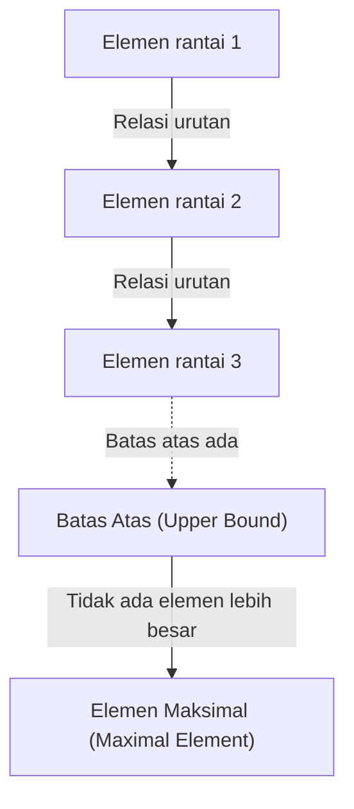
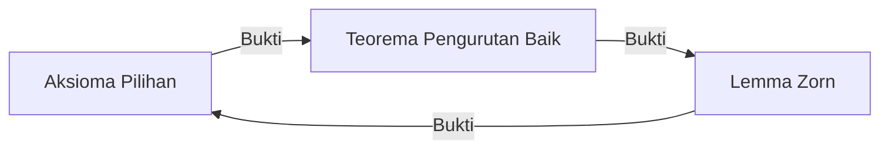

# Aksioma Pilihan dan Lemma Zorn: Konsep 'Pilihan' yang Mengguncang Fondasi Matematika

Dalam sejarah matematika, tidak ada aksioma yang menimbulkan perdebatan sebanyak **Aksioma Pilihan** (Axiom of Choice), sekaligus menjadi tak terpisahkan dari matematika modern. Dalam artikel ini, kita akan mendalami aksioma pilihan dan proposisi yang setara dengannya, yaitu **Lemma Zorn** (Zorn's Lemma), dari dasar hingga ke kedalaman. Kita akan memberikan penjelasan komprehensif mulai dari pemahaman intuitif, formulasi matematis yang ketat, latar belakang historis, hingga penerapannya di berbagai cabang matematika modern.

## 1. Apa Itu Aksioma Pilihan? Intuisi dan Definisi Ketat

Aksioma pilihan secara intuitif membuat pernyataan yang sangat sederhana. "Jika diberikan sebuah keluarga (kumpulan) himpunan yang tidak mengandung himpunan kosong, maka kita dapat memilih satu elemen dari setiap himpunan untuk membentuk himpunan baru."

Dalam kehidupan sehari-hari, jika ada beberapa kotak dan setiap kotak berisi setidaknya satu bola, maka memilih satu bola dari setiap kotak tampak sangat wajar. Namun, ketika jumlah kotak menjadi tak hingga, "operasi yang wajar" ini menjadi tidak lagi trivial secara matematis.

### 1.1. Formulasi Matematis yang Ketat

Dalam teori himpunan Zermelo-Fraenkel (ZF), yaitu sistem aksioma standar dalam teori himpunan, aksioma pilihan (AC) diformulasikan sebagai berikut:

$$
\forall X \left( \emptyset \notin X \implies \exists f: X \to \bigcup X \quad \text{s.t.} \quad \forall A \in X, f(A) \in A \right)
$$

Di sini, fungsi $f$ disebut **fungsi pilihan** (choice function). Artinya, pernyataan ini mengklaim bahwa terdapat fungsi yang menetapkan elemen $f(A)$ untuk setiap himpunan tak kosong $A$ yang termasuk dalam keluarga himpunan $X$.

### 1.2. Perbedaan Antara Hingga dan Tak Hingga: Contoh Kaus Kaki Russell

Ketika memilih elemen dari jumlah himpunan yang hingga, aksioma pilihan tidak diperlukan. Karena dalam kerangka logika biasa, elemen dapat dipilih satu per satu secara berurutan. Namun, ketika memilih satu elemen secara bersamaan dari jumlah himpunan yang tak hingga, fungsi pilihan tidak dapat dikonstruksi kecuali ada "aturan" yang menentukan cara pemilihan secara unik.

Filsuf dan matematikawan Inggris Bertrand Russell menyajikan analogi terkenal untuk menjelaskan situasi ini:

> "Untuk memilih satu sepatu dari pasangan sepatu tak hingga, aksioma pilihan tidak diperlukan, karena ada aturan yang jelas: 'selalu pilih sepatu kiri.' Namun, untuk memilih satu kaus kaki dari pasangan kaus kaki tak hingga, aksioma pilihan diperlukan, karena kaus kaki tidak memiliki perbedaan kiri dan kanan, sehingga aturan pemilihan tidak dapat diberikan secara eksplisit."

Analogi ini dengan elegan menunjukkan mengapa keberadaan fungsi pilihan harus diminta sebagai "aksioma" ketika "konstruksi berbasis aturan" tidak mungkin dilakukan dalam pilihan tak hingga.

## 2. Lemma Zorn: Proposisi Setara yang Kuat dari Aksioma Pilihan

Dalam matematika abstrak modern, penggunaan **Lemma Zorn** (Zorn's Lemma), sebuah teorema yang setara dengan aksioma pilihan, sering kali membuat bukti menjadi jauh lebih jelas dibandingkan menerapkan aksioma pilihan secara langsung. Diajukan oleh Max Zorn pada tahun 1935, lemma ini telah menjadi alat standar dalam aljabar dan topologi.

### 2.1. Pernyataan Lemma Zorn

Lemma Zorn adalah pernyataan mengenai himpunan terurut parsial:

> **Lemma Zorn**
> Dalam himpunan terurut parsial $(P, \le)$ yang tak kosong, jika setiap subhimpunan terurut total (rantai) memiliki batas atas, maka $P$ memiliki setidaknya satu elemen maksimal.

$$
\text{If every chain } C \subseteq P \text{ has an upper bound, then } P \text{ has a maximal element.}
$$

### 2.2. Penataan Istilah

Untuk memahami lemma Zorn, mari kita perjelas konsep-konsep terkait:

- **Himpunan Terurut Parsial** (Partially Ordered Set, Poset): Himpunan yang memiliki relasi urutan $\le$ yang didefinisikan antar elemennya, tetapi tidak semua pasangan elemen harus dapat dibandingkan. Misalnya, relasi inklusi himpunan $\subseteq$ adalah urutan parsial.
- **Himpunan Terurut Total / Rantai** (Total Order / Chain): Subhimpunan di mana setiap dua elemen dapat dibandingkan.
- **Batas Atas** (Upper Bound): Elemen yang "lebih besar dari atau sama dengan" semua elemen dalam rantai. Batas atas ini sendiri tidak harus termasuk dalam rantai.
- **Elemen Maksimal** (Maximal Element): Elemen dalam himpunan $P$ yang tidak memiliki elemen yang "benar-benar lebih besar" darinya. Berbeda dari elemen terbesar (lebih besar dari semua elemen), elemen maksimal dapat ada lebih dari satu.

## 3. Jaringan Kesetaraan: Aksioma Pilihan, Lemma Zorn, dan Teorema Pengurutan Baik

Aksioma pilihan dan lemma Zorn tampak sebagai pernyataan yang sama sekali berbeda, tetapi dengan mengasumsikan sistem aksioma ZF, keduanya setara (jika satu benar maka yang lain juga benar). Dalam jaringan bukti kesetaraan ini, **Teorema Pengurutan Baik** (Well-ordering theorem) yang dibuktikan oleh Ernst Zermelo memainkan peran penting.

### 3.1. Apa Itu Teorema Pengurutan Baik?

> **Teorema Pengurutan Baik**
> Setiap himpunan dapat diurut dengan baik. Artinya, untuk setiap himpunan, dapat didefinisikan relasi urutan total sedemikian rupa sehingga setiap subhimpunan tak kosongnya memiliki elemen terkecil.

Himpunan bilangan real $\mathbb{R}$ tidak terurut dengan baik menurut urutan biasa (misalnya, interval terbuka $(0, 1)$ tidak memiliki elemen terkecil). Namun, teorema pengurutan baik mengklaim bahwa himpunan bilangan real juga dapat diberikan "suatu" urutan yang baik. Ini adalah hasil yang sangat berlawanan dengan intuisi.

### 3.2. Lingkaran Bukti Kesetaraan

Dalam sistem aksioma ZF, tiga proposisi berikut sepenuhnya setara:

1. Aksioma Pilihan (Axiom of Choice)
2. Teorema Pengurutan Baik (Well-ordering Theorem)
3. Lemma Zorn (Zorn's Lemma)

Dalam buku teks matematika standar, kesetaraan ditunjukkan dalam urutan berikut:

Bukti bahwa aksioma pilihan dapat diturunkan dari lemma Zorn relatif sederhana. Himpunan semua konstruksi parsial fungsi pilihan dijadikan himpunan terurut parsial dengan relasi inklusi, lalu lemma Zorn diterapkan untuk menemukan elemen maksimal, sehingga membuktikan keberadaan fungsi pilihan dengan domain penuh.

## 4. Kekuatan Aplikasi Lemma Zorn yang Luar Biasa dalam Matematika Modern

Lemma Zorn adalah perangkat kuat yang menjamin keberadaan "yang maksimal" dalam matematika abstrak. Berikut adalah contoh-contoh aplikasi representatif di setiap bidang.

### 4.1. Aljabar: Setiap Ruang Vektor Memiliki Basis
Dalam aljabar linear, keberadaan basis pada ruang vektor berdimensi hingga dapat ditunjukkan secara konstruktif. Namun, pada ruang vektor berdimensi tak hingga seperti ruang semua fungsi atas lapangan bilangan real $\mathbb{R}$, tidaklah trivial bahwa basis Hamel (subhimpunan yang memungkinkan setiap elemen direpresentasikan secara unik sebagai kombinasi linear dari sejumlah hingga elemen basis) ada.

Garis besar bukti: Semua subhimpunan bebas linear dari ruang vektor $V$ diurut dengan relasi inklusi $\subseteq$. Jika kita mengambil rantai apa pun dalam himpunan terurut parsial ini, gabungannya juga bebas linear (karena hanya kombinasi linear hingga yang dipertimbangkan). Oleh karena itu, gabungan tersebut menjadi batas atas. Berdasarkan lemma Zorn, elemen maksimal ada, dan elemen maksimal inilah yang menjadi basis yang dicari.

### 4.2. Teori Gelanggang: Teorema Krull
> Setiap gelanggang komutatif dengan elemen satuan $1 \neq 0$ memiliki setidaknya satu ideal maksimal.

Teorema ini (Teorema Krull) juga merupakan aplikasi langsung dari lemma Zorn. Semua ideal sejati (yang tidak mengandung 1) diurut dengan relasi inklusi. Batas atas (gabungan) dari setiap rantai juga merupakan ideal yang tidak mengandung 1, sehingga keberadaan elemen maksimal (ideal maksimal) dapat disimpulkan.

### 4.3. Topologi: Teorema Tychonoff
> Hasil kali langsung dari sejumlah ruang kompak adalah kompak terhadap topologi hasil kali.

Teorema Tychonoff adalah salah satu teorema terpenting dalam topologi dan mendukung fondasi analisis fungsional. Menariknya, teorema Tychonoff telah terbukti setara dengan aksioma pilihan dalam sistem aksioma ZF.

### 4.4. Analisis Fungsional: Teorema Hahn-Banach
Teorema Hahn-Banach menjamin bahwa fungsional linear terbatas yang didefinisikan pada subruang dapat diperluas ke seluruh ruang tanpa meningkatkan norma (besaran). Proses perluasan ini memerlukan pengulangan langkah perluasan satu dimensi pada satu waktu sebanyak tak hingga kali, dan untuk menjamin perluasan ke seluruh ruang sebagai limitnya, lemma Zorn sangat diperlukan.

## 5. Paradoks yang Ditimbulkan Aksioma Pilihan: Teorema Banach-Tarski

Sementara aksioma pilihan memberikan kekuatan besar pada matematika, ia juga menghasilkan hasil yang benar-benar menghancurkan intuisi kita tentang ruang. Contoh paling terkenal adalah **Paradoks Banach-Tarski** (Banach-Tarski Paradox).

### 5.1. Isi Paradoks

> Sebuah bola pejal dalam ruang Euklides tiga dimensi dapat dipecah menjadi sejumlah hingga bagian (misalnya 5 potongan). Dengan mengatur ulang dan merakit kembali bagian-bagian tersebut hanya melalui rotasi dan translasi (gerak benda tegar), dapat dibuat **dua** bola dengan ukuran yang persis sama dengan bola aslinya.

$$
1 \text{ Sphere} \xrightarrow{\text{Cut into } 5 \text{ pieces, Rotate \& Translate}} 2 \text{ Spheres of same size}
$$

### 5.2. Mengapa Hal Ini Bisa Terjadi?

"Sihir menciptakan dua bola dari satu bola" ini disebabkan oleh fakta bahwa dengan menggunakan aksioma pilihan, kita dapat membuat "himpunan yang tidak memiliki ukuran Lebesgue (himpunan yang sangat kompleks dan tersebar sehingga volumenya tidak dapat didefinisikan)." Potongan-potongan yang dihasilkan dari pemecahan bukanlah benda padat dengan permukaan potongan yang halus seperti yang kita bayangkan, melainkan struktur yang menyerupai labirin tak hingga dari titik-titik. Karena volume tidak terdefinisi, "hukum kekekalan volume" tidak berlaku, dan akibatnya volume tampak menjadi dua kali lipat.

## 6. Sistem Aksioma ZFC: Standar De Facto Matematika Modern

Karena hasil yang berlawanan dengan intuisi seperti teorema Banach-Tarski, banyak matematikawan di awal abad ke-20, termasuk Henri Lebesgue dan Émile Borel, dengan keras menentang aksioma pilihan (yang dikenal sebagai pendekatan konstruktivisme).

Namun, matematika standar modern mengadopsi **sistem aksioma ZFC** (Zermelo-Fraenkel set theory with the axiom of Choice) — teori himpunan Zermelo-Fraenkel ditambah aksioma pilihan — sebagai fondasi yang kokoh.

$$
\text{ZFC} = \text{ZF} + \text{Axiom of Choice}
$$

### Mengapa ZFC Diterima?

Alasannya sederhana dan jelas. Jika aksioma pilihan ditolak (hanya mengadopsi sistem aksioma ZF), pencapaian matematis yang hilang terlalu besar. Basis semua ruang vektor, kekompakan hasil kali ruang topologis, banyak sifat berguna dari ukuran Lebesgue — semuanya akan runtuh. Meskipun harus membayar "harga" berupa paradoks Banach-Tarski, aksioma pilihan diterima demi mempertahankan sistem matematika abstrak modern yang kaya dan indah.

## 7. Kesimpulan: Jembatan di Atas Jurang Ketakhinggaan

Aksioma pilihan dan lemma Zorn menunjukkan bagaimana operasi "pilihan" — yang begitu wajar di ranah hingga sehingga tidak disadari keberadaannya — begitu memasuki ranah ketakhinggaan, menghasilkan struktur yang begitu mendalam, menakutkan, dan indah.

Lemma Zorn, sebagai tongkat ajaib yang kuat yang menjamin keberadaan "yang maksimal" di ujung rantai tak hingga, telah mendorong perkembangan aljabar dan analisis. Di dasar teorema-teorema matematika yang kita gunakan sehari-hari tanpa berpikir panjang, terbaring filosofi mendalam yang disebut "aksioma pilihan." Fondasi matematika bukan sekadar teka-teki logika, melainkan drama agung tentang bagaimana akal budi manusia menghadapi konsep ketakhinggaan.
