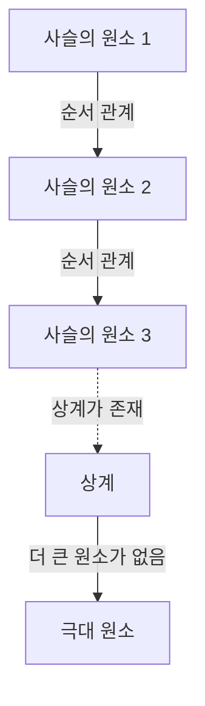

# [선택 공리와 초른의 보조정리](https://kenji.blog/p/axiom-of-choice-and-zorns-lemma/): 수학의 기초를 뒤흔든 '선택'의 개념

수학의 역사에서 **선택 공리** (Axiom of Choice)만큼 논쟁을 불러일으키고, 동시에 현대 수학에 불가결해진 공리는 없습니다. 본 글에서는 선택 공리와 그것과 동치인 명제인 **초른의 보조정리** (Zorn's Lemma)에 대해 기초부터 깊이 파고들어갑니다. 직관적인 이해에서 엄밀한 수학적 정식화, 역사적 배경, 그리고 현대 수학의 다양한 분야에서의 응용까지 포괄적으로 해설합니다.

## 1. 선택 공리란 무엇인가? 직관과 엄밀한 정의

선택 공리는 직관적으로 매우 단순한 주장을 하고 있습니다. "공집합을 포함하지 않는 집합의 족(모임)이 주어졌을 때, 각각의 집합에서 하나씩 원소를 골라내어 새로운 집합을 만들 수 있다"는 것입니다.

일상적인 감각으로는, 여러 상자가 있고 각 상자에 적어도 1개의 공이 들어 있다면, 각 상자에서 공을 하나씩 고르는 것은 당연히 가능해 보입니다. 하지만 상자의 수가 무한이 되었을 때, 이 '당연한 조작'은 수학적으로 자명하지 않게 됩니다.

### 1.1. 엄밀한 수학적 정식화

집합론의 표준적인 공리계인 체르멜로-프렌켈 집합론(ZF)에서, 선택 공리(AC)는 다음과 같이 정식화됩니다.

$$
\forall X \left( \emptyset \notin X \implies \exists f: X \to \bigcup X \quad \text{s.t.} \quad \forall A \in X, f(A) \in A \right)
$$

여기서 함수 $f$는 **선택 함수** (choice function)라고 불립니다. 즉, 집합의 족 $X$에 속하는 임의의 공이 아닌 집합 $A$에 대해, 그 원소 $f(A)$를 할당하는 함수가 존재한다는 주장입니다.

### 1.2. 유한과 무한의 차이: 러셀의 양말 예시

유한 개의 집합에서 원소를 고르는 경우, 선택 공리는 불필요합니다. 통상적인 논리의 틀 안에서, 원소를 하나씩 순서대로 골라갈 수 있기 때문입니다. 하지만, 무한 개의 집합에서 동시에 하나씩 고르는 경우, 그 고르는 방법을 유일하게 정하는 '규칙'이 없는 한, 선택 함수를 구성할 수 없습니다.

영국의 철학자이자 수학자인 버트런드 러셀은 이 상황을 설명하기 위해 유명한 비유를 제시했습니다.

> "무한 쌍의 신발에서 한 짝씩 고르는 데는 선택 공리가 불필요하다. 왜냐하면 '항상 왼발 신발을 고른다'는 명확한 규칙이 있기 때문이다. 하지만 무한 쌍의 양말에서 한 짝씩 고르는 데는 선택 공리가 필요하다. 양말에는 좌우 구별이 없기 때문에, 고르기 위한 규칙을 명시적으로 제시할 수 없기 때문이다."

이 비유는 무한의 선택에서 '규칙적 구성'이 불가능한 경우, 선택 함수의 존재를 '공리'로서 요청해야 하는 이유를 훌륭하게 보여주고 있습니다.

## 2. 초른의 보조정리: 선택 공리의 강력한 동치 명제

현대 추상 수학에서, 선택 공리를 직접 적용하기보다 그것과 동치인 정리인 **초른의 보조정리** (Zorn's Lemma)를 사용하면, 증명이 극적으로 더 명확해지는 경우가 많습니다. 1935년에 막스 초른에 의해 제안된 이 보조정리는 대수학과 위상 공간론에서 표준적인 도구가 되었습니다.

### 2.1. 초른의 보조정리의 주장

초른의 보조정리는 반순서 집합에 관한 다음의 주장입니다.

> **초른의 보조정리**
> 공이 아닌 반순서 집합 $(P, \le)$에서, 그 임의의 전순서 부분집합(사슬)이 상계를 가지면, $P$는 적어도 하나의 극대 원소를 가진다.

$$
\text{모든 사슬 } C \subseteq P \text{ 이 상계를 가지면, } P \text{ 는 극대 원소를 가진다.}
$$

### 2.2. 용어 정리

초른의 보조정리를 이해하기 위해 관련 개념을 명확히 합시다.

- **반순서 집합** (Partially Ordered Set, Poset): 집합의 원소 간에 순서 관계 $\le$가 정의되어 있지만, 모든 원소 쌍이 비교 가능할 필요는 없는 집합. 예를 들어, 집합의 포함 관계 $\subseteq$는 반순서입니다.
- **전순서 집합 / 사슬** (Total Order / Chain): 부분집합 중에서 임의의 두 원소가 비교 가능한 것.
- **상계** (Upper Bound): 사슬의 모든 원소에 대해, 그보다 '크거나 같은' 원소. 이 상계 자체는 사슬에 포함되어 있지 않아도 됩니다.
- **극대 원소** (Maximal Element): 집합 $P$ 안에서, 그보다 '진정으로 큰' 원소가 존재하지 않는 원소. 최대 원소(모든 원소보다 큰)와는 달리, 극대 원소는 여러 개 존재할 수 있습니다.

## 3. 동치성의 네트워크: 선택 공리, 초른의 보조정리, 정렬 정리

[선택 공리와 초른의 보조정리](https://kenji.blog/p/axiom-of-choice-and-zorns-lemma/)는 전혀 다른 주장으로 보이지만, ZF 공리계를 전제하면 서로 동치(하나가 참이면 다른 것도 참)가 됩니다. 이 동치성 증명의 네트워크에서, 에른스트 체르멜로가 증명한 **정렬 정리** (Well-ordering theorem)가 중요한 역할을 합니다.

### 3.1. 정렬 정리란

> **정렬 정리**
> 임의의 집합은 정렬 가능하다. 즉, 임의의 집합에 대해, 그 공이 아닌 임의의 부분집합이 최소 원소를 갖는 전순서 관계를 정의할 수 있다.

실수의 집합 $\mathbb{R}$은 통상적인 대소 관계로는 정렬되어 있지 않습니다(예를 들어, 개구간 $(0, 1)$에는 최소 원소가 없습니다). 하지만 정렬 정리에 따르면, 실수의 집합에도 '어떤' 정렬 순서를 부여할 수 있다고 주장합니다. 이는 매우 반직관적인 결과입니다.

### 3.2. 동치성 증명의 순환

ZF 공리계에서, 다음 세 가지 명제는 완전히 동치입니다.

1. 선택 공리 (Axiom of Choice)
2. 정렬 정리 (Well-ordering Theorem)
3. 초른의 보조정리 (Zorn's Lemma)

표준적인 수학 교과서에서는, 다음과 같은 순서로 동치성이 증명됩니다.

초른의 보조정리에서 선택 공리를 이끌어내는 증명은 비교적 쉽습니다. 선택 함수의 부분적 구성 전체의 집합을 포함 관계로 반순서 집합을 만들고, 초른의 보조정리를 적용하여 극대 원소를 찾음으로써, 전 정의역을 갖는 선택 함수의 존재를 보입니다.

## 4. 현대 수학에서 초른의 보조정리의 압도적인 응용력

초른의 보조정리는 추상 수학에서 '극대인 것'의 존재를 보증하는 강력한 도구입니다. 아래에 각 분야에서의 대표적인 응용 사례를 상술합니다.

### 4.1. 대수학: 모든 벡터 공간은 기저를 가진다
선형대수학에서, 유한 차원 벡터 공간이 기저를 가지는 것은 구성적으로 보일 수 있습니다. 하지만, 실수체 $\mathbb{R}$ 위의 함수 전체의 공간과 같은 무한 차원 벡터 공간에서, 하멜 기저(임의의 원이 유한 개의 기저의 선형 결합으로 유일하게 표현되는 부분집합)가 존재하는지 여부는 자명하지 않습니다.

증명 개요: 벡터 공간 $V$의 선형 독립인 부분집합 전체를 포함 관계 $\subseteq$로 순서를 매깁니다. 이 반순서 집합의 임의의 사슬을 취하면, 그 합집합도 역시 선형 독립임을 확인할 수 있습니다(유한 개의 선형 결합만 고려하므로). 따라서 합집합은 상계가 됩니다. 초른의 보조정리에 의해 극대 원소가 존재하며, 이 극대 원소가 바로 구하는 기저입니다.

### 4.2. 환론: 크룰의 정리
> 단위원 $1 \neq 0$을 갖는 임의의 가환환에는 적어도 하나의 극대 아이디얼이 존재한다.

이 정리(크룰의 정리)도 초른의 보조정리의 직접적인 응용입니다. 1을 포함하지 않는(진) 아이디얼 전체를 포함 관계로 순서를 매깁니다. 임의의 사슬의 상계(합집합)도 역시 1을 포함하지 않는 아이디얼이 되므로, 극대 원소(극대 아이디얼)의 존재가 도출됩니다.

### 4.3. 위상 공간론: 티호노프의 정리
> 콤팩트 공간의 임의의 직적 공간은 직적 위상에 관해 콤팩트이다.

티호노프의 정리는 위상 공간론에서 가장 중요한 정리 중 하나이며, 함수 해석학의 기초를 지탱하고 있습니다. 흥미롭게도, 티호노프의 정리는 ZF 공리계에서 선택 공리와 동치임이 증명되어 있습니다.

### 4.4. 함수 해석학: 한-바나흐의 정리
한-바나흐의 정리는 부분 공간 위에서 정의된 유계 선형 범함수를, 노름(크기)을 증가시키지 않고 전체 공간으로 확장할 수 있음을 보증합니다. 이 확장 과정은 1차원씩 확장하는 단계를 무한히 반복해야 하며, 그 극한으로서 전체로의 확장을 보증하기 위해 초른의 보조정리가 필수불가결합니다.

## 5. 선택 공리가 가져오는 역설: 바나흐-타르스키 정리

선택 공리는 수학에 강대한 힘을 가져다주는 한편, 우리의 공간에 대한 직관을 완전히 파괴하는 결과도 초래합니다. 그 가장 유명한 예가 **바나흐-타르스키 역설** (Banach-Tarski Paradox)입니다.

### 5.1. 역설의 내용

> 3차원 [유클리드](https://kenji.blog/p/euclid/) 공간 안의 구체(속이 찬 공)를 유한 개의 조각(예를 들어 5개의 조각)으로 분할한다. 그 조각들을 회전과 평행 이동(강체 운동)만으로 재배치하여 다시 조립하면, 원래 공과 완전히 같은 크기의 구체를 **2개** 만들 수 있다.

$$
1 \text{ 구} \xrightarrow{\text{분할 } 5 \text{ 조각, 회전 \& 평행이동}} 2 \text{ 같은 크기의 구}
$$

### 5.2. 왜 이런 일이 발생하는가?

이 '하나의 공에서 두 개의 공을 만들어내는 마법'은, 선택 공리를 사용함으로써 '르베그 측도를 갖지 않는 집합(부피를 정의할 수 없는 매우 복잡하고 흩어진 집합)'을 만들어낼 수 있는 것에 기인합니다. 분할된 조각들은 우리가 상상하는 것과 같은 매끈한 단면을 가진 입체가 아니라, 점들의 무한한 미로와 같은 구조를 하고 있습니다. 부피를 정의할 수 없기 때문에 '부피 보존 법칙'이 적용되지 않으며, 결과적으로 부피가 2배가 된 것처럼 보이는 것입니다.

## 6. ZFC 공리계: 현대 수학의 사실상 표준

바나흐-타르스키 정리와 같은 직관에 반하는 결과를 가져오기 때문에, 20세기 초에는 앙리 르베그와 에밀 보렐을 비롯한 많은 수학자들이 선택 공리에 강하게 반대했습니다(이른바 구성주의적 접근법).

하지만, 현대의 표준적인 수학은 체르멜로-프렌켈 집합론에 선택 공리를 더한 **ZFC 공리계** (Zermelo-Fraenkel set theory with the axiom of Choice)를 확고한 기초로 채택하고 있습니다.

$$
\text{ZFC} = \text{ZF} + \text{선택 공리}
$$

### 왜 ZFC가 받아들여졌는가?

그 이유는 단순명쾌합니다. 선택 공리를 거부할 경우(ZF 공리계만을 채택할 경우), 잃게 되는 수학적 성과가 너무나 크기 때문입니다. 모든 벡터 공간의 기저, 위상 공간의 콤팩트성의 직적, 르베그 측도의 많은 유용한 성질 등이 무너져 버립니다. 바나흐-타르스키 역설이라는 '대가'를 치르더라도, 현대의 풍요롭고 아름다운 추상 수학의 체계를 유지하기 위해 선택 공리는 받아들여진 것입니다.

## 7. 결론: 무한의 심연에 놓인 다리

[선택 공리와 초른의 보조정리](https://kenji.blog/p/axiom-of-choice-and-zorns-lemma/)는, 유한의 영역에서는 너무 당연해서 의식조차 되지 않는 '선택'이라는 조작이, 무한의 영역에 발을 들여놓는 순간, 얼마나 깊고, 두렵고, 그리고 아름다운 구조를 만들어내는지를 보여주고 있습니다.

초른의 보조정리는, 무한의 사슬 끝에 있는 '극대'의 존재를 보증하는 강력한 마법 지팡이로서, 대수학과 해석학의 발전을 견인했습니다. 우리가 평소 아무렇지 않게 사용하는 수학 정리의 근저에는, 이 '선택 공리'라는 심오한 철학이 놓여 있습니다. 수학 기초론은 단순한 논리의 퍼즐이 아니라, 인간의 이성이 무한이라는 개념에 어떻게 맞서는가 하는, 장대한 드라마인 것입니다.
