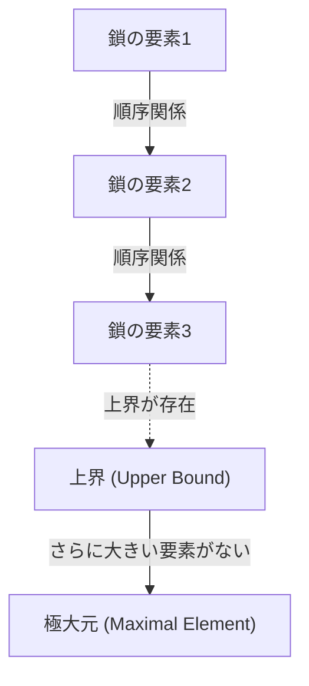
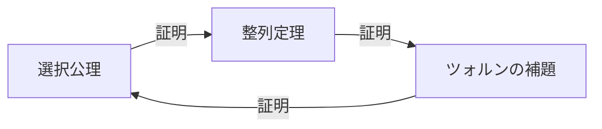

# [選択公理](https://kenji.blog/p/axiom-of-choice-and-zorns-lemma/)と[ツォルンの補題](https://kenji.blog/p/axiom-of-choice-and-zorns-lemma/)：数学の基礎を揺るがした「選択」の概念

数学の歴史において、 **[選択公理](https://kenji.blog/p/axiom-of-choice-and-zorns-lemma/)** （Axiom of Choice）ほど議論を呼び、そして現代数学に不可欠となった公理はありません。本記事では、[選択公理](https://kenji.blog/p/axiom-of-choice-and-zorns-lemma/)とそれと同値な命題である **[ツォルンの補題](https://kenji.blog/p/axiom-of-choice-and-zorns-lemma/)** （Zorn's Lemma）について、基礎から深く掘り下げていきます。直感的な理解から、厳密な数学的定式化、歴史的背景、そして現代数学の様々な分野における応用まで、包括的に解説します。

## 1. [選択公理](https://kenji.blog/p/axiom-of-choice-and-zorns-lemma/)とは何か？直感と厳密な定義

[選択公理](https://kenji.blog/p/axiom-of-choice-and-zorns-lemma/)は、直感的には非常に単純な主張をしています。「空集合を持たない集合の族（集まり）が与えられたとき、それぞれの集合から一つずつ要素を選び出して、新しい集合を作ることができる」というものです。

日常的な感覚では、いくつかの箱があり、それぞれの箱に少なくとも1つのボールが入っているなら、各箱からボールを1つずつ選ぶことは当然可能に思えます。しかし、箱の数が無限になったとき、この「当然の操作」は数学的に自明ではなくなります。

### 1.1. 厳密な数学的定式化

集合論の標準的な公理系であるツェルメロ＝フレンケル集合論（ZF）において、[選択公理](https://kenji.blog/p/axiom-of-choice-and-zorns-lemma/)（AC）は次のように定式化されます。

$$
\forall X \left( \emptyset \notin X \implies \exists f: X \to \bigcup X \quad \text{s.t.} \quad \forall A \in X, f(A) \in A \right)
$$

ここで、関数 $f$ は **選択関数** （choice function）と呼ばれます。つまり、集合の族 $X$ に属する任意の空でない集合 $A$ に対して、その要素 $f(A)$ を割り当てる関数が存在するという主張です。

### 1.2. 有限と無限の違い：ラッセルの靴下の例

有限個の集合から要素を選ぶ場合、[選択公理](https://kenji.blog/p/axiom-of-choice-and-zorns-lemma/)は不要です。通常の論理の枠組みで、要素を一つずつ順番に選んでいくことができるからです。しかし、無限個の集合から同時に一つずつ選ぶ場合、その選び方を一意に定める「規則」がない限り、選択関数を構成できません。

イギリスの哲学者・数学者であるバートランド・ラッセルは、この状況を説明するために有名な例えを提示しました。

> 「無限対の靴から片方ずつ選ぶには、[選択公理](https://kenji.blog/p/axiom-of-choice-and-zorns-lemma/)は不要である。なぜなら、『常に左足の靴を選ぶ』という明確な規則があるからだ。しかし、無限対の靴下から片方ずつ選ぶには、[選択公理](https://kenji.blog/p/axiom-of-choice-and-zorns-lemma/)が必要である。靴下には左右の区別がないため、選ぶための規則を明示的に与えることができないからである。」

この例えは、無限の選択において「規則的構成」が不可能な場合に、選択関数の存在を「公理」として要請しなければならない理由を見事に示しています。

## 2. [ツォルンの補題](https://kenji.blog/p/axiom-of-choice-and-zorns-lemma/)：[選択公理](https://kenji.blog/p/axiom-of-choice-and-zorns-lemma/)の強力な同値命題

現代の抽象数学において、[選択公理](https://kenji.blog/p/axiom-of-choice-and-zorns-lemma/)を直接適用するよりも、それと同値な定理である **[ツォルンの補題](https://kenji.blog/p/axiom-of-choice-and-zorns-lemma/)** （Zorn's Lemma）を用いる方が、証明が劇的に見通し良くなるケースが多々あります。1935年にマックス・ツォルンによって提唱されたこの補題は、代数学や位相空間論における標準的なツールとなっています。

### 2.1. [ツォルンの補題](https://kenji.blog/p/axiom-of-choice-and-zorns-lemma/)の主張

[ツォルンの補題](https://kenji.blog/p/axiom-of-choice-and-zorns-lemma/)は、半順序集合に関する以下の主張です。

> **[ツォルンの補題](https://kenji.blog/p/axiom-of-choice-and-zorns-lemma/)**
> 空でない半順序集合 $(P, \le)$ において、その任意の全順序部分集合（鎖）が上界を持つならば、$P$ は少なくとも1つの極大元を持つ。

$$
\text{If every chain } C \subseteq P \text{ has an upper bound, then } P \text{ has a maximal element.}
$$

### 2.2. 用語の整理

[ツォルンの補題](https://kenji.blog/p/axiom-of-choice-and-zorns-lemma/)を理解するために、関連する概念を明確にしましょう。

- **半順序集合** （Partially Ordered Set, Poset）: 集合の要素間に順序関係 $\le$ が定義されているが、すべての要素のペアが比較可能である必要はない集合。例えば、集合の包含関係 $\subseteq$ は半順序です。
- **全順序集合 / 鎖** （Total Order / Chain）: 部分集合の中で、任意の2つの要素が比較可能なもの。
- **上界** （Upper Bound）: 鎖の全ての要素に対して、それより「大きいか等しい」要素。この上界自体は鎖に含まれていなくても構いません。
- **極大元** （Maximal Element）: 集合 $P$ の中で、それより「真に大きい」要素が存在しない要素。最大元（全ての要素より大きい）とは異なり、極大元は複数存在し得ます。

## 3. 同値性のネットワーク：[選択公理](https://kenji.blog/p/axiom-of-choice-and-zorns-lemma/)、[ツォルンの補題](https://kenji.blog/p/axiom-of-choice-and-zorns-lemma/)、整列定理

[選択公理](https://kenji.blog/p/axiom-of-choice-and-zorns-lemma/)と[ツォルンの補題](https://kenji.blog/p/axiom-of-choice-and-zorns-lemma/)は、全く異なる主張に見えますが、ZF公理系を前提とすると互いに同値（一方が真であれば他方も真）になります。この同値性の証明のネットワークには、エルンスト・ツェルメロが証明した **整列定理** （Well-ordering theorem）が重要な役割を果たします。

### 3.1. 整列定理とは

> **整列定理**
> 任意の集合は整列可能である。すなわち、任意の集合に対して、その空でない任意の部分集合が最小元を持つような全順序関係を定義することができる。

実数の集合 $\mathbb{R}$ は通常の大小関係では整列されていません（例えば、開区間 $(0, 1)$ には最小元がありません）。しかし整列定理によれば、実数の集合にも「何らかの」整列順序を与えることができると主張しています。これは非常に非直感的な結果です。

### 3.2. 同値性の証明のループ

ZF公理系において、以下の3つの命題は完全に同値です。

1. [選択公理](https://kenji.blog/p/axiom-of-choice-and-zorns-lemma/) (Axiom of Choice)
2. 整列定理 (Well-ordering Theorem)
3. [ツォルンの補題](https://kenji.blog/p/axiom-of-choice-and-zorns-lemma/) (Zorn's Lemma)

標準的な数学の教科書では、次のような順序で同値性が示されます。

[ツォルンの補題](https://kenji.blog/p/axiom-of-choice-and-zorns-lemma/)から[選択公理](https://kenji.blog/p/axiom-of-choice-and-zorns-lemma/)を導く証明は比較的平易です。選択関数の部分的な構成全体の集合を包含関係で半順序集合とし、[ツォルンの補題](https://kenji.blog/p/axiom-of-choice-and-zorns-lemma/)を適用して極大元を見つけることで、全定義域を持つ選択関数の存在を示します。

## 4. 現代数学における[ツォルンの補題](https://kenji.blog/p/axiom-of-choice-and-zorns-lemma/)の圧倒的な応用力

[ツォルンの補題](https://kenji.blog/p/axiom-of-choice-and-zorns-lemma/)は、抽象数学において「極大なるもの」の存在を保証する強力な装置です。以下に、各分野における代表的な応用例を詳述します。

### 4.1. 代数学：すべてのベクトル空間は基底を持つ
線形代数において、有限次元ベクトル空間が基底を持つことは構成的に示せます。しかし、実数体 $\mathbb{R}$ 上の関数全体の空間のような無限次元ベクトル空間において、ハメル基底（任意の元が有限個の基底の線形結合で一意に表せるような部分集合）が存在するかどうかは自明ではありません。

証明の概略：ベクトル空間 $V$ の線形独立な部分集合の全体を包含関係 $\subseteq$ で順序付けします。この半順序集合の任意の鎖をとると、その和集合もまた線形独立であることが確認できます（有限個の線形結合のみを考えるため）。したがって和集合は上界となります。[ツォルンの補題](https://kenji.blog/p/axiom-of-choice-and-zorns-lemma/)により極大元が存在し、この極大元こそが求める基底となります。

### 4.2. 環論：クルルの定理
> 単位元 $1 \neq 0$ を持つ任意の可換環には、少なくとも一つの極大イデアルが存在する。

この定理（クルルの定理）も[ツォルンの補題](https://kenji.blog/p/axiom-of-choice-and-zorns-lemma/)の直接的な応用です。1を含まない（真の）イデアルの全体を包含関係で順序付けます。任意の鎖の上界（和集合）もまた1を含まないイデアルとなるため、極大元（極大イデアル）の存在が導かれます。

### 4.3. 位相空間論：チコノフの定理
> コンパクト空間の任意の直積空間は、直積位相に関してコンパクトである。

チコノフの定理は、位相空間論における最も重要な定理の一つであり、関数解析学の基礎を支えています。興味深いことに、チコノフの定理はZF公理系において[選択公理](https://kenji.blog/p/axiom-of-choice-and-zorns-lemma/)と同値であることが証明されています。

### 4.4. 関数解析学：ハーン＝バナッハの定理
ハーン＝バナッハの定理は、部分空間上で定義された有界線形汎関数を、ノルム（大きさ）を増大させることなく全空間に拡張できることを保証します。この拡張プロセスは、1次元ずつ拡張していくステップを無限回繰り返す必要があり、その極限としての全体への拡張を保証するために[ツォルンの補題](https://kenji.blog/p/axiom-of-choice-and-zorns-lemma/)が必要不可欠です。

## 5. [選択公理](https://kenji.blog/p/axiom-of-choice-and-zorns-lemma/)がもたらすパラドックス：バナッハ＝タルスキーの定理

[選択公理](https://kenji.blog/p/axiom-of-choice-and-zorns-lemma/)は数学に強大な力をもたらす一方で、私たちの空間に対する直感を完全に破壊するような結果も引き起こします。その最も有名な例が **バナッハ＝タルスキーのパラドックス** （Banach-Tarski Paradox）です。

### 5.1. パラドックスの内容

> 3次元ユークリッド空間内の球体（中身の詰まった球）を、有限個の部分（例えば5つの断片）に分割する。それらの部分を回転と平行移動（剛体運動）のみによって再配置し、組み立て直すと、元の球と全く同じ大きさの球体を **2つ** 作ることができる。

$$
1 \text{ Sphere} \xrightarrow{\text{Cut into } 5 \text{ pieces, Rotate \& Translate}} 2 \text{ Spheres of same size}
$$

### 5.2. なぜこのようなことが起きるのか？

この「1つの球から2つの球を生み出す魔法」は、[選択公理](https://kenji.blog/p/axiom-of-choice-and-zorns-lemma/)を用いることで「ルベーグ測度を持たない集合（体積を定義不可能な非常に複雑で散り散りな集合）」を作り出せることに起因します。分割された断片は、私たちが想像するような滑らかな切り口を持つ立体ではなく、点の無限の迷路のような構造をしています。体積が定義できないため、「体積の保存則」が適用されず、結果として体積が2倍になったように見えるのです。

## 6. ZFC公理系：現代数学のデファクトスタンダード

バナッハ＝タルスキーの定理のような直感に反する結果をもたらすため、20世紀初頭にはアンリ・ルベーグやエミール・ボレルをはじめとする多くの数学者が[選択公理](https://kenji.blog/p/axiom-of-choice-and-zorns-lemma/)に強く反対しました。（いわゆる構成主義的アプローチ）。

しかし、現代の標準的な数学は、ツェルメロ＝フレンケル集合論に[選択公理](https://kenji.blog/p/axiom-of-choice-and-zorns-lemma/)を加えた **ZFC公理系** （Zermelo-Fraenkel set theory with the axiom of Choice）を確固たる基礎として採用しています。

$$
\text{ZFC} = \text{ZF} + \text{Axiom of Choice}
$$

### なぜZFCが受け入れられたのか？

その理由は単純明快です。[選択公理](https://kenji.blog/p/axiom-of-choice-and-zorns-lemma/)を拒絶した場合（ZF公理系のみを採用した場合）、失われる数学的成果があまりにも大きすぎるからです。すべてのベクトル空間の基底、位相空間のコンパクト性の直積、ルベーグ測度の多くの有用な性質などが崩壊してしまいます。バナッハ＝タルスキーのパラドックスという「代償」を払ってでも、現代の豊かで美しい抽象数学の体系を維持するために、[選択公理](https://kenji.blog/p/axiom-of-choice-and-zorns-lemma/)は受け入れられたのです。

## 7. 結論：無限の深淵に架かる橋

[選択公理](https://kenji.blog/p/axiom-of-choice-and-zorns-lemma/)と[ツォルンの補題](https://kenji.blog/p/axiom-of-choice-and-zorns-lemma/)は、有限の領域では当たり前すぎて意識すらされない「選択」という操作が、無限の領域に足を踏み入れた途端に、いかに深く、恐ろしく、そして美しい構造を生み出すかを示しています。

[ツォルンの補題](https://kenji.blog/p/axiom-of-choice-and-zorns-lemma/)は、無限の連鎖の果てにある「極大」の存在を保証する強力な魔法の杖として、代数学や解析学の発展を牽引しました。私たちが普段何気なく使っている数学の定理の根底には、この「[選択公理](https://kenji.blog/p/axiom-of-choice-and-zorns-lemma/)」という深遠な哲学が横たわっています。数学の基礎論は、単なる論理のパズルではなく、人間の理性が無限という概念にどう立ち向かうかという、壮大なドラマなのです。
