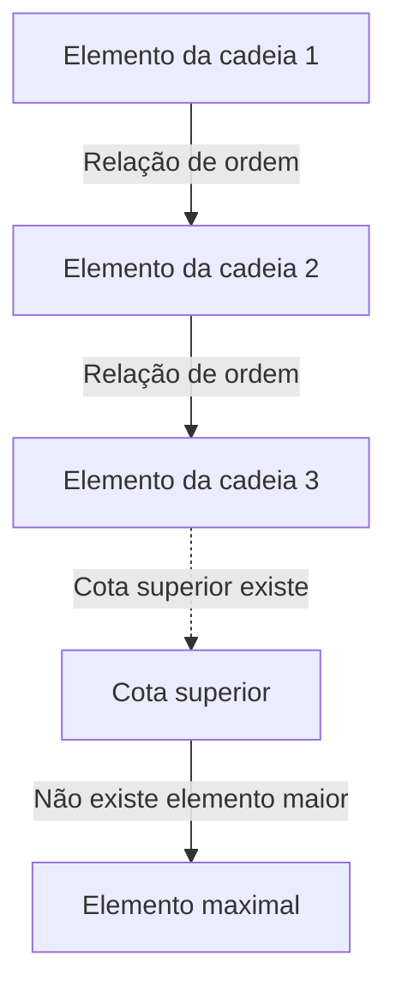
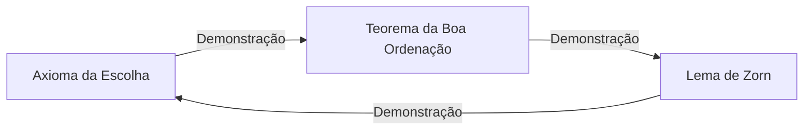

# [O Axioma da Escolha e o Lema de Zorn](https://kenji.blog/pt/p/axiom-of-choice-and-zorns-lemma/): O conceito de «escolha» que abalou os fundamentos da matemática

Na história da matemática, nenhum axioma gerou tanta controvérsia e, ao mesmo tempo, se tornou tão indispensável para a matemática moderna quanto o **Axioma da Escolha** (Axiom of Choice). Neste artigo, exploramos em profundidade o Axioma da Escolha e sua proposição equivalente, o **Lema de Zorn** (Zorn's Lemma), desde as bases. Oferecemos uma explicação abrangente que engloba a compreensão intuitiva, a formalização matemática rigorosa, o contexto histórico e as aplicações em diversos campos da matemática moderna.

## 1. O que é o Axioma da Escolha? Intuição e definição rigorosa

O Axioma da Escolha faz uma afirmação intuitivamente muito simples: «Dada uma família (coleção) de conjuntos que não contém o conjunto vazio, é possível selecionar um elemento de cada conjunto e formar um novo conjunto.»

No senso comum, se tivermos várias caixas, cada uma contendo pelo menos uma bola, parece perfeitamente natural poder escolher uma bola de cada caixa. Porém, quando o número de caixas se torna infinito, essa «operação óbvia» deixa de ser matematicamente evidente.

### 1.1. Formalização matemática rigorosa

No sistema axiomático padrão da teoria dos conjuntos, a teoria dos conjuntos de Zermelo-Fraenkel (ZF), o Axioma da Escolha (AC) é formalizado da seguinte forma:

$$
\forall X \left( \emptyset \notin X \implies \exists f: X \to \bigcup X \quad \text{t.q.} \quad \forall A \in X, f(A) \in A \right)
$$

Aqui, a função $f$ é chamada de **função de escolha** (choice function). Ou seja, afirma-se a existência de uma função que atribui a cada conjunto não vazio $A$ pertencente à família de conjuntos $X$ um de seus elementos $f(A)$.

### 1.2. A diferença entre finito e infinito: o exemplo das meias de Russell

Ao selecionar elementos de um número finito de conjuntos, o Axioma da Escolha não é necessário. Isso porque, dentro do quadro ordinário da lógica, os elementos podem ser selecionados um por um, em ordem. No entanto, ao selecionar simultaneamente um elemento de cada um de infinitos conjuntos, uma função de escolha não pode ser construída a menos que exista uma «regra» que determine de forma única o método de seleção.

O filósofo e matemático britânico Bertrand Russell apresentou uma analogia famosa para explicar essa situação:

> «Para escolher um sapato de cada um de infinitos pares de sapatos, o Axioma da Escolha não é necessário, pois existe uma regra clara: 'sempre escolher o sapato esquerdo.' Porém, para escolher uma meia de cada um de infinitos pares de meias, o Axioma da Escolha é necessário, pois as meias não têm distinção entre esquerda e direita, tornando impossível fornecer explicitamente uma regra para escolher.»

Essa analogia demonstra brilhantemente por que, nos casos em que a «construção baseada em regras» é impossível para escolhas infinitas, a existência de uma função de escolha deve ser postulada como um «axioma».

## 2. O Lema de Zorn: um poderoso equivalente do Axioma da Escolha

Na matemática abstrata moderna, existem muitos casos em que o uso do **Lema de Zorn** – um teorema equivalente ao Axioma da Escolha – torna as demonstrações dramaticamente mais claras do que a aplicação direta do Axioma da Escolha. Proposto por Max Zorn em 1935, este lema tornou-se uma ferramenta padrão em álgebra e topologia.

### 2.1. O enunciado do Lema de Zorn

O Lema de Zorn é a seguinte afirmação sobre conjuntos parcialmente ordenados:

> **Lema de Zorn**
> Em um conjunto parcialmente ordenado não vazio $(P, \le)$, se todo subconjunto totalmente ordenado (cadeia) possui uma cota superior, então $P$ possui pelo menos um elemento maximal.

$$
\text{Se toda cadeia } C \subseteq P \text{ tem um limite superior, então } P \text{ tem um elemento maximal.}
$$

### 2.2. Esclarecimento da terminologia

Vamos esclarecer os conceitos relacionados à compreensão do Lema de Zorn:

- **Conjunto parcialmente ordenado** (Partially Ordered Set, Poset): Um conjunto no qual uma relação de ordem $\le$ é definida entre os elementos, mas nem todos os pares de elementos precisam ser comparáveis. Por exemplo, a relação de inclusão $\subseteq$ em conjuntos é uma ordem parcial.
- **Conjunto totalmente ordenado / Cadeia** (Total Order / Chain): Um subconjunto no qual quaisquer dois elementos são comparáveis.
- **Cota superior** (Upper Bound): Um elemento que é «maior ou igual» a cada elemento de uma cadeia. A cota superior em si não precisa pertencer à cadeia.
- **Elemento maximal** (Maximal Element): Um elemento do conjunto $P$ para o qual não existe nenhum elemento «estritamente maior». Diferentemente do maior elemento (que é maior que todos os elementos), podem existir múltiplos elementos maximais.

## 3. A rede de equivalências: Axioma da Escolha, Lema de Zorn e Teorema da Boa Ordenação

[O Axioma da Escolha e o Lema de Zorn](https://kenji.blog/pt/p/axiom-of-choice-and-zorns-lemma/) parecem ser afirmações completamente diferentes, mas sob o sistema axiomático ZF são equivalentes (se um é verdadeiro, o outro também é). Nessa rede de provas de equivalência, o **Teorema da Boa Ordenação** (Well-ordering theorem), demonstrado por Ernst Zermelo, desempenha um papel crucial.

### 3.1. O que é o Teorema da Boa Ordenação?

> **Teorema da Boa Ordenação**
> Todo conjunto pode ser bem ordenado. Ou seja, para qualquer conjunto, é possível definir uma relação de ordem total tal que todo subconjunto não vazio possua um elemento mínimo.

O conjunto dos números reais $\mathbb{R}$ não é bem ordenado pela ordem usual (por exemplo, o intervalo aberto $(0, 1)$ não possui elemento mínimo). No entanto, o Teorema da Boa Ordenação afirma que mesmo o conjunto dos números reais pode receber «alguma» boa ordenação. Este é um resultado altamente contraintuitivo.

### 3.2. O ciclo das provas de equivalência

No sistema axiomático ZF, as seguintes três proposições são completamente equivalentes:

1. Axioma da Escolha (Axiom of Choice)
2. Teorema da Boa Ordenação (Well-ordering Theorem)
3. Lema de Zorn (Zorn's Lemma)

Nos livros-texto padrão de matemática, a equivalência é demonstrada na seguinte ordem:

A demonstração que deriva o Axioma da Escolha a partir do Lema de Zorn é relativamente simples. Forma-se o conjunto de todas as construções parciais de uma função de escolha, ordena-se por inclusão para criar um conjunto parcialmente ordenado e aplica-se o Lema de Zorn para encontrar um elemento maximal, demonstrando assim a existência de uma função de escolha com domínio completo.

## 4. O poder avassalador do Lema de Zorn na matemática moderna

O Lema de Zorn é um dispositivo poderoso que garante a existência de «objetos maximais» na matemática abstrata. A seguir, detalham-se aplicações representativas em diversos campos.

### 4.1. Álgebra: todo espaço vetorial possui uma base
Na álgebra linear, pode-se demonstrar construtivamente que espaços vetoriais de dimensão finita possuem uma base. Porém, para espaços vetoriais de dimensão infinita – como o espaço de todas as funções sobre o corpo dos reais $\mathbb{R}$ – não é evidente se uma base de Hamel (um subconjunto tal que todo elemento possa ser expresso de maneira única como combinação linear finita de elementos da base) existe.

Esboço da demonstração: Ordena-se o conjunto de todos os subconjuntos linearmente independentes de um espaço vetorial $V$ pela relação de inclusão $\subseteq$. Para qualquer cadeia nesse conjunto parcialmente ordenado, sua união é também linearmente independente (pois consideram-se apenas combinações lineares finitas). Portanto, a união serve como cota superior. Pelo Lema de Zorn, existe um elemento maximal, e esse elemento maximal é precisamente a base procurada.

### 4.2. Teoria dos anéis: o Teorema de Krull
> Em qualquer anel comutativo com elemento unidade $1 \neq 0$, existe pelo menos um ideal maximal.

Este teorema (Teorema de Krull) é também uma aplicação direta do Lema de Zorn. Ordena-se o conjunto de todos os ideais próprios (que não contêm 1) por inclusão. A cota superior de qualquer cadeia (a união) é também um ideal que não contém 1, de onde se deduz a existência de um elemento maximal (um ideal maximal).

### 4.3. Topologia: o Teorema de Tychonoff
> O produto arbitrário de espaços compactos é compacto em relação à topologia produto.

O Teorema de Tychonoff é um dos teoremas mais importantes em topologia e sustenta os fundamentos da análise funcional. Curiosamente, foi demonstrado que o Teorema de Tychonoff é equivalente ao Axioma da Escolha no sistema axiomático ZF.

### 4.4. Análise funcional: o Teorema de Hahn-Banach
O Teorema de Hahn-Banach garante que um funcional linear limitado definido em um subespaço pode ser estendido a todo o espaço sem aumentar sua norma (magnitude). Esse processo de extensão requer a repetição infinita do passo de extensão uma dimensão por vez, e o Lema de Zorn é indispensável para garantir a extensão a todo o espaço como limite desse processo.

## 5. O paradoxo gerado pelo Axioma da Escolha: o Teorema de Banach-Tarski

Embora o Axioma da Escolha confira um poder formidável à matemática, ele também conduz a resultados que desafiam completamente nossa intuição espacial. O exemplo mais famoso é o **Paradoxo de Banach-Tarski** (Banach-Tarski Paradox).

### 5.1. O conteúdo do paradoxo

> Uma bola sólida no espaço euclidiano tridimensional pode ser dividida em um número finito de peças (por exemplo, 5 fragmentos). Reorganizando essas peças apenas por rotações e translações (movimentos rígidos) e remontando-as, é possível criar **duas** bolas de exatamente o mesmo tamanho que a original.

$$
1 \text{ Esfera} \xrightarrow{\text{Cortado em } 5 \text{ pedaços, Rotação \& Translação}} 2 \text{ Esferas do mesmo tamanho}
$$

### 5.2. Por que isso acontece?

Essa «mágica de criar duas bolas a partir de uma» surge porque o Axioma da Escolha permite a criação de «conjuntos sem medida de Lebesgue (conjuntos extraordinariamente complexos e dispersos para os quais o volume não pode ser definido)». As peças divididas não são sólidos com cortes suaves como poderíamos imaginar, mas sim estruturas que se assemelham a labirintos infinitos de pontos. Como o volume não pode ser definido para eles, a «lei da conservação do volume» não se aplica, e o resultado dá a impressão de que o volume dobrou.

## 6. O sistema axiomático ZFC: o padrão de facto da matemática moderna

Devido a resultados contraintuitivos como o Teorema de Banach-Tarski, muitos matemáticos do início do século XX – incluindo Henri Lebesgue e Émile Borel – se opuseram firmemente ao Axioma da Escolha (a chamada abordagem construtivista).

No entanto, a matemática moderna padrão adotou o **sistema axiomático ZFC** (teoria dos conjuntos de Zermelo-Fraenkel com o Axioma da Escolha) como seu fundamento sólido.

$$
\text{ZFC} = \text{ZF} + \text{Axioma da Escolha}
$$

### Por que o ZFC foi aceito?

A razão é simples. Se o Axioma da Escolha for rejeitado (adotando-se apenas o sistema axiomático ZF), os resultados matemáticos perdidos são significativos demais. As bases de todos os espaços vetoriais, a compacidade dos espaços produto em topologia e muitas propriedades úteis da medida de Lebesgue se desmoronariam. Mesmo ao «custo» do Paradoxo de Banach-Tarski, o Axioma da Escolha foi aceito para manter o sistema rico e belo da matemática abstrata moderna.

## 7. Conclusão: uma ponte sobre o abismo do infinito

[O Axioma da Escolha e o Lema de Zorn](https://kenji.blog/pt/p/axiom-of-choice-and-zorns-lemma/) demonstram como a operação de «escolha» – tão óbvia no domínio finito que nem sequer é percebida – dá origem a estruturas profundamente profundas, aterrorizantes e belas no momento em que se adentra o reino do infinito.

O Lema de Zorn, como uma poderosa varinha mágica que garante a existência do «maximal» no fim das cadeias infinitas, impulsionou o desenvolvimento da álgebra e da análise. Na base dos teoremas matemáticos que usamos casualmente no dia a dia, repousa essa filosofia profunda chamada «Axioma da Escolha». Os fundamentos da matemática não são meros quebra-cabeças lógicos, mas um grande drama sobre como a razão humana enfrenta o conceito do infinito.
