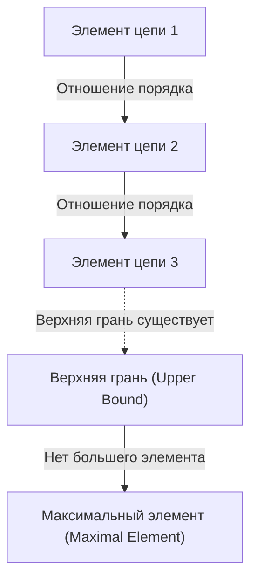
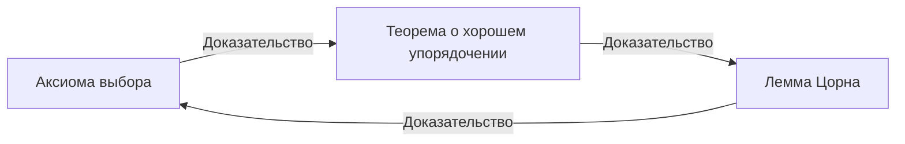

# [Аксиома выбора и лемма Цорна](https://kenji.blog/ru/p/axiom-of-choice-and-zorns-lemma/): понятие «выбора», потрясшее основы математики

В истории математики ни одна аксиома не вызывала столько споров и не стала столь необходимой для современной математики, как **аксиома выбора** (Axiom of Choice). В данной статье мы глубоко рассмотрим аксиому выбора и эквивалентное ей утверждение — **лемму Цорна** (Zorn's Lemma). Мы дадим исчерпывающее объяснение: от интуитивного понимания до строгой математической формулировки, исторического контекста и приложений в различных областях современной математики.

## 1. Что такое аксиома выбора? Интуиция и строгое определение

Аксиома выбора интуитивно утверждает нечто очень простое: «Если задано семейство (совокупность) множеств, не содержащее пустого множества, то можно выбрать по одному элементу из каждого множества и составить новое множество».

С бытовой точки зрения, если есть несколько коробок и в каждой лежит хотя бы один мяч, то выбрать по одному мячу из каждой коробки кажется совершенно естественным. Однако, когда число коробок становится бесконечным, эта «естественная операция» перестаёт быть математически очевидной.

### 1.1. Строгая математическая формулировка

В теории множеств Цермело–Френкеля (ZF), являющейся стандартной аксиоматической системой теории множеств, аксиома выбора (AC) формулируется следующим образом:

$$
\forall X \left( \emptyset \notin X \implies \exists f: X \to \bigcup X \quad \text{т.ч.} \quad \forall A \in X, f(A) \in A \right)
$$

Здесь функция $f$ называется **функцией выбора** (choice function). Иными словами, утверждается, что существует функция, которая каждому непустому множеству $A$, принадлежащему семейству $X$, ставит в соответствие элемент $f(A) \in A$.

### 1.2. Различие между конечным и бесконечным: пример носков Рассела

При выборе элементов из конечного числа множеств аксиома выбора не нужна: в рамках обычной логики можно выбирать элементы один за другим по порядку. Однако при одновременном выборе по одному элементу из бесконечного числа множеств без «правила», однозначно определяющего способ выбора, построить функцию выбора невозможно.

Британский философ и математик Бертран Рассел предложил знаменитую аналогию для объяснения этой ситуации:

> «Чтобы выбрать по одному ботинку из бесконечного числа пар ботинок, аксиома выбора не нужна, поскольку существует чёткое правило: "всегда выбирай левый ботинок". Однако, чтобы выбрать по одному носку из бесконечного числа пар носков, аксиома выбора необходима, так как у носков нет различия между левым и правым, и поэтому нельзя явно задать правило выбора».

Эта аналогия превосходно иллюстрирует, почему при невозможности «конструктивного построения» в бесконечном выборе необходимо постулировать существование функции выбора как «аксиому».

## 2. Лемма Цорна: мощный эквивалент аксиомы выбора

В современной абстрактной математике использование **леммы Цорна** (Zorn's Lemma) — теоремы, эквивалентной аксиоме выбора — зачастую делает доказательства значительно нагляднее по сравнению с прямым применением аксиомы выбора. Предложенная Максом Цорном в 1935 году, эта лемма стала стандартным инструментом в алгебре и теории топологических пространств.

### 2.1. Формулировка леммы Цорна

Лемма Цорна — это утверждение о частично упорядоченных множествах:

> **Лемма Цорна**
> Если в непустом частично упорядоченном множестве $(P, \le)$ каждое вполне упорядоченное подмножество (цепь) имеет верхнюю грань, то в $P$ существует хотя бы один максимальный элемент.

$$
\text{Если каждая цепь } C \subseteq P \text{ имеет верхнюю грань, то } P \text{ имеет максимальный элемент.}
$$

### 2.2. Определения терминов

Для понимания леммы Цорна уточним связанные понятия:

- **Частично упорядоченное множество** (Partially Ordered Set, Poset): множество, на элементах которого определено отношение порядка $\le$, но при этом не обязательно, чтобы каждая пара элементов была сравнима. Например, отношение включения множеств $\subseteq$ является частичным порядком.
- **Вполне упорядоченное подмножество / цепь** (Total Order / Chain): подмножество, в котором любые два элемента сравнимы.
- **Верхняя грань** (Upper Bound): элемент, который «больше или равен» всем элементам цепи. Сама верхняя грань не обязана принадлежать цепи.
- **Максимальный элемент** (Maximal Element): элемент множества $P$, для которого не существует «строго большего» элемента. В отличие от наибольшего элемента (большего всех остальных), максимальных элементов может быть несколько.

## 3. Сеть эквивалентностей: аксиома выбора, лемма Цорна и теорема о хорошем упорядочении

[Аксиома выбора и лемма Цорна](https://kenji.blog/ru/p/axiom-of-choice-and-zorns-lemma/) выглядят как совершенно различные утверждения, однако в рамках аксиоматики ZF они эквивалентны (если одно истинно, то и другое истинно). В сети доказательств этой эквивалентности важную роль играет **теорема о хорошем упорядочении** (Well-ordering theorem), доказанная Эрнстом Цермело.

### 3.1. Что такое теорема о хорошем упорядочении?

> **Теорема о хорошем упорядочении**
> Любое множество может быть вполне упорядочено. То есть для любого множества можно определить такое отношение полного порядка, при котором каждое его непустое подмножество имеет наименьший элемент.

Множество вещественных чисел $\mathbb{R}$ не является вполне упорядоченным относительно обычного порядка (например, открытый интервал $(0, 1)$ не имеет наименьшего элемента). Однако теорема о хорошем упорядочении утверждает, что множеству вещественных чисел также можно придать «некоторый» вполне упорядоченный порядок. Это крайне контринтуитивный результат.

### 3.2. Цикл доказательства эквивалентности

В аксиоматике ZF следующие три утверждения полностью эквивалентны:

1. Аксиома выбора (Axiom of Choice)
2. Теорема о хорошем упорядочении (Well-ordering Theorem)
3. Лемма Цорна (Zorn's Lemma)

В стандартных учебниках по математике эквивалентность доказывается в следующем порядке:

Доказательство того, что из леммы Цорна следует аксиома выбора, относительно несложно. Множество всех частичных построений функции выбора частично упорядочивается отношением включения, затем применяется лемма Цорна для нахождения максимального элемента, что и доказывает существование функции выбора, определённой на всей области.

## 4. Мощь приложений леммы Цорна в современной математике

Лемма Цорна — это мощный инструмент, гарантирующий существование «максимального» в абстрактной математике. Ниже подробно описаны характерные примеры приложений в различных областях.

### 4.1. Алгебра: каждое векторное пространство имеет базис
В линейной алгебре существование базиса конечномерного векторного пространства можно показать конструктивно. Однако для бесконечномерных векторных пространств, таких как пространство всех функций над полем вещественных чисел $\mathbb{R}$, существование базиса Гамеля (подмножества, позволяющего однозначно представить любой элемент в виде конечной линейной комбинации элементов базиса) неочевидно.

Схема доказательства: все линейно независимые подмножества векторного пространства $V$ упорядочиваются по включению $\subseteq$. Для любой цепи в этом частично упорядоченном множестве их объединение также линейно независимо (поскольку рассматриваются только конечные линейные комбинации). Следовательно, объединение является верхней гранью. По лемме Цорна существует максимальный элемент, и именно он является искомым базисом.

### 4.2. Теория колец: теорема Крулля
> В любом коммутативном кольце с единицей $1 \neq 0$ существует хотя бы один максимальный идеал.

Эта теорема (теорема Крулля) также является прямым приложением леммы Цорна. Все собственные идеалы (не содержащие 1) упорядочиваются по включению. Верхняя грань (объединение) любой цепи также является собственным идеалом, не содержащим 1, откуда следует существование максимального элемента (максимального идеала).

### 4.3. Топология: теорема Тихонова
> Произвольное прямое произведение компактных пространств компактно в топологии произведения.

Теорема Тихонова — одна из важнейших теорем топологии, лежащая в основе функционального анализа. Примечательно, что теорема Тихонова эквивалентна аксиоме выбора в аксиоматике ZF.

### 4.4. Функциональный анализ: теорема Хана–Банаха
Теорема Хана–Банаха гарантирует, что ограниченный линейный функционал, определённый на подпространстве, может быть продолжен на всё пространство без увеличения нормы (величины). Этот процесс продолжения требует бесконечного повторения шагов одномерного расширения, и для гарантии продолжения на всё пространство как предела этого процесса лемма Цорна незаменима.

## 5. Парадокс, порождаемый аксиомой выбора: теорема Банаха–Тарского

Аксиома выбора даёт математике огромную мощь, но одновременно порождает результаты, полностью разрушающие нашу интуицию о пространстве. Самый знаменитый пример — **парадокс Банаха–Тарского** (Banach-Tarski Paradox).

### 5.1. Суть парадокса

> Шар (заполненный) в трёхмерном евклидовом пространстве можно разбить на конечное число частей (например, 5 фрагментов). Перемещая эти части только с помощью поворотов и параллельных переносов (движений твёрдого тела) и собирая заново, можно получить **два** шара, каждый из которых имеет тот же размер, что и исходный.

$$
1 \text{ Сфера} \xrightarrow{\text{Разрезано на } 5 \text{ частей, Вращение \& Перенос}} 2 \text{ Сферы того же размера}
$$

### 5.2. Почему такое возможно?

Эта «магия получения двух шаров из одного» обусловлена тем, что с помощью аксиомы выбора можно создать «множества, не имеющие меры Лебега (чрезвычайно сложные и рассеянные множества, для которых невозможно определить объём)». Полученные при разбиении фрагменты — это не гладкие тела с ровными поверхностями разреза, а структуры, подобные бесконечному лабиринту из точек. Поскольку объём не определён, «закон сохранения объёма» не применяется, и в результате кажется, что объём удвоился.

## 6. Аксиоматика ZFC: де-факто стандарт современной математики

Из-за контринтуитивных результатов, подобных теореме Банаха–Тарского, в начале XX века многие математики, включая Анри Лебега и Эмиля Бореля, решительно выступали против аксиомы выбора (так называемый конструктивистский подход).

Тем не менее современная стандартная математика приняла **аксиоматику ZFC** (Zermelo-Fraenkel set theory with the axiom of Choice) — теорию множеств Цермело–Френкеля с аксиомой выбора — в качестве незыблемого фундамента.

$$
\text{ZFC} = \text{ZF} + \text{Аксиома выбора}
$$

### Почему ZFC была принята?

Причина проста и очевидна: при отказе от аксиомы выбора (при использовании только аксиоматики ZF) потери математических результатов оказываются чрезмерно велики. Базисы всех векторных пространств, компактность произведений топологических пространств, многие полезные свойства меры Лебега — всё это рушится. Даже ценой «парадокса Банаха–Тарского» аксиома выбора была принята ради сохранения богатой и прекрасной системы современной абстрактной математики.

## 7. Заключение: мост над бездной бесконечности

[Аксиома выбора и лемма Цорна](https://kenji.blog/ru/p/axiom-of-choice-and-zorns-lemma/) показывают, как операция «выбора», настолько очевидная в конечной области, что её даже не замечают, при вступлении в область бесконечности порождает удивительно глубокие, устрашающие и прекрасные структуры.

Лемма Цорна, как мощная волшебная палочка, гарантирующая существование «максимального» на краю бесконечных цепей, двигала вперёд развитие алгебры и анализа. В основе математических теорем, которыми мы повседневно пользуемся, не задумываясь, лежит глубокая философия, именуемая «аксиомой выбора». Основания математики — это не просто логическая головоломка, а грандиозная драма о том, как человеческий разум противостоит понятию бесконечности.
