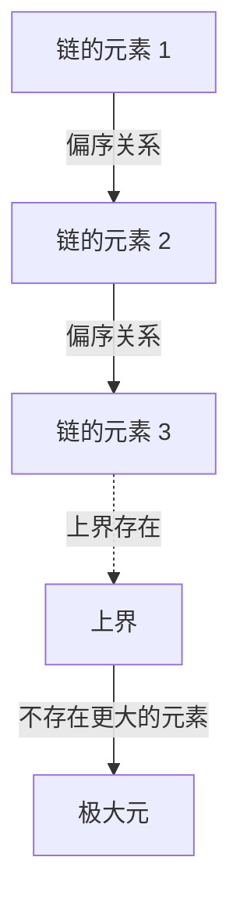
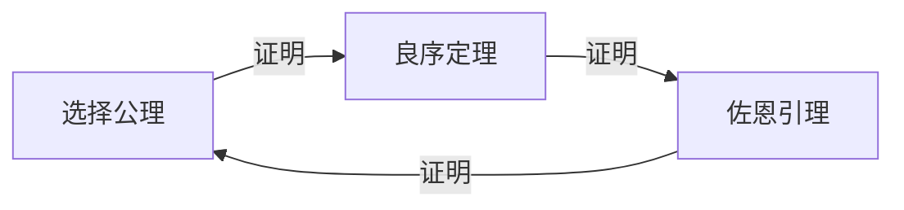

# 选择公理与佐恩引理：动摇数学基础的「选择」概念

在数学的历史上，没有任何一条公理像 **选择公理** （Axiom of Choice）那样引发了如此多的争议，同时又对现代数学变得如此不可或缺。本文将从基础出发，深入探讨选择公理及其等价命题 **佐恩引理** （Zorn's Lemma）。我们将全面介绍直观理解、严格的数学形式化、历史背景，以及在现代数学各个领域中的应用。

## 1. 选择公理是什么？直觉与严格定义

选择公理在直觉上提出了一个非常简单的主张："给定一个不包含空集的集合族（集合的集合），可以从每个集合中各选取一个元素，组成一个新的集合。"

在日常感觉中，如果有若干个箱子，每个箱子里至少有一个球，那么从每个箱子中各选一个球似乎是理所当然的。然而，当箱子的数量变为无穷时，这个「理所当然的操作」在数学上不再是显而易见的。

### 1.1. 严格的数学形式化

在集合论的标准公理体系——策梅洛-弗兰克尔集合论（ZF）中，选择公理（AC）被形式化如下：

$$
\forall X \left( \emptyset \notin X \implies \exists f: X \to \bigcup X \quad \text{使得} \quad \forall A \in X, f(A) \in A \right)
$$

其中，函数 $f$ 被称为 **选择函数** （choice function）。也就是说，它主张存在一个函数，能够为集合族 $X$ 中的每一个非空集合 $A$ 分配其中的一个元素 $f(A)$。

### 1.2. 有限与无限的区别：罗素的袜子比喻

当从有限个集合中选取元素时，选择公理是不需要的。因为在通常的逻辑框架中，可以逐一按顺序选取元素。然而，当需要同时从无穷个集合中各选一个元素时，如果没有一个唯一确定选择方式的「规则」，就无法构造选择函数。

英国哲学家、数学家伯特兰·罗素提出了一个著名的比喻来解释这种情况：

> "从无穷多双鞋中各选一只，不需要选择公理。因为有一条明确的规则：'总是选择左脚的鞋。'但是，从无穷多双袜子中各选一只，就需要选择公理了。因为袜子没有左右之分，所以无法明确给出选择的规则。"

这个比喻精彩地说明了，在无限选择中当「基于规则的构造」不可能时，为什么必须将选择函数的存在作为「公理」来要求。

## 2. 佐恩引理：选择公理的强力等价命题

在现代抽象数学中，比起直接应用选择公理，使用与其等价的定理 **佐恩引理** （Zorn's Lemma）能使证明变得更加清晰的情况比比皆是。这条引理由马克斯·佐恩于1935年提出，已成为代数学和拓扑学中的标准工具。

### 2.1. 佐恩引理的表述

佐恩引理是关于偏序集的如下主张：

> **佐恩引理**
> 在一个非空偏序集 $(P, \le)$ 中，如果其任意全序子集（链）都有上界，则 $P$ 至少有一个极大元。

$$
\text{如果每个链 } C \subseteq P \text{ 都有上界，那么 } P \text{ 至少有一个极大元。}
$$

### 2.2. 术语整理

让我们明确与理解佐恩引理相关的概念：

- **偏序集** （Partially Ordered Set, Poset）：元素之间定义了偏序关系 $\le$ 的集合，但不要求所有元素对都可比较。例如，集合的包含关系 $\subseteq$ 就是一种偏序。
- **全序集 / 链** （Total Order / Chain）：子集中任意两个元素都可比较的情况。
- **上界** （Upper Bound）：对于链中的所有元素，「大于或等于」它们的元素。上界本身不必包含在链中。
- **极大元** （Maximal Element）：集合 $P$ 中不存在「严格大于」它的元素的元素。与最大元（大于所有元素）不同，极大元可以有多个。

## 3. 等价性网络：选择公理、佐恩引理、良序定理

选择公理和佐恩引理看似完全不同的主张，但在 ZF 公理体系下是互相等价的（一个为真则另一个也为真）。在这个等价性证明的网络中，恩斯特·策梅洛证明的 **良序定理** （Well-ordering theorem）发挥着关键作用。

### 3.1. 什么是良序定理？

> **良序定理**
> 任意集合都可以被良序化。即对于任意集合，可以定义一个全序关系，使得每个非空子集都有最小元。

实数集 $\mathbb{R}$ 在通常的大小关系下并未被良序化（例如，开区间 $(0, 1)$ 没有最小元）。但良序定理断言，即使是实数集也可以赋予「某种」良序。这是一个非常反直觉的结果。

### 3.2. 等价性证明的循环

在 ZF 公理体系中，以下三个命题是完全等价的：

1. 选择公理 (Axiom of Choice)
2. 良序定理 (Well-ordering Theorem)
3. 佐恩引理 (Zorn's Lemma)

在标准数学教科书中，按照以下顺序证明等价性：

从佐恩引理推导选择公理的证明比较简单。将选择函数的所有部分构造的集合以包含关系作为偏序集，应用佐恩引理找到极大元，从而证明具有完整定义域的选择函数的存在。

## 4. 佐恩引理在现代数学中的巨大应用力

佐恩引理是在抽象数学中保证「极大对象」存在的强大工具。以下详细介绍各领域的代表性应用。

### 4.1. 代数学：每个向量空间都有基
在线性代数中，有限维向量空间具有基可以构造性地证明。但是，对于像实数域 $\mathbb{R}$ 上所有函数构成的空间这样的无限维向量空间，哈默尔基（使任意元素都能唯一表示为有限个基元素的线性组合的子集）是否存在并不显然。

证明概要：将向量空间 $V$ 的所有线性无关子集按包含关系 $\subseteq$ 排序。取这个偏序集的任意链，可以确认其并集也是线性无关的（因为只考虑有限个线性组合）。因此，并集构成上界。由佐恩引理可知极大元存在，而这个极大元正是所求的基。

### 4.2. 环论：克鲁尔定理
> 任何具有单位元 $1 \neq 0$ 的交换环中，至少存在一个极大理想。

这个定理（克鲁尔定理）也是佐恩引理的直接应用。将所有不包含 1 的（真）理想按包含关系排序。任意链的上界（并集）也是不包含 1 的理想，因此可以推导出极大元（极大理想）的存在。

### 4.3. 拓扑学：吉洪诺夫定理
> 紧致空间的任意乘积空间关于乘积拓扑是紧致的。

吉洪诺夫定理是拓扑学中最重要的定理之一，支撑着泛函分析的基础。有趣的是，已经证明吉洪诺夫定理在 ZF 公理体系中与选择公理等价。

### 4.4. 泛函分析：哈恩-巴拿赫定理
哈恩-巴拿赫定理保证，在子空间上定义的有界线性泛函可以在不增大其范数（大小）的情况下扩张到整个空间。这个扩张过程需要将逐维扩张的步骤无限次重复，而佐恩引理对于保证作为这个过程极限的整体扩张是不可或缺的。

## 5. 选择公理带来的悖论：巴拿赫-塔斯基定理

选择公理在为数学带来巨大力量的同时，也导致了完全颠覆我们空间直觉的结果。其中最著名的例子就是 **巴拿赫-塔斯基悖论** （Banach-Tarski Paradox）。

### 5.1. 悖论的内容

> 将三维[欧几里得](https://kenji.blog/zh-cn/p/euclid/)空间中的一个球体（实心球）分割成有限个部分（例如5个碎片）。仅通过旋转和平移（刚体运动）重新排列这些部分并重新组装，就可以制造出与原来完全相同大小的球体 **2个** 。

$$
1 \text{ 球体} \xrightarrow{\text{切分成 } 5 \text{ 块，旋转 \& 平移}} 2 \text{ 同等大小的球体}
$$

### 5.2. 为什么会发生这样的事？

这种「从一个球变出两个球的魔法」，源于利用选择公理可以创造出「不具有勒贝格测度的集合（无法定义体积的极其复杂且分散的集合）」。被分割的碎片并不是我们所想象的具有光滑截面的立体，而是具有类似点的无限迷宫般的结构。由于无法定义体积，「体积守恒定律」不再适用，结果看起来就像体积翻了一倍。

## 6. ZFC 公理系统：现代数学的事实标准

由于会导致像巴拿赫-塔斯基定理这样反直觉的结果，20世纪初，以亨利·勒贝格和埃米尔·博雷尔为首的许多数学家强烈反对选择公理（即所谓的构造主义方法）。

然而，现代标准数学已将策梅洛-弗兰克尔集合论加上选择公理的 **ZFC 公理系统** （Zermelo-Fraenkel set theory with the axiom of Choice）作为坚实的基础。

$$
\text{ZFC} = \text{ZF} + \text{选择公理}
$$

### 为什么 ZFC 被接受了？

原因很简单。如果拒绝选择公理（只采用 ZF 公理体系），失去的数学成果太过巨大。所有向量空间的基、拓扑空间紧致性的乘积、勒贝格测度的许多有用性质等都将崩塌。即使付出巴拿赫-塔斯基悖论这样的「代价」，为了维护现代丰富而美丽的抽象数学体系，选择公理还是被接受了。

## 7. 结论：架在无穷深渊上的桥

选择公理和佐恩引理展示了，在有限领域中理所当然到不被意识到的「选择」这一操作，一旦踏入无穷的领域，就会产生多么深邃、可怕而又美丽的结构。

佐恩引理作为保证无限链尽头「极大」存在的强力魔杖，推动了代数学和分析学的发展。在我们日常不经意间使用的数学定理的根基之下，横亘着这种名为「选择公理」的深奥哲学。数学基础论不仅仅是逻辑的拼图，更是人类理性如何面对无穷这一概念的壮丽戏剧。
