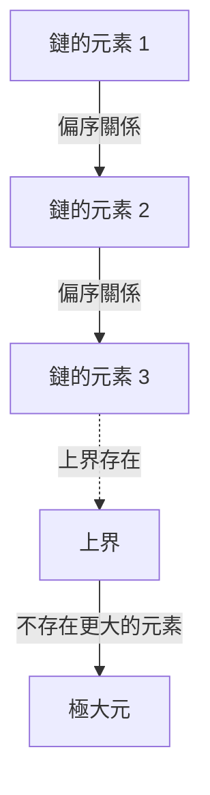
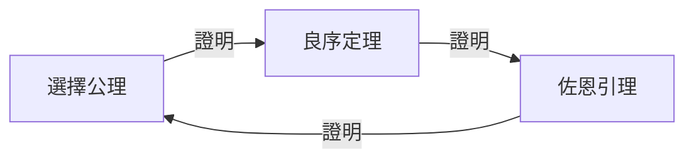

# 選擇公理與佐恩引理：撼動數學基礎的「選擇」概念

在數學的歷史上，沒有任何一條公理像 **選擇公理** （Axiom of Choice）那樣引發了如此多的爭議，同時又對現代數學變得如此不可或缺。本文將從基礎出發，深入探討選擇公理及其等價命題 **佐恩引理** （Zorn's Lemma）。我們將全面介紹直觀理解、嚴格的數學形式化、歷史背景，以及在現代數學各個領域中的應用。

## 1. 選擇公理是什麼？直覺與嚴格定義

選擇公理在直覺上提出了一個非常簡單的主張：「給定一個不包含空集的集合族（集合的集合），可以從每個集合中各選取一個元素，組成一個新的集合。」

在日常感覺中，如果有若干個箱子，每個箱子裡至少有一個球，那麼從每個箱子中各選一個球似乎是理所當然的。然而，當箱子的數量變為無窮時，這個「理所當然的操作」在數學上不再是顯而易見的。

### 1.1. 嚴格的數學形式化

在集合論的標準公理體系——策梅洛-弗蘭克爾集合論（ZF）中，選擇公理（AC）被形式化如下：

$$
\forall X \left( \emptyset \notin X \implies \exists f: X \to \bigcup X \quad \text{使得} \quad \forall A \in X, f(A) \in A \right)
$$

其中，函數 $f$ 被稱為 **選擇函數** （choice function）。也就是說，它主張存在一個函數，能夠為集合族 $X$ 中的每一個非空集合 $A$ 分配其中的一個元素 $f(A)$。

### 1.2. 有限與無限的區別：羅素的襪子比喻

當從有限個集合中選取元素時，選擇公理是不需要的。因為在通常的邏輯框架中，可以逐一按順序選取元素。然而，當需要同時從無窮個集合中各選一個元素時，如果沒有一個唯一確定選擇方式的「規則」，就無法構造選擇函數。

英國哲學家、數學家伯特蘭·羅素提出了一個著名的比喻來解釋這種情況：

> 「從無窮多雙鞋中各選一隻，不需要選擇公理。因為有一條明確的規則：『總是選擇左腳的鞋。』但是，從無窮多雙襪子中各選一隻，就需要選擇公理了。因為襪子沒有左右之分，所以無法明確給出選擇的規則。」

這個比喻精彩地說明了，在無限選擇中當「基於規則的構造」不可能時，為什麼必須將選擇函數的存在作為「公理」來要求。

## 2. 佐恩引理：選擇公理的強力等價命題

在現代抽象數學中，比起直接應用選擇公理，使用與其等價的定理 **佐恩引理** （Zorn's Lemma）能使證明變得更加清晰的情況比比皆是。這條引理由馬克斯·佐恩於1935年提出，已成為代數學和拓撲學中的標準工具。

### 2.1. 佐恩引理的表述

佐恩引理是關於偏序集的如下主張：

> **佐恩引理**
> 在一個非空偏序集 $(P, \le)$ 中，如果其任意全序子集（鏈）都有上界，則 $P$ 至少有一個極大元。

$$
\text{如果每個鏈 } C \subseteq P \text{ 都有上界，那麼 } P \text{ 至少有一個極大元。}
$$

### 2.2. 術語整理

讓我們明確與理解佐恩引理相關的概念：

- **偏序集** （Partially Ordered Set, Poset）：元素之間定義了偏序關係 $\le$ 的集合，但不要求所有元素對都可比較。例如，集合的包含關係 $\subseteq$ 就是一種偏序。
- **全序集 / 鏈** （Total Order / Chain）：子集中任意兩個元素都可比較的情況。
- **上界** （Upper Bound）：對於鏈中的所有元素，「大於或等於」它們的元素。上界本身不必包含在鏈中。
- **極大元** （Maximal Element）：集合 $P$ 中不存在「嚴格大於」它的元素的元素。與最大元（大於所有元素）不同，極大元可以有多個。

## 3. 等價性網絡：選擇公理、佐恩引理、良序定理

選擇公理和佐恩引理看似完全不同的主張，但在 ZF 公理體系下是互相等價的（一個為真則另一個也為真）。在這個等價性證明的網絡中，恩斯特·策梅洛證明的 **良序定理** （Well-ordering theorem）發揮著關鍵作用。

### 3.1. 什麼是良序定理？

> **良序定理**
> 任意集合都可以被良序化。即對於任意集合，可以定義一個全序關係，使得每個非空子集都有最小元。

實數集 $\mathbb{R}$ 在通常的大小關係下並未被良序化（例如，開區間 $(0, 1)$ 沒有最小元）。但良序定理斷言，即使是實數集也可以賦予「某種」良序。這是一個非常反直覺的結果。

### 3.2. 等價性證明的循環

在 ZF 公理體系中，以下三個命題是完全等價的：

1. 選擇公理 (Axiom of Choice)
2. 良序定理 (Well-ordering Theorem)
3. 佐恩引理 (Zorn's Lemma)

在標準數學教科書中，按照以下順序證明等價性：

從佐恩引理推導選擇公理的證明比較簡單。將選擇函數的所有部分構造的集合以包含關係作為偏序集，應用佐恩引理找到極大元，從而證明具有完整定義域的選擇函數的存在。

## 4. 佐恩引理在現代數學中的巨大應用力

佐恩引理是在抽象數學中保證「極大對象」存在的強大工具。以下詳細介紹各領域的代表性應用。

### 4.1. 代數學：每個向量空間都有基
在線性代數中，有限維向量空間具有基可以構造性地證明。但是，對於像實數域 $\mathbb{R}$ 上所有函數構成的空間這樣的無限維向量空間，哈默爾基（使任意元素都能唯一表示為有限個基元素的線性組合的子集）是否存在並不顯然。

證明概要：將向量空間 $V$ 的所有線性無關子集按包含關係 $\subseteq$ 排序。取這個偏序集的任意鏈，可以確認其並集也是線性無關的（因為只考慮有限個線性組合）。因此，並集構成上界。由佐恩引理可知極大元存在，而這個極大元正是所求的基。

### 4.2. 環論：克魯爾定理
> 任何具有單位元 $1 \neq 0$ 的交換環中，至少存在一個極大理想。

這個定理（克魯爾定理）也是佐恩引理的直接應用。將所有不包含 1 的（真）理想按包含關係排序。任意鏈的上界（並集）也是不包含 1 的理想，因此可以推導出極大元（極大理想）的存在。

### 4.3. 拓撲學：吉洪諾夫定理
> 緊緻空間的任意乘積空間關於乘積拓撲是緊緻的。

吉洪諾夫定理是拓撲學中最重要的定理之一，支撐著泛函分析的基礎。有趣的是，已經證明吉洪諾夫定理在 ZF 公理體系中與選擇公理等價。

### 4.4. 泛函分析：哈恩-巴拿赫定理
哈恩-巴拿赫定理保證，在子空間上定義的有界線性泛函可以在不增大其範數（大小）的情況下擴張到整個空間。這個擴張過程需要將逐維擴張的步驟無限次重複，而佐恩引理對於保證作為這個過程極限的整體擴張是不可或缺的。

## 5. 選擇公理帶來的悖論：巴拿赫-塔斯基定理

選擇公理在為數學帶來巨大力量的同時，也導致了完全顛覆我們空間直覺的結果。其中最著名的例子就是 **巴拿赫-塔斯基悖論** （Banach-Tarski Paradox）。

### 5.1. 悖論的內容

> 將三維[歐幾里得](https://kenji.blog/zh-tw/p/euclid/)空間中的一個球體（實心球）分割成有限個部分（例如5個碎片）。僅通過旋轉和平移（剛體運動）重新排列這些部分並重新組裝，就可以製造出與原來完全相同大小的球體 **2個** 。

$$
1 \text{ 球體} \xrightarrow{\text{切分成 } 5 \text{ 塊，旋轉 \& 平移}} 2 \text{ 同等大小的球體}
$$

### 5.2. 為什麼會發生這樣的事？

這種「從一個球變出兩個球的魔法」，源於利用選擇公理可以創造出「不具有勒貝格測度的集合（無法定義體積的極其複雜且分散的集合）」。被分割的碎片並不是我們所想像的具有光滑截面的立體，而是具有類似點的無限迷宮般的結構。由於無法定義體積，「體積守恆定律」不再適用，結果看起來就像體積翻了一倍。

## 6. ZFC 公理系統：現代數學的事實標準

由於會導致像巴拿赫-塔斯基定理這樣反直覺的結果，20世紀初，以亨利·勒貝格和埃米爾·博雷爾為首的許多數學家強烈反對選擇公理（即所謂的構造主義方法）。

然而，現代標準數學已將策梅洛-弗蘭克爾集合論加上選擇公理的 **ZFC 公理系統** （Zermelo-Fraenkel set theory with the axiom of Choice）作為堅實的基礎。

$$
\text{ZFC} = \text{ZF} + \text{選擇公理}
$$

### 為什麼 ZFC 被接受了？

原因很簡單。如果拒絕選擇公理（只採用 ZF 公理體系），失去的數學成果太過巨大。所有向量空間的基、拓撲空間緊緻性的乘積、勒貝格測度的許多有用性質等都將崩塌。即使付出巴拿赫-塔斯基悖論這樣的「代價」，為了維護現代豐富而美麗的抽象數學體系，選擇公理還是被接受了。

## 7. 結論：架在無窮深淵上的橋

選擇公理和佐恩引理展示了，在有限領域中理所當然到不被意識到的「選擇」這一操作，一旦踏入無窮的領域，就會產生多麼深邃、可怕而又美麗的結構。

佐恩引理作為保證無限鏈盡頭「極大」存在的強力魔杖，推動了代數學和分析學的發展。在我們日常不經意間使用的數學定理的根基之下，橫亙著這種名為「選擇公理」的深奧哲學。數學基礎論不僅僅是邏輯的拼圖，更是人類理性如何面對無窮這一概念的壯麗戲劇。
