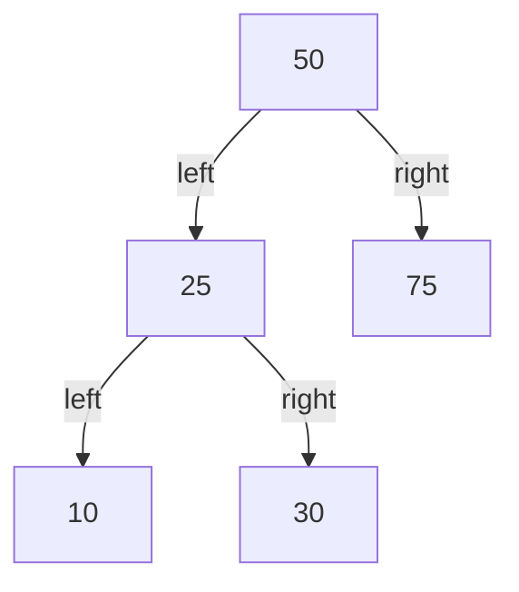
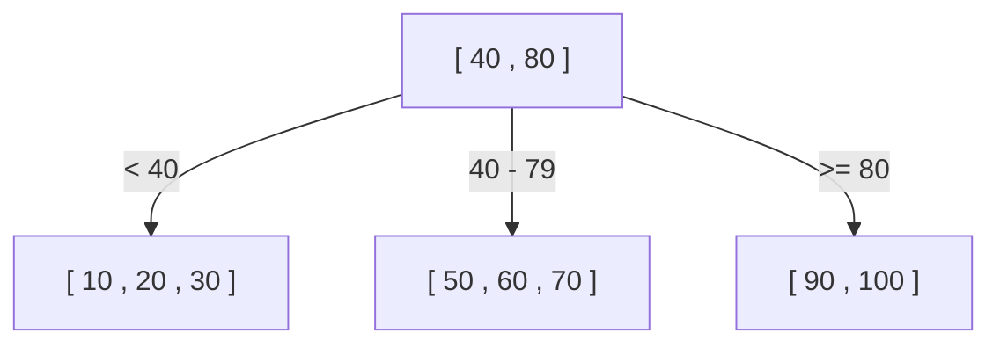
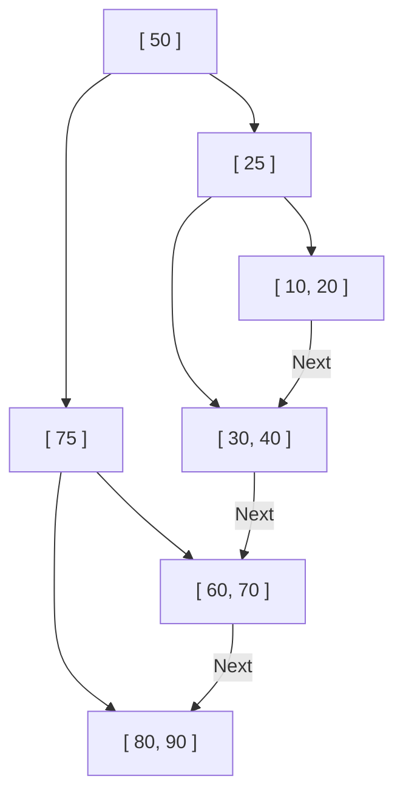

لماذا تستطيع قواعد البيانات العثور على البيانات المطلوبة في جزء من الثانية من بين عشرات أو مئات الملايين من السجلات؟ يكمن وراء ذلك آلية تُعرف باسم "الفهرس" (Index)، وهياكل البيانات الأساسية التي تدعم هذا الفهرس هي **أشجار B (B-Tree)** و **أشجار B+ (B+Tree)**.

في هذا المقال، بدءًا من شجرة البحث الثنائية البسيطة، سنتعمق في شرح عملية التطور والبنية الداخلية التي أدت إلى تبني قواعد البيانات العلائقية (RDB) لأشجار B+.

## 1. حدود شجرة البحث الثنائية (BST)

كهيكل بيانات لتسريع البحث عن البيانات، قد يتبادر إلى الذهن أولاً "شجرة البحث الثنائية (Binary Search Tree: BST)". تتميز شجرة البحث الثنائية بأن كل عقدة (Node) تحتوي على طفلين كحد أقصى، ويكون الطفل الأيسر أصغر من الأب، والطفل الأيمن أكبر من الأب. في الحالة المثالية، يكون التعقيد الزمني للبحث هو $O(\log N)$، مما يجعلها سريعة جداً.

ومع ذلك، فإن تبني شجرة البحث الثنائية كما هي كفهرس لقاعدة البيانات يواجه مشكلة قاتلة.

### انهيار توازن الشجرة
إذا استمر إدراج البيانات في حالة مرتبة، فإن شجرة البحث الثنائية تصبح مثل قائمة متصلة (Linked List) بخط مستقيم، وتتدهور كفاءة البحث إلى $O(N)$. لمنع ذلك، توجد "أشجار البحث الثنائية المتوازنة" مثل شجرة AVL أو شجرة الأحمر والأسود (Red-Black Tree)، والتي تقوم بتعديل التوازن تلقائياً للحفاظ على ارتفاع الشجرة عند $\log N$.

### حاجز عمليات الإدخال والإخراج للقرص (Disk I/O)
يتمثل التحدي الأكبر في **عمليات الإدخال والإخراج للقرص (Disk I/O)**. في حين أن العمليات في الذاكرة (Memory) تكون سريعة بما يكفي باستخدام أشجار البحث الثنائية المتوازنة، إلا أن فهارس قواعد البيانات تُحفظ عادةً على الأقراص (مثل HDD أو SSD).
تعتبر عملية قراءة البيانات من القرص بطيئة للغاية مقارنة بعمليات وحدة المعالجة المركزية (CPU) أو الوصول إلى الذاكرة. علاوة على ذلك، لا يقرأ القرص البيانات بايتًا ببايت، بل **يقرأ ويكتب بوحدات مجمعة تسمى "الكتل" (Blocks) أو "الصفحات" (Pages) (مثل 4 كيلوبايت أو 8 كيلوبايت)**.

في شجرة البحث الثنائية، تكون كمية البيانات التي تحتويها عقدة واحدة صغيرة، ويميل "ارتفاع (عمق)" الشجرة إلى أن يكون كبيراً. عمق الشجرة يعني أنه للوصول من الجذر إلى عقدة الورقة (Leaf Node) المطلوبة، يجب تتبع العديد من العقد، وإذا كان يجب قراءة صفحة قرص مختلفة لكل عقدة، فسيؤدي ذلك إلى كمية هائلة من عمليات الإدخال والإخراج للقرص (Disk I/O)، مما يؤدي إلى انخفاض ملحوظ في الأداء.

## 2. شجرة B (B-Tree): تقليل الارتفاع وتقليل عمليات الإدخال والإخراج (I/O) إلى الحد الأدنى

النهج المتبع لتقليل عدد مرات الإدخال والإخراج للقرص واضح: وهو "**جعل ارتفاع الشجرة منخفضاً (ضحلاً) قدر الإمكان**". ولتحقيق ذلك، يجب السماح للعقدة الواحدة بامتلاك أكثر من طفلين، بل الكثير من العقد الأبناء (من العشرات إلى المئات).
هذه هي الفكرة الأساسية وراء **شجرة B (B-Tree)**.

تُعد شجرة B نوعاً من "الأشجار المتعددة الفروع" (M-ary Tree)، وتتميز بالخصائص التالية:
- تخزين مفاتيح (بيانات) متعددة في عقدة واحدة.
- مطابقة حجم العقدة مع حجم صفحة القرص (مثال: 4 كيلوبايت أو 8 كيلوبايت)، بحيث يمكن قراءة العديد من المفاتيح في الذاكرة دفعة واحدة من خلال عملية إدخال وإخراج (I/O) واحدة.
- الحفاظ دائمًا على توازن كامل (جميع العقد الورقية تكون على نفس العمق).

### خوارزمية البحث في شجرة B
1. قراءة العقدة الجذرية من القرص.
2. مسح مصفوفة المفاتيح داخل العقدة (أو إجراء بحث ثنائي) للعثور على المؤشر إلى العقدة الفرعية التي تحتوي على القيمة المطلوبة.
3. قراءة العقدة الفرعية التي يشير إليها المؤشر من القرص، وتكرار نفس الخطوات.
4. عند العثور على المفتاح المطلوب، يتم استرجاع البيانات المرتبطة به (أو المؤشر إلى البيانات الفعلية على القرص).

على سبيل المثال، افترض أن هناك شجرة B يمكن لعقدة واحدة فيها أن تحتوي على 100 مفتاح.
حتى شجرة B ذات ارتفاع 3 (الجذر، الوسط، الأوراق) يمكنها تخزين $100 \times 100 \times 100 = 1,000,000$ (مليون) سجل. بعبارة أخرى، للبحث عن سجل واحد مطلوب من بين مليون سجل، يتطلب الأمر **كحد أقصى 3 عمليات إدخال وإخراج للقرص**. وبالمقارنة مع شجرة البحث الثنائية حيث سيكون الارتفاع حوالي 20، مما يؤدي إلى 20 عملية إدخال وإخراج، فهذا تحسن هائل.

## 3. شجرة B+ (B+Tree): التطور النهائي في قواعد البيانات العلائقية (RDB)

على الرغم من أن شجرة B هي هيكل بيانات ممتاز للغاية، إلا أن قواعد البيانات العلائقية الحديثة مثل MySQL (InnoDB) و PostgreSQL تعتمد على مشتق من شجرة B وهو **شجرة B+ (B+Tree)** كفهرس لها.

لماذا شجرة B+ وليس شجرة B؟ السبب يكمن في الكفاءة الهائلة لـ "البحث في النطاق (Range Query)" و "الوصول التسلسلي (Sequential Access)".

### الفرق بين شجرة B وشجرة B+
تُضيف شجرة B+ التعديلات المهمة التالية على شجرة B:

1. **يتم تخزين جميع البيانات فقط في العقد الورقية (Leaf Nodes)**
   - في شجرة B، كانت البيانات الفعلية (أو المؤشرات إلى البيانات الفعلية) تُخزن في العقد الجذرية والعقد المتوسطة أيضًا.
   - في شجرة B+، تمتلك العقد الجذرية والمتوسطة **"علامات إرشادية (مفاتيح الفهرس)" فقط**، ولا تحتوي على أية بيانات فعلية. توضع جميع البيانات الفعلية في العقد الورقية في المستوى الأدنى.

2. **العقد الورقية متصلة ببعضها البعض بواسطة قائمة متصلة ثنائية الاتجاه (Doubly Linked List)**
   - تمتلك العقد الورقية المتجاورة مؤشرات إلى بعضها البعض، مما يسمح بتتبع البيانات أفقياً بشكل مستمر.

### لماذا تعتبر شجرة B+ مثالية لقواعد البيانات العلائقية (RDB)

#### 1. زيادة عدد المفاتيح لكل عقدة (التفرع - Fanout)
نظراً لأن العقد الجذرية والمتوسطة لا تحتوي على بيانات فعلية، يمكن زيادة عدد "المفاتيح والمؤشرات" التي يمكن تخزينها في عقدة واحدة بشكل كبير. على سبيل المثال، بافتراض أن حجم الصفحة هو نفسه 4 كيلوبايت، فإن شجرة B قد تتسع لـ 50 مفتاحاً فقط لكل عقدة لأنها تتضمن البيانات أيضًا، بينما يمكن لشجرة B+ أن تتسع لـ 500 مفتاح لأنها تحتوي على المفاتيح فقط.
وهذا يجعل ارتفاع الشجرة أقل، مما يقلل من عمليات الإدخال والإخراج للقرص (Disk I/O).

#### 2. تسريع البحث في النطاق (Range Query) بشكل كبير
في قواعد البيانات، يتم إجراء عمليات بحث في النطاق بشكل متكرر، مثل `SELECT * FROM users WHERE age BETWEEN 20 AND 30;`.
عند القيام بذلك باستخدام شجرة B، يجب التنقل (Traverse) عبر الشجرة ذهابًا وإيابًا عدة مرات للعثور على البيانات التي تتطابق مع الشروط، مما يؤدي إلى عمليات إدخال وإخراج غير ضرورية.
من ناحية أخرى، في حالة شجرة B+:
1. أولاً، تنتقل من أعلى الشجرة إلى أسفلها للعثور على نقطة البداية، وهي العقدة الورقية حيث `age = 20`.
2. بعد ذلك، تقوم ببساطة بقراءة "القائمة المتصلة" التي تربط العقد الورقية ببعضها البعض في اتجاه أفقي (تسلسلي) حتى تنتهي الشروط (`age <= 30`).
نظراً لأن الوصول التسلسلي (القراءة المتتالية) للقرص سريع للغاية، فإن هذه الخاصية تخلق ميزة هائلة من منظور عمليات الإدخال والإخراج للقرص.

## 4. خوارزميات تقسيم العقد (Split) والإدراج والحذف

يجب أن يحافظ الفهرس دائمًا على توازنه في كل مرة يتم فيها إضافة أو حذف بيانات. تمتلك شجرة B+ خوارزمية للحفاظ على هذا التوازن تلقائياً.

### الإدراج والتقسيم (Split)
عند إدراج مفتاح جديد، يتم أولاً العثور على العقدة الورقية المستهدفة باستخدام نفس خطوات البحث، ثم يتم إضافة المفتاح إليها.
إذا كانت تلك العقدة ممتلئة بالفعل (وصلت إلى الحد الأقصى)، يحدث **تقسيم للعقدة (Split)**.
1. يتم تقسيم مفاتيح العقدة الممتلئة إلى نصفين، لإنشاء عقدتين جديدتين (أو العقدة الأصلية وعقدة جديدة أخرى).
2. يتم **رفع (Promote)** المفتاح الأوسط من الانقسام إلى العقدة الأب.
3. إذا كانت العقدة الأب ممتلئة أيضاً، يتم تقسيمها، وتنتشر سلسلة الانقسامات للأعلى إلى العقدة الأب التالية.
4. في النهاية، إذا وصل الانقسام إلى العقدة الجذرية، يتم إنشاء عقدة جذرية جديدة، وهنا لأول مرة **يزداد ارتفاع الشجرة بمقدار مستوى واحد**.

من خلال عملية البناء من أسفل إلى أعلى (Bottom-up) هذه، تحافظ شجرة B+ دائمًا على "توازن كامل" حيث تكون المسافة (العمق) إلى العقد الورقية متطابقة تماماً.

## 5. الخلاصة

إن قدرة قواعد البيانات على تحقيق بحث سريع تعود بفضل **شجرة B+**، التي صُممت لتقليل عنق الزجاجة المادي المتمثل في عمليات الإدخال والإخراج للقرص (Disk I/O) إلى الحد الأدنى من خلال فهمه بعمق.
- تقليل "ارتفاع" الشجرة إلى أقصى حد ممكن للوصول إلى البيانات بأقل عدد من القراءات.
- تركيز البيانات في العقد الورقية لزيادة كثافة عقد الفهرس.
- ربط العقد الورقية بقائمة متصلة لتمكين الوصول التسلسلي للقرص عند إجراء عمليات البحث في النطاق.

السبب الأكبر الذي جعل شجرة B+ تتربع على عرش قواعد البيانات لعقود من الزمن ليس فقط بسبب "التعقيد الزمني للخوارزمية"، بل لأنها مُحسّنة لـ "خصائص الأجهزة (وصول الصفحات على القرص)".
