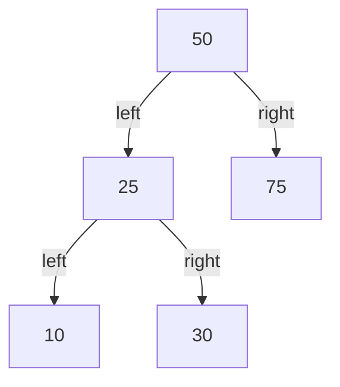
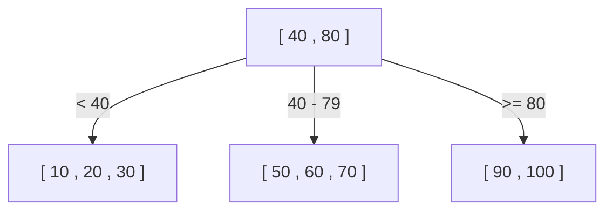
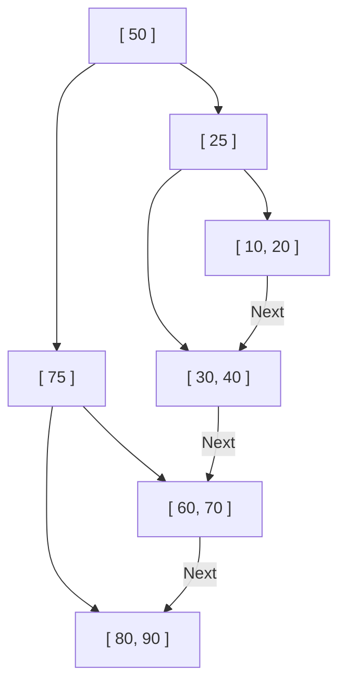

Warum können Datenbanken aus Millionen oder gar Milliarden von Datensätzen in einem Bruchteil einer Sekunde die gewünschten Daten finden? Dahinter verbirgt sich ein Mechanismus namens „Index“, und die zentrale Datenstruktur, die diesen Index unterstützt, ist der **B-Baum (B-Tree)** und der **B+-Baum (B+Tree)**.

In diesem Artikel werden wir ausgehend von einem einfachen binären Suchbaum tief in den Evolutionsprozess und die interne Struktur eintauchen und erklären, warum relationale Datenbanken (RDBs) letztendlich den B+-Baum übernommen haben.

## 1. Die Grenzen von binären Suchbäumen (BST)

Wenn es um Datenstrukturen zur Beschleunigung der Datensuche geht, fällt einem vielleicht zuerst der „binäre Suchbaum (Binary Search Tree: BST)“ ein. Ein binärer Suchbaum hat die Eigenschaft, dass jeder Knoten maximal zwei Kinder hat, wobei das linke Kind kleiner als das Elternteil und das rechte Kind größer als das Elternteil ist. Im Idealfall beträgt die Suchkomplexität $O(\log N)$, was extrem schnell ist.

Es gibt jedoch ein fatales Problem, wenn man versucht, einen binären Suchbaum unverändert als Datenbankindex zu verwenden.

### Ungleichgewicht des Baums
Wenn Daten kontinuierlich in sortiertem Zustand eingefügt werden, wird der binäre Suchbaum wie eine gerade verkettete Liste, und die Sucheffizienz verschlechtert sich auf $O(N)$. Um dies zu verhindern, gibt es „balancierte binäre Suchbäume“ wie AVL-Bäume oder Rot-Schwarz-Bäume, die das Gleichgewicht automatisch anpassen, um die Höhe des Baumes bei $\log N$ zu halten.

### Die Festplatten-I/O-Barriere
Das größte Problem liegt im **Festplatten-I/O (Eingabe/Ausgabe)**. Bei Operationen im Arbeitsspeicher sind balancierte binäre Suchbäume schnell genug, aber Datenbankindizes werden normalerweise auf Festplatten (HDD oder SSD) gespeichert.
Das Lesen von Daten von einer Festplatte ist ein überwältigend langsamer Prozess im Vergleich zu CPU-Berechnungen oder Speicherzugriffen. Darüber hinaus lesen und schreiben Festplatten Daten nicht Byte für Byte, sondern in **zusammenhängenden Einheiten, die als „Blöcke“ oder „Seiten“ bezeichnet werden (z. B. 4 KB oder 8 KB)**.

Bei binären Suchbäumen ist die Datenmenge in einem einzelnen Knoten klein, und die „Höhe (Tiefe)“ des Baumes neigt dazu, groß zu werden. Ein tiefer Baum bedeutet, dass viele Knoten durchlaufen werden müssen, um von der Wurzel zum gewünschten Blattknoten zu gelangen. Wenn für jeden Knoten eine andere Festplattenseite gelesen werden muss, kommt es zu enormem Festplatten-I/O, und die Leistung sinkt drastisch.

## 2. B-Baum (B-Tree): Höhe reduzieren und I/O minimieren

Der Ansatz zur Reduzierung der Anzahl der Festplatten-I/O-Vorgänge ist klar: **„Die Höhe des Baumes so gering (flach) wie möglich halten.“** Dazu ist es erforderlich, dass ein einzelner Knoten nicht nur zwei, sondern viel mehr Kindknoten (Dutzende bis Hunderte) haben kann.
Dies ist der Grundgedanke des **B-Baums (B-Tree)**.

Der B-Baum ist eine Art „Vielwegbaum“ und weist die folgenden Merkmale auf:
- Ein einzelner Knoten speichert mehrere Schlüssel (Daten).
- Durch Anpassung der Knotengröße an die Seitengröße der Festplatte (z. B. 4 KB oder 8 KB) können mit einem einzigen Festplatten-I/O-Vorgang viele Schlüssel auf einmal in den Speicher gelesen werden.
- Das vollständige Gleichgewicht wird immer aufrechterhalten (alle Blattknoten befinden sich auf derselben Tiefe).

### B-Baum-Suchalgorithmus
1. Den Wurzelknoten von der Festplatte lesen.
2. Das Schlüssel-Array innerhalb des Knotens scannen (oder eine binäre Suche durchführen), um den Zeiger auf den Kindknoten zu finden, der den gewünschten Wert enthält.
3. Den durch den Zeiger angegebenen Kindknoten von der Festplatte lesen und den gleichen Vorgang wiederholen.
4. Sobald der gewünschte Schlüssel gefunden wurde, die zugehörigen Daten (oder den Zeiger auf die tatsächlichen Daten auf der Festplatte) abrufen.

Angenommen, wir haben einen B-Baum, in dem ein einzelner Knoten 100 Schlüssel enthalten kann.
Selbst ein B-Baum mit der Höhe 3 (Wurzel, Mitte, Blatt) kann $100 \times 100 \times 100 = 1.000.000$ (1 Million) Datensätze speichern. Das bedeutet, dass die Suche nach einem bestimmten Datensatz unter 1 Million Datensätzen **höchstens 3 Festplatten-I/O-Vorgänge** erfordert. Verglichen mit einem binären Suchbaum, der eine Höhe von etwa 20 hätte und 20 I/O-Vorgänge verursachen würde, ist dies eine dramatische Verbesserung.

## 3. B+-Baum (B+Tree): Die ultimative Evolution in RDBs

Obwohl der B-Baum eine ausgezeichnete Datenstruktur ist, verwenden moderne relationale Datenbanken wie MySQL (InnoDB) und PostgreSQL den **B+-Baum (B+Tree)**, ein Derivat des B-Baums, als ihren Index.

Warum der B+-Baum anstelle des B-Baums? Der Grund liegt in der überwältigenden Effizienzsteigerung bei „Bereichsabfragen (Range Queries)“ und „sequentiellem Zugriff“.

### Unterschiede zwischen B-Baum und B+-Baum
Der B+-Baum nimmt die folgenden wichtigen Änderungen am B-Baum vor:

1. **Alle Daten werden nur in den Blattknoten (Leaf Nodes) gespeichert**
   - Im B-Baum speicherten auch die Wurzel- und Zwischenknoten tatsächliche Daten (oder Zeiger auf tatsächliche Daten).
   - Im B+-Baum enthalten die Wurzel- und Zwischenknoten **nur „Wegweiser (Indexschlüssel)“** und überhaupt keine tatsächlichen Daten. Alle tatsächlichen Daten werden in den untersten Blattknoten platziert.

2. **Blattknoten sind durch eine doppelt verkettete Liste miteinander verbunden**
   - Benachbarte Blattknoten haben Zeiger aufeinander, sodass man die Daten in horizontaler Richtung in einem Zug durchlaufen kann.

### Warum der B+-Baum optimal für RDBs ist

#### 1. Erhöhung der Anzahl der Schlüssel pro Knoten (Fan-out)
Da die Wurzel- und Zwischenknoten keine tatsächlichen Daten enthalten, kann die Anzahl der „Schlüssel und Zeiger“, die in einem einzigen Knoten gespeichert werden können, erheblich erhöht werden. Wenn beispielsweise die Seitengröße 4 KB beträgt, kann ein B-Baum-Knoten möglicherweise nur 50 Elemente aufnehmen, weil er auch Daten enthält, während ein B+-Baum-Knoten 500 Elemente aufnehmen kann, da er nur Schlüssel enthält.
Dadurch wird die Höhe des Baumes noch weiter reduziert, was den Festplatten-I/O verringert.

#### 2. Explosionsartige Beschleunigung von Bereichsabfragen (Range Queries)
In Datenbanken werden häufig Bereichsabfragen wie `SELECT * FROM users WHERE age BETWEEN 20 AND 30;` durchgeführt.
Wenn man dies mit einem B-Baum macht, muss man den Baum viele Male auf- und absteigen (traversieren), um die passenden Daten zu finden, was zu unnötigem I/O führt.
Andererseits ist beim B+-Baum:
1. Man durchläuft den Baum zuerst von oben nach unten, um den Start-Blattknoten bei `age = 20` zu finden.
2. Danach muss man nur noch die „verkettete Liste“, die die Blattknoten verbindet, horizontal (sequentiell) weiterlesen, bis die Bedingung (`age <= 30`) endet.
Da sequentielle Zugriffe (fortlaufendes Lesen) auf Festplatten extrem schnell sind, bietet diese Eigenschaft einen überwältigenden Vorteil in Bezug auf Festplatten-I/O.

## 4. Knotenspaltung (Split) sowie Einfüge- und Löschalgorithmen

Ein Index muss bei jedem Hinzufügen oder Löschen von Daten immer sein Gleichgewicht aufrechterhalten. Der B+-Baum verfügt über Algorithmen, um das Gleichgewicht automatisch zu wahren.

### Einfügen und Spaltung (Split)
Beim Einfügen eines neuen Schlüssels wird zunächst derselbe Vorgang wie bei der Suche verwendet, um den Ziel-Blattknoten zu finden, und der Schlüssel wird dort hinzugefügt.
Wenn dieser Knoten bereits voll ist (sein Limit erreicht hat), kommt es zu einer **Knotenspaltung (Split)**.
1. Die Schlüssel des vollen Knotens werden in zwei Hälften geteilt, was zu zwei neuen Knoten führt (oder dem ursprünglichen Knoten und einem neuen Knoten).
2. Der mittlere Schlüssel der Teilung wird in den **Elternknoten hochgezogen (promoted)**.
3. Wenn der Elternknoten ebenfalls voll ist, wird auch der Elternknoten gespalten, und diese Spaltung setzt sich kettenartig nach oben fort.
4. Erreicht die Spaltung schließlich den Wurzelknoten, wird ein neuer Wurzelknoten erstellt, und hier wird **die Höhe des Baumes zum ersten Mal um eine Ebene tiefer**.

Durch diesen Bottom-up-Konstruktionsprozess hält der B+-Baum stets ein „vollständiges Gleichgewicht“ aufrecht, bei dem der Abstand (die Tiefe) zu allen Blattknoten genau gleich ist.

## 5. Zusammenfassung

Dass Datenbanken Hochgeschwindigkeitssuchen durchführen können, ist dem **B+-Baum** zu verdanken, der mit einem tiefen Verständnis für den physischen Engpass des Festplatten-I/Os entwickelt wurde, um diesen zu minimieren.
- Die „Höhe“ des Baumes wird so weit wie möglich reduziert, um Daten mit weniger Lesevorgängen zu erreichen.
- Die Daten werden in den Blattknoten konzentriert, wodurch die Dichte der Indexknoten erhöht wird.
- Die Blattknoten sind durch eine verkettete Liste verbunden, was sequentielle Festplattenzugriffe bei Bereichsabfragen ermöglicht.

Es ist nicht nur die „Rechenkomplexität des Algorithmus“, sondern auch die Optimierung für die „Hardware-Eigenschaften (Festplatten-Seitenzugriff)“, die der wichtigste Grund dafür ist, dass der B+-Baum seit Jahrzehnten auf dem Thron der Datenbanken regiert.
