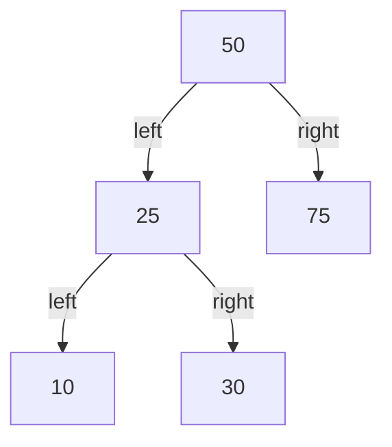
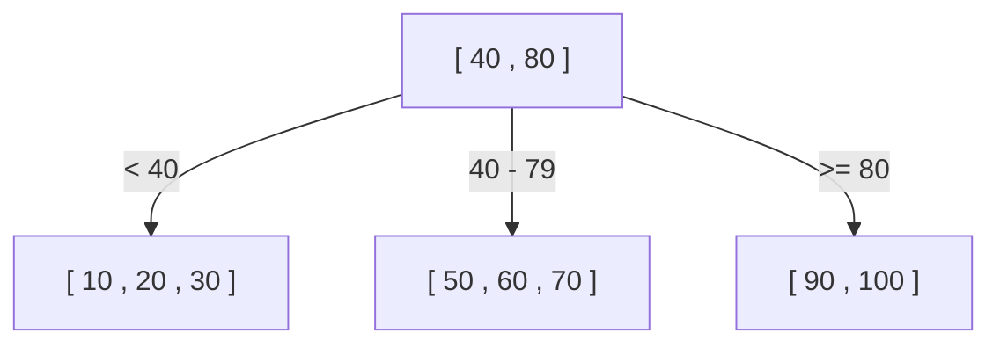
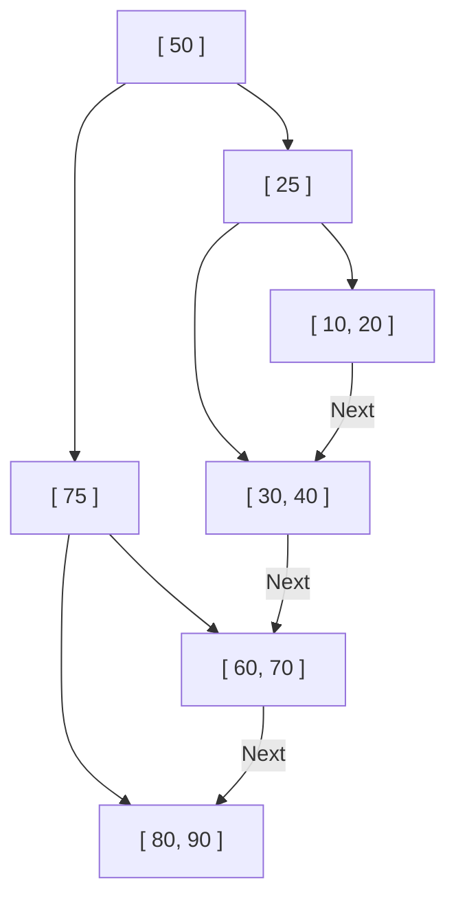

Why can databases find the desired data from tens of millions or hundreds of millions of records in just an instant? Behind this is a mechanism called an "index", and the core data structure supporting this index is the **B-Tree** and **B+Tree**.

In this article, starting from a simple binary search tree, we will delve deeply into the evolution and internal structure of why relational databases (RDB) adopted the B+Tree.

## 1. Limitations of Binary Search Trees (BST)

As a data structure to speed up data retrieval, the first thing that might come to mind is the "Binary Search Tree (BST)". In a binary search tree, each node has a maximum of two children, with the left child being smaller than the parent and the right child being larger. In an ideal state, the search time complexity is $O(\log N)$, which is very fast.

However, adopting a binary search tree as is for a database index has a fatal problem.

### Tree Balance Collapse
If data continues to be inserted in a sorted state, the binary search tree becomes like a straight linked list, and the search efficiency degrades to $O(N)$. To prevent this, there are "balanced binary search trees" such as AVL trees and Red-Black trees, which automatically adjust the balance to keep the tree height at $\log N$.

### The Wall of Disk I/O
The biggest challenge lies in **disk I/O (Input/Output)**. For memory operations, balanced binary search trees are fast enough, but database indexes are usually stored on disks (HDD or SSD).
Reading data from a disk is overwhelmingly slower compared to CPU calculations or memory access. Furthermore, disks do not read data byte by byte, but rather read and write in **chunks called "blocks" or "pages" (for example, 4KB or 8KB)**.

In a binary search tree, the amount of data held by one node is small, and the "height (depth)" of the tree tends to be deep. A deep tree means that many nodes must be traversed to reach the target leaf node from the root, and if a different disk page needs to be read for each node, enormous disk I/O will occur, and performance will significantly degrade.

## 2. B-Tree: Minimizing Height and I/O

The approach to reducing the number of disk I/Os is clear: "**Make the height of the tree as low (shallow) as possible**". To do this, a single node needs to be able to have not just two, but many more child nodes (dozens to hundreds).
This is the basic philosophy of the **B-Tree**.

The B-Tree is a type of "multi-way tree" and has the following characteristics:
- Stores multiple keys (data) in one node.
- By matching the node size to the disk page size (e.g., 4KB or 8KB), many keys can be read into memory at once with a single disk I/O.
- Always maintains perfect balance (all leaf nodes are at the same depth).

### B-Tree Search Algorithm
1. Read the root node from the disk.
2. Scan (or binary search) the key array within the node and find the pointer to the child node containing the target value.
3. Read the child node indicated by the pointer from the disk and repeat the same steps.
4. When the target key is found, obtain the associated data (or a pointer to the actual data on the disk).

For example, suppose there is a B-Tree where one node can hold 100 keys.
Even a B-Tree with a height of 3 (root, intermediate, leaf) can store $100 \times 100 \times 100 = 1,000,000$ (1 million) records. In other words, to find the desired record among 1 million records, it takes **at most 3 disk I/Os**. Compared to a binary search tree which would have a height of about 20 and cause 20 I/Os, this is a dramatic improvement.

## 3. B+Tree: The Ultimate Evolution in RDB

The B-Tree is a very excellent data structure, but modern relational databases such as MySQL (InnoDB) and PostgreSQL have adopted the **B+Tree**, a derivative of the B-Tree, as their index.

Why a B+Tree instead of a B-Tree? The reason lies in the overwhelming efficiency of "Range Queries" and "Sequential Access".

### Differences between B-Tree and B+Tree
The B+Tree adds the following important changes to the B-Tree:

1. **All data is stored exclusively in Leaf nodes**
   - In a B-Tree, actual data (or pointers to actual data) was also stored in the root node and intermediate nodes.
   - In a B+Tree, the root and intermediate nodes only hold **"signposts (index keys)"** and do not hold any actual data. All actual data is placed in the lowest leaf nodes.

2. **Leaf nodes are connected by a doubly linked list**
   - Adjacent leaf nodes hold pointers to each other, allowing data to be traversed horizontally in a single stroke.

### Why B+Tree is Optimal for RDB

#### 1. Increase in Keys per Node (Fanout)
Since the root and intermediate nodes do not hold actual data, the number of "keys and pointers" that can be stored in a single node can be greatly increased. For example, assuming the page size is the same at 4KB, a B-Tree might only be able to hold 50 keys per node because it also holds data, whereas a B+Tree can hold 500 keys because it only holds keys.
This makes the tree height even lower, reducing disk I/O.

#### 2. Explosive Speed of Range Queries
In a database, range queries like `SELECT * FROM users WHERE age BETWEEN 20 AND 30;` are frequently performed.
When doing this with a B-Tree, you have to traverse back and forth up and down the tree many times to find the data that matches the condition, causing wasteful I/O.
On the other hand, with a B+Tree:
1. First, trace the tree from top to bottom and find the starting leaf node where `age = 20`.
2. After that, simply read the "linked list" connecting the leaf nodes horizontally (sequentially) until the condition (`age <= 30`) ends.
Since disks are extremely fast at sequential access (continuous reading), this characteristic creates an overwhelming advantage in terms of disk I/O.

## 4. Node Splitting and Insertion/Deletion Algorithms

An index must always maintain balance every time data is added or deleted. The B+Tree has an algorithm to automatically maintain balance.

### Insertion and Splitting
When inserting a new key, it first finds the target leaf node using the same procedure as a search, and adds the key there.
If that node is already full (has reached its limit), a **Node Split** occurs.
1. Divide the keys of the full node in half, resulting in two new nodes (or the original node and one new node).
2. The split middle key is **promoted (moved up)** to the parent node.
3. If the parent node is also full, the parent node is split as well, and the split propagates upwards in a chain reaction.
4. When the split finally reaches the root node, a new root node is created, and at this point, the **tree height becomes one level deeper**.

Through this bottom-up construction process, the B+Tree always maintains "perfect balance" where the distance (depth) to the leaf nodes is perfectly matched.

## 5. Conclusion

The reason databases can achieve fast searches is thanks to the **B+Tree**, which is designed by deeply understanding the physical bottleneck of disk I/O and minimizing it.
- Minimizes the "height" of the tree to the extreme, reaching the data with fewer read counts.
- Concentrates data in leaf nodes, increasing the density of index nodes.
- Connects leaf nodes with a linked list, enabling sequential disk access during range queries.

The fact that it is optimized not just for "algorithmic time complexity" but also for "hardware characteristics (disk page access)" is the greatest reason why the B+Tree has reigned as the king of databases for decades.
