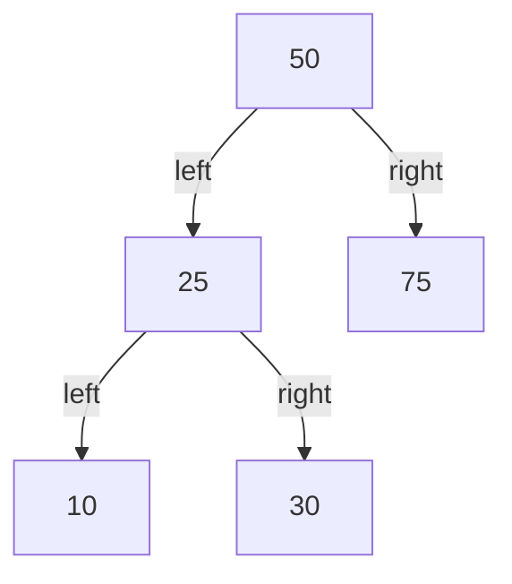
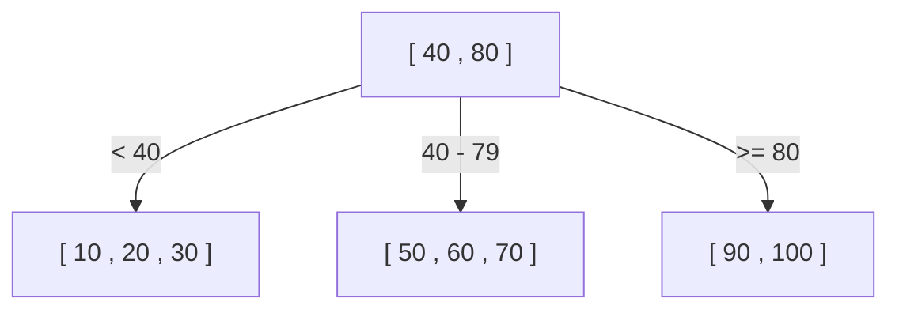
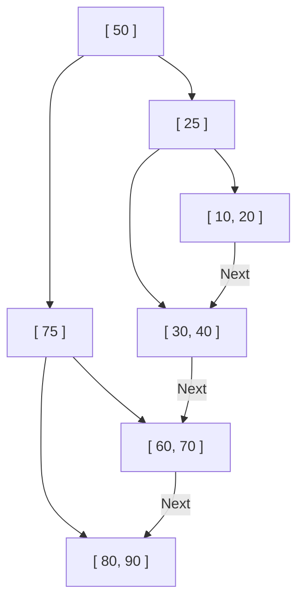

¿Por qué las bases de datos pueden encontrar la información deseada en una fracción de segundo entre decenas o cientos de millones de registros? Detrás de esto hay un mecanismo llamado "índice", y la estructura de datos central que soporta este índice es el **Árbol B (B-Tree)** y el **Árbol B+ (B+Tree)**.

En este artículo, comenzaremos con un simple árbol de búsqueda binario y profundizaremos en por qué las bases de datos relacionales (RDB) adoptaron el Árbol B+, explorando su proceso de evolución y estructura interna.

## 1. Los límites del Árbol de Búsqueda Binario (BST)

Como estructura de datos para acelerar la búsqueda de datos, lo primero que podría venir a la mente es el "Árbol de Búsqueda Binario (Binary Search Tree: BST)". En un árbol de búsqueda binario, cada nodo tiene un máximo de dos hijos, con la propiedad de que el hijo izquierdo es menor que el padre y el derecho es mayor que el padre. En un estado ideal, la complejidad temporal de búsqueda es $O(\log N)$, lo cual es extremadamente rápido.

Sin embargo, usar un árbol de búsqueda binario tal cual como índice de base de datos presenta un problema fatal.

### Desequilibrio del árbol
Si los datos continúan insertándose en un estado ordenado, el árbol de búsqueda binario se convierte en algo similar a una lista enlazada en línea recta, y la eficiencia de búsqueda se deteriora hasta $O(N)$. Para evitar esto, existen los "árboles de búsqueda binarios equilibrados" como los árboles AVL y los árboles Rojo-Negro, que ajustan automáticamente el equilibrio para mantener la altura del árbol en $\log N$.

### El muro de la E/S de disco (Disk I/O)
El mayor desafío radica en la **E/S de disco (entrada/salida)**. Si se trata de operaciones en memoria, un árbol de búsqueda binario equilibrado es lo suficientemente rápido, pero los índices de bases de datos generalmente se almacenan en disco (HDD o SSD).
La lectura de datos desde el disco es un proceso abrumadoramente más lento en comparación con los cálculos de la CPU y el acceso a la memoria. Además, el disco no lee los datos byte a byte, sino que **lee y escribe en unidades agrupadas llamadas "bloques" o "páginas" (por ejemplo, 4KB u 8KB)**.

En un árbol de búsqueda binario, la cantidad de datos que tiene un solo nodo es pequeña y la "altura (profundidad)" del árbol tiende a ser profunda. Un árbol profundo significa que es necesario recorrer muchos nodos desde la raíz hasta llegar al nodo hoja deseado, y si cada nodo requiere leer una página diferente del disco, se generará una enorme cantidad de E/S de disco, disminuyendo significativamente el rendimiento.

## 2. Árbol B (B-Tree): Reduciendo la altura y minimizando la E/S

El enfoque para reducir la cantidad de veces que se realiza E/S de disco es claro: "**hacer que la altura del árbol sea lo más baja (superficial) posible**". Para lograrlo, es necesario permitir que un solo nodo tenga, en lugar de dos, muchos más nodos hijos (decenas a cientos).
Esta es la idea básica del **Árbol B (B-Tree)**.

El Árbol B es un tipo de "árbol n-ario (m-ario)" y tiene las siguientes características:
- Almacena múltiples claves (datos) en un solo nodo.
- Al hacer coincidir el tamaño del nodo con el tamaño de página del disco (ej: 4KB u 8KB), permite que muchas claves se lean en la memoria a la vez con una sola operación de E/S de disco.
- Siempre mantiene un equilibrio perfecto (todos los nodos hoja están a la misma profundidad).

### Algoritmo de búsqueda del Árbol B
1. Leer el nodo raíz desde el disco.
2. Escanear (o realizar búsqueda binaria) el arreglo de claves dentro del nodo para encontrar el puntero del nodo hijo que contiene el valor buscado.
3. Leer el nodo hijo indicado por el puntero desde el disco y repetir el mismo procedimiento.
4. Al encontrar la clave deseada, obtener los datos asociados (o el puntero a los datos reales en el disco).

Por ejemplo, supongamos que hay un Árbol B donde un solo nodo puede contener 100 claves.
Incluso con un Árbol B de altura 3 (raíz, intermedio, hoja), puede almacenar $100 \times 100 \times 100 = 1,000,000$ (1 millón) de registros. Es decir, para encontrar 1 registro deseado entre 1 millón de registros, **se requerirá un máximo de 3 operaciones de E/S de disco**. En un árbol de búsqueda binario, la altura sería aproximadamente 20, lo que resultaría en 20 operaciones de E/S, por lo que es una mejora drástica.

## 3. Árbol B+ (B+Tree): La evolución definitiva en RDB

Aunque el Árbol B es una estructura de datos excelente, las bases de datos relacionales modernas como MySQL (InnoDB) y PostgreSQL han adoptado una variante del Árbol B, el **Árbol B+ (B+Tree)**, como su índice.

¿Por qué Árbol B+ en lugar de Árbol B? La razón radica en la abrumadora eficiencia de las "Búsquedas por rango (Range Query)" y el "Acceso secuencial".

### Diferencias entre el Árbol B y el Árbol B+
El Árbol B+ introduce los siguientes cambios importantes respecto al Árbol B:

1. **Todos los datos se almacenan exclusivamente en los nodos hoja (Leaf)**
   - En el Árbol B, los datos reales (o punteros a datos reales) también se almacenaban en el nodo raíz y los nodos intermedios.
   - En el Árbol B+, la raíz y los nodos intermedios actúan **solo como "señales (claves de índice)"**, y no contienen ningún dato real. Todos los datos reales se colocan en los nodos hoja en el nivel más bajo.

2. **Los nodos hoja están conectados entre sí mediante una lista doblemente enlazada**
   - Los nodos hoja adyacentes tienen punteros entre sí, lo que permite recorrer los datos horizontalmente en un solo trazo.

### Por qué el Árbol B+ es óptimo para RDB

#### 1. Aumento del número de claves por nodo (Fanout)
Dado que la raíz y los nodos intermedios no contienen datos reales, la cantidad de "claves y punteros" que se pueden almacenar en un solo nodo se puede aumentar drásticamente. Por ejemplo, suponiendo que el tamaño de página es el mismo, de 4KB, un Árbol B podría contener solo 50 por nodo debido a que también incluye datos, pero un Árbol B+ puede contener 500 porque solo almacena claves.
Esto reduce aún más la altura del árbol y disminuye la E/S del disco.

#### 2. Aceleración explosiva de las Búsquedas por rango (Range Query)
En las bases de datos, las búsquedas por rango como `SELECT * FROM users WHERE age BETWEEN 20 AND 30;` se realizan con frecuencia.
Si se hace esto con un Árbol B, el árbol debe recorrerse hacia arriba y hacia abajo varias veces para encontrar los datos que coinciden con la condición, generando E/S innecesaria.
Por otro lado, en el caso del Árbol B+:
1. Primero se recorre el árbol de arriba hacia abajo para encontrar el nodo hoja inicial `age = 20`.
2. Luego, simplemente se lee la "lista enlazada" que conecta los nodos hoja horizontalmente (secuencialmente) hasta que finaliza la condición (`age <= 30`).
Dado que el acceso secuencial (lectura continua) del disco es extremadamente rápido, esta característica produce una ventaja abrumadora desde el punto de vista de la E/S de disco.

## 4. Algoritmos de División de Nodos (Split), Inserción y Eliminación

El índice siempre debe mantener su equilibrio cada vez que se agregan o eliminan datos. El Árbol B+ tiene un algoritmo para mantener automáticamente el equilibrio.

### Inserción y División (Split)
Al insertar una nueva clave, primero se encuentra el nodo hoja objetivo siguiendo el mismo procedimiento que la búsqueda, y se agrega la clave allí.
Si ese nodo ya está lleno (ha alcanzado su límite), se produce una **división de nodo (Split)**.
1. Las claves del nodo lleno se dividen a la mitad, creando dos nuevos nodos (o el nodo original y un nuevo nodo).
2. La clave central dividida se **promueve (asciende) al nodo padre**.
3. Si el nodo padre también está lleno, este también se divide, propagando las divisiones en cadena hacia arriba.
4. Si la división alcanza finalmente el nodo raíz, se crea un nuevo nodo raíz, y aquí es cuando **la altura del árbol se hace un nivel más profunda** por primera vez.

A través de este proceso de construcción de abajo hacia arriba (bottom-up), el Árbol B+ siempre mantiene un "equilibrio perfecto" donde la distancia (profundidad) a todos los nodos hoja coincide exactamente.

## 5. Resumen

Que una base de datos pueda lograr búsquedas rápidas se debe al **Árbol B+**, diseñado para comprender profundamente el cuello de botella físico que representa la E/S del disco y minimizando lo más posible.
- Reduce al máximo la "altura" del árbol para llegar a los datos con menos lecturas.
- Concentra los datos en los nodos hoja, aumentando la densidad de los nodos de índice.
- Conecta los nodos hoja con una lista enlazada, permitiendo un acceso secuencial al disco durante las búsquedas por rango.

No es solo una cuestión de "complejidad algorítmica", sino su optimización para las "características del hardware (acceso a páginas de disco)" lo que hace que el Árbol B+ haya sido el rey indiscutible de las bases de datos durante décadas.
