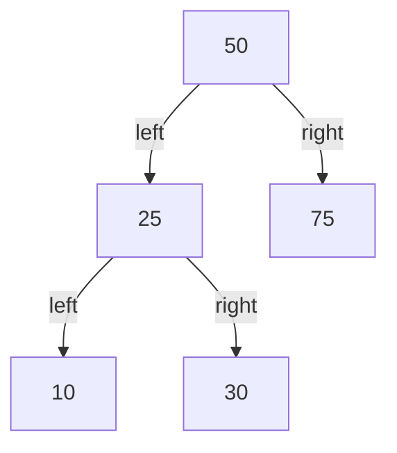
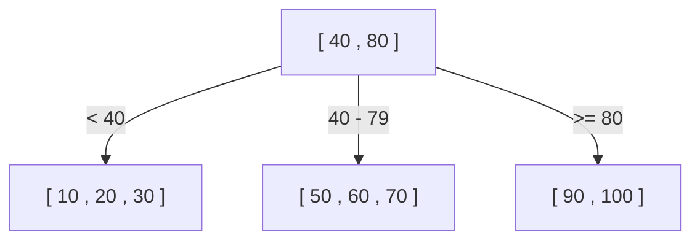
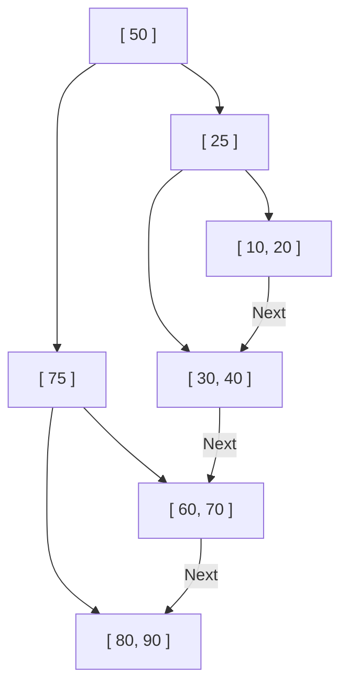

Pourquoi une base de données peut-elle trouver les données souhaitées en un instant parmi des dizaines ou des centaines de millions d'enregistrements ? Derrière cela se cache un mécanisme appelé "index", et les structures de données centrales qui le soutiennent sont le **B-Tree (arbre B)** et le **B+ Tree (arbre B+)**.

Dans cet article, nous partirons d'un simple arbre binaire de recherche, et nous approfondirons le processus d'évolution et la structure interne qui expliquent pourquoi les bases de données relationnelles (SGBDR) ont fini par adopter le B+ Tree.

## 1. Les limites de l'arbre binaire de recherche (BST)

En tant que structure de données pour accélérer la recherche de données, la première qui vient à l'esprit est peut-être "l'arbre binaire de recherche" (Binary Search Tree : BST). Dans un arbre binaire de recherche, chaque nœud a un maximum de deux enfants, avec la propriété que l'enfant de gauche est plus petit que le parent et l'enfant de droite est plus grand que le parent. Dans un état idéal, la complexité de la recherche est de $O(\log N)$, ce qui est très rapide.

Cependant, adopter un arbre binaire de recherche tel quel comme index de base de données pose des problèmes critiques.

### Déséquilibre de l'arbre
Si les données continuent d'être insérées de manière triée, l'arbre binaire de recherche ressemble à une liste chaînée linéaire et l'efficacité de la recherche se détériore jusqu'à $O(N)$. Pour éviter cela, il existe des "arbres binaires de recherche équilibrés" tels que les arbres AVL et les arbres rouge-noir, qui ajustent automatiquement l'équilibre pour maintenir la hauteur de l'arbre à $\log N$.

### Le mur des E/S disque (I/O)
Le plus grand défi réside dans **les E/S disque (Entrées/Sorties)**. Si les opérations s'effectuent en mémoire, un arbre binaire de recherche équilibré est suffisamment rapide, mais les index des bases de données sont généralement stockés sur disque (HDD ou SSD).
La lecture de données à partir du disque est un processus extrêmement lent par rapport aux calculs du CPU ou à l'accès à la mémoire. De plus, le disque ne lit pas les données octet par octet, mais lit et écrit par **blocs ou « pages » (par exemple, 4 Ko ou 8 Ko)**.

Dans un arbre binaire de recherche, la quantité de données contenue dans un seul nœud est faible, et la « hauteur (profondeur) » de l'arbre a tendance à être grande. Un arbre profond signifie que de nombreux nœuds doivent être traversés de la racine pour atteindre le nœud feuille souhaité. Si différents nœuds nécessitent la lecture de différentes pages de disque, une quantité massive d'E/S disque se produit, ce qui entraîne une baisse significative des performances.

## 2. B-Tree (Arbre B) : Réduire la hauteur et minimiser les E/S

L'approche pour réduire le nombre d'E/S disque est claire : « **Rendre la hauteur de l'arbre aussi faible (peu profonde) que possible** ». Pour ce faire, au lieu d'avoir 2 nœuds enfants, un seul nœud doit pouvoir avoir beaucoup plus de nœuds enfants (des dizaines à des centaines).
C'est l'idée fondamentale du **B-Tree**.

Le B-Tree est un type d'"arbre n-aire" et présente les caractéristiques suivantes :
- Un seul nœud stocke plusieurs clés (données).
- En adaptant la taille du nœud à la taille de la page du disque (ex : 4 Ko ou 8 Ko), de nombreuses clés peuvent être lues en mémoire en une seule E/S disque.
- Maintient toujours un équilibre parfait (tous les nœuds feuilles sont à la même profondeur).

### Algorithme de recherche du B-Tree
1. Lire le nœud racine à partir du disque.
2. Parcourir le tableau de clés dans le nœud (ou effectuer une recherche dichotomique) et trouver le pointeur vers le nœud enfant qui contient la valeur souhaitée.
3. Lire le nœud enfant indiqué par le pointeur à partir du disque et répéter la même procédure.
4. Une fois la clé trouvée, récupérer les données associées (ou le pointeur vers les données réelles sur le disque).

Par exemple, supposons qu'il existe un B-Tree où un seul nœud peut contenir 100 clés.
Même un B-Tree d'une hauteur de 3 (racine, intermédiaire, feuille) peut stocker $100 \times 100 \times 100 = 1 000 000$ (1 million) de données. Autrement dit, pour trouver un seul élément parmi 1 million de données, il suffit d'un **maximum de 3 E/S disque**. Par rapport à un arbre binaire de recherche qui aurait une hauteur d'environ 20, entraînant 20 E/S, c'est une amélioration spectaculaire.

## 3. B+ Tree : L'évolution ultime pour les SGBDR

Bien que le B-Tree soit une excellente structure de données, les bases de données relationnelles modernes telles que MySQL (InnoDB) et PostgreSQL ont adopté le **B+ Tree**, un dérivé du B-Tree, comme index.

Pourquoi le B+ Tree et non le B-Tree ? La raison réside dans l'efficacité écrasante de la "recherche par plage (Range Query)" et de "l'accès séquentiel".

### Différence entre B-Tree et B+ Tree
Le B+ Tree apporte les modifications importantes suivantes par rapport au B-Tree :

1. **Toutes les données sont stockées uniquement dans les nœuds feuilles (Leaf)**
   - Dans le B-Tree, les nœuds racine et intermédiaires stockent également les données réelles (ou des pointeurs vers les données réelles).
   - Dans le B+ Tree, les nœuds racine et intermédiaires ne contiennent que des **« panneaux de signalisation (clés d'index) »** et ne contiennent aucune donnée réelle. Toutes les données réelles sont placées dans les nœuds feuilles tout en bas.

2. **Les nœuds feuilles sont connectés les uns aux autres par une liste doublement chaînée**
   - Les nœuds feuilles adjacents ont des pointeurs les uns vers les autres, ce qui permet de parcourir les données horizontalement de bout en bout en une seule passe.

### Pourquoi le B+ Tree est idéal pour les SGBDR

#### 1. Augmentation du nombre de clés par nœud (Fanout)
Puisque les nœuds racine et intermédiaires ne contiennent pas de données réelles, le nombre de "clés et pointeurs" pouvant être stockés dans un seul nœud peut être considérablement augmenté. Par exemple, si la taille de la page est de 4 Ko, un B-Tree pourrait ne contenir que 50 éléments par nœud car il inclut également des données, tandis qu'un B+ Tree peut en contenir 500 car il n'inclut que des clés.
Cela réduit encore la hauteur de l'arbre et diminue les E/S disque.

#### 2. Accélération fulgurante de la recherche par plage (Range Query)
Dans les bases de données, des recherches par plage comme `SELECT * FROM users WHERE age BETWEEN 20 AND 30;` sont fréquemment effectuées.
Si cela est fait avec un B-Tree, il faut traverser l'arbre de haut en bas plusieurs fois pour trouver les données correspondantes, ce qui génère des E/S inutiles.
En revanche, avec un B+ Tree :
1. D'abord, parcourir l'arbre de haut en bas pour trouver le nœud feuille qui est le point de départ, `age = 20`.
2. Ensuite, il suffit de lire la « liste chaînée » qui relie les nœuds feuilles horizontalement (de manière séquentielle) jusqu'à ce que la condition (`age <= 30`) prenne fin.
Comme l'accès séquentiel (lecture continue) sur disque est très rapide, cette caractéristique crée un avantage écrasant du point de vue des E/S disque.

## 4. Algorithme de division des nœuds (Split), d'insertion et de suppression

L'index doit toujours maintenir son équilibre à chaque ajout ou suppression de données. Le B+ Tree dispose d'un algorithme pour conserver cet équilibre automatiquement.

### Insertion et Division (Split)
Lors de l'insertion d'une nouvelle clé, trouvez d'abord le nœud feuille cible en suivant la même procédure que pour la recherche, et ajoutez-y la clé.
Si ce nœud est déjà plein (a atteint sa limite), une **division du nœud (Split)** se produit.
1. Divisez les clés du nœud plein en deux, créant deux nouveaux nœuds (ou le nœud d'origine et un nouveau nœud).
2. Poussez la clé centrale divisée vers le haut, vers le **nœud parent (Promote)**.
3. Si le nœud parent est également plein, le nœud parent est également divisé, et la division se propage en cascade vers le haut, vers son propre parent.
4. Finalement, si la division atteint le nœud racine, un nouveau nœud racine est créé, et c'est à ce moment-là que la **hauteur de l'arbre augmente d'un niveau**.

Grâce à ce processus de construction ascendante (bottom-up), le B+ Tree maintient toujours un "équilibre parfait" où la distance (profondeur) jusqu'aux nœuds feuilles est parfaitement identique.

## 5. Conclusion

La raison pour laquelle une base de données peut effectuer des recherches à grande vitesse est grâce au **B+ Tree**, qui a été conçu pour comprendre en profondeur le goulot d'étranglement physique des E/S disque et pour le minimiser.
- Réduire au maximum la « hauteur » de l'arbre pour atteindre les données en un nombre d'accès minimum.
- Concentrer les données dans les nœuds feuilles pour augmenter la densité des nœuds d'index.
- Connecter les nœuds feuilles avec une liste chaînée pour permettre un accès disque séquentiel lors des recherches par plage.

Le fait qu'il soit optimisé non seulement pour la « complexité de calcul de l'algorithme », mais aussi pour les « caractéristiques du matériel (accès aux pages de disque) » est la principale raison pour laquelle le B+ Tree règne en maître sur les bases de données depuis des décennies.
