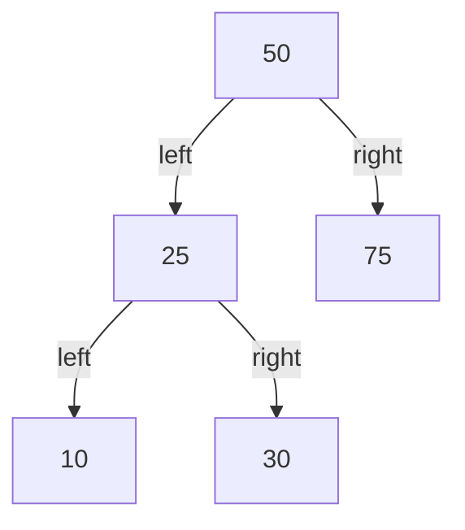
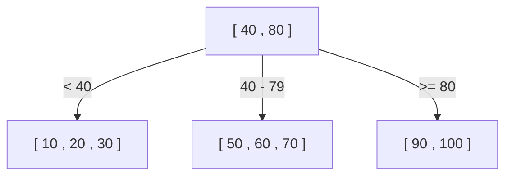
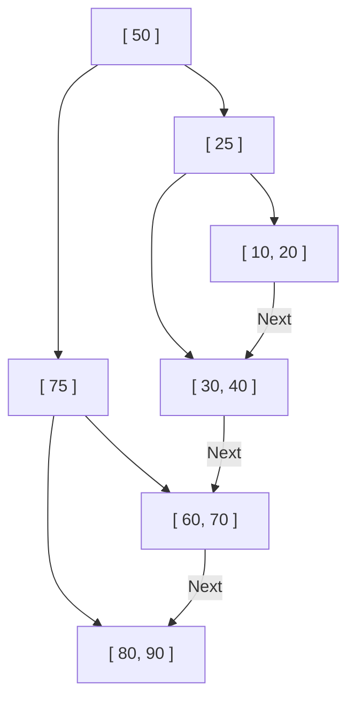

ऐसा क्यों है कि डेटाबेस लाखों-करोड़ों रिकॉर्ड्स में से मनचाहा डेटा पलक झपकते ही ढूंढ निकालता है? इसके पीछे 'इंडेक्स' (Index) नामक एक प्रणाली काम करती है, और इस इंडेक्स को समर्थन देने वाली मुख्य डेटा संरचनाएं **B-Tree (B-tree)** और **B+Tree (B+tree)** हैं।

इस लेख में, हम एक साधारण बाइनरी सर्च ट्री (Binary Search Tree) से शुरू करेंगे, और गहराई से समझेंगे कि रिलेशनल डेटाबेस (RDB) ने B+Tree को क्यों अपनाया, इसके विकास की प्रक्रिया और आंतरिक संरचना क्या है।

## 1. बाइनरी सर्च ट्री (BST) की सीमाएँ

डेटा सर्च को तेज़ करने वाली डेटा संरचना के रूप में, सबसे पहले शायद 'बाइनरी सर्च ट्री' (Binary Search Tree: BST) का विचार आता है। बाइनरी सर्च ट्री में, प्रत्येक नोड के अधिकतम 2 चाइल्ड (child) होते हैं, बायां चाइल्ड पैरेंट (parent) से छोटा होता है, और दायां चाइल्ड पैरेंट से बड़ा होता है। आदर्श स्थिति में, सर्च टाइम कॉम्प्लेक्सिटी $O(\log N)$ होती है, जो बहुत तेज़ है।

हालांकि, बाइनरी सर्च ट्री को सीधे डेटाबेस इंडेक्स के रूप में उपयोग करने में कुछ गंभीर समस्याएं हैं।

### ट्री का असंतुलन (Balance Collapse)
यदि डेटा को सॉर्ट (sort) किए गए क्रम में लगातार डाला जाता है, तो बाइनरी सर्च ट्री एक सीधी लिंक्ड लिस्ट (linked list) की तरह बन जाता है, और सर्च क्षमता $O(N)$ तक गिर जाती है। इसे रोकने के लिए, AVL ट्री और रेड-ब्लैक ट्री जैसे 'बैलेंस्ड बाइनरी सर्च ट्री' (Balanced Binary Search Tree) मौजूद हैं, जो स्वचालित रूप से ट्री की ऊंचाई को $\log N$ पर बनाए रखने के लिए बैलेंस समायोजित करते हैं।

### डिस्क I/O की बाधा
सबसे बड़ी चुनौती **डिस्क I/O (इनपुट/आउटपुट)** है। मेमोरी में होने वाले ऑपरेशन्स के लिए बैलेंस्ड बाइनरी सर्च ट्री काफी तेज़ है, लेकिन डेटाबेस इंडेक्स आमतौर पर डिस्क (HDD या SSD) पर सहेजे जाते हैं।
डिस्क से डेटा पढ़ना CPU ऑपरेशन्स या मेमोरी एक्सेस की तुलना में बहुत धीमी प्रक्रिया है। इसके अलावा, डिस्क डेटा को बाइट-बाय-बाइट नहीं पढ़ता है, बल्कि यह **'ब्लॉक' या 'पेज' नामक बड़ी इकाइयों (जैसे 4KB या 8KB) में पढ़ता और लिखता है**।

बाइनरी सर्च ट्री में, एक नोड में डेटा की मात्रा छोटी होती है, और ट्री की 'ऊंचाई (गहराई)' अधिक होने की संभावना होती है। एक गहरे ट्री का मतलब है कि रूट से लक्षित लीफ (leaf) नोड तक पहुंचने के लिए कई नोड्स से होकर गुजरना पड़ता है, और यदि हर नोड के लिए एक अलग डिस्क पेज पढ़ा जाना है, तो भारी डिस्क I/O उत्पन्न होगा और प्रदर्शन में भारी गिरावट आएगी।

## 2. B-Tree (B-tree): ऊंचाई कम करना और I/O को न्यूनतम करना

डिस्क I/O की संख्या को कम करने का दृष्टिकोण स्पष्ट है: '**ट्री की ऊंचाई को यथासंभव कम (उथला) रखें**'। ऐसा करने के लिए, एक नोड में केवल 2 के बजाय कई चाइल्ड नोड्स (दसियों से सैकड़ों तक) होने चाहिए।
यही **B-Tree** का मूल विचार है।

B-Tree एक प्रकार का 'मल्टी-वे ट्री' (Multi-way tree) है और इसकी निम्नलिखित विशेषताएं हैं:
- एक ही नोड में कई कुंजियाँ (डेटा) संग्रहीत करना।
- नोड के आकार को डिस्क के पेज आकार (उदा: 4KB या 8KB) से मेल खाकर, यह सुनिश्चित करना कि कई कुंजियों को एक ही डिस्क I/O में एक साथ मेमोरी में पढ़ा जा सके।
- हमेशा पूर्ण संतुलन बनाए रखना (सभी लीफ नोड एक ही गहराई पर होते हैं)।

### B-Tree सर्च एल्गोरिथम
1. रूट नोड को डिस्क से पढ़ें।
2. नोड के भीतर की (key) एरे को स्कैन (या बाइनरी सर्च) करें और उस चाइल्ड नोड का पॉइंटर खोजें जिसमें लक्षित मान हो।
3. पॉइंटर द्वारा दर्शाए गए चाइल्ड नोड को डिस्क से पढ़ें और उसी प्रक्रिया को दोहराएं।
4. लक्षित कुंजी मिलने पर, उससे जुड़ा डेटा (या डिस्क पर वास्तविक डेटा का पॉइंटर) प्राप्त करें।

उदाहरण के लिए, मान लें कि एक B-Tree है जिसका एक नोड 100 कुंजियों को धारण कर सकता है।
3 की ऊंचाई (रूट, इंटरमीडिएट, लीफ) वाले B-Tree में भी, $100 \times 100 \times 100 = 1,000,000$ (1 मिलियन) डेटा आइटम संग्रहीत किए जा सकते हैं। दूसरे शब्दों में, 1 मिलियन डेटा आइटम्स में से एक विशिष्ट आइटम खोजने में **अधिकतम 3 डिस्क I/O** लगते हैं। बाइनरी सर्च ट्री में ऊंचाई लगभग 20 होगी, जिससे 20 I/O ऑपरेशन्स होंगे, इसलिए यह एक नाटकीय सुधार है।

## 3. B+Tree: RDB में अंतिम विकास

यद्यपि B-Tree एक उत्कृष्ट डेटा संरचना है, MySQL (InnoDB) और PostgreSQL जैसे आधुनिक रिलेशनल डेटाबेस ने **B+Tree** को अपनाया है, जो B-Tree का ही एक रूप है, जिसे इंडेक्स के तौर पर उपयोग किया जाता है।

B-Tree के बजाय B+Tree क्यों? इसका कारण 'रेंज क्वेरी' (Range Query) और 'सीक्वेंशियल एक्सेस' (Sequential access) की अत्यधिक दक्षता है।

### B-Tree और B+Tree के बीच अंतर
B+Tree, B-Tree की तुलना में निम्नलिखित महत्वपूर्ण परिवर्तन करता है:

1. **सभी डेटा केवल लीफ (Leaf) नोड्स में संग्रहीत होते हैं**
   - B-Tree में, वास्तविक डेटा (या वास्तविक डेटा के पॉइंटर्स) रूट नोड और इंटरमीडिएट नोड्स में भी संग्रहीत किए जाते थे।
   - B+Tree में, रूट और इंटरमीडिएट नोड्स में **केवल 'मार्गदर्शक (इंडेक्स कुंजियां)'** होते हैं और कोई वास्तविक डेटा नहीं होता है। सभी वास्तविक डेटा सबसे निचले स्तर के लीफ नोड्स में रखे जाते हैं।

2. **लीफ नोड्स एक डबली-लिंक्ड लिस्ट (doubly linked list) के माध्यम से एक-दूसरे से जुड़े होते हैं**
   - आसन्न लीफ नोड्स में एक-दूसरे के पॉइंटर्स होते हैं, जिससे डेटा को क्षैतिज दिशा में एक निरंतर रेखा की तरह खोजा जा सकता है।

### RDB के लिए B+Tree सबसे उपयुक्त क्यों है

#### 1. प्रति नोड कुंजियों की संख्या (Fan-out) में वृद्धि
चूंकि रूट और इंटरमीडिएट नोड्स में वास्तविक डेटा नहीं होता है, एक नोड में संग्रहीत की जा सकने वाली 'कुंजी और पॉइंटर' की संख्या काफी बढ़ाई जा सकती है। उदाहरण के लिए, मान लें कि पेज का आकार वही 4KB है; B-Tree में, एक नोड केवल 50 कुंजियों को धारण कर सकता है क्योंकि उसमें डेटा भी होता है, जबकि B+Tree में, यह 500 कुंजियों को धारण कर सकता है क्योंकि इसमें केवल कुंजियां होती हैं।
यह ट्री की ऊंचाई को और कम करता है और डिस्क I/O को घटाता है।

#### 2. रेंज क्वेरी (Range Query) की गति में बेतहाशा वृद्धि
डेटाबेस में, `SELECT * FROM users WHERE age BETWEEN 20 AND 30;` जैसी रेंज क्वेरी अक्सर की जाती हैं।
यदि आप B-Tree के साथ ऐसा करते हैं, तो आपको शर्तों को पूरा करने वाले डेटा को खोजने के लिए ट्री को बार-बार ऊपर-नीचे ट्रैवर्स (traverse) करना होगा, जिससे अनावश्यक I/O उत्पन्न होगा।
दूसरी ओर, B+Tree के मामले में:
1. सबसे पहले ट्री को ऊपर से नीचे ट्रैवर्स करें और शुरुआती बिंदु, जो `age = 20` है, वाला लीफ नोड खोजें।
2. फिर बस लीफ नोड्स को जोड़ने वाली 'लिंक्ड लिस्ट' को क्षैतिज रूप से (सीक्वेंशियल) पढ़ें, जब तक कि शर्त (`age <= 30`) पूरी नहीं हो जाती।
चूंकि डिस्क सीक्वेंशियल एक्सेस (लगातार पढ़ना) बहुत तेज़ होती है, यह विशेषता डिस्क I/O के दृष्टिकोण से बहुत बड़ा लाभ प्रदान करती है।

## 4. नोड स्प्लिट (Split) और इन्सर्ट/डिलीट एल्गोरिथम

इंडेक्स को डेटा जोड़ने या हटाने पर हमेशा अपना संतुलन बनाए रखना चाहिए। B+Tree में स्वचालित रूप से संतुलन बनाए रखने के लिए एक एल्गोरिथम होता है।

### इन्सर्ट और स्प्लिट (Split)
एक नई कुंजी सम्मिलित करते समय, पहले उसी प्रक्रिया का उपयोग करके लक्षित लीफ नोड खोजें जैसा कि सर्च के लिए किया जाता है, और वहां कुंजी जोड़ें।
यदि वह नोड पहले से ही भरा हुआ है (सीमा तक पहुँच गया है), तो **नोड का विभाजन (Split)** होता है।
1. भरे हुए नोड की कुंजियों को आधे में विभाजित करें, जिससे 2 नए नोड बनते हैं (या मूल नोड और एक नया नोड)।
2. विभाजित मध्य कुंजी को **पैरेंट नोड में ऊपर भेजें (प्रमोट करें)**।
3. यदि पैरेंट नोड भी भरा हुआ है, तो पैरेंट नोड को भी विभाजित किया जाता है, और यह विभाजन श्रृंखला के रूप में ऊपर की ओर बढ़ता है।
4. अंत में, यदि विभाजन रूट नोड तक पहुंचता है, तो एक नया रूट नोड बनाया जाता है, और यह पहली बार होता है जब **ट्री की ऊंचाई एक स्तर गहरी** होती है।

इस बॉटम-अप निर्माण प्रक्रिया के माध्यम से, B+Tree हमेशा 'पूर्ण संतुलन' बनाए रखता है, जहां लीफ नोड्स की दूरी (गहराई) पूरी तरह से समान होती है।

## 5. निष्कर्ष

डेटाबेस उच्च गति की खोज प्राप्त कर सकता है, यह **B+Tree** को धन्यवाद है, जिसे डिस्क I/O के भौतिक अड़चन (bottleneck) को गहराई से समझने और इसे न्यूनतम करने के लिए डिज़ाइन किया गया है।
- ट्री की 'ऊंचाई' को अत्यधिक कम करना और न्यूनतम रीड्स के साथ डेटा तक पहुंचना।
- डेटा को लीफ नोड्स में केंद्रित करना और इंडेक्स नोड्स के घनत्व को बढ़ाना।
- लीफ नोड्स को लिंक्ड लिस्ट के साथ जोड़ना, जिससे रेंज सर्च के दौरान सीक्वेंशियल डिस्क एक्सेस संभव हो सके।

न केवल 'एल्गोरिथम की टाइम कॉम्प्लेक्सिटी', बल्कि यह तथ्य कि यह 'हार्डवेयर विशेषताओं (डिस्क पेज एक्सेस)' के लिए अनुकूलित है, इसका सबसे बड़ा कारण है कि B+Tree दशकों से डेटाबेस की दुनिया पर राज कर रहा है।
