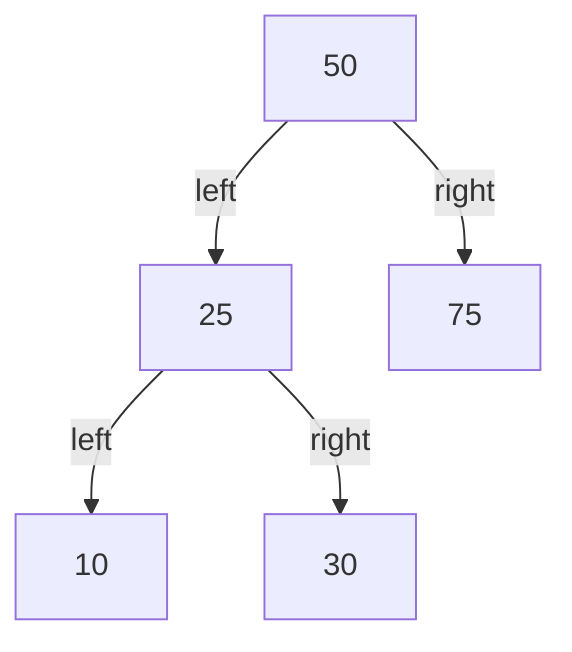
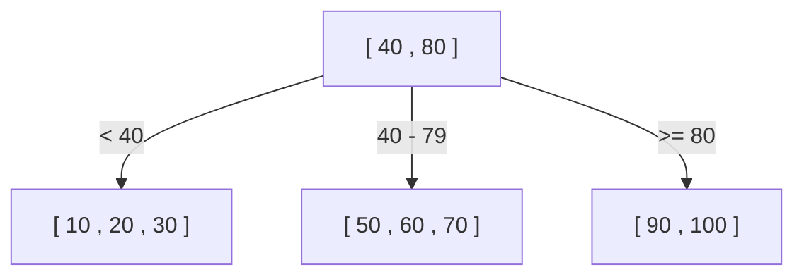
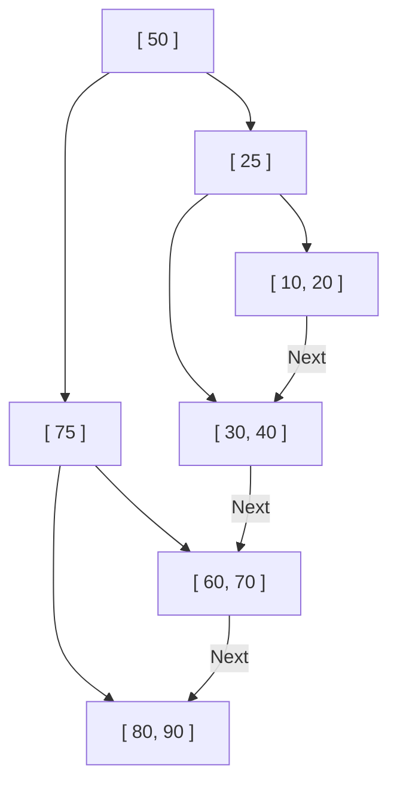

Mengapa basis data dapat menemukan data yang diinginkan dari puluhan atau ratusan juta catatan hanya dalam sekejap mata? Di baliknya terdapat mekanisme yang disebut "indeks", dan struktur data utama yang mendukung indeks tersebut adalah **B-Tree** dan **B+Tree**.

Dalam artikel ini, kita akan membahas mulai dari pohon pencarian biner (Binary Search Tree) sederhana, lalu menggali lebih dalam proses evolusi dan struktur internal mengenai alasan mengapa basis data relasional (RDB) mengadopsi B+Tree.

## 1. Keterbatasan Pohon Pencarian Biner (BST)

Sebagai struktur data yang mempercepat pencarian data, yang pertama kali terlintas di pikiran mungkin adalah "Pohon Pencarian Biner (Binary Search Tree: BST)". Pohon pencarian biner memiliki sifat di mana setiap node memiliki maksimal 2 anak, di mana anak kiri lebih kecil dari induknya, dan anak kanan lebih besar dari induknya. Dalam kondisi ideal, kompleksitas waktu pencariannya adalah $O(\log N)$, yang mana sangat cepat.

Namun, ada masalah fatal dalam mengadopsi pohon pencarian biner apa adanya sebagai indeks basis data.

### Kerusakan Keseimbangan Pohon
Jika data terus dimasukkan dalam keadaan terurut, pohon pencarian biner akan menjadi seperti daftar tertaut (linked list) dalam garis lurus, dan efisiensi pencarian akan memburuk menjadi $O(N)$. Untuk mencegah hal ini, ada "pohon pencarian biner seimbang" seperti pohon AVL atau pohon Red-Black, yang secara otomatis menyesuaikan keseimbangan untuk menjaga tinggi pohon tetap $\log N$.

### Hambatan I/O Disk
Tantangan terbesarnya ada pada **I/O disk (input/output)**. Jika operasi dilakukan di memori, pohon pencarian biner seimbang sudah cukup cepat, tetapi indeks basis data biasanya disimpan di disk (HDD atau SSD).
Membaca data dari disk merupakan proses yang jauh lebih lambat dibandingkan dengan perhitungan CPU atau akses memori. Selain itu, disk tidak membaca data byte per byte, melainkan **membaca dan menulis dalam unit yang dikelompokkan yang disebut "blok" atau "halaman" (misalnya 4KB atau 8KB)**.

Dalam pohon pencarian biner, jumlah data yang dimiliki satu node sangat kecil, sehingga "tinggi (kedalaman)" pohon cenderung menjadi dalam. Pohon yang dalam berarti bahwa untuk mencapai node daun (leaf) yang dituju dari root, kita harus melintasi banyak node, dan jika setiap node mengharuskan pembacaan halaman disk yang berbeda, I/O disk yang sangat besar akan terjadi, sehingga menyebabkan penurunan kinerja secara signifikan.

## 2. B-Tree: Menekan Ketinggian dan Meminimalkan I/O

Pendekatan untuk mengurangi jumlah I/O disk sangat jelas: "**Membuat ketinggian pohon serendah (sedangkal) mungkin**". Untuk mencapainya, satu node harus dapat memiliki jauh lebih banyak node anak (puluhan hingga ratusan) daripada sekadar dua.
Inilah ide dasar dari **B-Tree**.

B-Tree adalah jenis "pohon multi-jalan (multi-way tree)" dan memiliki karakteristik berikut:
- Menyimpan banyak kunci (data) dalam satu node.
- Dengan menyesuaikan ukuran node dengan ukuran halaman disk (misalnya 4KB atau 8KB), banyak kunci dapat dibaca ke memori sekaligus dalam satu I/O disk.
- Selalu menjaga keseimbangan sempurna (semua node daun berada pada kedalaman yang sama).

### Algoritma Pencarian B-Tree
1. Membaca node root dari disk.
2. Memindai array kunci di dalam node (atau menggunakan pencarian biner) dan menemukan pointer ke node anak yang berisi nilai yang dituju.
3. Membaca node anak yang ditunjuk oleh pointer dari disk dan mengulangi langkah yang sama.
4. Setelah kunci yang dituju ditemukan, kita dapat memperoleh data yang terkait dengannya (atau pointer ke data sebenarnya di disk).

Sebagai contoh, bayangkan ada B-Tree di mana satu node dapat menampung 100 kunci.
Bahkan pada B-Tree dengan ketinggian 3 (root, menengah, dan daun), kita dapat menyimpan $100 \times 100 \times 100 = 1.000.000$ (1 juta) data. Dengan kata lain, untuk menemukan 1 data yang dicari dari 1 juta data, **maksimal hanya diperlukan 3 kali I/O disk**. Ini merupakan peningkatan yang dramatis dibandingkan dengan pohon pencarian biner yang akan memiliki ketinggian sekitar 20, dan mengakibatkan 20 kali I/O.

## 3. B+Tree: Bentuk Evolusi Tertinggi dalam RDB

Meskipun B-Tree adalah struktur data yang sangat baik, basis data relasional modern seperti MySQL (InnoDB) dan PostgreSQL mengadopsi varian turunan dari B-Tree, yaitu **B+Tree**, sebagai indeks.

Mengapa B+Tree dan bukan B-Tree? Alasannya terletak pada peningkatan efisiensi yang luar biasa pada "Pencarian Rentang (Range Query)" dan "Akses Sekuensial".

### Perbedaan B-Tree dan B+Tree
B+Tree menerapkan perubahan penting berikut pada B-Tree:

1. **Semua data hanya disimpan di node daun (Leaf)**
   - Pada B-Tree, data aktual (atau pointer ke data aktual) juga disimpan pada node root atau node menengah.
   - Pada B+Tree, node root dan node menengah **hanya menyimpan "petunjuk arah (kunci indeks)"** dan tidak menyimpan data aktual sama sekali. Semua data aktual diletakkan pada node daun di tingkat paling bawah.

2. **Node daun saling terhubung dengan daftar tertaut ganda (doubly linked list)**
   - Node daun yang bersebelahan saling memiliki pointer ke satu sama lain, sehingga kita dapat menelusuri data secara horizontal seperti menggambar dengan satu tarikan garis.

### Mengapa B+Tree Sangat Cocok untuk RDB

#### 1. Peningkatan Jumlah Kunci per Node (Fanout)
Karena node root dan node menengah tidak menyimpan data aktual, jumlah "kunci dan pointer" yang dapat disimpan dalam satu node dapat ditingkatkan secara signifikan. Misalnya, jika ukuran halaman sama-sama 4KB, B-Tree mungkin hanya dapat menampung 50 buah karena harus memasukkan data juga, namun pada B+Tree bisa mencapai 500 buah karena hanya berisi kunci.
Hal ini membuat ketinggian pohon menjadi lebih rendah, yang mana akan mengurangi I/O disk.

#### 2. Pencarian Rentang (Range Query) yang Sangat Cepat
Dalam basis data, pencarian rentang seperti `SELECT * FROM users WHERE age BETWEEN 20 AND 30;` sangat sering dilakukan.
Jika ini dilakukan pada B-Tree, kita harus bolak-balik menyusuri pohon (traverse) berkali-kali untuk mencari data yang memenuhi kondisi, sehingga menyebabkan I/O yang sia-sia.
Sebaliknya, pada kasus B+Tree:
1. Pertama-tama, turun menyusuri pohon dari atas ke bawah untuk menemukan node daun sebagai titik awal yaitu `age = 20`.
2. Selanjutnya, kita hanya perlu membaca "daftar tertaut" yang menghubungkan node-node daun tersebut secara mendatar (sekuensial) hingga kondisi (`age <= 30`) tidak lagi terpenuhi.
Karena disk memiliki kecepatan yang sangat tinggi untuk akses sekuensial (pembacaan berurutan), karakteristik ini memberikan keuntungan yang luar biasa dari sudut pandang I/O disk.

## 4. Algoritma Pembagian Node (Split) serta Penyisipan dan Penghapusan

Indeks harus selalu mempertahankan keseimbangannya setiap kali ada data yang ditambahkan atau dihapus. B+Tree memiliki algoritma untuk menjaga keseimbangan secara otomatis.

### Penyisipan dan Pembagian (Split)
Saat menyisipkan kunci baru, pertama-tama kita menemukan node daun target menggunakan langkah yang sama dengan pencarian, lalu menambahkan kunci ke sana.
Jika node tersebut sudah penuh (mencapai batas maksimal), **pembagian node (Split)** akan terjadi.
1. Membagi kunci di node yang penuh menjadi dua bagian, menjadi dua node baru (atau node asli dan satu node baru).
2. **Menaikkan (promote)** kunci bagian tengah yang telah dibagi ke node induknya.
3. Jika node induk juga sudah penuh, node induk akan dibagi juga, dan pembagian ini akan merambat secara berantai ke atas menuju induknya.
4. Pada akhirnya, jika pembagian mencapai node root, node root baru akan dibuat, dan di sinilah untuk pertama kalinya **ketinggian pohon bertambah 1 tingkat lebih dalam**.

Melalui proses pembangunan dari bawah ke atas (bottom-up) ini, B+Tree selalu mempertahankan "keseimbangan sempurna" di mana jarak (kedalaman) menuju setiap node daun benar-benar sama.

## 5. Kesimpulan

Alasan mengapa basis data dapat mencapai pencarian dengan kecepatan tinggi adalah berkat **B+Tree** yang dirancang dengan pemahaman mendalam tentang masalah hambatan fisik berupa I/O disk, serta meminimalkannya.
- Membuat "ketinggian" pohon serendah mungkin untuk mencapai data dengan jumlah pembacaan yang sedikit.
- Memusatkan data pada node daun untuk meningkatkan kepadatan node indeks.
- Menghubungkan node daun dengan daftar tertaut (linked list) untuk memungkinkan akses disk yang sekuensial saat melakukan pencarian rentang.

Bukan hanya masalah "kompleksitas waktu dari algoritma", melainkan karena pengoptimalannya terhadap "karakteristik perangkat keras (akses halaman pada disk)", hal inilah yang menjadi alasan terbesar mengapa B+Tree terus memegang takhta dalam dunia basis data selama beberapa dekade.
