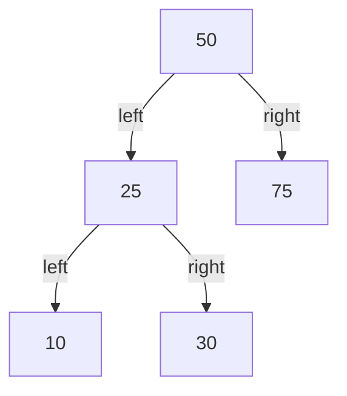
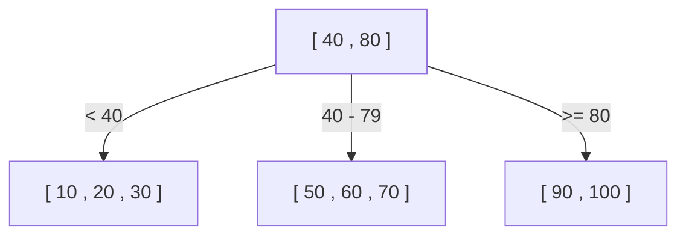
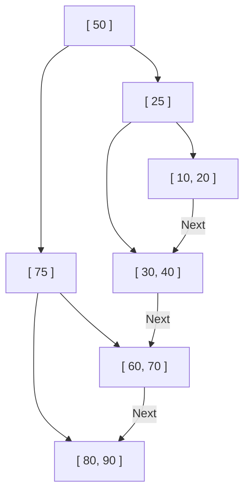

데이터베이스가 수천만, 수억 개의 레코드 중에서 순식간에 원하는 데이터를 찾아낼 수 있는 이유는 무엇일까요? 그 이면에는 '인덱스'라는 메커니즘이 있으며, 이 인덱스를 뒷받침하는 핵심 데이터 구조가 **B트리(B-Tree)**와 **B+트리(B+Tree)**입니다.

이 글에서는 단순한 이진 탐색 트리에서 시작하여, 왜 관계형 데이터베이스(RDB)가 B+트리를 채택하게 되었는지 그 진화 과정과 내부 구조를 깊이 있게 파헤쳐 설명합니다.

## 1. 이진 탐색 트리(BST)의 한계

데이터 검색을 고속화하는 데이터 구조로 가장 먼저 떠오르는 것은 '이진 탐색 트리(Binary Search Tree: BST)'일 것입니다. 이진 탐색 트리는 각 노드가 최대 2개의 자식을 가지며, 왼쪽 자식은 부모보다 작고 오른쪽 자식은 부모보다 큰 성질을 가집니다. 이상적인 상태라면 검색 계산량은 $O(\log N)$이 되어 매우 빠릅니다.

하지만 이진 탐색 트리를 그대로 데이터베이스 인덱스로 채택하기에는 치명적인 문제가 있습니다.

### 트리의 균형 붕괴
데이터가 정렬된 상태로 계속 삽입되면, 이진 탐색 트리는 일직선의 연결 리스트처럼 되어 검색 효율이 $O(N)$까지 악화됩니다. 이를 방지하기 위해 AVL 트리나 레드-블랙 트리와 같은 '균형 이진 탐색 트리'가 존재하며, 트리의 높이를 $\log N$으로 유지하도록 자동으로 균형을 조정합니다.

### 디스크 I/O의 벽
가장 큰 과제는 **디스크 I/O(입출력)**에 있습니다. 메모리 상의 조작이라면 균형 이진 탐색 트리로 충분히 빠르지만, 데이터베이스의 인덱스는 일반적으로 디스크(HDD나 SSD)에 저장됩니다.
디스크에서 데이터를 읽어오는 것은 CPU 연산이나 메모리 접근에 비해 압도적으로 느린 처리입니다. 게다가 디스크는 1바이트씩 데이터를 읽는 것이 아니라, **'블록' 또는 '페이지'라고 불리는 일정한 단위(예: 4KB 또는 8KB)로 읽고 씁니다**.

이진 탐색 트리에서는 1개의 노드가 가지는 데이터 양이 적어 트리의 '높이(깊이)'가 깊어지기 쉽습니다. 트리가 깊다는 것은 루트에서 목적하는 리프 노드(leaf node)에 도달하기까지 많은 노드를 거쳐야 한다는 것을 의미하며, 노드마다 다른 디스크 페이지를 읽어오게 되면 막대한 디스크 I/O가 발생하여 성능이 현저히 저하됩니다.

## 2. B트리(B-Tree): 높이를 줄이고 I/O를 최소화한다

디스크 I/O 횟수를 줄이기 위한 접근 방식은 명확합니다. **'트리의 높이를 가능한 한 낮게(얕게) 만드는 것'**입니다. 이를 위해서는 하나의 노드가 2개가 아니라 훨씬 더 많은 자식 노드(수십~수백 개)를 가질 수 있어야 합니다.
이것이 **B트리(B-Tree)**의 기본 사상입니다.

B트리는 '다원 탐색 트리'의 일종으로, 다음과 같은 특징을 가집니다.
- 하나의 노드에 여러 개의 키(데이터)를 저장한다.
- 노드의 크기를 디스크의 페이지 크기(예: 4KB나 8KB)에 맞춤으로써, 한 번의 디스크 I/O로 많은 키를 한꺼번에 메모리에 읽어 들일 수 있도록 한다.
- 항상 완전한 균형을 유지한다(모든 리프 노드가 같은 깊이에 있다).

### B트리의 검색 알고리즘
1. 루트 노드를 디스크에서 읽어온다.
2. 노드 내의 키 배열을 스캔(또는 이진 탐색)하여 목적하는 값이 포함된 자식 노드의 포인터를 찾는다.
3. 포인터가 가리키는 자식 노드를 디스크에서 읽어오고 같은 절차를 반복한다.
4. 목적하는 키를 찾으면, 거기에 연결된 데이터(또는 디스크 상의 실제 데이터에 대한 포인터)를 가져온다.

예를 들어, 하나의 노드가 100개의 키를 가질 수 있는 B트리가 있다고 가정해 봅시다.
높이가 3(루트, 중간, 리프)인 B트리라도 $100 \times 100 \times 100 = 1,000,000$(100만) 건의 데이터를 저장할 수 있습니다. 즉, 100만 건의 데이터 중에서 원하는 1건을 찾는 데 **최대 3번의 디스크 I/O**면 충분하다는 것입니다. 이진 탐색 트리에서는 높이가 약 20이 되어 20번의 I/O가 발생하는 것과 비교하면 획기적인 개선입니다.

## 3. B+트리(B+Tree): RDB에서의 궁극적인 진화 형태

B트리는 매우 뛰어난 데이터 구조지만, MySQL(InnoDB)이나 PostgreSQL과 같은 현대의 관계형 데이터베이스는 B트리의 파생형인 **B+트리(B+Tree)**를 인덱스로 채택하고 있습니다.

왜 B트리가 아니라 B+트리일까요? 그 이유는 '범위 검색(Range Query)'과 '순차 접근(Sequential Access)'의 압도적인 효율화에 있습니다.

### B트리와 B+트리의 차이
B+트리는 B트리에 대해 다음과 같은 중요한 변경 사항을 더했습니다.

1. **데이터는 모두 리프(Leaf) 노드에만 저장된다**
   - B트리에서는 루트 노드나 중간 노드에도 실제 데이터(또는 실제 데이터에 대한 포인터)가 저장되었습니다.
   - B+트리에서는 루트와 중간 노드는 **'이정표(인덱스 키)'만** 가지며 실제 데이터는 전혀 가지지 않습니다. 모든 실제 데이터는 최하층의 리프 노드에 배치됩니다.

2. **리프 노드끼리 양방향 연결 리스트로 이어져 있다**
   - 인접한 리프 노드들은 서로 포인터를 가지고 있어, 가로 방향으로 한 붓 그리기처럼 데이터를 따라갈 수 있습니다.

### B+트리가 RDB에 최적인 이유

#### 1. 노드당 키 수(팬아웃)의 증가
루트나 중간 노드가 실제 데이터를 가지지 않기 때문에, 1개의 노드에 저장할 수 있는 '키와 포인터'의 수를 크게 늘릴 수 있습니다. 예를 들어, 페이지 크기가 같은 4KB라고 할 때, B트리에서는 데이터도 들어가기 때문에 노드당 50개밖에 가질 수 없던 것이, B+트리에서는 키만 있으므로 500개를 가질 수 있게 됩니다.
이로 인해 트리의 높이가 더욱 낮아져 디스크 I/O가 감소합니다.

#### 2. 범위 검색(Range Query)의 엄청난 속도 향상
데이터베이스에서는 `SELECT * FROM users WHERE age BETWEEN 20 AND 30;`과 같은 범위 검색이 빈번하게 발생합니다.
B트리에서 이를 수행할 경우, 조건에 맞는 데이터를 찾기 위해 트리를 여러 번 오르내려야(순회, traverse) 하며, 불필요한 I/O가 발생합니다.
반면, B+트리의 경우는:
1. 먼저 트리를 위에서 아래로 따라가 시작 지점인 `age = 20`의 리프 노드를 찾습니다.
2. 나머지는 리프 노드끼리 연결된 '연결 리스트'를 조건(`age <= 30`)이 끝날 때까지 가로 방향(순차적)으로 읽어나가기만 하면 됩니다.
디스크는 순차 접근(연속 읽기)이 매우 빠르기 때문에, 이 특성은 디스크 I/O 관점에서 압도적인 이점을 창출합니다.

## 4. 노드의 분할(Split)과 삽입·삭제 알고리즘

인덱스는 데이터가 추가·삭제될 때마다 항상 균형을 유지해야 합니다. B+트리는 자동으로 균형을 유지하는 알고리즘을 가지고 있습니다.

### 삽입과 분할(Split)
새로운 키를 삽입할 때, 먼저 검색과 같은 절차로 대상이 되는 리프 노드를 찾고 거기에 키를 추가합니다.
만약 그 노드가 이미 꽉 찼다면(상한에 도달했다면), **노드의 분할(Split)**이 발생합니다.
1. 꽉 찬 노드의 키를 반으로 나누어, 새로운 노드를 2개(또는 기존 노드와 1개의 새 노드)로 만듭니다.
2. 분할된 중앙의 키를 **부모 노드로 끌어올립니다(프로모트, Promote)**.
3. 만약 부모 노드도 꽉 찼다면 부모 노드도 분할되며, 나아가 그 부모로 연쇄적인 분할이 위로 전파됩니다.
4. 최종적으로 루트 노드까지 분할이 도달한 경우, 새로운 루트 노드가 생성되고 여기서 비로소 **트리의 높이가 1단계 깊어집니다**.

이러한 상향식(bottom-up) 구축 과정을 통해, B+트리는 항상 리프 노드까지의 거리(깊이)가 완전히 일치하는 '완전 평형'을 유지합니다.

## 5. 요약

데이터베이스가 고속 검색을 실현할 수 있는 것은 디스크 I/O라는 물리적인 병목 현상을 깊이 이해하고 이를 최소화하도록 설계된 **B+트리** 덕분입니다.
- 트리의 '높이'를 극한까지 낮추어 적은 읽기 횟수로 데이터에 도달한다.
- 데이터를 리프 노드에 집중시켜 인덱스 노드의 밀도를 높인다.
- 리프 노드를 연결 리스트로 이어 범위 검색 시의 순차적인 디스크 접근을 가능하게 한다.

단순한 '알고리즘 계산량'뿐만 아니라 '하드웨어의 특성(디스크 페이지 접근)'에 최적화되어 있다는 점이야말로, B+트리가 수십 년에 걸쳐 데이터베이스의 왕좌에 계속 군림하는 가장 큰 이유입니다.
