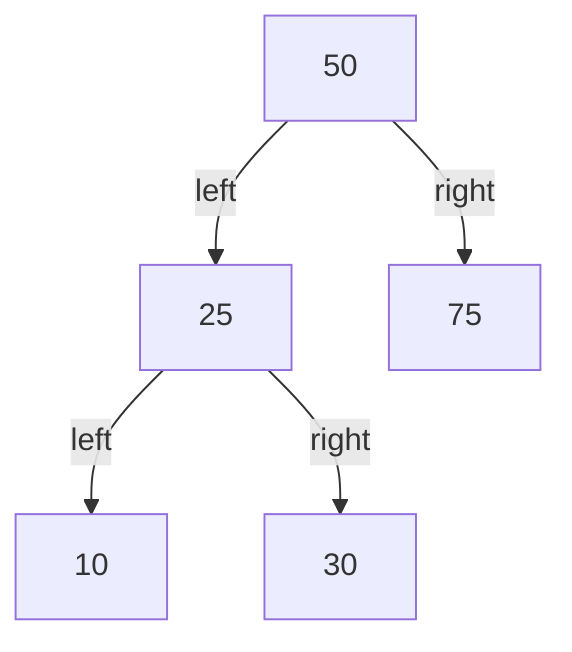
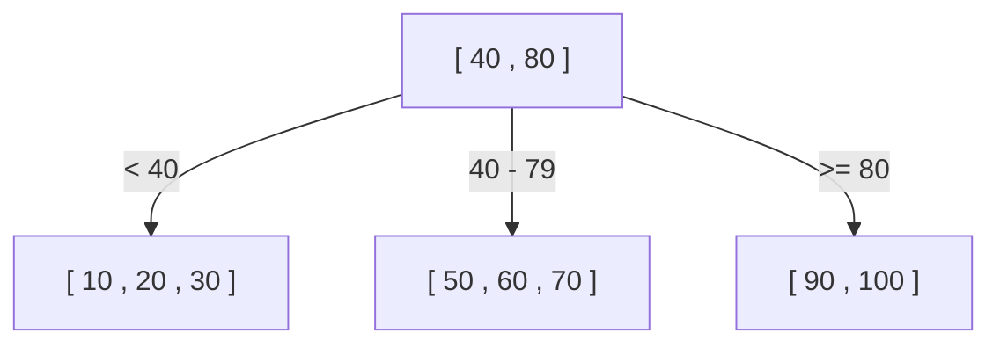
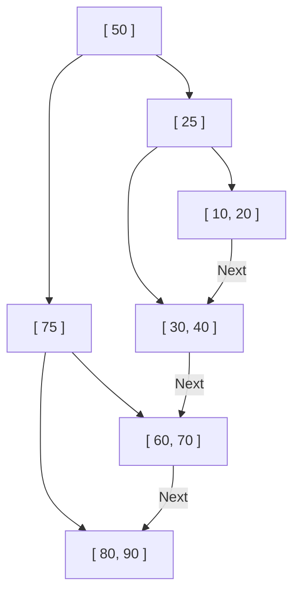

データベースが何千万、何億というレコードの中から、ほんの一瞬で目的のデータを見つけ出せるのはなぜでしょうか。その背後には「インデックス」と呼ばれる仕組みがあり、そのインデックスを支えている中心的なデータ構造が**B木（B-Tree）**および**B+木（B+Tree）**です。

本記事では、単純な二分探索木から始まり、なぜリレーショナルデータベース（RDB）がB+木を採用するに至ったのか、その進化の過程と内部構造を深く掘り下げて解説します。

## 1. 二分探索木（BST）の限界

データ検索を高速化するデータ構造として、最初に思い浮かぶのは「二分探索木（Binary Search Tree: BST）」かもしれません。二分探索木は、各ノードが最大2つの子を持ち、左の子は親より小さく、右の子は親より大きいという性質を持ちます。理想的な状態であれば、検索計算量は $O(\log N)$ となり、非常に高速です。

しかし、二分探索木をそのままデータベースのインデックスとして採用するには、致命的な問題があります。

### ツリーのバランス崩壊
データがソートされた状態で挿入され続けると、二分探索木は一直線の連結リストのようになり、検索効率が $O(N)$ まで悪化します。これを防ぐために、AVL木や赤黒木といった「平衡二分探索木」が存在し、ツリーの高さを $\log N$ に保つように自動的にバランスを調整します。

### ディスクI/Oの壁
最大の課題は**ディスクI/O（入出力）**にあります。メモリ上の操作であれば平衡二分探索木で十分高速ですが、データベースのインデックスは通常ディスク（HDDやSSD）に保存されます。
ディスクからのデータ読み込みは、CPUの演算やメモリのアクセスに比べて圧倒的に遅い処理です。さらに、ディスクは1バイトずつデータを読むのではなく、**「ブロック」または「ページ」と呼ばれるまとまった単位（例えば4KBや8KB）で読み書き**を行います。

二分探索木では、1つのノードが持つデータ量が小さく、ツリーの「高さ（深さ）」が深くなりがちです。ツリーが深いということは、ルートから目的の葉ノードに到達するまでに多数のノードを辿る必要があり、ノードごとに異なるディスクのページを読み込むことになれば、膨大なディスクI/Oが発生し、パフォーマンスが著しく低下します。

## 2. B木（B-Tree）：高さを抑え、I/Oを最小化する

ディスクI/Oの回数を減らすためのアプローチは明確です。「**ツリーの高さを可能な限り低く（浅く）する**」ことです。そのためには、1つのノードが2つではなく、もっと多くの子ノード（数十〜数百）を持てるようにする必要があります。
これが**B木（B-Tree）**の基本思想です。

B木は、「多分木」の一種であり、以下の特徴を持ちます。
- 1つのノードに複数のキー（データ）を格納する。
- ノードのサイズをディスクのページサイズ（例：4KBや8KB）に合わせることで、1回のディスクI/Oで多くのキーを一度にメモリに読み込めるようにする。
- 常に完全なバランスを保つ（すべての葉ノードが同じ深さにある）。

### B木の検索アルゴリズム
1. ルートノードをディスクから読み込む。
2. ノード内のキー配列をスキャン（または二分探索）し、目的の値が含まれる子ノードのポインタを見つける。
3. ポインタが示す子ノードをディスクから読み込み、同じ手順を繰り返す。
4. 目的のキーを見つけたら、それに紐づくデータ（またはディスク上の実データへのポインタ）を取得する。

例えば、1つのノードが100個のキーを持てるB木があったとします。
高さが3（ルート、中間、葉）のB木でも、$100 \times 100 \times 100 = 1,000,000$（100万）件のデータを格納できます。つまり、100万件のデータの中から目的の1件を探すのに、**最大でも3回のディスクI/O**で済むことになります。二分探索木では高さが約20になり、20回のI/Oが発生するのと比べると、劇的な改善です。

## 3. B+木（B+Tree）：RDBにおける究極の進化形

B木は非常に優秀なデータ構造ですが、MySQL（InnoDB）やPostgreSQLなどの現代のリレーショナルデータベースは、B木の派生形である**B+木（B+Tree）**をインデックスとして採用しています。

なぜB木ではなくB+木なのか？その理由は「範囲検索（Range Query）」と「シーケンシャルアクセス」の圧倒的な効率化にあります。

### B木とB+木の違い
B+木は、B木に対して以下の重要な変更を加えています。

1. **データはすべて葉（Leaf）ノードにのみ格納される**
   - B木では、ルートノードや中間ノードにも実データ（または実データへのポインタ）が格納されていました。
   - B+木では、ルートと中間ノードは**「道しるべ（インデックスキー）」のみ**を持ち、実データは一切持ちません。すべての実データは最下層の葉ノードに置かれます。

2. **葉ノード同士が双方向連結リストで繋がっている**
   - 隣り合う葉ノードは互いにポインタを持っており、横方向へ一筆書きのようにデータを辿ることができます。

### B+木がRDBに最適な理由

#### 1. ノードあたりのキー数（ファンアウト）の増加
ルートや中間ノードが実データを持たないため、1つのノードに格納できる「キーとポインタ」の数を大幅に増やすことができます。例えば、ページサイズが同じ4KBだとした場合、B木ではデータも入るためノードあたり50個しか持てなかったものが、B+木ではキーのみなので500個持てるようになります。
これによりツリーの高さがさらに低くなり、ディスクI/Oが削減されます。

#### 2. 範囲検索（Range Query）の爆速化
データベースでは `SELECT * FROM users WHERE age BETWEEN 20 AND 30;` のような範囲検索が頻繁に行われます。
B木でこれを行う場合、条件に合致するデータを探すためにツリーを何度も行ったり来たり（トラバース）しなければならず、無駄なI/Oが発生します。
一方、B+木の場合は：
1. まずツリーを上から下に辿り、開始地点である `age = 20` の葉ノードを見つける。
2. あとは葉ノード同士が繋がっている「連結リスト」を、条件（`age <= 30`）が終わるまで横方向（シーケンシャル）に読み進めるだけです。
ディスクはシーケンシャルアクセス（連続読み込み）が非常に高速であるため、この特性はディスクI/Oの観点で圧倒的なメリットを生み出します。

## 4. ノードの分割（Split）と挿入・削除のアルゴリズム

インデックスはデータが追加・削除されるたびに、常にバランスを維持しなければなりません。B+木は自動的にバランスを保つアルゴリズムを持っています。

### 挿入と分割（Split）
新しいキーを挿入する際、まず検索と同じ手順で対象となる葉ノードを見つけ、そこにキーを追加します。
もしそのノードが既に満杯（上限に達している）だった場合、**ノードの分割（Split）**が発生します。
1. 満杯のノードのキーを半分に分け、新しいノードを2つ（または元のノードともう1つの新ノード）にします。
2. 分割された中央のキーを、**親ノードに引き上げ（プロモート）**ます。
3. もし親ノードも満杯だった場合は、親ノードも分割され、さらにその親へと連鎖的に分割が上へ伝播します。
4. 最終的にルートノードまで分割が到達した場合、新しいルートノードが作成され、ここで初めて**ツリーの高さが1段深く**なります。

このボトムアップの構築プロセスにより、B+木は常に葉ノードまでの距離（深さ）が完全に一致する「完全平衡」を保ちます。

## 5. まとめ

データベースが高速な検索を実現できるのは、ディスクI/Oという物理的なボトルネックを深く理解し、それを最小化するように設計された**B+木**のおかげです。
- ツリーの「高さ」を極限まで低くし、少ない読み込み回数でデータに到達する。
- データを葉ノードに集中させ、インデックスノードの密度を上げる。
- 葉ノードを連結リストで繋ぎ、範囲検索時のシーケンシャルなディスクアクセスを可能にする。

単なる「アルゴリズムの計算量」だけでなく、「ハードウェアの特性（ディスクのページアクセス）」に最適化されている点こそが、B+木が数十年にわたりデータベースの王座に君臨し続ける最大の理由です。
